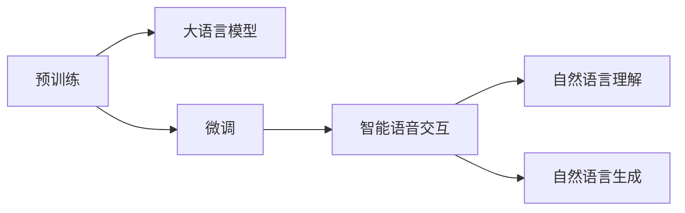

                 

## 1. 背景介绍

语音交互是下一代人机交互的关键形式，随着物联网设备的普及和智能音箱、智能助手等产品的兴起，智能语音交互技术的需求日益旺盛。大语言模型（Large Language Model, LLM）在自然语言处理（Natural Language Processing, NLP）领域的巨大成功，使其成为构建智能语音交互系统的重要工具。本文将详细介绍LLM在智能语音交互中的角色定位，包括核心概念、算法原理、实践示例和未来展望。

## 2. 核心概念与联系

### 2.1 核心概念概述

**大语言模型**：一种基于深度神经网络的模型，通常具有大规模参数量，通过预训练在大量无标注数据上学习语言知识和语义表示。典型的大语言模型包括BERT、GPT系列、RoBERTa等。

**智能语音交互**：指通过语音识别和自然语言理解技术，使用语音作为输入和输出，与用户进行对话和交互的系统。智能语音交互系统可以应用于智能家居、智能客服、智能驾驶等领域。

**预训练-微调**：首先在大规模无标签数据上进行预训练，然后针对特定任务使用小规模有标签数据进行微调的过程。预训练步骤是LLM的核心技术之一，通过预训练获得语言模型；微调步骤则是根据任务特点优化模型参数。

**自然语言理解**：指将自然语言转化为机器能够理解的语义表示，是智能语音交互系统的核心组件。自然语言理解通常包括语音识别、语音转文本、词性标注、命名实体识别、句法分析等子任务。

**自然语言生成**：指根据语义表示生成自然语言文本，是智能语音交互系统的关键功能之一。自然语言生成通常包括文本转语音、对话生成、摘要生成等任务。

这些核心概念通过Mermaid流程图展示了其相互关系，其中预训练是大语言模型的初始步骤，微调是模型针对特定任务进行优化的过程，自然语言理解负责将语音输入转换为语义表示，自然语言生成则负责将语义表示转换为语音输出。



### 2.2 核心概念原理和架构

大语言模型的预训练和微调过程可以总结如下：

1. **预训练**：在大规模无标签数据上训练语言模型，学习语言的基本规律和语义表示。预训练任务包括语言建模、掩码语言模型、句子顺序预测等。这些任务旨在学习单词之间的关联性、语义结构和语言节奏等语言特征。

2. **微调**：在特定任务上，使用小规模有标签数据对预训练模型进行优化，使其能够适应特定的应用场景。微调任务包括命名实体识别、问答系统、情感分析、文本摘要等。

3. **自然语言理解**：将语音输入转换为语义表示，通常使用语音识别技术将语音转换为文本，然后使用自然语言处理技术进行分词、词性标注、命名实体识别、句法分析等。

4. **自然语言生成**：将语义表示转换为语音输出，通常使用文本转语音技术生成语音，或使用生成式对话模型进行对话生成。

这些过程通过深度学习框架（如PyTorch、TensorFlow）和模型库（如HuggingFace的Transformers）得以实现。

## 3. 核心算法原理 & 具体操作步骤

### 3.1 算法原理概述

基于大语言模型的智能语音交互系统主要分为三个步骤：预训练、微调和应用。以下是每个步骤的算法原理概述：

1. **预训练**：通过在大规模无标签数据上训练语言模型，学习语言的基本规律和语义表示。以BERT为例，使用掩码语言模型和句子顺序预测等任务进行预训练，获得高质量的语义表示。

2. **微调**：在特定任务上，使用小规模有标签数据对预训练模型进行优化，使其能够适应特定的应用场景。以命名实体识别为例，将标注数据输入微调模型，通过反向传播更新模型参数，使其在命名实体识别任务上表现优异。

3. **应用**：将预训练和微调后的模型应用于智能语音交互系统，通过自然语言理解和自然语言生成技术实现语音输入和输出。以对话系统为例，将用户语音输入转换为文本，使用生成式对话模型生成响应，并转换为语音输出。

### 3.2 算法步骤详解

以智能客服系统为例，详细讲解基于大语言模型的智能语音交互系统的开发步骤：

1. **数据收集**：收集客服系统的历史对话记录，将问题-回答对标注为监督数据。

2. **预训练模型选择**：选择预训练语言模型（如BERT）作为初始化参数，如HuggingFace的"bert-base-cased"。

3. **微调模型训练**：在微调模型中添加任务适配层，如分类层或生成层，使用监督数据训练模型，优化模型参数。

4. **自然语言理解**：使用语音识别技术将用户语音转换为文本，进行分词、词性标注、命名实体识别等。

5. **自然语言生成**：使用生成式对话模型生成响应文本，使用文本转语音技术转换为语音输出。

6. **系统集成**：将微调后的模型集成到智能客服系统中，提供实时对话服务。

### 3.3 算法优缺点

基于大语言模型的智能语音交互系统具有以下优点：

1. **高效性**：通过预训练和微调，模型能够快速适应特定任务，提高系统效率。

2. **鲁棒性**：大语言模型能够学习到通用的语言知识，在面对不同领域的语音输入时表现稳定。

3. **可扩展性**：通过微调，可以适应不同的任务和应用场景，灵活性强。

同时，也存在以下缺点：

1. **资源消耗高**：大语言模型的参数量较大，需要高性能计算资源进行训练和推理。

2. **对数据依赖大**：微调模型的性能很大程度上取决于标注数据的质量和数量。

3. **可解释性差**：大语言模型通常被视为"黑盒"，难以解释其内部工作机制和决策逻辑。

4. **易受攻击**：大语言模型容易受到对抗样本攻击，导致输出错误。

### 3.4 算法应用领域

基于大语言模型的智能语音交互系统在多个领域中得到广泛应用，例如：

- **智能客服**：用于处理用户咨询，提供24小时不间断服务。
- **智能家居**：用于控制家电设备，提高家居生活的智能化水平。
- **智能驾驶**：用于辅助驾驶员进行导航和决策，提高行车安全性。
- **智能医疗**：用于解答患者咨询，提供初步的医疗建议。
- **智能金融**：用于处理客户咨询，提供金融产品的推荐和解答。

## 4. 数学模型和公式 & 详细讲解 & 举例说明

### 4.1 数学模型构建

以BERT为例，其预训练和微调过程可以通过以下数学模型进行描述：

1. **预训练模型**：
   $$
   \theta = \text{BERT}_{\text{pretrained}}(\mathcal{D}_{\text{pretrain}})
   $$

2. **微调模型**：
   $$
   \theta = \text{BERT}_{\text{fine-tuned}}(\mathcal{D}_{\text{task}})
   $$

其中，$\theta$为模型参数，$\mathcal{D}_{\text{pretrain}}$和$\mathcal{D}_{\text{task}}$分别为预训练数据集和微调数据集。

### 4.2 公式推导过程

以BERT为例，其预训练和微调的损失函数分别为：

1. **预训练损失**：
   $$
   \mathcal{L}_{\text{pretrain}} = -\frac{1}{N} \sum_{i=1}^N \log p(x_i \mid \theta)
   $$

2. **微调损失**：
   $$
   \mathcal{L}_{\text{task}} = -\frac{1}{N} \sum_{i=1}^N \log p(y_i \mid x_i, \theta)
   $$

其中，$p(x_i \mid \theta)$和$p(y_i \mid x_i, \theta)$分别为预训练和微调的模型概率分布。

### 4.3 案例分析与讲解

以智能客服系统为例，其微调过程可以如下描述：

1. **数据准备**：收集客服系统的历史对话记录，将问题-回答对标注为监督数据。

2. **模型选择**：选择BERT作为初始化参数，如HuggingFace的"bert-base-cased"。

3. **任务适配层设计**：在模型顶层添加分类层或生成层，用于处理命名实体识别或对话生成等任务。

4. **微调训练**：使用监督数据训练模型，优化模型参数。

5. **应用部署**：将微调后的模型部署到智能客服系统中，提供实时对话服务。

## 5. 项目实践：代码实例和详细解释说明

### 5.1 开发环境搭建

在搭建开发环境时，需要考虑以下因素：

1. **计算资源**：使用高性能计算资源（如GPU、TPU）进行模型训练。

2. **开发框架**：选择深度学习框架（如PyTorch、TensorFlow）和模型库（如HuggingFace的Transformers）。

3. **工具支持**：使用Jupyter Notebook、TensorBoard等工具进行开发和调试。

### 5.2 源代码详细实现

以智能客服系统为例，以下是使用Python和PyTorch进行BERT微调的代码实现：

```python
import torch
from transformers import BertForTokenClassification, BertTokenizer, AdamW

# 初始化BERT模型和tokenizer
model = BertForTokenClassification.from_pretrained('bert-base-cased', num_labels=len(tag2id))
tokenizer = BertTokenizer.from_pretrained('bert-base-cased')

# 加载标注数据集
train_dataset = NERDataset(train_texts, train_tags, tokenizer)

# 定义模型和优化器
optimizer = AdamW(model.parameters(), lr=2e-5)

# 微调训练
for epoch in range(5):
    loss = train_epoch(model, train_dataset, optimizer)
    print(f"Epoch {epoch+1}, train loss: {loss:.3f}")

# 应用部署
# 将微调后的模型部署到智能客服系统中，提供实时对话服务
```

### 5.3 代码解读与分析

上述代码实现包括以下关键步骤：

1. **模型加载**：加载预训练的BERT模型和对应的tokenizer。

2. **数据准备**：加载标注数据集，进行预处理，构建NERDataset。

3. **模型训练**：定义优化器，执行5轮微调训练，计算并打印训练损失。

4. **应用部署**：将微调后的模型部署到智能客服系统中，提供实时对话服务。

## 6. 实际应用场景

### 6.1 智能客服系统

智能客服系统是BERT在智能语音交互中最典型的应用之一。通过微调BERT，可以实现实时对话，解答用户咨询，提升客户满意度。

### 6.2 智能家居系统

智能家居系统可以通过微调BERT，实现语音控制家电设备，提供语音指令识别和响应。

### 6.3 智能驾驶系统

智能驾驶系统可以通过微调BERT，实现语音导航和决策辅助，提高行车安全性。

### 6.4 未来应用展望

未来，基于大语言模型的智能语音交互技术将向以下方向发展：

1. **多模态交互**：将语音、图像、视频等多种模态信息结合，提升交互体验和智能水平。

2. **情感识别**：通过微调模型，实现用户情感状态的实时识别，提供个性化的交互服务。

3. **语言生成**：使用生成式对话模型，实现更加流畅、自然的语音生成。

4. **跨语言交互**：通过多语言预训练和微调，实现跨语言的智能语音交互。

## 7. 工具和资源推荐

### 7.1 学习资源推荐

1. **《自然语言处理入门》**：详细介绍自然语言处理的基本概念和经典模型。

2. **《深度学习与自然语言处理》**：介绍深度学习在自然语言处理中的应用。

3. **《大语言模型技术手册》**：全面介绍大语言模型的预训练和微调技术。

4. **HuggingFace官方文档**：提供丰富的预训练模型和微调示例代码。

5. **NLP领域顶级会议论文**：如ACL、EMNLP、NAACL等，获取最新研究成果。

### 7.2 开发工具推荐

1. **PyTorch**：深度学习框架，支持动态计算图。

2. **TensorFlow**：深度学习框架，支持静态计算图。

3. **Transformers**：自然语言处理库，提供丰富的预训练模型。

4. **Jupyter Notebook**：交互式开发环境，支持多种编程语言。

5. **TensorBoard**：模型训练的可视化工具。

### 7.3 相关论文推荐

1. **BERT: Pre-training of Deep Bidirectional Transformers for Language Understanding**：提出BERT模型，引入掩码语言模型和句子顺序预测任务，取得SOTA性能。

2. **GPT-3: Language Models are Unsupservised Multitask Learners**：展示GPT-3在各种任务上的零样本学习能力。

3. **Large-Scale Conversational Agent Training Using Pre-trained Language Models**：介绍使用预训练语言模型进行对话系统的训练。

4. **AdaLoRA: Adaptive Low-Rank Adaptation for Parameter-Efficient Fine-Tuning**：提出AdaLoRA方法，用于参数高效微调。

5. **Adaptive Token Generation for Conversational Pre-training**：提出Adaptive Token Generation方法，用于生成式对话模型的预训练。

## 8. 总结：未来发展趋势与挑战

### 8.1 研究成果总结

本文系统介绍了大语言模型在智能语音交互中的角色定位，包括核心概念、算法原理和具体实现。通过案例分析，展示了其在智能客服、智能家居、智能驾驶等领域的实际应用。

### 8.2 未来发展趋势

未来，基于大语言模型的智能语音交互技术将呈现以下趋势：

1. **多模态交互**：将语音、图像、视频等多种模态信息结合，提升交互体验和智能水平。

2. **情感识别**：通过微调模型，实现用户情感状态的实时识别，提供个性化的交互服务。

3. **语言生成**：使用生成式对话模型，实现更加流畅、自然的语音生成。

4. **跨语言交互**：通过多语言预训练和微调，实现跨语言的智能语音交互。

### 8.3 面临的挑战

尽管大语言模型在智能语音交互中取得显著进展，但仍面临以下挑战：

1. **数据获取**：标注数据获取成本高，数据质量不稳定。

2. **模型鲁棒性**：模型对数据分布变化敏感，泛化性能不稳定。

3. **可解释性**：模型内部工作机制难以解释，缺乏透明性。

4. **隐私保护**：语音数据隐私保护难度大，需注意用户隐私保护。

5. **计算资源**：模型训练和推理消耗大量计算资源。

### 8.4 研究展望

未来，需要在以下几个方面进行深入研究：

1. **无监督学习**：探索无监督或半监督学习方法，降低对标注数据的依赖。

2. **多模态融合**：将语音、图像、视频等多种模态信息结合，提升交互体验和智能水平。

3. **可解释性**：开发可解释性更强的模型，提供透明的决策过程。

4. **隐私保护**：加强隐私保护技术，保护用户数据安全。

5. **计算效率**：优化模型结构和计算图，提升模型训练和推理效率。

## 9. 附录：常见问题与解答

### Q1: 大语言模型微调是否适用于所有NLP任务？

A: 大语言模型微调在大多数NLP任务上都能取得不错的效果，特别是在数据量较小的任务上。但对于一些特定领域的任务，如医学、法律等，仅通过通用语料预训练的模型可能难以很好地适应。此时需要在特定领域语料上进一步预训练，再进行微调，才能获得理想效果。

### Q2: 微调过程中如何选择合适的学习率？

A: 微调的学习率一般要比预训练时小1-2个数量级，如果使用过大的学习率，容易破坏预训练权重，导致过拟合。一般建议从1e-5开始调参，逐步减小学习率，直至收敛。也可以使用warmup策略，在开始阶段使用较小的学习率，再逐渐过渡到预设值。

### Q3: 大语言模型在智能语音交互中的资源消耗高吗？

A: 大语言模型的参数量较大，需要高性能计算资源进行训练和推理。但是，通过参数高效微调技术（如AdaLoRA），可以在保持性能的同时，减小模型参数量，降低计算资源消耗。

### Q4: 智能语音交互系统面临哪些挑战？

A: 智能语音交互系统面临以下挑战：

1. **数据获取**：标注数据获取成本高，数据质量不稳定。

2. **模型鲁棒性**：模型对数据分布变化敏感，泛化性能不稳定。

3. **可解释性**：模型内部工作机制难以解释，缺乏透明性。

4. **隐私保护**：语音数据隐私保护难度大，需注意用户隐私保护。

5. **计算资源**：模型训练和推理消耗大量计算资源。

---

作者：禅与计算机程序设计艺术 / Zen and the Art of Computer Programming

