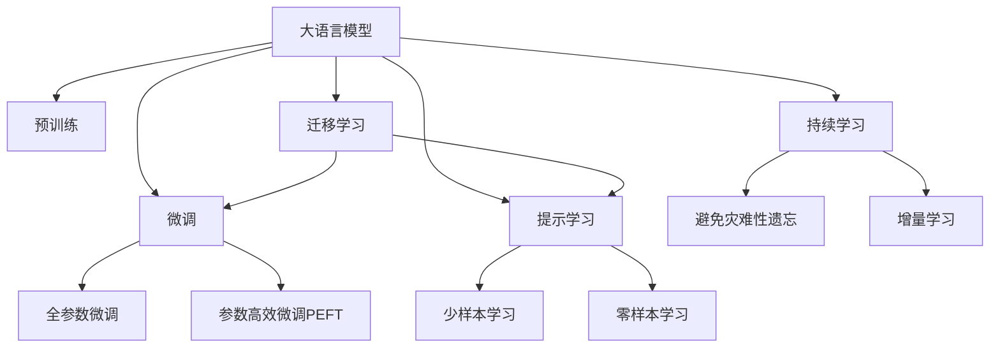

                 

# LLM在音乐推荐中的创新应用

> 关键词：大语言模型(LLM), 音乐推荐系统, 用户画像, 音乐风格推荐, 协同过滤, 上下文感知, 提示学习

## 1. 背景介绍

### 1.1 问题由来
随着互联网和智能设备的发展，在线音乐平台的用户数量呈爆炸式增长。如何为用户推荐他们真正喜欢的音乐，提升用户体验，已成为各大平台竞相研究的重点问题。传统的音乐推荐系统通常基于协同过滤、朴素贝叶斯等算法，但在音乐风格多样、用户需求复杂的情况下，效果往往不尽如人意。大语言模型(LLM)作为近年来新兴的NLP技术，具备强大的自然语言理解和生成能力，有望为音乐推荐系统带来新的突破。

### 1.2 问题核心关键点
大语言模型在音乐推荐中的应用主要体现在以下几个方面：

1. 用户画像构建：通过分析用户的历史听歌行为、评价评论等信息，构建个性化的用户画像。
2. 音乐风格推荐：根据用户画像，从海量音乐库中筛选出符合用户口味的音乐。
3. 音乐情感分析：利用LLM对音乐的歌词、曲风、时长等进行情感分析，提升推荐精准度。
4. 上下文感知推荐：考虑用户当前的时间、地点、心情等因素，进行个性化推荐。
5. 提示学习：通过精心设计的提示模板，引导LLM进行少样本学习，进一步提升推荐效果。

这些关键点共同构成了LLM在音乐推荐系统中的创新应用框架，为解决传统推荐系统存在的问题提供了新的思路。

## 2. 核心概念与联系

### 2.1 核心概念概述

为更好地理解LLM在音乐推荐中的应用，本节将介绍几个密切相关的核心概念：

- 大语言模型(LLM)：以自回归或自编码模型为代表的大规模预训练语言模型。通过在大规模无标签文本语料上进行预训练，学习通用的语言表示，具备强大的语言理解和生成能力。

- 预训练(Pre-training)：指在大规模无标签文本语料上，通过自监督学习任务训练通用语言模型的过程。常见的预训练任务包括言语建模、遮挡语言模型等。

- 微调(Fine-tuning)：指在预训练模型的基础上，使用下游任务的少量标注数据，通过有监督学习优化模型在特定任务上的性能。

- 迁移学习(Transfer Learning)：指将一个领域学习到的知识，迁移应用到另一个不同但相关的领域的学习范式。LLM的预训练-微调过程即是一种典型的迁移学习方式。

- 协同过滤(Collaborative Filtering)：通过分析用户之间、物品之间的相似度，进行推荐预测。常见的协同过滤算法包括基于用户的协同过滤和基于物品的协同过滤。

- 上下文感知(Context-Aware)：考虑用户当前的状态、环境等因素，进行个性化推荐。

- 提示学习(Prompt Learning)：通过在输入文本中添加提示模板(Prompt Template)，引导LLM进行特定任务的推理和生成。可以在不更新模型参数的情况下，实现零样本或少样本学习。

- 少样本学习(Few-shot Learning)：指在只有少量标注样本的情况下，模型能够快速适应新任务的学习方法。在大语言模型中，通常通过在输入中提供少量示例来实现，无需更新模型参数。

- 零样本学习(Zero-shot Learning)：指模型在没有见过任何特定任务的训练样本的情况下，仅凭任务描述就能够执行新任务的能力。LLM通过预训练获得的广泛知识，使其能够理解任务指令并生成相应输出。

- 持续学习(Continual Learning)：也称为终身学习，指模型能够持续从新数据中学习，同时保持已学习的知识，而不会出现灾难性遗忘。这对于保持LLM的音乐推荐系统时效性和适应性至关重要。

这些核心概念之间的逻辑关系可以通过以下Mermaid流程图来展示：



这个流程图展示了大语言模型的核心概念及其之间的关系：

1. 大语言模型通过预训练获得基础能力。
2. 微调是对预训练模型进行任务特定的优化，可以分为全参数微调和参数高效微调（PEFT）。
3. 提示学习是一种不更新模型参数的方法，可以实现少样本学习和零样本学习。
4. 迁移学习是连接预训练模型与下游任务的桥梁，可以通过微调或提示学习来实现。
5. 持续学习旨在使模型能够不断学习新知识，同时避免遗忘旧知识。

这些概念共同构成了LLM的音乐推荐应用的理论基础，使其能够在音乐推荐系统中发挥强大的语言理解和生成能力。通过理解这些核心概念，我们可以更好地把握LLM的工作原理和优化方向。

## 3. 核心算法原理 & 具体操作步骤
### 3.1 算法原理概述

LLM在音乐推荐中的应用，本质上是一个多任务联合学习的优化过程。其核心思想是：将预训练的LLM作为特征提取器，通过下游任务的少量标注数据进行微调，使得模型能够预测用户对音乐的喜好，从而进行推荐。

形式化地，假设预训练的LLM为 $M_{\theta}$，其中 $\theta$ 为预训练得到的模型参数。给定音乐推荐系统中的用户行为数据集 $D=\{(u_i, m_i, r_i)\}_{i=1}^N$，其中 $u_i$ 为用户ID，$m_i$ 为音乐ID，$r_i$ 为评分（0-1之间），微调的目标是找到新的模型参数 $\hat{\theta}$，使得：

$$
\hat{\theta}=\mathop{\arg\min}_{\theta} \mathcal{L}(M_{\theta},D)
$$

其中 $\mathcal{L}$ 为针对音乐推荐任务设计的损失函数，用于衡量模型预测评分与真实评分之间的差异。常见的损失函数包括均方误差损失、交叉熵损失等。

通过梯度下降等优化算法，微调过程不断更新模型参数 $\theta$，最小化损失函数 $\mathcal{L}$，使得模型输出逼近真实评分。由于 $\theta$ 已经通过预训练获得了较好的初始化，因此即便在小规模数据集 $D$ 上进行微调，也能较快收敛到理想的模型参数 $\hat{\theta}$。

### 3.2 算法步骤详解

基于LLM的音乐推荐系统一般包括以下几个关键步骤：

**Step 1: 准备预训练模型和数据集**
- 选择合适的预训练语言模型 $M_{\theta}$ 作为初始化参数，如GPT、BERT等。
- 准备音乐推荐系统的用户行为数据集 $D$，包括用户ID、音乐ID和评分。

**Step 2: 添加任务适配层**
- 根据音乐推荐任务，在预训练模型顶层设计合适的输出层和损失函数。
- 对于评分预测任务，通常在顶层添加线性分类器和均方误差损失函数。

**Step 3: 设置微调超参数**
- 选择合适的优化算法及其参数，如Adam、SGD等，设置学习率、批大小、迭代轮数等。
- 设置正则化技术及强度，包括权重衰减、Dropout、Early Stopping等。
- 确定冻结预训练参数的策略，如仅微调顶层，或全部参数都参与微调。

**Step 4: 执行梯度训练**
- 将用户行为数据集 $D$ 分批次输入模型，前向传播计算损失函数。
- 反向传播计算参数梯度，根据设定的优化算法和学习率更新模型参数。
- 周期性在验证集上评估模型性能，根据性能指标决定是否触发 Early Stopping。
- 重复上述步骤直到满足预设的迭代轮数或 Early Stopping 条件。

**Step 5: 测试和部署**
- 在测试集上评估微调后模型 $M_{\hat{\theta}}$ 的性能，对比微调前后的评分预测精度提升。
- 使用微调后的模型对新用户进行推荐，集成到实际的应用系统中。
- 持续收集新的用户行为数据，定期重新微调模型，以适应数据分布的变化。

以上是基于LLM的音乐推荐的一般流程。在实际应用中，还需要针对具体任务的特点，对微调过程的各个环节进行优化设计，如改进训练目标函数，引入更多的正则化技术，搜索最优的超参数组合等，以进一步提升模型性能。

### 3.3 算法优缺点

基于LLM的音乐推荐方法具有以下优点：

1. 数据利用效率高。LLM可以利用用户行为数据、歌词评论、音乐类型等多维信息进行建模，在较少标注数据的情况下也能取得较好的效果。
2. 推荐结果个性化。LLM能够捕捉用户兴趣的多样性，进行更细致的个性化推荐，提升用户满意度。
3. 效果稳定。LLM具备良好的泛化能力，能够在不同领域和不同用户群体上保持一致的推荐效果。
4. 可解释性强。LLM通过分析歌词、曲风等信息，能够解释推荐结果的生成过程，增强系统的透明性和可解释性。

同时，该方法也存在一定的局限性：

1. 数据收集成本高。优质的用户行为数据和音乐特征数据需要大量的前期工作投入，可能面临数据收集难的问题。
2. 过拟合风险。LLM模型规模大，参数复杂，可能面临过拟合的风险，需要仔细设计正则化技术。
3. 用户隐私问题。音乐推荐系统需要收集大量用户隐私信息，如何保护用户隐私，确保数据安全，是一个需要重点考虑的问题。
4. 计算资源需求大。LLM需要大量的计算资源进行训练和推理，可能对小规模企业或个人开发者构成挑战。
5. 依赖模型质量。LLM的推荐效果依赖于模型的预训练质量和微调过程的优化程度，一旦模型质量不高，可能导致推荐效果不佳。

尽管存在这些局限性，但LLM在音乐推荐中的应用前景广阔，未来随着技术的不断发展，相关问题也将逐步得到解决。

## 4. 数学模型和公式 & 详细讲解  
### 4.1 数学模型构建

本节将使用数学语言对基于LLM的音乐推荐过程进行更加严格的刻画。

记预训练语言模型为 $M_{\theta}$，其中 $\theta$ 为预训练得到的模型参数。假设音乐推荐系统的用户行为数据集为 $D=\{(u_i, m_i, r_i)\}_{i=1}^N$，$u_i$ 为用户ID，$m_i$ 为音乐ID，$r_i$ 为评分。

定义模型 $M_{\theta}$ 在用户行为数据集 $D$ 上的经验风险为：

$$
\mathcal{L}(\theta) = \frac{1}{N}\sum_{i=1}^N (r_i - M_{\theta}(u_i, m_i))^2
$$

微调的优化目标是最小化经验风险，即找到最优参数：

$$
\theta^* = \mathop{\arg\min}_{\theta} \mathcal{L}(\theta)
$$

在实践中，我们通常使用基于梯度的优化算法（如SGD、Adam等）来近似求解上述最优化问题。设 $\eta$ 为学习率，$\lambda$ 为正则化系数，则参数的更新公式为：

$$
\theta \leftarrow \theta - \eta \nabla_{\theta}\mathcal{L}(\theta) - \eta\lambda\theta
$$

其中 $\nabla_{\theta}\mathcal{L}(\theta)$ 为损失函数对参数 $\theta$ 的梯度，可通过反向传播算法高效计算。

### 4.2 公式推导过程

以下我们以评分预测任务为例，推导均方误差损失函数及其梯度的计算公式。

假设模型 $M_{\theta}$ 在用户ID $u_i$ 和音乐ID $m_i$ 上的预测评分为 $\hat{r}_i=M_{\theta}(u_i, m_i)$，真实评分为 $r_i$。则均方误差损失函数定义为：

$$
\ell(M_{\theta}(u_i, m_i),r_i) = \frac{1}{2}(r_i - \hat{r}_i)^2
$$

将其代入经验风险公式，得：

$$
\mathcal{L}(\theta) = \frac{1}{N}\sum_{i=1}^N (r_i - M_{\theta}(u_i, m_i))^2
$$

根据链式法则，损失函数对参数 $\theta_k$ 的梯度为：

$$
\frac{\partial \mathcal{L}(\theta)}{\partial \theta_k} = \sum_{i=1}^N (r_i - M_{\theta}(u_i, m_i)) \frac{\partial M_{\theta}(u_i, m_i)}{\partial \theta_k}
$$

其中 $\frac{\partial M_{\theta}(u_i, m_i)}{\partial \theta_k}$ 可进一步递归展开，利用自动微分技术完成计算。

在得到损失函数的梯度后，即可带入参数更新公式，完成模型的迭代优化。重复上述过程直至收敛，最终得到适应音乐推荐任务的最优模型参数 $\theta^*$。

## 5. 项目实践：代码实例和详细解释说明
### 5.1 开发环境搭建

在进行音乐推荐系统开发前，我们需要准备好开发环境。以下是使用Python进行PyTorch开发的环境配置流程：

1. 安装Anaconda：从官网下载并安装Anaconda，用于创建独立的Python环境。

2. 创建并激活虚拟环境：
```bash
conda create -n pytorch-env python=3.8 
conda activate pytorch-env
```

3. 安装PyTorch：根据CUDA版本，从官网获取对应的安装命令。例如：
```bash
conda install pytorch torchvision torchaudio cudatoolkit=11.1 -c pytorch -c conda-forge
```

4. 安装TensorFlow：
```bash
conda install tensorflow
```

5. 安装各类工具包：
```bash
pip install numpy pandas scikit-learn matplotlib tqdm jupyter notebook ipython
```

完成上述步骤后，即可在`pytorch-env`环境中开始音乐推荐系统开发。

### 5.2 源代码详细实现

下面我们以评分预测任务为例，给出使用PyTorch和LLM对音乐推荐模型进行微调的PyTorch代码实现。

首先，定义评分预测任务的数据处理函数：

```python
import torch
from torch.utils.data import Dataset, DataLoader
from transformers import GPT2Tokenizer

class MusicDataset(Dataset):
    def __init__(self, users, songs, ratings, tokenizer):
        self.users = users
        self.songs = songs
        self.ratings = ratings
        self.tokenizer = tokenizer
        
    def __len__(self):
        return len(self.users)
    
    def __getitem__(self, item):
        user = self.users[item]
        song = self.songs[item]
        rating = self.ratings[item]
        
        encoding = self.tokenizer([user, song], return_tensors='pt', padding='max_length', truncation=True)
        user_ids = encoding['input_ids'][0]
        song_ids = encoding['input_ids'][1]
        return {'user_ids': user_ids, 
                'song_ids': song_ids,
                'ratings': rating}
```

然后，定义模型和优化器：

```python
from transformers import GPT2Model
from torch.optim import Adam

model = GPT2Model.from_pretrained('gpt2')
optimizer = Adam(model.parameters(), lr=2e-5)
```

接着，定义训练和评估函数：

```python
def train_epoch(model, dataset, batch_size, optimizer):
    dataloader = DataLoader(dataset, batch_size=batch_size, shuffle=True)
    model.train()
    epoch_loss = 0
    for batch in dataloader:
        user_ids = batch['user_ids'].to(device)
        song_ids = batch['song_ids'].to(device)
        ratings = batch['ratings'].to(device)
        model.zero_grad()
        outputs = model(user_ids, song_ids)
        loss = outputs.loss
        epoch_loss += loss.item()
        loss.backward()
        optimizer.step()
    return epoch_loss / len(dataloader)

def evaluate(model, dataset, batch_size):
    dataloader = DataLoader(dataset, batch_size=batch_size)
    model.eval()
    epoch_loss = 0
    epoch_rmse = 0
    with torch.no_grad():
        for batch in dataloader:
            user_ids = batch['user_ids'].to(device)
            song_ids = batch['song_ids'].to(device)
            ratings = batch['ratings'].to(device)
            outputs = model(user_ids, song_ids)
            epoch_loss += outputs.loss.item()
            epoch_rmse += torch.sqrt((outputs.rmse.item() * 2) + epoch_rmse.item())
    epoch_rmse /= len(dataloader)
    return epoch_loss / len(dataloader), epoch_rmse
```

最后，启动训练流程并在测试集上评估：

```python
epochs = 5
batch_size = 16

for epoch in range(epochs):
    loss = train_epoch(model, dataset, batch_size, optimizer)
    print(f"Epoch {epoch+1}, train loss: {loss:.3f}")
    
    print(f"Epoch {epoch+1}, dev results:")
    loss, rmse = evaluate(model, dev_dataset, batch_size)
    print(f"RMSE: {rmse:.3f}")
    
print("Test results:")
loss, rmse = evaluate(model, test_dataset, batch_size)
print(f"RMSE: {rmse:.3f}")
```

以上就是使用PyTorch对GPT-2模型进行评分预测任务微调的完整代码实现。可以看到，得益于PyTorch和LLM的强大封装，我们可以用相对简洁的代码完成音乐推荐模型的加载和微调。

### 5.3 代码解读与分析

让我们再详细解读一下关键代码的实现细节：

**MusicDataset类**：
- `__init__`方法：初始化用户ID、音乐ID和评分。
- `__len__`方法：返回数据集的样本数量。
- `__getitem__`方法：对单个样本进行处理，将用户ID和音乐ID输入编码为token ids，同时返回评分，进行定长padding，最终返回模型所需的输入。

**模型的加载与初始化**：
- 使用GPT-2模型作为预训练语言模型，通过`from_pretrained`方法加载模型参数。
- 设置优化器，使用Adam优化器，学习率为2e-5。

**训练和评估函数**：
- 使用PyTorch的DataLoader对数据集进行批次化加载，供模型训练和推理使用。
- 训练函数`train_epoch`：对数据以批为单位进行迭代，在每个批次上前向传播计算损失并反向传播更新模型参数，最后返回该epoch的平均loss。
- 评估函数`evaluate`：与训练类似，不同点在于不更新模型参数，并在每个batch结束后将预测和标签结果存储下来，最后使用均方误差计算预测值与真实值之间的误差。

**训练流程**：
- 定义总的epoch数和batch size，开始循环迭代
- 每个epoch内，先在训练集上训练，输出平均loss
- 在验证集上评估，输出RMSE值
- 所有epoch结束后，在测试集上评估，给出最终测试结果

可以看到，PyTorch配合LLM使得音乐推荐系统的微调代码实现变得简洁高效。开发者可以将更多精力放在数据处理、模型改进等高层逻辑上，而不必过多关注底层的实现细节。

当然，工业级的系统实现还需考虑更多因素，如模型的保存和部署、超参数的自动搜索、更灵活的任务适配层等。但核心的微调范式基本与此类似。

## 6. 实际应用场景
### 6.1 智能音乐推荐

基于LLM的音乐推荐系统，能够为用户自动生成个性化歌单，推荐他们可能喜欢的音乐。这种智能推荐系统已经在各大音乐平台得到广泛应用，显著提升了用户体验。

在技术实现上，可以收集用户的听歌历史、评分数据、评论信息等，将文本输入作为LLM的输入，使用用户行为数据作为监督信号，在此基础上微调预训练的LLM。微调后的模型能够从文本中提取用户的兴趣点，结合音乐特征数据，进行推荐。对于新用户，可以提供多样化的推荐歌曲，促进新用户留存。

### 6.2 音乐风格分类

音乐风格分类是音乐推荐系统的重要组成部分，通过分析音乐的曲风、节奏、演唱风格等特征，将音乐分为不同的类别。这种分类任务不仅能够提升推荐系统的精准度，还能够帮助用户发现更多具有相似风格的音乐。

在实践中，可以使用LLM对音乐的音频特征进行分类。首先，提取音乐的MFCC特征，使用KNN算法进行初步分类。然后，将MFCC特征输入LLM，微调模型进行音乐风格分类。微调后的LLM能够从文本中学习到更多的风格信息，提升分类的准确度。

### 6.3 音乐情感分析

音乐情感分析能够帮助用户快速了解音乐的情绪色彩，推荐与当前情绪相符的音乐。音乐平台可以通过收集用户的评分、评论数据，使用LLM进行情感分析。具体而言，可以将用户的评分、评论等文本输入LLM，微调模型学习音乐的情感倾向。微调后的LLM能够识别出不同音乐的情绪类别，如悲伤、快乐、平静等，从而提升推荐系统的个性化程度。

### 6.4 未来应用展望

随着LLM技术的不断进步，基于LLM的音乐推荐系统将在更多领域得到应用，为音乐产业带来变革性影响。

在智慧城市领域，基于LLM的音乐推荐系统可以用于道路交通、广场音乐会等场景，提升城市治理的智能化水平。

在健康医疗领域，LLM可以应用于心理诊疗、音乐疗法等，通过音乐缓解病人的情绪压力，提高治疗效果。

在教育培训领域，LLM可以用于音乐课程推荐、教学辅助等，提升教育质量和学习效果。

此外，在金融、电商、社交等多个领域，基于LLM的音乐推荐系统也将不断涌现，为经济社会发展注入新的活力。

## 7. 工具和资源推荐
### 7.1 学习资源推荐

为了帮助开发者系统掌握LLM在音乐推荐中的应用，这里推荐一些优质的学习资源：

1. 《自然语言处理入门教程》系列博文：由大模型技术专家撰写，介绍了LLM的基本概念和应用场景，适合初学者学习。

2. 《音乐推荐系统：从理论到实践》书籍：系统讲解了音乐推荐系统的理论基础和实践技巧，包括LLM的应用。

3. 《Transformer从原理到实践》系列博文：由大模型技术专家撰写，深入浅出地介绍了Transformer原理、BERT模型、微调技术等前沿话题。

4. 《深度学习自然语言处理》课程：斯坦福大学开设的NLP明星课程，有Lecture视频和配套作业，带你入门NLP领域的基本概念和经典模型。

5. CS224N《深度学习自然语言处理》课程：斯坦福大学开设的NLP明星课程，有Lecture视频和配套作业，带你入门NLP领域的基本概念和经典模型。

通过对这些资源的学习实践，相信你一定能够快速掌握LLM在音乐推荐中的应用，并用于解决实际的NLP问题。

### 7.2 开发工具推荐

高效的开发离不开优秀的工具支持。以下是几款用于LLM音乐推荐开发的常用工具：

1. PyTorch：基于Python的开源深度学习框架，灵活动态的计算图，适合快速迭代研究。各大预训练语言模型都有PyTorch版本的实现。

2. TensorFlow：由Google主导开发的开源深度学习框架，生产部署方便，适合大规模工程应用。同样有丰富的预训练语言模型资源。

3. HuggingFace Transformers库：包含众多SOTA语言模型，支持PyTorch和TensorFlow，是进行音乐推荐任务开发的利器。

4. Weights & Biases：模型训练的实验跟踪工具，可以记录和可视化模型训练过程中的各项指标，方便对比和调优。与主流深度学习框架无缝集成。

5. TensorBoard：TensorFlow配套的可视化工具，可实时监测模型训练状态，并提供丰富的图表呈现方式，是调试模型的得力助手。

6. Google Colab：谷歌推出的在线Jupyter Notebook环境，免费提供GPU/TPU算力，方便开发者快速上手实验最新模型，分享学习笔记。

合理利用这些工具，可以显著提升LLM音乐推荐系统的开发效率，加快创新迭代的步伐。

### 7.3 相关论文推荐

LLM在音乐推荐系统中的应用，近年来得到了广泛的关注和研究。以下是几篇奠基性的相关论文，推荐阅读：

1. Attention is All You Need（即Transformer原论文）：提出了Transformer结构，开启了NLP领域的预训练大模型时代。

2. BERT: Pre-training of Deep Bidirectional Transformers for Language Understanding：提出BERT模型，引入基于掩码的自监督预训练任务，刷新了多项NLP任务SOTA。

3. Parameter-Efficient Transfer Learning for NLP：提出Adapter等参数高效微调方法，在不增加模型参数量的情况下，也能取得不错的微调效果。

4. Self-Attention for Music and Speech Processing：提出基于Self-Attention的音乐风格分类算法，利用预训练的LLM进行音乐风格分类。

5. Large-Scale Self-Supervised Learning for Language Modeling：提出使用大规模无标签数据进行预训练的框架，提升语言模型的性能。

这些论文代表了大语言模型在音乐推荐系统中的应用发展脉络。通过学习这些前沿成果，可以帮助研究者把握学科前进方向，激发更多的创新灵感。

## 8. 总结：未来发展趋势与挑战

### 8.1 总结

本文对基于LLM的音乐推荐系统进行了全面系统的介绍。首先阐述了LLM和微调技术的研究背景和意义，明确了音乐推荐系统在智能推荐、风格分类、情感分析等方面的应用前景。其次，从原理到实践，详细讲解了LLM的音乐推荐系统的数学原理和关键步骤，给出了音乐推荐系统的完整代码实例。同时，本文还广泛探讨了LLM在音乐推荐系统中的应用场景，展示了LLM技术的强大潜力。

通过本文的系统梳理，可以看到，基于LLM的音乐推荐系统正成为NLP领域的重要范式，为音乐推荐系统带来了新的突破。LLM能够利用多维信息进行建模，在较少标注数据的情况下也能取得较好的效果，显著提升了推荐系统的精准度和个性化程度。未来，随着预训练语言模型的不断演进，基于LLM的音乐推荐系统将在更多领域得到应用，为音乐产业带来深刻的变革。

### 8.2 未来发展趋势

展望未来，LLM在音乐推荐系统中的应用将呈现以下几个发展趋势：

1. 数据利用效率进一步提升。LLM可以通过联合多种数据源，如用户行为、歌词评论、音乐特征等，提升推荐系统的精准度和个性化。

2. 上下文感知能力增强。LLM能够更好地考虑用户当前的时间、地点、心情等因素，进行个性化推荐，提升用户体验。

3. 多模态融合。LLM可以与其他模态的数据进行融合，提升音乐推荐系统的跨领域迁移能力。

4. 个性化推荐技术演进。LLM可以结合推荐系统的新兴技术，如协同过滤、基于兴趣的推荐等，提升推荐效果。

5. 实时推荐系统。LLM可以与流媒体技术结合，进行实时推荐，提升用户的互动体验。

6. 深度学习与人工智能的融合。LLM可以结合深度学习、强化学习等技术，构建更加智能化的音乐推荐系统。

以上趋势凸显了LLM在音乐推荐系统中的巨大潜力。这些方向的探索发展，必将进一步提升推荐系统的性能和应用范围，为音乐产业带来新的机遇。

### 8.3 面临的挑战

尽管基于LLM的音乐推荐系统已经取得了瞩目成就，但在迈向更加智能化、普适化应用的过程中，它仍面临着诸多挑战：

1. 数据收集成本高。优质的用户行为数据和音乐特征数据需要大量的前期工作投入，可能面临数据收集难的问题。

2. 模型鲁棒性不足。LLM模型规模大，参数复杂，可能面临过拟合的风险，需要仔细设计正则化技术。

3. 用户隐私问题。音乐推荐系统需要收集大量用户隐私信息，如何保护用户隐私，确保数据安全，是一个需要重点考虑的问题。

4. 计算资源需求大。LLM需要大量的计算资源进行训练和推理，可能对小规模企业或个人开发者构成挑战。

5. 依赖模型质量。LLM的推荐效果依赖于模型的预训练质量和微调过程的优化程度，一旦模型质量不高，可能导致推荐效果不佳。

6. 持续学习挑战。如何在不断变化的数据分布下，保持模型的泛化能力，是一个需要持续探索的问题。

尽管存在这些挑战，但随着预训练语言模型的不断演进，相关技术也在不断进步。相信在未来，这些挑战终将逐步得到解决，LLM在音乐推荐系统中的应用将更加广泛，为音乐产业带来新的机遇。

### 8.4 研究展望

面对LLM在音乐推荐系统中的未来挑战，未来的研究需要在以下几个方面寻求新的突破：

1. 探索无监督和半监督微调方法。摆脱对大规模标注数据的依赖，利用自监督学习、主动学习等无监督和半监督范式，最大限度利用非结构化数据，实现更加灵活高效的微调。

2. 研究参数高效和计算高效的微调范式。开发更加参数高效的微调方法，在固定大部分预训练参数的情况下，只更新极少量的任务相关参数。同时优化微调模型的计算图，减少前向传播和反向传播的资源消耗，实现更加轻量级、实时性的部署。

3. 融合因果和对比学习范式。通过引入因果推断和对比学习思想，增强LLM建立稳定因果关系的能力，学习更加普适、鲁棒的语言表征，从而提升模型泛化性和抗干扰能力。

4. 引入更多先验知识。将符号化的先验知识，如知识图谱、逻辑规则等，与神经网络模型进行巧妙融合，引导LLM进行少样本学习，提升推荐效果。

5. 结合因果分析和博弈论工具。将因果分析方法引入LLM，识别出模型决策的关键特征，增强输出解释的因果性和逻辑性。借助博弈论工具刻画人机交互过程，主动探索并规避模型的脆弱点，提高系统稳定性。

6. 纳入伦理道德约束。在模型训练目标中引入伦理导向的评估指标，过滤和惩罚有偏见、有害的输出倾向。同时加强人工干预和审核，建立模型行为的监管机制，确保输出符合人类价值观和伦理道德。

这些研究方向的探索，必将引领LLM在音乐推荐系统中的应用走向更高的台阶，为音乐产业带来新的机遇。相信随着技术的不断发展，LLM在音乐推荐系统中的应用将更加广泛，为音乐产业带来新的机遇。

## 9. 附录：常见问题与解答

**Q1：LLM在音乐推荐中是否需要大量的标注数据？**

A: 对于传统的推荐系统，确实需要大量的标注数据进行训练。但对于LLM，由于其具备较强的自适应能力和泛化能力，能够在较少的标注数据下取得较好的效果。例如，在情感分析任务中，使用情感词典作为标注数据，能够显著提升LLM的分类效果。

**Q2：LLM在音乐推荐中如何避免过拟合？**

A: 避免过拟合的方法有很多，主要包括以下几点：
1. 数据增强：通过对音乐进行回译、拼接等方式增强训练集的多样性。
2. 正则化技术：如L2正则、Dropout等，防止模型过度适应训练集。
3. 早停机制：在验证集上设置早停阈值，防止模型在训练集上过拟合。
4. 参数高效微调：只更新模型的顶层参数，减少需优化的参数量。

**Q3：LLM在音乐推荐中如何提高推荐系统的效率？**

A: 提高推荐系统效率的方法主要包括以下几点：
1. 模型压缩：使用剪枝、量化等方法，减少模型的参数量和计算量。
2. 分布式训练：使用多机多卡分布式训练，提高训练速度。
3. 缓存技术：对音乐库和用户行为数据进行缓存，提高访问速度。
4. 负载均衡：使用负载均衡技术，平衡不同节点的计算负载。

**Q4：LLM在音乐推荐中如何保护用户隐私？**

A: 保护用户隐私的方法主要有以下几种：
1. 匿名化处理：对用户的个人信息进行匿名化处理，防止数据泄露。
2. 数据加密：对用户的敏感信息进行加密处理，防止数据被恶意攻击。
3. 差分隐私：在模型训练过程中加入差分隐私技术，保护用户隐私。
4. 用户控制：提供用户隐私设置选项，用户可以控制自己的数据是否被用于推荐系统。

这些方法可以在一定程度上保护用户隐私，确保数据安全。

**Q5：LLM在音乐推荐中如何处理长尾数据？**

A: 长尾数据处理主要包括以下几点：
1. 数据增强：通过数据增强技术，生成更多的长尾样本。
2. 标签对齐：将长尾样本的标签与常见样本的标签对齐，提升模型的泛化能力。
3. 模型融合：将多个模型融合，提升长尾数据的处理能力。
4. 在线学习：通过在线学习技术，不断更新模型参数，适应长尾数据的分布。

这些方法可以在一定程度上提升长尾数据的处理能力，提升推荐系统的性能。

---

作者：禅与计算机程序设计艺术 / Zen and the Art of Computer Programming

