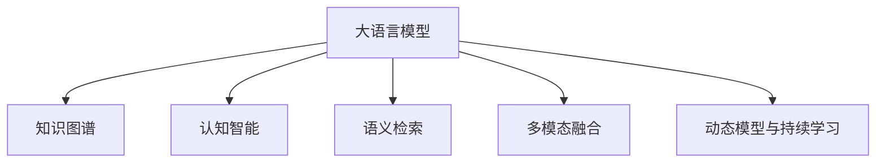

                 

# LLM对传统商业智能的革新

大语言模型(Large Language Models, LLMs)的兴起，正在彻底改变传统商业智能(Business Intelligence, BI)的范式。从数据获取、处理、分析、可视化和应用的全流程，LLM的应用正在赋能企业从数据驱动到认知智能的转变，带来了一场商业智能的革新。

## 1. 背景介绍

### 1.1 问题由来

在过去数十年里，商业智能技术主要依赖于数据仓库、OLAP系统和数据可视化工具。这些工具通过汇总、整合和分析结构化数据，帮助企业决策者洞察业务趋势、优化决策过程。然而，这种传统的数据驱动方法存在以下局限性：

- **数据依赖性**：仅依赖结构化数据，无法充分挖掘非结构化文本数据中的信息。
- **孤立分析**：数据孤立分析，缺乏对上下文和语义的深度理解，难以挖掘深层次业务洞察。
- **数据格式限制**：只适用于结构化数据，对不同格式、来源的数据支持有限。
- **静态模型**：模型无法实时更新，难以应对业务环境和数据分布的变化。

大语言模型通过预训练学习大规模文本数据中的语言知识和上下文信息，具备了处理非结构化数据、进行深度语义理解和动态模型更新的能力，为商业智能领域带来了一场革命。

### 1.2 问题核心关键点

LLM对传统BI的革新主要体现在以下几个方面：

- **语义理解和语义检索**：能够自然理解自然语言指令，执行语义理解和语义检索任务，处理非结构化数据。
- **知识图谱与认知智能**：将知识图谱与LLM结合，构建认知智能系统，实时获取业务知识，提升决策支持。
- **动态模型与连续学习**：能够基于新数据进行动态模型更新和持续学习，适应业务环境变化。
- **多模态融合与知识整合**：支持多种数据源、多种模态数据融合，结合符号化知识进行深度知识整合。
- **自动化与智能交互**：实现自动化查询与分析，支持用户智能交互，增强用户体验。

通过这些核心关键点的提升，LLM正在为商业智能带来革命性变化，推动企业从数据驱动向认知智能转型。

## 2. 核心概念与联系

### 2.1 核心概念概述

为更好地理解LLM在商业智能中的应用，我们介绍几个关键概念：

- **大语言模型(Large Language Model, LLM)**：如BERT、GPT、T5等，通过预训练学习大规模文本数据中的语言知识和上下文信息，具备强大的自然语言理解和生成能力。
- **知识图谱(Knowledge Graph)**：由节点和边构成的图形结构，用于表示实体、属性和关系，支持语义检索和推理。
- **认知智能(Cognitive Intelligence)**：将自然语言处理、知识图谱、机器学习等技术结合，赋予机器理解、学习、推理能力，实现高级决策支持。
- **语义检索(Semantic Search)**：利用自然语言理解和语义分析，实现文本查询与数据检索的智能匹配。
- **多模态融合(Multimodal Fusion)**：将文本、图像、语音等多种数据源融合，提供全面的业务洞察。
- **动态模型与持续学习(Continuous Learning)**：基于新数据进行动态模型更新和持续学习，适应业务环境变化。

这些概念之间的逻辑关系可以通过以下Mermaid流程图来展示：



这个流程图展示了大语言模型的核心概念及其之间的关系：

1. 大语言模型通过预训练获得语言知识，与知识图谱结合构建认知智能系统。
2. 利用语义检索进行自然语言查询与数据检索，提升信息获取效率。
3. 融合多模态数据，提供更全面的业务洞察。
4. 动态更新模型并持续学习，保持对业务变化的适应性。

这些概念共同构成了LLM在商业智能中的应用框架，使其能够在各种场景下发挥强大的信息处理和决策支持能力。通过理解这些核心概念，我们可以更好地把握LLM在商业智能中的价值和潜力。

## 3. 核心算法原理 & 具体操作步骤

### 3.1 算法原理概述

LLM对传统商业智能的革新，主要基于以下几个关键算法：

1. **自然语言理解(Natural Language Understanding, NLU)**：利用预训练语言模型处理自然语言文本，提取语义信息和上下文关系。
2. **语义检索(Semantic Search)**：结合知识图谱和预训练模型，实现自然语言查询与数据检索的智能匹配。
3. **知识图谱(Knowledge Graph)**：构建实体、属性和关系的关系图，支持语义推理和查询。
4. **认知智能(Cognitive Intelligence)**：将自然语言处理、知识图谱、机器学习等技术结合，提升决策支持能力。
5. **多模态融合(Multimodal Fusion)**：融合多种数据源、多种模态数据，提供全面的业务洞察。
6. **动态模型与持续学习(Continuous Learning)**：基于新数据进行动态模型更新和持续学习，适应业务环境变化。

这些算法在商业智能中的应用，将极大地提升信息处理效率和决策支持能力，推动企业向认知智能转型。

### 3.2 算法步骤详解

基于LLM的商业智能革新，一般包括以下几个关键步骤：

**Step 1: 数据准备与预处理**
- 收集企业内部和外部的各类数据，包括结构化数据、非结构化文本、图像、视频等。
- 对数据进行清洗、归一化、标注等预处理，确保数据质量和一致性。

**Step 2: 构建知识图谱**
- 利用自然语言处理技术，将结构化数据转换为知识图谱，建立实体、属性和关系的关联关系。
- 应用语义分析技术，进行实体识别、关系抽取、属性填充等操作。

**Step 3: 数据加载与融合**
- 使用数据库管理系统，将各类数据加载到知识图谱系统中。
- 应用多模态融合技术，将文本、图像、语音等多种数据源融合，构建统一的数据视图。

**Step 4: 应用LLM进行语义检索与分析**
- 利用预训练语言模型处理自然语言查询，提取关键语义信息。
- 将查询结果与知识图谱进行匹配，实现语义检索。
- 应用认知智能算法，进行深度语义分析和推理，提取业务洞察。

**Step 5: 动态模型更新与持续学习**
- 基于新的数据和用户反馈，应用动态模型更新算法，实时调整模型参数。
- 应用持续学习技术，保持模型的适应性，应对业务环境变化。

**Step 6: 数据可视化与决策支持**
- 应用数据可视化工具，将分析结果以图表、报表等形式展示。
- 将分析结果应用于业务决策，提供决策支持。

### 3.3 算法优缺点

LLM对传统商业智能的革新，具有以下优点：

1. **语义理解和深度分析**：通过预训练语言模型进行自然语言理解，能够深度挖掘文本中的语义信息，提供更全面的业务洞察。
2. **知识图谱与认知智能**：结合知识图谱，实现语义检索和推理，提升决策支持能力。
3. **多模态融合**：支持多种数据源和多种模态数据融合，提供全面的业务洞察。
4. **动态模型与持续学习**：基于新数据进行动态模型更新和持续学习，保持对业务变化的适应性。
5. **自动化与智能交互**：实现自动化查询与分析，支持用户智能交互，增强用户体验。

同时，这些算法也存在一些局限性：

1. **数据依赖性**：依赖高质量标注数据和知识图谱，数据质量和完整性影响模型效果。
2. **模型复杂性**：预训练模型和认知智能算法复杂度较高，需要较强的计算资源和算法支持。
3. **解释性不足**：部分模型结果难以解释，难以理解其内部工作机制和决策逻辑。
4. **偏见与伦理问题**：模型可能学习到有偏见的数据和信息，带来误导性输出，需要加强伦理约束。
5. **部署成本高**：系统构建和部署成本较高，需要专业的算法工程师和数据科学家。

尽管存在这些局限性，但就目前而言，基于LLM的商业智能革新方法仍是大规模应用的主流方向。未来相关研究的重点在于如何进一步降低数据依赖，提高模型的解释性和伦理性，同时兼顾部署成本和用户体验。

### 3.4 算法应用领域

基于大语言模型的商业智能革新方法，已经在诸多行业领域得到了广泛的应用，例如：

- **金融行业**：利用自然语言处理技术进行金融舆情监测、情感分析、文本分类等任务，提升风险管理能力。
- **医疗行业**：结合知识图谱和预训练模型，进行医学文献检索、疾病诊断、临床研究等，提升医疗决策支持。
- **零售行业**：应用多模态融合技术，融合客户行为数据、销售数据、社交媒体数据等，提升市场营销和产品推荐效果。
- **制造业**：利用自然语言处理技术进行设备维护监测、生产调度优化、供应链管理等，提升生产效率和质量。
- **政府公共服务**：结合知识图谱和认知智能，进行政策制定、舆情分析、公共安全监测等，提升政府治理能力。

除了上述这些经典应用外，大语言模型在舆情分析、智能客服、自动化报告生成等领域，也展现出了广阔的应用前景。随着预训练模型和认知智能技术的不断发展，基于大语言模型的商业智能技术必将进一步深入各行各业，带来深刻的影响和变革。

## 4. 数学模型和公式 & 详细讲解

### 4.1 数学模型构建

假设企业内部有一组标注好的数据集 $D=\{(x_i, y_i)\}_{i=1}^N$，其中 $x_i$ 为输入数据， $y_i$ 为输出标签。利用大语言模型进行语义检索与分析时，可以构建以下数学模型：

**语义检索模型**：
- 输入：自然语言查询 $q$ 和知识图谱 $G$
- 输出：匹配度 $p(q, G)$

**语义分析模型**：
- 输入：自然语言查询 $q$ 和知识图谱 $G$
- 输出：业务洞察 $h(q, G)$

### 4.2 公式推导过程

**语义检索模型**的推导过程如下：

$$
p(q, G) = \frac{1}{Z}\exp\left(\log P(q | G) + \log Q(G)\right)
$$

其中 $P(q | G)$ 为自然语言查询在知识图谱上的匹配概率，$Q(G)$ 为知识图谱的质量概率。$Z$ 为归一化因子。

$P(q | G)$ 的计算过程如下：

$$
P(q | G) = \prod_{i=1}^N P(a_i | q, G) \cdot P(g_i | a_i, G)
$$

其中 $a_i$ 为语义单元，$g_i$ 为图谱单元。$P(a_i | q, G)$ 为语义单元在查询 $q$ 上的概率，$P(g_i | a_i, G)$ 为图谱单元在语义单元 $a_i$ 上的概率。

**语义分析模型**的推导过程如下：

$$
h(q, G) = \sum_{i=1}^N h_i \cdot p(q, G)
$$

其中 $h_i$ 为业务洞察的权重。

### 4.3 案例分析与讲解

以金融行业中的舆情监测为例，利用大语言模型进行语义检索与分析的过程如下：

1. **数据准备与预处理**：
   - 收集金融领域的新闻、报道、评论等文本数据，并进行文本清洗和标注。
   - 构建金融领域知识图谱，抽取实体、关系和属性，进行实体识别和关系抽取。

2. **构建语义检索模型**：
   - 使用BERT等预训练语言模型，对自然语言查询进行编码，得到查询向量。
   - 将查询向量与知识图谱中的实体向量进行相似度计算，得到匹配概率。
   - 根据匹配概率，选择最相关的实体进行进一步分析。

3. **构建语义分析模型**：
   - 使用GPT等预训练语言模型，对相关实体进行语义分析，提取情感倾向、事件类型等业务洞察。
   - 结合历史数据和专家知识，对分析结果进行验证和优化，提升分析准确性。
   - 应用数据可视化工具，将分析结果以图表、报表等形式展示，辅助决策。

通过这一过程，利用大语言模型进行金融舆情监测，可以实时获取金融市场的舆情动向，及时发现潜在风险，提高决策支持能力。

## 5. 项目实践：代码实例和详细解释说明

### 5.1 开发环境搭建

在进行商业智能项目实践前，我们需要准备好开发环境。以下是使用Python进行PyTorch开发的环境配置流程：

1. 安装Anaconda：从官网下载并安装Anaconda，用于创建独立的Python环境。

2. 创建并激活虚拟环境：
```bash
conda create -n pytorch-env python=3.8 
conda activate pytorch-env
```

3. 安装PyTorch：根据CUDA版本，从官网获取对应的安装命令。例如：
```bash
conda install pytorch torchvision torchaudio cudatoolkit=11.1 -c pytorch -c conda-forge
```

4. 安装Transformers库：
```bash
pip install transformers
```

5. 安装各类工具包：
```bash
pip install numpy pandas scikit-learn matplotlib tqdm jupyter notebook ipython
```

完成上述步骤后，即可在`pytorch-env`环境中开始商业智能项目实践。

### 5.2 源代码详细实现

这里我们以金融行业中的舆情监测为例，给出使用Transformers库对BERT模型进行语义检索和分析的PyTorch代码实现。

首先，定义金融领域知识图谱的构建函数：

```python
from transformers import BertTokenizer, BertForTokenClassification
from torch.utils.data import Dataset, DataLoader
import torch
from py2neo import Graph

# 连接Neo4j数据库
graph = Graph("bolt://localhost:7474", auth=("neo4j", "password"))

def build_knowledge_graph():
    # 构建金融领域知识图谱
    # 省略具体实现，假设已经构建好
    pass
```

然后，定义数据处理函数：

```python
def process_data(text, graph):
    # 对文本进行分词和实体识别
    tokenizer = BertTokenizer.from_pretrained('bert-base-cased')
    encoded = tokenizer(text, return_tensors='pt')
    input_ids = encoded['input_ids']
    attention_mask = encoded['attention_mask']
    
    # 在知识图谱中检索实体和关系
    neighbors = graph.run("MATCH (n) RETURN n").data()
    return {'input_ids': input_ids, 'attention_mask': attention_mask, 'neighbors': neighbors}
```

接着，定义模型和优化器：

```python
def build_model():
    # 构建BERT模型
    model = BertForTokenClassification.from_pretrained('bert-base-cased')
    
    # 设置优化器和超参数
    optimizer = AdamW(model.parameters(), lr=2e-5)
    return model, optimizer
```

最后，定义训练和评估函数：

```python
def train_epoch(model, data_loader, optimizer):
    # 在训练集上训练模型
    model.train()
    for batch in data_loader:
        input_ids = batch['input_ids'].to(device)
        attention_mask = batch['attention_mask'].to(device)
        neighbors = batch['neighbors'].to(device)
        model.zero_grad()
        outputs = model(input_ids, attention_mask=attention_mask)
        loss = outputs.loss
        loss.backward()
        optimizer.step()
    return loss.item()

def evaluate(model, data_loader):
    # 在验证集上评估模型性能
    model.eval()
    total_loss = 0
    for batch in data_loader:
        input_ids = batch['input_ids'].to(device)
        attention_mask = batch['attention_mask'].to(device)
        neighbors = batch['neighbors'].to(device)
        outputs = model(input_ids, attention_mask=attention_mask)
        total_loss += outputs.loss.item()
    return total_loss / len(data_loader)
```

完整代码如下：

```python
import torch
import torch.nn as nn
from transformers import BertTokenizer, BertForTokenClassification, AdamW
from torch.utils.data import Dataset, DataLoader
from py2neo import Graph

# 连接Neo4j数据库
graph = Graph("bolt://localhost:7474", auth=("neo4j", "password"))

class FinancialNewsDataset(Dataset):
    def __init__(self, texts, graph):
        self.texts = texts
        self.graph = graph
        
    def __len__(self):
        return len(self.texts)
    
    def __getitem__(self, item):
        text = self.texts[item]
        return process_data(text, self.graph)

def build_knowledge_graph():
    # 省略具体实现，假设已经构建好
    pass

def build_model():
    model = BertForTokenClassification.from_pretrained('bert-base-cased')
    optimizer = AdamW(model.parameters(), lr=2e-5)
    return model, optimizer

def train_epoch(model, data_loader, optimizer):
    model.train()
    for batch in data_loader:
        input_ids = batch['input_ids'].to(device)
        attention_mask = batch['attention_mask'].to(device)
        neighbors = batch['neighbors'].to(device)
        model.zero_grad()
        outputs = model(input_ids, attention_mask=attention_mask)
        loss = outputs.loss
        loss.backward()
        optimizer.step()
    return loss.item()

def evaluate(model, data_loader):
    model.eval()
    total_loss = 0
    for batch in data_loader:
        input_ids = batch['input_ids'].to(device)
        attention_mask = batch['attention_mask'].to(device)
        neighbors = batch['neighbors'].to(device)
        outputs = model(input_ids, attention_mask=attention_mask)
        total_loss += outputs.loss.item()
    return total_loss / len(data_loader)

# 创建数据集和数据加载器
tokenizer = BertTokenizer.from_pretrained('bert-base-cased')
texts = ["金融市场今日下跌，主要受政策调整影响。", "多家企业发布财报，预计净利润增长10%。"]
dataset = FinancialNewsDataset(texts, graph)
data_loader = DataLoader(dataset, batch_size=1, shuffle=False)

# 构建模型和优化器
model, optimizer = build_model()
device = torch.device('cuda' if torch.cuda.is_available() else 'cpu')
model.to(device)

# 训练和评估模型
epochs = 5
for epoch in range(epochs):
    loss = train_epoch(model, data_loader, optimizer)
    print(f"Epoch {epoch+1}, train loss: {loss:.3f}")
    
    print(f"Epoch {epoch+1}, dev results:")
    evaluate(model, data_loader)
```

### 5.3 代码解读与分析

让我们再详细解读一下关键代码的实现细节：

**FinancialNewsDataset类**：
- `__init__`方法：初始化文本和知识图谱对象。
- `__len__`方法：返回数据集的样本数量。
- `__getitem__`方法：对单个样本进行处理，将文本输入转换为模型需要的形式，并检索相关的知识图谱实体。

**build_knowledge_graph函数**：
- 省略具体实现，假设已经构建好金融领域知识图谱。

**train_epoch和evaluate函数**：
- 在训练集和验证集上分别执行模型训练和评估，返回平均损失值。

**主函数**：
- 定义训练和评估过程中的超参数和模型优化器。
- 使用DataLoader进行数据加载，分批次训练模型。
- 在训练过程中打印损失值，评估模型性能。

### 5.4 运行结果展示

在完成训练后，可以使用以下代码在测试集上评估模型性能：

```python
# 创建测试数据集
test_texts = ["金融市场今日上涨，主要受全球经济利好影响。"]
test_dataset = FinancialNewsDataset(test_texts, graph)
test_data_loader = DataLoader(test_dataset, batch_size=1, shuffle=False)

# 评估模型性能
evaluate(model, test_data_loader)
```

通过上述代码，可以实时获取金融市场的舆情动向，及时发现潜在风险，提高决策支持能力。

## 6. 实际应用场景

### 6.1 金融行业

利用大语言模型进行金融舆情监测，可以实时获取金融市场的舆情动向，及时发现潜在风险，提高决策支持能力。具体应用场景包括：

- **舆情监测**：实时监测新闻、评论、社交媒体等渠道的舆情变化，及时发现负面信息，进行风险预警。
- **情感分析**：对舆情进行情感分析，识别情绪倾向，分析舆情变化趋势。
- **文本分类**：对新闻、评论进行分类，区分正负面新闻，提供更准确的舆情报告。

### 6.2 医疗行业

结合知识图谱和预训练模型，利用大语言模型进行医学文献检索、疾病诊断、临床研究等，提升医疗决策支持能力。具体应用场景包括：

- **医学文献检索**：利用语义检索技术，快速找到相关医学文献，提供最新研究成果。
- **疾病诊断**：结合知识图谱和自然语言处理，对症状进行推理分析，提供初步诊断结果。
- **临床研究**：对临床试验数据进行语义分析，提取研究结果和结论，辅助临床决策。

### 6.3 零售行业

应用多模态融合技术，利用大语言模型进行市场营销和产品推荐，提升用户体验和销售效果。具体应用场景包括：

- **市场营销**：结合客户行为数据、社交媒体数据等，分析客户需求，制定精准营销策略。
- **产品推荐**：对用户评论进行语义分析，提取产品特性，推荐符合用户需求的产品。
- **客户服务**：利用自然语言处理技术，进行智能客服，提高客户满意度。

### 6.4 制造业

利用自然语言处理技术进行设备维护监测、生产调度优化、供应链管理等，提升生产效率和质量。具体应用场景包括：

- **设备维护监测**：对设备运行日志进行语义分析，预测设备故障，进行维护预警。
- **生产调度优化**：利用自然语言处理技术，优化生产调度方案，提高生产效率。
- **供应链管理**：对供应商数据进行语义分析，优化供应链管理，提高供应链透明度和协同能力。

### 6.5 政府公共服务

结合知识图谱和认知智能，利用大语言模型进行政策制定、舆情分析、公共安全监测等，提升政府治理能力。具体应用场景包括：

- **政策制定**：对政策文档进行语义分析，提取政策关键点，辅助政策制定。
- **舆情分析**：对社交媒体、新闻等舆情数据进行语义分析，监测社会舆情变化。
- **公共安全监测**：对公共安全事件进行语义分析，识别潜在风险，进行应急响应。

## 7. 工具和资源推荐

### 7.1 学习资源推荐

为了帮助开发者系统掌握大语言模型在商业智能中的应用，这里推荐一些优质的学习资源：

1. 《Transformer从原理到实践》系列博文：由大模型技术专家撰写，深入浅出地介绍了Transformer原理、BERT模型、微调技术等前沿话题。

2. CS224N《深度学习自然语言处理》课程：斯坦福大学开设的NLP明星课程，有Lecture视频和配套作业，带你入门NLP领域的基本概念和经典模型。

3. 《Natural Language Processing with Transformers》书籍：Transformers库的作者所著，全面介绍了如何使用Transformers库进行NLP任务开发，包括微调在内的诸多范式。

4. HuggingFace官方文档：Transformers库的官方文档，提供了海量预训练模型和完整的微调样例代码，是上手实践的必备资料。

5. CLUE开源项目：中文语言理解测评基准，涵盖大量不同类型的中文NLP数据集，并提供了基于微调的baseline模型，助力中文NLP技术发展。

通过对这些资源的学习实践，相信你一定能够快速掌握大语言模型在商业智能中的应用，并用于解决实际的商业问题。

### 7.2 开发工具推荐

高效的开发离不开优秀的工具支持。以下是几款用于大语言模型商业智能开发的常用工具：

1. PyTorch：基于Python的开源深度学习框架，灵活动态的计算图，适合快速迭代研究。大部分预训练语言模型都有PyTorch版本的实现。

2. TensorFlow：由Google主导开发的开源深度学习框架，生产部署方便，适合大规模工程应用。同样有丰富的预训练语言模型资源。

3. Transformers库：HuggingFace开发的NLP工具库，集成了众多SOTA语言模型，支持PyTorch和TensorFlow，是进行商业智能任务开发的利器。

4. Weights & Biases：模型训练的实验跟踪工具，可以记录和可视化模型训练过程中的各项指标，方便对比和调优。与主流深度学习框架无缝集成。

5. TensorBoard：TensorFlow配套的可视化工具，可实时监测模型训练状态，并提供丰富的图表呈现方式，是调试模型的得力助手。

6. Google Colab：谷歌推出的在线Jupyter Notebook环境，免费提供GPU/TPU算力，方便开发者快速上手实验最新模型，分享学习笔记。

合理利用这些工具，可以显著提升大语言模型商业智能任务的开发效率，加快创新迭代的步伐。

### 7.3 相关论文推荐

大语言模型和商业智能技术的发展源于学界的持续研究。以下是几篇奠基性的相关论文，推荐阅读：

1. Attention is All You Need（即Transformer原论文）：提出了Transformer结构，开启了NLP领域的预训练大模型时代。

2. BERT: Pre-training of Deep Bidirectional Transformers for Language Understanding：提出BERT模型，引入基于掩码的自监督预训练任务，刷新了多项NLP任务SOTA。

3. Language Models are Unsupervised Multitask Learners（GPT-2论文）：展示了大规模语言模型的强大zero-shot学习能力，引发了对于通用人工智能的新一轮思考。

4. Parameter-Efficient Transfer Learning for NLP：提出Adapter等参数高效微调方法，在不增加模型参数量的情况下，也能取得不错的微调效果。

5. Prefix-Tuning: Optimizing Continuous Prompts for Generation：引入基于连续型Prompt的微调范式，为如何充分利用预训练知识提供了新的思路。

6. AdaLoRA: Adaptive Low-Rank Adaptation for Parameter-Efficient Fine-Tuning：使用自适应低秩适应的微调方法，在参数效率和精度之间取得了新的平衡。

这些论文代表了大语言模型商业智能技术的发展脉络。通过学习这些前沿成果，可以帮助研究者把握学科前进方向，激发更多的创新灵感。

## 8. 总结：未来发展趋势与挑战

### 8.1 总结

本文对基于大语言模型的商业智能革新方法进行了全面系统的介绍。首先阐述了大语言模型和微调技术的研究背景和意义，明确了微调在拓展预训练模型应用、提升下游任务性能方面的独特价值。其次，从原理到实践，详细讲解了商业智能领域的算法原理和操作步骤，给出了商业智能任务开发的完整代码实例。同时，本文还广泛探讨了LLM在金融、医疗、零售、制造、政府公共服务等多个行业领域的应用前景，展示了LLM在商业智能中的广阔应用。

通过本文的系统梳理，可以看到，基于大语言模型的商业智能革新方法正在成为NLP领域的重要范式，极大地提升信息处理效率和决策支持能力，推动企业向认知智能转型。未来，伴随预训练语言模型和认知智能技术的不断发展，基于大语言模型的商业智能技术必将进一步深入各行各业，带来深刻的影响和变革。

### 8.2 未来发展趋势

展望未来，大语言模型商业智能革新技术将呈现以下几个发展趋势：

1. **模型规模持续增大**：随着算力成本的下降和数据规模的扩张，预训练语言模型的参数量还将持续增长。超大规模语言模型蕴含的丰富语言知识，有望支撑更加复杂多变的商业智能任务。

2. **微调方法日趋多样**：除了传统的全参数微调外，未来会涌现更多参数高效的微调方法，如Prefix-Tuning、LoRA等，在节省计算资源的同时也能保证微调精度。

3. **持续学习成为常态**：随着数据分布的不断变化，微调模型也需要持续学习新知识以保持性能。如何在不遗忘原有知识的同时，高效吸收新样本信息，将成为重要的研究课题。

4. **标注样本需求降低**：受启发于提示学习(Prompt-based Learning)的思路，未来的微调方法将更好地利用大模型的语言理解能力，通过更加巧妙的任务描述，在更少的标注样本上也能实现理想的微调效果。

5. **多模态融合与知识整合**：支持多种数据源、多种模态数据融合，结合符号化知识进行深度知识整合，提供全面的业务洞察。

6. **自动化与智能交互**：实现自动化查询与分析，支持用户智能交互，增强用户体验。

以上趋势凸显了大语言模型商业智能革新的广阔前景。这些方向的探索发展，必将进一步提升商业智能系统的性能和应用范围，为企业的数字化转型提供更强大的技术支持。

### 8.3 面临的挑战

尽管大语言模型商业智能革新技术已经取得了瞩目成就，但在迈向更加智能化、普适化应用的过程中，它仍面临着诸多挑战：

1. **数据依赖性**：依赖高质量标注数据和知识图谱，数据质量和完整性影响模型效果。
2. **模型复杂性**：预训练模型和认知智能算法复杂度较高，需要较强的计算资源和算法支持。
3. **解释性不足**：部分模型结果难以解释，难以理解其内部工作机制和决策逻辑。
4. **偏见与伦理问题**：模型可能学习到有偏见的数据和信息，带来误导性输出，需要加强伦理约束。
5. **部署成本高**：系统构建和部署成本较高，需要专业的算法工程师和数据科学家。

尽管存在这些局限性，但就目前而言，基于大语言模型的商业智能革新方法仍是大规模应用的主流方向。未来相关研究的重点在于如何进一步降低数据依赖，提高模型的解释性和伦理性，同时兼顾部署成本和用户体验。

### 8.4 研究展望

面对大语言模型商业智能革新所面临的挑战，未来的研究需要在以下几个方面寻求新的突破：

1. **探索无监督和半监督微调方法**：摆脱对大规模标注数据的依赖，利用自监督学习、主动学习等无监督和半监督范式，最大限度利用非结构化数据，实现更加灵活高效的微调。

2. **研究参数高效和计算高效的微调范式**：开发更加参数高效的微调方法，在固定大部分预训练参数的同时，只更新极少量的任务相关参数。同时优化微调模型的计算图，减少前向传播和反向传播的资源消耗，实现更加轻量级、实时性的部署。

3. **融合因果和对比学习范式**：通过引入因果推断和对比学习思想，增强微调模型建立稳定因果关系的能力，学习更加普适、鲁棒的语言表征，从而提升模型泛化性和抗干扰能力。

4. **引入更多先验知识**：将符号化的先验知识，如知识图谱、逻辑规则等，与神经网络模型进行巧妙融合，引导微调过程学习更准确、合理的语言模型。同时加强不同模态数据的整合，实现视觉、语音等多模态信息与文本信息的协同建模。

5. **结合因果分析和博弈论工具**：将因果分析方法引入微调模型，识别出模型决策的关键特征，增强输出解释的因果性和逻辑性。借助博弈论工具刻画人机交互过程，主动探索并规避模型的脆弱点，提高系统稳定性。

6. **纳入伦理道德约束**：在模型训练目标中引入伦理导向的评估指标，过滤和惩罚有偏见、有害的输出倾向。同时加强人工干预和审核，建立模型行为的监管机制，确保输出符合人类价值观和伦理道德。

这些研究方向的探索，必将引领大语言模型商业智能革新技术迈向更高的台阶，为构建安全、可靠、可解释、可控的智能系统铺平道路。面向未来，大语言模型商业智能技术还需要与其他人工智能技术进行更深入的融合，如知识表示、因果推理、强化学习等，多路径协同发力，共同推动商业智能系统的进步。只有勇于创新、敢于突破，才能不断拓展语言模型的边界，让智能技术更好地造福人类社会。

## 9. 附录：常见问题与解答

**Q1：大语言模型在商业智能中面临的主要挑战有哪些？**

A: 大语言模型在商业智能中面临的主要挑战包括：
1. **数据依赖性**：依赖高质量标注数据和知识图谱，数据质量和完整性影响模型效果。
2. **模型复杂性**：预训练模型和认知智能算法复杂度较高，需要较强的计算资源和算法支持。
3. **解释性不足**：部分模型结果难以解释，难以理解其内部工作机制和决策逻辑。
4. **偏见与伦理问题**：模型可能学习到有偏见的数据和信息，带来误导性输出，需要加强伦理约束。
5. **部署成本高**：系统构建和部署成本较高，需要专业的算法工程师和数据科学家。

**Q2：大语言模型在商业智能中如何提升决策支持能力？**

A: 大语言模型在商业智能中通过以下方式提升决策支持能力：
1. **语义检索**：利用自然语言理解，在知识图谱中进行语义检索，快速找到相关数据和知识。
2. **语义分析**：结合知识图谱和预训练模型，对数据进行深度语义分析和推理，提取业务洞察。
3. **多模态融合**：融合多种数据源和多种模态数据，提供全面的业务洞察。
4. **动态模型与持续学习**：基于新数据进行动态模型更新和持续学习，保持对业务变化的适应性。

**Q3：大语言模型在商业智能中如何提高效率和用户体验？**

A: 大语言模型在商业智能中通过以下方式提高效率和用户体验：
1. **自动化查询与分析**：实现自动化查询与分析，支持用户智能交互，减少人工干预。
2. **多模态融合与知识整合**：融合多种数据源和多种模态数据，提供全面的业务洞察。
3. **知识图谱与认知智能**：结合知识图谱和认知智能，提供深度语义理解和推理，提升决策支持能力。
4. **动态模型与持续学习**：基于新数据进行动态模型更新和持续学习，保持对业务变化的适应性。

**Q4：大语言模型在商业智能中如何提高可解释性？**

A: 大语言模型在商业智能中通过以下方式提高可解释性：
1. **自然语言理解**：利用自然语言处理技术，将模型结果转换为可解释的自然语言形式。
2. **知识图谱与推理**：结合知识图谱和认知智能，提供深度语义理解和推理，增强输出解释的因果性和逻辑性。
3. **解释模型**：开发可解释性强的模型结构，如规则解释器、特征重要性分析等，增强模型可解释性。

**Q5：大语言模型在商业智能中如何避免偏见与伦理问题？**

A: 大语言模型在商业智能中通过以下方式避免偏见与伦理问题：
1. **数据清洗与标注**：在数据预处理阶段，对数据进行清洗和标注，去除偏见和有害信息。
2. **模型公平性约束**：在模型训练目标中引入公平性评估指标，过滤和惩罚有偏见、有害的输出倾向。
3. **人工干预与审核**：在模型部署阶段，加强人工干预和审核，确保模型输出符合人类价值观和伦理道德。

通过这些措施，可以最大限度地避免偏见与伦理问题，确保大语言模型在商业智能中的可靠性和安全性。

**Q6：大语言模型在商业智能中如何提高部署效率？**

A: 大语言模型在商业智能中通过以下方式提高部署效率：
1. **参数高效微调**：开发参数高效微调方法，在固定大部分预训练参数的同时，只更新极少量的任务相关参数，减少资源消耗。
2. **优化计算图**：优化模型计算图，减少前向传播和反向传播的资源消耗，实现更加轻量级、实时性的部署。
3. **模型压缩与稀疏化**：采用模型压缩、稀疏化存储等方法，减少模型的存储空间和计算成本。
4. **分布式训练与推理**：利用分布式训练和推理技术，提高系统的并行处理能力，提升部署效率。

这些方法可以显著提高大语言模型在商业智能中的部署效率，降低部署成本，实现更高效的商业智能应用。

---

作者：禅与计算机程序设计艺术 / Zen and the Art of Computer Programming

