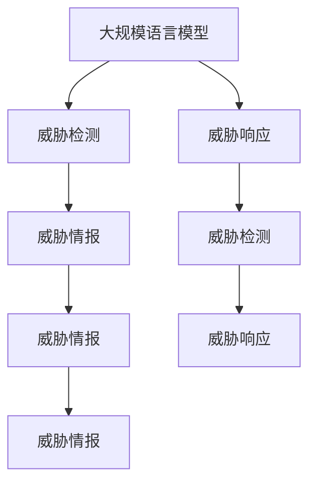

                 

# LLM对传统网络安全策略的挑战与创新

## 1. 背景介绍

### 1.1 问题由来

随着人工智能技术在各个领域的广泛应用，尤其是在网络安全领域，大规模语言模型（LLM）的潜力开始受到关注。传统的网络安全策略主要依赖规则和签名匹配等技术手段，难以应对日益复杂的网络攻击和高级持续性威胁（APT）。然而，通过引入大规模语言模型，可以更加灵活地识别和防御新型威胁，提升整体安全水平。

### 1.2 问题核心关键点

大规模语言模型在网络安全中的应用，本质上是将自然语言处理技术与网络安全领域结合起来，利用自然语言的丰富语义信息，提高威胁检测和响应能力。但同时，LLM的使用也带来了新的挑战和风险。

## 2. 核心概念与联系

### 2.1 核心概念概述

为更好地理解LLM在网络安全中的应用，本节将介绍几个密切相关的核心概念：

- 大规模语言模型（LLM）：以自回归（如GPT）或自编码（如BERT）模型为代表的大规模预训练语言模型。通过在大规模无标签文本语料上进行预训练，学习通用的语言表示，具备强大的语言理解和生成能力。

- 网络安全（Cybersecurity）：涉及保护计算机系统、网络和数据免受未授权访问、破坏或泄露的技术和过程。

- 威胁检测（Threat Detection）：通过分析和识别网络流量、日志、日志等数据，发现潜在的威胁和攻击行为。

- 威胁响应（Threat Response）：在检测到威胁后，采取相应的措施进行遏制和恢复。

- 威胁情报（Threat Intelligence）：通过收集、分析和共享威胁情报，提升整体安全防御水平。

- 多模态学习（Multi-modal Learning）：融合文本、图像、音频等多类型数据，提升模型的泛化能力和鲁棒性。

- 迁移学习（Transfer Learning）：将一个领域学习到的知识，迁移应用到另一个不同但相关的领域的学习范式。

这些核心概念之间的逻辑关系可以通过以下Mermaid流程图来展示：



这个流程图展示了大语言模型的核心概念及其之间的关系：

1. 大规模语言模型通过预训练获得基础能力。
2. 利用其在威胁检测中的应用，提升威胁识别能力。
3. 在威胁响应中，通过生成性文本等手段，提高自动化的响应水平。
4. 通过威胁情报，增强威胁检测和响应的决策支持。
5. 多模态学习能够更好地利用不同类型的数据，提升模型的泛化能力。
6. 迁移学习连接不同任务，实现知识和技术的跨领域传递。

这些核心概念共同构成了大规模语言模型在网络安全中的应用框架，使其能够在各种场景下发挥强大的威胁检测和防御能力。通过理解这些核心概念，我们可以更好地把握大规模语言模型的工作原理和优化方向。

## 3. 核心算法原理 & 具体操作步骤

### 3.1 算法原理概述

基于大规模语言模型的网络安全应用，本质上是利用自然语言处理技术的威胁检测和响应能力。其核心思想是：将大规模语言模型视作一个强大的“特征提取器”，通过在威胁情报数据上进行有监督学习或自监督学习，训练模型学习到不同威胁的特征表示。

形式化地，假设威胁情报数据集为 $D=\{(x_i, y_i)\}_{i=1}^N, x_i \in \mathbb{R}^d, y_i \in \{0,1\}$，其中 $y_i$ 表示样本 $x_i$ 是否为威胁。威胁检测的目标是最小化误判率，即找到最优参数 $\theta$：

$$
\theta^* = \mathop{\arg\min}_{\theta} \mathcal{L}(\theta)
$$

其中 $\mathcal{L}$ 为威胁检测的损失函数，用于衡量模型输出与真实标签之间的差异。常见的损失函数包括交叉熵损失、均方误差损失等。

### 3.2 算法步骤详解

基于大规模语言模型的网络安全应用一般包括以下几个关键步骤：

**Step 1: 准备威胁情报数据集**
- 收集威胁情报数据集 $D$，包括恶意软件签名、攻击模式、漏洞信息等。数据集应涵盖各种不同类型的威胁，以确保模型具有广泛的泛化能力。

**Step 2: 添加威胁检测层**
- 根据威胁情报数据的特征，在预训练模型顶层设计合适的输出层和损失函数。
- 对于分类任务，通常在顶层添加线性分类器和交叉熵损失函数。
- 对于生成任务，通常使用语言模型的解码器输出概率分布，并以负对数似然为损失函数。

**Step 3: 设置威胁检测超参数**
- 选择合适的优化算法及其参数，如 AdamW、SGD 等，设置学习率、批大小、迭代轮数等。
- 设置正则化技术及强度，包括权重衰减、Dropout、Early Stopping等。
- 确定冻结预训练参数的策略，如仅微调顶层，或全部参数都参与微调。

**Step 4: 执行梯度训练**
- 将威胁情报数据分批次输入模型，前向传播计算损失函数。
- 反向传播计算参数梯度，根据设定的优化算法和学习率更新模型参数。
- 周期性在验证集上评估模型性能，根据性能指标决定是否触发 Early Stopping。
- 重复上述步骤直到满足预设的迭代轮数或 Early Stopping 条件。

**Step 5: 威胁响应**
- 在威胁检测的基础上，根据检测到的威胁，生成相应的威胁响应措施，如隔离受感染的主机、更新安全策略等。

**Step 6: 威胁情报更新**
- 定期收集新的威胁情报数据，更新训练数据集 $D$，继续训练和微调模型。

以上是基于大规模语言模型的威胁检测和响应的基本流程。在实际应用中，还需要针对具体威胁类型，对模型进行优化设计，如改进训练目标函数，引入更多的正则化技术，搜索最优的超参数组合等，以进一步提升模型的泛化能力和性能。

### 3.3 算法优缺点

基于大规模语言模型的威胁检测和响应方法具有以下优点：
1. 高效灵活：利用自然语言的丰富语义信息，可以更加灵活地识别和应对新型威胁。
2. 泛化能力强：通过多模态学习和迁移学习，可以更好地泛化到不同类型的威胁。
3. 性能提升显著：在大规模数据集上进行微调，可以获得显著的性能提升。

同时，该方法也存在一定的局限性：
1. 数据依赖性强：模型性能依赖于高质量的威胁情报数据集，数据获取和维护成本较高。
2. 隐私风险：大规模语言模型可能学习到敏感信息，导致隐私泄露风险。
3. 对抗攻击：对抗样本可能会误导模型，导致误判或漏判。
4. 可解释性不足：模型决策过程复杂，难以解释其内部工作机制。

尽管存在这些局限性，但就目前而言，基于大规模语言模型的威胁检测和响应方法仍是大规模语言模型在网络安全领域的重要应用范式。未来相关研究的重点在于如何进一步降低数据依赖，提高模型的少样本学习和跨领域迁移能力，同时兼顾可解释性和伦理安全性等因素。

### 3.4 算法应用领域

基于大规模语言模型的威胁检测和响应方法，在网络安全领域已经得到了广泛的应用，覆盖了几乎所有常见威胁类型，例如：

- 恶意软件检测：利用模型学习恶意软件的特征表示，快速识别和隔离恶意软件。
- 网络入侵检测：通过分析网络流量和日志数据，识别可疑的入侵行为。
- 零日漏洞检测：利用威胁情报数据，预测新发现的漏洞可能被利用的情况。
- 社会工程攻击识别：利用自然语言的语义信息，识别和防范钓鱼邮件、钓鱼网站等社会工程攻击。
- 事件关联分析：通过分析和关联多源威胁情报数据，发现攻击链和攻击路径。

除了上述这些经典应用外，基于大规模语言模型的威胁检测和响应方法还在更多场景中得到了创新性地应用，如利用模型生成威胁报告、自动化威胁响应等，为网络安全技术带来了全新的突破。随着大规模语言模型和威胁检测方法的不断进步，相信网络安全技术将在更广阔的应用领域大放异彩。

## 4. 数学模型和公式 & 详细讲解 & 举例说明

### 4.1 数学模型构建

本节将使用数学语言对基于大规模语言模型的威胁检测和响应过程进行更加严格的刻画。

记威胁情报数据集为 $D=\{(x_i, y_i)\}_{i=1}^N, x_i \in \mathbb{R}^d, y_i \in \{0,1\}$，其中 $y_i$ 表示样本 $x_i$ 是否为威胁。假设模型 $M_{\theta}$ 在输入 $x$ 上的输出为 $\hat{y}=M_{\theta}(x) \in [0,1]$，表示样本 $x$ 被判定为威胁的概率。威胁检测的目标是最小化误判率，即找到最优参数 $\theta$：

$$
\theta^* = \mathop{\arg\min}_{\theta} \mathcal{L}(\theta)
$$

其中 $\mathcal{L}$ 为威胁检测的损失函数，用于衡量模型输出与真实标签之间的差异。常见的损失函数包括交叉熵损失、均方误差损失等。

### 4.2 公式推导过程

以下我们以二分类任务为例，推导交叉熵损失函数及其梯度的计算公式。

假设模型 $M_{\theta}$ 在输入 $x$ 上的输出为 $\hat{y}=M_{\theta}(x) \in [0,1]$，表示样本 $x$ 被判定为威胁的概率。真实标签 $y \in \{0,1\}$。则二分类交叉熵损失函数定义为：

$$
\ell(M_{\theta}(x),y) = -[y\log \hat{y} + (1-y)\log (1-\hat{y})]
$$

将其代入经验风险公式，得：

$$
\mathcal{L}(\theta) = -\frac{1}{N}\sum_{i=1}^N [y_i\log M_{\theta}(x_i)+(1-y_i)\log(1-M_{\theta}(x_i))]
$$

根据链式法则，损失函数对参数 $\theta_k$ 的梯度为：

$$
\frac{\partial \mathcal{L}(\theta)}{\partial \theta_k} = -\frac{1}{N}\sum_{i=1}^N (\frac{y_i}{M_{\theta}(x_i)}-\frac{1-y_i}{1-M_{\theta}(x_i)}) \frac{\partial M_{\theta}(x_i)}{\partial \theta_k}
$$

其中 $\frac{\partial M_{\theta}(x_i)}{\partial \theta_k}$ 可进一步递归展开，利用自动微分技术完成计算。

在得到损失函数的梯度后，即可带入参数更新公式，完成模型的迭代优化。重复上述过程直至收敛，最终得到适应威胁情报数据的模型参数 $\theta^*$。

## 5. 项目实践：代码实例和详细解释说明

### 5.1 开发环境搭建

在进行威胁检测实践前，我们需要准备好开发环境。以下是使用Python进行PyTorch开发的环境配置流程：

1. 安装Anaconda：从官网下载并安装Anaconda，用于创建独立的Python环境。

2. 创建并激活虚拟环境：
```bash
conda create -n pytorch-env python=3.8 
conda activate pytorch-env
```

3. 安装PyTorch：根据CUDA版本，从官网获取对应的安装命令。例如：
```bash
conda install pytorch torchvision torchaudio cudatoolkit=11.1 -c pytorch -c conda-forge
```

4. 安装各类工具包：
```bash
pip install numpy pandas scikit-learn matplotlib tqdm jupyter notebook ipython
```

完成上述步骤后，即可在`pytorch-env`环境中开始威胁检测实践。

### 5.2 源代码详细实现

下面我们以恶意软件检测任务为例，给出使用Transformers库对BERT模型进行威胁检测的PyTorch代码实现。

首先，定义恶意软件检测任务的数据处理函数：

```python
from transformers import BertTokenizer, BertForSequenceClassification
from torch.utils.data import Dataset
import torch

class MalwareDataset(Dataset):
    def __init__(self, texts, labels, tokenizer, max_len=128):
        self.texts = texts
        self.labels = labels
        self.tokenizer = tokenizer
        self.max_len = max_len
        
    def __len__(self):
        return len(self.texts)
    
    def __getitem__(self, item):
        text = self.texts[item]
        label = self.labels[item]
        
        encoding = self.tokenizer(text, return_tensors='pt', max_length=self.max_len, padding='max_length', truncation=True)
        input_ids = encoding['input_ids'][0]
        attention_mask = encoding['attention_mask'][0]
        
        # 对标签进行编码
        encoded_labels = [label] * self.max_len
        labels = torch.tensor(encoded_labels, dtype=torch.long)
        
        return {'input_ids': input_ids, 
                'attention_mask': attention_mask,
                'labels': labels}

# 创建dataset
tokenizer = BertTokenizer.from_pretrained('bert-base-cased')

train_dataset = MalwareDataset(train_texts, train_labels, tokenizer)
dev_dataset = MalwareDataset(dev_texts, dev_labels, tokenizer)
test_dataset = MalwareDataset(test_texts, test_labels, tokenizer)
```

然后，定义模型和优化器：

```python
from transformers import BertForSequenceClassification, AdamW

model = BertForSequenceClassification.from_pretrained('bert-base-cased', num_labels=2)

optimizer = AdamW(model.parameters(), lr=2e-5)
```

接着，定义训练和评估函数：

```python
from torch.utils.data import DataLoader
from tqdm import tqdm
from sklearn.metrics import classification_report

device = torch.device('cuda') if torch.cuda.is_available() else torch.device('cpu')
model.to(device)

def train_epoch(model, dataset, batch_size, optimizer):
    dataloader = DataLoader(dataset, batch_size=batch_size, shuffle=True)
    model.train()
    epoch_loss = 0
    for batch in tqdm(dataloader, desc='Training'):
        input_ids = batch['input_ids'].to(device)
        attention_mask = batch['attention_mask'].to(device)
        labels = batch['labels'].to(device)
        model.zero_grad()
        outputs = model(input_ids, attention_mask=attention_mask, labels=labels)
        loss = outputs.loss
        epoch_loss += loss.item()
        loss.backward()
        optimizer.step()
    return epoch_loss / len(dataloader)

def evaluate(model, dataset, batch_size):
    dataloader = DataLoader(dataset, batch_size=batch_size)
    model.eval()
    preds, labels = [], []
    with torch.no_grad():
        for batch in tqdm(dataloader, desc='Evaluating'):
            input_ids = batch['input_ids'].to(device)
            attention_mask = batch['attention_mask'].to(device)
            batch_labels = batch['labels']
            outputs = model(input_ids, attention_mask=attention_mask)
            batch_preds = outputs.logits.argmax(dim=1).to('cpu').tolist()
            batch_labels = batch_labels.to('cpu').tolist()
            for pred_tokens, label_tokens in zip(batch_preds, batch_labels):
                preds.append(pred_tokens)
                labels.append(label_tokens)
                
    print(classification_report(labels, preds))
```

最后，启动训练流程并在测试集上评估：

```python
epochs = 5
batch_size = 16

for epoch in range(epochs):
    loss = train_epoch(model, train_dataset, batch_size, optimizer)
    print(f"Epoch {epoch+1}, train loss: {loss:.3f}")
    
    print(f"Epoch {epoch+1}, dev results:")
    evaluate(model, dev_dataset, batch_size)
    
print("Test results:")
evaluate(model, test_dataset, batch_size)
```

以上就是使用PyTorch对BERT进行恶意软件检测任务的威胁检测的完整代码实现。可以看到，得益于Transformers库的强大封装，我们可以用相对简洁的代码完成BERT模型的加载和威胁检测任务的微调。

### 5.3 代码解读与分析

让我们再详细解读一下关键代码的实现细节：

**MalwareDataset类**：
- `__init__`方法：初始化文本、标签、分词器等关键组件。
- `__len__`方法：返回数据集的样本数量。
- `__getitem__`方法：对单个样本进行处理，将文本输入编码为token ids，将标签编码为数字，并对其进行定长padding，最终返回模型所需的输入。

**模型定义和训练**：
- 使用PyTorch的DataLoader对数据集进行批次化加载，供模型训练和推理使用。
- 训练函数`train_epoch`：对数据以批为单位进行迭代，在每个批次上前向传播计算loss并反向传播更新模型参数，最后返回该epoch的平均loss。
- 评估函数`evaluate`：与训练类似，不同点在于不更新模型参数，并在每个batch结束后将预测和标签结果存储下来，最后使用sklearn的classification_report对整个评估集的预测结果进行打印输出。

**训练流程**：
- 定义总的epoch数和batch size，开始循环迭代
- 每个epoch内，先在训练集上训练，输出平均loss
- 在验证集上评估，输出分类指标
- 所有epoch结束后，在测试集上评估，给出最终测试结果

可以看到，PyTorch配合Transformers库使得BERT模型的威胁检测代码实现变得简洁高效。开发者可以将更多精力放在数据处理、模型改进等高层逻辑上，而不必过多关注底层的实现细节。

当然，工业级的系统实现还需考虑更多因素，如模型的保存和部署、超参数的自动搜索、更灵活的任务适配层等。但核心的威胁检测范式基本与此类似。

## 6. 实际应用场景
### 6.1 网络入侵检测

在网络安全中，入侵检测是至关重要的环节。传统入侵检测方法依赖规则和签名匹配，难以应对复杂多样的攻击手段。通过引入大规模语言模型，可以实现更加灵活的威胁检测和响应。

具体而言，可以收集网络流量数据，标注各类入侵行为和正常行为，利用BERT等预训练模型进行微调。微调后的模型可以实时监测网络流量，识别和响应可疑行为。例如，通过分析网络数据包，识别出异常的HTTP请求、SQL注入等攻击手段，及时采取防御措施。

### 6.2 零日漏洞检测

零日漏洞指未被公开的新发现的漏洞，具有极高的安全风险。传统的零日漏洞检测依赖人工分析和手动构建签名，效率低下。而利用大规模语言模型，可以更快地识别新发现的漏洞，降低防御成本。

在实践中，可以收集漏洞扫描工具的扫描结果，标注出可能被利用的漏洞。利用BERT等预训练模型进行微调，使其能够学习到漏洞的特征表示。在新的扫描结果出现时，通过将扫描结果作为输入，模型可以自动判断是否存在新漏洞，并给出详细的漏洞报告。

### 6.3 社会工程攻击识别

社会工程攻击利用人的心理和行为弱点进行攻击，传统的基于规则的检测方法难以应对。通过引入大规模语言模型，可以实现更加灵活和高效的攻击识别。

具体而言，可以收集钓鱼邮件、钓鱼网站等攻击样本，利用BERT等预训练模型进行微调。微调后的模型可以分析攻击样本中的文本信息，识别出攻击手法和漏洞，给出详细的威胁报告。例如，通过分析钓鱼邮件的文本内容，自动识别出邮件中的恶意链接和附件，提前阻止潜在攻击。

### 6.4 未来应用展望

随着大规模语言模型和威胁检测方法的不断进步，基于大规模语言模型的威胁检测和响应方法将在更广阔的应用领域大放异彩。

在智慧医疗领域，基于大规模语言模型的威胁检测和响应技术，可以为医疗信息安全提供保障，防止患者隐私泄露和数据篡改。

在智能教育领域，利用大规模语言模型，可以实时监测和防范网络攻击，保障校园网络安全，维护正常教学秩序。

在智慧城市治理中，基于大规模语言模型的威胁检测和响应技术，可以实时监测和响应各类网络威胁，提高城市管理的自动化和智能化水平。

此外，在企业生产、社会治理、文娱传媒等众多领域，基于大模型微调的人工智能应用也将不断涌现，为各行各业的网络安全防御提供新的技术路径。相信随着技术的日益成熟，大规模语言模型微调必将在构建安全、可靠、可解释、可控的智能系统方面发挥重要作用。

## 7. 工具和资源推荐
### 7.1 学习资源推荐

为了帮助开发者系统掌握大规模语言模型在网络安全中的应用理论基础和实践技巧，这里推荐一些优质的学习资源：

1. 《Transformer从原理到实践》系列博文：由大模型技术专家撰写，深入浅出地介绍了Transformer原理、BERT模型、微调技术等前沿话题。

2. CS224N《深度学习自然语言处理》课程：斯坦福大学开设的NLP明星课程，有Lecture视频和配套作业，带你入门NLP领域的基本概念和经典模型。

3. 《Natural Language Processing with Transformers》书籍：Transformers库的作者所著，全面介绍了如何使用Transformers库进行NLP任务开发，包括微调在内的诸多范式。

4. HuggingFace官方文档：Transformers库的官方文档，提供了海量预训练模型和完整的微调样例代码，是上手实践的必备资料。

5. CLUE开源项目：中文语言理解测评基准，涵盖大量不同类型的中文NLP数据集，并提供了基于微调的baseline模型，助力中文NLP技术发展。

通过对这些资源的学习实践，相信你一定能够快速掌握大规模语言模型在网络安全中的应用精髓，并用于解决实际的威胁检测问题。
###  7.2 开发工具推荐

高效的开发离不开优秀的工具支持。以下是几款用于大规模语言模型威胁检测开发的常用工具：

1. PyTorch：基于Python的开源深度学习框架，灵活动态的计算图，适合快速迭代研究。大部分预训练语言模型都有PyTorch版本的实现。

2. TensorFlow：由Google主导开发的开源深度学习框架，生产部署方便，适合大规模工程应用。同样有丰富的预训练语言模型资源。

3. Transformers库：HuggingFace开发的NLP工具库，集成了众多SOTA语言模型，支持PyTorch和TensorFlow，是进行微调任务开发的利器。

4. Weights & Biases：模型训练的实验跟踪工具，可以记录和可视化模型训练过程中的各项指标，方便对比和调优。与主流深度学习框架无缝集成。

5. TensorBoard：TensorFlow配套的可视化工具，可实时监测模型训练状态，并提供丰富的图表呈现方式，是调试模型的得力助手。

6. Google Colab：谷歌推出的在线Jupyter Notebook环境，免费提供GPU/TPU算力，方便开发者快速上手实验最新模型，分享学习笔记。

合理利用这些工具，可以显著提升大规模语言模型威胁检测任务的开发效率，加快创新迭代的步伐。

### 7.3 相关论文推荐

大规模语言模型和威胁检测技术的发展源于学界的持续研究。以下是几篇奠基性的相关论文，推荐阅读：

1. Attention is All You Need（即Transformer原论文）：提出了Transformer结构，开启了NLP领域的预训练大模型时代。

2. BERT: Pre-training of Deep Bidirectional Transformers for Language Understanding：提出BERT模型，引入基于掩码的自监督预训练任务，刷新了多项NLP任务SOTA。

3. Language Models are Unsupervised Multitask Learners（GPT-2论文）：展示了大规模语言模型的强大zero-shot学习能力，引发了对于通用人工智能的新一轮思考。

4. Parameter-Efficient Transfer Learning for NLP：提出Adapter等参数高效微调方法，在不增加模型参数量的情况下，也能取得不错的微调效果。

5. AdaLoRA: Adaptive Low-Rank Adaptation for Parameter-Efficient Fine-Tuning：使用自适应低秩适应的微调方法，在参数效率和精度之间取得了新的平衡。

6. Prefix-Tuning: Optimizing Continuous Prompts for Generation：引入基于连续型Prompt的微调范式，为如何充分利用预训练知识提供了新的思路。

这些论文代表了大规模语言模型微调技术的发展脉络。通过学习这些前沿成果，可以帮助研究者把握学科前进方向，激发更多的创新灵感。

## 8. 总结：未来发展趋势与挑战

### 8.1 总结

本文对基于大规模语言模型的网络安全策略进行了全面系统的介绍。首先阐述了基于大规模语言模型的威胁检测和响应方法的研究背景和意义，明确了其在大规模语言模型应用中的重要地位。其次，从原理到实践，详细讲解了基于大规模语言模型的威胁检测和响应过程，给出了威胁检测任务开发的完整代码实例。同时，本文还广泛探讨了威胁检测方法在网络安全领域的应用前景，展示了其巨大的潜力和应用价值。

通过本文的系统梳理，可以看到，基于大规模语言模型的威胁检测方法正在成为网络安全领域的重要范式，极大地拓展了网络安全防御的边界，催生了更多的落地场景。受益于大规模语言模型和威胁检测方法的不断进步，基于大规模语言模型的网络安全技术必将为网络安全领域带来变革性影响。

### 8.2 未来发展趋势

展望未来，基于大规模语言模型的威胁检测和响应技术将呈现以下几个发展趋势：

1. 模型规模持续增大。随着算力成本的下降和数据规模的扩张，预训练语言模型的参数量还将持续增长。超大批次的训练和推理也将更加高效。

2. 微调方法日趋多样。开发更加参数高效的微调方法，在固定大部分预训练参数的同时，只更新极少量的任务相关参数。同时优化微调模型的计算图，减少前向传播和反向传播的资源消耗，实现更加轻量级、实时性的部署。

3. 持续学习成为常态。随着数据分布的不断变化，微调模型也需要持续学习新知识以保持性能。如何在不遗忘原有知识的同时，高效吸收新样本信息，将是重要的研究课题。

4. 标注样本需求降低。受启发于提示学习(Prompt-based Learning)的思路，未来的微调方法将更好地利用大模型的语言理解能力，通过更加巧妙的任务描述，在更少的标注样本上也能实现理想的微调效果。

5. 对抗攻击防范。对抗样本可能会误导模型，导致误判或漏判。如何设计更加鲁棒的模型，避免对抗攻击，也是未来重要的研究方向。

6. 多模态融合。当前的威胁检测方法主要依赖文本数据，未来的多模态融合技术将更好地利用图像、音频等多类型数据，提升模型的泛化能力和鲁棒性。

以上趋势凸显了大规模语言模型在网络安全中的应用前景。这些方向的探索发展，必将进一步提升网络安全系统的性能和应用范围，为构建安全、可靠、可解释、可控的智能系统铺平道路。面向未来，大规模语言模型微调技术还需要与其他人工智能技术进行更深入的融合，如知识表示、因果推理、强化学习等，多路径协同发力，共同推动网络安全技术的进步。

### 8.3 面临的挑战

尽管基于大规模语言模型的威胁检测和响应技术已经取得了瞩目成就，但在迈向更加智能化、普适化应用的过程中，它仍面临着诸多挑战：

1. 数据依赖性强。模型性能依赖于高质量的威胁情报数据集，数据获取和维护成本较高。如何降低对标注数据的依赖，实现少样本学习和跨领域迁移，将是重要的研究方向。

2. 隐私风险。大规模语言模型可能学习到敏感信息，导致隐私泄露风险。如何设计安全的模型训练和推理流程，保护用户隐私，将是重要的研究方向。

3. 对抗攻击。对抗样本可能会误导模型，导致误判或漏判。如何设计更加鲁棒的模型，避免对抗攻击，也是未来重要的研究方向。

4. 可解释性不足。模型决策过程复杂，难以解释其内部工作机制。如何赋予模型更强的可解释性，将是亟待攻克的难题。

5. 资源消耗高。大规模语言模型在训练和推理过程中资源消耗大，对硬件设备要求高。如何优化模型结构和计算图，减少资源消耗，将是重要的研究方向。

6. 知识整合能力不足。现有的威胁检测模型往往局限于文本数据，难以灵活吸收和运用更广泛的先验知识。如何让模型更好地整合多模态数据，实现跨模态信息融合，将是重要的研究方向。

正视大规模语言模型微调面临的这些挑战，积极应对并寻求突破，将是大规模语言模型微调技术迈向成熟的必由之路。相信随着学界和产业界的共同努力，这些挑战终将一一被克服，大规模语言模型微调必将在构建安全、可靠、可解释、可控的智能系统方面发挥重要作用。

### 8.4 研究展望

面向未来，大规模语言模型在网络安全领域的研究可以从以下几个方向进行突破：

1. 探索无监督和半监督微调方法。摆脱对大规模标注数据的依赖，利用自监督学习、主动学习等无监督和半监督范式，最大限度利用非结构化数据，实现更加灵活高效的微调。

2. 研究参数高效和计算高效的微调范式。开发更加参数高效的微调方法，在固定大部分预训练参数的同时，只更新极少量的任务相关参数。同时优化微调模型的计算图，减少前向传播和反向传播的资源消耗，实现更加轻量级、实时性的部署。

3. 融合因果和对比学习范式。通过引入因果推断和对比学习思想，增强威胁检测模型建立稳定因果关系的能力，学习更加普适、鲁棒的语言表征，从而提升模型泛化性和抗干扰能力。

4. 引入更多先验知识。将符号化的先验知识，如知识图谱、逻辑规则等，与神经网络模型进行巧妙融合，引导微调过程学习更准确、合理的语言模型。同时加强不同模态数据的整合，实现视觉、语音等多模态信息与文本信息的协同建模。

5. 结合因果分析和博弈论工具。将因果分析方法引入威胁检测模型，识别出模型决策的关键特征，增强输出解释的因果性和逻辑性。借助博弈论工具刻画人机交互过程，主动探索并规避模型的脆弱点，提高系统稳定性。

6. 纳入伦理道德约束。在模型训练目标中引入伦理导向的评估指标，过滤和惩罚有偏见、有害的输出倾向。同时加强人工干预和审核，建立模型行为的监管机制，确保输出符合人类价值观和伦理道德。

这些研究方向的探索，必将引领大规模语言模型微调技术迈向更高的台阶，为构建安全、可靠、可解释、可控的智能系统提供新的技术路径。面向未来，大规模语言模型微调技术还需要与其他人工智能技术进行更深入的融合，如知识表示、因果推理、强化学习等，多路径协同发力，共同推动网络安全技术的进步。只有勇于创新、敢于突破，才能不断拓展语言模型的边界，让智能技术更好地造福人类社会。

## 9. 附录：常见问题与解答

**Q1：大规模语言模型微调是否适用于所有网络安全任务？**

A: 大规模语言模型微调在大多数网络安全任务上都能取得不错的效果，特别是对于数据量较小的任务。但对于一些特定领域的任务，如医疗、法律等，仅仅依靠通用语料预训练的模型可能难以很好地适应。此时需要在特定领域语料上进一步预训练，再进行微调，才能获得理想效果。此外，对于一些需要时效性、个性化很强的任务，如入侵检测、零日漏洞检测等，微调方法也需要针对性的改进优化。

**Q2：微调过程中如何选择合适的学习率？**

A: 微调的学习率一般要比预训练时小1-2个数量级，如果使用过大的学习率，容易破坏预训练权重，导致过拟合。一般建议从1e-5开始调参，逐步减小学习率，直至收敛。也可以使用warmup策略，在开始阶段使用较小的学习率，再逐渐过渡到预设值。需要注意的是，不同的优化器(如AdamW、Adafactor等)以及不同的学习率调度策略，可能需要设置不同的学习率阈值。

**Q3：采用大规模语言模型微调时会面临哪些资源瓶颈？**

A: 目前主流的预训练大模型动辄以亿计的参数规模，对算力、内存、存储都提出了很高的要求。GPU/TPU等高性能设备是必不可少的，但即便如此，超大批次的训练和推理也可能遇到显存不足的问题。因此需要采用一些资源优化技术，如梯度积累、混合精度训练、模型并行等，来突破硬件瓶颈。同时，模型的存储和读取也可能占用大量时间和空间，需要采用模型压缩、稀疏化存储等方法进行优化。

**Q4：如何缓解微调过程中的过拟合问题？**

A: 过拟合是微调面临的主要挑战，尤其是在标注数据不足的情况下。常见的缓解策略包括：
1. 数据增强：通过回译、近义替换等方式扩充训练集
2. 正则化：使用L2正则、Dropout、Early Stopping等避免过拟合
3. 对抗训练：引入对抗样本，提高模型鲁棒性
4. 参数高效微调：只调整少量参数(如Adapter、Prefix等)，减小过拟合风险
5. 多模型集成：训练多个微调模型，取平均输出，抑制过拟合

这些策略往往需要根据具体任务和数据特点进行灵活组合。只有在数据、模型、训练、推理等各环节进行全面优化，才能最大限度地发挥大规模语言模型微调的威力。

**Q5：微调模型在落地部署时需要注意哪些问题？**

A: 将微调模型转化为实际应用，还需要考虑以下因素：
1. 模型裁剪：去除不必要的层和参数，减小模型尺寸，加快推理速度
2. 量化加速：将浮点模型转为定点模型，压缩存储空间，提高计算效率
3. 服务化封装：将模型封装为标准化服务接口，便于集成调用
4. 弹性伸缩：根据请求流量动态调整资源配置，平衡服务质量和成本
5. 监控告警：实时采集系统指标，设置异常告警阈值，确保服务稳定性
6. 安全防护：采用访问鉴权、数据脱敏等措施，保障数据和模型安全

大语言模型微调为网络安全技术带来了新的突破，但如何将强大的性能转化为稳定、高效、安全的业务价值，还需要工程实践的不断打磨。唯有从数据、算法、工程、业务等多个维度协同发力，才能真正实现人工智能技术在网络安全领域的应用。总之，微调需要开发者根据具体任务，不断迭代和优化模型、数据和算法，方能得到理想的效果。

---

作者：禅与计算机程序设计艺术 / Zen and the Art of Computer Programming

