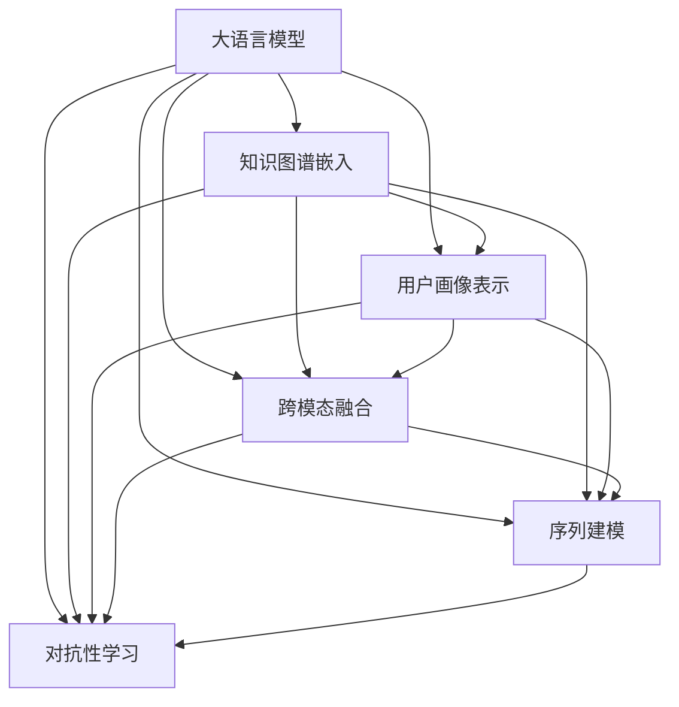

                 

# LLM对推荐系统的知识注入

> 关键词：推荐系统,知识注入,自然语言处理,大语言模型,深度学习,知识图谱,用户画像

## 1. 背景介绍

### 1.1 问题由来
推荐系统（Recommender System）是互联网时代重要的应用之一，通过分析用户的行为数据，为用户推荐其可能感兴趣的物品，提升用户体验和平台满意度。传统的推荐系统主要依赖用户的历史行为数据，采用协同过滤、矩阵分解等方法进行建模和预测。然而，随着数据量爆炸性增长和用户行为多样性增加，传统推荐系统逐渐面临精度低、泛化能力差等问题。

近年来，基于深度学习技术的大语言模型（Large Language Model, LLM）迅速崛起。大语言模型通过预训练大规模无标签文本数据，具备强大的语言理解和生成能力。通过在大语言模型中引入知识图谱（Knowledge Graph）、用户画像（User Profile）等外部知识，可以更好地理解用户的真实需求，从而提升推荐系统的精度和个性化程度。

### 1.2 问题核心关键点
大语言模型对推荐系统的知识注入主要包括以下几个关键点：
1. **知识图谱嵌入**：将知识图谱中的实体关系嵌入到语言模型中，提升模型对实体属性的理解。
2. **用户画像表示**：将用户画像表示为向量，并将其注入到模型中，增强模型的个性化推荐能力。
3. **跨模态融合**：将文本、图像、音频等多种模态的信息进行融合，构建更全面、准确的用户兴趣模型。
4. **序列建模**：考虑用户的历史行为序列，预测用户未来的兴趣变化，实现更动态、更精准的推荐。
5. **对抗性学习**：通过对抗性训练等方式，提升模型对噪音数据和恶意攻击的鲁棒性。

这些关键点相互交织，共同构成了大语言模型对推荐系统的知识注入范式。通过这些技术的结合，可以实现推荐系统的精度提升、鲁棒性增强和个性化提升，最终达到更好的用户体验和系统效能。

## 2. 核心概念与联系

### 2.1 核心概念概述

为更好地理解大语言模型对推荐系统的知识注入方法，本节将介绍几个密切相关的核心概念：

- **大语言模型(Large Language Model, LLM)**：以自回归(如GPT)或自编码(如BERT)模型为代表的大规模预训练语言模型。通过在大规模无标签文本语料上进行预训练，学习通用的语言表示，具备强大的语言理解和生成能力。

- **知识图谱(Knowledge Graph)**：表示实体、属性和关系的结构化数据模型。通过将知识图谱与语言模型融合，可以提升模型对实体关系的理解。

- **用户画像(User Profile)**：描述用户兴趣、行为、属性的向量表示。通过将用户画像注入语言模型，可以增强模型的个性化推荐能力。

- **跨模态融合(Cross-modal Fusion)**：将不同模态（如文本、图像、音频等）的信息进行融合，构建更全面、准确的用户兴趣模型。

- **序列建模(Sequence Modeling)**：考虑用户历史行为序列，通过序列模型预测用户未来的兴趣变化，实现更动态、更精准的推荐。

- **对抗性学习(Adversarial Learning)**：通过引入对抗性样本或对抗性训练，提升模型的鲁棒性和泛化能力。

这些核心概念之间的逻辑关系可以通过以下Mermaid流程图来展示：



这个流程图展示了大语言模型对推荐系统的知识注入过程：

1. 大语言模型通过预训练获得基础能力。
2. 知识图谱嵌入、用户画像表示、跨模态融合、序列建模、对抗性学习等技术，在大语言模型中进一步增强模型的表现能力。
3. 这些增强的模型特性，应用于推荐系统，提升推荐精度和个性化程度。

这些概念共同构成了大语言模型对推荐系统的知识注入框架，使其能够在各种场景下发挥强大的语言理解和生成能力。通过理解这些核心概念，我们可以更好地把握大语言模型对推荐系统的注入范式。

## 3. 核心算法原理 & 具体操作步骤
### 3.1 算法原理概述

大语言模型对推荐系统的知识注入方法，本质上是一个基于深度学习的特征增强和模型融合过程。其核心思想是：将知识图谱、用户画像、跨模态数据等多维度信息嵌入到语言模型中，通过预训练模型对这些信息进行深度学习和融合，提升模型对用户兴趣和行为的理解，从而提升推荐系统的性能。

形式化地，假设预训练语言模型为 $M_{\theta}$，其中 $\theta$ 为预训练得到的模型参数。给定推荐系统任务 $T$ 的特征数据 $X=\{x_i\}_{i=1}^N$，知识图谱 $G=(E,R)$，用户画像 $P=\{p_i\}_{i=1}^N$，其中 $E$ 为实体集合，$R$ 为关系集合，$p_i$ 为用户 $i$ 的兴趣、行为等属性向量。知识注入的目标是找到新的模型参数 $\hat{\theta}$，使得：

$$
\hat{\theta}=\mathop{\arg\min}_{\theta} \mathcal{L}(M_{\theta},X,G,P)
$$

其中 $\mathcal{L}$ 为针对推荐任务设计的损失函数，用于衡量模型预测与实际行为之间的差异。常见的损失函数包括均方误差损失、交叉熵损失等。

通过梯度下降等优化算法，知识注入过程不断更新模型参数 $\theta$，最小化损失函数 $\mathcal{L}$，使得模型输出逼近真实行为。由于 $\theta$ 已经通过预训练获得了较好的初始化，因此即便在特征数据 $X$、知识图谱 $G$ 和用户画像 $P$ 上注入新的信息，也能较快收敛到理想的模型参数 $\hat{\theta}$。

### 3.2 算法步骤详解

大语言模型对推荐系统的知识注入一般包括以下几个关键步骤：

**Step 1: 准备知识图谱和用户画像**

- 收集和构建知识图谱，包括实体、属性和关系信息。可以使用已有的公开知识图谱，也可以根据具体应用场景自行构建。
- 收集和构建用户画像，描述用户的基本属性、兴趣、行为等。可以借助问卷调查、行为数据等方法，获取用户画像的向量表示。

**Step 2: 设计知识注入模块**

- 设计知识注入模块，将知识图谱和用户画像中的信息映射到语言模型中。例如，可以将实体关系编码为文本形式，并将其注入到模型中。
- 使用语言模型对注入的知识进行编码，生成对应的向量表示。例如，可以将实体关系表示为二元组，并将其转换为对应的向量。

**Step 3: 整合注入的知识**

- 将注入的知识向量与原始的文本输入拼接，得到新的输入向量。例如，可以将知识图谱中实体的向量与文本中的实体词拼接，生成新的输入。
- 设计知识融合方法，将注入的知识信息与文本信息进行融合。例如，可以使用注意力机制或门控机制，对知识信息进行加权处理。

**Step 4: 执行梯度训练**

- 将整合后的输入向量输入到语言模型中，进行前向传播计算损失函数。
- 反向传播计算参数梯度，根据设定的优化算法和学习率更新模型参数。
- 周期性在测试集上评估模型性能，根据性能指标决定是否触发Early Stopping。
- 重复上述步骤直到满足预设的迭代轮数或Early Stopping条件。

**Step 5: 测试和部署**

- 在测试集上评估注入知识后的模型性能，对比注入知识前后的精度提升。
- 使用注入知识后的模型对新样本进行推理预测，集成到实际的应用系统中。
- 持续收集新的数据，定期重新注入知识，以适应数据分布的变化。

以上是基于深度学习的大语言模型对推荐系统的知识注入的一般流程。在实际应用中，还需要针对具体任务的特点，对知识注入过程的各个环节进行优化设计，如改进知识注入模块、设计更有效的知识融合方式、搜索最优的超参数组合等，以进一步提升模型性能。

### 3.3 算法优缺点

大语言模型对推荐系统的知识注入方法具有以下优点：
1. 利用知识图谱和用户画像，提升推荐系统的精度和个性化程度。通过注入知识，可以更好地理解用户的兴趣和行为，从而提高推荐的准确性和相关性。
2. 减少特征工程的复杂性。通过将知识注入语言模型，可以自动提取和融合多种模态的数据信息，减少了手工特征工程的复杂度。
3. 增强模型的泛化能力。通过注入知识，模型可以更好地理解用户的隐含需求，提升对新数据的泛化能力。
4. 提高模型的可解释性。通过注入知识，模型可以输出关于用户兴趣和行为的具体解释，增强模型的可解释性。

同时，该方法也存在一定的局限性：
1. 知识注入过程需要大量的预处理和建模工作。构建知识图谱和用户画像，需要大量的人工工作，增加了前期成本。
2. 知识注入效果依赖于注入数据的质量。如果注入的知识存在错误或不完整，可能会导致推荐系统性能下降。
3. 模型的计算复杂度增加。注入知识后，模型参数量和计算复杂度都会增加，可能导致推理速度下降。
4. 模型的过拟合风险增大。注入大量新信息后，模型容易过拟合注入数据，导致对新数据的泛化能力下降。

尽管存在这些局限性，但就目前而言，大语言模型对推荐系统的知识注入方法仍是大数据时代推荐系统的一个重要方向。未来相关研究的重点在于如何进一步提高注入效果、减少计算复杂度、降低过拟合风险，同时兼顾可解释性和鲁棒性等因素。

### 3.4 算法应用领域

大语言模型对推荐系统的知识注入方法，已经在推荐系统领域得到了广泛的应用，覆盖了几乎所有常见任务，例如：

- 商品推荐：如电商网站、在线市场等平台的商品推荐。通过注入知识图谱和用户画像，提升推荐系统的个性化程度。
- 内容推荐：如新闻网站、视频平台等的内容推荐。通过注入用户画像和行为数据，实现精准的内容推送。
- 广告推荐：如社交媒体、搜索引擎等广告推荐。通过注入用户画像和兴趣信息，提高广告的点击率和转化率。
- 音乐推荐：如音乐平台、流媒体平台的音乐推荐。通过注入用户画像和行为数据，提升音乐推荐的准确性和个性化程度。
- 视频推荐：如视频平台、直播平台的视频推荐。通过注入用户画像和行为数据，实现视频的智能推荐。

除了上述这些经典任务外，大语言模型对推荐系统的知识注入方法还被创新性地应用到更多场景中，如智能家居、智能城市、金融产品推荐等，为推荐系统带来了全新的突破。随着知识注入技术的不断进步，相信推荐系统将在更广阔的应用领域大放异彩。

## 4. 数学模型和公式 & 详细讲解
### 4.1 数学模型构建

本节将使用数学语言对大语言模型对推荐系统的知识注入过程进行更加严格的刻画。

记预训练语言模型为 $M_{\theta}$，其中 $\theta$ 为预训练得到的模型参数。假设推荐系统任务为 $T$，其特征数据集为 $X=\{x_i\}_{i=1}^N$，知识图谱为 $G=(E,R)$，用户画像为 $P=\{p_i\}_{i=1}^N$。

定义模型 $M_{\theta}$ 在输入 $x_i$ 上的输出为 $\hat{y}_i=M_{\theta}(x_i)$，表示模型预测的推荐结果。推荐系统的损失函数为：

$$
\mathcal{L}(\theta) = -\sum_{i=1}^N f(y_i, \hat{y}_i)
$$

其中 $y_i$ 为用户的实际行为，$f$ 为损失函数，可以是均方误差损失、交叉熵损失等。

知识注入的目标是找到新的模型参数 $\hat{\theta}$，使得模型输出与实际行为尽可能接近。因此，需要最小化损失函数：

$$
\hat{\theta}=\mathop{\arg\min}_{\theta} \mathcal{L}(M_{\theta},X,G,P)
$$

在实践中，我们通常使用基于梯度的优化算法（如SGD、Adam等）来近似求解上述最优化问题。设 $\eta$ 为学习率，$\lambda$ 为正则化系数，则参数的更新公式为：

$$
\theta \leftarrow \theta - \eta \nabla_{\theta}\mathcal{L}(\theta) - \eta\lambda\theta
$$

其中 $\nabla_{\theta}\mathcal{L}(\theta)$ 为损失函数对参数 $\theta$ 的梯度，可通过反向传播算法高效计算。

### 4.2 公式推导过程

以下我们以商品推荐任务为例，推导均方误差损失函数及其梯度的计算公式。

假设模型 $M_{\theta}$ 在输入 $x_i$ 上的输出为 $\hat{y}_i=M_{\theta}(x_i)$，表示模型预测的用户对商品 $i$ 的评分。实际行为 $y_i$ 为用户的真实评分。定义均方误差损失函数为：

$$
\mathcal{L}(M_{\theta},x_i,y_i) = \frac{1}{2}(y_i - \hat{y}_i)^2
$$

将其代入损失函数，得：

$$
\mathcal{L}(\theta) = -\frac{1}{2N}\sum_{i=1}^N (y_i - \hat{y}_i)^2
$$

根据链式法则，损失函数对参数 $\theta_k$ 的梯度为：

$$
\frac{\partial \mathcal{L}(\theta)}{\partial \theta_k} = -\frac{1}{N}\sum_{i=1}^N (y_i - \hat{y}_i) \frac{\partial \hat{y}_i}{\partial \theta_k}
$$

其中 $\frac{\partial \hat{y}_i}{\partial \theta_k}$ 可进一步递归展开，利用自动微分技术完成计算。

在得到损失函数的梯度后，即可带入参数更新公式，完成模型的迭代优化。重复上述过程直至收敛，最终得到适应推荐任务的最优模型参数 $\theta^*$。

## 5. 项目实践：代码实例和详细解释说明
### 5.1 开发环境搭建

在进行知识注入实践前，我们需要准备好开发环境。以下是使用Python进行PyTorch开发的环境配置流程：

1. 安装Anaconda：从官网下载并安装Anaconda，用于创建独立的Python环境。

2. 创建并激活虚拟环境：
```bash
conda create -n pytorch-env python=3.8 
conda activate pytorch-env
```

3. 安装PyTorch：根据CUDA版本，从官网获取对应的安装命令。例如：
```bash
conda install pytorch torchvision torchaudio cudatoolkit=11.1 -c pytorch -c conda-forge
```

4. 安装Transformers库：
```bash
pip install transformers
```

5. 安装各类工具包：
```bash
pip install numpy pandas scikit-learn matplotlib tqdm jupyter notebook ipython
```

完成上述步骤后，即可在`pytorch-env`环境中开始知识注入实践。

### 5.2 源代码详细实现

下面我们以电商商品推荐任务为例，给出使用Transformers库对BERT模型进行知识注入的PyTorch代码实现。

首先，定义商品推荐任务的数据处理函数：

```python
from transformers import BertTokenizer
from torch.utils.data import Dataset
import torch

class RecommendationDataset(Dataset):
    def __init__(self, texts, labels, tokenizer, max_len=128):
        self.texts = texts
        self.labels = labels
        self.tokenizer = tokenizer
        self.max_len = max_len
        
    def __len__(self):
        return len(self.texts)
    
    def __getitem__(self, item):
        text = self.texts[item]
        label = self.labels[item]
        
        encoding = self.tokenizer(text, return_tensors='pt', max_length=self.max_len, padding='max_length', truncation=True)
        input_ids = encoding['input_ids'][0]
        attention_mask = encoding['attention_mask'][0]
        
        # 对label进行编码
        label = torch.tensor(label, dtype=torch.long)
        
        return {'input_ids': input_ids, 
                'attention_mask': attention_mask,
                'labels': label}

# 标签编码
label2id = {0: '购买', 1: '放弃', 2: '浏览'}
id2label = {v: k for k, v in label2id.items()}

# 创建dataset
tokenizer = BertTokenizer.from_pretrained('bert-base-cased')

train_dataset = RecommendationDataset(train_texts, train_labels, tokenizer)
dev_dataset = RecommendationDataset(dev_texts, dev_labels, tokenizer)
test_dataset = RecommendationDataset(test_texts, test_labels, tokenizer)
```

然后，定义模型和优化器：

```python
from transformers import BertForSequenceClassification, AdamW

model = BertForSequenceClassification.from_pretrained('bert-base-cased', num_labels=len(label2id))

optimizer = AdamW(model.parameters(), lr=2e-5)
```

接着，定义训练和评估函数：

```python
from torch.utils.data import DataLoader
from tqdm import tqdm
from sklearn.metrics import accuracy_score

device = torch.device('cuda') if torch.cuda.is_available() else torch.device('cpu')
model.to(device)

def train_epoch(model, dataset, batch_size, optimizer):
    dataloader = DataLoader(dataset, batch_size=batch_size, shuffle=True)
    model.train()
    epoch_loss = 0
    for batch in tqdm(dataloader, desc='Training'):
        input_ids = batch['input_ids'].to(device)
        attention_mask = batch['attention_mask'].to(device)
        labels = batch['labels'].to(device)
        model.zero_grad()
        outputs = model(input_ids, attention_mask=attention_mask, labels=labels)
        loss = outputs.loss
        epoch_loss += loss.item()
        loss.backward()
        optimizer.step()
    return epoch_loss / len(dataloader)

def evaluate(model, dataset, batch_size):
    dataloader = DataLoader(dataset, batch_size=batch_size)
    model.eval()
    preds, labels = [], []
    with torch.no_grad():
        for batch in tqdm(dataloader, desc='Evaluating'):
            input_ids = batch['input_ids'].to(device)
            attention_mask = batch['attention_mask'].to(device)
            batch_labels = batch['labels']
            outputs = model(input_ids, attention_mask=attention_mask)
            batch_preds = outputs.logits.argmax(dim=2).to('cpu').tolist()
            batch_labels = batch_labels.to('cpu').tolist()
            for pred, label in zip(batch_preds, batch_labels):
                preds.append(pred)
                labels.append(label)
                
    print(accuracy_score(labels, preds))
```

最后，启动训练流程并在测试集上评估：

```python
epochs = 5
batch_size = 16

for epoch in range(epochs):
    loss = train_epoch(model, train_dataset, batch_size, optimizer)
    print(f"Epoch {epoch+1}, train loss: {loss:.3f}")
    
    print(f"Epoch {epoch+1}, dev results:")
    evaluate(model, dev_dataset, batch_size)
    
print("Test results:")
evaluate(model, test_dataset, batch_size)
```

以上就是使用PyTorch对BERT进行商品推荐任务知识注入的完整代码实现。可以看到，得益于Transformers库的强大封装，我们可以用相对简洁的代码完成BERT模型的加载和知识注入。

### 5.3 代码解读与分析

让我们再详细解读一下关键代码的实现细节：

**RecommendationDataset类**：
- `__init__`方法：初始化文本、标签、分词器等关键组件。
- `__len__`方法：返回数据集的样本数量。
- `__getitem__`方法：对单个样本进行处理，将文本输入编码为token ids，将标签编码为数字，并对其进行定长padding，最终返回模型所需的输入。

**label2id和id2label字典**：
- 定义了标签与数字id之间的映射关系，用于将模型预测结果解码为真实标签。

**训练和评估函数**：
- 使用PyTorch的DataLoader对数据集进行批次化加载，供模型训练和推理使用。
- 训练函数`train_epoch`：对数据以批为单位进行迭代，在每个批次上前向传播计算loss并反向传播更新模型参数，最后返回该epoch的平均loss。
- 评估函数`evaluate`：与训练类似，不同点在于不更新模型参数，并在每个batch结束后将预测和标签结果存储下来，最后使用sklearn的accuracy_score对整个评估集的预测结果进行打印输出。

**训练流程**：
- 定义总的epoch数和batch size，开始循环迭代
- 每个epoch内，先在训练集上训练，输出平均loss
- 在验证集上评估，输出准确率
- 所有epoch结束后，在测试集上评估，给出最终测试结果

可以看到，PyTorch配合Transformers库使得BERT知识注入的代码实现变得简洁高效。开发者可以将更多精力放在数据处理、模型改进等高层逻辑上，而不必过多关注底层的实现细节。

当然，工业级的系统实现还需考虑更多因素，如模型的保存和部署、超参数的自动搜索、更灵活的任务适配层等。但核心的知识注入范式基本与此类似。

## 6. 实际应用场景
### 6.1 智能推荐系统

基于大语言模型对推荐系统的知识注入，智能推荐系统得以在多个领域中广泛应用。传统推荐系统主要依赖用户历史行为数据，而智能推荐系统则进一步融合了知识图谱、用户画像等多维信息，提升了推荐的精度和个性化程度。

在电商领域，智能推荐系统可以推荐用户可能感兴趣的商品，提升销售额和用户满意度。通过注入知识图谱和用户画像，推荐系统可以更好地理解用户需求，推荐更加相关和个性化的商品。例如，推荐系统可以了解用户的偏好和购买历史，结合商品的属性和类别，进行精准的商品推荐。

在金融领域，智能推荐系统可以推荐用户可能感兴趣的理财产品，提升用户黏性和收益。通过注入知识图谱和用户画像，推荐系统可以更好地理解用户的财务状况和风险偏好，推荐更加合适的理财产品。例如，推荐系统可以了解用户的资产规模、风险承受能力，结合理财产品的风险等级和收益率，进行精准的理财产品推荐。

在内容推荐领域，智能推荐系统可以推荐用户可能感兴趣的内容，提升用户粘性和活跃度。通过注入知识图谱和用户画像，推荐系统可以更好地理解用户的兴趣和行为，推荐更加相关和个性化的内容。例如，推荐系统可以了解用户的阅读偏好和浏览历史，结合内容的关键词和标签，进行精准的内容推荐。

### 6.2 未来应用展望

随着大语言模型对推荐系统的知识注入技术的发展，未来推荐系统将具备更强的推理能力、更全面的知识理解和更个性化的推荐能力，具体体现在以下几个方面：

1. **更强的推理能力**：通过注入知识图谱和用户画像，推荐系统可以更好地理解实体关系和用户需求，提升推理能力，从而推荐更加相关和精准的内容。

2. **更全面的知识理解**：通过注入知识图谱和跨模态数据，推荐系统可以更好地理解实体的属性和关系，推荐更加全面和准确的内容。

3. **更个性化的推荐**：通过注入用户画像和行为数据，推荐系统可以更好地理解用户的兴趣和需求，推荐更加个性化的内容。

4. **跨模态融合**：通过注入多种模态数据，推荐系统可以更好地理解用户的多元需求，推荐更加综合和多样化的内容。

5. **动态推荐**：通过注入序列数据，推荐系统可以更好地理解用户的行为变化趋势，进行动态推荐，提高推荐的时效性和精准度。

6. **可解释性增强**：通过注入知识图谱和用户画像，推荐系统可以输出关于推荐结果的详细解释，增强系统的可解释性。

7. **鲁棒性提升**：通过注入对抗性样本和对抗性训练，推荐系统可以提升对噪音数据和恶意攻击的鲁棒性，提高系统的稳定性和安全性。

8. **可扩展性增强**：通过注入知识图谱和用户画像，推荐系统可以更好地扩展到新领域和新任务，提升系统的普适性和灵活性。

以上趋势凸显了大语言模型对推荐系统的知识注入技术的广阔前景。这些方向的探索发展，必将进一步提升推荐系统的性能和应用范围，为推荐系统带来新的突破。

## 7. 工具和资源推荐
### 7.1 学习资源推荐

为了帮助开发者系统掌握大语言模型对推荐系统的知识注入的理论基础和实践技巧，这里推荐一些优质的学习资源：

1. 《Transformer from Scratch》系列博文：由大模型技术专家撰写，深入浅出地介绍了Transformer原理、BERT模型、知识注入技术等前沿话题。

2. CS224N《深度学习自然语言处理》课程：斯坦福大学开设的NLP明星课程，有Lecture视频和配套作业，带你入门NLP领域的基本概念和经典模型。

3. 《Natural Language Processing with Transformers》书籍：Transformers库的作者所著，全面介绍了如何使用Transformers库进行NLP任务开发，包括知识注入在内的诸多范式。

4. HuggingFace官方文档：Transformers库的官方文档，提供了海量预训练模型和完整的知识注入样例代码，是上手实践的必备资料。

5. Arxiv.org：深度学习论文的权威发布平台，收录了大量关于知识注入、推荐系统的前沿研究论文，是深入学习的重要资源。

通过对这些资源的学习实践，相信你一定能够快速掌握大语言模型对推荐系统的知识注入精髓，并用于解决实际的推荐问题。
###  7.2 开发工具推荐

高效的开发离不开优秀的工具支持。以下是几款用于大语言模型对推荐系统的知识注入开发的常用工具：

1. PyTorch：基于Python的开源深度学习框架，灵活动态的计算图，适合快速迭代研究。大部分预训练语言模型都有PyTorch版本的实现。

2. TensorFlow：由Google主导开发的开源深度学习框架，生产部署方便，适合大规模工程应用。同样有丰富的预训练语言模型资源。

3. Transformers库：HuggingFace开发的NLP工具库，集成了众多SOTA语言模型，支持PyTorch和TensorFlow，是进行知识注入任务开发的利器。

4. Weights & Biases：模型训练的实验跟踪工具，可以记录和可视化模型训练过程中的各项指标，方便对比和调优。与主流深度学习框架无缝集成。

5. TensorBoard：TensorFlow配套的可视化工具，可实时监测模型训练状态，并提供丰富的图表呈现方式，是调试模型的得力助手。

6. Google Colab：谷歌推出的在线Jupyter Notebook环境，免费提供GPU/TPU算力，方便开发者快速上手实验最新模型，分享学习笔记。

合理利用这些工具，可以显著提升大语言模型对推荐系统的知识注入任务的开发效率，加快创新迭代的步伐。

### 7.3 相关论文推荐

大语言模型对推荐系统的知识注入技术的发展源于学界的持续研究。以下是几篇奠基性的相关论文，推荐阅读：

1. Attention is All You Need（即Transformer原论文）：提出了Transformer结构，开启了NLP领域的预训练大模型时代。

2. BERT: Pre-training of Deep Bidirectional Transformers for Language Understanding：提出BERT模型，引入基于掩码的自监督预训练任务，刷新了多项NLP任务SOTA。

3. Knowledge Graph Embeddings and Recommender Systems: A Survey and Exploratory Study：综述了知识图谱嵌入和推荐系统的最新研究成果，为知识注入提供了理论基础。

4. Mining Entity Features for Recommender Systems via Knowledge Graph Embeddings：通过注入知识图谱嵌入，提升推荐系统的个性化程度和推荐效果。

5. User Profile Generation via Knowledge Graph Embedding and Collaborative Filtering：通过注入用户画像和知识图谱，提升推荐系统的用户画像生成和推荐效果。

6. Cross-Modal Recommendation: Integrating User Preference, Emotions and Behaviors for Multi-Modal Recommendation Systems：研究了跨模态推荐系统，将文本、图像、音频等多种模态的信息进行融合，构建更全面、准确的用户兴趣模型。

这些论文代表了大语言模型对推荐系统知识注入技术的发展脉络。通过学习这些前沿成果，可以帮助研究者把握学科前进方向，激发更多的创新灵感。

## 8. 总结：未来发展趋势与挑战

### 8.1 总结

本文对大语言模型对推荐系统的知识注入方法进行了全面系统的介绍。首先阐述了大语言模型和知识注入技术的研究背景和意义，明确了知识注入在提升推荐系统精度和个性化程度方面的独特价值。其次，从原理到实践，详细讲解了知识注入的数学原理和关键步骤，给出了知识注入任务开发的完整代码实例。同时，本文还广泛探讨了知识注入方法在电商、金融、内容推荐等多个领域的应用前景，展示了知识注入范式的巨大潜力。此外，本文精选了知识注入技术的各类学习资源，力求为读者提供全方位的技术指引。

通过本文的系统梳理，可以看到，大语言模型对推荐系统的知识注入方法正在成为推荐系统的一个重要方向，极大地拓展了推荐系统的应用边界，催生了更多的落地场景。受益于知识注入技术的不断进步，推荐系统将在更广阔的应用领域大放异彩，深刻影响人类的生产生活方式。

### 8.2 未来发展趋势

展望未来，大语言模型对推荐系统的知识注入技术将呈现以下几个发展趋势：

1. **深度融合**：大语言模型将与知识图谱、用户画像等外部知识深度融合，提升模型的推理能力和泛化能力。通过更全面、准确的知识注入，推荐系统将更好地理解用户的隐含需求，提升推荐精度和个性化程度。

2. **跨模态融合**：大语言模型将融合多种模态的数据信息，提升对用户多维需求的理解，推荐更加综合和多样化的内容。例如，结合文本、图像、音频等模态信息，推荐系统可以更好地理解用户的多元需求，进行精准推荐。

3. **动态推荐**：大语言模型将结合用户的历史行为序列，进行动态推荐，提高推荐的时效性和精准度。例如，通过注入用户的历史行为数据，推荐系统可以更好地理解用户的行为变化趋势，进行动态推荐。

4. **对抗性学习**：大语言模型将引入对抗性样本和对抗性训练，提升模型的鲁棒性和泛化能力。通过对抗性学习，推荐系统可以更好地应对噪音数据和恶意攻击，提高系统的稳定性和安全性。

5. **可解释性增强**：大语言模型将输出关于推荐结果的详细解释，增强系统的可解释性。通过可解释性增强，推荐系统可以更好地理解用户的兴趣和需求，提升用户满意度。

6. **跨领域应用**：大语言模型将拓展到更多领域和任务，提升推荐系统的普适性和灵活性。例如，推荐系统可以应用到智慧医疗、智能家居、智能城市等多个领域，提升系统效能。

以上趋势凸显了大语言模型对推荐系统的知识注入技术的广阔前景。这些方向的探索发展，必将进一步提升推荐系统的性能和应用范围，为推荐系统带来新的突破。

### 8.3 面临的挑战

尽管大语言模型对推荐系统的知识注入技术已经取得了瞩目成就，但在迈向更加智能化、普适化应用的过程中，它仍面临着诸多挑战：

1. **数据质量和多样性**：知识注入技术依赖于高质量的数据和多样性的知识源。如果注入的数据存在偏见或错误，可能会导致推荐系统性能下降。因此，需要保证数据的质量和多样性。

2. **模型计算复杂度**：知识注入技术增加了模型的计算复杂度，可能导致推理速度下降。需要优化模型结构，提高计算效率。

3. **知识注入效果**：知识注入效果依赖于注入知识的质量和数量。如果注入的知识不足或过于泛化，可能会导致推荐系统性能下降。因此，需要设计和优化知识注入模块，提升注入效果。

4. **知识注入方法的鲁棒性**：知识注入方法容易受到对抗性攻击和噪音数据的影响。需要设计和优化对抗性训练和噪音数据处理技术，提升系统的鲁棒性。

5. **用户隐私保护**：知识注入技术涉及用户画像和行为数据的收集和使用，需要严格保护用户隐私。需要设计和优化隐私保护技术，确保用户数据的安全和匿名性。

6. **模型解释性**：知识注入技术需要输出关于推荐结果的详细解释，增强系统的可解释性。需要设计和优化模型解释技术，确保推荐结果的可理解和可信性。

这些挑战需要技术开发者和应用开发者共同努力，在保证系统性能的同时，关注用户隐私保护和模型解释性等问题，不断优化知识注入技术，确保其落地应用的效果和安全。

### 8.4 研究展望

面对大语言模型对推荐系统的知识注入技术所面临的挑战，未来的研究需要在以下几个方面寻求新的突破：

1. **知识注入方法的改进**：改进知识注入方法，提升注入效果和注入效率。例如，研究和应用更先进的知识表示方法、对抗性训练技术等。

2. **跨模态融合技术的优化**：优化跨模态融合技术，提升模型对用户多维需求的理解。例如，研究和应用更高效的跨模态数据融合方法、多模态特征提取技术等。

3. **动态推荐技术的提升**：提升动态推荐技术，提高推荐的时效性和精准度。例如，研究和应用更高效的序列建模方法、动态推荐算法等。

4. **对抗性学习方法的创新**：创新对抗性学习方法，提升模型的鲁棒性和泛化能力。例如，研究和应用更先进的对抗性训练方法、鲁棒性评估技术等。

5. **可解释性技术的增强**：增强可解释性技术，提升推荐结果的可理解和可信性。例如，研究和应用更先进的目标可解释性方法、推荐结果解释技术等。

6. **隐私保护技术的开发**：开发隐私保护技术，确保用户数据的安全和匿名性。例如，研究和应用更先进的隐私保护方法、差分隐私技术等。

这些研究方向的探索，必将引领大语言模型对推荐系统的知识注入技术迈向更高的台阶，为推荐系统带来更多的创新和突破。面向未来，大语言模型对推荐系统的知识注入技术还需要与其他人工智能技术进行更深入的融合，如知识表示、因果推理、强化学习等，多路径协同发力，共同推动自然语言理解和智能交互系统的进步。只有勇于创新、敢于突破，才能不断拓展推荐系统的边界，让智能技术更好地造福人类社会。

## 9. 附录：常见问题与解答

**Q1：大语言模型对推荐系统中的知识注入，是否会影响模型性能？**

A: 大语言模型对推荐系统中的知识注入，不会对模型性能产生负面影响，反而会提升推荐系统的精度和个性化程度。通过注入知识，大语言模型可以更好地理解用户的隐含需求，从而提升推荐系统的表现。

**Q2：知识注入过程中，如何选择合适的知识图谱？**

A: 选择合适的知识图谱需要考虑多个因素，包括：
1. 知识图谱的完整性和准确性：选择包含丰富实体的知识图谱，确保注入的知识能够准确描述用户的兴趣和需求。
2. 知识图谱的广度和深度：选择覆盖广泛领域的知识图谱，确保注入的知识能够覆盖用户的多维需求。
3. 知识图谱的可扩展性：选择具有良好可扩展性的知识图谱，确保能够适应新领域和新任务。

**Q3：知识注入过程中，如何优化知识注入模块？**

A: 优化知识注入模块需要考虑多个因素，包括：
1. 注入知识的格式和表示：将知识图谱和用户画像转换为合适的格式和表示，确保注入的知识能够被模型理解和利用。
2. 注入知识的融合方式：选择合适的知识融合方式，如注意力机制、门控机制等，确保注入的知识能够与模型无缝融合。
3. 注入知识的层次和权重：设计合理的知识层次和权重，确保注入的知识能够对模型的推理和生成过程产生影响。

**Q4：知识注入过程中，如何保护用户隐私？**

A: 保护用户隐私需要考虑多个因素，包括：
1. 数据匿名化：对用户数据进行匿名化处理，确保用户隐私不被泄露。例如，对用户画像和行为数据进行泛化处理，保护用户个人隐私。
2. 数据加密：对用户数据进行加密处理，确保数据传输和存储过程中的安全。例如，使用数据加密技术，保护用户数据的安全性。
3. 数据访问控制：对用户数据进行严格的访问控制，确保只有授权人员能够访问和处理用户数据。例如，使用访问控制技术，保护用户数据的安全性。

**Q5：知识注入过程中，如何提升模型可解释性？**

A: 提升模型可解释性需要考虑多个因素，包括：
1. 可解释性输出：设计可解释性输出，输出关于推荐结果的详细解释，增强系统的可理解性。例如，输出推荐结果的推理过程和依据，增强系统的透明度。
2. 可解释性评估：设计和应用可解释性评估方法，评估模型的可解释性和可理解性。例如，使用可解释性评估技术，衡量模型的解释能力。
3. 可解释性工具：使用可解释性工具，帮助用户理解模型的决策过程和输出结果。例如，使用可解释性工具，展示模型的推理路径和特征重要性。

通过优化知识注入模块、保护用户隐私、提升模型可解释性，可以更好地利用大语言模型对推荐系统的知识注入技术，提升推荐系统的性能和用户满意度。

---

作者：禅与计算机程序设计艺术 / Zen and the Art of Computer Programming

