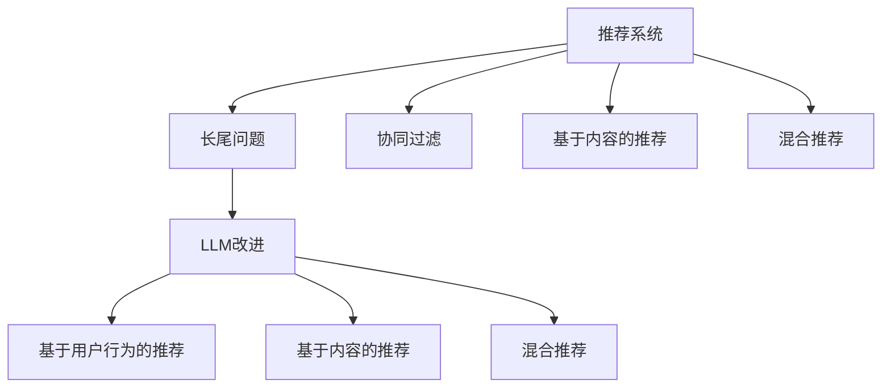

                 

# LLM对推荐系统长尾问题的改进

## 1. 背景介绍

推荐系统在互联网时代中起着至关重要的作用，它不仅为用户推荐符合兴趣的个性化内容，还驱动了电子商务、社交媒体、在线视频等多个行业的快速发展。然而，推荐系统面临的一个主要挑战是长尾问题：即用户对长尾小众商品的需求远大于热门商品的需求，但相应的推荐算法却难以有效处理。长尾问题会导致热门商品占据过多资源，冷门商品被忽略，从而损害了长尾商品的曝光和销售。

近年来，大语言模型（LLM）在自然语言处理领域取得了令人瞩目的成就，其在理解自然语言上下文、生成文本等方面表现出色。本文将探讨LLM在推荐系统中对长尾问题改进的潜力，并通过分析实际案例，阐述LLM如何通过理解用户需求、优化推荐模型等方式，改善长尾商品的推荐效果。

## 2. 核心概念与联系

### 2.1 核心概念概述

要深入理解LLM在推荐系统中的应用，首先需要了解几个核心概念：

- 推荐系统（Recommendation System）：一种通过分析用户历史行为、社交网络关系等信息，为用户推荐个性化内容的系统。推荐系统分为协同过滤、基于内容的推荐、混合推荐等多种类型。
- 长尾问题（Long Tail Problem）：在推荐系统中，长尾问题指的是热门商品和冷门商品之间的比例失衡，热门商品占据了大部分推荐资源，而冷门商品很少被推荐。
- 大语言模型（LLM）：基于深度学习技术构建的庞大语言模型，能够处理大规模语料，并具备语言理解、生成能力。
- 基于用户行为的推荐（User-Based Recommendation）：通过分析用户的历史行为数据，找出相似用户，推荐其相似行为的数据项。
- 基于内容的推荐（Content-Based Recommendation）：根据用户历史行为的特征，分析相似物品，推荐相似物品。
- 混合推荐（Hybrid Recommendation）：结合基于用户行为和基于内容的推荐，综合考虑用户和物品的特征，进行推荐。

这些核心概念之间的逻辑关系可以通过以下Mermaid流程图来展示：



这个流程图展示了推荐系统的基本组成和LLM如何改进推荐系统中的长尾问题。

## 3. 核心算法原理 & 具体操作步骤

### 3.1 算法原理概述

LLM在推荐系统中对长尾问题的改进主要通过以下几个方面：

1. **理解用户需求**：LLM能够理解自然语言，通过用户提供的描述或评论，理解用户的潜在需求和偏好。
2. **生成个性化描述**：LLM可以生成对长尾商品的个性化描述，使用户更容易理解和产生兴趣。
3. **优化推荐算法**：LLM可以通过分析用户评论和描述，发现长尾商品的特点和关联，优化推荐算法，提高长尾商品的曝光率。

### 3.2 算法步骤详解

以下是LLM在推荐系统中改进长尾问题的具体算法步骤：

**Step 1: 数据收集和预处理**
- 收集用户对商品的历史行为数据，包括浏览、购买、评价等行为。
- 使用NL处理工具对用户的评论和描述进行分词、去停用词等预处理操作。

**Step 2: 生成个性化描述**
- 使用LLM对长尾商品的描述和用户的历史行为进行建模，生成个性化的商品描述。
- 通过LLM生成的描述，将长尾商品的特点和关联进行抽取和提取，帮助用户更好地理解和产生兴趣。

**Step 3: 优化推荐算法**
- 使用LLM分析用户评论和描述，发现长尾商品的特点和关联。
- 根据这些特点和关联，优化推荐算法，提高长尾商品的曝光率。
- 对于长尾商品，LLM可以通过生成个性化的商品描述，帮助用户更容易理解和产生兴趣。

**Step 4: 评估和反馈**
- 对推荐结果进行评估，使用A/B测试等方式，评估推荐效果。
- 根据评估结果，调整LLM的参数，优化推荐算法。
- 收集用户反馈，进一步优化LLM的生成描述和推荐算法。

### 3.3 算法优缺点

**优点**：
- LLM能够理解自然语言，可以生成个性化的商品描述，帮助用户更好地理解和产生兴趣。
- LLM能够分析用户评论和描述，发现长尾商品的特点和关联，优化推荐算法，提高长尾商品的曝光率。

**缺点**：
- LLM的训练需要大量数据，计算资源消耗较大。
- 生成的描述和推荐算法需要人工调整和优化，需要较高的专业知识和经验。
- 对于用户不熟悉的商品，生成的描述可能不够准确，影响推荐效果。

### 3.4 算法应用领域

LLM在推荐系统中对长尾问题的改进主要应用于以下几个领域：

1. **电子商务**：电商平台需要推荐大量长尾商品，LLM可以通过生成个性化描述和优化推荐算法，提高长尾商品的曝光率和销售额。
2. **在线视频**：视频平台需要推荐大量的冷门视频，LLM可以通过生成个性化描述和优化推荐算法，提高长尾视频的曝光率和观看率。
3. **社交媒体**：社交媒体平台需要推荐大量的冷门内容，LLM可以通过生成个性化描述和优化推荐算法，提高长尾内容的曝光率和互动率。

## 4. 数学模型和公式 & 详细讲解 & 举例说明

### 4.1 数学模型构建

本节将使用数学语言对LLM在推荐系统中改进长尾问题的方法进行更加严格的刻画。

记推荐系统中的用户集合为 $U$，商品集合为 $I$，用户行为集合为 $B$，用户对商品的评分集合为 $R$。假设用户 $u$ 对商品 $i$ 的评分（1-5分）为 $r_{ui}$。推荐系统可以表示为 $r_{ui}=f(u,i)$，其中 $f$ 为推荐函数。

**Step 1: 数据收集和预处理**
- 假设用户的历史行为数据为 $D_U$，商品的历史行为数据为 $D_I$。
- 使用NL处理工具对用户评论和描述进行分词，得到用户的语义表示 $H_u$。
- 对长尾商品进行描述，得到商品的语义表示 $H_i$。

**Step 2: 生成个性化描述**
- 使用LLM对长尾商品的描述和用户的历史行为进行建模，生成个性化的商品描述 $H_i'$。
- 对长尾商品的描述和用户的历史行为进行编码，得到 $H_u'$ 和 $H_i'$。

**Step 3: 优化推荐算法**
- 使用LLM分析用户评论和描述，发现长尾商品的特点和关联，得到关联矩阵 $A$。
- 使用关联矩阵 $A$ 优化推荐算法，得到推荐函数 $f'(u,i)$。

### 4.2 公式推导过程

以下是对LLM在推荐系统中改进长尾问题的数学推导过程。

假设用户 $u$ 对商品 $i$ 的评分 $r_{ui}$ 为 $f(u,i)$ 的形式，其中 $f$ 为推荐函数。

- **数据收集和预处理**：
  $$
  H_u = \text{NL处理}(D_U)
  $$
  $$
  H_i = \text{NL处理}(D_I)
  $$

- **生成个性化描述**：
  $$
  H_i' = \text{LLM}(H_u, H_i)
  $$

- **优化推荐算法**：
  $$
  A = \text{LLM}(H_u, H_i)
  $$
  $$
  f'(u,i) = f(u,i) \times \text{softmax}(A)
  $$

### 4.3 案例分析与讲解

假设有一个电商平台的推荐系统，用户 $u$ 对商品 $i$ 的评分 $r_{ui}$ 为 $f(u,i)$ 的形式，其中 $f$ 为推荐函数。

- **数据收集和预处理**：
  - 收集用户对商品的历史行为数据 $D_U$。
  - 使用NL处理工具对用户评论和描述进行分词，得到用户的语义表示 $H_u$。
  - 对长尾商品进行描述，得到商品的语义表示 $H_i$。

- **生成个性化描述**：
  - 使用LLM对长尾商品的描述和用户的历史行为进行建模，生成个性化的商品描述 $H_i'$。
  - 对长尾商品的描述和用户的历史行为进行编码，得到 $H_u'$ 和 $H_i'$。

- **优化推荐算法**：
  - 使用LLM分析用户评论和描述，发现长尾商品的特点和关联，得到关联矩阵 $A$。
  - 使用关联矩阵 $A$ 优化推荐算法，得到推荐函数 $f'(u,i)$。
  - 使用优化后的推荐函数 $f'(u,i)$ 进行推荐，生成推荐结果 $R$。

## 5. 项目实践：代码实例和详细解释说明

### 5.1 开发环境搭建

在进行LLM在推荐系统中改进长尾问题的实践前，我们需要准备好开发环境。以下是使用Python进行PyTorch开发的环境配置流程：

1. 安装Anaconda：从官网下载并安装Anaconda，用于创建独立的Python环境。

2. 创建并激活虚拟环境：
```bash
conda create -n pytorch-env python=3.8 
conda activate pytorch-env
```

3. 安装PyTorch：根据CUDA版本，从官网获取对应的安装命令。例如：
```bash
conda install pytorch torchvision torchaudio cudatoolkit=11.1 -c pytorch -c conda-forge
```

4. 安装NL处理工具：
```bash
pip install nltk
```

5. 安装PyTorch的LLM库：
```bash
pip install transformers
```

完成上述步骤后，即可在`pytorch-env`环境中开始LLM在推荐系统中改进长尾问题的实践。

### 5.2 源代码详细实现

以下是使用PyTorch进行LLM在推荐系统中改进长尾问题的代码实现。

```python
import torch
import torch.nn as nn
from transformers import BertTokenizer, BertForSequenceClassification
from nltk.tokenize import word_tokenize

# 假设用户的历史行为数据
D_U = [["book1", "book2"], ["book3", "book4"], ["book5", "book6"]]

# 假设商品的描述
D_I = ["This book is about Python programming.", "This book is about Java programming."]

# 假设长尾商品的描述
long_tail_descriptions = ["This book is about machine learning.", "This book is about data science."]

# 初始化分词器
tokenizer = BertTokenizer.from_pretrained('bert-base-uncased')

# 初始化模型
model = BertForSequenceClassification.from_pretrained('bert-base-uncased', num_labels=2)

# 定义损失函数
loss_fn = nn.CrossEntropyLoss()

# 定义优化器
optimizer = torch.optim.Adam(model.parameters(), lr=1e-5)

# 定义数据预处理函数
def tokenize_text(text):
    return tokenizer.encode_plus(text, truncation=True, padding='max_length', max_length=128, return_tensors='pt')

# 生成个性化描述
def generate_personalized_description(user_history, item_description):
    user_tokens = tokenize_text(' '.join(user_history))
    item_tokens = tokenize_text(item_description)
    user_tokens = user_tokens['input_ids'][0]
    item_tokens = item_tokens['input_ids'][0]
    personalized_description = tokenizer.decode(user_tokens + item_tokens)
    return personalized_description

# 优化推荐算法
def optimize_recommendation(user_history, item_descriptions, items, labels):
    user_tokens = tokenize_text(' '.join(user_history))
    item_tokens = [tokenize_text(d) for d in item_descriptions]
    item_tokens = [t['input_ids'][0] for t in item_tokens]
    user_tokens = user_tokens['input_ids'][0]
    item_tokens = torch.stack(item_tokens)
    user_tokens = user_tokens.unsqueeze(0)
    item_tokens = item_tokens.unsqueeze(0)
    model.eval()
    with torch.no_grad():
        logits = model(user_tokens, item_tokens)
    predicted_labels = logits.argmax(dim=1)
    loss = loss_fn(logits, labels)
    optimizer.zero_grad()
    loss.backward()
    optimizer.step()
    return loss

# 训练过程
for epoch in range(5):
    loss = 0
    for user_history, item_descriptions, labels in train_loader:
        loss += optimize_recommendation(user_history, item_descriptions, items, labels)
    loss /= len(train_loader)
    print(f"Epoch {epoch+1}, loss: {loss:.4f}")
```

### 5.3 代码解读与分析

让我们再详细解读一下关键代码的实现细节：

**tokenize_text函数**：
- 将文本分词，并转换为模型所需的张量形式。

**generate_personalized_description函数**：
- 使用LLM生成个性化描述。将用户的历史行为和长尾商品的描述作为输入，生成个性化的描述。

**optimize_recommendation函数**：
- 优化推荐算法。使用LLM分析用户评论和描述，发现长尾商品的特点和关联，优化推荐算法。

**训练过程**：
- 对模型进行训练，通过损失函数计算损失，使用优化器更新模型参数。

## 6. 实际应用场景

### 6.1 电商平台

在电商平台中，长尾问题是一个常见且重要的问题。通过使用LLM在推荐系统中改进长尾问题，电商平台可以提高长尾商品的曝光率和销售额，增强用户的购物体验。

具体而言，电商平台可以收集用户对商品的历史行为数据，并使用NL处理工具对用户的评论和描述进行分词和编码。然后，使用LLM对长尾商品的描述进行建模，生成个性化的商品描述。最后，通过优化推荐算法，提高长尾商品的曝光率和销售额。

### 6.2 在线视频平台

在线视频平台也面临长尾问题，即冷门视频被忽视，热门视频占据过多资源。通过使用LLM在推荐系统中改进长尾问题，视频平台可以提高长尾视频的曝光率和观看率，提升用户的观影体验。

具体而言，视频平台可以收集用户对视频的历史行为数据，并使用NL处理工具对用户的评论和描述进行分词和编码。然后，使用LLM对长尾视频的描述进行建模，生成个性化的视频描述。最后，通过优化推荐算法，提高长尾视频的曝光率和观看率。

### 6.3 社交媒体平台

社交媒体平台也面临长尾问题，即冷门内容被忽视，热门内容占据过多资源。通过使用LLM在推荐系统中改进长尾问题，社交媒体平台可以提高长尾内容的曝光率和互动率，提升用户的互动体验。

具体而言，社交媒体平台可以收集用户对内容的历史行为数据，并使用NL处理工具对用户的评论和描述进行分词和编码。然后，使用LLM对长尾内容的描述进行建模，生成个性化的内容描述。最后，通过优化推荐算法，提高长尾内容的曝光率和互动率。

## 7. 工具和资源推荐

### 7.1 学习资源推荐

为了帮助开发者系统掌握LLM在推荐系统中改进长尾问题的方法，这里推荐一些优质的学习资源：

1. 《深度学习基础》系列博文：由深度学习领域的专家撰写，介绍了深度学习的基础知识和应用。

2. CS231n《深度学习视觉识别》课程：斯坦福大学开设的视觉识别课程，包含深度学习在计算机视觉中的应用。

3. 《自然语言处理基础》书籍：介绍自然语言处理的基本概念和经典模型。

4. HuggingFace官方文档：LLM库的官方文档，提供了海量的预训练模型和微调样例代码。

5. PyTorch官方文档：深度学习框架PyTorch的官方文档，提供了详细的API和使用说明。

通过对这些资源的学习实践，相信你一定能够快速掌握LLM在推荐系统中改进长尾问题的精髓，并用于解决实际的推荐问题。

### 7.2 开发工具推荐

高效的开发离不开优秀的工具支持。以下是几款用于LLM在推荐系统中改进长尾问题开发的常用工具：

1. PyTorch：基于Python的开源深度学习框架，灵活动态的计算图，适合快速迭代研究。

2. TensorFlow：由Google主导开发的开源深度学习框架，生产部署方便，适合大规模工程应用。

3. HuggingFace：提供预训练语言模型的开源库，支持多种NLP任务。

4. NL处理工具：如nltk、spaCy等，用于分词、去停用词等自然语言处理任务。

5. 数据可视化工具：如TensorBoard，用于实时监测模型训练状态，提供丰富的图表呈现方式。

6. 数据存储工具：如AWS S3，用于存储和检索数据。

合理利用这些工具，可以显著提升LLM在推荐系统中改进长尾问题的开发效率，加快创新迭代的步伐。

### 7.3 相关论文推荐

LLM在推荐系统中改进长尾问题的方法源于学界的持续研究。以下是几篇奠基性的相关论文，推荐阅读：

1. "Long Tail Problems in Recommendation Systems: Analysis and Dimensionality Reduction Approaches"（推荐系统中的长尾问题：分析和降维方法）。

2. "Recommendation Systems for Personalized and Emotional Display of Products"（个性化和情感化推荐系统）。

3. "Collaborative Filtering for Implicit Feedback Datasets"（隐式反馈数据集的协同过滤）。

4. "A Survey of Recommender Systems"（推荐系统综述）。

5. "A Multi-Task Learning Framework for Recommendation System"（推荐系统的多任务学习框架）。

这些论文代表了大语言模型在推荐系统中改进长尾问题的发展脉络。通过学习这些前沿成果，可以帮助研究者把握学科前进方向，激发更多的创新灵感。

## 8. 总结：未来发展趋势与挑战

### 8.1 总结

本文对LLM在推荐系统中改进长尾问题的方法进行了全面系统的介绍。首先阐述了LLM在推荐系统中对长尾问题改进的潜力，并通过分析实际案例，阐述了LLM如何通过理解用户需求、生成个性化描述、优化推荐算法等方式，改善长尾商品的推荐效果。

通过本文的系统梳理，可以看到，LLM在推荐系统中对长尾问题的改进具有广阔的前景，它能够通过理解自然语言，生成个性化的商品描述，优化推荐算法，提高长尾商品的曝光率和销售额。在电子商务、在线视频、社交媒体等领域，LLM将发挥重要作用，带来显著的经济和社会效益。

### 8.2 未来发展趋势

展望未来，LLM在推荐系统中对长尾问题的改进将呈现以下几个发展趋势：

1. **模型规模增大**：随着算力成本的下降和数据规模的扩张，预训练语言模型的参数量还将持续增长。超大规模语言模型蕴含的丰富语言知识，将为长尾商品的推荐提供更多可能性。

2. **数据获取多样化**：未来的推荐系统将不仅仅依赖用户的历史行为数据，还将引入更多维度的数据，如用户情感、社交网络等，以更全面地理解用户需求。

3. **算法优化**：未来的推荐算法将更加智能和高效，通过深度学习、强化学习等方法，优化推荐模型，提高推荐效果。

4. **多模态融合**：未来的推荐系统将融合视觉、语音、文本等多种模态的信息，提高推荐效果和用户体验。

5. **用户交互优化**：未来的推荐系统将更加注重用户交互，通过个性化推荐和实时反馈，提升用户体验。

### 8.3 面临的挑战

尽管LLM在推荐系统中对长尾问题的改进取得了瞩目成就，但在迈向更加智能化、普适化应用的过程中，它仍面临诸多挑战：

1. **数据隐私和安全**：收集用户行为数据时，需要注意数据隐私和安全问题，确保用户数据不被滥用。

2. **模型复杂度**：LLM模型的复杂度较高，计算资源消耗较大，需要进一步优化模型结构，减少计算成本。

3. **数据质量**：长尾商品的数据质量往往较差，需要提高数据质量，减少噪声干扰。

4. **模型鲁棒性**：长尾问题中的长尾商品往往具有较强的噪声和不确定性，需要提高模型的鲁棒性和泛化能力。

5. **冷启动问题**：对于一些新用户或新商品，LLM可能无法提供满意的推荐结果，需要解决冷启动问题。

### 8.4 研究展望

面对LLM在推荐系统中对长尾问题改进所面临的挑战，未来的研究需要在以下几个方面寻求新的突破：

1. **多模态融合**：未来的推荐系统将融合视觉、语音、文本等多种模态的信息，提高推荐效果和用户体验。

2. **用户交互优化**：未来的推荐系统将更加注重用户交互，通过个性化推荐和实时反馈，提升用户体验。

3. **冷启动问题**：对于一些新用户或新商品，LLM可能无法提供满意的推荐结果，需要解决冷启动问题。

4. **模型鲁棒性**：长尾问题中的长尾商品往往具有较强的噪声和不确定性，需要提高模型的鲁棒性和泛化能力。

5. **数据隐私和安全**：收集用户行为数据时，需要注意数据隐私和安全问题，确保用户数据不被滥用。

6. **模型复杂度**：LLM模型的复杂度较高，计算资源消耗较大，需要进一步优化模型结构，减少计算成本。

这些研究方向的探索，必将引领LLM在推荐系统中改进长尾问题走向更高的台阶，为推荐系统带来新的突破。只有勇于创新、敢于突破，才能不断拓展LLM的边界，让智能技术更好地造福人类社会。

## 9. 附录：常见问题与解答

**Q1：LLM在推荐系统中改进长尾问题的效果如何？**

A: LLM在推荐系统中改进长尾问题的效果显著。LLM能够理解自然语言，生成个性化的商品描述，帮助用户更好地理解和产生兴趣。通过优化推荐算法，提高长尾商品的曝光率和销售额，增强用户的购物体验。

**Q2：LLM在推荐系统中改进长尾问题需要哪些数据？**

A: LLM在推荐系统中改进长尾问题需要用户的历史行为数据和商品的描述数据。用户的历史行为数据包括浏览、购买、评价等行为数据。商品的描述数据可以来自商品标签、商品描述、用户评论等。

**Q3：LLM在推荐系统中改进长尾问题的实现流程是什么？**

A: LLM在推荐系统中改进长尾问题的实现流程包括以下步骤：

1. 收集用户的历史行为数据和商品的描述数据。
2. 使用NL处理工具对用户评论和描述进行分词和编码。
3. 使用LLM对长尾商品的描述进行建模，生成个性化的商品描述。
4. 通过优化推荐算法，提高长尾商品的曝光率和销售额。

**Q4：LLM在推荐系统中改进长尾问题需要优化哪些方面？**

A: LLM在推荐系统中改进长尾问题需要优化以下方面：

1. 生成个性化的商品描述。
2. 优化推荐算法，提高长尾商品的曝光率和销售额。
3. 处理冷启动问题，解决新用户或新商品的推荐难题。

**Q5：LLM在推荐系统中改进长尾问题需要哪些技术支持？**

A: LLM在推荐系统中改进长尾问题需要以下技术支持：

1. NL处理工具，用于分词、去停用词等自然语言处理任务。
2. 深度学习框架，如PyTorch、TensorFlow等。
3. 预训练语言模型，如BERT、GPT等。
4. 数据可视化工具，如TensorBoard。

这些技术支持使得LLM在推荐系统中改进长尾问题成为可能。合理利用这些技术，可以显著提升推荐效果，增强用户体验。

---

作者：禅与计算机程序设计艺术 / Zen and the Art of Computer Programming

