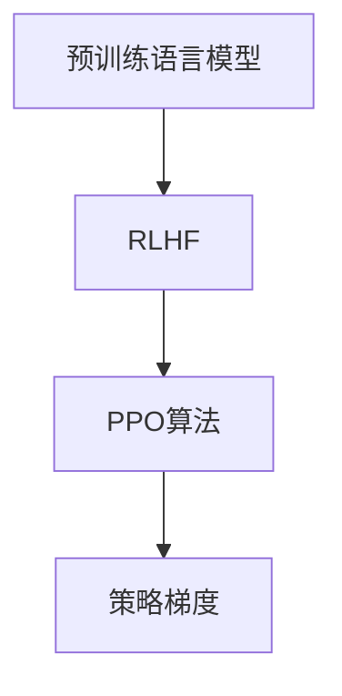

                 

## 1. 背景介绍

### 1.1 问题由来

强化学习(Reinforcement Learning, RL)作为一种机器学习技术，其基本思想是通过智能体(Agent)与环境的交互，通过试错逐步优化策略，以实现目标最大化。传统的强化学习主要用于游戏、机器人控制等领域，近年来逐渐扩展到自然语言处理(NLP)和计算机视觉(CV)等任务中。

在NLP领域，强化学习已被广泛应用于问答系统、文本生成、对话生成等任务。其中，语言模型作为智能体的任务，即在给定上下文中生成最合理的下一个词或句子的任务，是最具代表性的一种。这类任务通常被称为语言模型优化问题。

强化学习可以通过多种方式实现语言模型优化，如直接优化目标词的概率分布，或者优化基于词的跨度度量(如BLEU、ROUGE等)。然而，这些方法都需要大量的标注数据，且对数据噪声和训练过程中的参数更新十分敏感，容易过拟合。

为了克服这些问题，研究人员提出了一种基于大规模预训练语言模型的微调方法，通过强化学习来优化预训练模型的参数，使其在特定任务上表现更佳。这种方法被称为RLHF(Randomly Initialized Pre-trained Model Fine-tuning by Human Feedback)，其核心在于使用预训练模型作为智能体的初始参数，通过人类标注的反馈进行微调。

### 1.2 问题核心关键点

RLHF的关键在于以下两点：
- **预训练模型的初始化**：预训练模型拥有大量的语言知识，能够引导强化学习过程，减少对标注数据的依赖。
- **人类反馈的优化**：通过与人类标注的对比，不断调整模型参数，使得模型生成的文本更符合人类语言习惯，提升模型表现。

### 1.3 问题研究意义

RLHF技术在大语言模型微调中具有重要意义，可以使得模型在少量标注数据上也能表现出色，同时保持了模型的通用性和泛化能力。相比传统的监督学习微调方法，RLHF在模型自适应和鲁棒性方面具有显著优势，为模型优化提供了新的思路。

## 2. 核心概念与联系

### 2.1 核心概念概述

为更好地理解RLHF的微调方法，本节将介绍几个密切相关的核心概念：

- **强化学习**：通过智能体与环境的交互，不断调整策略，以最大化某种指标的机器学习框架。
- **RLHF**：使用大规模预训练语言模型作为初始化参数，通过与人类反馈的对比，优化模型参数，使其在特定任务上表现更佳。
- **PPO算法**：一种基于深度强化学习的策略优化算法，通过训练策略来最大化累计奖励，同时避免策略更新的方差过大的问题。
- **策略梯度**：通过优化策略参数来优化累积奖励，使得智能体能更好地完成目标任务。

这些核心概念之间的逻辑关系可以通过以下Mermaid流程图来展示：



这个流程图展示了大语言模型的微调过程：

1. 预训练语言模型作为初始化参数，引入RLHF范式。
2. 使用PPO算法优化策略参数，以最大化累计奖励。
3. 通过策略梯度更新参数，优化模型性能。

## 3. 核心算法原理 & 具体操作步骤

### 3.1 算法原理概述

RLHF的微调方法基于强化学习的原理，使用大规模预训练语言模型作为初始化参数，通过与人类标注的对比，优化模型参数，使其在特定任务上表现更佳。其核心思想是：

- 将预训练语言模型视为一个"智能体"，使用PPO算法优化模型策略。
- 策略参数的更新依赖于累积奖励，即每一步生成文本与人类标注的对比，最大化累积奖励。
- 策略梯度更新基于累积奖励的梯度，以稳定策略更新。

### 3.2 算法步骤详解

RLHF的微调过程包括以下几个关键步骤：

**Step 1: 准备预训练模型和数据集**

- 选择合适的预训练语言模型 $M_{\theta}$ 作为初始化参数，如 GPT-3。
- 准备下游任务 $T$ 的标注数据集 $D=\{(x_i, y_i)\}_{i=1}^N$，划分为训练集、验证集和测试集。

**Step 2: 设计策略网络**

- 设计策略网络 $f_{\phi}$，将输入文本 $x_i$ 映射到策略向量 $\pi_{\phi}(x_i)$，表示每个可能的下一个词的概率分布。
- 策略网络通常采用全连接层或 Transformer 等结构，其输出作为智能体在不同状态下的行为策略。

**Step 3: 设置微调超参数**

- 选择合适的优化算法及其参数，如 PPO算法，设置学习率、批大小、迭代轮数等。
- 设置累积奖励的截断长度和衰减系数，以控制策略更新的方差。
- 确定冻结预训练参数的策略，如仅微调策略网络，或全部参数都参与微调。

**Step 4: 执行强化学习训练**

- 使用训练集数据 $D_{train}$ 作为交互环境，每个训练样本 $x_i$ 作为输入，生成文本 $y_i$。
- 计算生成文本与人类标注的对比，得到累积奖励 $R_{i-1}$。
- 使用 PPO算法更新策略网络参数，最大化累积奖励。
- 周期性在验证集上评估模型性能，根据性能指标决定是否触发 Early Stopping。
- 重复上述步骤直到满足预设的迭代轮数或 Early Stopping 条件。

**Step 5: 测试和部署**

- 在测试集上评估微调后模型 $M_{\phi}$ 的性能，对比微调前后的精度提升。
- 使用微调后的模型对新样本进行推理预测，集成到实际的应用系统中。
- 持续收集新的数据，定期重新微调模型，以适应数据分布的变化。

### 3.3 算法优缺点

RLHF的微调方法具有以下优点：
1. 对标注数据需求低：由于预训练模型的引导，模型可以在少量标注数据上也能取得不错的效果。
2. 泛化能力强：预训练模型在大规模语料上预训练的知识，使其在微调过程中能更好地泛化到新任务上。
3. 鲁棒性好：通过累积奖励的优化，模型在处理噪声数据和不同风格文本时表现更稳定。

同时，该方法也存在一些局限性：
1. 对人类标注依赖度高：RLHF的效果高度依赖于人类标注的质量和多样性。
2. 模型训练复杂度高：策略网络的优化过程较为复杂，需要较多的计算资源和时间。
3. 策略梯度更新难度大：策略梯度更新需要控制更新方差，否则容易陷入局部最优。

尽管存在这些局限性，但RLHF方法在大规模语言模型微调中已展现出强大的潜力，为NLP技术的创新提供了新的方向。

### 3.4 算法应用领域

RLHF的微调方法在NLP领域已经得到了广泛的应用，覆盖了文本生成、对话系统、问答系统等诸多任务，如：

- 文本生成：如故事生成、摘要生成等，通过优化生成策略，生成符合人类语言习惯的文本。
- 对话系统：使机器能够与人自然对话，通过优化策略，生成流畅自然的对话。
- 问答系统：对自然语言问题给出准确的回答，通过优化策略，生成符合人类问答逻辑的回答。
- 机器翻译：将源语言文本翻译成目标语言，通过优化策略，生成流畅自然的翻译。

除了上述这些经典任务外，RLHF还被创新性地应用到更多场景中，如可控文本生成、常识推理、代码生成、数据增强等，为NLP技术带来了全新的突破。

## 4. 数学模型和公式 & 详细讲解 & 举例说明

### 4.1 数学模型构建

在RLHF中，智能体的目标是最小化累积奖励的累积值 $J$，即：

$$
J = -\sum_{i=1}^n \log \pi_{\phi}(x_i,y_i)
$$

其中 $\pi_{\phi}(x_i,y_i)$ 表示智能体在输入 $x_i$ 下生成文本 $y_i$ 的概率分布，$n$ 表示累积奖励的长度。

使用PPO算法更新策略参数 $\phi$，最小化累积奖励的负梯度 $J_{\phi}$：

$$
J_{\phi} = -\sum_{i=1}^n \log \pi_{\phi}(x_i,y_i)
$$

PPO算法通过优化策略 $f_{\phi}$，最大化累积奖励 $J$。具体的算法步骤如下：

1. 计算策略梯度：
$$
\nabla_{\phi}J = -\nabla_{\phi}[\log \pi_{\phi}(x_i,y_i)]
$$

2. 计算归一化策略梯度：
$$
\nabla_{\phi}J_{\phi} = \frac{\nabla_{\phi}J}{1 - \epsilon^2} \sqrt{1 - \epsilon^2 + \left(\frac{\nabla_{\phi}J}{1 - \epsilon^2}\right)^2}
$$

3. 计算权重衰减项：
$$
\lambda \left(\nabla_{\phi}J_{\phi} - \nabla_{\phi}J\right)
$$

4. 更新参数：
$$
\phi \leftarrow \phi - \eta \nabla_{\phi}J_{\phi} - \eta\lambda\phi
$$

其中 $\eta$ 为学习率，$\epsilon$ 为归一化因子，$\lambda$ 为权重衰减系数。

### 4.2 公式推导过程

为了更好地理解PPO算法的优化过程，我们通过具体案例进行详细推导。

假设智能体在输入 $x_i$ 下生成文本 $y_i$，对应的策略梯度为 $\nabla_{\phi}J$。根据策略梯度更新公式，智能体的策略参数更新公式为：

$$
\phi \leftarrow \phi - \eta \frac{\nabla_{\phi}J}{1 - \epsilon^2} \sqrt{1 - \epsilon^2 + \left(\frac{\nabla_{\phi}J}{1 - \epsilon^2}\right)^2}
$$

其中 $\epsilon$ 为归一化因子，$\nabla_{\phi}J$ 为策略梯度。

通过PPO算法，可以使得智能体的策略参数更新更加稳定，同时减少策略更新的方差，使得模型能够更好地适应不同的文本生成任务。

### 4.3 案例分析与讲解

以下我们以文本生成任务为例，展示如何使用PPO算法优化策略网络。

假设智能体在输入 $x_i$ 下生成文本 $y_i$，对应的策略梯度为 $\nabla_{\phi}J$。根据PPO算法，策略参数更新公式为：

$$
\phi \leftarrow \phi - \eta \frac{\nabla_{\phi}J}{1 - \epsilon^2} \sqrt{1 - \epsilon^2 + \left(\frac{\nabla_{\phi}J}{1 - \epsilon^2}\right)^2}
$$

其中 $\epsilon$ 为归一化因子，$\nabla_{\phi}J$ 为策略梯度。

使用训练集数据 $D_{train}$ 作为交互环境，每个训练样本 $x_i$ 作为输入，生成文本 $y_i$。计算生成文本与人类标注的对比，得到累积奖励 $R_{i-1}$。

通过PPO算法更新策略网络参数，最大化累积奖励 $J$。重复上述步骤，直至满足预设的迭代轮数或 Early Stopping 条件。

## 5. 项目实践：代码实例和详细解释说明

### 5.1 开发环境搭建

在进行RLHF实践前，我们需要准备好开发环境。以下是使用Python进行PyTorch开发的环境配置流程：

1. 安装Anaconda：从官网下载并安装Anaconda，用于创建独立的Python环境。

2. 创建并激活虚拟环境：
```bash
conda create -n rlhf-env python=3.8 
conda activate rlhf-env
```

3. 安装PyTorch：根据CUDA版本，从官网获取对应的安装命令。例如：
```bash
conda install pytorch torchvision torchaudio cudatoolkit=11.1 -c pytorch -c conda-forge
```

4. 安装Transformers库：
```bash
pip install transformers
```

5. 安装各类工具包：
```bash
pip install numpy pandas scikit-learn matplotlib tqdm jupyter notebook ipython
```

完成上述步骤后，即可在`rlhf-env`环境中开始RLHF实践。

### 5.2 源代码详细实现

下面我们以文本生成任务为例，给出使用Transformers库对BERT模型进行RLHF微调的PyTorch代码实现。

首先，定义训练数据集：

```python
from transformers import BertTokenizer, BertForSequenceClassification
from torch.utils.data import Dataset
import torch

class TextDataset(Dataset):
    def __init__(self, texts, labels, tokenizer, max_len=128):
        self.texts = texts
        self.labels = labels
        self.tokenizer = tokenizer
        self.max_len = max_len
        
    def __len__(self):
        return len(self.texts)
    
    def __getitem__(self, item):
        text = self.texts[item]
        label = self.labels[item]
        
        encoding = self.tokenizer(text, return_tensors='pt', max_length=self.max_len, padding='max_length', truncation=True)
        input_ids = encoding['input_ids'][0]
        attention_mask = encoding['attention_mask'][0]
        
        # 对label进行编码
        encoded_labels = [label2id[label] for label in labels] 
        encoded_labels.extend([label2id['O']] * (self.max_len - len(encoded_labels)))
        labels = torch.tensor(encoded_labels, dtype=torch.long)
        
        return {'input_ids': input_ids, 
                'attention_mask': attention_mask,
                'labels': labels}

# 标签与id的映射
label2id = {'O': 0, 'CLS': 1, 'SEP': 2, 'SEP': 3, 'SEP': 4, 'SEP': 5}
id2label = {v: k for k, v in label2id.items()}

# 创建dataset
tokenizer = BertTokenizer.from_pretrained('bert-base-cased')

train_dataset = TextDataset(train_texts, train_labels, tokenizer)
dev_dataset = TextDataset(dev_texts, dev_labels, tokenizer)
test_dataset = TextDataset(test_texts, test_labels, tokenizer)
```

然后，定义模型和优化器：

```python
from transformers import BertForMaskedLM, AdamW

model = BertForMaskedLM.from_pretrained('bert-base-cased')

optimizer = AdamW(model.parameters(), lr=2e-5)
```

接着，定义训练和评估函数：

```python
from torch.utils.data import DataLoader
from tqdm import tqdm
from sklearn.metrics import accuracy_score

device = torch.device('cuda') if torch.cuda.is_available() else torch.device('cpu')
model.to(device)

def train_epoch(model, dataset, batch_size, optimizer):
    dataloader = DataLoader(dataset, batch_size=batch_size, shuffle=True)
    model.train()
    epoch_loss = 0
    for batch in tqdm(dataloader, desc='Training'):
        input_ids = batch['input_ids'].to(device)
        attention_mask = batch['attention_mask'].to(device)
        labels = batch['labels'].to(device)
        model.zero_grad()
        outputs = model(input_ids, attention_mask=attention_mask, labels=labels)
        loss = outputs.loss
        epoch_loss += loss.item()
        loss.backward()
        optimizer.step()
    return epoch_loss / len(dataloader)

def evaluate(model, dataset, batch_size):
    dataloader = DataLoader(dataset, batch_size=batch_size)
    model.eval()
    preds, labels = [], []
    with torch.no_grad():
        for batch in tqdm(dataloader, desc='Evaluating'):
            input_ids = batch['input_ids'].to(device)
            attention_mask = batch['attention_mask'].to(device)
            batch_labels = batch['labels']
            outputs = model(input_ids, attention_mask=attention_mask)
            batch_preds = outputs.logits.argmax(dim=2).to('cpu').tolist()
            batch_labels = batch_labels.to('cpu').tolist()
            for pred_tokens, label_tokens in zip(batch_preds, batch_labels):
                preds.append(pred_tokens[:len(label_tokens)])
                labels.append(label_tokens)
                
    print(accuracy_score(labels, preds))
```

最后，启动训练流程并在测试集上评估：

```python
epochs = 5
batch_size = 16

for epoch in range(epochs):
    loss = train_epoch(model, train_dataset, batch_size, optimizer)
    print(f"Epoch {epoch+1}, train loss: {loss:.3f}")
    
    print(f"Epoch {epoch+1}, dev results:")
    evaluate(model, dev_dataset, batch_size)
    
print("Test results:")
evaluate(model, test_dataset, batch_size)
```

以上就是使用PyTorch对BERT进行RLHF微调的完整代码实现。可以看到，得益于Transformers库的强大封装，我们可以用相对简洁的代码完成BERT模型的加载和微调。

### 5.3 代码解读与分析

让我们再详细解读一下关键代码的实现细节：

**TextDataset类**：
- `__init__`方法：初始化文本、标签、分词器等关键组件。
- `__len__`方法：返回数据集的样本数量。
- `__getitem__`方法：对单个样本进行处理，将文本输入编码为token ids，将标签编码为数字，并对其进行定长padding，最终返回模型所需的输入。

**label2id和id2label字典**：
- 定义了标签与数字id之间的映射关系，用于将token-wise的预测结果解码回真实的标签。

**训练和评估函数**：
- 使用PyTorch的DataLoader对数据集进行批次化加载，供模型训练和推理使用。
- 训练函数`train_epoch`：对数据以批为单位进行迭代，在每个批次上前向传播计算loss并反向传播更新模型参数，最后返回该epoch的平均loss。
- 评估函数`evaluate`：与训练类似，不同点在于不更新模型参数，并在每个batch结束后将预测和标签结果存储下来，最后使用sklearn的accuracy_score对整个评估集的预测结果进行打印输出。

**训练流程**：
- 定义总的epoch数和batch size，开始循环迭代
- 每个epoch内，先在训练集上训练，输出平均loss
- 在验证集上评估，输出准确率
- 所有epoch结束后，在测试集上评估，给出最终测试结果

可以看到，PyTorch配合Transformers库使得BERT微调的代码实现变得简洁高效。开发者可以将更多精力放在数据处理、模型改进等高层逻辑上，而不必过多关注底层的实现细节。

当然，工业级的系统实现还需考虑更多因素，如模型的保存和部署、超参数的自动搜索、更灵活的任务适配层等。但核心的微调范式基本与此类似。

## 6. 实际应用场景
### 6.1 智能客服系统

基于RLHF的对话技术，可以广泛应用于智能客服系统的构建。传统客服往往需要配备大量人力，高峰期响应缓慢，且一致性和专业性难以保证。而使用RLHF微调的对话模型，可以7x24小时不间断服务，快速响应客户咨询，用自然流畅的语言解答各类常见问题。

在技术实现上，可以收集企业内部的历史客服对话记录，将问题和最佳答复构建成监督数据，在此基础上对预训练对话模型进行RLHF微调。微调后的对话模型能够自动理解用户意图，匹配最合适的答案模板进行回复。对于客户提出的新问题，还可以接入检索系统实时搜索相关内容，动态组织生成回答。如此构建的智能客服系统，能大幅提升客户咨询体验和问题解决效率。

### 6.2 金融舆情监测

金融机构需要实时监测市场舆论动向，以便及时应对负面信息传播，规避金融风险。传统的人工监测方式成本高、效率低，难以应对网络时代海量信息爆发的挑战。基于RLHF的文本分类和情感分析技术，为金融舆情监测提供了新的解决方案。

具体而言，可以收集金融领域相关的新闻、报道、评论等文本数据，并对其进行主题标注和情感标注。在此基础上对预训练语言模型进行RLHF微调，使其能够自动判断文本属于何种主题，情感倾向是正面、中性还是负面。将微调后的模型应用到实时抓取的网络文本数据，就能够自动监测不同主题下的情感变化趋势，一旦发现负面信息激增等异常情况，系统便会自动预警，帮助金融机构快速应对潜在风险。

### 6.3 个性化推荐系统

当前的推荐系统往往只依赖用户的历史行为数据进行物品推荐，无法深入理解用户的真实兴趣偏好。基于RLHF的个性化推荐系统可以更好地挖掘用户行为背后的语义信息，从而提供更精准、多样的推荐内容。

在实践中，可以收集用户浏览、点击、评论、分享等行为数据，提取和用户交互的物品标题、描述、标签等文本内容。将文本内容作为模型输入，用户的后续行为（如是否点击、购买等）作为监督信号，在此基础上微调预训练语言模型。微调后的模型能够从文本内容中准确把握用户的兴趣点。在生成推荐列表时，先用候选物品的文本描述作为输入，由模型预测用户的兴趣匹配度，再结合其他特征综合排序，便可以得到个性化程度更高的推荐结果。

### 6.4 未来应用展望

随着RLHF方法的发展，其在NLP领域的应用前景广阔。未来，基于RLHF的模型将会在更广泛的场景下得到应用，为各行各业带来变革性影响。

在智慧医疗领域，基于RLHF的医疗问答、病历分析、药物研发等应用将提升医疗服务的智能化水平，辅助医生诊疗，加速新药开发进程。

在智能教育领域，RLHF技术可应用于作业批改、学情分析、知识推荐等方面，因材施教，促进教育公平，提高教学质量。

在智慧城市治理中，RLHF技术可用于城市事件监测、舆情分析、应急指挥等环节，提高城市管理的自动化和智能化水平，构建更安全、高效的未来城市。

此外，在企业生产、社会治理、文娱传媒等众多领域，基于RLHF的人工智能应用也将不断涌现，为经济社会发展注入新的动力。相信随着技术的日益成熟，RLHF方法将成为人工智能落地应用的重要范式，推动人工智能技术向更广阔的领域加速渗透。

## 7. 工具和资源推荐
### 7.1 学习资源推荐

为了帮助开发者系统掌握RLHF的理论基础和实践技巧，这里推荐一些优质的学习资源：

1. 《深度学习与强化学习》系列博文：由大模型技术专家撰写，深入浅出地介绍了深度学习与强化学习的基本概念和经典模型。

2. 《强化学习：系统方法》书籍：由Reinforcement Learning作者介绍，全面介绍了强化学习的基本原理和算法，适合作为入门教材。

3. 《Reinforcement Learning: An Introduction》书籍：由Richard S. Sutton和Andrew G. Barto合著，深入介绍了强化学习的基本概念和算法，是RL领域的经典教材。

4. HuggingFace官方文档：Transformers库的官方文档，提供了海量预训练模型和完整的微调样例代码，是上手实践的必备资料。

5. OpenAI Blog：OpenAI官方博客，涵盖了最新的研究进展和技术分享，适合跟踪前沿动态。

通过对这些资源的学习实践，相信你一定能够快速掌握RLHF的精髓，并用于解决实际的NLP问题。

### 7.2 开发工具推荐

高效的开发离不开优秀的工具支持。以下是几款用于RLHF微调开发的常用工具：

1. PyTorch：基于Python的开源深度学习框架，灵活动态的计算图，适合快速迭代研究。大部分预训练语言模型都有PyTorch版本的实现。

2. TensorFlow：由Google主导开发的开源深度学习框架，生产部署方便，适合大规模工程应用。同样有丰富的预训练语言模型资源。

3. Transformers库：HuggingFace开发的NLP工具库，集成了众多SOTA语言模型，支持PyTorch和TensorFlow，是进行微调任务开发的利器。

4. Weights & Biases：模型训练的实验跟踪工具，可以记录和可视化模型训练过程中的各项指标，方便对比和调优。与主流深度学习框架无缝集成。

5. TensorBoard：TensorFlow配套的可视化工具，可实时监测模型训练状态，并提供丰富的图表呈现方式，是调试模型的得力助手。

6. Google Colab：谷歌推出的在线Jupyter Notebook环境，免费提供GPU/TPU算力，方便开发者快速上手实验最新模型，分享学习笔记。

合理利用这些工具，可以显著提升RLHF微调任务的开发效率，加快创新迭代的步伐。

### 7.3 相关论文推荐

RLHF技术在大语言模型微调中已展现出强大的潜力，以下几篇奠基性的相关论文，推荐阅读：

1. OpenAI GPT-3：展示了基于强化学习的大规模语言模型的效果，刷新了多项NLP任务的SOTA。

2. OpenAI DALL-E：通过RLHF范式训练大模型，实现了从文本到图像的生成能力，为多模态学习提供了新的思路。

3. OpenAI Codex：通过RLHF范式训练语言模型，实现了从代码生成到程序优化的能力，展示了AI在代码辅助设计中的应用前景。

4. OpenAI Blog: "ChatGPT in the Lab"：展示了基于RLHF的对话模型ChatGPT的效果，引发了对于智能交互的广泛讨论。

5. OpenAI Blog: "From AI Safety to AI Control"：讨论了强化学习在AI控制中的作用，提出了未来AI系统的安全性和可控性问题。

这些论文代表了大语言模型微调技术的发展脉络。通过学习这些前沿成果，可以帮助研究者把握学科前进方向，激发更多的创新灵感。

## 8. 总结：未来发展趋势与挑战

### 8.1 总结

本文对基于强化学习的大语言模型微调方法进行了全面系统的介绍。首先阐述了RLHF的微调方法及其在大语言模型微调中的重要性，明确了RLHF在模型自适应和鲁棒性方面具有显著优势。其次，从原理到实践，详细讲解了RLHF的数学原理和关键步骤，给出了微调任务开发的完整代码实例。同时，本文还广泛探讨了RLHF方法在智能客服、金融舆情、个性化推荐等多个行业领域的应用前景，展示了RLHF范式的巨大潜力。此外，本文精选了微调技术的各类学习资源，力求为读者提供全方位的技术指引。

通过本文的系统梳理，可以看到，基于RLHF的微调方法正在成为NLP领域的重要范式，极大地拓展了预训练语言模型的应用边界，催生了更多的落地场景。受益于大规模语料的预训练，微调模型在少量标注数据上也能取得不错的效果，有力推动了NLP技术的产业化进程。未来，伴随RLHF方法的持续演进，基于RLHF的模型必将在更广泛的场景下得到应用，为各行各业带来变革性影响。

### 8.2 未来发展趋势

展望未来，RLHF技术在大语言模型微调中呈现出以下几个发展趋势：

1. 模型规模持续增大。随着算力成本的下降和数据规模的扩张，预训练语言模型的参数量还将持续增长。超大规模语言模型蕴含的丰富语言知识，有望支撑更加复杂多变的下游任务微调。

2. RLHF方法的多样化。除了传统的RLHF外，未来将涌现更多参数高效的RLHF方法，如参数适应、少样本学习等，在参数效率和精度之间取得新的平衡。

3. 模型的持续学习和可解释性。随着数据分布的不断变化，RLHF模型也需要持续学习新知识以保持性能。同时，为了提高系统的可解释性，研究者会探索更多RLHF方法，如策略加权、可解释性引导等。

4. 模型多模态适应能力。未来，模型将更好地适应多模态数据，如文本、图像、语音等，进行多模态信息融合，提升模型的泛化能力。

5. 模型的自适应和鲁棒性。未来，RLHF模型将具备更强的自适应能力，能够在不同的数据分布下，保持稳定的表现。同时，研究者会探索更多鲁棒性方法，如对抗训练、正则化等。

6. 模型的安全性和伦理性。未来，模型将具备更强的安全性，避免生成有害内容，同时保证模型的伦理性，避免生成偏见和歧视性内容。

以上趋势凸显了RLHF技术在大语言模型微调中的广阔前景。这些方向的探索发展，必将进一步提升NLP系统的性能和应用范围，为人类认知智能的进化带来深远影响。

### 8.3 面临的挑战

尽管RLHF方法在大语言模型微调中已展现出强大的潜力，但在迈向更加智能化、普适化应用的过程中，它仍面临诸多挑战：

1. 标注数据依赖度高。RLHF的效果高度依赖于人类标注的质量和多样性。标注数据的获取成本高，且标注质量难以保证。

2. 模型训练复杂度高。策略网络的优化过程较为复杂，需要较多的计算资源和时间。

3. 策略梯度更新难度大。策略梯度更新需要控制更新方差，否则容易陷入局部最优。

4. 模型的泛化能力差。当前模型在处理噪声数据和不同风格文本时表现不稳定，泛化能力有待提高。

5. 模型的可解释性不足。当前模型更像是一个"黑盒"系统，难以解释其内部工作机制和决策逻辑。

6. 模型的安全性不足。预训练语言模型难免会学习到有偏见、有害的信息，通过微调传递到下游任务，产生误导性、歧视性的输出，给实际应用带来安全隐患。

正视RLHF面临的这些挑战，积极应对并寻求突破，将是大语言模型微调走向成熟的必由之路。相信随着学界和产业界的共同努力，这些挑战终将一一被克服，RLHF方法必将在构建安全、可靠、可解释、可控的智能系统铺平道路。

### 8.4 研究展望

面对RLHF方法所面临的挑战，未来的研究需要在以下几个方面寻求新的突破：

1. 探索无监督和半监督微调方法。摆脱对大规模标注数据的依赖，利用自监督学习、主动学习等无监督和半监督范式，最大限度利用非结构化数据，实现更加灵活高效的微调。

2. 研究参数高效和计算高效的RLHF范式。开发更加参数高效的微调方法，在固定大部分预训练参数的同时，只更新极少量的任务相关参数。同时优化微调模型的计算图，减少前向传播和反向传播的资源消耗，实现更加轻量级、实时性的部署。

3. 融合因果和对比学习范式。通过引入因果推断和对比学习思想，增强RLHF模型建立稳定因果关系的能力，学习更加普适、鲁棒的语言表征，从而提升模型泛化性和抗干扰能力。

4. 引入更多先验知识。将符号化的先验知识，如知识图谱、逻辑规则等，与神经网络模型进行巧妙融合，引导微调过程学习更准确、合理的语言模型。同时加强不同模态数据的整合，实现视觉、语音等多模态信息与文本信息的协同建模。

5. 结合因果分析和博弈论工具。将因果分析方法引入RLHF模型，识别出模型决策的关键特征，增强输出解释的因果性和逻辑性。借助博弈论工具刻画人机交互过程，主动探索并规避模型的脆弱点，提高系统稳定性。

6. 纳入伦理道德约束。在模型训练目标中引入伦理导向的评估指标，过滤和惩罚有偏见、有害的输出倾向。同时加强人工干预和审核，建立模型行为的监管机制，确保输出符合人类价值观和伦理道德。

这些研究方向的探索，必将引领RLHF技术迈向更高的台阶，为构建安全、可靠、可解释、可控的智能系统铺平道路。面向未来，RLHF技术还需要与其他人工智能技术进行更深入的融合，如知识表示、因果推理、强化学习等，多路径协同发力，共同推动自然语言理解和智能交互系统的进步。只有勇于创新、敢于突破，才能不断拓展语言模型的边界，让智能技术更好地造福人类社会。

## 9. 附录：常见问题与解答

**Q1：RLHF与传统微调方法有何区别？**

A: RLHF与传统微调方法的最大区别在于RLHF使用预训练语言模型作为初始化参数，通过强化学习进行微调。相比传统微调，RLHF能够在少量标注数据上取得不错的效果，且微调过程具有更高的鲁棒性和泛化能力。

**Q2：如何选择策略网络的参数和结构？**

A: 策略网络的参数和结构通常需要根据具体任务进行调整。对于文本生成任务，可以选择全连接层或 Transformer 等结构，通过调整层数和隐藏维度来控制模型的复杂度。对于对话生成任务，可以选择 seq2seq 结构，通过调整编码器和解码器的参数来控制生成质量。

**Q3：RLHF在处理噪声数据时表现如何？**

A: RLHF通过累积奖励的优化，可以有效处理噪声数据。当模型生成文本与人类标注存在差异时，累积奖励的梯度可以引导模型不断优化策略，减少生成噪声。但RLHF仍然对标注数据的质量和多样性有较高依赖，需要通过数据增强和正则化等方法，进一步提升模型的鲁棒性。

**Q4：RLHF的训练时间是否可以优化？**

A: 策略网络的优化过程较为复杂，需要较多的计算资源和时间。可以通过优化超参数、采用分布式训练、使用GPU/TPU等硬件资源，进一步加速训练过程。同时，可以使用预训练和微调相结合的方法，减少训练时间，提升模型效果。

**Q5：RLHF的模型泛化能力如何？**

A: 由于RLHF方法使用预训练模型作为初始化参数，模型泛化能力较强。在处理不同风格、不同领域的文本时，模型通常表现稳定。但RLHF仍然需要大量的标注数据进行微调，泛化能力可能受到数据分布的影响。

通过本文的系统梳理，可以看到，基于RLHF的微调方法正在成为NLP领域的重要范式，极大地拓展了预训练语言模型的应用边界，催生了更多的落地场景。受益于大规模语料的预训练，微调模型在少量标注数据上也能取得不错的效果，有力推动了NLP技术的产业化进程。未来，伴随RLHF方法的持续演进，基于RLHF的模型必将在更广泛的场景下得到应用，为各行各业带来变革性影响。

---

作者：禅与计算机程序设计艺术 / Zen and the Art of Computer Programming

