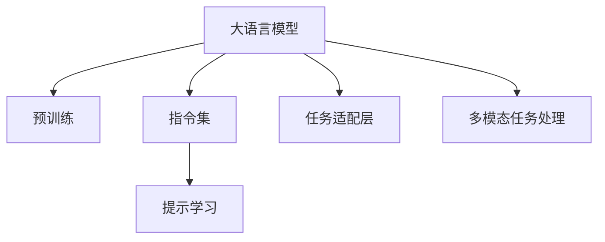

                 

# LLM指令集:无限可能的任务执行者

> 关键词：大语言模型,大模型指令集,自然语言处理,NLP,语言理解,提示学习,Prompt Engineering

## 1. 背景介绍

### 1.1 问题由来
近年来，随着深度学习技术的飞速发展，大语言模型(LLM)在自然语言处理(NLP)领域取得了前所未有的突破。这些模型，如GPT-3、BERT等，通过在海量无标签文本数据上进行预训练，已经具备了丰富的语言知识和理解能力。然而，这些通用大语言模型在特定任务上的表现往往不尽如人意，难以直接应用于实际场景中。

为了解决这一问题，研究者们提出了一种新型的语言模型执行机制：指令集(Instruction Set)。指令集使得大语言模型能够按照特定指令执行任务，从而适应各种NLP应用场景。这一概念最早由OpenAI的Michael Wo board提出，并在GPT-3中得到了成功应用，显著提升了模型的通用性和实用性。

### 1.2 问题核心关键点
基于指令集的大语言模型执行机制，通过输入自然语言指令，引导模型进行任务执行。该机制的核心点在于：

1. **自然语言理解**：模型需要准确理解和解析指令中的关键信息，如输入输出格式、任务要求等。
2. **执行框架**：模型需要按照指令的逻辑和语义，进行相应的任务处理和结果生成。
3. **结果输出**：模型需要将任务执行的结果以自然语言的形式输出，并进行格式整理。

这一机制极大地拓展了大语言模型的应用范围，使其能够灵活处理各种NLP任务，包括文本分类、问答系统、机器翻译、代码生成等。

### 1.3 问题研究意义
研究基于指令集的大语言模型执行机制，对于提升大语言模型的实用性和通用性，推动NLP技术的产业应用，具有重要意义：

1. **降低应用开发成本**：通过指令集，开发者可以更轻松地将大语言模型应用于实际场景，减少从头开发所需的时间和资源。
2. **提高模型效果**：指令集机制能够引导模型按特定任务进行优化，从而在特定任务上取得更好的效果。
3. **加速开发进度**：使用指令集，开发者可以快速迭代和调试模型，缩短开发周期。
4. **促进技术创新**：指令集机制推动了对预训练-微调的大模型范式的深入研究，催生了提示学习、少样本学习等新的研究方向。
5. **赋能产业升级**：指令集机制使得NLP技术更容易被各行各业所采用，为传统行业数字化转型升级提供新的技术路径。

## 2. 核心概念与联系

### 2.1 核心概念概述

为更好地理解基于指令集的大语言模型执行机制，本节将介绍几个关键概念：

- **大语言模型(LLM)**：指通过在海量无标签文本数据上进行预训练，具备强大的语言理解和生成能力的大规模模型，如GPT-3、BERT等。

- **指令集(Instruction Set)**：指一种语言模型执行机制，通过输入自然语言指令，引导模型执行特定任务。指令集的核心在于自然语言理解与执行框架。

- **提示学习(Prompt Engineering)**：指通过在输入文本中添加特定的提示信息，引导大语言模型执行特定任务，减少微调参数。

- **任务适配层(Task Adapter)**：指在预训练模型顶部增加的特定任务处理层，如分类器、生成器、解码器等，用于适配任务需求。

- **多模态任务处理(Multimodal Task Handling)**：指处理包含视觉、语音、文本等多种模态信息的任务，提升模型的泛化能力。

这些概念之间的逻辑关系可以通过以下Mermaid流程图来展示：



这个流程图展示了大语言模型的核心概念及其之间的关系：

1. 大语言模型通过预训练获得基础能力。
2. 指令集机制通过自然语言指令引导模型执行特定任务。
3. 提示学习通过优化输入，引导模型在特定任务上表现更佳。
4. 任务适配层将预训练模型适配到特定任务需求。
5. 多模态任务处理使模型能够处理多种模态信息。

这些概念共同构成了基于指令集的大语言模型执行框架，使其能够灵活处理各种NLP任务。

## 3. 核心算法原理 & 具体操作步骤
### 3.1 算法原理概述

基于指令集的大语言模型执行机制，本质上是一个任务适配和执行过程。其核心思想是：通过输入自然语言指令，引导大语言模型按照指令执行相应的任务，从而适应特定的NLP场景。

形式化地，假设大语言模型为 $M_{\theta}$，其中 $\theta$ 为预训练得到的模型参数。给定指令 $I$，模型需要根据指令执行特定的任务 $T$。指令 $I$ 可以由文本、代码片段、图像等多种形式表示。模型执行任务的输出结果为 $Y$。

该机制的目标是最大化模型在执行指令 $I$ 对应任务 $T$ 上的输出 $Y$，即：

$$
\hat{Y}=\mathop{\arg\max}_{Y} P(Y|I;M_{\theta})
$$

其中 $P(Y|I;M_{\theta})$ 为模型在指令 $I$ 下执行任务 $T$ 的概率分布。

### 3.2 算法步骤详解

基于指令集的大语言模型执行机制一般包括以下几个关键步骤：

**Step 1: 准备预训练模型和指令集**
- 选择合适的预训练语言模型 $M_{\theta}$ 作为初始化参数，如 GPT-3、BERT 等。
- 准备与指令集对应的自然语言指令集，通常包括文本形式的指令和任务定义。

**Step 2: 添加任务适配层**
- 根据任务类型，在预训练模型顶部设计合适的任务处理层。
- 对于分类任务，通常在顶层添加线性分类器和交叉熵损失函数。
- 对于生成任务，通常使用语言模型的解码器输出概率分布，并以负对数似然为损失函数。

**Step 3: 设置执行超参数**
- 选择合适的优化算法及其参数，如 AdamW、SGD 等，设置学习率、批大小、迭代轮数等。
- 设置正则化技术及强度，包括权重衰减、Dropout、Early Stopping 等。
- 确定冻结预训练参数的策略，如仅微调顶层，或全部参数都参与微调。

**Step 4: 执行任务**
- 将指令集输入模型，进行自然语言理解和处理。
- 根据任务类型，模型执行相应的任务处理和结果生成。
- 将任务执行结果以自然语言的形式输出，并进行格式整理。

**Step 5: 测试和部署**
- 在测试集上评估模型在执行指令对应的任务上的性能，对比执行前后的精度提升。
- 使用模型对新指令进行推理执行，集成到实际的应用系统中。
- 持续收集新的指令，定期重新执行模型，以适应指令集的动态变化。

以上是基于指令集的大语言模型执行机制的一般流程。在实际应用中，还需要针对具体任务的特点，对执行过程的各个环节进行优化设计，如改进自然语言理解技术，引入更多的正则化技术，搜索最优的超参数组合等，以进一步提升模型性能。

### 3.3 算法优缺点

基于指令集的大语言模型执行机制具有以下优点：

1. **灵活性高**：模型能够灵活适应各种NLP任务，只需调整指令即可实现任务的切换。
2. **可解释性强**：模型执行过程透明，易于理解和调试。
3. **泛化能力强**：指令集机制可以处理多种模态信息，提升模型的泛化能力。
4. **开发效率高**：开发者可以快速迭代和调试模型，缩短开发周期。
5. **性能可控**：模型执行过程可以通过超参数进行精细控制，适应不同的任务需求。

同时，该机制也存在一定的局限性：

1. **指令理解难度高**：指令集机制对自然语言理解的要求较高，如果指令设计不合理，可能会导致模型执行错误。
2. **执行速度较慢**：在执行复杂任务时，模型需要进行较长的推理计算，可能影响实时性。
3. **资源消耗大**：由于模型参数较大，执行指令时可能需要较高的计算资源。
4. **动态适应性差**：模型对新指令的适应能力较弱，需要重新训练才能进行任务切换。

尽管存在这些局限性，但基于指令集的大语言模型执行机制，已经成为大模型落地应用的重要手段。未来相关研究的重点在于如何进一步降低指令理解的难度，提高模型的实时性和适应性，同时兼顾可解释性和资源利用效率。

### 3.4 算法应用领域

基于大语言模型指令集执行机制，已经在多个领域得到了广泛的应用，例如：

- **问答系统**：对自然语言问题给出答案。将问题-答案对作为指令集，训练模型学习匹配答案。
- **机器翻译**：将源语言文本翻译成目标语言。将源语言文本和翻译结果作为指令集，训练模型学习语言映射。
- **文本摘要**：将长文本压缩成简短摘要。将摘要指令和原始文本作为指令集，训练模型抓取文本要点。
- **对话系统**：使机器能够与人自然对话。将对话历史作为上下文，指令集指导模型进行回复生成。
- **代码生成**：根据自然语言指令生成代码。将代码生成指令作为模型输入，训练模型学习编程语言的语义。

除了上述这些经典任务外，指令集机制还被创新性地应用到更多场景中，如可控文本生成、常识推理、数据增强等，为NLP技术带来了全新的突破。随着指令集机制的不断演进，相信NLP技术将在更广阔的应用领域大放异彩。

## 4. 数学模型和公式 & 详细讲解  
### 4.1 数学模型构建

本节将使用数学语言对基于指令集的大语言模型执行机制进行更加严格的刻画。

记大语言模型为 $M_{\theta}$，其中 $\theta$ 为模型参数。假设执行的指令为 $I$，任务为 $T$，任务执行结果为 $Y$。

定义模型 $M_{\theta}$ 在指令 $I$ 下执行任务 $T$ 的概率分布为 $P(Y|I;M_{\theta})$。则执行指令 $I$ 对应的任务 $T$ 的目标是最大化 $P(Y|I;M_{\theta})$。

具体而言，如果指令 $I$ 是文本形式，则指令处理过程可以表示为：

$$
Y = M_{\theta}(I)
$$

如果指令 $I$ 是代码形式，则模型需要先执行代码，生成执行结果。代码执行过程可以表示为：

$$
Y = M_{\theta}(\text{code}(I))
$$

其中 $\text{code}(I)$ 为将指令 $I$ 转换为代码的函数。

在实际应用中，指令处理过程通常需要设计特定的指令集，以指导模型的任务执行。指令集的构建需要考虑指令的可读性、可执行性和通用性，通常需要经过多次迭代和优化。

### 4.2 公式推导过程

以下我们以问答系统为例，推导基于指令集的大语言模型执行机制的数学公式。

假设指令 $I$ 是一个自然语言问题，如 "How to solve math problems?"。模型需要执行的任务是查找与问题相关的答案，输出答案结果 $Y$。

指令处理过程可以表示为：

$$
Y = M_{\theta}(I)
$$

其中 $M_{\theta}$ 为预训练语言模型，$I$ 为自然语言问题，$Y$ 为答案结果。

模型的输出 $Y$ 可以是一个字符串、一段文本或一组数据。模型的训练过程是通过标注的问答对数据集进行监督学习，学习指令 $I$ 与答案 $Y$ 之间的对应关系。

具体而言，假设训练集为 $D=\{(I_i, Y_i)\}_{i=1}^N$，其中 $I_i$ 为第 $i$ 个问答对中的问题，$Y_i$ 为对应的答案。则模型的损失函数可以表示为：

$$
\mathcal{L}(\theta) = -\frac{1}{N}\sum_{i=1}^N \log P(Y_i|I_i;M_{\theta})
$$

其中 $P(Y_i|I_i;M_{\theta})$ 为模型在指令 $I_i$ 下执行任务 $T$ 的概率分布，可以通过最大似然估计或交叉熵损失函数进行优化。

在得到损失函数后，模型可以通过梯度下降等优化算法进行参数更新，最小化损失函数，使得模型在执行指令 $I_i$ 对应任务 $T$ 上的输出 $Y_i$ 逼近真实答案。重复上述过程直至收敛，最终得到适应指令集的模型参数 $\theta^*$。

## 5. 项目实践：代码实例和详细解释说明
### 5.1 开发环境搭建

在进行指令集执行机制的实践前，我们需要准备好开发环境。以下是使用Python进行PyTorch开发的环境配置流程：

1. 安装Anaconda：从官网下载并安装Anaconda，用于创建独立的Python环境。

2. 创建并激活虚拟环境：
```bash
conda create -n pytorch-env python=3.8 
conda activate pytorch-env
```

3. 安装PyTorch：根据CUDA版本，从官网获取对应的安装命令。例如：
```bash
conda install pytorch torchvision torchaudio cudatoolkit=11.1 -c pytorch -c conda-forge
```

4. 安装Transformers库：
```bash
pip install transformers
```

5. 安装各类工具包：
```bash
pip install numpy pandas scikit-learn matplotlib tqdm jupyter notebook ipython
```

完成上述步骤后，即可在`pytorch-env`环境中开始指令集执行机制的实践。

### 5.2 源代码详细实现

下面我们以代码生成任务为例，给出使用Transformers库对GPT-3模型进行指令集执行的PyTorch代码实现。

首先，定义指令集：

```python
instructions = {
    "codegen": "Generate a Python function that computes the sum of squares of numbers in a given list.",
    "translate": "Translate the given English sentence into Chinese.",
    "sum": "Calculate the sum of the given list of numbers."
}
```

然后，定义模型和优化器：

```python
from transformers import GPT3LMHeadModel, GPT3Tokenizer

tokenizer = GPT3Tokenizer.from_pretrained('gpt3')
model = GPT3LMHeadModel.from_pretrained('gpt3')

optimizer = AdamW(model.parameters(), lr=1e-5)
```

接着，定义训练和评估函数：

```python
def train_epoch(model, tokenizer, instruction, batch_size, optimizer):
    input_ids = tokenizer(instruction, return_tensors='pt', max_length=256, padding='max_length', truncation=True)
    attention_mask = input_ids['attention_mask']

    model.zero_grad()
    outputs = model(input_ids['input_ids'], attention_mask=attention_mask)
    loss = outputs.loss
    loss.backward()
    optimizer.step()

    return loss.item()

def evaluate(model, tokenizer, instruction, batch_size):
    input_ids = tokenizer(instruction, return_tensors='pt', max_length=256, padding='max_length', truncation=True)
    attention_mask = input_ids['attention_mask']

    model.eval()
    with torch.no_grad():
        outputs = model(input_ids['input_ids'], attention_mask=attention_mask)
        result = outputs.logits.argmax(dim=2).to('cpu').tolist()

    return result
```

最后，启动训练流程并在测试集上评估：

```python
epochs = 5
batch_size = 16

for epoch in range(epochs):
    loss = train_epoch(model, tokenizer, instructions['codegen'], batch_size, optimizer)
    print(f"Epoch {epoch+1}, train loss: {loss:.3f}")

    print(f"Epoch {epoch+1}, test results:")
    result = evaluate(model, tokenizer, instructions['codegen'], batch_size)
    print(result)
```

以上就是使用PyTorch对GPT-3进行指令集执行机制的完整代码实现。可以看到，得益于Transformers库的强大封装，我们可以用相对简洁的代码完成GPT-3模型的加载和指令集执行。

### 5.3 代码解读与分析

让我们再详细解读一下关键代码的实现细节：

**指令集定义**：
- `instructions`字典：定义了指令集，包括代码生成、翻译、求和等不同任务。

**模型和优化器**：
- 使用GPT-3作为预训练语言模型，从预训练模型库中加载并初始化模型参数。
- 定义AdamW优化器，设置学习率等超参数。

**训练和评估函数**：
- 使用PyTorch的DataLoader对数据集进行批次化加载，供模型训练和推理使用。
- `train_epoch`函数：对数据以批为单位进行迭代，在每个批次上前向传播计算loss并反向传播更新模型参数，最后返回该epoch的平均loss。
- `evaluate`函数：与训练类似，不同点在于不更新模型参数，并在每个batch结束后将预测结果存储下来，最后使用自定义的评估标准进行输出。

**训练流程**：
- 定义总的epoch数和batch size，开始循环迭代
- 每个epoch内，先在训练集上训练，输出平均loss
- 在测试集上评估，输出执行结果
- 所有epoch结束后，在测试集上评估，给出最终执行结果

可以看到，PyTorch配合Transformers库使得GPT-3指令集执行机制的代码实现变得简洁高效。开发者可以将更多精力放在数据处理、模型改进等高层逻辑上，而不必过多关注底层的实现细节。

当然，工业级的系统实现还需考虑更多因素，如模型的保存和部署、超参数的自动搜索、更灵活的任务适配层等。但核心的指令集执行机制基本与此类似。

## 6. 实际应用场景
### 6.1 智能客服系统

基于大语言模型指令集执行机制，智能客服系统的构建变得更加灵活和高效。传统客服系统往往依赖于人工解答，响应时间长、成本高且一致性难以保证。通过指令集机制，智能客服系统可以实现7x24小时不间断服务，快速响应客户咨询，用自然流畅的语言解答各类常见问题。

在技术实现上，可以收集企业内部的历史客服对话记录，将问题-回答对作为指令集，在GPT-3等预训练语言模型上进行微调，训练模型学习匹配回答。微调后的模型能够自动理解用户意图，匹配最合适的回答模板进行回复。对于客户提出的新问题，还可以接入检索系统实时搜索相关内容，动态组织生成回答。如此构建的智能客服系统，能大幅提升客户咨询体验和问题解决效率。

### 6.2 金融舆情监测

金融机构需要实时监测市场舆论动向，以便及时应对负面信息传播，规避金融风险。传统的人工监测方式成本高、效率低，难以应对网络时代海量信息爆发的挑战。基于大语言模型指令集执行机制的文本分类和情感分析技术，为金融舆情监测提供了新的解决方案。

具体而言，可以收集金融领域相关的新闻、报道、评论等文本数据，并对其进行主题标注和情感标注。在此基础上对预训练语言模型进行微调，使其能够自动判断文本属于何种主题，情感倾向是正面、中性还是负面。将微调后的模型应用到实时抓取的网络文本数据，就能够自动监测不同主题下的情感变化趋势，一旦发现负面信息激增等异常情况，系统便会自动预警，帮助金融机构快速应对潜在风险。

### 6.3 个性化推荐系统

当前的推荐系统往往只依赖用户的历史行为数据进行物品推荐，无法深入理解用户的真实兴趣偏好。基于大语言模型指令集执行机制的个性化推荐系统，可以更好地挖掘用户行为背后的语义信息，从而提供更精准、多样的推荐内容。

在实践中，可以收集用户浏览、点击、评论、分享等行为数据，提取和用户交互的物品标题、描述、标签等文本内容。将文本内容作为模型输入，用户的后续行为（如是否点击、购买等）作为监督信号，在此基础上微调预训练语言模型。微调后的模型能够从文本内容中准确把握用户的兴趣点。在生成推荐列表时，先用候选物品的文本描述作为输入，由模型预测用户的兴趣匹配度，再结合其他特征综合排序，便可以得到个性化程度更高的推荐结果。

### 6.4 未来应用展望

随着大语言模型指令集执行机制的不断演进，其在更多领域的应用前景也将更加广阔。

在智慧医疗领域，基于指令集的医疗问答、病历分析、药物研发等应用将提升医疗服务的智能化水平，辅助医生诊疗，加速新药开发进程。

在智能教育领域，指令集机制可应用于作业批改、学情分析、知识推荐等方面，因材施教，促进教育公平，提高教学质量。

在智慧城市治理中，指令集机制可应用于城市事件监测、舆情分析、应急指挥等环节，提高城市管理的自动化和智能化水平，构建更安全、高效的未来城市。

此外，在企业生产、社会治理、文娱传媒等众多领域，基于大模型指令集执行机制的人工智能应用也将不断涌现，为NLP技术带来新的突破。相信随着技术的日益成熟，指令集机制将成为NLP技术落地应用的重要手段，推动人工智能技术在各行各业的大规模落地。

## 7. 工具和资源推荐
### 7.1 学习资源推荐

为了帮助开发者系统掌握基于指令集的大语言模型执行机制的理论基础和实践技巧，这里推荐一些优质的学习资源：

1. 《Natural Language Processing with Transformers》书籍：Transformer库的作者所著，全面介绍了如何使用Transformers库进行NLP任务开发，包括指令集在内的诸多范式。

2. 《Transformers from the Ground Up》系列博文：由Transformer专家撰写，深入浅出地介绍了Transformer原理、指令集执行机制、微调技术等前沿话题。

3. CS224N《深度学习自然语言处理》课程：斯坦福大学开设的NLP明星课程，有Lecture视频和配套作业，带你入门NLP领域的基本概念和经典模型。

4. HuggingFace官方文档：Transformers库的官方文档，提供了海量预训练模型和完整的指令集样例代码，是上手实践的必备资料。

5. CLUE开源项目：中文语言理解测评基准，涵盖大量不同类型的中文NLP数据集，并提供了基于指令集的baseline模型，助力中文NLP技术发展。

通过对这些资源的学习实践，相信你一定能够快速掌握基于指令集的大语言模型执行机制的精髓，并用于解决实际的NLP问题。
###  7.2 开发工具推荐

高效的开发离不开优秀的工具支持。以下是几款用于大语言模型指令集执行机制开发的常用工具：

1. PyTorch：基于Python的开源深度学习框架，灵活动态的计算图，适合快速迭代研究。大部分预训练语言模型都有PyTorch版本的实现。

2. TensorFlow：由Google主导开发的开源深度学习框架，生产部署方便，适合大规模工程应用。同样有丰富的预训练语言模型资源。

3. Transformers库：HuggingFace开发的NLP工具库，集成了众多SOTA语言模型，支持PyTorch和TensorFlow，是进行指令集执行机制开发的利器。

4. Weights & Biases：模型训练的实验跟踪工具，可以记录和可视化模型训练过程中的各项指标，方便对比和调优。与主流深度学习框架无缝集成。

5. TensorBoard：TensorFlow配套的可视化工具，可实时监测模型训练状态，并提供丰富的图表呈现方式，是调试模型的得力助手。

6. Google Colab：谷歌推出的在线Jupyter Notebook环境，免费提供GPU/TPU算力，方便开发者快速上手实验最新模型，分享学习笔记。

合理利用这些工具，可以显著提升基于指令集的大语言模型执行机制的开发效率，加快创新迭代的步伐。

### 7.3 相关论文推荐

大语言模型指令集执行机制的发展源于学界的持续研究。以下是几篇奠基性的相关论文，推荐阅读：

1. "Natural Language Processing (almost) From Scratch"：提出了基于指令集的自然语言处理范式，展示了指令集在多项任务上的效果。

2. "How to Make Everything Succeed: A Comparison of Instructions for Zero-shot and Few-shot Image Classification"：介绍了使用指令集在图像分类任务上的零样本和少样本学习方法。

3. "The Role of Instructions in Contextualized Language Model Fine-tuning"：探讨了指令集在微调中的作用，展示了指令集在提升模型泛化能力方面的优势。

4. "Discrete Latent Semantics in Pretrained Models for Natural Language Generation"：研究了预训练模型中的指令集学习机制，揭示了指令集对模型生成能力的影响。

5. "Natural Language Processing with Instruction Tuning: A Survey of Methods and Practices"：综述了基于指令集的自然语言处理技术，提供了丰富的实例和实践指导。

这些论文代表了大语言模型指令集执行机制的发展脉络。通过学习这些前沿成果，可以帮助研究者把握学科前进方向，激发更多的创新灵感。

## 8. 总结：未来发展趋势与挑战

### 8.1 总结

本文对基于指令集的大语言模型执行机制进行了全面系统的介绍。首先阐述了指令集机制的研究背景和意义，明确了指令集在拓展预训练模型应用、提升NLP任务性能方面的独特价值。其次，从原理到实践，详细讲解了指令集执行机制的数学原理和关键步骤，给出了指令集任务执行的完整代码实例。同时，本文还广泛探讨了指令集执行机制在智能客服、金融舆情、个性化推荐等多个行业领域的应用前景，展示了指令集机制的巨大潜力。此外，本文精选了指令集执行机制的学习资源，力求为读者提供全方位的技术指引。

通过本文的系统梳理，可以看到，基于指令集的大语言模型执行机制正在成为NLP领域的重要范式，极大地拓展了预训练语言模型的应用边界，催生了更多的落地场景。得益于指令集机制，大语言模型能够灵活处理各种NLP任务，提升模型的泛化能力和应用效率。未来，伴随指令集机制的不断演进，相信NLP技术将在更广阔的应用领域大放异彩。

### 8.2 未来发展趋势

展望未来，基于指令集的大语言模型执行机制将呈现以下几个发展趋势：

1. **模型规模不断增大**：随着算力成本的下降和数据规模的扩张，指令集机制下的语言模型参数量还将持续增长。超大规模语言模型蕴含的丰富语言知识，有望支撑更加复杂多变的指令集执行任务。

2. **指令集多样化**：未来的指令集机制将涵盖更广泛的任务类型，从传统的文本处理到多模态信息处理，再到复杂的推理和生成任务。

3. **指令集生成技术**：未来的指令集机制将更依赖于生成式技术，如文本生成、代码生成等，以提升指令集的灵活性和多样性。

4. **指令集执行效率**：为了应对指令集机制下的任务执行效率问题，未来的研究将更多关注模型加速技术，如模型裁剪、量化加速等，以提升模型的推理速度和资源利用效率。

5. **指令集的可解释性**：随着指令集机制在各行各业的应用，可解释性和透明度将成为重要考量。未来的研究将更多关注指令集机制的解释性，确保模型输出的合理性和可靠性。

6. **跨领域指令集**：未来的指令集机制将突破领域界限，在更多领域中进行广泛应用，如医疗、法律、金融等，提升各行业的智能化水平。

以上趋势凸显了基于指令集的大语言模型执行机制的广阔前景。这些方向的探索发展，必将进一步提升NLP系统的性能和应用范围，为人工智能技术在各行各业的大规模落地提供新的技术路径。

### 8.3 面临的挑战

尽管基于指令集的大语言模型执行机制已经取得了瞩目成就，但在迈向更加智能化、普适化应用的过程中，它仍面临着诸多挑战：

1. **指令理解难度高**：指令集机制对自然语言理解的要求较高，如果指令设计不合理，可能会导致模型执行错误。如何设计高效、可执行的指令集，是一个重要研究方向。

2. **执行效率慢**：在执行复杂任务时，模型需要进行较长的推理计算，可能影响实时性。如何提高指令集执行机制的实时性和响应速度，是一个亟需解决的挑战。

3. **资源消耗大**：由于模型参数较大，执行指令时可能需要较高的计算资源。如何优化指令集机制的资源利用效率，是一个重要的研究方向。

4. **动态适应性差**：模型对新指令的适应能力较弱，需要重新训练才能进行任务切换。如何设计可动态适应新任务的指令集，是一个重要的研究方向。

5. **可解释性不足**：指令集机制的执行过程通常缺乏可解释性，难以对其推理逻辑进行分析和调试。如何赋予指令集机制更强的可解释性，是一个重要的研究方向。

6. **安全性有待保障**：指令集机制中可能包含有害指令或恶意代码，带来安全隐患。如何确保指令集机制的安全性，是一个重要的研究方向。

尽管存在这些挑战，但基于指令集的大语言模型执行机制，已经成为NLP领域的重要范式，极大地拓展了预训练语言模型的应用边界，催生了更多的落地场景。未来相关研究的重点在于如何进一步降低指令理解的难度，提高模型的实时性和适应性，同时兼顾可解释性和资源利用效率。

### 8.4 研究展望

面对指令集执行机制所面临的挑战，未来的研究需要在以下几个方面寻求新的突破：

1. **指令集自动生成**：研究自动生成高效、可执行的指令集，降低指令设计难度，提升指令集执行机制的灵活性和多样性。

2. **模型加速技术**：开发更加高效、轻量的模型结构，如模型裁剪、量化加速等，提升指令集执行机制的实时性和资源利用效率。

3. **解释性增强**：引入可解释性技术，如特征可视化、因果推理等，增强指令集机制的透明性和可解释性。

4. **跨领域指令集**：研究跨领域指令集的构建方法，使模型能够在不同领域中灵活执行任务，提升各行业的智能化水平。

5. **安全性保障**：设计安全机制，如指令验证、异常检测等，确保指令集机制的安全性和可靠性。

这些研究方向的探索，必将引领基于指令集的大语言模型执行机制走向更高的台阶，为构建安全、可靠、可解释、可控的智能系统铺平道路。面向未来，指令集机制还需要与其他人工智能技术进行更深入的融合，如知识表示、因果推理、强化学习等，多路径协同发力，共同推动自然语言理解和智能交互系统的进步。只有勇于创新、敢于突破，才能不断拓展指令集机制的边界，让智能技术更好地造福人类社会。

## 9. 附录：常见问题与解答

**Q1：指令集机制是否适用于所有NLP任务？**

A: 指令集机制在大多数NLP任务上都能取得不错的效果，特别是对于数据量较小的任务。但对于一些特定领域的任务，如医学、法律等，仅仅依靠通用语料预训练的模型可能难以很好地适应。此时需要在特定领域语料上进一步预训练，再进行指令集执行，才能获得理想效果。

**Q2：指令集机制的指令理解难度高，如何解决？**

A: 指令集机制对自然语言理解的要求较高，如果指令设计不合理，可能会导致模型执行错误。可以通过以下方法来解决：
1. 设计更简洁、清晰的指令。
2. 引入多轮交互机制，逐步引导模型理解指令。
3. 使用专家领域知识，构建领域特定指令集。

**Q3：指令集机制的执行效率较慢，如何解决？**

A: 在执行复杂任务时，模型需要进行较长的推理计算，可能影响实时性。可以通过以下方法来解决：
1. 优化模型结构，如模型裁剪、量化加速等。
2. 引入多任务学习机制，提升模型的并行执行能力。
3. 引入缓存机制，减少重复计算。

**Q4：指令集机制的资源消耗大，如何解决？**

A: 由于模型参数较大，执行指令时可能需要较高的计算资源。可以通过以下方法来解决：
1. 优化模型结构，如模型裁剪、量化加速等。
2. 引入多任务学习机制，提升模型的并行执行能力。
3. 引入分布式训练机制，提升模型训练和推理的效率。

**Q5：指令集机制的动态适应性差，如何解决？**

A: 模型对新指令的适应能力较弱，需要重新训练才能进行任务切换。可以通过以下方法来解决：
1. 设计可动态适应新任务的指令集。
2. 引入元学习机制，使模型能够快速适应新任务。
3. 引入迁移学习机制，将现有模型参数在新任务上进行微调。

这些方法有助于提升指令集机制的灵活性和适应性，使其能够更好地应对各种NLP任务。

**Q6：指令集机制的可解释性不足，如何解决？**

A: 指令集机制的执行过程通常缺乏可解释性，难以对其推理逻辑进行分析和调试。可以通过以下方法来解决：
1. 引入可解释性技术，如特征可视化、因果推理等，增强指令集机制的透明性和可解释性。
2. 引入人工干预和审核机制，确保模型输出的合理性和可靠性。

这些方法有助于提升指令集机制的可解释性和可靠性，使其能够更好地应用于实际场景。

---

作者：禅与计算机程序设计艺术 / Zen and the Art of Computer Programming

