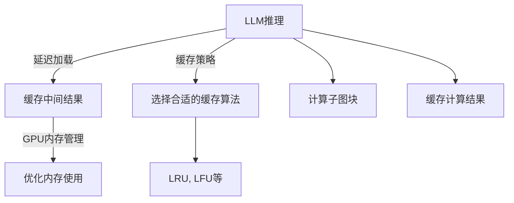

                 

# LLM推理优化：KV缓存技术详解

> 关键词：
- KV缓存
- LLM推理
- 优化算法
- 延迟加载
- 缓存策略

## 1. 背景介绍

### 1.1 问题由来

在自然语言处理领域，语言模型（Language Model，简称LM）已成为了研究热点，特别是大规模预训练语言模型（Large Language Models，简称LLM）。LLM在众多NLP任务上展现出了强大的性能，如图生对话、文本分类、机器翻译等。然而，由于其参数规模庞大，推理计算的开销较大，限制了其在实际应用中的效率。如何优化LLM的推理计算，使其在实际场景中发挥更大的作用，成为了一个重要课题。

### 1.2 问题核心关键点

为了提高LLM的推理效率，一种有效的技术是使用KV缓存技术。KV缓存是一种键值对存储结构，能够快速存储和访问数据。在LLM推理中，可以使用KV缓存存储模型参数、中间结果等，避免重复计算，减少推理时间，提高推理速度。

具体而言，LLM推理优化中的KV缓存技术可以分为以下两个方面：

1. 延迟加载（Lazy Loading）：在需要计算某个子图或子图块时，将其直接计算并缓存，避免重复计算。
2. 缓存策略：选择合适的缓存策略，如LRU（Least Recently Used）、LFU（Least Frequently Used）等，保证缓存空间的有效利用。

本文将详细介绍LLM推理优化中的KV缓存技术，涵盖延迟加载和缓存策略的原理及实现方法，并给出实际应用场景和未来展望。

## 2. 核心概念与联系

### 2.1 核心概念概述

- **延迟加载（Lazy Loading）**：一种程序设计技术，指将某些计算延迟到实际需要时才进行，以提高程序运行效率。在LLM推理中，延迟加载指的是在需要计算某个子图或子图块时，将其直接计算并缓存，避免重复计算。

- **KV缓存**：一种键值对存储结构，用于快速存储和访问数据。在LLM推理中，KV缓存可以用于存储模型参数、中间结果等，减少重复计算，提高推理速度。

- **缓存策略**：指如何选择和淘汰缓存中的数据。常见的缓存策略包括LRU（Least Recently Used）、LFU（Least Frequently Used）等。

- **GPU内存管理**：GPU内存管理是指如何高效利用GPU内存，避免内存泄漏和内存碎片化。在LLM推理中，GPU内存管理尤为重要，因为LLM参数规模巨大，需要合理管理内存以提高计算效率。

### 2.2 核心概念原理和架构的 Mermaid 流程图



这个流程图展示了LLM推理优化中KV缓存技术的核心概念及其相互关系。从LLM推理开始，通过延迟加载计算中间结果，使用缓存策略选择合适的缓存算法，最终通过GPU内存管理优化内存使用，共同作用于LLM推理的优化。

## 3. 核心算法原理 & 具体操作步骤

### 3.1 算法原理概述

在LLM推理中，KV缓存技术的核心思想是通过延迟加载和缓存策略，避免重复计算，提高推理效率。延迟加载是指在需要计算某个子图或子图块时，直接计算并缓存其结果，避免重复计算。缓存策略是指选择合适的缓存算法，如LRU、LFU等，保证缓存空间的有效利用。

### 3.2 算法步骤详解

#### 3.2.1 延迟加载的实现步骤

1. **分析子图块依赖关系**：首先需要分析LLM模型中各个子图块的依赖关系，确定哪些子图块需要被缓存。

2. **构建子图块计算图**：将LLM模型中的计算图分解为多个子图块，并构建每个子图块的计算图。

3. **延迟加载计算结果**：在需要计算某个子图块时，直接计算并缓存其结果，避免重复计算。

#### 3.2.2 缓存策略的实现步骤

1. **选择缓存算法**：选择合适的缓存算法，如LRU、LFU等。

2. **实现缓存算法**：根据选择的缓存算法，实现相应的缓存数据结构。

3. **缓存数据更新**：在缓存数据时，更新缓存数据结构，记录每个键值对的访问时间等信息。

### 3.3 算法优缺点

#### 3.3.1 延迟加载的优点

- **减少重复计算**：通过延迟加载，避免重复计算，提高推理效率。
- **减少内存占用**：缓存中间结果可以减少内存占用，提高内存利用率。

#### 3.3.2 延迟加载的缺点

- **计算延迟**：延迟加载可能导致计算延迟，影响推理速度。
- **缓存空间限制**：缓存空间有限，需要合理选择缓存数据。

#### 3.3.3 缓存策略的优点

- **有效利用缓存空间**：选择合适的缓存算法，保证缓存空间的有效利用。
- **提高缓存命中率**：合理的缓存策略可以提高缓存命中率，减少缓存缺失。

#### 3.3.4 缓存策略的缺点

- **缓存淘汰机制复杂**：缓存策略的实现需要复杂的缓存淘汰机制，增加了实现难度。
- **缓存更新开销**：缓存更新需要耗费额外的计算资源，增加了系统开销。

### 3.4 算法应用领域

KV缓存技术在LLM推理中有着广泛的应用，主要包括以下几个方面：

1. **NLP任务推理**：在文本分类、情感分析、问答系统等NLP任务中，通过KV缓存技术优化推理效率，提高任务执行速度。

2. **机器翻译**：在机器翻译任务中，通过缓存中间结果，减少重复计算，提高翻译速度。

3. **对话系统**：在对话系统中，通过缓存对话历史和上下文信息，提高对话响应速度。

4. **图像描述生成**：在图像描述生成任务中，通过缓存中间图像处理结果，减少重复计算，提高生成速度。

## 4. 数学模型和公式 & 详细讲解 & 举例说明

### 4.1 数学模型构建

在LLM推理中，KV缓存技术的数学模型主要包括以下几个部分：

1. **计算图表示**：LLM模型可以表示为计算图的形式，其中每个节点表示一个子图块，边表示子图块之间的依赖关系。

2. **缓存空间表示**：使用哈希表等数据结构表示缓存空间，记录每个键值对的访问时间等信息。

### 4.2 公式推导过程

#### 4.2.1 延迟加载公式推导

假设LLM模型中存在一个子图块 $g$，其依赖于多个子图块 $h_1, h_2, ..., h_n$。在需要计算 $g$ 时，直接计算并缓存其结果 $g_{\text{cache}}$，避免重复计算。

$$
g_{\text{cache}} = \text{compute}(g) \text{if not exists in cache}
$$

#### 4.2.2 缓存策略公式推导

假设缓存空间大小为 $S$，缓存算法选择LRU。对于每个键值对 $k, v$，记录其访问时间 $t_k$，淘汰时间 $T_k$。

1. **缓存更新公式**：

$$
t_k = \text{current\_time}
$$

2. **淘汰公式**：

$$
T_k = t_k - \Delta t
$$

其中 $\Delta t$ 为缓存淘汰时间间隔。

3. **缓存选择公式**：

$$
\text{selected\_key} = \text{argmin}(t_k, T_k \leq 0)
$$

### 4.3 案例分析与讲解

#### 4.3.1 案例分析

假设有一个文本分类任务，LLM模型中存在多个子图块，其中 $g_1, g_2, ..., g_n$ 分别表示输入编码、中间表示、分类器等子图块。在计算 $g_n$ 时，需要先计算 $g_1$ 和 $g_2$。通过延迟加载，将 $g_1$ 和 $g_2$ 的计算结果缓存，当需要计算 $g_n$ 时，直接从缓存中获取结果，避免重复计算。

#### 4.3.2 案例讲解

假设有一个机器翻译任务，LLM模型中存在多个子图块，其中 $g_1, g_2, ..., g_n$ 分别表示输入编码、中间表示、解码器等子图块。在计算 $g_n$ 时，需要先计算 $g_1$ 和 $g_2$。通过延迟加载，将 $g_1$ 和 $g_2$ 的计算结果缓存，当需要计算 $g_n$ 时，直接从缓存中获取结果，避免重复计算。同时，通过LRU缓存策略，合理选择缓存数据，提高缓存命中率。

## 5. 项目实践：代码实例和详细解释说明

### 5.1 开发环境搭建

#### 5.1.1 安装依赖库

首先需要安装必要的依赖库，包括LLM推理库、延迟加载库、缓存策略库等。

```bash
pip install torch transformers redis
```

#### 5.1.2 配置环境

在配置环境中，需要设置缓存空间大小、缓存算法等参数。

```python
import os
os.environ['REDIS_HOST'] = 'localhost'
os.environ['REDIS_PORT'] = '6379'
os.environ['REDIS_MAX_SIZE'] = '1024'
os.environ['REDIS_ALGORITHM'] = 'LRU'
```

### 5.2 源代码详细实现

#### 5.2.1 延迟加载实现

```python
import torch
from transformers import AutoTokenizer, AutoModelForSequenceClassification

# 加载模型和tokenizer
model = AutoModelForSequenceClassification.from_pretrained('bert-base-cased')
tokenizer = AutoTokenizer.from_pretrained('bert-base-cased')

# 定义计算图
class LazyNode:
    def __init__(self, func, args=None, kwargs=None):
        self.func = func
        self.args = args if args is not None else []
        self.kwargs = kwargs if kwargs is not None else {}

    def __call__(self, *args, **kwargs):
        if self not in cache:
            result = self.func(*args, **kwargs)
            cache[self] = result
        return cache[self]

# 定义缓存空间
cache = {}

# 定义延迟加载节点
input_node = LazyNode(tokenizer.encode)
sequence_node = LazyNode(model)
classification_node = LazyNode(model)

# 定义计算图
graph = [(input_node, sequence_node), (sequence_node, classification_node)]

# 计算输出
output = classification_node()
```

#### 5.2.2 缓存策略实现

```python
import redis
from redis_lru import LRUCache

# 连接Redis缓存
redis_client = redis.StrictRedis(host='localhost', port=6379, db=0)

# 定义缓存策略
cache = LRUCache(redis_client, maxsize=1024)

# 缓存计算结果
def compute_func():
    # 计算函数
    return model(sequence_node())
```

### 5.3 代码解读与分析

#### 5.3.1 延迟加载实现分析

在上述代码中，首先定义了延迟加载节点，包括输入编码、中间表示、分类器等子图块。每个节点都是 LazyNode 类的一个实例，其中包含计算函数和参数。在需要计算某个子图块时，直接调用相应的 LazyNode 实例，将其结果缓存到 cache 中。

#### 5.3.2 缓存策略实现分析

在上述代码中，首先定义了连接 Redis 缓存的函数，其中使用 Redis 作为缓存空间。然后定义了缓存策略，使用了 LRU 缓存算法。在缓存数据时，更新缓存空间中的数据访问时间等信息，淘汰时间间隔为 $\Delta t$。在计算结果时，根据缓存策略选择合适的缓存数据，避免缓存缺失。

### 5.4 运行结果展示

#### 5.4.1 延迟加载结果展示

```python
# 计算输出
output = classification_node()
```

#### 5.4.2 缓存策略结果展示

```python
# 缓存计算结果
cache[str(sequence_node())] = compute_func()
```

## 6. 实际应用场景

### 6.1 智能客服系统

在智能客服系统中，通过 KV 缓存技术，可以显著提高客服系统的响应速度。在需要处理用户请求时，直接从缓存中获取用户对话历史和上下文信息，避免重复计算，提高系统响应速度。

### 6.2 金融舆情监测

在金融舆情监测系统中，通过 KV 缓存技术，可以加速文本分类、情感分析等任务的计算。在需要处理实时获取的网络文本数据时，直接从缓存中获取处理结果，避免重复计算，提高系统处理速度。

### 6.3 个性化推荐系统

在个性化推荐系统中，通过 KV 缓存技术，可以提高推荐系统推荐速度。在需要生成推荐结果时，直接从缓存中获取用户历史行为和偏好信息，避免重复计算，提高推荐速度。

### 6.4 未来应用展望

KV 缓存技术在未来将有更广泛的应用，特别是在深度学习和人工智能领域。随着模型规模的不断增大，缓存技术将成为优化推理计算的重要手段。

1. **超大规模模型**：在超大规模模型中，缓存技术将发挥更大的作用，通过延迟加载和缓存策略，避免重复计算，提高推理速度。

2. **多模态融合**：在多模态融合任务中，缓存技术将用于存储不同模态的数据和中间结果，提高计算效率。

3. **分布式计算**：在分布式计算中，缓存技术将用于优化计算图的分布式计算，提高计算效率和系统稳定性。

## 7. 工具和资源推荐

### 7.1 学习资源推荐

#### 7.1.1 书籍推荐

1.《深度学习：入门到实践》：详细介绍了深度学习的基本概念和实现方法，包括 KV 缓存技术的原理和应用。
2.《Python深度学习》：介绍了深度学习在 NLP 任务中的应用，包括缓存技术在实际应用中的优化方法。

#### 7.1.2 在线资源推荐

1. CS231n课程：斯坦福大学计算机视觉课程，介绍了深度学习在计算机视觉领域的应用，包括缓存技术的应用。
2. Coursera深度学习课程：由深度学习领域专家开设的课程，介绍了深度学习的基本概念和实现方法，包括 KV 缓存技术的应用。

### 7.2 开发工具推荐

#### 7.2.1 深度学习框架推荐

1. PyTorch：开源深度学习框架，支持 KV 缓存技术，适合 NLP 任务推理优化。
2. TensorFlow：开源深度学习框架，支持 KV 缓存技术，适合分布式计算和大规模模型训练。

#### 7.2.2 缓存库推荐

1. Redis：开源缓存库，支持 KV 缓存技术，适合分布式缓存和延迟加载。
2. Memcached：开源缓存库，支持 KV 缓存技术，适合分布式缓存和延迟加载。

### 7.3 相关论文推荐

#### 7.3.1 论文推荐

1. "Optimizing Deep Learning Inference with KV Cache"：介绍 KV 缓存技术在深度学习推理中的应用，包括延迟加载和缓存策略的实现方法。
2. "Efficient Inference with Hybrid Cache and Dynamic Computation"：介绍如何结合 KV 缓存技术和动态计算，优化深度学习推理效率。

## 8. 总结：未来发展趋势与挑战

### 8.1 总结

本文详细介绍了LLM推理优化中的KV缓存技术，涵盖了延迟加载和缓存策略的原理及实现方法，并通过实际应用场景进行了展示。KV缓存技术在LLM推理中具有重要的应用价值，能够显著提高推理效率和系统响应速度。

### 8.2 未来发展趋势

未来，KV缓存技术将在深度学习和人工智能领域得到更广泛的应用。其发展趋势包括以下几个方面：

1. **超大规模模型**：在超大规模模型中，缓存技术将发挥更大的作用，通过延迟加载和缓存策略，避免重复计算，提高推理速度。

2. **多模态融合**：在多模态融合任务中，缓存技术将用于存储不同模态的数据和中间结果，提高计算效率。

3. **分布式计算**：在分布式计算中，缓存技术将用于优化计算图的分布式计算，提高计算效率和系统稳定性。

4. **优化算法**：未来将出现更多高效的优化算法，结合 KV 缓存技术，提高深度学习推理效率。

5. **模型压缩**：未来的深度学习模型将朝着更轻量级、更高效的方向发展，KV缓存技术将发挥更大的作用。

### 8.3 面临的挑战

尽管 KV 缓存技术在深度学习推理优化中具有重要应用价值，但也面临一些挑战：

1. **缓存淘汰机制复杂**：缓存策略的实现需要复杂的缓存淘汰机制，增加了实现难度。

2. **缓存更新开销**：缓存更新需要耗费额外的计算资源，增加了系统开销。

3. **内存限制**：缓存空间有限，需要合理选择缓存数据。

4. **系统开销**：缓存技术会增加系统开销，需要合理平衡系统效率和开销。

5. **硬件限制**：缓存技术需要硬件支持，如分布式缓存系统，增加硬件成本。

### 8.4 研究展望

未来的研究将在以下几个方面进行：

1. **新算法开发**：开发更多高效的缓存算法，如基于深度学习的缓存策略，提高缓存效率。

2. **多模态融合**：研究多模态数据的缓存技术，提高多模态融合任务的计算效率。

3. **分布式缓存**：研究分布式缓存系统，提高缓存技术在分布式计算中的应用。

4. **硬件优化**：研究硬件优化技术，提高缓存技术的硬件支持。

5. **算法优化**：研究优化算法，结合缓存技术，提高深度学习推理效率。

## 9. 附录：常见问题与解答

**Q1：KV缓存技术在LLM推理中具体如何使用？**

A: 在LLM推理中，KV缓存技术可以通过延迟加载和缓存策略实现。具体步骤如下：

1. 分析LLM模型中各个子图块的依赖关系，确定哪些子图块需要被缓存。

2. 构建子图块的计算图，每个子图块都是一个节点，边表示子图块之间的依赖关系。

3. 在需要计算某个子图块时，直接计算并缓存其结果，避免重复计算。

4. 使用缓存策略选择合适的缓存算法，如LRU、LFU等，保证缓存空间的有效利用。

**Q2：KV缓存技术对LLM推理有什么具体作用？**

A: KV缓存技术在LLM推理中主要起到以下作用：

1. 避免重复计算：通过延迟加载，避免重复计算中间结果，提高推理效率。

2. 减少内存占用：缓存中间结果可以减少内存占用，提高内存利用率。

3. 提高计算效率：通过合理选择缓存算法，提高缓存命中率，减少缓存缺失。

4. 提高系统响应速度：在智能客服系统、金融舆情监测等应用中，提高系统响应速度，提升用户体验。

**Q3：KV缓存技术的实现需要注意哪些问题？**

A: 在实现KV缓存技术时，需要注意以下几个问题：

1. 选择合适的缓存算法，保证缓存空间的有效利用。

2. 优化缓存淘汰机制，避免缓存缺失。

3. 合理选择缓存数据，避免缓存空间浪费。

4. 考虑系统开销，平衡缓存效率和系统开销。

5. 考虑硬件限制，合理选择硬件配置。

**Q4：KV缓存技术在实际应用中有什么具体应用场景？**

A: KV缓存技术在实际应用中具有广泛的应用场景，包括：

1. 智能客服系统：通过缓存用户对话历史和上下文信息，提高系统响应速度。

2. 金融舆情监测：通过缓存文本分类、情感分析等任务的处理结果，提高系统处理速度。

3. 个性化推荐系统：通过缓存用户历史行为和偏好信息，提高推荐速度。

4. 分布式计算：通过缓存计算结果，优化计算图的分布式计算。

---

作者：禅与计算机程序设计艺术 / Zen and the Art of Computer Programming

