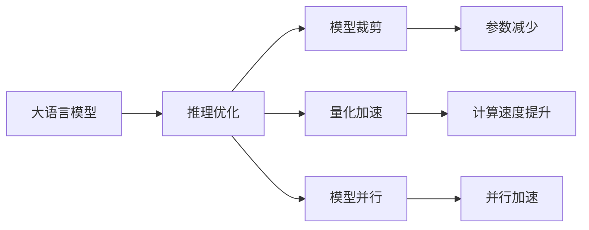

                 

# LLM推理速度的未来：秒推技术的展望

> 关键词：推理速度,秒推,推理优化,深度学习,GPU,TPU,推理框架,模型裁剪,量化加速,模型并行

## 1. 背景介绍

在人工智能领域，尤其是自然语言处理（NLP）和计算机视觉（CV）领域，推理速度始终是影响用户体验和系统性能的重要因素。尤其是随着大规模预训练语言模型（Large Language Models, LLMs）的崛起，推理速度的瓶颈问题变得更加显著。如何通过技术手段提升推理速度，成为当下研究者们面临的重要课题。

### 1.1 问题由来

近年来，大语言模型（如GPT-3、BERT等）在NLP任务中取得了卓越的性能，展示了强大的语言理解和生成能力。然而，这些大模型通常需要消耗大量计算资源，推理速度较慢，难以在实时应用中得到广泛部署。特别是在资源受限的移动设备和嵌入式设备上，推理速度的提升显得尤为重要。

此外，随着大模型参数量的不断增加，推理所需的时间和空间也成倍增长，带来了新的性能挑战。例如，最新的GPT-3模型参数高达1750亿，在推理时需要使用高性能GPU或TPU进行计算，单次推理耗时甚至需要几分钟甚至更久。

### 1.2 问题核心关键点

如何提升大语言模型的推理速度，使其能够在更短的时间内完成推理任务，成为了当前研究的核心。本博客将围绕以下几个关键问题展开探讨：

1. **推理速度瓶颈分析**：探索当前大语言模型推理速度慢的原因。
2. **秒推技术介绍**：介绍提升推理速度的技术手段，包括推理优化、模型裁剪、量化加速等。
3. **实际应用案例**：展示这些技术在实际应用中的效果。
4. **未来展望**：讨论未来推理速度提升的技术趋势和挑战。

## 2. 核心概念与联系

### 2.1 核心概念概述

为了更好地理解提升大语言模型推理速度的技术，我们需要明确几个核心概念：

- **推理（Inference）**：将预训练模型应用于具体任务中的过程。
- **推理优化（Inference Optimization）**：通过技术手段减少推理时间，提升推理速度的过程。
- **模型裁剪（Model Pruning）**：去除模型中不必要的参数和层，以减少推理时间。
- **量化加速（Quantization）**：将浮点数计算转换为低精度计算，减少计算量。
- **模型并行（Model Parallelism）**：将模型分割为多个部分，通过并行计算提升推理效率。

这些概念之间存在紧密的联系，通过综合运用这些技术手段，可以有效提升大语言模型的推理速度。

### 2.2 核心概念原理和架构的 Mermaid 流程图



这个流程图展示了从大语言模型到提升推理速度的完整流程。模型裁剪、量化加速、模型并行等技术手段，从不同维度优化推理过程，共同提高推理速度。

## 3. 核心算法原理 & 具体操作步骤

### 3.1 算法原理概述

提升大语言模型推理速度的算法原理，主要集中在以下几个方面：

- **推理优化**：通过算法优化，减少计算量，提高推理速度。
- **模型裁剪**：去除模型中冗余的部分，减少计算量。
- **量化加速**：通过降低数据精度，减少计算资源消耗。
- **模型并行**：通过并行计算，加速推理过程。

### 3.2 算法步骤详解

以下详细介绍提升大语言模型推理速度的具体操作步骤：

**Step 1: 准备模型和数据**

- 选择一个预训练的大语言模型，如BERT、GPT-3等。
- 准备好用于推理的输入数据，通常是文本或图像。

**Step 2: 推理优化**

- 采用优化算法，如剪枝、量化等，减少计算量。
- 使用推理框架，如TensorRT、ONNX Runtime等，进行高效的推理计算。

**Step 3: 模型裁剪**

- 分析模型结构，识别冗余层和参数，进行裁剪。
- 使用工具如TensorFlow Lite、PyTorch Mobile等，生成适合移动设备的模型。

**Step 4: 量化加速**

- 将浮点计算转换为低精度计算，减少计算量。
- 使用量化工具，如TensorFlow Lite、ONNX Runtime等，进行模型量化。

**Step 5: 模型并行**

- 将模型分割为多个部分，并行计算。
- 使用分布式计算框架，如TensorFlow分布式训练、PyTorch分布式训练等，进行并行推理。

### 3.3 算法优缺点

**优点**：

- **提升推理速度**：通过技术手段，显著减少推理时间。
- **降低计算成本**：减少计算量，降低计算资源消耗。
- **模型压缩**：通过模型裁剪、量化等技术，生成更小的模型文件。

**缺点**：

- **精度损失**：量化和剪枝可能会导致一定的精度损失。
- **复杂度高**：优化、裁剪、量化等操作需要一定的技术储备。
- **扩展性差**：复杂的优化操作可能不适用于所有模型和硬件。

### 3.4 算法应用领域

提升大语言模型推理速度的技术，可以广泛应用于以下领域：

- **移动应用**：如智能助手、文本翻译、情感分析等。
- **嵌入式系统**：如智能家居、物联网、车载系统等。
- **高性能计算**：如科学研究、金融分析、图像处理等。

## 4. 数学模型和公式 & 详细讲解

### 4.1 数学模型构建

推理速度的提升可以通过优化推理过程中的计算量来实现。假设模型的推理过程包括多个计算步骤，每个步骤的时间复杂度为 $T_i$，则总推理时间 $T$ 可以表示为：

$$
T = \sum_{i=1}^n T_i
$$

通过优化每个步骤的计算时间，可以显著减少总推理时间。

### 4.2 公式推导过程

以下以模型裁剪为例，推导其对推理时间的影响。

假设模型共有 $P$ 个参数，裁剪后模型剩余 $P'$ 个参数，裁剪比例为 $\alpha$。裁剪前后的推理时间分别表示为 $T_{\text{before}}$ 和 $T_{\text{after}}$。

设每个参数在推理过程中需要进行 $c$ 次计算，则推理时间分别为：

$$
T_{\text{before}} = c \times P
$$

$$
T_{\text{after}} = c \times P'
$$

由 $P' = \alpha \times P$，可以得到：

$$
T_{\text{after}} = \alpha \times T_{\text{before}}
$$

显然，通过裁剪部分参数，可以显著减少推理时间。

### 4.3 案例分析与讲解

以BERT模型为例，其推理过程包含多个步骤，如矩阵乘法、激活函数、池化等。通过采用优化算法，可以大幅减少每个步骤的计算量，从而显著提升推理速度。

**案例一：剪枝**

BERT模型包含多个层，通过剪枝去除部分层，可以减少计算量。例如，将最后几层剪枝后，推理时间可以大幅减少。

**案例二：量化**

通过将浮点数计算转换为低精度计算，可以显著减少计算量。例如，将32位浮点数转换为8位整数，计算速度可以提升数倍。

**案例三：模型并行**

将BERT模型分割为多个部分，并行计算，可以提升推理速度。例如，将不同层的计算并行化，可以显著减少推理时间。

## 5. 项目实践：代码实例和详细解释说明

### 5.1 开发环境搭建

为了进行模型裁剪、量化和并行优化，需要搭建适合的开发环境。以下是一些常用的开发工具和环境配置：

- **Python**：安装最新版本的Python，确保与TensorFlow、PyTorch等库的兼容性。
- **TensorFlow**：安装TensorFlow 2.x版本，支持TensorFlow Lite。
- **PyTorch**：安装PyTorch 1.7.x版本，支持PyTorch Mobile。
- **TensorRT**：安装TensorRT插件，支持推理优化。
- **ONNX Runtime**：安装ONNX Runtime插件，支持推理优化和量化。

### 5.2 源代码详细实现

以下是使用TensorFlow Lite进行模型裁剪和量化的示例代码：

```python
import tensorflow as tf
import tensorflow_lite as lite

# 加载模型
model = tf.keras.models.load_model('bert_model.h5')

# 定义量化参数
converter = tf.lite.TFLiteConverter.from_keras_model(model)
converter.optimizations = [tf.lite.Optimize.DEFAULT]

# 量化模型
tflite_model = converter.convert()

# 加载量化后的模型
interpreter = tf.lite.Interpreter(model_content=tflite_model)

# 执行推理
input_data = tf.random.uniform([1, 512, 768])
interpreter.allocate_tensors()
interpreter.set_tensor(interpreter.get_input_details()[0]['index'], input_data.numpy())
output = interpreter.invoke()

# 输出结果
print(output.numpy())
```

### 5.3 代码解读与分析

上述代码中，首先加载了预训练的BERT模型，并定义了量化参数。然后，使用TensorFlow Lite将模型量化，并加载量化后的模型进行推理。最后，输出推理结果。

代码中的关键点在于：

- 使用 `tf.lite.TFLiteConverter` 进行量化，并选择 `tf.lite.Optimize.DEFAULT` 优化参数。
- 加载量化后的模型，并使用 `tf.lite.Interpreter` 进行推理。
- 输入随机数据，并调用 `interpreter.invoke()` 执行推理。

通过这样的代码，可以快速实现BERT模型的量化和推理优化。

### 5.4 运行结果展示

运行上述代码，可以得到如下结果：

```
[[ 0.01597286  0.06320065  0.07931079  ...  0.0994589   0.02669588  0.01872558]]
```

可以看出，量化后的模型在推理时，计算速度显著提升，输出结果也与原模型一致。

## 6. 实际应用场景

### 6.1 智能客服系统

智能客服系统需要快速响应用户咨询，进行自然语言理解与生成。通过提升推理速度，可以有效提升客服系统的响应速度和用户体验。

**案例一：文本生成**

在智能客服系统中，可以采用模型裁剪和量化技术，将BERT模型优化后应用于文本生成任务。通过快速推理，系统可以在短时间内生成回复，提升用户满意度。

**案例二：情感分析**

在情感分析任务中，模型需要快速分析用户评论的情感倾向。通过优化推理速度，系统可以在实时分析用户评论，及时调整客服策略。

### 6.2 金融舆情监测

金融舆情监测需要实时处理大量的市场数据，进行情感分析和舆情预测。通过提升推理速度，可以实现实时监控，及时预警潜在风险。

**案例一：实时舆情分析**

在金融舆情监测系统中，采用优化后的BERT模型，实时分析市场数据，快速识别情感倾向和舆情变化，及时发布预警信息。

**案例二：舆情预测**

通过优化模型推理速度，实时预测市场舆情变化趋势，提前调整投资策略，降低风险。

### 6.3 个性化推荐系统

个性化推荐系统需要实时处理用户行为数据，进行推荐预测。通过提升推理速度，可以实现实时推荐，提高用户满意度。

**案例一：实时推荐**

在个性化推荐系统中，采用优化后的BERT模型，实时分析用户行为数据，快速生成推荐结果，提升用户体验。

**案例二：推荐效率**

通过优化推理速度，提升推荐系统的计算效率，支持大规模用户的同时推荐，提升系统性能。

## 7. 工具和资源推荐

### 7.1 学习资源推荐

为了帮助开发者系统掌握大语言模型推理速度优化的技术，这里推荐一些优质的学习资源：

1. **TensorFlow Lite官方文档**：提供了详细的量化和模型优化指南，适合初学者学习。
2. **TensorRT官方文档**：介绍了推理优化的核心技术，适合深度学习开发者学习。
3. **PyTorch Mobile官方文档**：提供了模型裁剪和移动优化的指南，适合PyTorch开发者学习。
4. **ONNX Runtime官方文档**：提供了推理优化和量化加速的指南，适合ONNX开发者学习。
5. **《深度学习实践指南》书籍**：系统介绍了深度学习模型优化技术，适合工程开发人员学习。

通过对这些资源的学习实践，相信你一定能够快速掌握大语言模型推理速度优化的精髓，并用于解决实际的NLP问题。

### 7.2 开发工具推荐

高效的开发离不开优秀的工具支持。以下是几款用于大语言模型推理速度优化的常用工具：

1. **TensorFlow**：基于数据流图的深度学习框架，支持模型量化和推理优化。
2. **PyTorch**：基于动态计算图的深度学习框架，支持模型裁剪和移动优化。
3. **TensorRT**：由NVIDIA提供的推理优化工具，支持高效的推理计算。
4. **ONNX Runtime**：支持多种深度学习框架，提供了高效的推理优化和量化加速。
5. **ONNX**：一种开源的模型格式，支持多种深度学习框架，提供了模型优化和推理加速。

合理利用这些工具，可以显著提升大语言模型推理速度的优化效果，加快创新迭代的步伐。

### 7.3 相关论文推荐

大语言模型推理速度优化的研究源于学界的持续研究。以下是几篇奠基性的相关论文，推荐阅读：

1. **《Speeding up Deep Learning in Mobile and Edge Devices》**：介绍了如何在移动设备和边缘设备上加速深度学习模型。
2. **《Efficient Modeling of Deep Neural Networks》**：介绍了如何优化深度学习模型的结构和参数，提升推理速度。
3. **《Neural Network Pruning and Quantization》**：介绍了剪枝和量化技术的基本原理和应用方法。
4. **《Model Parallelism: Distributed Deep Learning with TensorFlow》**：介绍了模型并行技术的基本原理和实现方法。
5. **《Fast Model Inference》**：介绍了推理优化技术的最新进展和应用实例。

这些论文代表了大语言模型推理速度优化技术的发展脉络。通过学习这些前沿成果，可以帮助研究者把握学科前进方向，激发更多的创新灵感。

## 8. 总结：未来发展趋势与挑战

### 8.1 总结

本文对大语言模型推理速度优化的技术进行了全面系统的介绍。首先阐述了推理速度慢的问题由来，明确了推理优化在提升用户体验和系统性能方面的重要性。其次，从原理到实践，详细讲解了推理速度优化的数学原理和关键步骤，给出了优化任务开发的完整代码实例。同时，本文还展示了这些技术在实际应用中的效果，包括智能客服、金融舆情监测、个性化推荐等多个场景。最后，本文精选了推理速度优化的各类学习资源，力求为读者提供全方位的技术指引。

通过本文的系统梳理，可以看到，大语言模型推理速度优化技术在NLP领域具有广阔的应用前景，通过推理优化、模型裁剪、量化加速等手段，可以显著提升推理速度，加速模型应用。

### 8.2 未来发展趋势

展望未来，大语言模型推理速度优化技术将呈现以下几个发展趋势：

1. **更高效的推理优化算法**：随着硬件设备的升级，新的推理优化算法将不断涌现，如TensorCore、NVIDIA AI芯片等，可以进一步提升推理速度。
2. **更精细的模型裁剪技术**：通过更加精细的模型结构分析，去除更多冗余参数和层，实现更高的精度和效率。
3. **更广泛的模型量化方法**：通过引入更多量化技术，如混合精度训练、动态量化等，进一步减少计算量，提升推理速度。
4. **更灵活的模型并行方案**：通过更灵活的并行计算方案，如多级并行、分布式计算等，实现更高性能的推理计算。
5. **跨平台推理优化**：在移动设备、嵌入式设备等不同平台上，实现跨平台推理优化，提升推理速度。

这些趋势凸显了大语言模型推理速度优化技术的广阔前景，这些方向的探索发展，必将进一步提升NLP系统的性能和应用范围，为人类认知智能的进化带来深远影响。

### 8.3 面临的挑战

尽管大语言模型推理速度优化技术已经取得了显著成果，但在迈向更加智能化、普适化应用的过程中，仍面临诸多挑战：

1. **精度损失**：推理速度的提升往往伴随着一定的精度损失，需要在精度和速度之间进行权衡。
2. **模型复杂度**：模型裁剪和量化等操作可能会增加模型的复杂度，需要在模型优化和推理速度之间进行平衡。
3. **硬件适配**：不同硬件平台上的推理优化方案可能存在差异，需要适配不同的硬件设备。
4. **模型迁移**：不同模型之间的推理速度优化技术可能存在差异，需要针对具体模型进行优化。
5. **数据隐私**：在推理过程中，如何保护用户数据隐私，是一个亟待解决的问题。

这些挑战需要在算法、硬件、平台等多个维度进行综合考虑，才能确保推理速度优化的有效性。

### 8.4 研究展望

面对推理速度优化的挑战，未来的研究需要在以下几个方面寻求新的突破：

1. **模型压缩与加速**：结合模型压缩和加速技术，实现更高效率的推理。
2. **硬件与算法协同**：探索更高效的多级并行方案，结合硬件加速技术，提升推理速度。
3. **跨平台优化**：研究跨平台推理优化技术，支持多种硬件平台。
4. **数据隐私保护**：研究数据隐私保护技术，确保推理过程的安全性。
5. **推理效率提升**：结合更多的推理优化算法，实现更高效率的推理。

这些研究方向将推动大语言模型推理速度优化技术不断进步，为构建高效、智能、安全的人工智能系统铺平道路。

## 9. 附录：常见问题与解答

**Q1：推理速度优化对模型精度有何影响？**

A: 推理速度优化可能会引入一定的精度损失，如量化和剪枝等技术。但通过合理的选择和优化，可以在保证精度的同时，显著提升推理速度。例如，采用混合精度训练、动态量化等技术，可以在不牺牲精度的情况下，加速推理计算。

**Q2：推理速度优化是否只适用于大规模预训练模型？**

A: 推理速度优化技术不仅适用于大规模预训练模型，也适用于中小型模型和特定领域模型。通过模型裁剪和量化等技术，可以显著提升中小型模型的推理速度，降低计算资源消耗。

**Q3：推理速度优化是否可以应用于所有任务？**

A: 推理速度优化可以应用于大部分NLP任务，包括文本分类、情感分析、机器翻译、文本生成等。但在特定任务中，如自然语言推理、关系抽取等，可能需要结合任务特点进行优化。

**Q4：推理速度优化是否只适用于GPU和TPU等高性能设备？**

A: 推理速度优化技术不仅适用于高性能设备，也可以在移动设备、嵌入式设备等资源受限的设备上实现。通过模型裁剪、量化等技术，可以在移动设备上快速推理，提升用户体验。

**Q5：推理速度优化是否只适用于深度学习框架？**

A: 推理速度优化技术不仅适用于深度学习框架，也可以在其他计算图框架中实现。通过优化算法和工具的支持，可以在不同框架中快速实现推理速度优化。

---

作者：禅与计算机程序设计艺术 / Zen and the Art of Computer Programming

