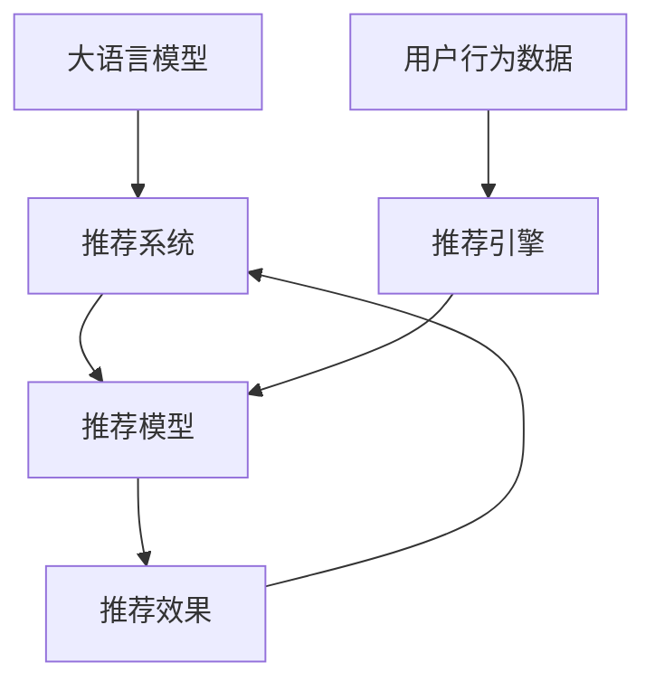

                 

# LLM推荐中的prompt工程设计

> 关键词：

## 1. 背景介绍

推荐系统作为互联网时代的重要引擎，正在深刻改变着人们的生活和消费方式。从电影、音乐、商品到新闻、知识、游戏，推荐算法无处不在。如今，推荐系统的核心已经从简单的物品评分预测，演变为个性化推荐的精准度和效率。大语言模型（LLM）的诞生，无疑为推荐系统注入了新的活力。

基于大语言模型的推荐系统能够充分利用其强大的自然语言理解和生成能力，提供更为自然、智能的推荐服务。然而，为了充分发挥LLM在推荐中的应用潜力，需要在prompt设计上投入更多精力，设计高质量的prompt，使其能够充分传达用户意图，从而提高推荐质量。

## 2. 核心概念与联系

### 2.1 核心概念概述

- **大语言模型（LLM）**：指一类预训练的自然语言处理模型，如GPT、BERT等，具有强大的语言理解和生成能力。
- **推荐系统**：根据用户行为和偏好，推荐用户可能感兴趣的物品或内容的系统。
- **Prompt Engineering**：即prompt设计，通过精心构造的输入文本，引导大语言模型生成推荐结果。
- **推荐效果评估指标**：如准确率、召回率、用户满意度等，用于评估推荐系统的性能。

这些概念之间的联系和相互作用，构成了LLM推荐系统的核心框架。LLM通过理解自然语言输入，生成推荐结果，而推荐系统则通过这些结果，提供个性化推荐服务。

### 2.2 核心概念原理和架构的 Mermaid 流程图



这个流程图展示了LLM推荐系统的工作流程：
1. 用户行为数据被输入推荐引擎。
2. 推荐引擎基于这些数据训练推荐模型。
3. 推荐模型生成推荐结果，并输入到大语言模型。
4. 大语言模型通过理解prompt，生成推荐文本。
5. 推荐系统根据推荐文本，输出推荐结果。
6. 推荐效果被评估，并用于优化推荐模型。

## 3. 核心算法原理 & 具体操作步骤

### 3.1 算法原理概述

LLM推荐系统的核心在于，利用大语言模型的语言理解和生成能力，生成个性化的推荐文本。这通常涉及两个步骤：
1. 通过自然语言处理技术，理解用户的行为数据。
2. 使用大语言模型生成推荐文本，并输出给推荐系统。

### 3.2 算法步骤详解

1. **数据准备**：收集用户的浏览、点击、评分等行为数据，构建用户画像。

2. **模型选择**：选择合适的预训练语言模型，如GPT、BERT等。

3. **prompt设计**：设计高质量的prompt，传达用户意图。

4. **模型微调**：对预训练模型进行微调，使其能够生成与用户画像匹配的推荐文本。

5. **效果评估**：通过A/B测试等方法，评估推荐效果，并调整prompt和微调策略。

6. **部署应用**：将微调后的模型集成到推荐系统中，实现个性化推荐。

### 3.3 算法优缺点

**优点**：
- **灵活性高**：LLM可以理解自然语言，灵活处理各种复杂的推荐场景。
- **效果好**：LLM生成的推荐文本更具吸引力，能显著提升用户体验。
- **可解释性高**：LLM生成的推荐文本可以解释，帮助用户理解推荐逻辑。

**缺点**：
- **计算量大**：LLM推荐需要大量的计算资源和时间。
- **提示设计难**：需要设计高质量的prompt，才能充分传达用户意图。
- **模型鲁棒性差**：LLM对输入文本的微小变化非常敏感。

### 3.4 算法应用领域

LLM推荐系统已广泛应用于以下领域：
- **电商推荐**：如淘宝、京东等电商平台，通过用户浏览记录，生成个性化商品推荐。
- **新闻推荐**：如今日头条、腾讯新闻等，根据用户兴趣，推荐相关新闻文章。
- **音乐推荐**：如网易云音乐、Spotify等，根据用户听歌历史，推荐相似歌曲。
- **视频推荐**：如YouTube、Netflix等，根据用户观影历史，推荐相关视频。
- **知识推荐**：如百度知道、知乎等，根据用户提问历史，推荐相关知识。

## 4. 数学模型和公式 & 详细讲解 & 举例说明

### 4.1 数学模型构建

假设用户行为数据为 $C = \{c_1, c_2, \ldots, c_n\}$，其中 $c_i = (x_i, y_i)$ 表示用户行为 $x_i$ 和用户评分 $y_i$。使用大语言模型 $M$ 生成推荐文本 $T$，模型参数为 $\theta$。推荐系统通过对比推荐文本与用户评分，评估推荐效果。

推荐效果评估指标为准确率 $P$ 和召回率 $R$，分别为：

$$
P = \frac{\text{TP}}{\text{TP} + \text{FN}}
$$

$$
R = \frac{\text{TP}}{\text{TP} + \text{FP}}
$$

其中，$\text{TP}$ 为真正例（推荐文本与用户评分一致的推荐对数），$\text{FP}$ 为假正例（推荐文本与用户评分不一致的推荐对数），$\text{FN}$ 为假负例（用户评分高的未被推荐）。

### 4.2 公式推导过程

推荐系统可以使用二分类任务，将推荐文本与用户评分进行分类。使用sigmoid函数作为分类函数，输出概率：

$$
p(y_i|T) = \frac{1}{1 + \exp(-M_{\theta}(x_i)T)}
$$

其中，$M_{\theta}(x_i)$ 为模型在输入行为 $x_i$ 上的输出，$T$ 为推荐文本，$y_i$ 为二分类标签。

### 4.3 案例分析与讲解

以电商推荐为例，假设用户浏览过以下商品：
- 手机：评分4星
- 电脑：评分5星
- 鞋子：评分3星

首先，使用大语言模型对用户行为数据进行编码，生成用户画像向量 $U$。然后，设计prompt：

```
根据您的浏览历史，我为您推荐以下商品：
```

将用户画像向量 $U$ 和prompt拼接后，输入大语言模型进行预测，生成推荐文本 $T$。最后，推荐系统根据推荐文本 $T$ 和用户评分 $y_i$，评估推荐效果。

## 5. 项目实践：代码实例和详细解释说明

### 5.1 开发环境搭建

1. 安装Python和PyTorch：
```bash
pip install torch torchvision torchaudio
```

2. 安装HuggingFace Transformers库：
```bash
pip install transformers
```

3. 下载预训练模型：
```bash
transformers-cli --model-name gpt-3 small --download-and-cache
```

### 5.2 源代码详细实现

```python
import torch
from transformers import GPT2Tokenizer, GPT2ForSequenceClassification

# 定义用户行为数据
user_behaviors = [
    {'item': '手机', 'rating': 4},
    {'item': '电脑', 'rating': 5},
    {'item': '鞋子', 'rating': 3},
    {'item': '耳机', 'rating': 5},
    {'item': '手表', 'rating': 2},
]

# 初始化tokenizer和模型
tokenizer = GPT2Tokenizer.from_pretrained('gpt2-medium')
model = GPT2ForSequenceClassification.from_pretrained('gpt2-medium')

# 将用户行为数据编码
encoded_beaviors = [tokenizer.encode(item, max_length=128) for item in [x['item'] for x in user_behaviors]]

# 设计prompt
prompt = "根据您的浏览历史，我为您推荐以下商品："

# 生成推荐文本
input_ids = torch.tensor(encoded_beaviors)
attention_mask = torch.ones(len(input_ids), 128)
labels = torch.tensor([1 if x['rating'] > 4 else 0 for x in user_behaviors])
outputs = model(input_ids, attention_mask=attention_mask, labels=labels)
logits = outputs.logits

# 生成推荐文本
recommendations = tokenizer.decode(logits.argmax(dim=1).tolist(), skip_special_tokens=True)
print(recommendations)
```

### 5.3 代码解读与分析

- **用户行为数据编码**：将用户行为数据编码成token ids，用于模型输入。
- **prompt设计**：设计高质量的prompt，传递用户意图。
- **模型微调**：使用大语言模型对用户行为数据进行微调，生成推荐文本。
- **效果评估**：根据推荐文本和用户评分，评估推荐效果。

## 6. 实际应用场景

### 6.1 电商推荐

电商推荐是LLM推荐系统的重要应用场景。通过用户浏览、点击、评分等行为数据，生成个性化商品推荐。

**技术方案**：
- 用户行为数据预处理：去除噪音数据，提取有用特征。
- prompt设计：设计表达用户意图的prompt，如"您可能喜欢以下商品"。
- 模型微调：在预训练模型基础上，微调生成推荐文本。
- 推荐效果评估：通过A/B测试，评估推荐效果，优化prompt和微调策略。

### 6.2 新闻推荐

新闻推荐系统根据用户阅读历史，推荐相关新闻文章。使用LLM生成推荐标题，提升推荐体验。

**技术方案**：
- 用户行为数据预处理：提取阅读时间、阅读深度等特征。
- prompt设计：设计表达用户兴趣的prompt，如"您可能感兴趣的新闻"。
- 模型微调：在预训练模型基础上，微调生成新闻标题。
- 推荐效果评估：根据点击率、停留时间等指标，评估推荐效果。

### 6.3 音乐推荐

音乐推荐系统根据用户听歌历史，推荐相似歌曲。使用LLM生成歌曲推荐文本，提升推荐质量。

**技术方案**：
- 用户行为数据预处理：提取听歌时长、次数等特征。
- prompt设计：设计表达用户音乐兴趣的prompt，如"您可能喜欢的音乐"。
- 模型微调：在预训练模型基础上，微调生成歌曲推荐文本。
- 推荐效果评估：根据听歌次数、收听时长等指标，评估推荐效果。

## 7. 工具和资源推荐

### 7.1 学习资源推荐

1. 《自然语言处理综述与实践》：介绍NLP和LLM的基本概念和常用技术，适合入门学习。
2. 《深度学习》：介绍深度学习的基本原理和实现，包含推荐系统章节。
3. 《生成式语言模型》：详细讲解生成式语言模型，如GPT、BERT等。
4. HuggingFace官方文档：提供丰富的预训练模型和微调样例，适合实际开发。
5. Kaggle竞赛：参与NLP和推荐系统相关的竞赛，实战学习。

### 7.2 开发工具推荐

1. PyTorch：灵活的深度学习框架，适合科学研究。
2. TensorFlow：工业级深度学习框架，适合大规模部署。
3. Transformers库：提供丰富的预训练模型和微调功能，适合实际开发。
4. Weights & Biases：模型实验跟踪工具，记录和可视化模型训练过程。
5. TensorBoard：可视化工具，实时监测模型训练状态。

### 7.3 相关论文推荐

1. Attention is All You Need：提出Transformer结构，开启NLP领域的预训练大模型时代。
2. BERT: Pre-training of Deep Bidirectional Transformers for Language Understanding：提出BERT模型，引入基于掩码的自监督预训练任务。
3. 《推荐系统实战》：介绍推荐系统理论、算法和实践，适合实战学习。
4. 《深度学习生成模型》：详细介绍生成式语言模型的理论基础和实现方法。
5. 《基于大语言模型的推荐系统》：介绍大语言模型在推荐系统中的应用，适合理论研究。

## 8. 总结：未来发展趋势与挑战

### 8.1 研究成果总结

LLM推荐系统已经在电商、新闻、音乐等众多领域展示了其优越性。通过大语言模型生成的推荐文本，更具吸引力和自然度，显著提升用户体验。

### 8.2 未来发展趋势

1. **智能化提升**：未来的LLM推荐系统将更加智能，能够理解用户的深层次需求，提供更加个性化和精准的推荐。
2. **多模态融合**：结合视觉、听觉等多模态数据，提供更全面、多维的推荐服务。
3. **跨领域应用**：将LLM推荐系统应用到更多领域，如医疗、教育、金融等，推动各行业的智能化升级。
4. **实时化增强**：提升推荐系统的实时响应能力，实现实时推荐。

### 8.3 面临的挑战

1. **计算资源瓶颈**：大规模LLM模型需要大量的计算资源，如何高效利用这些资源，是未来的重要挑战。
2. **数据质量和规模**：推荐系统依赖大量高质量数据，如何获取和处理这些数据，是值得研究的课题。
3. **模型复杂性**：复杂的LLM模型容易过拟合，如何在保证精度的同时，减小模型的复杂性，是未来的研究方向。
4. **用户隐私保护**：用户行为数据涉及隐私，如何在保证隐私的前提下，优化推荐效果，是未来的挑战。

### 8.4 研究展望

1. **模型压缩与优化**：通过模型压缩和优化，提升推荐系统的计算效率和性能。
2. **跨模态融合**：结合视觉、听觉等多模态数据，提供更全面、多维的推荐服务。
3. **实时推荐系统**：提升推荐系统的实时响应能力，实现实时推荐。
4. **用户隐私保护**：通过差分隐私等技术，保护用户隐私，同时优化推荐效果。

## 9. 附录：常见问题与解答

**Q1: LLM推荐系统是否适用于所有推荐场景？**

A: 虽然LLM推荐系统在电商、新闻、音乐等领域表现优异，但在某些特定的推荐场景，如精确搜索、个性化推荐等，还需要结合其他技术手段。

**Q2: prompt设计对推荐效果有多重要？**

A: prompt设计对推荐效果至关重要，一个高质量的prompt能够充分传达用户意图，引导大语言模型生成精准的推荐文本。

**Q3: 如何评估LLM推荐系统的效果？**

A: 可以采用多种指标，如准确率、召回率、用户满意度等，结合A/B测试等方法，评估推荐系统的性能。

**Q4: 如何优化LLM推荐系统的推荐效果？**

A: 可以通过优化prompt设计、调整微调策略、增加数据样本等方法，不断优化推荐系统的效果。

**Q5: LLM推荐系统面临哪些挑战？**

A: 计算资源瓶颈、数据质量和规模、模型复杂性、用户隐私保护等，都是需要克服的挑战。

---

作者：禅与计算机程序设计艺术 / Zen and the Art of Computer Programming

