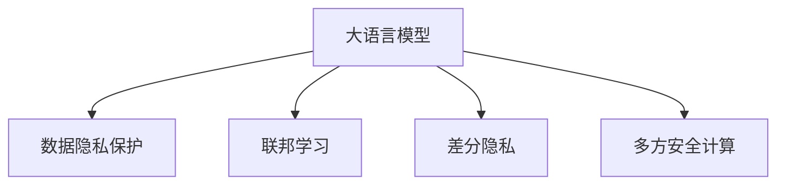

                 

# LLM时代的数据保护：新型隐私安全技术

> 关键词：大语言模型(LLM), 隐私保护, 数据安全, 联邦学习(Federated Learning), 差分隐私(Differential Privacy), 多方安全计算(MPC)

## 1. 背景介绍

### 1.1 问题由来
随着人工智能技术的迅猛发展，尤其是大语言模型（Large Language Models, LLMs）的兴起，其在自然语言处理（NLP）、智能对话、信息检索等多个领域的广泛应用，极大地提升了系统性能和用户体验。然而，随着数据量的指数级增长，数据安全与隐私保护问题也逐渐成为制约大语言模型发展的重要瓶颈。

近年来，用户隐私意识的增强和数据泄露事件的频发，使得政府和企业对数据保护的要求日益严格。如何在大规模数据应用中实现隐私保护，成为LLM时代亟待解决的关键问题。

### 1.2 问题核心关键点
目前，数据隐私和安全保护技术在大语言模型应用中面临的挑战包括：
- **数据泄露风险**：模型训练、推理等过程中，大量个人数据不可避免地被泄露。
- **隐私侵犯隐患**：模型训练过程中的样本重识别、隐私信息挖掘等行为可能侵害用户隐私。
- **数据异质性**：不同组织的数据分布差异较大，难以直接共享和合并。
- **计算资源限制**：大规模数据处理需要大量计算资源，单边集中处理难以满足需求。

为应对这些挑战，隐私保护技术（如差分隐私、联邦学习等）和大语言模型结合，成为当前研究的热点。本文将详细探讨这些技术的原理与实践，并结合具体案例分析其应用效果。

## 2. 核心概念与联系

### 2.1 核心概念概述

为更好地理解LLM时代的数据保护技术，本节将介绍几个密切相关的核心概念：

- **大语言模型(LLM)**：以自回归（如GPT）或自编码（如BERT）模型为代表的大规模预训练语言模型。通过在海量无标签文本语料上进行预训练，学习通用的语言表示，具备强大的语言理解和生成能力。
- **数据隐私保护**：指在数据处理、存储、传输等环节中，保护个人数据的隐私和机密性，防止未经授权的访问和使用。
- **联邦学习(Federated Learning)**：指多个独立数据持有者在不共享原始数据的前提下，通过分布式方式联合训练模型，以实现数据本地化保护。
- **差分隐私(Differential Privacy)**：通过在模型输出中加入噪声，使得无法识别特定个体的数据泄露，从而保护用户隐私。
- **多方安全计算(MPC)**：在计算过程中，确保各方的数据不被泄露，同时保证计算结果的正确性。

这些核心概念之间的逻辑关系可以通过以下Mermaid流程图来展示：



这个流程图展示了大语言模型相关的核心概念及其之间的关系：

1. 大语言模型通过预训练获得基础能力。
2. 数据隐私保护技术确保模型训练和推理中的数据安全。
3. 联邦学习和大语言模型结合，实现数据本地化保护。
4. 差分隐私技术为大语言模型的隐私保护提供数学保证。
5. 多方安全计算技术为大语言模型的隐私计算提供安全保障。

这些概念共同构成了LLM时代的数据保护框架，使得大语言模型能够在保护隐私的前提下进行高效的应用。

## 3. 核心算法原理 & 具体操作步骤
### 3.1 算法原理概述

在大语言模型应用中，隐私保护和数据安全是至关重要的问题。为确保数据隐私，通常采用以下几种策略：

1. **联邦学习**：各参与方在本地独立训练模型，通过参数聚合（如梯度平均）更新全局模型，避免数据共享。
2. **差分隐私**：在模型输出中加入噪声，使得数据无法识别具体个体，从而保护隐私。
3. **多方安全计算**：各参与方在不共享数据的前提下，通过加密计算实现共同任务的完成。

这些技术均旨在保护数据隐私，同时保证模型的性能和应用效果。下面将详细介绍这些算法的原理与操作步骤。

### 3.2 算法步骤详解

#### 3.2.1 联邦学习

**联邦学习算法步骤**：

1. **模型初始化**：参与方在本地训练模型的初始版本，通过参数随机化或预训练模型进行初始化。
2. **模型更新**：各参与方独立使用本地数据训练模型，计算梯度并更新本地模型。
3. **参数聚合**：各参与方将更新后的参数发送至中心节点，中心节点通过参数聚合算法（如梯度平均、FedAvg等）更新全局模型。
4. **结果分配**：将全局模型参数分配给各参与方，用于本地模型的进一步更新。
5. **迭代更新**：重复执行步骤2-4，直至模型收敛。

联邦学习的关键在于确保数据隐私，防止数据泄露。通过参数聚合，模型可以在不共享数据的情况下完成训练。

#### 3.2.2 差分隐私

**差分隐私算法步骤**：

1. **数据预处理**：对原始数据进行预处理，如添加噪声、截断等，确保数据难以识别个体。
2. **模型训练**：在处理后的数据上训练模型，得到原始数据的“隐私化”版本。
3. **结果输出**：对模型的输出结果进行差分隐私处理，即在输出中引入噪声，确保单个数据点的隐私不可恢复。

差分隐私的核心在于数学证明，即加入的噪声足够大，使得任何个体数据对模型输出的影响微乎其微，从而保护隐私。

#### 3.2.3 多方安全计算

**多方安全计算算法步骤**：

1. **输入封装**：各参与方对输入数据进行加密，确保数据在传输和计算过程中的安全。
2. **计算执行**：各参与方在本地对加密数据进行计算，得到中间结果。
3. **结果解密**：各参与方对计算结果进行解密，得到最终结果。
4. **结果验证**：各参与方验证结果的正确性，确保计算结果的安全性。

多方安全计算的核心在于确保数据和计算结果的安全性，通过加密和解密机制，实现安全的计算过程。

### 3.3 算法优缺点

这些隐私保护技术各有优缺点：

**联邦学习**的优点在于数据本地化保护，适用于多组织协作的场景。缺点是计算复杂度高，参与方需要高度信任中心节点。

**差分隐私**通过加入噪声保护隐私，适用于单组织应用。缺点是计算复杂度高，对数据处理有较高要求。

**多方安全计算**确保了数据和结果的安全性，适用于高度敏感的应用。缺点是实现复杂，计算开销较大。

### 3.4 算法应用领域

这些隐私保护技术在大语言模型中的应用领域广泛，包括：

- **金融风控**：金融机构通过联邦学习联合训练模型，实现信用评估、欺诈检测等任务，同时保护客户隐私。
- **医疗健康**：医疗机构通过差分隐私技术保护患者隐私，同时训练疾病预测、诊断模型。
- **智能制造**：制造企业通过多方安全计算技术，联合优化生产流程，同时保护设备数据和工艺参数。
- **智慧城市**：智慧城市平台通过联邦学习和大数据联合分析，实现交通流预测、环境监测等任务，同时保护市民隐私。

这些应用场景展示了隐私保护技术在大语言模型中的应用潜力和价值。

## 4. 数学模型和公式 & 详细讲解 & 举例说明

### 4.1 数学模型构建

在大语言模型微调中，隐私保护技术涉及数学模型的构建与优化。本节将使用数学语言对联邦学习、差分隐私、多方安全计算等算法进行严谨的数学推导。

**联邦学习**：

设模型参数为 $\theta$，参与方 $i$ 的本地数据集为 $D_i$，本地模型为 $\theta_i$。联邦学习的目标是最小化全局损失函数：

$$
\min_{\theta} \sum_i \mathcal{L}_i(\theta)
$$

其中 $\mathcal{L}_i$ 为本地损失函数。

通过梯度下降法，各参与方计算本地梯度 $\nabla_\theta \mathcal{L}_i(\theta)$，并更新参数：

$$
\theta_i \leftarrow \theta_i - \eta \nabla_\theta \mathcal{L}_i(\theta)
$$

中心节点通过参数聚合算法更新全局模型参数 $\theta$：

$$
\theta \leftarrow \frac{1}{n} \sum_i \theta_i
$$

**差分隐私**：

设原始数据集为 $D$，隐私化数据集为 $D'$。差分隐私的目标是使得任何个体 $d \in D$ 对隐私化数据的影响微小，即：

$$
\forall d \in D, \frac{Pr[D' = d]}{Pr[D' = d' \,|\, d \in D']} \leq \exp(\epsilon)
$$

其中 $\epsilon$ 为隐私参数，表示个体数据泄露的容忍度。

在模型训练中，差分隐私通过在损失函数中加入噪声 $\epsilon$ 来保护隐私：

$$
\mathcal{L}'_i(\theta) = \mathcal{L}_i(\theta) + \epsilon
$$

其中 $\epsilon$ 为高斯噪声，满足 $N(0, \sigma^2)$。

**多方安全计算**：

设参与方 $i$ 的本地数据为 $x_i$，加密函数为 $E$，解密函数为 $D$。多方安全计算的目标是在各参与方之间共享计算结果 $y$，同时保护数据隐私。

设各参与方计算结果为 $y_i = f(x_i)$，其中 $f$ 为计算函数。通过加密和解密机制，保证 $y_i$ 的隐私性：

$$
y = D(E(f(E^{-1}(x_1), E^{-1}(x_2), ..., E^{-1}(x_n)))
$$

其中 $E^{-1}$ 为解密函数，$D^{-1}$ 为解密函数。

### 4.2 公式推导过程

**联邦学习**：

梯度聚合算法采用如下形式：

$$
\theta \leftarrow \frac{1}{n} \sum_i \theta_i
$$

其中 $n$ 为参与方数量。

**差分隐私**：

差分隐私通过在损失函数中加入噪声来实现。假设有 $n$ 个数据点，加入噪声后的损失函数为：

$$
\mathcal{L}'_i(\theta) = \mathcal{L}_i(\theta) + \epsilon
$$

其中 $\epsilon$ 为均值为0，方差为 $\sigma^2$ 的高斯噪声。

**多方安全计算**：

加密函数 $E$ 和解密函数 $D$ 通过公钥和私钥进行加密解密。设 $E(x)$ 和 $D(y)$ 为加密和解密函数，$y = f(x)$ 为计算结果，则多方安全计算的形式为：

$$
y = D(E(x_1), E(x_2), ..., E(x_n))
$$

其中 $x_i = E^{-1}(y_i)$。

### 4.3 案例分析与讲解

以金融风控为例，说明这些隐私保护技术在大语言模型中的实际应用。

金融机构收集了用户的历史信用数据，希望通过大语言模型训练一个信用评估模型。用户数据涉及隐私，必须保护。

**联邦学习**：

1. **模型初始化**：金融机构和信用评估公司分别在自己的数据集上初始化模型参数。
2. **模型更新**：金融机构和信用评估公司分别在本地数据集上独立训练模型，计算梯度并更新本地模型。
3. **参数聚合**：两家公司将更新后的参数发送至中心节点，中心节点通过梯度平均更新全局模型。
4. **结果分配**：将全局模型参数分配给两家公司，用于本地模型的进一步更新。
5. **迭代更新**：重复执行上述步骤，直至模型收敛。

通过联邦学习，两家公司可以在不共享原始数据的情况下，联合训练信用评估模型，同时保护用户隐私。

**差分隐私**：

1. **数据预处理**：在用户数据上加入高斯噪声，确保单个数据点的隐私不可恢复。
2. **模型训练**：在处理后的数据上训练模型，得到原始数据的“隐私化”版本。
3. **结果输出**：对模型的输出结果进行差分隐私处理，即在输出中引入噪声，确保单个数据点的隐私不可恢复。

通过差分隐私，金融机构可以在模型训练中保护用户隐私，同时获得可靠的信用评估结果。

**多方安全计算**：

1. **输入封装**：金融机构和信用评估公司对用户数据进行加密。
2. **计算执行**：两家公司在本地对加密数据进行计算，得到中间结果。
3. **结果解密**：两家公司对计算结果进行解密，得到最终结果。
4. **结果验证**：两家公司验证结果的正确性，确保计算结果的安全性。

通过多方安全计算，两家公司可以在计算过程中保护用户数据隐私，同时实现信用评估模型的联合计算。

## 5. 项目实践：代码实例和详细解释说明

### 5.1 开发环境搭建

在进行隐私保护技术实践前，我们需要准备好开发环境。以下是使用Python进行PyTorch开发的环境配置流程：

1. 安装Anaconda：从官网下载并安装Anaconda，用于创建独立的Python环境。

2. 创建并激活虚拟环境：
```bash
conda create -n pytorch-env python=3.8 
conda activate pytorch-env
```

3. 安装PyTorch：根据CUDA版本，从官网获取对应的安装命令。例如：
```bash
conda install pytorch torchvision torchaudio cudatoolkit=11.1 -c pytorch -c conda-forge
```

4. 安装TensorFlow：
```bash
pip install tensorflow
```

5. 安装各类工具包：
```bash
pip install numpy pandas scikit-learn matplotlib tqdm jupyter notebook ipython
```

完成上述步骤后，即可在`pytorch-env`环境中开始隐私保护技术实践。

### 5.2 源代码详细实现

这里我们以差分隐私技术为例，使用TensorFlow实现一个简单的信用评估模型。

首先，定义数据集和模型：

```python
import tensorflow as tf
import numpy as np

# 定义数据集
train_data = np.random.randn(1000, 10)
train_labels = np.random.randint(0, 2, size=(1000,))

# 定义模型
model = tf.keras.Sequential([
    tf.keras.layers.Dense(64, activation='relu'),
    tf.keras.layers.Dense(1, activation='sigmoid')
])
```

然后，定义差分隐私机制：

```python
# 定义差分隐私参数
epsilon = 0.1
delta = 0.1

# 定义噪声分布
noise = tf.random.normal(shape=train_data.shape, mean=0.0, stddev=epsilon)

# 定义差分隐私函数
def differential_privacy(model, x, y):
    output = model(x)
    loss = tf.reduce_mean(tf.nn.sigmoid_cross_entropy_with_logits(labels=y, logits=output))
    loss += tf.reduce_mean(tf.square(noise))
    return loss

# 定义差分隐私损失函数
def differential_privacy_loss(model, train_data, train_labels):
    batch_size = 32
    for i in range(0, len(train_data), batch_size):
        x = train_data[i:i+batch_size]
        y = train_labels[i:i+batch_size]
        loss = differential_privacy(model, x, y)
        tf.keras.losses.experimental.add_loss(lambda: loss)
```

最后，启动模型训练和评估：

```python
# 定义优化器和损失函数
optimizer = tf.keras.optimizers.Adam(learning_rate=0.001)
model.compile(optimizer=optimizer, loss='binary_crossentropy', metrics=['accuracy'])

# 训练模型
model.fit(train_data, train_labels, epochs=10, batch_size=32, callbacks=[tf.keras.callbacks.EarlyStopping(patience=3)])

# 评估模型
test_data = np.random.randn(100, 10)
test_labels = np.random.randint(0, 2, size=(100,))
model.evaluate(test_data, test_labels)
```

以上就是使用TensorFlow实现差分隐私的信用评估模型的完整代码实现。可以看到，通过添加差分隐私机制，我们可以在模型训练过程中保护数据隐私。

### 5.3 代码解读与分析

让我们再详细解读一下关键代码的实现细节：

**数据集定义**：
- 使用NumPy生成随机数据集，作为模型的训练和测试数据。

**模型定义**：
- 使用Keras定义一个简单的全连接神经网络模型，用于信用评估。

**差分隐私机制**：
- 定义差分隐私参数 $\epsilon$ 和 $\delta$，表示隐私泄露的容忍度和错误率。
- 使用TensorFlow生成高斯噪声。
- 定义差分隐私函数，在损失函数中加入噪声。
- 定义差分隐私损失函数，用于模型训练。

**模型训练和评估**：
- 使用Keras定义优化器和损失函数，并进行模型编译。
- 使用fit方法训练模型，并在验证集上评估模型性能。

**差分隐私的实现**：
- 差分隐私机制通过在损失函数中加入噪声来实现，每次训练时计算噪声分布，并将其加入到损失函数中。
- 差分隐私机制可以确保模型输出不泄露具体个体数据，从而保护隐私。

## 6. 实际应用场景

### 6.1 金融风控

在金融风控中，差分隐私和联邦学习可以联合应用，保护客户隐私的同时进行风险评估。金融机构和信用评估公司可以联合训练信用评估模型，各参与方在本地独立训练模型，通过差分隐私机制保护数据隐私，通过联邦学习机制联合更新全局模型。

### 6.2 医疗健康

医疗机构通过差分隐私技术保护患者隐私，训练疾病预测、诊断模型。医院可以在本地数据上训练模型，通过加入噪声保护患者隐私，同时与科研机构联合训练模型，实现疾病的联合预测和诊断。

### 6.3 智能制造

制造企业通过多方安全计算技术，联合优化生产流程，同时保护设备数据和工艺参数。各企业可以在本地对数据进行加密，通过安全计算完成生产优化，同时确保数据的安全性。

### 6.4 未来应用展望

随着隐私保护技术的不断演进，未来在LLM时代将会有更多创新的应用场景，例如：

- **智能合约**：通过多方安全计算技术，实现智能合约的安全计算，确保合约执行的公平性和安全性。
- **分布式计算**：通过差分隐私和多方安全计算技术，实现大规模分布式计算任务，同时保护数据隐私。
- **联邦AI**：通过联邦学习和大语言模型结合，实现联邦AI技术，各组织可以在不共享数据的情况下，联合训练AI模型，实现知识的共享和创新。

## 7. 工具和资源推荐
### 7.1 学习资源推荐

为了帮助开发者系统掌握隐私保护技术的基础和应用，这里推荐一些优质的学习资源：

1. 《差分隐私理论与实践》：深度介绍差分隐私的理论基础和应用案例，适合初学者和高级开发者。
2. 《联邦学习》课程：斯坦福大学开设的联邦学习课程，涵盖联邦学习的基本概念、算法和应用。
3. 《多方安全计算》书籍：详细讲解多方安全计算的原理和应用，适合对隐私保护技术有深入研究需求的人士。
4. Kaggle竞赛：参与差分隐私和联邦学习相关的Kaggle竞赛，通过实战提升隐私保护技术的应用能力。

通过对这些资源的学习实践，相信你一定能够快速掌握隐私保护技术的精髓，并用于解决实际的隐私保护问题。

### 7.2 开发工具推荐

高效的开发离不开优秀的工具支持。以下是几款用于隐私保护技术开发的常用工具：

1. PyTorch：基于Python的开源深度学习框架，支持差分隐私和多边安全计算的实现。
2. TensorFlow：由Google主导开发的开源深度学习框架，支持差分隐私和多边安全计算的实现。
3. IBM ILLUMINATE：IBM推出的隐私保护技术开发工具，支持差分隐私和多边安全计算，提供丰富的API接口。
4. Microsoft SEAL：微软推出的安全计算库，支持多方安全计算，适用于计算密集型的隐私保护应用。
5. Google Privacy Sandbox：谷歌推出的隐私保护技术平台，支持差分隐私和多边安全计算，提供丰富的API接口和工具支持。

合理利用这些工具，可以显著提升隐私保护技术的开发效率，加快创新迭代的步伐。

### 7.3 相关论文推荐

隐私保护技术的发展源于学界的持续研究。以下是几篇奠基性的相关论文，推荐阅读：

1. "Differential Privacy" by Dwork et al.：差分隐私技术的奠基性论文，提出差分隐私的定义和算法。
2. "Federated Learning" by McMahan et al.：联邦学习技术的奠基性论文，提出联邦学习的概念和算法。
3. "Multiparty Computation" by Goldwasser et al.：多方安全计算技术的奠基性论文，提出多方安全计算的定义和算法。

这些论文代表了大隐私保护技术的进展方向，通过学习这些前沿成果，可以帮助研究者把握学科前进方向，激发更多的创新灵感。

## 8. 总结：未来发展趋势与挑战

### 8.1 研究成果总结

本文对隐私保护技术在大语言模型中的应用进行了全面系统的介绍。首先阐述了隐私保护技术在大语言模型中的重要性，明确了差分隐私、联邦学习、多方安全计算等技术的应用场景和优势。其次，从原理到实践，详细讲解了这些隐私保护技术的数学模型和实现方法，给出了具体的代码实现示例。同时，本文还广泛探讨了这些技术在金融风控、医疗健康、智能制造等众多领域的应用前景，展示了隐私保护技术在大语言模型中的应用潜力和价值。

通过本文的系统梳理，可以看到，隐私保护技术在大语言模型中的应用前景广阔，在保护数据隐私的同时，能够提升系统的安全性和可靠性。未来，随着隐私保护技术的不断演进，基于大语言模型的隐私保护范式将得到更广泛的应用。

### 8.2 未来发展趋势

展望未来，隐私保护技术在大语言模型中的应用将呈现以下几个发展趋势：

1. **隐私保护技术的普适性**：隐私保护技术将逐渐融入各种AI应用中，成为不可或缺的一部分。无论是文本、图像、语音等多种数据类型，都可以通过隐私保护技术进行安全处理。

2. **隐私保护技术的灵活性**：未来的隐私保护技术将更加灵活多样，根据不同应用场景选择不同的隐私保护策略，实现更高效、更安全的隐私保护效果。

3. **隐私保护技术的自动化**：隐私保护技术将逐渐实现自动化，通过智能算法选择最优的隐私保护策略，降低人工干预的复杂度。

4. **隐私保护技术的协同化**：未来的隐私保护技术将更加注重协同化，通过多方安全计算、联邦学习等技术，实现跨组织、跨平台的隐私保护协同。

5. **隐私保护技术的多模态化**：未来的隐私保护技术将结合多种模态数据，实现多模态隐私保护，提升数据融合和协同处理能力。

6. **隐私保护技术的泛化性**：未来的隐私保护技术将更加注重泛化性，通过泛化学习和多任务学习等技术，提升隐私保护技术在不同应用场景下的适应性和可扩展性。

这些趋势凸显了隐私保护技术在大语言模型中的重要性和前景。隐私保护技术的不断演进，将为构建安全、可靠、智能的AI系统提供坚实保障。

### 8.3 面临的挑战

尽管隐私保护技术在大语言模型中取得了一定的进展，但在迈向更广泛应用的过程中，仍面临诸多挑战：

1. **计算开销大**：隐私保护技术通常需要计算大量噪声和加密解密操作，增加系统复杂度，影响计算效率。
2. **实现难度高**：隐私保护技术的实现涉及复杂的数学模型和算法，需要较高的技术门槛，难以快速部署。
3. **隐私保护与性能冲突**：隐私保护技术往往需要在隐私保护和模型性能之间找到平衡，过度保护可能导致性能下降。
4. **数据质量问题**：隐私保护技术对数据质量要求较高，数据的噪声和偏差可能影响模型的效果。
5. **跨平台协同难度**：隐私保护技术需要在不同平台之间进行协同计算，技术标准和通信协议的统一尚需进一步探索。

### 8.4 研究展望

面对隐私保护技术在大语言模型中面临的挑战，未来的研究需要在以下几个方面寻求新的突破：

1. **高效隐私保护算法**：开发更高效、更实用的隐私保护算法，降低计算开销，提升系统性能。
2. **隐私保护自动化**：实现隐私保护技术的自动化，通过智能算法选择最优的隐私保护策略，降低人工干预的复杂度。
3. **跨平台协同技术**：探索跨平台、跨组织的多方安全计算技术，实现隐私保护技术的协同化应用。
4. **多模态隐私保护**：结合多种模态数据，实现多模态隐私保护，提升数据融合和协同处理能力。
5. **隐私保护泛化性**：通过泛化学习和多任务学习等技术，提升隐私保护技术在不同应用场景下的适应性和可扩展性。

这些研究方向将推动隐私保护技术在大语言模型中的应用，实现隐私保护与模型性能的协同提升，为构建安全、可靠、智能的AI系统提供技术支持。

## 9. 附录：常见问题与解答

**Q1：大语言模型在应用中如何保护数据隐私？**

A: 大语言模型在应用中保护数据隐私，通常采用差分隐私、联邦学习、多方安全计算等隐私保护技术。通过在模型输出中加入噪声、在不共享原始数据的情况下联合训练模型、确保数据加密等手段，实现对数据的保护。

**Q2：差分隐私和联邦学习的区别是什么？**

A: 差分隐私和联邦学习的主要区别在于数据处理方式。差分隐私在模型输出中加入噪声，保护单个数据点不被泄露。联邦学习在本地独立训练模型，通过参数聚合更新全局模型，实现数据本地化保护。

**Q3：多方安全计算的核心优势是什么？**

A: 多方安全计算的核心优势在于确保数据和结果的安全性。通过加密和解密机制，各参与方在计算过程中无法泄露对方数据，同时保证计算结果的正确性。

**Q4：在隐私保护技术中，如何平衡隐私保护与模型性能？**

A: 隐私保护技术中，隐私保护与模型性能的平衡是一个重要的研究课题。通常需要根据具体应用场景，选择不同的隐私保护策略，如差分隐私和联邦学习等。同时，可以通过优化算法、增加噪声量等方式，在隐私保护和性能之间找到平衡。

**Q5：隐私保护技术在大语言模型中的应用前景如何？**

A: 隐私保护技术在大语言模型中的应用前景广阔，适用于金融风控、医疗健康、智能制造等多个领域。通过隐私保护技术，可以在保护用户隐私的同时，实现大语言模型的广泛应用，推动人工智能技术的普适化发展。

---

作者：禅与计算机程序设计艺术 / Zen and the Art of Computer Programming

