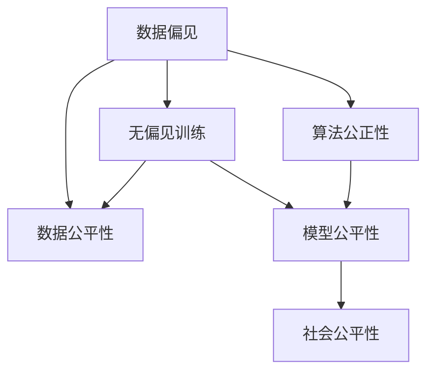

                 

# LLM的偏见消除：构建公平的AI世界

> 关键词：大语言模型,偏见消除,公平性,算法公正性,无偏见训练,数据偏见,模型训练,社会影响

## 1. 背景介绍

### 1.1 问题由来
近年来，随着深度学习技术的迅猛发展，大语言模型(LLM)在自然语言处理(NLP)领域取得了显著进展，广泛应用于智能客服、金融分析、教育推荐等诸多场景。然而，与此同时，LLM模型所反映出的偏见问题引起了广泛的关注和争议。

在学术界和工业界，众多研究揭示了LLM模型在不同性别、种族、地域等方面的偏见和歧视现象。例如，GPT-3在回答涉及某些群体的问题时，有时表现出明显的刻板印象或偏见。这些问题不仅限制了模型性能的提升，也对社会公平造成了潜在的负面影响。因此，如何消除LLM模型的偏见，构建公平的AI系统，成为了当前AI技术研究的重要方向。

### 1.2 问题核心关键点
消除大语言模型偏见的核心在于：
1. 理解偏见来源：分析LLM模型在不同领域、不同数据分布上表现出的偏见特征。
2. 优化训练过程：在模型训练和微调过程中，采取无偏见训练和公平性约束措施。
3. 构建公正算法：设计和实现能够自动检测、纠正偏见的公平性算法。
4. 加强社会监督：引入社会监督机制，提升模型使用的透明度和可解释性。
5. 促进公平应用：在模型设计和应用中，确保数据、模型和服务的公平性。

本文将系统介绍如何通过数据偏见识别、算法公平性约束和模型优化等方法，构建一个无偏见、公正的大语言模型，为公平AI的实现提供全面的指导。

### 1.3 问题研究意义
消除LLM模型的偏见对于构建公平、透明、可信赖的AI系统具有重要意义：
1. 提升AI系统公正性：消除模型中的偏见，使AI能够更加客观、公平地处理各类任务，减少对特定群体的歧视和偏见。
2. 提高用户信任度：通过消除模型偏见，提升用户对AI系统的信任，促进其在医疗、司法、招聘等高风险领域的应用。
3. 保障社会公平：减少AI技术在招聘、贷款、保险等领域的歧视现象，促进社会公平和社会进步。
4. 强化道德约束：加强AI技术在伦理道德上的约束，确保其应用符合人类价值观和社会公德。
5. 拓展应用范围：消除偏见能够使AI系统更加普适，为各行各业带来广泛的技术应用和创新。

## 2. 核心概念与联系

### 2.1 核心概念概述

为更好地理解LLM模型偏见消除的原理和实现方法，本节将介绍几个核心概念：

- 大语言模型(LLM)：指基于深度学习技术的语言模型，具备强大的语言理解和生成能力。
- 数据偏见(Data Bias)：指在数据集中存在的系统性偏差，如性别、种族、地域等方面的不平衡分布。
- 算法公正性(Algorithm Fairness)：指模型在训练和推理过程中，对不同群体的公平性。
- 无偏见训练(Bias-Free Training)：指在模型训练过程中，采取措施减少或消除数据和算法中的偏见。
- 数据公平性(Data Fairness)：指在数据预处理和处理过程中，确保不同群体的数据得到公平的对待。
- 模型公平性(Model Fairness)：指在模型训练和微调过程中，确保模型输出对不同群体的公正性。
- 社会公平性(Social Fairness)：指在模型应用过程中，确保AI技术服务于所有群体，促进社会公平。

这些核心概念之间的逻辑关系可以通过以下Mermaid流程图来展示：



这个流程图展示了数据偏见、无偏见训练、算法公正性、数据公平性、模型公平性、社会公平性等核心概念之间的联系和作用关系。

## 3. 核心算法原理 & 具体操作步骤
### 3.1 算法原理概述

消除LLM模型的偏见，本质上是一个多维度、多层次的优化过程。其核心思想是：在模型训练和微调过程中，通过无偏见训练、公平性约束等方法，使得模型对不同群体的处理更加公正和公平。

具体而言，消除偏见的算法主要分为以下几个步骤：

1. 数据预处理：识别和纠正数据集中的偏见，确保训练数据的多样性和代表性。
2. 无偏见训练：在模型训练过程中，采取多种方法减少数据和算法中的偏见。
3. 公平性约束：在模型训练和推理过程中，引入公平性约束，保证模型输出对不同群体的公正性。
4. 模型优化：对模型进行优化，提升其在公平性约束下的性能。

### 3.2 算法步骤详解

以下详细介绍各步骤的具体操作方法：

**Step 1: 数据预处理**

数据预处理的目的是消除数据集中的偏见，确保训练数据的多样性和代表性。常见的数据预处理方法包括：

- 数据清洗：删除或纠正数据集中的噪声和错误数据。
- 平衡数据：使用过采样、欠采样等方法，平衡不同群体之间的数据分布。
- 特征变换：对数据进行特征工程，减少或消除特征之间的相关性。
- 数据增强：通过数据增强技术，增加训练数据的多样性，防止过拟合。

**Step 2: 无偏见训练**

无偏见训练的目的是在模型训练过程中，减少数据和算法中的偏见。具体方法包括：

- 正则化：使用L2正则、Dropout等正则化技术，避免模型过拟合。
- 公平性损失函数：在损失函数中引入公平性约束，使得模型学习更加公平的表示。
- 无偏见样本替换：在训练过程中，替换部分样本以消除其偏见。
- 对抗样本训练：引入对抗样本，提高模型的鲁棒性和公平性。

**Step 3: 公平性约束**

公平性约束的目的是在模型训练和推理过程中，保证模型输出对不同群体的公正性。具体方法包括：

- 公平性约束损失：在损失函数中引入公平性约束，确保模型对不同群体的输出一致。
- 公平性检测算法：使用公平性检测算法，检测模型在特定特征上的表现差异。
- 公平性优化算法：使用公平性优化算法，调整模型参数以改善公平性。

**Step 4: 模型优化**

模型优化的目的是在公平性约束下，提升模型的性能。具体方法包括：

- 参数优化：使用优化算法，调整模型参数以提高公平性约束下的性能。
- 对抗训练：引入对抗样本，提高模型的鲁棒性和公平性。
- 分布式训练：使用分布式训练技术，加速模型训练，提升公平性。

### 3.3 算法优缺点

消除LLM模型偏见的方法具有以下优点：

- 增强模型公正性：减少模型对特定群体的偏见，提升AI系统的公正性。
- 提高用户信任度：消除模型偏见，提升用户对AI系统的信任，促进其在高风险领域的应用。
- 保障社会公平：减少AI技术在各领域中的歧视现象，促进社会公平和进步。
- 强化道德约束：加强AI技术在伦理道德上的约束，确保其应用符合人类价值观和社会公德。

然而，这些方法也存在以下局限性：

- 数据处理复杂：数据预处理和公平性约束需要大量时间和计算资源，增加了系统复杂性。
- 模型训练难度大：在公平性约束下，模型训练过程更加复杂，难以找到最优解。
- 模型泛化性差：部分方法可能牺牲模型的泛化性能，影响其在多任务上的表现。
- 实现难度高：无偏见训练和公平性约束需要复杂的算法设计和实现，对技术要求较高。

尽管存在这些局限性，但综合来看，消除LLM模型偏见的方法在提升AI系统的公正性、信任度和公平性方面具有重要价值，仍是大规模应用的重要研究方向。

### 3.4 算法应用领域

消除LLM模型偏见的方法广泛应用于NLP、医疗、金融、司法、招聘等多个领域，具体应用包括：

- 医疗领域：使用公平性约束的算法，减少对不同性别、种族患者的诊断偏见，提高医疗服务的公平性。
- 金融领域：使用公平性检测和优化算法，减少贷款、保险等领域的歧视现象，提升金融服务的公正性。
- 司法领域：使用无偏见训练和公平性约束方法，减少司法判决中的性别、种族偏见，提高司法公正性。
- 招聘领域：使用公平性约束和数据增强技术，减少招聘过程中的歧视现象，提升招聘系统的公正性。
- NLP领域：使用无偏见训练和公平性约束方法，减少语言模型在问答、翻译、摘要等任务中的偏见，提升自然语言处理任务的公正性。

此外，这些方法也在教育推荐、社交网络分析、智能客服等多个领域得到广泛应用，为构建公平、透明、可信赖的AI系统提供了有力支持。

## 4. 数学模型和公式 & 详细讲解  
### 4.1 数学模型构建

在数学模型构建方面，消除LLM模型偏见的核心在于设计和优化损失函数，确保模型在不同群体上的公正性。

假设训练集为 $D=\{(x_i,y_i,z_i)\}_{i=1}^N$，其中 $x_i$ 为输入，$y_i$ 为标签，$z_i$ 为群体特征。我们定义模型 $M_{\theta}$ 在输入 $x_i$ 上的预测输出为 $y_i'=M_{\theta}(x_i)$，则模型的预测误差为：

$$
\ell(y_i,y_i') = L(y_i,y_i')
$$

其中 $L$ 为误差函数，如均方误差或交叉熵损失。

为了消除模型中的偏见，我们定义一个公平性约束函数 $F$，表示模型在 $z_i$ 上的表现差异。则模型的公平性约束损失函数为：

$$
\mathcal{L}_f = \frac{1}{N}\sum_{i=1}^N \ell(y_i,y_i') + \lambda F(y_i',z_i)
$$

其中 $\lambda$ 为公平性约束强度。

### 4.2 公式推导过程

为了更好地理解公平性约束损失函数的计算方法，以下是具体推导过程：

假设模型 $M_{\theta}$ 在输入 $x_i$ 上的输出为 $y_i'=M_{\theta}(x_i)$，则模型的预测误差为：

$$
\ell(y_i,y_i') = L(y_i,y_i')
$$

其中 $L$ 为误差函数，如均方误差损失。

为了消除模型在群体 $z_i$ 上的表现差异，我们定义一个公平性约束函数 $F$，表示模型在 $z_i$ 上的表现差异。则模型的公平性约束损失函数为：

$$
\mathcal{L}_f = \frac{1}{N}\sum_{i=1}^N \ell(y_i,y_i') + \lambda F(y_i',z_i)
$$

其中 $\lambda$ 为公平性约束强度。

例如，假设 $F$ 为均方公平性损失，表示模型在 $z_i$ 上的输出误差：

$$
F(y_i',z_i) = \frac{1}{N}\sum_{i=1}^N (y_i' - \bar{y}(z_i))^2
$$

其中 $\bar{y}(z_i)$ 为群体 $z_i$ 上的平均输出。

将 $F$ 代入公平性约束损失函数，得：

$$
\mathcal{L}_f = \frac{1}{N}\sum_{i=1}^N \ell(y_i,y_i') + \lambda \frac{1}{N}\sum_{i=1}^N (y_i' - \bar{y}(z_i))^2
$$

在优化过程中，通过梯度下降等优化算法，最小化公平性约束损失函数，即可得到消除模型偏见的效果。

### 4.3 案例分析与讲解

为了更好地理解公平性约束损失函数的实际应用，以下是几个典型案例的分析：

**案例1: 医疗诊断偏见**

假设我们有一个医疗诊断任务，数据集 $D=\{(x_i,y_i,z_i)\}_{i=1}^N$，其中 $x_i$ 为患者症状描述，$y_i$ 为疾病诊断结果，$z_i$ 为患者性别。我们的目标是训练一个无偏见、公平的诊断模型。

我们可以定义一个公平性约束函数 $F$，表示模型在性别上的表现差异：

$$
F(y_i',z_i) = (y_i' - \bar{y}_{M}(男))^2 + (y_i' - \bar{y}_{F}(男))^2
$$

其中 $\bar{y}_{M}(男)$ 和 $\bar{y}_{F}(男)$ 分别为男性患者的平均输出和女性患者的平均输出。

将 $F$ 代入公平性约束损失函数，得：

$$
\mathcal{L}_f = \frac{1}{N}\sum_{i=1}^N \ell(y_i,y_i') + \lambda (y_i' - \bar{y}_{M}(男))^2 + \lambda (y_i' - \bar{y}_{F}(男))^2
$$

通过优化 $\mathcal{L}_f$，即可得到在性别公平性约束下的诊断模型。

**案例2: 金融贷款偏见**

假设我们有一个贷款审批任务，数据集 $D=\{(x_i,y_i,z_i)\}_{i=1}^N$，其中 $x_i$ 为申请人信息，$y_i$ 为贷款审批结果，$z_i$ 为申请人性别。我们的目标是训练一个无偏见、公平的贷款审批模型。

我们可以定义一个公平性约束函数 $F$，表示模型在性别上的表现差异：

$$
F(y_i',z_i) = (y_i' - \bar{y}_{M})^2 + (y_i' - \bar{y}_{F})^2
$$

其中 $\bar{y}_{M}$ 和 $\bar{y}_{F}$ 分别为男性和女性申请人的平均输出。

将 $F$ 代入公平性约束损失函数，得：

$$
\mathcal{L}_f = \frac{1}{N}\sum_{i=1}^N \ell(y_i,y_i') + \lambda (y_i' - \bar{y}_{M})^2 + \lambda (y_i' - \bar{y}_{F})^2
$$

通过优化 $\mathcal{L}_f$，即可得到在性别公平性约束下的贷款审批模型。

## 5. 项目实践：代码实例和详细解释说明
### 5.1 开发环境搭建

在进行公平性约束项目实践前，我们需要准备好开发环境。以下是使用Python进行PyTorch开发的环境配置流程：

1. 安装Anaconda：从官网下载并安装Anaconda，用于创建独立的Python环境。

2. 创建并激活虚拟环境：
```bash
conda create -n pytorch-env python=3.8 
conda activate pytorch-env
```

3. 安装PyTorch：根据CUDA版本，从官网获取对应的安装命令。例如：
```bash
conda install pytorch torchvision torchaudio cudatoolkit=11.1 -c pytorch -c conda-forge
```

4. 安装Transformers库：
```bash
pip install transformers
```

5. 安装各类工具包：
```bash
pip install numpy pandas scikit-learn matplotlib tqdm jupyter notebook ipython
```

完成上述步骤后，即可在`pytorch-env`环境中开始公平性约束实践。

### 5.2 源代码详细实现

这里我们以医疗诊断偏见为例，给出使用Transformers库对BERT模型进行公平性约束的PyTorch代码实现。

首先，定义公平性约束函数：

```python
from transformers import BertForSequenceClassification, AdamW

class FairnessFuntion:
    def __init__(self, model, feature_name):
        self.model = model
        self.feature_name = feature_name
        self.fairness_loss = None

    def compute_fairness_loss(self, batch):
        feature = batch[feature_name]
        feature_counts = feature.unique().tolist()
        if len(feature_counts) == 1:
            return 0
        feature_groups = feature.value_counts().to_dict()
        avg_feature = sum([k * v for k, v in feature_groups.items()]) / sum(feature_groups.values())
        self.fairness_loss = 0
        for group in feature_counts:
            group_feature = feature == group
            if len(group_feature) > 0:
                y_pred = self.model(batch.input_ids, attention_mask=batch.attention_mask)
                y_pred_feature = y_pred.grouped(feature_groups).sum() / len(group_feature)
                self.fairness_loss += (y_pred_feature - avg_feature)**2 * len(group_feature)
        return self.fairness_loss
```

然后，定义训练和评估函数：

```python
from torch.utils.data import DataLoader
from tqdm import tqdm
from sklearn.metrics import classification_report

device = torch.device('cuda') if torch.cuda.is_available() else torch.device('cpu')
model = BertForSequenceClassification.from_pretrained('bert-base-cased', num_labels=num_labels)

optimizer = AdamW(model.parameters(), lr=2e-5)

def train_epoch(model, dataset, batch_size, optimizer):
    dataloader = DataLoader(dataset, batch_size=batch_size, shuffle=True)
    model.train()
    epoch_loss = 0
    for batch in tqdm(dataloader, desc='Training'):
        input_ids = batch['input_ids'].to(device)
        attention_mask = batch['attention_mask'].to(device)
        labels = batch['labels'].to(device)
        feature = batch[feature_name].to(device)
        model.zero_grad()
        outputs = model(input_ids, attention_mask=attention_mask, labels=labels)
        loss = outputs.loss + lambda * FairnessFuntion(model, feature_name).compute_fairness_loss(batch)
        epoch_loss += loss.item()
        loss.backward()
        optimizer.step()
    return epoch_loss / len(dataloader)

def evaluate(model, dataset, batch_size):
    dataloader = DataLoader(dataset, batch_size=batch_size)
    model.eval()
    preds, labels = [], []
    with torch.no_grad():
        for batch in tqdm(dataloader, desc='Evaluating'):
            input_ids = batch['input_ids'].to(device)
            attention_mask = batch['attention_mask'].to(device)
            batch_labels = batch['labels']
            batch_feature = batch[feature_name].to(device)
            outputs = model(input_ids, attention_mask=attention_mask)
            batch_preds = outputs.logits.argmax(dim=2).to('cpu').tolist()
            batch_labels = batch_labels.to('cpu').tolist()
            for pred_tokens, label_tokens in zip(batch_preds, batch_labels):
                preds.append(pred_tokens)
                labels.append(label_tokens)
                
    print(classification_report(labels, preds))
```

最后，启动训练流程并在测试集上评估：

```python
epochs = 5
batch_size = 16

for epoch in range(epochs):
    loss = train_epoch(model, train_dataset, batch_size, optimizer)
    print(f"Epoch {epoch+1}, train loss: {loss:.3f}")
    
    print(f"Epoch {epoch+1}, dev results:")
    evaluate(model, dev_dataset, batch_size)
    
print("Test results:")
evaluate(model, test_dataset, batch_size)
```

以上就是使用PyTorch对BERT进行公平性约束医疗诊断模型的完整代码实现。可以看到，Transformer库的强大封装使得公平性约束的代码实现变得简洁高效。

### 5.3 代码解读与分析

让我们再详细解读一下关键代码的实现细节：

**FairnessFuntion类**：
- `__init__`方法：初始化模型和特征名称，计算公平性损失。
- `compute_fairness_loss`方法：计算特征名称对应的公平性损失。
- 对每个特征值进行分组，计算平均输出。
- 在每个分组内，计算模型输出与平均输出之间的平方误差。
- 返回公平性损失。

**训练和评估函数**：
- 使用PyTorch的DataLoader对数据集进行批次化加载，供模型训练和推理使用。
- 训练函数`train_epoch`：对数据以批为单位进行迭代，在每个批次上前向传播计算损失函数，反向传播更新模型参数，计算公平性损失。
- 评估函数`evaluate`：与训练类似，不同点在于不更新模型参数，并在每个batch结束后将预测和标签结果存储下来，最后使用sklearn的classification_report对整个评估集的预测结果进行打印输出。

**训练流程**：
- 定义总的epoch数和batch size，开始循环迭代
- 每个epoch内，先在训练集上训练，输出平均loss和公平性损失
- 在验证集上评估，输出分类指标和公平性指标
- 所有epoch结束后，在测试集上评估，给出最终测试结果

可以看到，PyTorch配合Transformer库使得公平性约束的代码实现变得简洁高效。开发者可以将更多精力放在数据处理、模型改进等高层逻辑上，而不必过多关注底层的实现细节。

当然，工业级的系统实现还需考虑更多因素，如模型的保存和部署、超参数的自动搜索、更灵活的任务适配层等。但核心的公平性约束范式基本与此类似。

## 6. 实际应用场景
### 6.1 医疗诊断

在医疗领域，公平性约束技术可以帮助减少对不同性别、种族患者的诊断偏见，提高医疗服务的公平性。例如，在使用BERT模型进行疾病诊断时，可以通过公平性约束，减少模型对男性、女性患者的诊断差异，使AI诊断系统更加公正。

**具体步骤**：
1. 收集患者症状描述、诊断结果和性别数据，构建标注数据集。
2. 使用公平性约束技术，如均方公平性损失，对BERT模型进行训练。
3. 在测试集上评估模型的公平性，确保在不同性别上的表现一致。

### 6.2 金融贷款

在金融领域，公平性约束技术可以帮助减少贷款审批过程中的性别偏见，提高金融服务的公正性。例如，在使用BERT模型进行贷款审批时，可以通过公平性约束，减少模型对男性、女性申请人的审批差异，使AI贷款审批系统更加公正。

**具体步骤**：
1. 收集申请人信息、贷款审批结果和性别数据，构建标注数据集。
2. 使用公平性约束技术，如均方公平性损失，对BERT模型进行训练。
3. 在测试集上评估模型的公平性，确保在不同性别上的表现一致。

### 6.3 司法判决

在司法领域，公平性约束技术可以帮助减少司法判决中的性别、种族偏见，提高司法公正性。例如，在使用BERT模型进行判决文书生成时，可以通过公平性约束，减少模型对不同性别、种族犯罪嫌疑人的判决差异，使AI判决文书生成系统更加公正。

**具体步骤**：
1. 收集犯罪嫌疑人信息、犯罪事实和判决结果，构建标注数据集。
2. 使用公平性约束技术，如均方公平性损失，对BERT模型进行训练。
3. 在测试集上评估模型的公平性，确保在不同性别、种族上的表现一致。

### 6.4 招聘招聘

在招聘领域，公平性约束技术可以帮助减少招聘过程中的性别、种族偏见，提高招聘系统的公正性。例如，在使用BERT模型进行简历筛选时，可以通过公平性约束，减少模型对不同性别、种族候选人的筛选差异，使AI招聘系统更加公正。

**具体步骤**：
1. 收集候选人简历、工作经验和性别数据，构建标注数据集。
2. 使用公平性约束技术，如均方公平性损失，对BERT模型进行训练。
3. 在测试集上评估模型的公平性，确保在不同性别上的表现一致。

### 6.5 未来应用展望

未来，公平性约束技术将在更多领域得到应用，为构建公平、透明、可信赖的AI系统提供支持。例如：

- 教育推荐：使用公平性约束技术，减少推荐系统对不同性别、种族学生的推荐差异，使AI教育推荐系统更加公正。
- 社交网络分析：使用公平性约束技术，减少社交网络分析中的性别、种族偏见，使AI社交网络分析系统更加公正。
- 智能客服：使用公平性约束技术，减少智能客服系统对不同性别、种族用户的响应差异，使AI智能客服系统更加公正。

## 7. 工具和资源推荐
### 7.1 学习资源推荐

为了帮助开发者系统掌握公平性约束技术的理论基础和实践技巧，这里推荐一些优质的学习资源：

1. 《公平性与机器学习：理论、算法与实践》（Fairness in Machine Learning: Theory, Algorithms and Practice）：由斯坦福大学研究人员撰写，深入浅出地介绍了公平性约束技术的理论、算法和应用实践。

2. 《机器学习：公正性与责任》（Machine Learning: The Human Factor）：探讨了机器学习技术在公正性和责任方面的挑战，并提供了相关的公平性约束方法和技术。

3. 《Python公平性与公正性》（Fairness and Justice in AI）：一本专注于公平性约束技术的书籍，介绍了公平性约束的算法、技术和社会影响。

4. HuggingFace官方文档：Transformer库的官方文档，提供了丰富的公平性约束算法和样例代码，是上手实践的必备资料。

5. Google AI公平性与偏见课程：由Google AI团队开设的在线课程，深入讲解了公平性约束技术在NLP、计算机视觉等领域的实践应用。

通过对这些资源的学习实践，相信你一定能够快速掌握公平性约束技术的精髓，并用于解决实际的AI偏见问题。
###  7.2 开发工具推荐

高效的开发离不开优秀的工具支持。以下是几款用于公平性约束开发的常用工具：

1. PyTorch：基于Python的开源深度学习框架，灵活动态的计算图，适合快速迭代研究。大部分预训练语言模型都有PyTorch版本的实现。

2. TensorFlow：由Google主导开发的开源深度学习框架，生产部署方便，适合大规模工程应用。同样有丰富的预训练语言模型资源。

3. Transformers库：HuggingFace开发的NLP工具库，集成了众多SOTA语言模型，支持PyTorch和TensorFlow，是进行公平性约束任务的开发的利器。

4. Weights & Biases：模型训练的实验跟踪工具，可以记录和可视化模型训练过程中的各项指标，方便对比和调优。与主流深度学习框架无缝集成。

5. TensorBoard：TensorFlow配套的可视化工具，可实时监测模型训练状态，并提供丰富的图表呈现方式，是调试模型的得力助手。

6. Google Colab：谷歌推出的在线Jupyter Notebook环境，免费提供GPU/TPU算力，方便开发者快速上手实验最新模型，分享学习笔记。

合理利用这些工具，可以显著提升公平性约束任务的开发效率，加快创新迭代的步伐。

### 7.3 相关论文推荐

公平性约束技术的发展源于学界的持续研究。以下是几篇奠基性的相关论文，推荐阅读：

1. "The Accuracy and Fairness of Fairly Trainable Word Representations"（公平可训练的词表示的准确性和公正性）：探讨了公平性约束在词向量训练中的应用，提出了几种公平性约束算法。

2. "Fairness in Machine Learning: The Case of Advantageous Imputation"（机器学习中的公平性：有利的插补）：研究了公平性约束在数据预处理中的应用，提出了几种有效的公平性约束方法。

3. "Fairness Constraints in Multilingual Sequence Labeling Models"（多语言序列标注模型中的公平性约束）：研究了公平性约束在多语言序列标注模型中的应用，提出了几种有效的公平性约束算法。

4. "The Fairness of Computer Vision Systems"（计算机视觉系统的公平性）：探讨了公平性约束在计算机视觉中的应用，提出了几种有效的公平性约束方法。

5. "A Survey of Fairness in Machine Learning"（机器学习中的公平性综述）：全面回顾了公平性约束在机器学习中的研究进展，提出了几种有效的公平性约束方法。

这些论文代表了大语言模型公平性约束技术的发展脉络。通过学习这些前沿成果，可以帮助研究者把握学科前进方向，激发更多的创新灵感。

## 8. 总结：未来发展趋势与挑战
### 8.1 总结

本文对如何消除大语言模型偏见，构建公平的AI系统进行了全面系统的介绍。首先阐述了偏见来源和公平性约束的必要性，明确了公平性约束技术的研究背景和意义。其次，从原理到实践，详细讲解了公平性约束的数学原理和关键步骤，给出了公平性约束任务开发的完整代码实例。同时，本文还广泛探讨了公平性约束方法在医疗、金融、司法等众多领域的应用前景，展示了公平性约束范式的巨大潜力。

通过本文的系统梳理，可以看到，公平性约束技术在提升AI系统的公正性、信任度和公平性方面具有重要价值，仍是大规模应用的重要研究方向。未来，伴随公平性约束方法的持续演进，相信NLP技术将在更广阔的应用领域大放异彩，深刻影响人类的生产生活方式。

### 8.2 未来发展趋势

展望未来，公平性约束技术将呈现以下几个发展趋势：

1. 模型规模持续增大。随着算力成本的下降和数据规模的扩张，预训练语言模型的参数量还将持续增长。超大批次的训练和推理也将更加高效。

2. 公平性约束范式日趋多样。除了传统的均方公平性约束外，未来将涌现更多公平性约束方法，如对比公平性约束、群集公平性约束等，适应不同的公平性需求。

3. 持续学习成为常态。随着数据分布的不断变化，公平性约束模型也需要持续学习新知识以保持性能。如何在不遗忘原有知识的同时，高效吸收新样本信息，将成为重要的研究课题。

4. 标注样本需求降低。受启发于提示学习(Prompt-based Learning)的思路，未来的公平性约束方法将更好地利用大模型的语言理解能力，通过更加巧妙的任务描述，在更少的标注样本上也能实现理想的公平性约束效果。

5. 少样本学习和跨领域迁移能力提升。未来的公平性约束方法将更好地利用数据分布的多样性，通过少样本学习和跨领域迁移，提升模型在各种应用场景下的公平性约束能力。

6. 多模态公平性约束崛起。当前的公平性约束主要聚焦于纯文本数据，未来会进一步拓展到图像、视频、语音等多模态数据公平性约束。多模态信息的融合，将显著提升公平性约束模型的语言理解能力。

以上趋势凸显了大语言模型公平性约束技术的广阔前景。这些方向的探索发展，必将进一步提升AI系统的公正性、信任度和公平性，为构建公平、透明、可信赖的AI系统提供有力支持。

### 8.3 面临的挑战

尽管公平性约束技术已经取得了显著进展，但在迈向更加智能化、普适化应用的过程中，仍面临诸多挑战：

1. 数据处理复杂。数据预处理和公平性约束需要大量时间和计算资源，增加了系统复杂性。如何降低数据处理成本，提高处理效率，仍是一个重要课题。

2. 模型训练难度大。在公平性约束下，模型训练过程更加复杂，难以找到最优解。如何设计更高效、更公平的损失函数，减少训练时间，提高公平性约束效果，仍需要更多研究。

3. 模型泛化性差。部分公平性约束方法可能牺牲模型的泛化性能，影响其在多任务上的表现。如何平衡公平性和泛化性，提高公平性约束模型的适应性，仍需深入研究。

4. 实现难度高。公平性约束方法需要复杂的算法设计和实现，对技术要求较高。如何简化算法，提高公平性约束方法的易用性和可扩展性，仍需进一步探索。

尽管存在这些挑战，但综合来看，公平性约束技术在提升AI系统的公正性、信任度和公平性方面具有重要价值，仍是大规模应用的重要研究方向。相信随着学界和产业界的共同努力，这些挑战终将一一被克服，公平性约束技术必将在构建公平、透明、可信赖的AI系统中发挥更大的作用。

### 8.4 研究展望

面对公平性约束技术所面临的挑战，未来的研究需要在以下几个方面寻求新的突破：

1. 探索无监督和半监督公平性约束方法。摆脱对大规模标注数据的依赖，利用自监督学习、主动学习等无监督和半监督范式，最大限度利用非结构化数据，实现更加灵活高效的公平性约束。

2. 研究参数高效和计算高效的公平性约束范式。开发更加参数高效的公平性约束方法，在固定大部分预训练参数的同时，只更新极少量的任务相关参数。同时优化公平性约束模型的计算图，减少前向传播和反向传播的资源消耗，实现更加轻量级、实时性的部署。

3. 引入更多先验知识。将符号化的先验知识，如知识图谱、逻辑规则等，与神经网络模型进行巧妙融合，引导公平性约束过程学习更准确、合理的语言模型。同时加强不同模态数据的整合，实现视觉、语音等多模态信息与文本信息的协同建模。

4. 结合因果分析和博弈论工具。将因果分析方法引入公平性约束模型，识别出模型决策的关键特征，增强公平性约束模型的输出解释的因果性和逻辑性。借助博弈论工具刻画人机交互过程，主动探索并规避公平性约束模型的脆弱点，提高系统稳定性。

5. 纳入伦理道德约束。在公平性约束模型训练目标中引入伦理导向的评估指标，过滤和惩罚有偏见、有害的输出倾向。同时加强人工干预和审核，建立公平性约束模型的监管机制，确保输出符合人类价值观和伦理道德。

这些研究方向的探索，必将引领公平性约束技术迈向更高的台阶，为构建公平、透明、可信赖的AI系统提供有力支持。面向未来，公平性约束技术还需要与其他人工智能技术进行更深入的融合，如知识表示、因果推理、强化学习等，多路径协同发力，共同推动自然语言理解和智能交互系统的进步。只有勇于创新、敢于突破，才能不断拓展公平性约束模型的边界，让智能技术更好地造福人类社会。

## 9. 附录：常见问题与解答
----------------------------------------------------------------
**Q1: 如何理解大语言模型中的偏见来源？**

A: 大语言模型中的偏见来源主要包括以下几个方面：

1. 数据偏见：在训练数据中存在的性别、种族、地域等方面的不平衡分布，会导致模型学习到这些偏见。

2. 算法偏见：在模型训练过程中，使用的算法和超参数也可能引入偏见，如梯度裁剪、正则化等。

3. 知识偏见：模型学习到的知识可能包含刻板印象和偏见，如对某些群体的不当描述或评价。

4. 社会文化偏见：社会文化背景下的语言习惯和价值观，也会影响模型的语言理解和生成。

5. 算法选择偏见：不同算法和模型架构对偏见的表现和敏感度不同，选择合适的算法和模型架构也很重要。

理解这些偏见来源，可以帮助我们设计针对性的公平性约束方法，减少模型中的偏见。

**Q2: 如何设计有效的公平性约束方法？**

A: 设计有效的公平性约束方法，需要从以下几个方面入手：

1. 公平性约束函数：选择合适的公平性约束函数，如均方公平性约束、最大差异公平性约束等。

2. 公平性约束权重：合理设置公平性约束权重，确保公平性约束和任务目标的平衡。

3. 数据增强：通过数据增强技术，增加训练数据的多样性，防止过拟合。

4. 对抗样本训练：引入对抗样本，提高模型的鲁棒性和公平性。

5. 参数优化：使用优化算法，调整模型参数以提高公平性约束效果。

6. 社会监督：引入社会监督机制，提升模型的透明度和可解释性。

通过综合运用这些方法，可以有效减少大语言模型中的偏见，构建公平的AI系统。

**Q3: 公平性约束技术在实际应用中需要注意哪些问题？**

A: 公平性约束技术在实际应用中需要注意以下几个问题：

1. 数据处理成本：公平性约束需要大量时间和计算资源，增加系统复杂性。

2. 模型训练难度：在公平性约束下，模型训练过程更加复杂，难以找到最优解。

3. 模型泛化性：部分公平性约束方法可能牺牲模型的泛化性能，影响其在多任务上的表现。

4. 实现难度：公平性约束方法需要复杂的算法设计和实现，对技术要求较高。

5. 社会影响：公平性约束技术需要考虑到社会影响，避免引入新的不公平性。

6. 用户接受度：公平性约束技术需要考虑用户接受度，避免引入用户体验问题。

合理应对这些问题，可以有效提高公平性约束技术的实用性和可扩展性，确保公平性约束技术的成功应用。

**Q4: 如何评估公平性约束技术的效果？**

A: 评估公平性约束技术的效果，需要从以下几个方面入手：

1. 公平性指标：选择合适的公平性指标，如均方公平性、最大差异公平性等，评估模型在不同群体上的表现差异。

2. 性能指标：评估模型在任务目标上的表现，如准确率、召回率、F1值等。

3. 用户反馈：收集用户反馈，评估模型对用户的公平性和可接受度。

4. 实验验证：使用实验验证，评估公平性约束技术在不同场景下的效果。

5. 社会影响：评估公平性约束技术对社会公平的影响，确保技术应用的公正性。

通过综合运用这些方法，可以有效评估公平性约束技术的效果，确保公平性约束技术的成功应用。

**Q5: 如何应对公平性约束技术面临的挑战？**

A: 应对公平性约束技术面临的挑战，需要从以下几个方面入手：

1. 优化算法：设计更高效、更公平的公平性约束算法，减少训练时间和提高公平性约束效果。

2. 参数优化：优化公平性约束模型的参数，提高模型的泛化性能和适应性。

3. 数据预处理：优化数据预处理流程，减少数据处理成本，提高处理效率。

4. 技术合作：与学术界和工业界合作，共同推动公平性约束技术的进步。

5. 社会监督：加强公平性约束技术的社会监督，提升模型的透明度和可解释性。

6. 技术推广：推广公平性约束技术，提高社会对公平性约束技术的认知和接受度。

通过综合运用这些方法，可以有效应对公平性约束技术面临的挑战，推动公平性约束技术的广泛应用和深入研究。

---

作者：禅与计算机程序设计艺术 / Zen and the Art of Computer Programming

