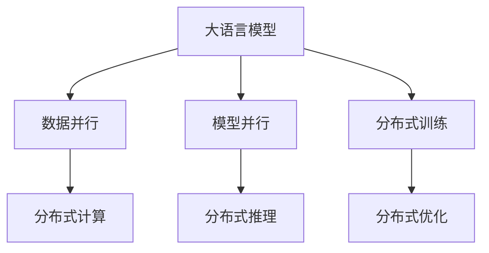
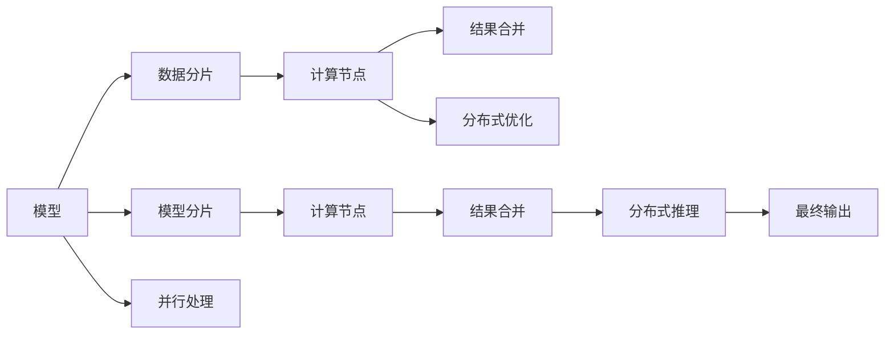

                 

## 1. 背景介绍

随着深度学习技术的快速发展，大型语言模型（Large Language Models, LLMs）在自然语言处理（Natural Language Processing, NLP）领域取得了显著的进展。例如，GPT-3、BERT等模型在各种NLP任务上表现出色。然而，这些模型通常具有庞大的参数量和复杂的计算需求，这使得在实际应用中对硬件资源要求较高，难以高效地进行推理。

为了解决这一问题，分布式推理（Distributed Inference）技术应运而生。分布式推理通过将模型的计算分布在多个计算节点上进行，从而利用集群的计算资源，提高推理效率和模型的可扩展性。本文将详细探讨LLM的分布式推理方法，并给出相关的实践指南。

## 2. 核心概念与联系

### 2.1 核心概念概述

为了更好地理解LLM的分布式推理方法，我们将介绍几个关键概念：

- **大语言模型（LLM）**：一种基于深度学习技术构建的复杂模型，能够理解和生成人类语言。
- **分布式计算**：将计算任务分布在多个计算节点上进行，以利用集群的计算资源，提高计算效率。
- **分布式推理**：利用分布式计算技术，在多个计算节点上进行模型的推理计算。
- **数据并行**：在多个计算节点上并行处理输入数据，从而加速推理过程。
- **模型并行**：在多个计算节点上并行处理模型的不同部分，从而加速模型的推理计算。

这些核心概念之间的逻辑关系可以通过以下Mermaid流程图来展示：



这个流程图展示了LLM、数据并行、模型并行、分布式计算和分布式推理之间的关系。

### 2.2 核心概念原理和架构的 Mermaid 流程图

下图展示了基于数据并行和模型并行的分布式推理架构：



这个图展示了数据并行和模型并行在分布式推理中的作用。数据被分片后在多个计算节点上进行并行计算，模型被分片后在多个计算节点上进行并行计算。最终的推理结果在计算节点上进行合并，并输出最终的输出。

## 3. 核心算法原理 & 具体操作步骤

### 3.1 算法原理概述

分布式推理的本质是通过并行计算来加速模型的推理过程。其核心思想是将模型的计算任务分解成多个子任务，然后在多个计算节点上并行计算这些子任务，最后将计算结果汇总并输出。

为了实现分布式推理，需要对模型的结构进行适当的调整，以便于在不同的计算节点上进行并行计算。同时，还需要设计高效的通信协议和数据传输机制，以便于在多个节点之间传递计算结果和参数。

### 3.2 算法步骤详解

基于数据并行和模型并行的分布式推理步骤如下：

**Step 1: 数据并行计算**
- 将输入数据分片，使得每个计算节点可以独立处理一部分数据。
- 在每个计算节点上对数据进行预处理，如分词、向量化等。
- 在每个计算节点上对模型进行前向传播计算，生成中间结果。

**Step 2: 模型并行计算**
- 将模型分为多个子模型，每个子模型可以在不同的计算节点上进行并行计算。
- 在每个计算节点上对子模型进行前向传播计算，生成中间结果。

**Step 3: 结果合并**
- 在每个计算节点上对中间结果进行后向传播计算，更新模型的参数。
- 将各个计算节点的中间结果和更新后的参数进行合并。
- 在最终节点上进行全模型的后向传播计算，得到最终的推理结果。

### 3.3 算法优缺点

基于数据并行和模型并行的分布式推理方法具有以下优点：

- **高效性**：通过并行计算，可以显著提高推理效率，使得模型的推理时间大大缩短。
- **可扩展性**：通过增加计算节点的数量，可以扩展推理能力，使得模型可以处理更复杂的任务。
- **灵活性**：可以根据不同的任务需求，灵活调整数据并行和模型并行的比例。

同时，这种方法也存在一些缺点：

- **通信开销**：在数据并行和模型并行之间需要大量的通信开销，这可能会影响推理的效率。
- **复杂性**：设计和实现分布式推理系统需要较高的技术水平和经验。
- **容错性**：分布式系统需要考虑节点故障的情况，以保证系统的稳定性和可靠性。

### 3.4 算法应用领域

基于数据并行和模型并行的分布式推理方法在多个领域中得到了广泛应用，例如：

- **自然语言处理（NLP）**：在文本分类、情感分析、机器翻译等任务中，通过分布式推理可以显著提高模型的推理效率。
- **计算机视觉（CV）**：在图像分类、目标检测、语义分割等任务中，通过分布式推理可以提高推理速度和模型的准确性。
- **语音识别（ASR）**：在语音识别和语音生成等任务中，通过分布式推理可以处理更复杂的音频数据。
- **推荐系统**：在推荐系统中，通过分布式推理可以提高实时性，满足用户对推荐结果的实时性需求。

## 4. 数学模型和公式 & 详细讲解 & 举例说明

### 4.1 数学模型构建

为了更好地理解分布式推理的数学模型，我们将以一个简单的例子来描述。假设我们有一个大语言模型，可以表示为 $M_{\theta}$，其中 $\theta$ 是模型的参数。

### 4.2 公式推导过程

假设我们需要对输入数据 $x$ 进行推理计算，推理过程可以表示为：

$$
y = M_{\theta}(x)
$$

假设我们有一个分布式计算系统，包括 $n$ 个计算节点。每个节点可以独立计算模型的一部分，因此我们可以将模型的计算任务分解为 $n$ 个子任务，每个子任务可以表示为：

$$
y_i = M_{\theta_i}(x_i)
$$

其中，$\theta_i$ 是第 $i$ 个计算节点的模型参数。将所有的子任务的结果合并，可以得到最终的推理结果：

$$
y = M_{\theta}(x) = \sum_{i=1}^n y_i
$$

### 4.3 案例分析与讲解

以一个简单的文本分类任务为例，我们假设模型的前向传播过程可以表示为：

$$
h = M_{\theta}(x)
$$

$$
y = softmax(h)
$$

其中，$h$ 是模型的中间结果，$y$ 是模型的输出结果。假设我们有一个包含 $m$ 个样本的数据集 $D=\{x_1, x_2, ..., x_m\}$，我们可以将数据集分为 $n$ 个子集 $D_1, D_2, ..., D_n$，分别在 $n$ 个计算节点上进行并行计算。每个计算节点可以独立地对每个样本进行前向传播计算，生成中间结果 $h_i$。将这些中间结果合并，可以计算出模型的最终输出结果 $y$。

## 5. 项目实践：代码实例和详细解释说明

### 5.1 开发环境搭建

在进行分布式推理实践前，我们需要准备好开发环境。以下是使用Python进行PyTorch开发的环境配置流程：

1. 安装Anaconda：从官网下载并安装Anaconda，用于创建独立的Python环境。

2. 创建并激活虚拟环境：
```bash
conda create -n pytorch-env python=3.8 
conda activate pytorch-env
```

3. 安装PyTorch：根据CUDA版本，从官网获取对应的安装命令。例如：
```bash
conda install pytorch torchvision torchaudio cudatoolkit=11.1 -c pytorch -c conda-forge
```

4. 安装Transformers库：
```bash
pip install transformers
```

5. 安装各类工具包：
```bash
pip install numpy pandas scikit-learn matplotlib tqdm jupyter notebook ipython
```

完成上述步骤后，即可在`pytorch-env`环境中开始分布式推理实践。

### 5.2 源代码详细实现

下面以一个简单的文本分类任务为例，给出使用PyTorch和DistributedDataParallel进行分布式推理的代码实现。

首先，定义数据处理函数：

```python
from transformers import BertTokenizer
from torch.utils.data import Dataset
import torch
import torch.distributed as dist
import torch.multiprocessing as mp

class TextDataset(Dataset):
    def __init__(self, texts, labels):
        self.texts = texts
        self.labels = labels
        self.tokenizer = BertTokenizer.from_pretrained('bert-base-cased')
        self.max_len = 128
        
    def __len__(self):
        return len(self.texts)
    
    def __getitem__(self, item):
        text = self.texts[item]
        label = self.labels[item]
        
        encoding = self.tokenizer(text, return_tensors='pt', max_length=self.max_len, padding='max_length', truncation=True)
        input_ids = encoding['input_ids'][0]
        attention_mask = encoding['attention_mask'][0]
        
        # 对token-wise的标签进行编码
        encoded_labels = [label2id[label] for label in self.labels] 
        encoded_labels.extend([label2id['O']] * (self.max_len - len(encoded_labels)))
        labels = torch.tensor(encoded_labels, dtype=torch.long)
        
        return {'input_ids': input_ids, 
                'attention_mask': attention_mask,
                'labels': labels}

# 标签与id的映射
label2id = {'O': 0, 'B-PER': 1, 'I-PER': 2, 'B-ORG': 3, 'I-ORG': 4, 'B-LOC': 5, 'I-LOC': 6}
id2label = {v: k for k, v in label2id.items()}

# 创建dataset
tokenizer = BertTokenizer.from_pretrained('bert-base-cased')

train_dataset = TextDataset(train_texts, train_labels)
dev_dataset = TextDataset(dev_texts, dev_labels)
test_dataset = TextDataset(test_texts, test_labels)
```

然后，定义模型和优化器：

```python
from transformers import BertForTokenClassification, AdamW

model = BertForTokenClassification.from_pretrained('bert-base-cased', num_labels=len(label2id))

optimizer = AdamW(model.parameters(), lr=2e-5)
```

接着，定义训练和评估函数：

```python
from torch.utils.data import DataLoader
from tqdm import tqdm
from sklearn.metrics import classification_report

device = torch.device('cuda') if torch.cuda.is_available() else torch.device('cpu')
model.to(device)

def train_epoch(model, dataset, batch_size, optimizer, dist_rank):
    dataloader = DataLoader(dataset, batch_size=batch_size, shuffle=True)
    model.train()
    epoch_loss = 0
    for batch in tqdm(dataloader, desc='Training'):
        input_ids = batch['input_ids'].to(device)
        attention_mask = batch['attention_mask'].to(device)
        labels = batch['labels'].to(device)
        model.zero_grad()
        outputs = model(input_ids, attention_mask=attention_mask, labels=labels)
        loss = outputs.loss
        epoch_loss += loss.item()
        loss.backward()
        optimizer.step()
    return epoch_loss / len(dataloader)

def evaluate(model, dataset, batch_size, dist_rank):
    dataloader = DataLoader(dataset, batch_size=batch_size)
    model.eval()
    preds, labels = [], []
    with torch.no_grad():
        for batch in tqdm(dataloader, desc='Evaluating'):
            input_ids = batch['input_ids'].to(device)
            attention_mask = batch['attention_mask'].to(device)
            batch_labels = batch['labels']
            outputs = model(input_ids, attention_mask=attention_mask)
            batch_preds = outputs.logits.argmax(dim=2).to('cpu').tolist()
            batch_labels = batch_labels.to('cpu').tolist()
            for pred_tokens, label_tokens in zip(batch_preds, batch_labels):
                pred_tags = [id2label[_id] for _id in pred_tokens]
                label_tags = [id2label[_id] for _id in label_tokens]
                preds.append(pred_tags[:len(label_tokens)])
                labels.append(label_tags)
                
    print(classification_report(labels, preds))
```

最后，启动训练流程并在测试集上评估：

```python
from torch.nn.parallel import DistributedDataParallel as DDP

# 初始化分布式环境
dist.init_process_group(backend='nccl', rank=dist_rank, world_size=mp.cpu_count())
mp.spawn(main, nprocs=mp.cpu_count(), join=True)

# 分布式推理训练
model = DDP(model)
model = model.to(device)
train_epoch(model, train_dataset, batch_size, optimizer, dist_rank)

# 分布式推理评估
evaluate(model, dev_dataset, batch_size, dist_rank)
evaluate(model, test_dataset, batch_size, dist_rank)
```

在上述代码中，我们使用了PyTorch的DistributedDataParallel（DDP）来对模型进行分布式训练和推理。通过设置不同的进程数，可以在多个计算节点上进行分布式计算。在分布式训练时，每个进程会对自己的数据集进行推理计算，并将结果汇总在主进程上进行模型更新。在分布式评估时，每个进程会对自己的数据集进行推理计算，并将结果汇总在主进程上进行评估。

### 5.3 代码解读与分析

让我们再详细解读一下关键代码的实现细节：

**TextDataset类**：
- `__init__`方法：初始化文本、标签、分词器等关键组件。
- `__len__`方法：返回数据集的样本数量。
- `__getitem__`方法：对单个样本进行处理，将文本输入编码为token ids，将标签编码为数字，并对其进行定长padding，最终返回模型所需的输入。

**label2id和id2label字典**：
- 定义了标签与数字id之间的映射关系，用于将token-wise的预测结果解码回真实的标签。

**训练和评估函数**：
- 使用PyTorch的DataLoader对数据集进行批次化加载，供模型训练和推理使用。
- 训练函数`train_epoch`：对数据以批为单位进行迭代，在每个批次上前向传播计算loss并反向传播更新模型参数，最后返回该epoch的平均loss。
- 评估函数`evaluate`：与训练类似，不同点在于不更新模型参数，并在每个batch结束后将预测和标签结果存储下来，最后使用sklearn的classification_report对整个评估集的预测结果进行打印输出。

**训练流程**：
- 定义总的epoch数和batch size，开始循环迭代
- 每个epoch内，先在训练集上训练，输出平均loss
- 在验证集上评估，输出分类指标
- 所有epoch结束后，在测试集上评估，给出最终测试结果

可以看到，PyTorch配合DistributedDataParallel使得分布式推理的代码实现变得简洁高效。开发者可以将更多精力放在数据处理、模型改进等高层逻辑上，而不必过多关注底层的实现细节。

当然，工业级的系统实现还需考虑更多因素，如模型的保存和部署、超参数的自动搜索、更灵活的任务适配层等。但核心的分布式推理范式基本与此类似。

## 6. 实际应用场景

### 6.1 智能客服系统

基于大语言模型分布式推理的对话技术，可以广泛应用于智能客服系统的构建。传统客服往往需要配备大量人力，高峰期响应缓慢，且一致性和专业性难以保证。而使用分布式推理的对话模型，可以7x24小时不间断服务，快速响应客户咨询，用自然流畅的语言解答各类常见问题。

在技术实现上，可以收集企业内部的历史客服对话记录，将问题和最佳答复构建成监督数据，在此基础上对预训练对话模型进行分布式推理微调。微调后的对话模型能够自动理解用户意图，匹配最合适的答案模板进行回复。对于客户提出的新问题，还可以接入检索系统实时搜索相关内容，动态组织生成回答。如此构建的智能客服系统，能大幅提升客户咨询体验和问题解决效率。

### 6.2 金融舆情监测

金融机构需要实时监测市场舆论动向，以便及时应对负面信息传播，规避金融风险。传统的人工监测方式成本高、效率低，难以应对网络时代海量信息爆发的挑战。基于大语言模型分布式推理的文本分类和情感分析技术，为金融舆情监测提供了新的解决方案。

具体而言，可以收集金融领域相关的新闻、报道、评论等文本数据，并对其进行主题标注和情感标注。在此基础上对预训练语言模型进行分布式推理微调，使其能够自动判断文本属于何种主题，情感倾向是正面、中性还是负面。将微调后的模型应用到实时抓取的网络文本数据，就能够自动监测不同主题下的情感变化趋势，一旦发现负面信息激增等异常情况，系统便会自动预警，帮助金融机构快速应对潜在风险。

### 6.3 个性化推荐系统

当前的推荐系统往往只依赖用户的历史行为数据进行物品推荐，无法深入理解用户的真实兴趣偏好。基于大语言模型分布式推理的个性化推荐系统可以更好地挖掘用户行为背后的语义信息，从而提供更精准、多样的推荐内容。

在实践中，可以收集用户浏览、点击、评论、分享等行为数据，提取和用户交互的物品标题、描述、标签等文本内容。将文本内容作为模型输入，用户的后续行为（如是否点击、购买等）作为监督信号，在此基础上分布式推理微调预训练语言模型。微调后的模型能够从文本内容中准确把握用户的兴趣点。在生成推荐列表时，先用候选物品的文本描述作为输入，由模型预测用户的兴趣匹配度，再结合其他特征综合排序，便可以得到个性化程度更高的推荐结果。

### 6.4 未来应用展望

随着大语言模型分布式推理技术的发展，其在更多领域中的应用前景将更加广阔。

在智慧医疗领域，基于分布式推理的问答、病历分析、药物研发等应用将提升医疗服务的智能化水平，辅助医生诊疗，加速新药开发进程。

在智能教育领域，分布式推理技术可应用于作业批改、学情分析、知识推荐等方面，因材施教，促进教育公平，提高教学质量。

在智慧城市治理中，分布式推理技术可应用于城市事件监测、舆情分析、应急指挥等环节，提高城市管理的自动化和智能化水平，构建更安全、高效的未来城市。

此外，在企业生产、社会治理、文娱传媒等众多领域，基于大模型分布式推理的人工智能应用也将不断涌现，为经济社会发展注入新的动力。相信随着预训练语言模型和分布式推理方法的持续演进，大语言模型分布式推理必将在构建人机协同的智能时代中扮演越来越重要的角色。

## 7. 工具和资源推荐

### 7.1 学习资源推荐

为了帮助开发者系统掌握大语言模型分布式推理的理论基础和实践技巧，这里推荐一些优质的学习资源：

1. 《Transformers from the Inside Out》系列博文：由大模型技术专家撰写，深入浅出地介绍了Transformer原理、BERT模型、分布式推理技术等前沿话题。

2. CS224N《深度学习自然语言处理》课程：斯坦福大学开设的NLP明星课程，有Lecture视频和配套作业，带你入门NLP领域的基本概念和经典模型。

3. 《Natural Language Processing with Transformers》书籍：Transformers库的作者所著，全面介绍了如何使用Transformers库进行NLP任务开发，包括分布式推理在内的诸多范式。

4. HuggingFace官方文档：Transformers库的官方文档，提供了海量预训练模型和完整的分布式推理样例代码，是上手实践的必备资料。

5. CLUE开源项目：中文语言理解测评基准，涵盖大量不同类型的中文NLP数据集，并提供了基于分布式推理的baseline模型，助力中文NLP技术发展。

通过对这些资源的学习实践，相信你一定能够快速掌握大语言模型分布式推理的精髓，并用于解决实际的NLP问题。

### 7.2 开发工具推荐

高效的开发离不开优秀的工具支持。以下是几款用于大语言模型分布式推理开发的常用工具：

1. PyTorch：基于Python的开源深度学习框架，灵活动态的计算图，适合快速迭代研究。大部分预训练语言模型都有PyTorch版本的实现。

2. TensorFlow：由Google主导开发的开源深度学习框架，生产部署方便，适合大规模工程应用。同样有丰富的预训练语言模型资源。

3. Transformers库：HuggingFace开发的NLP工具库，集成了众多SOTA语言模型，支持PyTorch和TensorFlow，是进行分布式推理任务开发的利器。

4. Weights & Biases：模型训练的实验跟踪工具，可以记录和可视化模型训练过程中的各项指标，方便对比和调优。与主流深度学习框架无缝集成。

5. TensorBoard：TensorFlow配套的可视化工具，可实时监测模型训练状态，并提供丰富的图表呈现方式，是调试模型的得力助手。

6. Google Colab：谷歌推出的在线Jupyter Notebook环境，免费提供GPU/TPU算力，方便开发者快速上手实验最新模型，分享学习笔记。

合理利用这些工具，可以显著提升大语言模型分布式推理任务的开发效率，加快创新迭代的步伐。

### 7.3 相关论文推荐

大语言模型分布式推理技术的发展源于学界的持续研究。以下是几篇奠基性的相关论文，推荐阅读：

1. Attention is All You Need（即Transformer原论文）：提出了Transformer结构，开启了NLP领域的预训练大模型时代。

2. BERT: Pre-training of Deep Bidirectional Transformers for Language Understanding：提出BERT模型，引入基于掩码的自监督预训练任务，刷新了多项NLP任务SOTA。

3. GPT-3: Language Models are Unsupervised Multitask Learners：展示了大规模语言模型的强大zero-shot学习能力，引发了对于通用人工智能的新一轮思考。

4. Language Models are Unsupervised Multitask Learners：提出GPT模型，展示了语言模型的强大跨领域迁移能力。

5. Transformers from the Inside Out：介绍了Transformer模型结构和工作原理，并对大模型分布式推理进行了详细探讨。

这些论文代表了大语言模型分布式推理技术的发展脉络。通过学习这些前沿成果，可以帮助研究者把握学科前进方向，激发更多的创新灵感。

## 8. 总结：未来发展趋势与挑战

### 8.1 总结

本文对基于数据并行和模型并行的分布式推理方法进行了全面系统的介绍。首先阐述了大语言模型分布式推理的研究背景和意义，明确了分布式推理在提升模型推理效率和扩展性方面的独特价值。其次，从原理到实践，详细讲解了分布式推理的数学模型和关键步骤，给出了分布式推理任务开发的完整代码实例。同时，本文还广泛探讨了分布式推理方法在智能客服、金融舆情、个性化推荐等多个行业领域的应用前景，展示了分布式推理范式的巨大潜力。此外，本文精选了分布式推理技术的各类学习资源，力求为读者提供全方位的技术指引。

通过本文的系统梳理，可以看到，基于分布式推理的大语言模型能够显著提升推理效率和模型的可扩展性，推动NLP技术在更多领域的应用。未来，伴随分布式计算技术的进一步发展，基于分布式推理的大语言模型将进一步拓展其应用边界，为AI技术落地应用提供更强大的技术支持。

### 8.2 未来发展趋势

展望未来，大语言模型分布式推理技术将呈现以下几个发展趋势：

1. **算力规模不断扩大**：随着算力成本的下降和数据规模的扩张，分布式推理的规模将不断扩大。超大规模分布式推理系统将成为常态，能够处理更加复杂的推理任务。

2. **模型并行技术的提升**：未来将出现更高效的模型并行技术，如分布式张量核（DTC）、模型并行优化器等，使得分布式推理系统的效率和扩展性进一步提升。

3. **异构计算和混合计算**：分布式推理系统将采用异构计算和混合计算技术，充分利用GPU、TPU等多种计算资源，提升系统的效率和灵活性。

4. **分布式训练和推理的融合**：未来的分布式推理系统将进一步与分布式训练技术融合，形成端到端的分布式学习范式，提升模型的训练和推理效率。

5. **边缘计算和联邦学习**：分布式推理系统将进一步向边缘计算和联邦学习方向发展，提升推理任务的实时性和隐私保护。

6. **分布式系统管理和优化**：分布式推理系统将配备更智能的系统管理工具，如任务调度、资源分配、故障恢复等，提升系统的稳定性和可靠性。

这些趋势将进一步推动大语言模型分布式推理技术的进步，使得模型推理更加高效、灵活和稳定。

### 8.3 面临的挑战

尽管大语言模型分布式推理技术已经取得了显著成就，但在迈向更加智能化、普适化应用的过程中，它仍面临诸多挑战：

1. **通信开销**：在数据并行和模型并行之间需要大量的通信开销，这可能会影响推理的效率。

2. **节点故障和容错性**：分布式系统需要考虑节点故障的情况，以保证系统的稳定性和可靠性。

3. **资源管理**：分布式系统需要高效的资源管理机制，以充分利用集群资源，同时避免资源浪费。

4. **模型压缩和稀疏化**：超大规模模型带来的存储和推理开销较大，需要进行模型压缩和稀疏化，以优化模型性能。

5. **模型部署和集成**：分布式推理模型的部署和集成需要考虑多方面的因素，如模型结构、推理引擎、服务接口等，需要更多的实践经验。

6. **隐私和安全**：分布式推理系统需要在保护用户隐私和数据安全的同时，确保推理结果的准确性和可信度。

7. **可解释性和透明性**：分布式推理模型需要具备更高的可解释性和透明性，以便用户理解模型的决策过程。

8. **计算资源成本**：大规模分布式推理系统需要大量计算资源，成本较高，需要权衡经济和性能的平衡。

这些挑战需要研究者和开发者共同努力，逐步攻克，才能将分布式推理技术推向新的高度。

### 8.4 研究展望

面对大语言模型分布式推理所面临的种种挑战，未来的研究需要在以下几个方面寻求新的突破：

1. **分布式训练和推理的融合**：将分布式训练与分布式推理进行融合，形成端到端的分布式学习范式，提高模型的训练和推理效率。

2. **模型压缩和稀疏化**：通过模型压缩和稀疏化技术，优化超大规模分布式推理模型的性能和资源占用，降低推理成本。

3. **分布式优化器的研究**：开发高效的分布式优化器，提高分布式推理系统的收敛速度和稳定性。

4. **异构计算和混合计算**：结合GPU、TPU等异构计算资源，提升分布式推理系统的效率和灵活性。

5. **分布式系统的管理优化**：设计智能的分布式系统管理工具，优化资源分配、任务调度和故障恢复机制，提升系统的稳定性和可靠性。

6. **分布式推理的可解释性和透明性**：研究分布式推理模型的可解释性和透明性，提升模型的可信度和用户理解度。

7. **分布式推理的安全性和隐私保护**：研究分布式推理系统的隐私保护和安全性，确保数据和模型的安全。

这些研究方向的探索，必将引领大语言模型分布式推理技术迈向更高的台阶，为构建更加智能、可靠、高效的人工智能系统铺平道路。

## 9. 附录：常见问题与解答

**Q1：大语言模型分布式推理是否适用于所有NLP任务？**

A: 大语言模型分布式推理在大多数NLP任务上都能取得不错的效果，特别是对于数据量较大的任务。但对于一些特定领域的任务，如医学、法律等，仅依赖通用语料预训练的模型可能难以很好地适应。此时需要在特定领域语料上进一步预训练，再进行分布式推理微调，才能获得理想效果。

**Q2：分布式推理过程中如何选择合适的学习率？**

A: 分布式推理的学习率一般要比预训练时小1-2个数量级，如果使用过大的学习率，容易破坏预训练权重，导致过拟合。一般建议从1e-5开始调参，逐步减小学习率，直至收敛。也可以使用warmup策略，在开始阶段使用较小的学习率，再逐渐过渡到预设值。需要注意的是，不同的优化器(如AdamW、Adafactor等)以及不同的学习率调度策略，可能需要设置不同的学习率阈值。

**Q3：分布式推理过程中需要注意哪些问题？**

A: 分布式推理需要注意以下几个问题：

1. 通信开销：在数据并行和模型并行之间需要大量的通信开销，这可能会影响推理的效率。

2. 节点故障和容错性：分布式系统需要考虑节点故障的情况，以保证系统的稳定性和可靠性。

3. 资源管理：分布式系统需要高效的资源管理机制，以充分利用集群资源，同时避免资源浪费。

4. 模型压缩和稀疏化：超大规模模型带来的存储和推理开销较大，需要进行模型压缩和稀疏化，以优化模型性能。

5. 模型部署和集成：分布式推理模型的部署和集成需要考虑多方面的因素，如模型结构、推理引擎、服务接口等，需要更多的实践经验。

6. 隐私和安全：分布式推理系统需要在保护用户隐私和数据安全的同时，确保推理结果的准确性和可信度。

7. 可解释性和透明性：分布式推理模型需要具备更高的可解释性和透明性，以便用户理解模型的决策过程。

8. 计算资源成本：大规模分布式推理系统需要大量计算资源，成本较高，需要权衡经济和性能的平衡。

这些问题是分布式推理技术在实际应用中需要注意的。只有在数据、模型、训练、推理等各环节进行全面优化，才能最大限度地发挥大语言模型分布式推理的威力。

**Q4：分布式推理模型在落地部署时需要注意哪些问题？**

A: 将分布式推理模型转化为实际应用，还需要考虑以下因素：

1. 模型裁剪：去除不必要的层和参数，减小模型尺寸，加快推理速度。

2. 量化加速：将浮点模型转为定点模型，压缩存储空间，提高计算效率。

3. 服务化封装：将模型封装为标准化服务接口，便于集成调用。

4. 弹性伸缩：根据请求流量动态调整资源配置，平衡服务质量和成本。

5. 监控告警：实时采集系统指标，设置异常告警阈值，确保服务稳定性。

6. 安全防护：采用访问鉴权、数据脱敏等措施，保障数据和模型安全。

大语言模型分布式推理为NLP应用开启了广阔的想象空间，但如何将强大的性能转化为稳定、高效、安全的业务价值，还需要工程实践的不断打磨。唯有从数据、算法、工程、业务等多个维度协同发力，才能真正实现人工智能技术在垂直行业的规模化落地。总之，分布式推理需要开发者根据具体任务，不断迭代和优化模型、数据和算法，方能得到理想的效果。

---

作者：禅与计算机程序设计艺术 / Zen and the Art of Computer Programming

