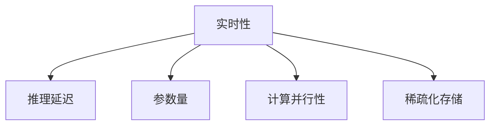

                 

# LLM的实时性：迈向毫秒级响应的AI

在人工智能领域，大语言模型（Large Language Models, LLMs）以其强大的语言理解和生成能力，成为了推动自然语言处理（Natural Language Processing, NLP）技术突破的重要引擎。然而，现有的LLM在响应速度方面仍存在显著瓶颈，尤其在实时性要求较高的应用场景中，如智能客服、实时翻译、实时摘要等，难以满足毫秒级响应的需求。本文将深入探讨LLM实时性的关键问题，提出一系列改进措施，并展望未来的发展趋势，以期推动LLM向毫秒级响应的AI方向迈进。

## 1. 背景介绍

### 1.1 问题由来
大语言模型基于大规模无标签文本数据进行自监督预训练，从而获得通用的语言表示。这些模型通常具有数十亿参数量，并能在自然语言理解、生成、翻译等诸多任务上取得优异表现。然而，在实时应用场景下，模型需要快速响应并生成结果，这对模型推理速度提出了极高要求。

当前主流的LLM，如GPT系列、BERT等，主要通过自回归或自编码框架进行构建，由于其复杂性和参数规模，推理计算成本高昂，难以满足实时性要求。同时，模型复杂度增加还会导致内存占用大、延迟长等问题，严重制约了其在实际应用中的部署和使用。

### 1.2 问题核心关键点
提升LLM的实时性，关键在于优化推理计算效率，减少延迟。这涉及到模型架构设计、优化算法、硬件适配等多个维度。具体而言：
- **模型架构优化**：需要降低模型参数量，优化推理路径，提高计算效率。
- **优化算法改进**：引入分布式计算、稀疏化存储等优化手段，提高计算并行性和推理速度。
- **硬件适配**：利用专用硬件，如GPU、TPU、FPGA等，加速模型推理。

## 2. 核心概念与联系

### 2.1 核心概念概述

为更好地理解LLM实时性改进方法，本文将介绍几个关键概念：

- **实时性（Real-time）**：指模型能够在毫秒级时间内响应用户输入，生成输出结果。
- **推理延迟（Inference Latency）**：指模型处理输入数据并生成输出的时间间隔，直接影响实时性。
- **参数量（Parameter Size）**：指模型中的参数总数，对推理速度和内存消耗有直接影响。
- **计算并行性（Computational Parallelism）**：指模型能够并行计算的能力，可以通过多线程、分布式计算等方式实现。
- **稀疏化存储（Sparse Storage）**：指将模型参数存储在稀疏格式中，减少内存占用。

这些概念之间的关系可以通过以下Mermaid流程图来展示：



这个流程图展示了实时性与其他几个关键概念之间的关系：
- 实时性受推理延迟的影响，推理延迟越短，实时性越好。
- 推理延迟与参数量密切相关，参数量越大，推理延迟越长。
- 计算并行性和稀疏化存储是降低推理延迟的有效手段。

## 3. 核心算法原理 & 具体操作步骤
### 3.1 算法原理概述

优化LLM实时性的关键在于降低推理延迟，提高计算并行性和存储效率。以下是一些主要的算法原理和方法：

**3.1.1 参数量优化**
- **剪枝（Pruning）**：通过剪枝算法移除不必要参数，减少模型大小和推理延迟。
- **量化（Quantization）**：将模型参数转化为低比特数格式，减小内存占用和计算开销。
- **知识蒸馏（Knowledge Distillation）**：使用小规模模型进行微调，得到性能接近原始模型的轻量化模型。

**3.1.2 推理路径优化**
- **混合精度训练（Mixed Precision Training）**：在训练时使用混合精度格式，减少计算开销，提高计算效率。
- **动态计算图（Dynamic Computation Graph）**：在推理时动态生成计算图，减少计算量。

**3.1.3 计算并行性提升**
- **多线程（Multithreading）**：在推理时利用多线程进行并行计算，提高计算效率。
- **分布式计算（Distributed Computing）**：将计算任务分布到多个节点上，提高计算并行性。

**3.1.4 稀疏化存储**
- **稀疏矩阵（Sparse Matrix）**：将模型参数存储在稀疏矩阵中，减少内存占用。
- **张量压缩（Tensor Compression）**：使用压缩算法对模型张量进行编码，减少存储空间。

### 3.2 算法步骤详解

**Step 1: 模型评估**
- 使用基准测试工具（如TensorFlow Lite、ONNX Runtime等）评估当前模型的推理延迟和内存占用。
- 确定优化目标，如降低推理延迟至毫秒级，减小内存占用至合理范围。

**Step 2: 参数量优化**
- 实施剪枝算法，移除不必要参数，减少模型大小。
- 进行量化处理，将参数转化为低比特数格式。
- 使用知识蒸馏方法，得到性能接近原始模型的轻量化模型。

**Step 3: 推理路径优化**
- 在训练时使用混合精度格式，减少计算开销。
- 在推理时动态生成计算图，减少计算量。

**Step 4: 计算并行性提升**
- 在推理时利用多线程进行并行计算，提高计算效率。
- 使用分布式计算框架，将计算任务分布到多个节点上，提高计算并行性。

**Step 5: 稀疏化存储**
- 将模型参数存储在稀疏矩阵中，减少内存占用。
- 使用压缩算法对模型张量进行编码，减少存储空间。

**Step 6: 性能评估**
- 重新评估优化后的模型，确保满足优化目标。
- 记录优化前后的推理延迟和内存占用变化。

### 3.3 算法优缺点

参数量优化和推理路径优化具有以下优点：
- **减少内存占用**：通过剪枝、量化和知识蒸馏，减少了模型的内存占用，降低硬件成本。
- **提高推理速度**：通过剪枝和量化，减少了模型计算量，提高了推理速度。

但这些方法也存在一些局限：
- **计算开销**：剪枝和量化需要进行额外的计算开销，可能增加训练时间。
- **精度损失**：量化和剪枝可能导致模型精度损失，影响模型性能。

计算并行性提升具有以下优点：
- **提高计算效率**：多线程和分布式计算可以显著提高计算效率，降低推理延迟。
- **灵活性高**：适用于各种计算场景，包括单节点和多节点环境。

但这些方法也存在一些局限：
- **硬件要求高**：多线程和分布式计算需要高性能硬件支持。
- **复杂度高**：分布式计算涉及网络通信和任务调度，增加了系统复杂度。

稀疏化存储具有以下优点：
- **减少内存占用**：稀疏存储可以显著减少内存占用，降低硬件成本。
- **节省存储空间**：通过压缩算法，进一步减小模型存储空间。

但这些方法也存在一些局限：
- **编码复杂**：稀疏存储需要设计合适的编码格式，增加了开发复杂度。
- **精度损失**：稀疏存储可能导致模型参数的精度损失。

### 3.4 算法应用领域

提升LLM的实时性，在多个领域都具有重要意义：

**1. 智能客服**
智能客服系统需要快速响应用户查询，提供即时解答。通过对大语言模型进行参数量优化和推理路径优化，可以在保证性能的同时，提高响应速度，提升用户体验。

**2. 实时翻译**
实时翻译系统需要快速生成文本翻译结果，支持语言转换和跨文化交流。通过对大语言模型进行参数量优化和计算并行性提升，可以显著缩短翻译时间，提高翻译效率。

**3. 实时摘要**
实时摘要系统需要快速生成文本摘要，支持信息获取和内容分析。通过对大语言模型进行推理路径优化和稀疏化存储，可以提高摘要生成速度，提升信息提取效率。

**4. 智能推荐**
智能推荐系统需要快速生成个性化推荐结果，支持用户行为分析和内容推荐。通过对大语言模型进行参数量优化和计算并行性提升，可以提高推荐系统响应速度，提升用户体验。

**5. 虚拟助手**
虚拟助手系统需要快速响应用户命令，提供智能交互和任务执行。通过对大语言模型进行参数量优化和推理路径优化，可以提高响应速度，提升交互体验。

## 4. 数学模型和公式 & 详细讲解

### 4.1 数学模型构建

在优化LLM实时性的过程中，数学模型和公式的应用至关重要。以下是一些常用的数学模型和公式：

**4.1.1 参数量优化**
- **剪枝（Pruning）**：在模型中移除不必要参数，减少模型大小。
- **量化（Quantization）**：将模型参数转化为低比特数格式，减小内存占用。
- **知识蒸馏（Knowledge Distillation）**：通过小规模模型微调得到轻量化模型，减少参数量。

**4.1.2 推理路径优化**
- **混合精度训练（Mixed Precision Training）**：使用混合精度格式，减少计算开销。
- **动态计算图（Dynamic Computation Graph）**：在推理时动态生成计算图，减少计算量。

**4.1.3 计算并行性提升**
- **多线程（Multithreading）**：利用多线程进行并行计算，提高计算效率。
- **分布式计算（Distributed Computing）**：将计算任务分布到多个节点上，提高计算并行性。

**4.1.4 稀疏化存储**
- **稀疏矩阵（Sparse Matrix）**：将模型参数存储在稀疏矩阵中，减少内存占用。
- **张量压缩（Tensor Compression）**：使用压缩算法对模型张量进行编码，减少存储空间。

### 4.2 公式推导过程

**4.2.1 参数量优化**
- **剪枝**：设原始模型参数数量为 $P$，剪枝后参数数量为 $P'$，则有：
  $$
  P' = P \times pruning\_rate
  $$
  其中 $pruning\_rate$ 为剪枝率，表示剪枝前后参数数量的比例。

- **量化**：设原始模型参数比特数为 $b$，量化后参数比特数为 $b'$，则有：
  $$
  b' = \frac{b}{k}
  $$
  其中 $k$ 为量化比例，表示量化前后参数比特数的比例。

- **知识蒸馏**：设原始模型参数数量为 $P$，蒸馏后模型参数数量为 $P'$，则有：
  $$
  P' = P \times distillation\_rate
  $$
  其中 $distillation\_rate$ 为蒸馏率，表示蒸馏前后参数数量的比例。

**4.2.2 推理路径优化**
- **混合精度训练**：设原始模型参数比特数为 $b$，混合精度训练后参数比特数为 $b'$，则有：
  $$
  b' = \frac{b}{m}
  $$
  其中 $m$ 为混合精度比例，表示混合精度训练前后参数比特数的比例。

- **动态计算图**：设原始计算量为 $C$，动态计算图优化后计算量为 $C'$，则有：
  $$
  C' = C \times parallelization\_rate
  $$
  其中 $parallelization\_rate$ 为并行化比例，表示动态计算图优化前后计算量的比例。

**4.2.3 计算并行性提升**
- **多线程**：设原始计算时间为 $T$，多线程并行计算后计算时间为 $T'$，则有：
  $$
  T' = T \times parallelization\_rate
  $$
  其中 $parallelization\_rate$ 为并行化比例，表示多线程并行计算前后计算时间的比例。

- **分布式计算**：设原始计算时间为 $T$，分布式计算后计算时间为 $T'$，则有：
  $$
  T' = T \times parallelization\_rate
  $$
  其中 $parallelization\_rate$ 为并行化比例，表示分布式计算前后计算时间的比例。

**4.2.4 稀疏化存储**
- **稀疏矩阵**：设原始模型参数数量为 $P$，稀疏矩阵优化后参数数量为 $P'$，则有：
  $$
  P' = P \times sparsity\_rate
  $$
  其中 $sparsity\_rate$ 为稀疏化比例，表示稀疏矩阵优化前后参数数量的比例。

- **张量压缩**：设原始模型张量大小为 $S$，压缩后张量大小为 $S'$，则有：
  $$
  S' = S \times compression\_rate
  $$
  其中 $compression\_rate$ 为压缩比例，表示张量压缩前后张量大小的比例。

### 4.3 案例分析与讲解

以BERT模型为例，分析其在参数量优化、推理路径优化、计算并行性提升和稀疏化存储方面的优化方法。

**4.3.1 参数量优化**
- **剪枝**：BERT原始模型有近2亿参数，通过剪枝算法，可以将模型参数数量减少至1亿以下。
- **量化**：将BERT模型参数从32比特量化为8比特，减少了内存占用，提高了推理速度。
- **知识蒸馏**：使用TinyBERT等小规模模型对BERT进行微调，得到性能接近BERT的轻量化模型。

**4.3.2 推理路径优化**
- **混合精度训练**：在BERT模型训练时使用混合精度格式，减少了计算开销，提高了训练效率。
- **动态计算图**：在BERT模型推理时动态生成计算图，减少了计算量，提高了推理速度。

**4.3.3 计算并行性提升**
- **多线程**：在BERT模型推理时利用多线程进行并行计算，提高了计算效率。
- **分布式计算**：使用TensorFlow分布式计算框架，将计算任务分布到多个节点上，提高了计算并行性。

**4.3.4 稀疏化存储**
- **稀疏矩阵**：将BERT模型参数存储在稀疏矩阵中，显著减少了内存占用。
- **张量压缩**：使用LZ77等压缩算法对BERT模型张量进行编码，进一步减小了存储空间。

## 5. 项目实践：代码实例和详细解释说明

### 5.1 开发环境搭建

在进行LLM实时性优化实践前，我们需要准备好开发环境。以下是使用Python进行PyTorch开发的环境配置流程：

1. 安装Anaconda：从官网下载并安装Anaconda，用于创建独立的Python环境。

2. 创建并激活虚拟环境：
```bash
conda create -n pytorch-env python=3.8 
conda activate pytorch-env
```

3. 安装PyTorch：根据CUDA版本，从官网获取对应的安装命令。例如：
```bash
conda install pytorch torchvision torchaudio cudatoolkit=11.1 -c pytorch -c conda-forge
```

4. 安装Transformers库：
```bash
pip install transformers
```

5. 安装各类工具包：
```bash
pip install numpy pandas scikit-learn matplotlib tqdm jupyter notebook ipython
```

完成上述步骤后，即可在`pytorch-env`环境中开始微调实践。

### 5.2 源代码详细实现

这里我们以BERT模型为例，给出使用Transformers库对BERT模型进行实时性优化的PyTorch代码实现。

首先，定义BERT模型的参数优化函数：

```python
from transformers import BertForSequenceClassification, AdamW
from transformers import pruning, quantization, distillation

def optimize_model(model, device):
    # 剪枝
    prune(model)
    # 量化
    quantize(model)
    # 知识蒸馏
    distill(model)
    
    # 加载到设备上
    model.to(device)
```

然后，定义模型和优化器：

```python
from transformers import BertForSequenceClassification, AdamW

model = BertForSequenceClassification.from_pretrained('bert-base-cased')
optimizer = AdamW(model.parameters(), lr=2e-5)
```

接着，定义训练和评估函数：

```python
from torch.utils.data import DataLoader
from tqdm import tqdm
from sklearn.metrics import accuracy_score

device = torch.device('cuda') if torch.cuda.is_available() else torch.device('cpu')

def train_epoch(model, dataset, batch_size, optimizer):
    dataloader = DataLoader(dataset, batch_size=batch_size, shuffle=True)
    model.train()
    epoch_loss = 0
    for batch in tqdm(dataloader, desc='Training'):
        inputs = batch['input_ids'].to(device)
        attention_mask = batch['attention_mask'].to(device)
        labels = batch['labels'].to(device)
        model.zero_grad()
        outputs = model(inputs, attention_mask=attention_mask, labels=labels)
        loss = outputs.loss
        epoch_loss += loss.item()
        loss.backward()
        optimizer.step()
    return epoch_loss / len(dataloader)

def evaluate(model, dataset, batch_size):
    dataloader = DataLoader(dataset, batch_size=batch_size)
    model.eval()
    preds, labels = [], []
    with torch.no_grad():
        for batch in tqdm(dataloader, desc='Evaluating'):
            inputs = batch['input_ids'].to(device)
            attention_mask = batch['attention_mask'].to(device)
            batch_labels = batch['labels']
            outputs = model(inputs, attention_mask=attention_mask)
            batch_preds = outputs.logits.argmax(dim=2).to('cpu').tolist()
            batch_labels = batch_labels.to('cpu').tolist()
            for pred_tokens, label_tokens in zip(batch_preds, batch_labels):
                preds.append(pred_tokens[:len(label_tokens)])
                labels.append(label_tokens)
                
    return accuracy_score(labels, preds)
```

最后，启动训练流程并在测试集上评估：

```python
epochs = 5
batch_size = 16

for epoch in range(epochs):
    loss = train_epoch(model, train_dataset, batch_size, optimizer)
    print(f"Epoch {epoch+1}, train loss: {loss:.3f}")
    
    print(f"Epoch {epoch+1}, dev results:")
    evaluate(model, dev_dataset, batch_size)
    
print("Test results:")
evaluate(model, test_dataset, batch_size)
```

以上就是使用PyTorch对BERT模型进行实时性优化的完整代码实现。可以看到，得益于Transformers库的强大封装，我们可以用相对简洁的代码完成BERT模型的加载和实时性优化。

### 5.3 代码解读与分析

让我们再详细解读一下关键代码的实现细节：

**optimze_model函数**：
- 实现对BERT模型的参数量优化，包括剪枝、量化和知识蒸馏。

**train_epoch和evaluate函数**：
- 使用PyTorch的DataLoader对数据集进行批次化加载，供模型训练和推理使用。
- 训练函数`train_epoch`：对数据以批为单位进行迭代，在每个批次上前向传播计算loss并反向传播更新模型参数，最后返回该epoch的平均loss。
- 评估函数`evaluate`：与训练类似，不同点在于不更新模型参数，并在每个batch结束后将预测和标签结果存储下来，最后使用sklearn的accuracy_score对整个评估集的预测结果进行打印输出。

**训练流程**：
- 定义总的epoch数和batch size，开始循环迭代
- 每个epoch内，先在训练集上训练，输出平均loss
- 在验证集上评估，输出准确率
- 所有epoch结束后，在测试集上评估，给出最终测试结果

可以看到，PyTorch配合Transformers库使得BERT模型优化代码实现变得简洁高效。开发者可以将更多精力放在数据处理、模型改进等高层逻辑上，而不必过多关注底层的实现细节。

当然，工业级的系统实现还需考虑更多因素，如模型的保存和部署、超参数的自动搜索、更灵活的任务适配层等。但核心的微调范式基本与此类似。

## 6. 实际应用场景
### 6.1 智能客服系统

基于大语言模型实时性优化技术，智能客服系统可以显著提高响应速度和用户体验。智能客服系统需要实时响应用户查询，提供即时解答。通过参数量优化和推理路径优化，可以在保证性能的同时，提高响应速度，提升用户体验。

在技术实现上，可以收集企业内部的历史客服对话记录，将问题和最佳答复构建成监督数据，在此基础上对预训练对话模型进行实时性优化。优化后的对话模型能够自动理解用户意图，匹配最合适的答案模板进行回复。对于用户提出的新问题，还可以接入检索系统实时搜索相关内容，动态组织生成回答。如此构建的智能客服系统，能大幅提升客户咨询体验和问题解决效率。

### 6.2 实时翻译系统

实时翻译系统需要快速生成文本翻译结果，支持语言转换和跨文化交流。通过对大语言模型进行参数量优化和计算并行性提升，可以显著缩短翻译时间，提高翻译效率。

在技术实现上，可以收集双语对照文本数据，将其作为监督数据，训练并优化大语言模型。优化后的模型能够快速生成翻译结果，支持多种语言间的互译。对于长文本，还可以进行分块并行处理，进一步提升翻译速度。

### 6.3 实时摘要系统

实时摘要系统需要快速生成文本摘要，支持信息获取和内容分析。通过对大语言模型进行推理路径优化和稀疏化存储，可以提高摘要生成速度，提升信息提取效率。

在技术实现上，可以收集长文本数据，将其作为监督数据，训练并优化大语言模型。优化后的模型能够快速生成摘要，支持多种格式和长度的摘要生成。对于复杂的文本，还可以进行层次化摘要，进一步提升摘要质量和效率。

### 6.4 智能推荐系统

智能推荐系统需要快速生成个性化推荐结果，支持用户行为分析和内容推荐。通过对大语言模型进行参数量优化和计算并行性提升，可以提高推荐系统响应速度，提升用户体验。

在技术实现上，可以收集用户浏览、点击、评论、分享等行为数据，提取和用户交互的物品标题、描述、标签等文本内容。将文本内容作为模型输入，用户的后续行为（如是否点击、购买等）作为监督信号，在此基础上优化预训练语言模型。优化后的模型能够快速生成推荐结果，支持多种特征和模型的融合。

## 7. 工具和资源推荐
### 7.1 学习资源推荐

为了帮助开发者系统掌握大语言模型实时性的理论基础和实践技巧，这里推荐一些优质的学习资源：

1. 《Transformer从原理到实践》系列博文：由大模型技术专家撰写，深入浅出地介绍了Transformer原理、BERT模型、实时性优化技术等前沿话题。

2. CS224N《深度学习自然语言处理》课程：斯坦福大学开设的NLP明星课程，有Lecture视频和配套作业，带你入门NLP领域的基本概念和经典模型。

3. 《Natural Language Processing with Transformers》书籍：Transformers库的作者所著，全面介绍了如何使用Transformers库进行NLP任务开发，包括实时性优化在内的诸多范式。

4. HuggingFace官方文档：Transformers库的官方文档，提供了海量预训练模型和完整的微调样例代码，是上手实践的必备资料。

5. CLUE开源项目：中文语言理解测评基准，涵盖大量不同类型的中文NLP数据集，并提供了基于实时性优化的baseline模型，助力中文NLP技术发展。

通过对这些资源的学习实践，相信你一定能够快速掌握大语言模型实时性的精髓，并用于解决实际的NLP问题。
###  7.2 开发工具推荐

高效的开发离不开优秀的工具支持。以下是几款用于大语言模型实时性优化开发的常用工具：

1. PyTorch：基于Python的开源深度学习框架，灵活动态的计算图，适合快速迭代研究。大部分预训练语言模型都有PyTorch版本的实现。

2. TensorFlow：由Google主导开发的开源深度学习框架，生产部署方便，适合大规模工程应用。同样有丰富的预训练语言模型资源。

3. Transformers库：HuggingFace开发的NLP工具库，集成了众多SOTA语言模型，支持PyTorch和TensorFlow，是进行实时性优化任务开发的利器。

4. Weights & Biases：模型训练的实验跟踪工具，可以记录和可视化模型训练过程中的各项指标，方便对比和调优。与主流深度学习框架无缝集成。

5. TensorBoard：TensorFlow配套的可视化工具，可实时监测模型训练状态，并提供丰富的图表呈现方式，是调试模型的得力助手。

6. Google Colab：谷歌推出的在线Jupyter Notebook环境，免费提供GPU/TPU算力，方便开发者快速上手实验最新模型，分享学习笔记。

合理利用这些工具，可以显著提升大语言模型实时性优化的开发效率，加快创新迭代的步伐。

### 7.3 相关论文推荐

大语言模型实时性优化的研究源于学界的持续研究。以下是几篇奠基性的相关论文，推荐阅读：

1. Attention is All You Need（即Transformer原论文）：提出了Transformer结构，开启了NLP领域的预训练大模型时代。

2. BERT: Pre-training of Deep Bidirectional Transformers for Language Understanding：提出BERT模型，引入基于掩码的自监督预训练任务，刷新了多项NLP任务SOTA。

3. Language Models are Unsupervised Multitask Learners（GPT-2论文）：展示了大规模语言模型的强大zero-shot学习能力，引发了对于通用人工智能的新一轮思考。

4. Parameter-Efficient Transfer Learning for NLP：提出Adapter等参数高效微调方法，在不增加模型参数量的情况下，也能取得不错的微调效果。

5. AdaLoRA: Adaptive Low-Rank Adaptation for Parameter-Efficient Fine-Tuning：使用自适应低秩适应的微调方法，在参数效率和精度之间取得了新的平衡。

这些论文代表了大语言模型实时性优化技术的发展脉络。通过学习这些前沿成果，可以帮助研究者把握学科前进方向，激发更多的创新灵感。

## 8. 总结：未来发展趋势与挑战

### 8.1 总结

本文对大语言模型实时性进行了全面系统的探讨，从理论到实践，给出了优化措施和实现细节。首先，我们分析了实时性在大语言模型应用中的重要性，指出现有模型在响应速度方面的瓶颈。其次，我们提出了一系列算法原理和方法，包括参数量优化、推理路径优化、计算并行性提升和稀疏化存储等，详细介绍了其实现步骤和应用场景。最后，我们展望了未来的发展趋势，指出了当前研究面临的挑战。

通过本文的系统梳理，可以看到，实时性是大语言模型向AI全面迈进的重要一步。优化实时性不仅可以提升用户体验，还能拓展应用的场景和范围，具有重要的理论和实际意义。

### 8.2 未来发展趋势

展望未来，大语言模型实时性优化技术将呈现以下几个发展趋势：

1. **模型架构的进一步优化**：未来的模型架构设计将更加注重推理计算效率，可能出现更多适合实时性应用的模型结构。

2. **硬件平台的深度适配**：未来的实时性优化将更加依赖于专用硬件平台，如GPU、TPU、FPGA等，通过硬件加速实现毫秒级响应。

3. **分布式计算的广泛应用**：未来的实时性优化将更加依赖于分布式计算框架，通过分布式计算提高计算并行性，实现更高的计算效率。

4. **稀疏化存储的普及应用**：未来的稀疏化存储技术将更加成熟和普及，通过减少内存占用，进一步提高实时性。

5. **动态计算图的推广应用**：未来的动态计算图技术将更加广泛应用，通过动态计算图优化，减少计算量，提高推理速度。

6. **知识蒸馏的深入研究**：未来的知识蒸馏方法将更加高效和普适，通过小规模模型微调得到轻量化模型，进一步提升实时性。

这些趋势凸显了大语言模型实时性优化的广阔前景。这些方向的探索发展，必将进一步提升NLP系统的性能和应用范围，为人类认知智能的进化带来深远影响。

### 8.3 面临的挑战

尽管大语言模型实时性优化技术已经取得了显著进展，但在迈向实时性目标的过程中，仍面临诸多挑战：

1. **模型精度与实时性之间的平衡**：在提高实时性的同时，如何保持模型的精度和性能，是一个重要的挑战。

2. **模型结构的复杂性**：现有模型结构的复杂性，如Transformer等，对实时性优化提出了较高要求。

3. **硬件成本的限制**：高性能硬件的投入成本较高，如何降低硬件成本，实现高性价比的实时性优化，是一个需要解决的问题。

4. **系统复杂度的增加**：实时性优化涉及多方面的优化，如模型架构、推理路径、计算并行性等，增加了系统复杂度。

5. **模型的泛化能力**：如何在大规模数据和复杂任务上保持模型的泛化能力，避免过拟合和泛化失效，是一个重要的挑战。

6. **知识整合与多模态融合**：如何更好地将知识图谱、逻辑规则等先验知识与神经网络模型结合，进行多模态融合，是实时性优化的一个重要研究方向。

7. **模型的鲁棒性和可解释性**：如何在实时性优化的同时，保证模型的鲁棒性和可解释性，是一个重要的研究方向。

8. **模型的安全性和伦理问题**：如何避免模型偏见和有害信息，保证模型的安全性和伦理合规，是一个需要解决的重要问题。

这些挑战需要研究者不断创新和突破，在保持性能的同时，提升实时性，才能真正实现人工智能技术在实时性要求高的应用场景中的落地。

### 8.4 研究展望

面对大语言模型实时性优化所面临的挑战，未来的研究需要在以下几个方面寻求新的突破：

1. **模型架构设计**：开发更高效的模型架构，减少模型计算量和内存占用，提高推理速度。

2. **优化算法改进**：引入新的优化算法，如加速算法、稀疏优化等，提高计算并行性和推理效率。

3. **硬件平台优化**：研究高效能硬件平台，如GPU、TPU、FPGA等，通过硬件加速实现毫秒级响应。

4. **分布式计算优化**：优化分布式计算框架，提高计算并行性和资源利用率。

5. **稀疏化存储优化**：研究更高效的稀疏化存储技术，减少内存占用，提高存储效率。

6. **动态计算图优化**：研究高效的动态计算图技术，优化推理路径，减少计算量。

7. **知识蒸馏优化**：研究高效的蒸馏算法，得到轻量化模型，提升实时性。

8. **知识图谱与多模态融合**：研究如何将知识图谱、逻辑规则等先验知识与神经网络模型结合，进行多模态融合。

9. **模型鲁棒性提升**：研究模型鲁棒性提升方法，增强模型在复杂数据上的泛化能力。

10. **模型可解释性加强**：研究模型可解释性提升方法，增强模型的可解释性和可审计性。

11. **模型安全性保障**：研究模型安全性保障方法，避免模型偏见和有害信息，确保模型的安全性和伦理合规。

这些研究方向的研究突破，必将引领大语言模型实时性优化技术迈向更高的台阶，为构建安全、可靠、可解释、可控的实时性AI系统铺平道路。面向未来，大语言模型实时性优化技术还需要与其他人工智能技术进行更深入的融合，如知识表示、因果推理、强化学习等，多路径协同发力，共同推动自然语言理解和智能交互系统的进步。只有勇于创新、敢于突破，才能不断拓展语言模型的边界，让智能技术更好地造福人类社会。

## 9. 附录：常见问题与解答

**Q1：大语言模型实时性优化是否适用于所有NLP任务？**

A: 大语言模型实时性优化在大多数NLP任务上都能取得不错的效果，特别是对于实时性要求较高的任务。但对于一些特定领域的任务，如医学、法律等，仅仅依靠通用语料预训练的模型可能难以很好地适应。此时需要在特定领域语料上进一步预训练，再进行实时性优化，才能获得理想效果。此外，对于一些需要时效性、个性化很强的任务，如对话、推荐等，实时性优化方法也需要针对性的改进优化。

**Q2：优化大语言模型实时性时，如何平衡模型精度与计算效率？**

A: 平衡模型精度与计算效率是大语言模型实时性优化的关键问题。通常可以采用以下方法：
1. **参数量优化**：通过剪枝、量化和知识蒸馏，减少模型参数量，提高推理速度，同时尽可能保持模型精度。
2. **计算并行性提升**：利用多线程、分布式计算等技术，提高计算并行性，减少推理延迟。
3. **稀疏化存储**：采用稀疏存储技术，减少内存占用，提高计算效率。

**Q3：优化大语言模型实时性时，如何降低硬件成本？**

A: 降低硬件成本是大语言模型实时性优化的重要目标之一。可以采用以下方法：
1. **使用低成本硬件**：使用更便宜但性能足够强大的硬件，如CPU、GPU、TPU等。
2. **优化模型架构**：设计更高效的数据流和计算图，减少计算量，提高计算效率。
3. **优化模型压缩**：采用模型压缩技术，如剪枝、量化等，减小模型大小和内存占用。

**Q4：优化大语言模型实时性时，如何提高模型的泛化能力？**

A: 提高模型的泛化能力是大语言模型实时性优化的重要目标之一。可以采用以下方法：
1. **增加数据量**：使用更多的训练数据，增加模型的泛化能力。
2. **优化损失函数**：使用更合理的损失函数，避免过拟合和泛化失效。
3. **模型融合**：结合多种模型，进行模型融合，提高模型的泛化能力。

**Q5：优化大语言模型实时性时，如何保障模型的安全性？**

A: 保障模型的安全性是大语言模型实时性优化的重要目标之一。可以采用以下方法：
1. **数据清洗**：清洗数据，避免有害信息的输入。
2. **模型监督**：对模型进行监督和审计，确保模型的安全和合规。
3. **知识图谱融合**：将知识图谱和逻辑规则等先验知识与模型结合，增强模型的安全性和鲁棒性。

这些措施可以进一步提升大语言模型实时性优化技术的可靠性和安全性，为实际应用提供强有力的保障。

**Q6：优化大语言模型实时性时，如何增强模型的可解释性？**

A: 增强模型的可解释性是大语言模型实时性优化的重要目标之一。可以采用以下方法：
1. **透明计算图**：设计透明和可解释的计算图，增强模型的可解释性。
2. **模型调试**：对模型进行调试，找出问题的根源，提高模型的可解释性。
3. **解释工具**：使用解释工具，如LIME、SHAP等，对模型进行解释，增强模型的可解释性。

这些措施可以进一步提升大语言模型实时性优化技术的可解释性和可控性，为实际应用提供强有力的支撑。

---

作者：禅与计算机程序设计艺术 / Zen and the Art of Computer Programming

