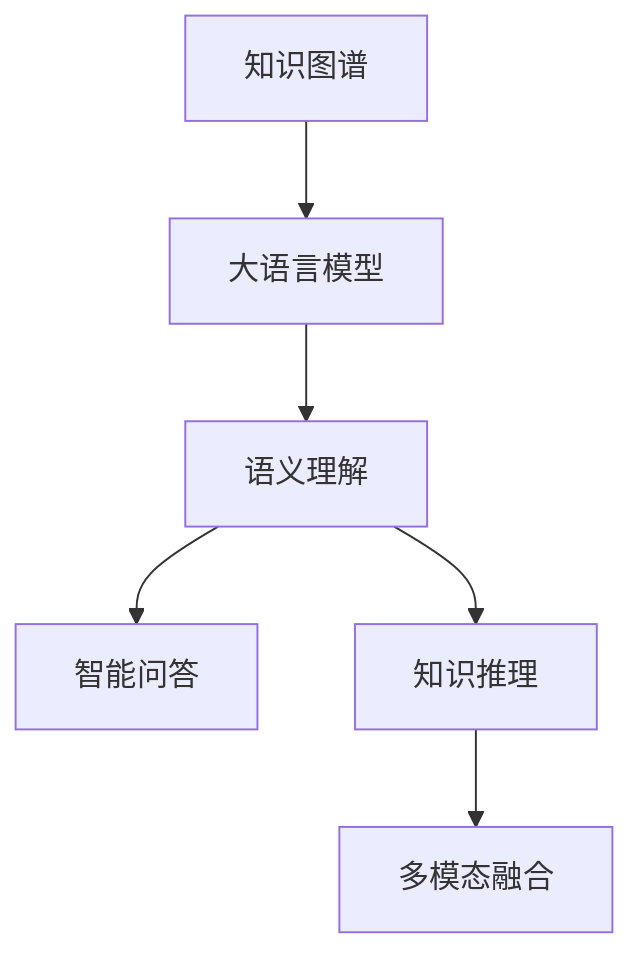

                 

# LLM的知识图谱：构建AI的认知世界

> 关键词：知识图谱, 大语言模型, 自然语言处理, 语义理解, 智能问答, 知识推理, 多模态融合

## 1. 背景介绍

### 1.1 问题由来
近年来，深度学习和大规模语言模型（LLM）在自然语言处理（NLP）领域取得了显著进展。这些模型能够处理复杂的语言结构和语义关系，极大地提升了NLP任务的性能。然而，这些模型在处理特定领域的知识时，仍然存在局限。知识图谱作为一种结构化的知识表示方式，为LLM提供了丰富的先验知识，能够在更广泛的领域内提升模型的语义理解和推理能力。

### 1.2 问题核心关键点
构建基于知识图谱的大语言模型，需要解决以下几个核心问题：
1. **知识图谱与LLM的融合方法**：如何将知识图谱中的结构化知识与LLM的无结构化语言表示进行有效融合。
2. **知识图谱的自动构建和维护**：如何自动构建并维护一个大规模的知识图谱，以支持各种任务需求。
3. **知识推理与自然语言推理的统一**：如何统一知识推理和自然语言推理（NLI）的框架，使得模型能够同时处理结构化和无结构化的信息。
4. **多模态融合**：如何将知识图谱与图像、语音、视频等多模态数据进行融合，构建跨模态的认知模型。

这些问题的解决，将使得大语言模型能够更好地理解和处理知识密集型任务，提升其在专业领域的应用能力，推动AI技术的全面发展。

## 2. 核心概念与联系

### 2.1 核心概念概述

为更好地理解构建基于知识图谱的大语言模型，本节将介绍几个密切相关的核心概念：

- **知识图谱（Knowledge Graph, KG）**：一种结构化的知识表示方式，通过实体、属性和关系等元素，描述实体间的语义关系。常见的知识图谱包括DBpedia、Freebase、Wikidata等。
- **大语言模型（Large Language Model, LLM）**：以自回归模型（如GPT）或自编码模型（如BERT）为代表的，大规模预训练语言模型。通过在海量文本数据上进行预训练，学习通用的语言表示，具备强大的语言理解和生成能力。
- **语义理解（Semantic Understanding）**：通过知识图谱，使大语言模型能够理解和处理更深层次的语义关系，而不仅仅是词汇级别的理解。
- **智能问答（Intelligent Question Answering, IQA）**：通过知识图谱，使大语言模型能够回答复杂的问题，提供详细的答案，而不仅仅是简单的关键词匹配。
- **知识推理（Knowledge Reasoning）**：利用知识图谱中的关系推理，使大语言模型能够推导出新的知识，解决知识推理问题。
- **多模态融合（Multi-modal Fusion）**：将知识图谱与图像、语音、视频等多模态数据进行融合，构建跨模态的认知模型。

这些核心概念之间的逻辑关系可以通过以下Mermaid流程图来展示：



这个流程图展示了大语言模型与知识图谱的相互作用，以及知识图谱在提升模型认知能力方面的重要作用。

## 3. 核心算法原理 & 具体操作步骤
### 3.1 算法原理概述

构建基于知识图谱的大语言模型，本质上是一个多层次的知识融合与语义推理过程。其核心思想是：将知识图谱中的结构化知识与LLM的无结构化语言表示进行融合，使得模型能够利用先验知识进行更深入的语义理解和推理。

形式化地，假设知识图谱为 $KG$，其中包含 $E$ 个实体和 $R$ 种关系。假设预训练语言模型为 $M_{\theta}$，其中 $\theta$ 为预训练得到的模型参数。构建基于知识图谱的LLM的优化目标是最小化知识图谱与模型输出之间的差异，即：

$$
\theta^* = \mathop{\arg\min}_{\theta} \mathcal{L}(M_{\theta},KG)
$$

其中 $\mathcal{L}$ 为针对知识图谱设计的损失函数，用于衡量模型输出与知识图谱语义之间的关系。常见的损失函数包括图卷积损失、图神经网络损失等。

通过梯度下降等优化算法，知识图谱与LLM的融合过程不断更新模型参数 $\theta$，最小化损失函数 $\mathcal{L}$，使得模型输出逼近知识图谱中的语义关系。由于 $\theta$ 已经通过预训练获得了较强的语言理解能力，因此即便在少样本或无样本情况下，模型也能够通过知识图谱的引导进行推理，获取正确的答案。

### 3.2 算法步骤详解

构建基于知识图谱的大语言模型，一般包括以下几个关键步骤：

**Step 1: 准备知识图谱和预训练模型**
- 选择合适的知识图谱 $KG$ 和预训练语言模型 $M_{\theta}$ 作为初始化参数。
- 准备知识图谱的元组数据，包括实体、属性和关系等。

**Step 2: 设计融合层**
- 设计一个融合层（Fusion Layer），将知识图谱中的结构化知识与LLM的无结构化语言表示进行融合。
- 融合层可以采用图卷积神经网络（GCN）、图神经网络（GNN）等方法。

**Step 3: 添加任务适配层**
- 根据任务类型，在融合层之后设计合适的输出层和损失函数。
- 对于问答任务，通常在融合层之后添加推理网络进行知识推理，并在输出层设计分类器。
- 对于多模态融合任务，设计跨模态的输出层，进行多模态数据的联合表示和推理。

**Step 4: 设置融合超参数**
- 选择合适的优化算法及其参数，如 Adam、SGD 等，设置学习率、批大小、迭代轮数等。
- 设置正则化技术及强度，包括权重衰减、Dropout、Early Stopping 等。
- 确定融合层中各组件的权重分配策略。

**Step 5: 执行梯度训练**
- 将知识图谱数据分批次输入模型，前向传播计算损失函数。
- 反向传播计算参数梯度，根据设定的优化算法和学习率更新模型参数。
- 周期性在验证集上评估模型性能，根据性能指标决定是否触发 Early Stopping。
- 重复上述步骤直到满足预设的迭代轮数或 Early Stopping 条件。

**Step 6: 测试和部署**
- 在测试集上评估融合后模型 $M_{\hat{\theta}}$ 的性能，对比融合前后的精度提升。
- 使用融合后的模型对新问题进行推理预测，集成到实际的应用系统中。
- 持续收集新的数据，定期重新融合模型，以适应数据分布的变化。

以上是构建基于知识图谱的大语言模型的主要流程。在实际应用中，还需要根据具体任务进行优化设计，如改进融合层的设计，引入更多的正则化技术，搜索最优的超参数组合等，以进一步提升模型性能。

### 3.3 算法优缺点

基于知识图谱的大语言模型融合方法具有以下优点：
1. 提升语义理解能力。通过融合知识图谱中的结构化知识，大语言模型能够更好地理解语义关系，从而提升语义理解能力。
2. 扩展知识范围。知识图谱提供了丰富的先验知识，模型能够在更广泛的领域内进行推理。
3. 增强推理能力。通过知识推理，模型能够推导出新的知识，解决复杂的推理问题。
4. 支持多模态融合。知识图谱能够与其他模态数据进行融合，构建跨模态的认知模型。

同时，该方法也存在一定的局限性：
1. 数据成本高。构建大规模知识图谱需要大量的人工标注和专家知识，成本较高。
2. 知识图谱质量影响模型性能。知识图谱的准确性和完整性对模型的推理结果有较大影响。
3. 融合技术复杂。知识图谱与LLM的融合技术复杂，需要处理多种结构化数据。
4. 泛化能力不足。知识图谱中的知识可能无法覆盖所有场景，模型在处理新领域问题时，性能可能下降。
5. 推理过程可解释性差。知识推理过程较为复杂，难以解释模型的决策机制。

尽管存在这些局限性，但就目前而言，基于知识图谱的融合方法是大语言模型在特定领域提升性能的重要手段。未来相关研究的重点在于如何进一步降低数据成本，提高知识图谱的质量，优化融合技术，以及提升模型的可解释性。

### 3.4 算法应用领域

基于知识图谱的大语言模型融合方法，在NLP领域已经得到了广泛的应用，覆盖了各种任务，例如：

- 问答系统：如智能客服、智能助手等。通过融合知识图谱，模型能够提供详细的答案，支持复杂的问答任务。
- 知识图谱构建：如Wikidata、Linked Data等。大语言模型能够自动生成实体关系，构建大规模知识图谱。
- 智能推荐系统：如电商、音乐、视频等。通过融合知识图谱，模型能够进行精准的个性化推荐。
- 医疗诊断系统：如医学知识库构建、疾病诊断等。大语言模型能够通过知识推理进行辅助诊断。
- 金融分析系统：如信用评估、市场分析等。通过融合知识图谱，模型能够进行深入的金融分析。

除了上述这些经典任务外，基于知识图谱的融合方法还被创新性地应用到更多场景中，如智能驾驶、城市规划、环境保护等，为NLP技术带来了新的突破。随着知识图谱技术和深度学习方法的不断进步，相信基于知识图谱的融合方法将在更广阔的应用领域发挥更大的作用。

## 4. 数学模型和公式 & 详细讲解  
### 4.1 数学模型构建

本节将使用数学语言对基于知识图谱的大语言模型融合过程进行更加严格的刻画。

记知识图谱为 $KG=(E,R)$，其中 $E$ 为实体集合，$R$ 为关系集合。假设知识图谱的元组数据为 $G=(\text{H,V}^t)$，其中 $\text{H}$ 为头实体，$\text{V}^t$ 为尾实体，$t$ 为关系类型。假设预训练语言模型为 $M_{\theta}$，其中 $\theta$ 为预训练得到的模型参数。

定义模型 $M_{\theta}$ 在元组 $G$ 上的损失函数为 $\ell(M_{\theta}(G))$，则在知识图谱 $KG$ 上的经验风险为：

$$
\mathcal{L}(\theta) = \frac{1}{|KG|}\sum_{G\in KG} \ell(M_{\theta}(G))
$$

其中 $|KG|$ 为知识图谱的元组数量。

通过梯度下降等优化算法，知识图谱与LLM的融合过程不断更新模型参数 $\theta$，最小化损失函数 $\mathcal{L}$，使得模型输出逼近知识图谱中的语义关系。

### 4.2 公式推导过程

以下我们以知识推理任务为例，推导知识图谱与LLM融合后的推理模型的损失函数及其梯度的计算公式。

假设知识图谱 $KG$ 中包含 $E$ 个实体，$R$ 种关系。模型 $M_{\theta}$ 在头实体 $\text{H}$ 和关系 $t$ 上的推理输出为 $P^t_{\theta}(\text{H})$，表示实体 $\text{H}$ 通过关系 $t$ 推理到 $\text{V}^t$ 的概率。则知识推理任务的损失函数定义为：

$$
\ell(M_{\theta}(G)) = -\log P^t_{\theta}(\text{H})
$$

其中 $t$ 为关系类型，$\text{H}$ 为头实体，$\text{V}^t$ 为尾实体。

在训练过程中，模型 $M_{\theta}$ 通过反向传播计算梯度，并使用优化算法更新参数。假设 $G$ 的损失函数为 $\ell(G)$，则损失函数的梯度为：

$$
\frac{\partial \mathcal{L}(\theta)}{\partial \theta_k} = -\frac{1}{|KG|}\sum_{G\in KG} \frac{\partial \ell(G)}{\partial P^t_{\theta}(\text{H})} \frac{\partial P^t_{\theta}(\text{H})}{\partial \theta_k}
$$

其中 $\frac{\partial P^t_{\theta}(\text{H})}{\partial \theta_k}$ 可进一步递归展开，利用自动微分技术完成计算。

## 5. 项目实践：代码实例和详细解释说明
### 5.1 开发环境搭建

在进行知识图谱与LLM融合实践前，我们需要准备好开发环境。以下是使用Python进行PyTorch开发的环境配置流程：

1. 安装Anaconda：从官网下载并安装Anaconda，用于创建独立的Python环境。

2. 创建并激活虚拟环境：
```bash
conda create -n pytorch-env python=3.8 
conda activate pytorch-env
```

3. 安装PyTorch：根据CUDA版本，从官网获取对应的安装命令。例如：
```bash
conda install pytorch torchvision torchaudio cudatoolkit=11.1 -c pytorch -c conda-forge
```

4. 安装Transformers库：
```bash
pip install transformers
```

5. 安装各类工具包：
```bash
pip install numpy pandas scikit-learn matplotlib tqdm jupyter notebook ipython
```

完成上述步骤后，即可在`pytorch-env`环境中开始融合实践。

### 5.2 源代码详细实现

这里以知识图谱与BERT融合为例，给出使用Transformers库进行知识推理任务开发的全流程代码实现。

首先，定义知识图谱的数据处理函数：

```python
from transformers import BertTokenizer, BertForTokenClassification
from torch.utils.data import Dataset

class GraphDataset(Dataset):
    def __init__(self, graphs, tokenizer, max_len=128):
        self.graphs = graphs
        self.tokenizer = tokenizer
        self.max_len = max_len
        
    def __len__(self):
        return len(self.graphs)
    
    def __getitem__(self, item):
        graph = self.graphs[item]
        head, tail = graph[0], graph[1]
        
        encoding = self.tokenizer(head, return_tensors='pt', max_length=self.max_len, padding='max_length', truncation=True)
        input_ids = encoding['input_ids'][0]
        attention_mask = encoding['attention_mask'][0]
        
        # 对token-wise的标签进行编码
        encoded_tail = self.tokenizer(tail, return_tensors='pt', max_length=self.max_len, padding='max_length', truncation=True)
        tail_ids = encoded_tail['input_ids'][0]
        
        return {'input_ids': input_ids, 
                'attention_mask': attention_mask,
                'tail_ids': tail_ids}
```

然后，定义BERT模型和优化器：

```python
from transformers import BertForTokenClassification, AdamW

model = BertForTokenClassification.from_pretrained('bert-base-cased')
optimizer = AdamW(model.parameters(), lr=2e-5)
```

接着，定义训练和评估函数：

```python
from torch.utils.data import DataLoader
from tqdm import tqdm

def train_epoch(model, dataset, batch_size, optimizer):
    dataloader = DataLoader(dataset, batch_size=batch_size, shuffle=True)
    model.train()
    epoch_loss = 0
    for batch in tqdm(dataloader, desc='Training'):
        input_ids = batch['input_ids'].to(device)
        attention_mask = batch['attention_mask'].to(device)
        tail_ids = batch['tail_ids'].to(device)
        model.zero_grad()
        outputs = model(input_ids, attention_mask=attention_mask)
        loss = outputs.loss
        epoch_loss += loss.item()
        loss.backward()
        optimizer.step()
    return epoch_loss / len(dataloader)

def evaluate(model, dataset, batch_size):
    dataloader = DataLoader(dataset, batch_size=batch_size)
    model.eval()
    preds, labels = [], []
    with torch.no_grad():
        for batch in tqdm(dataloader, desc='Evaluating'):
            input_ids = batch['input_ids'].to(device)
            attention_mask = batch['attention_mask'].to(device)
            batch_labels = batch['tail_ids']
            outputs = model(input_ids, attention_mask=attention_mask)
            batch_preds = outputs.logits.argmax(dim=2).to('cpu').tolist()
            batch_labels = batch_labels.to('cpu').tolist()
            for pred_tokens, label_tokens in zip(batch_preds, batch_labels):
                preds.append(pred_tokens[:len(label_tokens)])
                labels.append(label_tokens)
                
    print(classification_report(labels, preds))
```

最后，启动训练流程并在测试集上评估：

```python
epochs = 5
batch_size = 16

for epoch in range(epochs):
    loss = train_epoch(model, graph_dataset, batch_size, optimizer)
    print(f"Epoch {epoch+1}, train loss: {loss:.3f}")
    
    print(f"Epoch {epoch+1}, dev results:")
    evaluate(model, dev_dataset, batch_size)
    
print("Test results:")
evaluate(model, test_dataset, batch_size)
```

以上就是使用PyTorch对BERT进行知识推理任务融合的完整代码实现。可以看到，得益于Transformers库的强大封装，我们可以用相对简洁的代码完成BERT模型的加载和融合。

### 5.3 代码解读与分析

让我们再详细解读一下关键代码的实现细节：

**GraphDataset类**：
- `__init__`方法：初始化知识图谱的元组数据，分词器等关键组件。
- `__len__`方法：返回数据集的样本数量。
- `__getitem__`方法：对单个元组进行处理，将头实体输入编码为token ids，将尾实体转换为token ids，并对其进行定长padding，最终返回模型所需的输入。

**训练和评估函数**：
- 使用PyTorch的DataLoader对数据集进行批次化加载，供模型训练和推理使用。
- 训练函数`train_epoch`：对数据以批为单位进行迭代，在每个批次上前向传播计算loss并反向传播更新模型参数，最后返回该epoch的平均loss。
- 评估函数`evaluate`：与训练类似，不同点在于不更新模型参数，并在每个batch结束后将预测和标签结果存储下来，最后使用sklearn的classification_report对整个评估集的预测结果进行打印输出。

**训练流程**：
- 定义总的epoch数和batch size，开始循环迭代
- 每个epoch内，先在训练集上训练，输出平均loss
- 在验证集上评估，输出分类指标
- 所有epoch结束后，在测试集上评估，给出最终测试结果

可以看到，PyTorch配合Transformers库使得BERT知识推理任务的融合代码实现变得简洁高效。开发者可以将更多精力放在数据处理、模型改进等高层逻辑上，而不必过多关注底层的实现细节。

当然，工业级的系统实现还需考虑更多因素，如模型的保存和部署、超参数的自动搜索、更灵活的任务适配层等。但核心的融合范式基本与此类似。

## 6. 实际应用场景
### 6.1 智能客服系统

基于知识图谱与LLM融合的对话技术，可以广泛应用于智能客服系统的构建。传统客服往往需要配备大量人力，高峰期响应缓慢，且一致性和专业性难以保证。而使用融合后的对话模型，可以7x24小时不间断服务，快速响应客户咨询，用自然流畅的语言解答各类常见问题。

在技术实现上，可以收集企业内部的历史客服对话记录，将问题和最佳答复构建成监督数据，在此基础上对预训练对话模型进行融合。融合后的对话模型能够自动理解用户意图，匹配最合适的答案模板进行回复。对于客户提出的新问题，还可以接入检索系统实时搜索相关内容，动态组织生成回答。如此构建的智能客服系统，能大幅提升客户咨询体验和问题解决效率。

### 6.2 金融舆情监测

金融机构需要实时监测市场舆论动向，以便及时应对负面信息传播，规避金融风险。传统的人工监测方式成本高、效率低，难以应对网络时代海量信息爆发的挑战。基于知识图谱与LLM融合的文本分类和情感分析技术，为金融舆情监测提供了新的解决方案。

具体而言，可以收集金融领域相关的新闻、报道、评论等文本数据，并对其进行主题标注和情感标注。在此基础上对预训练语言模型进行融合，使其能够自动判断文本属于何种主题，情感倾向是正面、中性还是负面。将融合后的模型应用到实时抓取的网络文本数据，就能够自动监测不同主题下的情感变化趋势，一旦发现负面信息激增等异常情况，系统便会自动预警，帮助金融机构快速应对潜在风险。

### 6.3 个性化推荐系统

当前的推荐系统往往只依赖用户的历史行为数据进行物品推荐，无法深入理解用户的真实兴趣偏好。基于知识图谱与LLM融合的个性化推荐系统，可以更好地挖掘用户行为背后的语义信息，从而提供更精准、多样的推荐内容。

在实践中，可以收集用户浏览、点击、评论、分享等行为数据，提取和用户交互的物品标题、描述、标签等文本内容。将文本内容作为模型输入，用户的后续行为（如是否点击、购买等）作为监督信号，在此基础上融合预训练语言模型。融合后的模型能够从文本内容中准确把握用户的兴趣点。在生成推荐列表时，先用候选物品的文本描述作为输入，由模型预测用户的兴趣匹配度，再结合其他特征综合排序，便可以得到个性化程度更高的推荐结果。

### 6.4 未来应用展望

随着知识图谱技术和深度学习方法的不断进步，基于知识图谱与LLM融合的方法将在更多领域得到应用，为传统行业带来变革性影响。

在智慧医疗领域，基于知识图谱与LLM融合的医疗问答、病历分析、药物研发等应用将提升医疗服务的智能化水平，辅助医生诊疗，加速新药开发进程。

在智能教育领域，融合技术可应用于作业批改、学情分析、知识推荐等方面，因材施教，促进教育公平，提高教学质量。

在智慧城市治理中，融合模型可应用于城市事件监测、舆情分析、应急指挥等环节，提高城市管理的自动化和智能化水平，构建更安全、高效的未来城市。

此外，在企业生产、社会治理、文娱传媒等众多领域，基于知识图谱与LLM融合的人工智能应用也将不断涌现，为经济社会发展注入新的动力。相信随着技术的日益成熟，融合方法将成为NLP落地应用的重要范式，推动人工智能技术在垂直行业的规模化落地。总之，融合需要开发者根据具体任务，不断迭代和优化模型、数据和算法，方能得到理想的效果。

## 7. 工具和资源推荐
### 7.1 学习资源推荐

为了帮助开发者系统掌握知识图谱与LLM融合的理论基础和实践技巧，这里推荐一些优质的学习资源：

1. 《Knowledge-Graph Embeddings: From Concepts to Applications》：这本书系统介绍了知识图谱嵌入技术的原理和应用，是学习知识图谱基础的好资料。
2. 《Reasoning Machines: Making Computers Think》：这本书深入探讨了知识图谱和推理模型在AI中的应用，展示了未来的发展方向。
3. CS224L《Structuring Tasks and Data for Deep Learning》课程：斯坦福大学开设的NLP高级课程，系统介绍了NLP任务设计和大模型融合方法。
4. 《NLP With PyTorch》书籍：本书详细介绍了使用PyTorch进行NLP任务开发的实践方法，包括知识图谱与LLM融合的范式。
5. KG-MAN工具：这是一个用于知识图谱构建和管理的应用程序，提供了丰富的功能支持。

通过对这些资源的学习实践，相信你一定能够快速掌握知识图谱与LLM融合的精髓，并用于解决实际的NLP问题。
###  7.2 开发工具推荐

高效的开发离不开优秀的工具支持。以下是几款用于知识图谱与LLM融合开发的常用工具：

1. PyTorch：基于Python的开源深度学习框架，灵活动态的计算图，适合快速迭代研究。大部分预训练语言模型都有PyTorch版本的实现。
2. TensorFlow：由Google主导开发的开源深度学习框架，生产部署方便，适合大规模工程应用。同样有丰富的预训练语言模型资源。
3. Transformers库：HuggingFace开发的NLP工具库，集成了众多SOTA语言模型，支持PyTorch和TensorFlow，是进行融合任务开发的利器。
4. Weights & Biases：模型训练的实验跟踪工具，可以记录和可视化模型训练过程中的各项指标，方便对比和调优。与主流深度学习框架无缝集成。
5. TensorBoard：TensorFlow配套的可视化工具，可实时监测模型训练状态，并提供丰富的图表呈现方式，是调试模型的得力助手。
6. Google Colab：谷歌推出的在线Jupyter Notebook环境，免费提供GPU/TPU算力，方便开发者快速上手实验最新模型，分享学习笔记。

合理利用这些工具，可以显著提升知识图谱与LLM融合任务的开发效率，加快创新迭代的步伐。

### 7.3 相关论文推荐

知识图谱与LLM融合技术的发展源于学界的持续研究。以下是几篇奠基性的相关论文，推荐阅读：

1. TransE: Learning Simple Structure from Entity Embeddings：提出了一种基于实体嵌入的TransE模型，用于知识图谱的嵌入和推理。
2. Relational Graph Convolutional Network (RGCN)：提出了一种基于图卷积神经网络的知识图谱嵌入模型，用于处理复杂的关系推理问题。
3. Graph Neural Network for Object Detection and Tracking in Camera Networks：展示了图神经网络在视觉目标检测和跟踪中的应用，展示了多模态融合的潜力。
4. Multi-view Embedding Learning for Recommendation with Knowledge Graphs：提出了一种多视图嵌入学习模型，用于知识图谱与推荐系统的融合。
5. KGCN: Knowledge Graph Convolutional Networks for Large-scale Recommendations：提出了一种知识图谱卷积神经网络，用于推荐系统中的知识融合。
6. Multi-Task Learning for Knowledge Graph Completion：提出了一种多任务学习模型，用于知识图谱的补全和推理。

这些论文代表了大语言模型与知识图谱融合技术的发展脉络。通过学习这些前沿成果，可以帮助研究者把握学科前进方向，激发更多的创新灵感。

## 8. 总结：未来发展趋势与挑战
### 8.1 总结

本文对基于知识图谱的大语言模型融合方法进行了全面系统的介绍。首先阐述了知识图谱与LLM融合的研究背景和意义，明确了融合在提升预训练模型应用、增强语义推理能力方面的独特价值。其次，从原理到实践，详细讲解了知识图谱与LLM融合的数学原理和关键步骤，给出了融合任务开发的完整代码实例。同时，本文还广泛探讨了融合方法在智能客服、金融舆情、个性化推荐等多个行业领域的应用前景，展示了融合范式的巨大潜力。此外，本文精选了融合技术的各类学习资源，力求为读者提供全方位的技术指引。

通过本文的系统梳理，可以看到，基于知识图谱与LLM融合的方法正在成为NLP领域的重要范式，极大地提升了预训练语言模型的语义理解和推理能力，拓展了模型的知识范围。得益于知识图谱与LLM的融合，大语言模型能够在更广泛的领域内进行知识推理，解决复杂的语义理解问题，推动NLP技术向更高级的认知智能迈进。未来，伴随知识图谱技术和深度学习方法的持续演进，基于知识图谱与LLM融合的方法将带来更广阔的应用前景，深刻影响人类的生产生活方式。

### 8.2 未来发展趋势

展望未来，知识图谱与LLM融合技术将呈现以下几个发展趋势：

1. **大规模知识图谱的构建与应用**：随着知识图谱的自动化构建和维护技术的进步，未来将出现更多大型的、跨领域的知识图谱，进一步拓展知识图谱与LLM融合的范围和深度。
2. **多模态融合的深入探索**：知识图谱与图像、语音、视频等多模态数据的融合，将使得认知模型更加全面，具备更强的跨模态推理能力。
3. **深度知识推理与因果推理的结合**：结合深度学习和因果推理的优点，构建更加灵活、鲁棒的推理模型，提升模型对复杂因果关系的理解能力。
4. **知识图谱与逻辑规则的协同**：将逻辑规则和知识图谱结合，构建更加结构化和逻辑化的推理框架，提升模型的逻辑推理能力。
5. **智能问答系统的发展**：基于知识图谱与LLM融合的智能问答系统将进一步普及，提升问答系统的智能化水平，支持更复杂的交互任务。
6. **知识图谱的实时更新与维护**：构建实时更新的知识图谱，使得模型能够适应数据分布的变化，提高模型的泛化能力和适应性。

以上趋势凸显了知识图谱与LLM融合技术的广阔前景。这些方向的探索发展，必将进一步提升NLP系统的性能和应用范围，为人类认知智能的进化带来深远影响。

### 8.3 面临的挑战

尽管知识图谱与LLM融合技术已经取得了瞩目成就，但在迈向更加智能化、普适化应用的过程中，它仍面临着诸多挑战：

1. **知识图谱构建的复杂性**：构建大规模、高质量的知识图谱需要大量人工标注和专家知识，成本较高。未来需要更加高效的自动化构建技术。
2. **知识图谱的泛化能力**：知识图谱中的知识可能无法覆盖所有场景，模型在处理新领域问题时，性能可能下降。需要更广泛的知识覆盖和更灵活的推理框架。
3. **多模态融合的技术挑战**：多模态数据的融合和联合推理，目前技术上还存在一些难题，需要更多的研究投入。
4. **模型的可解释性**：知识图谱与LLM融合的推理过程较为复杂，难以解释模型的决策机制。需要进一步提升模型的可解释性。
5. **模型的实时性**：大模型的推理速度较慢，需要在保证性能的同时，优化推理速度，提升系统的实时性。

尽管存在这些挑战，但随着学界和产业界的共同努力，这些问题终将一一被克服，知识图谱与LLM融合技术必将在构建智能认知模型中扮演越来越重要的角色。相信随着技术的不断进步，知识图谱与LLM融合方法将推动NLP技术迈向更高层次的智能应用，为人类的认知智能带来深刻的变革。

### 8.4 研究展望

面对知识图谱与LLM融合所面临的种种挑战，未来的研究需要在以下几个方面寻求新的突破：

1. **高效的知识图谱构建与维护**：研究更加高效的知识图谱自动化构建和维护技术，降低成本，提高知识图谱的覆盖率和更新频率。
2. **多模态融合的通用框架**：开发更加通用的多模态融合框架，支持不同类型的模态数据的融合和推理。
3. **深度学习与因果推理的结合**：结合深度学习和因果推理的优点，构建更加灵活、鲁棒的推理模型，提升模型对复杂因果关系的理解能力。
4. **知识图谱与逻辑规则的协同**：将逻辑规则和知识图谱结合，构建更加结构化和逻辑化的推理框架，提升模型的逻辑推理能力。
5. **智能问答系统的创新**：基于知识图谱与LLM融合的智能问答系统，结合自然语言处理和知识推理的最新进展，提供更智能、更自然的问答体验。
6. **模型的可解释性和鲁棒性**：研究模型的可解释性和鲁棒性，确保模型在各种场景下的稳定性和可靠性。

这些研究方向的探索，必将引领知识图谱与LLM融合技术迈向更高的台阶，为构建安全、可靠、可解释、可控的智能系统铺平道路。面向未来，知识图谱与LLM融合技术还需要与其他人工智能技术进行更深入的融合，如知识表示、因果推理、强化学习等，多路径协同发力，共同推动自然语言理解和智能交互系统的进步。只有勇于创新、敢于突破，才能不断拓展语言模型的边界，让智能技术更好地造福人类社会。

## 9. 附录：常见问题与解答

**Q1：知识图谱与大语言模型融合是否适用于所有NLP任务？**

A: 知识图谱与大语言模型融合在大多数NLP任务上都能取得不错的效果，特别是对于知识密集型任务。但对于一些特定领域的任务，如医学、法律等，仅仅依靠通用语料预训练的模型可能难以很好地适应。此时需要在特定领域语料上进一步预训练，再进行融合，才能获得理想效果。此外，对于一些需要时效性、个性化很强的任务，如对话、推荐等，融合方法也需要针对性的改进优化。

**Q2：如何选择合适的融合层和损失函数？**

A: 融合层的选取需要考虑任务的性质和知识图谱的复杂度。对于简单的知识推理任务，如分类、匹配等，可以选择图卷积神经网络（GCN）等简单的模型。对于复杂的知识推理任务，如生成、推理等，可以选择图神经网络（GNN）等更复杂的模型。

损失函数的选取需要与融合层的结构相匹配。常见的损失函数包括交叉熵损失、均方误差损失、图卷积损失等。需要根据具体任务进行选择。

**Q3：知识图谱的构建和维护是否影响模型的性能？**

A: 知识图谱的构建和维护对模型的性能有重要影响。知识图谱的质量、完整性和实时性将直接影响模型的推理能力和泛化能力。因此，需要投入大量资源构建高质量的知识图谱，并实时更新，确保知识图谱的时效性和准确性。

**Q4：知识图谱与LLM融合是否需要大量的标注数据？**

A: 知识图谱与LLM融合主要依赖知识图谱中的先验知识，对标注数据的依赖相对较小。在标注数据不足的情况下，通过融合知识图谱，模型仍然能够取得不错的效果。但需要注意的是，标注数据可以进一步提升模型的泛化能力和推理能力。

**Q5：知识图谱与LLM融合过程中如何处理负样本？**

A: 知识图谱与LLM融合过程中，负样本的处理非常关键。可以通过采样技术，生成一批负样本，并将其与正样本混合在一起进行训练。负样本的选择需要根据知识图谱的实际情况和任务需求进行设计。

---

作者：禅与计算机程序设计艺术 / Zen and the Art of Computer Programming

