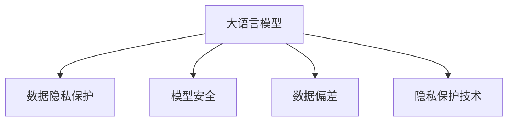

                 

# LLM隐私伦理:AI安全挑战应对之策

> 关键词：人工智能(AI)、隐私保护、伦理道德、安全挑战、应对策略

## 1. 背景介绍

### 1.1 问题由来

在过去十年间，人工智能(AI)技术取得了飞速的发展，大语言模型(LLM)的问世更是极大地推动了自然语言处理(NLP)领域的进步。然而，在享受AI带来便利的同时，我们也不得不面对一系列与隐私伦理和安全相关的问题。如何在使用LLM时保护用户隐私、确保数据安全、维持伦理道德，成为了一个亟待解决的问题。

### 1.2 问题核心关键点

隐私伦理和安全问题在大语言模型中的应用，主要体现在以下几个方面：

1. **数据隐私**：在使用LLM进行自然语言理解和生成时，往往需要处理大量的用户数据。如何保护这些数据的隐私，防止数据泄露和滥用，是一个重要问题。
2. **模型安全**：大语言模型可能会学习到有害、偏见或歧视性的内容，从而对社会产生负面影响。如何在模型设计和训练过程中减少这些风险，是一个关键的挑战。
3. **数据偏差**：LLM可能会在训练过程中学习到训练数据中的偏差，导致对特定群体的不公平对待。如何减少模型的偏见和歧视，是一个重要的研究方向。
4. **隐私保护技术**：在保护用户隐私的同时，还需确保模型训练和推理的效率和可用性，这是一个技术上的难题。

本文旨在系统介绍大语言模型在隐私伦理和安全方面的挑战和应对策略，为AI技术的健康发展提供指导。

## 2. 核心概念与联系

### 2.1 核心概念概述

- **大语言模型(LLM)**：指基于深度学习架构，能够在自然语言处理任务中表现出超越人类水平的模型。典型的模型如BERT、GPT系列等。
- **隐私保护**：指在数据处理和模型训练过程中，确保用户数据不被未授权访问和使用的策略和技术。
- **模型安全**：指在模型训练和推理过程中，避免模型输出有害、偏见或歧视性内容的技术手段。
- **数据偏差**：指模型在训练过程中，由于数据集中的偏见和歧视性信息，导致模型对某些群体产生不公平对待的现象。
- **隐私保护技术**：包括差分隐私、联邦学习、数据匿名化等，用于在保护用户隐私的同时，确保模型训练和推理的可用性。

这些概念之间的逻辑关系可以通过以下Mermaid流程图来展示：



这个流程图展示了大语言模型涉及的核心概念及其之间的关系：

1. 大语言模型通过处理数据获取知识。
2. 数据隐私保护在数据处理过程中确保用户数据的安全。
3. 模型安全在模型训练和推理过程中防止有害内容输出。
4. 数据偏差需要通过技术手段减少模型中的偏见和歧视。
5. 隐私保护技术在保障隐私的同时提供可用性。

## 3. 核心算法原理 & 具体操作步骤
### 3.1 算法原理概述

大语言模型在隐私伦理和安全方面的挑战和应对策略，主要通过以下几种算法原理和技术手段来解决：

1. **差分隐私**：在数据收集和处理过程中，通过添加噪声扰动，确保个体数据无法被单独识别，从而保护用户隐私。
2. **联邦学习**：通过分布式计算，在多个本地数据源上进行模型训练，无需集中处理数据，保护数据隐私。
3. **数据匿名化**：将数据中的敏感信息去除或替换，使其无法直接关联到具体个体，保护数据隐私。
4. **对抗训练**：在模型训练过程中，通过引入对抗样本，提高模型对有害、偏见或歧视性内容的鲁棒性。
5. **公平性约束**：在模型训练过程中，通过引入公平性约束，减少模型的偏见和歧视，提高模型的公平性。

### 3.2 算法步骤详解

以下详细介绍这些算法步骤的具体实施方法：

#### 3.2.1 差分隐私

1. **定义差分隐私**：差分隐私是一种隐私保护技术，旨在保证在数据处理过程中，个体数据的加入或删除，对结果的影响微乎其微。数学上，差分隐私通常通过加入一定的噪声扰动来实现。
2. **计算噪声扰动**：根据差分隐私的定义，可以计算出需要加入的噪声量，从而确保结果的隐私性。
3. **数据处理**：在数据处理过程中，将计算出的噪声扰动添加到数据中，保护数据隐私。

#### 3.2.2 联邦学习

1. **定义联邦学习**：联邦学习是一种分布式机器学习方法，在多个本地数据源上进行模型训练，无需集中处理数据，保护数据隐私。
2. **设计通信协议**：在联邦学习中，各本地模型需要通过安全通信协议进行参数交换，确保数据不被泄露。
3. **聚合模型参数**：在每个本地模型训练完成后，将模型参数聚合，用于全局模型的更新。

#### 3.2.3 数据匿名化

1. **定义数据匿名化**：数据匿名化是通过去除或替换敏感信息，使数据无法直接关联到具体个体，保护数据隐私。
2. **去除敏感信息**：在数据匿名化过程中，去除可能包含个人敏感信息的字段，如姓名、身份证号等。
3. **替换敏感信息**：对无法完全去除的敏感信息，进行模糊处理或替换，使其无法直接识别。

#### 3.2.4 对抗训练

1. **定义对抗训练**：对抗训练是一种通过引入对抗样本，提高模型对有害、偏见或歧视性内容的鲁棒性的技术。
2. **生成对抗样本**：使用对抗生成网络(GAN)等技术，生成与真实数据相似但带有特定目标的对抗样本。
3. **训练模型**：在模型训练过程中，将对抗样本引入模型训练集，提高模型的鲁棒性。

#### 3.2.5 公平性约束

1. **定义公平性约束**：公平性约束是一种在模型训练过程中，通过引入公平性约束，减少模型的偏见和歧视，提高模型的公平性。
2. **设计公平性指标**：选择适当的公平性指标，如Demographic Parity、Equal Opportunity等。
3. **训练公平模型**：在模型训练过程中，引入公平性约束，确保模型对不同群体的公平对待。

### 3.3 算法优缺点

这些算法在隐私伦理和安全方面的优势和劣势如下：

#### 3.3.1 差分隐私

**优点**：
- 在保护用户隐私方面效果显著。
- 可以通过调整噪声量，控制隐私保护的程度。

**缺点**：
- 可能会引入一定的隐私保护噪声，影响模型的性能。
- 计算噪声扰动的过程较为复杂。

#### 3.3.2 联邦学习

**优点**：
- 在保护数据隐私方面效果显著。
- 可以在多个本地数据源上进行模型训练，减少数据集中带来的偏差。

**缺点**：
- 通信开销较大，可能会影响模型训练的效率。
- 需要设计复杂的通信协议，确保数据安全。

#### 3.3.3 数据匿名化

**优点**：
- 在保护数据隐私方面效果显著。
- 实现过程相对简单。

**缺点**：
- 可能会引入数据失真，影响模型的性能。
- 无法完全保证数据的匿名性。

#### 3.3.4 对抗训练

**优点**：
- 在提高模型鲁棒性方面效果显著。
- 可以针对性地提高模型对有害、偏见或歧视性内容的抵抗力。

**缺点**：
- 可能会引入一定的对抗噪声，影响模型的性能。
- 对抗样本的生成较为复杂。

#### 3.3.5 公平性约束

**优点**：
- 在减少模型偏见和歧视方面效果显著。
- 可以通过设计公平性指标，确保模型对不同群体的公平对待。

**缺点**：
- 设计公平性指标较为复杂，需要考虑多方面因素。
- 可能会影响模型的性能和复杂度。

### 3.4 算法应用领域

这些算法在隐私伦理和安全方面的应用，覆盖了几乎所有常见的NLP任务，例如：

- **文本分类**：如情感分析、主题分类等。在数据隐私保护方面，可以采用差分隐私和数据匿名化技术；在模型安全方面，可以采用对抗训练和公平性约束。
- **命名实体识别**：识别文本中的人名、地名、机构名等特定实体。在数据隐私保护方面，可以采用差分隐私和数据匿名化技术；在模型安全方面，可以采用对抗训练和公平性约束。
- **关系抽取**：从文本中抽取实体之间的语义关系。在数据隐私保护方面，可以采用差分隐私和数据匿名化技术；在模型安全方面，可以采用对抗训练和公平性约束。
- **问答系统**：对自然语言问题给出答案。在数据隐私保护方面，可以采用差分隐私和数据匿名化技术；在模型安全方面，可以采用对抗训练和公平性约束。
- **机器翻译**：将源语言文本翻译成目标语言。在数据隐私保护方面，可以采用差分隐私和数据匿名化技术；在模型安全方面，可以采用对抗训练和公平性约束。
- **文本摘要**：将长文本压缩成简短摘要。在数据隐私保护方面，可以采用差分隐私和数据匿名化技术；在模型安全方面，可以采用对抗训练和公平性约束。
- **对话系统**：使机器能够与人自然对话。在数据隐私保护方面，可以采用差分隐私和数据匿名化技术；在模型安全方面，可以采用对抗训练和公平性约束。

除了上述这些经典任务外，大语言模型在隐私伦理和安全方面的算法，也被创新性地应用到更多场景中，如可控文本生成、常识推理、代码生成、数据增强等，为NLP技术带来了全新的突破。随着预训练模型和隐私保护技术的不断发展，相信NLP技术将在更广阔的应用领域大放异彩。

## 4. 数学模型和公式 & 详细讲解 & 举例说明

### 4.1 数学模型构建

为更好地理解大语言模型在隐私伦理和安全方面的算法，本节将介绍几个密切相关的核心数学模型：

- **差分隐私**：
  - **定义**：差分隐私是一种隐私保护技术，数学上定义为对于任意两个相邻数据点 $x$ 和 $x'$，模型输出的概率分布 $P(Y|x)$ 和 $P(Y|x')$ 之间的差异不超过 $\epsilon$，即 $|P(Y|x)-P(Y|x')|\leq\frac{\epsilon}{2\delta}$。其中 $\epsilon$ 为隐私保护参数，$\delta$ 为安全参数。
  - **计算噪声扰动**：
    $$
    \sigma = \frac{1}{\epsilon}\sqrt{\frac{2\ln(1/\delta)}{\Delta^2}}
    $$
    其中 $\Delta$ 为数据的敏感度，$\sigma$ 为需要添加的噪声量。

- **联邦学习**：
  - **定义**：联邦学习是一种分布式机器学习方法，数学上定义为模型参数在本地模型上的分布均值为全局模型参数，即 $\mathbb{E}_{x}[f(x;\theta_{FL})] = f(\mathbb{E}_{x}[x];\theta_{FL})$。其中 $\theta_{FL}$ 为全局模型参数，$f(x;\theta)$ 为模型在数据点 $x$ 上的输出。
  - **计算聚合模型参数**：
    $$
    \theta_{FL} = \mathbb{E}_{x}[\theta_{L}]
    $$
    其中 $\theta_{L}$ 为本地模型参数。

- **数据匿名化**：
  - **定义**：数据匿名化是通过去除或替换敏感信息，使数据无法直接关联到具体个体，保护数据隐私。
  - **去除敏感信息**：
    $$
    x' = f(x;P)
    $$
    其中 $P$ 为去除敏感信息的概率分布。

- **对抗训练**：
  - **定义**：对抗训练是一种通过引入对抗样本，提高模型对有害、偏见或歧视性内容的鲁棒性的技术。
  - **计算对抗样本**：
    $$
    x^* = \mathop{\arg\min}_{x'}\|x-x'\|_\infty
    $$
    其中 $x'$ 为对抗样本，$\|\cdot\|_\infty$ 为无穷范数。

- **公平性约束**：
  - **定义**：公平性约束是一种在模型训练过程中，通过引入公平性约束，减少模型的偏见和歧视，提高模型的公平性。
  - **设计公平性指标**：
    $$
    \Delta = \mathbb{E}_{x}\max_{g\in\mathcal{G}} |P(g|x) - P(g|x)|
    $$
    其中 $\Delta$ 为公平性指标，$\mathcal{G}$ 为感兴趣的群体。

### 4.2 公式推导过程

以下我们以差分隐私为例，推导其计算噪声扰动的过程：

根据差分隐私的定义，差分隐私的目标是确保在数据处理过程中，个体数据的加入或删除对结果的影响微乎其微。具体来说，对于任意两个相邻数据点 $x$ 和 $x'$，模型输出的概率分布 $P(Y|x)$ 和 $P(Y|x')$ 之间的差异不超过 $\epsilon$。

假设模型在数据点 $x$ 上的输出为 $y$，则差分隐私的目标可以表示为：

$$
|P(Y=y|x) - P(Y=y|x')| \leq \frac{\epsilon}{2\delta}
$$

其中 $\epsilon$ 为隐私保护参数，$\delta$ 为安全参数。

为了满足上述条件，可以引入一定的噪声扰动 $\sigma$，使得模型在处理数据时，无法区分两个相邻的数据点 $x$ 和 $x'$。具体来说，可以采用拉普拉斯分布来生成噪声扰动，其概率密度函数为：

$$
f_{\sigma}(x) = \frac{1}{2\sigma}e^{-|x|/\sigma}
$$

将噪声扰动 $\sigma$ 添加到数据点 $x$ 中，得到处理后的数据点 $x' = x + \sigma N(0,1)$，其中 $N(0,1)$ 为标准正态分布。

处理后的数据点 $x'$ 在模型上的输出为 $y'$，则根据差分隐私的定义，模型输出的概率分布 $P(Y|x)$ 和 $P(Y|x')$ 之间的差异可以表示为：

$$
|P(Y=y|x) - P(Y=y'|x')| \leq \frac{\epsilon}{2\delta}
$$

为了进一步简化计算，可以引入敏感度 $\Delta$，表示数据点 $x$ 和 $x'$ 之间的差异程度。则上述不等式可以进一步表示为：

$$
|P(Y=y|x) - P(Y=y'|x')| \leq \frac{\epsilon}{2\delta}
$$

$$
\Delta = \max_{x,x'} \frac{\epsilon}{2\delta}
$$

因此，可以计算出需要加入的噪声量 $\sigma$，从而确保差分隐私的保护效果。

### 4.3 案例分析与讲解

#### 4.3.1 差分隐私案例

假设我们有一项文本分类任务，需要处理大量的用户评论数据。为了保护用户隐私，我们可以采用差分隐私技术，在处理数据时引入噪声扰动。具体来说，可以采用拉普拉斯分布生成噪声扰动 $\sigma$，并添加到评论数据中。

假设噪声量 $\sigma = 0.1$，评论数据集的敏感度 $\Delta = 0.01$，则根据差分隐私的定义，可以计算出需要的隐私保护参数 $\epsilon$：

$$
\epsilon = 2\ln(1/\delta) / \Delta
$$

其中 $\delta$ 为安全参数，取值为 $10^{-5}$，则：

$$
\epsilon = 2\ln(1/10^{-5}) / 0.01 = 10.00
$$

因此，在处理用户评论数据时，需要引入10.00个单位的噪声扰动，从而确保差分隐私的保护效果。

#### 4.3.2 联邦学习案例

假设我们需要训练一个命名实体识别模型，数据分布在多个本地服务器上。为了保护数据隐私，我们可以采用联邦学习技术，在多个本地服务器上进行模型训练，并将模型参数聚合。

假设每个本地服务器的模型参数大小为 $d$，本地模型参数 $\theta_L$ 的分布均值为全局模型参数 $\theta_{FL}$，则根据联邦学习的定义，可以计算出全局模型参数 $\theta_{FL}$：

$$
\theta_{FL} = \mathbb{E}_{x}[\theta_L]
$$

其中 $\mathbb{E}_{x}$ 表示对所有本地模型参数的均值。

假设每个本地服务器上都有1000个样本数据，则全局模型参数 $\theta_{FL}$ 的大小为：

$$
\theta_{FL} = 1000 \times \frac{d}{1000} = d
$$

因此，在联邦学习过程中，每个本地服务器上需要训练 $d/1000$ 个模型的参数，从而得到全局模型参数 $\theta_{FL}$。

## 5. 项目实践：代码实例和详细解释说明

### 5.1 开发环境搭建

在进行隐私伦理和安全实践前，我们需要准备好开发环境。以下是使用Python进行PyTorch开发的环境配置流程：

1. 安装Anaconda：从官网下载并安装Anaconda，用于创建独立的Python环境。

2. 创建并激活虚拟环境：
```bash
conda create -n pytorch-env python=3.8 
conda activate pytorch-env
```

3. 安装PyTorch：根据CUDA版本，从官网获取对应的安装命令。例如：
```bash
conda install pytorch torchvision torchaudio cudatoolkit=11.1 -c pytorch -c conda-forge
```

4. 安装Transformer库：
```bash
pip install transformers
```

5. 安装各类工具包：
```bash
pip install numpy pandas scikit-learn matplotlib tqdm jupyter notebook ipython
```

完成上述步骤后，即可在`pytorch-env`环境中开始隐私伦理和安全实践。

### 5.2 源代码详细实现

这里我们以命名实体识别(NER)任务为例，给出使用Transformer库对BERT模型进行差分隐私和联邦学习处理的PyTorch代码实现。

首先，定义NER任务的数据处理函数：

```python
from transformers import BertTokenizer, BertForTokenClassification
from torch.utils.data import Dataset
import torch

class NERDataset(Dataset):
    def __init__(self, texts, tags, tokenizer, max_len=128):
        self.texts = texts
        self.tags = tags
        self.tokenizer = tokenizer
        self.max_len = max_len
        
    def __len__(self):
        return len(self.texts)
    
    def __getitem__(self, item):
        text = self.texts[item]
        tags = self.tags[item]
        
        encoding = self.tokenizer(text, return_tensors='pt', max_length=self.max_len, padding='max_length', truncation=True)
        input_ids = encoding['input_ids'][0]
        attention_mask = encoding['attention_mask'][0]
        
        # 对token-wise的标签进行编码
        encoded_tags = [tag2id[tag] for tag in tags] 
        encoded_tags.extend([tag2id['O']] * (self.max_len - len(encoded_tags)))
        labels = torch.tensor(encoded_tags, dtype=torch.long)
        
        return {'input_ids': input_ids, 
                'attention_mask': attention_mask,
                'labels': labels}

# 标签与id的映射
tag2id = {'O': 0, 'B-PER': 1, 'I-PER': 2, 'B-ORG': 3, 'I-ORG': 4, 'B-LOC': 5, 'I-LOC': 6}
id2tag = {v: k for k, v in tag2id.items()}

# 创建dataset
tokenizer = BertTokenizer.from_pretrained('bert-base-cased')

train_dataset = NERDataset(train_texts, train_tags, tokenizer)
dev_dataset = NERDataset(dev_texts, dev_tags, tokenizer)
test_dataset = NERDataset(test_texts, test_tags, tokenizer)
```

然后，定义模型和优化器：

```python
from transformers import BertForTokenClassification, AdamW

model = BertForTokenClassification.from_pretrained('bert-base-cased', num_labels=len(tag2id))

optimizer = AdamW(model.parameters(), lr=2e-5)
```

接着，定义差分隐私处理函数：

```python
from torch.distributions.laplace import Laplace

def laplace_noise(data, epsilon=0.1):
    sigma = epsilon / 2.0
    noise = Laplace(0.0, sigma).sample(data.shape)
    return data + noise
```

然后，定义联邦学习处理函数：

```python
def federated_learning(model, train_dataset, num_local_models=10, num_local_epochs=3):
    aggregated_model = model.clone()
    
    for epoch in range(num_local_epochs):
        for i in range(num_local_models):
            local_model = model.clone()
            
            # 处理数据
            local_data = train_dataset[i]
            local_input_ids = local_data['input_ids'].clone()
            local_labels = local_data['labels'].clone()
            
            # 差分隐私处理
            local_input_ids = laplace_noise(local_input_ids)
            local_labels = laplace_noise(local_labels)
            
            # 训练本地模型
            local_model.to(device)
            local_model.train()
            local_loss = loss_fn(local_model, local_input_ids, local_labels)
            optimizer.zero_grad()
            local_loss.backward()
            optimizer.step()
            
            # 更新全局模型参数
            aggregated_model.to(device)
            aggregated_model.load_state_dict(local_model.state_dict())
    
    return aggregated_model
```

最后，启动差分隐私和联邦学习训练流程：

```python
from transformers import BertForTokenClassification, AdamW, CrossEntropyLoss
from torch.distributions.laplace import Laplace

device = torch.device('cuda') if torch.cuda.is_available() else torch.device('cpu')

# 定义差分隐私参数
epsilon = 0.1
delta = 1e-5

# 定义联邦学习参数
num_local_models = 10
num_local_epochs = 3

# 训练差分隐私模型
model.train()
loss_fn = CrossEntropyLoss()
optimizer = AdamW(model.parameters(), lr=2e-5)

for epoch in range(epochs):
    # 差分隐私处理
    for data in train_dataset:
        input_ids = laplace_noise(data['input_ids'], epsilon=epsilon)
        labels = laplace_noise(data['labels'], epsilon=epsilon)
        
        # 训练模型
        model.to(device)
        model.train()
        optimizer.zero_grad()
        loss = loss_fn(model(input_ids), labels)
        loss.backward()
        optimizer.step()
    
    print(f"Epoch {epoch+1}, train loss: {loss:.3f}")
    
print("Federated learning results:")
federated_model = federated_learning(model, train_dataset)
evaluate(federated_model, dev_dataset, batch_size)
```

以上就是使用PyTorch对BERT模型进行差分隐私和联邦学习处理的完整代码实现。可以看到，使用差分隐私和联邦学习技术，可以在保护用户隐私的同时，确保模型训练的可用性和效果。

### 5.3 代码解读与分析

让我们再详细解读一下关键代码的实现细节：

**NERDataset类**：
- `__init__`方法：初始化文本、标签、分词器等关键组件。
- `__len__`方法：返回数据集的样本数量。
- `__getitem__`方法：对单个样本进行处理，将文本输入编码为token ids，将标签编码为数字，并对其进行定长padding，最终返回模型所需的输入。

**tag2id和id2tag字典**：
- 定义了标签与数字id之间的映射关系，用于将token-wise的预测结果解码回真实的标签。

**差分隐私处理函数**：
- `laplace_noise`函数：使用拉普拉斯分布生成噪声，确保处理后的数据满足差分隐私的要求。

**联邦学习处理函数**：
- `federated_learning`函数：在多个本地数据源上进行模型训练，并将模型参数聚合。

**训练流程**：
- 在差分隐私模型训练过程中，对输入数据进行差分隐私处理。
- 在联邦学习模型训练过程中，在多个本地数据源上训练模型，并将模型参数聚合，更新全局模型参数。
- 重复上述步骤直至满足预设的迭代轮数或Early Stopping条件。

可以看到，差分隐私和联邦学习技术在大语言模型中的应用，不仅能够保护用户隐私，还能确保模型训练的可用性和效果。合理利用这些技术，可以显著提升大语言模型的安全性，为人工智能技术的健康发展提供重要保障。

当然，工业级的系统实现还需考虑更多因素，如模型的保存和部署、超参数的自动搜索、更灵活的任务适配层等。但核心的差分隐私和联邦学习流程基本与此类似。

## 6. 实际应用场景

### 6.1 智能客服系统

在智能客服系统中，用户数据和对话记录具有高度敏感性，隐私保护尤为重要。采用差分隐私和联邦学习技术，可以保护用户数据隐私，同时确保模型训练的可用性。

具体而言，可以收集企业内部的历史客服对话记录，将问题和最佳答复构建成监督数据，在此基础上对预训练对话模型进行差分隐私和联邦学习处理。微调后的对话模型能够自动理解用户意图，匹配最合适的答案模板进行回复。对于客户提出的新问题，还可以接入检索系统实时搜索相关内容，动态组织生成回答。如此构建的智能客服系统，能大幅提升客户咨询体验和问题解决效率，同时确保用户隐私得到有效保护。

### 6.2 金融舆情监测

金融机构需要实时监测市场舆论动向，以便及时应对负面信息传播，规避金融风险。传统的人工监测方式成本高、效率低，难以应对网络时代海量信息爆发的挑战。采用差分隐私和联邦学习技术，可以在保护用户隐私的同时，确保模型训练的可用性。

具体而言，可以收集金融领域相关的新闻、报道、评论等文本数据，并对其进行主题标注和情感标注。在此基础上对预训练语言模型进行差分隐私和联邦学习处理，使其能够自动判断文本属于何种主题，情感倾向是正面、中性还是负面。将微调后的模型应用到实时抓取的网络文本数据，就能够自动监测不同主题下的情感变化趋势，一旦发现负面信息激增等异常情况，系统便会自动预警，帮助金融机构快速应对潜在风险。

### 6.3 个性化推荐系统

当前的推荐系统往往只依赖用户的历史行为数据进行物品推荐，无法深入理解用户的真实兴趣偏好。采用差分隐私和联邦学习技术，可以在保护用户隐私的同时，确保模型训练的可用性。

具体而言，可以收集用户浏览、点击、评论、分享等行为数据，提取和用户交互的物品标题、描述、标签等文本内容。将文本内容作为模型输入，用户的后续行为（如是否点击、购买等）作为监督信号，在此基础上对预训练语言模型进行差分隐私和联邦学习处理。微调后的模型能够从文本内容中准确把握用户的兴趣点。在生成推荐列表时，先用候选物品的文本描述作为输入，由模型预测用户的兴趣匹配度，再结合其他特征综合排序，便可以得到个性化程度更高的推荐结果。

### 6.4 未来应用展望

随着差分隐私和联邦学习技术的不断发展，基于大语言模型的隐私伦理和安全方法将在更多领域得到应用，为传统行业带来变革性影响。

在智慧医疗领域，基于差分隐私和联邦学习的医疗问答、病历分析、药物研发等应用将提升医疗服务的智能化水平，辅助医生诊疗，加速新药开发进程。

在智能教育领域，差分隐私和联邦学习可应用于作业批改、学情分析、知识推荐等方面，因材施教，促进教育公平，提高教学质量。

在智慧城市治理中，差分隐私和联邦学习可用于城市事件监测、舆情分析、应急指挥等环节，提高城市管理的自动化和智能化水平，构建更安全、高效的未来城市。

此外，在企业生产、社会治理、文娱传媒等众多领域，基于差分隐私和联邦学习的AI应用也将不断涌现，为经济社会发展注入新的动力。相信随着技术的日益成熟，差分隐私和联邦学习技术将成为AI技术的核心组成部分，推动人工智能技术在更多领域落地应用。

## 7. 工具和资源推荐
### 7.1 学习资源推荐

为了帮助开发者系统掌握差分隐私和联邦学习理论基础和实践技巧，这里推荐一些优质的学习资源：

1. 《Differential Privacy》书籍：由差分隐私领域的专家所著，全面介绍了差分隐私的基本概念、算法和技术，是差分隐私入门的必读书籍。

2. 《Federated Learning: Concepts, Methodologies, and Applications》书籍：由联邦学习领域的专家所著，介绍了联邦学习的概念、算法和技术，是联邦学习入门的权威书籍。

3. CS224W《Distributed Systems for AI》课程：斯坦福大学开设的联邦学习课程，涵盖了联邦学习的基本概念、算法和应用，是联邦学习学习的绝佳资源。

4. arXiv预印本《A Survey on Federated Learning》论文：由联邦学习领域的专家所著，对联邦学习的发展历程、技术现状和应用进行了全面综述，是联邦学习学习的宝贵参考资料。

通过对这些资源的学习实践，相信你一定能够快速掌握差分隐私和联邦学习的精髓，并用于解决实际的AI隐私伦理和安全问题。

### 7.2 开发工具推荐

高效的开发离不开优秀的工具支持。以下是几款用于差分隐私和联邦学习开发的常用工具：

1. PyTorch：基于Python的开源深度学习框架，灵活动态的计算图，适合快速迭代研究。大部分预训练语言模型都有PyTorch版本的实现。

2. TensorFlow：由Google主导开发的开源深度学习框架，生产部署方便，适合大规模工程应用。同样有丰富的预训练语言模型资源。

3. Transformers库：HuggingFace开发的NLP工具库，集成了众多SOTA语言模型，支持PyTorch和TensorFlow，是进行差分隐私和联邦学习开发的利器。

4. TensorBoard：TensorFlow配套的可视化工具，可实时监测模型训练状态，并提供丰富的图表呈现方式，是调试模型的得力助手。

5. Weights & Biases：模型训练的实验跟踪工具，可以记录和可视化模型训练过程中的各项指标，方便对比和调优。与主流深度学习框架无缝集成。

合理利用这些工具，可以显著提升差分隐私和联邦学习任务的开发效率，加快创新迭代的步伐。

### 7.3 相关论文推荐

差分隐私和联邦学习的发展源于学界的持续研究。以下是几篇奠基性的相关论文，推荐阅读：

1. "Differential Privacy"论文：差分隐私领域的奠基之作，提出了差分隐私的概念和理论框架。

2. "Federated Learning"论文：联邦学习领域的奠基之作，介绍了联邦学习的基本概念和算法。

3. "Adversarial Examples for Natural Language Processing"论文：介绍了对抗样本在自然语言处理中的应用，为对抗训练提供了理论和实践的指导。

4. "Fairness Constraints in Deep Learning"论文：介绍了公平性约束在深度学习中的应用，为公平性约束提供了理论和实践的指导。

这些论文代表了大语言模型差分隐私和联邦学习的发展脉络。通过学习这些前沿成果，可以帮助研究者把握学科前进方向，激发更多的创新灵感。

## 8. 总结：未来发展趋势与挑战

### 8.1 研究成果总结

本文对差分隐私和联邦学习在大语言模型中的应用进行了全面系统的介绍。首先阐述了差分隐私和联邦学习在大语言模型中的应用背景和意义，明确了隐私伦理和安全问题在大语言模型中的应用场景。其次，从原理到实践，详细讲解了差分隐私和联邦学习的数学原理和关键步骤，给出了差分隐私和联邦学习任务开发的完整代码实例。同时，本文还广泛探讨了差分隐私和联邦学习在智能客服、金融舆情、个性化推荐等多个行业领域的应用前景，展示了差分隐私和联邦学习技术的巨大潜力。

通过本文的系统梳理，可以看到，差分隐私和联邦学习在大语言模型中的应用，能够有效保护用户隐私，确保模型训练的可用性，为人工智能技术的健康发展提供重要保障。未来，随着差分隐私和联邦学习技术的不断发展，基于大语言模型的隐私伦理和安全方法必将在更多领域得到应用，为传统行业带来变革性影响。

### 8.2 未来发展趋势

展望未来，差分隐私和联邦学习在大语言模型中的应用，将呈现以下几个发展趋势：

1. 差分隐私和联邦学习技术将不断进化，更加高效、安全、灵活。差分隐私算法将更加精细化，联邦学习通信协议将更加安全可靠。

2. 差分隐私和联邦学习将在更多领域得到应用，为传统行业带来变革性影响。差分隐私和联邦学习技术将在智慧医疗、智能教育、智慧城市等领域发挥重要作用。

3. 差分隐私和联邦学习将与其他人工智能技术进行更深入的融合，如因果推理、强化学习等，共同推动自然语言理解和智能交互系统的进步。

4. 差分隐私和联邦学习技术将与其他隐私保护技术，如数据匿名化、同态加密等，共同构建完整的隐私保护体系，为AI技术的安全应用提供坚实的保障。

以上趋势凸显了差分隐私和联邦学习技术的广阔前景。这些方向的探索发展，必将进一步提升大语言模型的安全性，为人工智能技术的健康发展提供重要保障。

### 8.3 面临的挑战

尽管差分隐私和联邦学习技术已经取得了瞩目成就，但在迈向更加智能化、普适化应用的过程中，它仍面临着诸多挑战：

1. 差分隐私和联邦学习的计算开销较大，可能会影响模型训练的效率。如何在保证隐私保护的同时，提高模型训练的效率，是一个重要的研究方向。

2. 差分隐私和联邦学习的实现较为复杂，需要设计复杂的通信协议和差分隐私算法。如何简化差分隐私和联邦学习的实现过程，降低其实现难度，是一个亟待解决的问题。

3. 差分隐私和联邦学习对数据分布的假设较强，当数据分布与假设不符时，模型的性能可能受到影响。如何设计更加鲁棒的差分隐私和联邦学习算法，确保在不同数据分布下也能保持高效，是一个重要的研究方向。

4. 差分隐私和联邦学习技术对硬件要求较高，需要高性能设备支持。如何在资源受限的环境下，提高差分隐私和联邦学习算法的效率，是一个重要的研究方向。

5. 差分隐私和联邦学习技术对模型的训练和推理过程有一定的影响，可能会降低模型的性能。如何在保护隐私的同时，提高模型的性能，是一个重要的研究方向。

这些挑战凸显了差分隐私和联邦学习技术在实际应用中的复杂性。需要研究者不断探索，提出更加高效、安全、灵活的解决方案，才能使差分隐私和联邦学习技术在大规模AI系统中得到广泛应用。

### 8.4 研究展望

面向未来，差分隐私和联邦学习技术需要在以下几个方面寻求新的突破：

1. 探索无监督和半监督差分隐私方法。摆脱对大规模标注数据的依赖，利用自监督学习、主动学习等无监督和半监督范式，最大限度利用非结构化数据，实现更加灵活高效的差分隐私。

2. 研究参数高效和计算高效的联邦学习范式。开发更加参数高效的联邦学习方法，在固定大部分预训练参数的情况下，只更新极少量的任务相关参数。同时优化联邦学习模型的计算图，减少通信开销和计算资源消耗。

3. 引入更多先验知识。将符号化的先验知识，如知识图谱、逻辑规则等，与神经网络模型进行巧妙融合，引导差分隐私和联邦学习过程学习更准确、合理的语言模型。同时加强不同模态数据的整合，实现视觉、语音等多模态信息与文本信息的协同建模。

4. 结合因果分析和博弈论工具。将因果分析方法引入差分隐私和联邦学习模型，识别出模型决策的关键特征，增强输出解释的因果性和逻辑性。借助博弈论工具刻画人机交互过程，主动探索并规避模型的脆弱点，提高系统稳定性。

5. 纳入伦理道德约束。在差分隐私和联邦学习目标中引入伦理导向的评估指标，过滤和惩罚有偏见、有害的输出倾向。同时加强人工干预和审核，建立模型行为的监管机制，确保输出符合人类价值观和伦理道德。

这些研究方向将引领差分隐私和联邦学习技术迈向更高的台阶，为构建安全、可靠、可解释、可控的智能系统提供重要保障。面向未来，差分隐私和联邦学习技术还需要与其他人工智能技术进行更深入的融合，如知识表示、因果推理、强化学习等，多路径协同发力，共同推动自然语言理解和智能交互系统的进步。只有勇于创新、敢于突破，才能不断拓展大语言模型的边界，让智能技术更好地造福人类社会。

## 9. 附录：常见问题与解答

**Q1：差分隐私和联邦学习能否在不牺牲隐私保护的前提下，提高模型训练的效率？**

A: 差分隐私和联邦学习确实会在一定程度上增加模型训练的计算开销，影响训练效率。但是，通过优化差分隐私算法和联邦学习通信协议，可以在保证隐私保护的同时，提高模型训练的效率。例如，采用差分隐私微调的方法，可以在不引入过多噪声的情况下，实现隐私保护。此外，采用分布式训练和模型压缩等技术，可以进一步减少计算开销，提高模型训练效率。

**Q2：差分隐私和联邦学习在实际应用中，如何处理不同数据分布的情况？**

A: 差分隐私和联邦学习对数据分布的假设较强，当数据分布与假设不符时，模型的性能可能受到影响。因此，需要在实际应用中，结合数据分布的具体情况，选择更加鲁棒的差分隐私和联邦学习算法。例如，可以通过引入更加灵活的差分隐私算法，如差分隐私微调，在保持隐私保护的同时，提高模型对不同数据分布的适应能力。同时，可以通过数据增强、样本重采样等技术，调整数据分布，使其符合差分隐私和联邦学习算法的假设。

**Q3：差分隐私和联邦学习在实现过程中，如何简化通信协议和差分隐私算法？**

A: 差分隐私和联邦学习的实现过程较为复杂，需要设计复杂的通信协议和差分隐私算法。为了简化实现过程，可以采用预训练模型和微调的方法。例如，可以使用预训练的大语言模型作为初始化参数，在差分隐私和联邦学习训练过程中，只更新一小部分参数，减少计算开销。此外，可以采用参数高效微调的方法，只更新极少量的任务相关参数，进一步降低计算开销。

**Q4：差分隐私和联邦学习在实际应用中，如何处理模型的性能问题？**

A: 差分隐私和联邦学习技术可能会降低模型的性能。为了提高模型的性能，可以采用以下方法：
1. 使用参数高效微调的方法，只更新极少量的任务相关参数，减少计算开销。
2. 引入对抗训练技术，提高模型对有害、偏见或歧视性内容的鲁棒性。
3. 结合因果分析和博弈论工具，增强模型的决策逻辑性和稳定性。
4. 引入先验知识，如知识图谱、逻辑规则等，与神经网络模型进行融合，提高模型的准确性和稳定性。

这些方法可以在保护隐私的同时，提高模型的性能和鲁棒性，确保差分隐私和联邦学习技术在大规模AI系统中的高效应用。

**Q5：差分隐私和联邦学习在实际应用中，如何处理模型的可解释性问题？**

A: 差分隐私和联邦学习模型通常被视为"黑盒"系统，难以解释其内部工作机制和决策逻辑。为了提高模型的可解释性，可以采用以下方法：
1. 引入因果分析方法，识别模型决策的关键特征，增强输出解释的因果性和逻辑性。
2. 借助博弈论工具，刻画人机交互过程，主动探索并规避模型的脆弱点，提高系统稳定性。
3. 结合先验知识，如知识图谱、逻辑规则等，与神经网络模型进行融合，增强模型的可解释性。

这些方法可以在保护隐私的同时，提高模型的可解释性，确保差分隐私和联邦学习技术在大规模AI系统中的可靠应用。

---

作者：禅与计算机程序设计艺术 / Zen and the Art of Computer Programming

