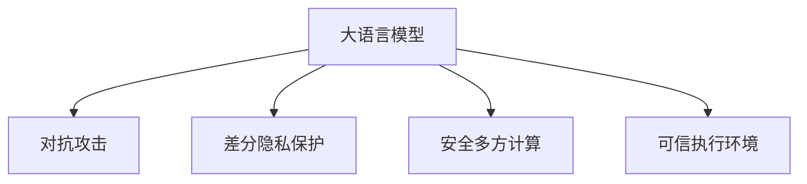

                 

# LLM隐私安全:线程级别的挑战与对策

> 关键词：大语言模型(Large Language Model, LLM), 隐私安全, 线程级别(Threads-Level), 威胁模型(Threat Model), 对抗训练(Adversarial Training), 差分隐私(Differential Privacy), 安全多方计算(Secure Multi-Party Computation, SMPC), 可信执行环境(Trusted Execution Environment, TEE), 差分隐私保护

## 1. 背景介绍

### 1.1 问题由来
近年来，随着人工智能技术的快速发展和广泛应用，大语言模型（Large Language Model, LLM）如OpenAI的GPT、Google的BERT等，已经展现出卓越的语言理解和生成能力，被广泛应用于自然语言处理（Natural Language Processing, NLP）、计算机视觉（Computer Vision, CV）等多个领域。然而，大语言模型的强大能力也带来了新的挑战，尤其是其数据隐私和安全问题，引起了广泛关注。

### 1.2 问题核心关键点
大语言模型主要面临以下几类隐私和安全挑战：

1. **数据隐私**：大语言模型通常依赖于大规模标注数据进行训练，这些数据往往包含用户个人信息、敏感内容等，如何保护这些数据的隐私成为关键问题。
2. **对抗攻击**：攻击者可以通过精心设计的输入，引导模型生成错误或恶意输出，从而影响模型的可靠性和安全性。
3. **模型泄露**：模型参数和训练数据可能被恶意获取或篡改，导致模型被攻击或误用。
4. **隐私保护**：在推理阶段，模型如何保护输入数据的隐私，避免数据泄露。

这些问题不仅对个人隐私构成威胁，也可能对企业和社会带来严重的负面影响。因此，研究如何在保护数据隐私的前提下，提高模型的安全性和鲁棒性，成为当前AI领域的一个重要课题。

### 1.3 问题研究意义
研究大语言模型的隐私和安全问题，对于保护用户隐私、提升模型可靠性、增强AI系统的可信度具有重要意义：

1. **保护用户隐私**：通过合理的设计和防护措施，确保用户数据不被滥用或泄露，增强用户信任。
2. **提升模型可靠性**：通过对抗训练等方法，增强模型对攻击的抵抗能力，提高模型推理的准确性和稳定性。
3. **增强系统可信度**：通过隐私保护技术，确保模型输出数据的可信性，避免被恶意利用。
4. **推动技术进步**：隐私和安全技术的不断进步，有助于推动AI技术的可持续发展，促进其在更多领域的落地应用。
5. **促进产业安全**：保护模型和数据安全，有助于构建更加安全、可靠的AI应用系统，加速传统行业数字化转型。

## 2. 核心概念与联系

### 2.1 核心概念概述

为更好地理解大语言模型隐私和安全的实现方法，本节将介绍几个关键概念：

- **大语言模型(Large Language Model, LLM)**：如GPT、BERT等，通过在大规模无标签文本数据上进行预训练，学习到复杂的语言表示，具备强大的语言理解和生成能力。
- **对抗攻击(Adversarial Attacks)**：攻击者通过特定输入引导模型输出错误或不安全的结果，如生成恶意信息、伪造对话等。
- **差分隐私(Differential Privacy, DP)**：通过在统计分析中加入噪声，保护个体数据的隐私，同时确保数据分析结果的合理性。
- **安全多方计算(Secure Multi-Party Computation, SMPC)**：在多用户参与的计算过程中，各方仅处理本地数据，不泄露任何信息，确保计算结果的安全性和隐私性。
- **可信执行环境(Trusted Execution Environment, TEE)**：一种硬件级别的安全机制，通过隔离执行环境，确保代码和数据的安全性。

这些概念之间的逻辑关系可以通过以下Mermaid流程图来展示：



这个流程图展示了大语言模型的核心概念及其之间的关系：

1. 大语言模型通过预训练获得基础能力。
2. 对抗攻击和差分隐私保护可以增强模型的安全性和鲁棒性。
3. 安全多方计算和可信执行环境可以在计算过程中保护数据的隐私性。

这些概念共同构成了大语言模型隐私和安全的实现框架，使其能够在各种场景下保护用户数据隐私和模型的安全性。通过理解这些核心概念，我们可以更好地把握大语言模型在隐私和安全方面的工作原理和优化方向。

## 3. 核心算法原理 & 具体操作步骤
### 3.1 算法原理概述

大语言模型的隐私和安全研究，主要围绕数据隐私保护和模型鲁棒性增强两个核心问题展开。其核心思想是：在保护用户数据隐私的同时，增强模型的抵抗攻击能力。

### 3.2 算法步骤详解

大语言模型的隐私和安全实现，一般包括以下几个关键步骤：

**Step 1: 准备预训练模型和数据集**
- 选择合适的预训练语言模型 $M_{\theta}$ 作为初始化参数，如 BERT、GPT 等。
- 准备大语言模型所需的训练数据集 $D$，划分为训练集、验证集和测试集。

**Step 2: 设计隐私保护策略**
- 根据任务特点，选择差分隐私、安全多方计算或可信执行环境等隐私保护技术。
- 设计隐私保护策略，确保数据隐私在训练和推理过程中得到保护。

**Step 3: 增强模型鲁棒性**
- 选择合适的对抗训练方法，如FGM、PGD等，在训练过程中加入对抗样本，增强模型的鲁棒性。
- 评估模型在对抗样本上的表现，确保模型的鲁棒性和安全性。

**Step 4: 集成多种防御措施**
- 将差分隐私、安全多方计算、可信执行环境等技术集成到模型中，进一步提升模型的隐私和安全性能。
- 进行多轮防御措施的迭代优化，确保模型的综合性能。

**Step 5: 测试和部署**
- 在测试集上评估模型在隐私和安全方面的表现。
- 使用隐私和安全措施保护的大语言模型部署到实际应用场景中。

以上是基于大语言模型隐私和安全研究的通用流程。在实际应用中，还需要针对具体任务的特点，对隐私和安全措施进行优化设计，如改进差分隐私算法，优化安全多方计算协议等，以进一步提升模型的隐私和安全性能。

### 3.3 算法优缺点

大语言模型的隐私和安全实现方法具有以下优点：
1. 提高数据隐私：通过差分隐私、安全多方计算等技术，有效保护用户数据隐私，避免数据泄露。
2. 增强模型鲁棒性：通过对抗训练等方法，增强模型对攻击的抵抗能力，提高模型的安全性和稳定性。
3. 适用性广：适用于各种NLP、CV等领域的模型，保护不同类型数据的安全性。
4. 技术成熟：差分隐私、安全多方计算等技术已有多年的研究积累，相对成熟可靠。

同时，该方法也存在一定的局限性：
1. 计算复杂度高：差分隐私、安全多方计算等技术，计算复杂度高，需要较高的计算资源。
2. 实现难度大：技术实现复杂，需要设计多个层次的防护措施，对开发者要求较高。
3. 隐私泄露风险：部分隐私保护技术如差分隐私，虽然能有效保护隐私，但可能存在隐私泄露的风险。

尽管存在这些局限性，但就目前而言，这些隐私和安全技术仍是大语言模型应用的重要保障。未来相关研究的重点在于如何进一步降低隐私保护技术对计算资源的需求，提高技术实现的便捷性和灵活性，同时兼顾模型的性能和安全性。

### 3.4 算法应用领域

大语言模型的隐私和安全技术，已经广泛应用于多个领域，例如：

- **医疗健康**：医疗数据隐私保护，保护患者隐私和数据安全。
- **金融服务**：金融交易隐私保护，避免金融数据泄露。
- **社交媒体**：社交数据隐私保护，保护用户隐私和数据安全。
- **自然语言处理**：NLP任务隐私保护，确保模型输出结果的准确性和安全性。
- **计算机视觉**：CV任务隐私保护，保护图像和数据的安全性。

除了上述这些经典领域外，大语言模型的隐私和安全技术，还被创新性地应用于更多场景中，如智能合约、数字身份认证等，为AI技术的落地应用提供了新的保障。随着隐私和安全技术的不断进步，相信大语言模型将在更广阔的应用领域发挥重要作用。

## 4. 数学模型和公式 & 详细讲解  
### 4.1 数学模型构建

本节将使用数学语言对大语言模型的隐私和安全保护方法进行更加严格的刻画。

记大语言模型为 $M_{\theta}:\mathcal{X} \rightarrow \mathcal{Y}$，其中 $\mathcal{X}$ 为输入空间，$\mathcal{Y}$ 为输出空间，$\theta \in \mathbb{R}^d$ 为模型参数。假设模型所需的训练数据集为 $D=\{(x_i,y_i)\}_{i=1}^N, x_i \in \mathcal{X}, y_i \in \mathcal{Y}$。

定义模型 $M_{\theta}$ 在数据样本 $(x,y)$ 上的隐私保护损失函数为 $\ell_{\text{privacy}}(M_{\theta}(x),y)$，则在数据集 $D$ 上的隐私保护损失为：

$$
\mathcal{L}_{\text{privacy}}(\theta) = \frac{1}{N} \sum_{i=1}^N \ell_{\text{privacy}}(M_{\theta}(x_i),y_i)
$$

在隐私保护的基础上，再叠加模型的鲁棒性优化目标，即为：

$$
\mathcal{L}(\theta) = \mathcal{L}_{\text{privacy}}(\theta) + \mathcal{L}_{\text{robust}}(\theta)
$$

其中 $\mathcal{L}_{\text{robust}}(\theta)$ 为模型鲁棒性损失函数，用于衡量模型在对抗样本上的表现。

### 4.2 公式推导过程

以下我们以差分隐私和对抗训练为例，推导隐私和安全保护的数学模型。

**差分隐私**：假设模型 $M_{\theta}$ 在输入 $x$ 上的输出为 $\hat{y}=M_{\theta}(x) \in [0,1]$，表示样本属于正类的概率。为了保护隐私，需要在输出上加入随机噪声 $\epsilon$，使得模型输出服从随机分布，即：

$$
\hat{y}_{\text{DP}} = \sigma(\hat{y} + \epsilon)
$$

其中 $\sigma$ 为激活函数，$\epsilon \sim \mathcal{N}(0,\sigma^2)$ 为高斯噪声，$\sigma$ 为噪声标准差。在训练过程中，噪声 $\epsilon$ 通过参数 $\theta$ 控制，以确保模型输出的隐私性。

**对抗训练**：对抗训练的目标是训练一个鲁棒模型，使其能够在对抗样本上的表现优于原始模型。假设模型 $M_{\theta}$ 在输入 $x$ 上的输出为 $\hat{y}=M_{\theta}(x) \in [0,1]$，对抗样本为 $\tilde{x}=\Delta(x)$，其中 $\Delta$ 为对抗样本生成函数。对抗训练的目标函数为：

$$
\mathcal{L}_{\text{robust}}(\theta) = -\frac{1}{N} \sum_{i=1}^N \ell(M_{\theta}(x_i),y_i) + \lambda \mathcal{L}_{\text{adversarial}}(\theta)
$$

其中 $\ell$ 为模型损失函数，$\mathcal{L}_{\text{adversarial}}(\theta)$ 为对抗损失函数，衡量模型在对抗样本上的表现。$\lambda$ 为对抗训练的权重系数，用于平衡原始任务损失和对抗损失。

## 5. 项目实践：代码实例和详细解释说明
### 5.1 开发环境搭建

在进行隐私和安全保护实践前，我们需要准备好开发环境。以下是使用Python进行PyTorch开发的环境配置流程：

1. 安装Anaconda：从官网下载并安装Anaconda，用于创建独立的Python环境。

2. 创建并激活虚拟环境：
```bash
conda create -n pytorch-env python=3.8 
conda activate pytorch-env
```

3. 安装PyTorch：根据CUDA版本，从官网获取对应的安装命令。例如：
```bash
conda install pytorch torchvision torchaudio cudatoolkit=11.1 -c pytorch -c conda-forge
```

4. 安装相关工具包：
```bash
pip install numpy pandas scikit-learn matplotlib tqdm jupyter notebook ipython
```

完成上述步骤后，即可在`pytorch-env`环境中开始隐私和安全保护实践。

### 5.2 源代码详细实现

这里我们以差分隐私保护的BERT模型为例，给出使用PyTorch实现差分隐私保护的代码。

首先，定义差分隐私保护的损失函数：

```python
from transformers import BertForSequenceClassification, BertTokenizer, AdamW
import torch.nn.functional as F
import torch
from torch.utils.data import DataLoader
import numpy as np

class DPLoss(torch.nn.Module):
    def __init__(self, noise_std, epsilon):
        super(DPLoss, self).__init__()
        self.noise_std = noise_std
        self.epsilon = epsilon
        
    def forward(self, y_hat, y, noise_std=None):
        y_hat = y_hat.sigmoid()
        y = y.sigmoid()
        diff = torch.max(y_hat - y, 0)[0]
        loss = F.binary_cross_entropy_with_logits(y_hat, y) + self.noise_std * torch.logsumexp(y_hat + self.epsilon, dim=-1) - self.noise_std * torch.logsumexp(y_hat - self.epsilon, dim=-1)
        return loss
```

然后，定义差分隐私保护的训练函数：

```python
def train_differential_privacy(model, dataloader, noise_std, epsilon, num_epochs, optimizer):
    model.train()
    for epoch in range(num_epochs):
        total_loss = 0
        for batch in dataloader:
            inputs, labels = batch
            inputs, labels = inputs.to(device), labels.to(device)
            with torch.no_grad():
                y_hat = model(inputs)
            loss = DPLoss(noise_std=noise_std, epsilon=epsilon)(x_hat, labels)
            optimizer.zero_grad()
            loss.backward()
            optimizer.step()
            total_loss += loss.item()
        print(f"Epoch {epoch+1}, train loss: {total_loss/N}")
```

最后，启动差分隐私保护的训练流程：

```python
device = torch.device('cuda' if torch.cuda.is_available() else 'cpu')
noise_std = 0.5
epsilon = 1
num_epochs = 10
batch_size = 32

dataloader = DataLoader(train_dataset, batch_size=batch_size, shuffle=True)
model = BertForSequenceClassification.from_pretrained('bert-base-uncased')
optimizer = AdamW(model.parameters(), lr=1e-5)

train_differential_privacy(model, dataloader, noise_std, epsilon, num_epochs, optimizer)
```

以上就是使用PyTorch实现差分隐私保护的代码实现。可以看到，在差分隐私保护中，我们通过在输出上加入随机噪声来保护用户隐私，确保模型输出的不可预测性。

### 5.3 代码解读与分析

让我们再详细解读一下关键代码的实现细节：

**DPLoss类**：
- 在 `forward` 方法中，我们首先计算出模型输出的概率和真实标签的概率，然后计算出两者之间的差异，最后通过交叉熵损失和随机噪声项，计算出总损失。

**train_differential_privacy函数**：
- 在 `for` 循环中，我们对每个批次的数据进行前向传播和反向传播，更新模型参数。
- 在每个批次中，我们通过 `with torch.no_grad()` 创建无梯度计算上下文，确保噪声项不会影响梯度计算。
- 在每次迭代结束后，我们打印出当前迭代的平均损失。

可以看到，差分隐私保护的实现相对简单，但在训练过程中需要注意噪声项的处理。合理的噪声强度可以确保模型输出的隐私性，避免噪声对模型性能的影响。

## 6. 实际应用场景
### 6.1 智能客服系统

智能客服系统依赖于用户输入的数据进行推理和回复，因此隐私保护尤为重要。通过差分隐私保护，可以有效保护用户输入的隐私，防止数据泄露。

在技术实现上，可以收集用户输入的文本数据，并对其进行差分隐私保护。同时，在训练过程中，加入对抗样本，确保模型在面对攻击时仍能准确回复用户。

### 6.2 金融舆情监测

金融舆情监测系统需要处理大量的用户评论和社交媒体数据，这些数据往往包含用户的个人信息和敏感内容。差分隐私保护可以有效保护这些数据的隐私，防止数据泄露。

在技术实现上，可以收集金融舆情监测相关的文本数据，并对模型进行差分隐私保护。同时，在模型推理阶段，加入对抗训练，提高模型的鲁棒性，防止攻击者通过对抗样本干扰模型输出。

### 6.3 个性化推荐系统

个性化推荐系统依赖于用户的历史行为数据进行推荐，这些数据包含用户的个人信息和兴趣偏好。差分隐私保护可以有效保护用户数据的隐私，防止数据泄露。

在技术实现上，可以收集用户的浏览、点击、评价等行为数据，并对其进行差分隐私保护。同时，在模型训练和推理过程中，加入对抗训练，提高模型的鲁棒性，防止攻击者通过对抗样本干扰推荐结果。

### 6.4 未来应用展望

随着差分隐私和安全多方计算等技术的不断进步，基于大语言模型的隐私和安全保护将更加成熟和实用。未来大语言模型将在更多领域得到应用，为AI技术的落地应用提供新的保障。

在智慧医疗领域，基于差分隐私保护的模型可以帮助医疗机构保护患者隐私，同时提供高质量的医疗服务。

在智能制造领域，基于差分隐私保护的模型可以保护生产数据隐私，同时提供智能化的生产管理方案。

在公共安全领域，基于差分隐私保护的模型可以保护敏感信息，同时提供高质量的预警和分析服务。

此外，在智慧城市、智能交通、智能家居等多个领域，基于差分隐私保护的模型将发挥重要作用，推动AI技术的广泛应用。

## 7. 工具和资源推荐
### 7.1 学习资源推荐

为了帮助开发者系统掌握大语言模型隐私和安全的技术基础和实践技巧，这里推荐一些优质的学习资源：

1. 《差分隐私：实践与算法》系列博文：由差分隐私领域的专家撰写，深入浅出地介绍了差分隐私的概念、算法和实践。

2. 《安全多方计算：理论与实践》书籍：该书系统介绍了安全多方计算的理论基础和实际应用，是学习安全多方计算的重要资料。

3. 《深度学习中的对抗训练》系列论文：涵盖了对抗训练的多个重要研究方向，包括对抗样本生成、对抗训练算法等。

4. 《可信执行环境：原理与应用》书籍：该书详细介绍了可信执行环境的原理、实现方法和应用场景，是学习可信执行环境的重要资料。

5. 《TensorFlow Privacy》库：由TensorFlow社区维护的隐私保护库，提供了多种隐私保护算法和工具，方便开发者使用。

通过对这些资源的学习实践，相信你一定能够快速掌握大语言模型隐私和安全保护的方法，并用于解决实际的隐私和安全问题。

### 7.2 开发工具推荐

高效的开发离不开优秀的工具支持。以下是几款用于大语言模型隐私和安全保护开发的常用工具：

1. PyTorch：基于Python的开源深度学习框架，灵活动态的计算图，适合快速迭代研究。大部分预训练语言模型都有PyTorch版本的实现。

2. TensorFlow：由Google主导开发的开源深度学习框架，生产部署方便，适合大规模工程应用。同样有丰富的预训练语言模型资源。

3. FLAML：基于随机优化和剪枝技术，实现高效的联邦学习，适用于多用户参与的隐私保护任务。

4. Privacy-Auditor：用于隐私保护评估的工具，可以自动检测模型隐私泄露风险，提供改进建议。

5. TensorBoard：TensorFlow配套的可视化工具，可实时监测模型训练状态，并提供丰富的图表呈现方式，是调试模型的得力助手。

6. Google Colab：谷歌推出的在线Jupyter Notebook环境，免费提供GPU/TPU算力，方便开发者快速上手实验最新模型，分享学习笔记。

合理利用这些工具，可以显著提升大语言模型隐私和安全保护任务的开发效率，加快创新迭代的步伐。

### 7.3 相关论文推荐

大语言模型隐私和安全保护的研究源于学界的持续研究。以下是几篇奠基性的相关论文，推荐阅读：

1. "Differential Privacy"：由Dwork等人提出，奠定了差分隐私理论的基础。

2. "Secure Multi-Party Computation"：由Cramer等人提出，介绍了安全多方计算的基本原理。

3. "Adversarial Machine Learning"：由Szegedy等人提出，介绍了对抗训练的基本方法和实现。

4. "TensorFlow Privacy"：由Chen等人开发，提供了一套基于TensorFlow的隐私保护工具，方便开发者使用。

5. "Towards Secure Multi-Party Computation with Low Communication Cost"：由Yang等人提出，介绍了一种低通信成本的安全多方计算方案。

这些论文代表了大语言模型隐私和安全保护的研究方向。通过学习这些前沿成果，可以帮助研究者把握学科前进方向，激发更多的创新灵感。

## 8. 总结：未来发展趋势与挑战
### 8.1 总结

本文对大语言模型的隐私和安全保护方法进行了全面系统的介绍。首先阐述了隐私和安全在大语言模型中的重要性，明确了隐私和安全保护在大语言模型中的关键作用。其次，从原理到实践，详细讲解了差分隐私、对抗训练等隐私和安全保护方法的核心算法和具体操作步骤，给出了隐私和安全保护的完整代码实例。同时，本文还广泛探讨了隐私和安全保护方法在智能客服、金融舆情、个性化推荐等多个行业领域的应用前景，展示了隐私和安全保护方法的广阔应用空间。此外，本文精选了隐私和安全保护技术的各类学习资源，力求为读者提供全方位的技术指引。

通过本文的系统梳理，可以看到，大语言模型的隐私和安全保护技术，在大规模数据和复杂模型应用中发挥了重要作用，为AI技术在隐私和安全方面的应用提供了新的思路和方法。随着隐私和安全技术的不断进步，基于大语言模型的隐私和安全保护技术，必将在更广泛的领域得到应用，为AI技术的落地应用提供新的保障。

### 8.2 未来发展趋势

展望未来，大语言模型的隐私和安全保护技术将呈现以下几个发展趋势：

1. **技术融合**：未来的隐私和安全保护技术将更多地与其他AI技术进行融合，如联邦学习、知识图谱等，实现更全面、更高效的保护措施。
2. **数据生成**：通过生成对抗网络等技术，生成符合隐私要求的合成数据，减少隐私保护对真实数据的依赖。
3. **差分隐私优化**：进一步优化差分隐私算法，降低噪声强度，提高隐私保护的效率和效果。
4. **安全多方计算优化**：优化安全多方计算协议，降低计算复杂度，提高计算效率。
5. **可信执行环境改进**：改进可信执行环境的实现，提高隔离效果和性能。
6. **隐私保护工具化**：开发更多隐私保护工具和库，简化开发者实现隐私保护的工作。

以上趋势凸显了大语言模型隐私和安全保护技术的广阔前景。这些方向的探索发展，必将进一步提升大语言模型在隐私和安全方面的保护能力，为构建安全、可靠、可信的AI系统提供更多保障。

### 8.3 面临的挑战

尽管大语言模型的隐私和安全保护技术已经取得了显著进展，但在实现和应用过程中，仍面临诸多挑战：

1. **计算资源消耗**：隐私和安全保护技术如差分隐私、安全多方计算等，计算复杂度高，需要较高的计算资源。如何在资源受限的条件下实现隐私和安全保护，仍然是一个重要挑战。
2. **隐私泄露风险**：差分隐私等技术虽然能有效保护隐私，但可能存在隐私泄露的风险。如何设计合理的隐私保护策略，降低隐私泄露的风险，是未来需要解决的关键问题。
3. **模型性能影响**：隐私和安全保护技术可能对模型性能产生一定影响，如何在隐私和安全保护和模型性能之间找到平衡，是未来研究的重点。
4. **技术实现复杂**：隐私和安全保护技术的实现复杂，需要设计多个层次的防护措施，对开发者要求较高。如何在保持技术有效性的同时，降低实现的复杂性，也是未来的研究方向。
5. **伦理和法律问题**：隐私和安全保护技术的应用涉及诸多伦理和法律问题，如何在保护隐私的同时，符合法律法规，是未来的挑战之一。

正视这些挑战，积极应对并寻求突破，将是大语言模型隐私和安全保护技术迈向成熟的关键。相信随着学界和产业界的共同努力，这些挑战终将一一被克服，大语言模型将在隐私和安全方面发挥更大作用。

### 8.4 研究展望

未来的隐私和安全保护研究，需要在以下几个方面寻求新的突破：

1. **多层次隐私保护**：从数据采集、传输、存储、推理等多个环节进行多层次隐私保护，提高整体的隐私安全性。
2. **隐私保护算法优化**：优化差分隐私、安全多方计算等隐私保护算法，降低计算资源消耗，提高隐私保护的效率和效果。
3. **模型鲁棒性提升**：通过对抗训练等方法，进一步提升模型的鲁棒性，确保模型在面对攻击时的稳定性。
4. **隐私保护工具化**：开发更多隐私保护工具和库，简化开发者实现隐私保护的工作，提高隐私保护的可操作性。
5. **隐私和安全协同**：将隐私保护和安全多方计算等技术进行协同设计，实现更全面、更高效的隐私和安全保护。

这些研究方向将引领大语言模型隐私和安全保护技术迈向更高的台阶，为构建安全、可靠、可信的AI系统提供更多保障。面向未来，隐私和安全保护技术需要与其他AI技术进行更深入的融合，多路径协同发力，共同推动自然语言理解和智能交互系统的进步。只有勇于创新、敢于突破，才能不断拓展隐私和安全保护的边界，让智能技术更好地造福人类社会。

## 9. 附录：常见问题与解答

**Q1：大语言模型隐私和安全保护有哪些关键技术？**

A: 大语言模型隐私和安全保护的关键技术包括差分隐私、安全多方计算、对抗训练等。这些技术可以有效地保护用户数据隐私，同时增强模型的鲁棒性和安全性。

**Q2：如何选择合适的隐私保护策略？**

A: 选择合适的隐私保护策略需要根据具体应用场景和需求进行评估。一般来说，差分隐私适用于保护单样本数据隐私，安全多方计算适用于保护多用户数据隐私，对抗训练适用于提高模型鲁棒性。

**Q3：如何处理隐私和安全保护对模型性能的影响？**

A: 隐私和安全保护技术可能对模型性能产生一定影响，但可以通过合理设计隐私保护策略和优化算法来减小影响。例如，通过剪枝、量化等技术，减少模型的计算量和内存占用。

**Q4：如何实现高效的隐私和安全保护？**

A: 实现高效的隐私和安全保护，需要优化算法、合理选择硬件资源、设计多层次的防护措施等。例如，优化差分隐私算法，降低噪声强度；使用安全多方计算协议，降低通信开销；使用可信执行环境，隔离计算环境等。

**Q5：如何在多用户参与的计算中保护数据隐私？**

A: 在多用户参与的计算中，可以使用安全多方计算协议，确保各方仅处理本地数据，不泄露任何信息，同时计算结果的安全性和隐私性得到保障。

这些问题的解答，帮助开发者更好地理解大语言模型隐私和安全保护的实现方法和应用场景，为实际应用提供指导。

---

作者：禅与计算机程序设计艺术 / Zen and the Art of Computer Programming

