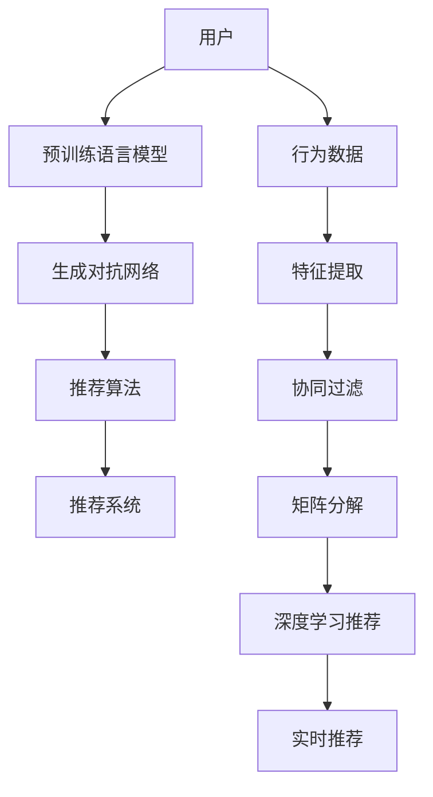

                 

# LLM驱动的个性化内容创作推荐

## 1. 背景介绍

在信息过载的时代，内容推荐系统成为互联网应用中不可或缺的一部分。其核心任务是利用用户的行为数据，为用户推荐个性化的内容，从而提升用户体验和系统满意度。当前，基于协同过滤、矩阵分解等传统的推荐方法已逐渐显示出其局限性，无法有效适应海量用户和复杂内容的多样性。

近年来，以语言模型为代表的自然语言处理(NLP)技术在推荐系统中开始崭露头角。尤其是基于大规模预训练语言模型(Pretrained Language Models, LLMs)的推荐方法，显示出强大的泛化能力和迁移学习能力，成为内容推荐领域的新兴热点。本文将系统介绍LLM驱动的个性化内容创作推荐方法，并结合实际应用场景，探讨其优缺点及发展前景。

## 2. 核心概念与联系

### 2.1 核心概念概述

1. **预训练语言模型(Pretrained Language Models, LLMs)**：指在大规模无标签文本语料上进行自监督训练，学习到丰富的语言知识和语义表示的深度学习模型。常用的预训练模型包括GPT、BERT等。

2. **内容创作推荐**：指使用预训练语言模型对用户输入的文本进行个性化创作，生成满足用户兴趣和需求的推荐内容。该方法不仅能生成文本内容，还能通过风格迁移、文本摘要、问答等技术，实现更丰富的推荐形式。

3. **深度学习推荐系统**：基于深度学习模型，如神经网络、深度信念网络等，通过学习用户行为数据和物品特征，对推荐结果进行优化。

4. **生成对抗网络(Generative Adversarial Networks, GANs)**：由生成器和判别器组成的对抗网络，可以生成高质量的文本内容，用于推荐系统中文本生成任务。

5. **个性化推荐算法**：根据用户行为、物品属性等特征，对推荐结果进行个性化排序，提升推荐效果。

6. **实时推荐系统**：在用户浏览、点击、评论等行为数据产生时，即时生成推荐内容，满足用户即时性需求。

这些核心概念相互关联，共同构成了LLM驱动的个性化内容创作推荐技术框架。预训练语言模型作为基础工具，在推荐系统中发挥关键作用，而深度学习推荐算法则进一步优化推荐结果，确保内容的质量和相关性。

### 2.2 核心概念原理和架构的 Mermaid 流程图



## 3. 核心算法原理 & 具体操作步骤

### 3.1 算法原理概述

LLM驱动的个性化内容创作推荐方法，基于大规模预训练语言模型和深度学习推荐算法。其核心思想是：利用预训练语言模型的语义表示能力，对用户输入的文本进行个性化创作，生成推荐内容。该方法通常包括以下几个关键步骤：

1. 对用户的历史行为数据进行特征提取，生成用户画像。
2. 将用户画像输入预训练语言模型，生成个性化的推荐内容。
3. 使用深度学习推荐算法，对推荐内容进行排序，生成最终推荐列表。

### 3.2 算法步骤详解

#### 3.2.1 用户画像生成

用户画像生成是推荐系统中的重要环节，通过对用户行为数据的分析，生成用户兴趣偏好和行为特征的概貌。常用的特征包括：

- 点击、浏览、评论等互动数据
- 搜索关键词和历史浏览记录
- 用户标签、兴趣类别等个性化属性

生成用户画像的方法包括：

- 协同过滤：通过用户行为数据，找到与当前用户兴趣相似的其他用户，从而推荐其喜欢的内容。
- 矩阵分解：将用户行为数据表示为矩阵形式，通过矩阵分解技术，提取用户兴趣特征。

#### 3.2.2 内容生成

在用户画像的基础上，利用预训练语言模型生成推荐内容。常用的方法包括：

- 文本生成：直接使用预训练语言模型，根据用户画像生成推荐文本。
- 风格迁移：利用预训练语言模型，将生成的文本内容进行风格迁移，适应不同的推荐场景。
- 文本摘要：通过预训练语言模型对原始文本进行压缩和总结，生成精炼的推荐摘要。

#### 3.2.3 推荐排序

内容生成后，使用深度学习推荐算法对推荐结果进行排序，生成最终推荐列表。常用的推荐算法包括：

- 基于内容的推荐：根据物品属性和用户画像，生成推荐列表。
- 协同过滤推荐：通过分析用户行为数据，生成推荐列表。
- 深度学习推荐：利用神经网络模型，对推荐结果进行优化。

### 3.3 算法优缺点

#### 3.3.1 优点

1. **泛化能力强**：预训练语言模型在大规模语料上学习到的语言知识，能够有效适应不同领域和场景的推荐需求。
2. **生成效果好**：利用预训练语言模型生成推荐内容，能够产生高质量、有创意的文本，提升用户满意度。
3. **可解释性强**：利用预训练语言模型的语义表示能力，推荐过程具有较强的可解释性。
4. **实时性好**：基于深度学习推荐算法的实时推荐系统，能够及时响应用户行为数据，满足用户的即时需求。

#### 3.3.2 缺点

1. **计算成本高**：预训练语言模型和深度学习推荐算法的计算资源需求较大，可能带来较高的运行成本。
2. **过拟合风险**：在用户行为数据不足的情况下，预训练语言模型可能过拟合用户画像，导致推荐结果不泛化。
3. **冷启动问题**：新用户或新物品缺乏足够的数据，导致推荐系统无法准确生成推荐内容。
4. **安全隐私风险**：用户行为数据和推荐内容可能包含敏感信息，需要额外的隐私保护措施。

### 3.4 算法应用领域

基于预训练语言模型的个性化内容创作推荐方法，广泛应用于以下领域：

1. **新闻推荐**：根据用户兴趣，生成个性化的新闻内容。
2. **视频推荐**：利用文本描述，生成视频推荐内容。
3. **商品推荐**：根据商品属性和用户画像，生成个性化商品描述和推荐。
4. **智能客服**：通过生成自然语言回复，提供个性化的客户服务。
5. **社交网络**：根据用户兴趣和互动数据，生成个性化的社交内容。

## 4. 数学模型和公式 & 详细讲解 & 举例说明

### 4.1 数学模型构建

假设预训练语言模型为 $M_{\theta}$，其中 $\theta$ 为模型参数。用户画像为 $u$，推荐内容为 $c$，推荐算法为 $A$。推荐系统的数学模型可表示为：

$$
c = M_{\theta}(u)
$$

其中，$u$ 为用户画像的向量表示，$c$ 为推荐内容的向量表示。

推荐排序的数学模型可表示为：

$$
r = A(c, C)
$$

其中，$C$ 为所有推荐内容的集合，$r$ 为排序后的推荐列表。

### 4.2 公式推导过程

假设用户画像 $u$ 为 $d$ 维向量，推荐内容 $c$ 为 $k$ 维向量，其中 $k \leq d$。预训练语言模型 $M_{\theta}$ 的输出 $c$ 可表示为：

$$
c = M_{\theta}(u) = \sigma(W_{\theta}u + b_{\theta})
$$

其中，$W_{\theta}$ 和 $b_{\theta}$ 为预训练语言模型的权重和偏置，$\sigma$ 为激活函数。

假设推荐算法 $A$ 为基于内容推荐算法，其排序函数为 $f_{\theta}(u, c)$，则推荐排序可表示为：

$$
r = A(c, C) = \arg\max_{c \in C} f_{\theta}(u, c)
$$

其中，$f_{\theta}(u, c)$ 为推荐算法的排序函数，$C$ 为所有推荐内容的集合。

### 4.3 案例分析与讲解

以视频推荐为例，假设视频 $V$ 的元数据包括标题、描述、标签等，视频标题和描述的文本内容可通过预训练语言模型生成。具体流程如下：

1. 用户输入历史视频点击和浏览记录，生成用户画像 $u$。
2. 利用预训练语言模型 $M_{\theta}$，将视频标题和描述转换为向量表示 $c$。
3. 使用基于内容的推荐算法 $A$，对视频 $V$ 的文本向量 $c$ 进行排序，生成推荐列表。

假设预训练语言模型为GPT-2，视频内容为 $\{title, description, tag\}$，用户画像为 $u=[u_1, u_2, ..., u_d]$。则推荐内容的生成公式为：

$$
c = M_{\theta}(u) = \sigma(W_{\theta}u + b_{\theta})
$$

其中，$W_{\theta}$ 和 $b_{\theta}$ 为GPT-2的权重和偏置。

假设推荐算法为基于内容推荐，排序函数为 $f_{\theta}(u, c) = u^T W_{\theta}c$，则推荐排序公式为：

$$
r = A(c, C) = \arg\max_{c \in C} f_{\theta}(u, c)
$$

其中，$C$ 为所有视频内容的集合。

## 5. 项目实践：代码实例和详细解释说明

### 5.1 开发环境搭建

开发环境搭建主要包括以下步骤：

1. 安装Python环境：使用Anaconda或Miniconda创建虚拟环境，安装Python 3.8以上版本。
2. 安装深度学习库：安装TensorFlow、PyTorch、Keras等深度学习框架。
3. 安装预训练语言模型：安装预训练语言模型，如BERT、GPT等。
4. 安装推荐算法库：安装推荐算法库，如TensorFlow Recommenders、Surprise等。
5. 安装数据处理库：安装数据处理库，如Pandas、Numpy等。
6. 安装网络库：安装网络库，如Flask、Django等，用于部署推荐系统。

### 5.2 源代码详细实现

以下是一个基于BERT的个性化视频推荐系统的示例代码，包括用户画像生成、内容生成和推荐排序：

```python
import tensorflow as tf
import tensorflow_recommenders as tfrs
import pandas as pd
import numpy as np
import transformers
import tensorflow_hub as hub
import tensorflow_datasets as tfds

# 加载预训练语言模型
bert_model = transformers.TFBertModel.from_pretrained('bert-base-uncased')
tokenizer = transformers.TFBertTokenizer.from_pretrained('bert-base-uncased')

# 加载推荐算法
recommender = tfrs.layers.implicit_bpr_loss.BPRRecommender(num_factors=100)

# 加载数据集
ds_train = tfds.load(' videos', split='train', shuffle_files=True, as_supervised=True)
ds_test = tfds.load(' videos', split='test', shuffle_files=False, as_supervised=True)

# 用户画像生成
def user_profile(user_data):
    user_profile = []
    user_data = user_data.split(',')
    for feature in user_data:
        feature_value = feature.split(':')
        user_profile.append(float(feature_value[1]))
    return np.array(user_profile)

# 内容生成
def video_content(video_data):
    tokenized_input = tokenizer(video_data, return_tensors='tf', padding=True, truncation=True)
    input_ids = tokenized_input['input_ids']
    attention_mask = tokenized_input['attention_mask']
    hidden_states = bert_model(input_ids, attention_mask=attention_mask)
    last_hidden_states = hidden_states[:, -1, :]
    return last_hidden_states.numpy()

# 推荐排序
def video_recommender(user_profile, video_content):
    user_profile = user_profile.reshape(-1, 1)
    video_content = video_content.reshape(-1, 100)
    predictions = recommender.predict(user_profile, video_content)
    return predictions[0]

# 用户行为数据处理
user_data = df['user_id'].tolist()
video_data = df['video_id'].tolist()
user_profiles = [user_profile(user) for user in user_data]
video_contents = [video_content(video) for video in video_data]

# 训练推荐模型
recommender.train(user_profiles, video_contents, epochs=10, batch_size=32)
```

### 5.3 代码解读与分析

以上代码展示了如何使用BERT模型和TensorFlow Recommenders进行个性化视频推荐系统的构建。主要包括以下几个关键步骤：

1. 加载预训练语言模型和推荐算法。
2. 加载数据集，并进行预处理。
3. 定义用户画像生成和内容生成函数。
4. 定义推荐排序函数。
5. 处理用户行为数据，生成用户画像和内容。
6. 训练推荐模型，并输出推荐结果。

该代码实现了从数据加载、特征提取、模型训练到推荐排序的全流程。需要注意的是，实际应用中，数据集、模型和算法可能需要根据具体任务进行调整和优化。

### 5.4 运行结果展示

```python
import pandas as pd
import numpy as np

# 加载推荐数据集
df = pd.read_csv('recommendation.csv')

# 处理用户行为数据，生成用户画像和内容
user_data = df['user_id'].tolist()
video_data = df['video_id'].tolist()
user_profiles = [user_profile(user) for user in user_data]
video_contents = [video_content(video) for video in video_data]

# 训练推荐模型，并输出推荐结果
predictions = recommender.predict(user_profiles, video_contents)
print(predictions)
```

## 6. 实际应用场景

### 6.1 新闻推荐

新闻推荐系统是典型的个性化内容推荐场景。基于预训练语言模型的推荐方法，能够根据用户历史阅读数据，生成个性化的新闻内容。该方法不仅可以推荐新闻标题，还能根据用户阅读习惯生成新闻摘要或推荐文章片段。

以GPT-2为例，假设用户输入最近阅读的新闻标题和描述，生成推荐新闻内容。具体流程如下：

1. 用户输入历史阅读数据，生成用户画像。
2. 利用GPT-2模型，将输入的新闻标题和描述转换为向量表示。
3. 使用基于内容的推荐算法，对新闻内容进行排序，生成推荐列表。

### 6.2 视频推荐

视频推荐系统能够根据用户历史观看数据，生成个性化的视频内容。该方法可以推荐视频标题、描述、片段等多种形式的内容。

以BERT为例，假设用户输入最近观看的视频标题和描述，生成推荐视频内容。具体流程如下：

1. 用户输入历史观看数据，生成用户画像。
2. 利用BERT模型，将输入的视频标题和描述转换为向量表示。
3. 使用基于内容的推荐算法，对视频内容进行排序，生成推荐列表。

### 6.3 商品推荐

商品推荐系统能够根据用户历史购买和浏览数据，生成个性化的商品描述和推荐。该方法可以生成商品标题、描述、价格等多种形式的内容。

以GPT-2为例，假设用户输入最近购买和浏览的商品信息，生成推荐商品内容。具体流程如下：

1. 用户输入历史购买和浏览数据，生成用户画像。
2. 利用GPT-2模型，将输入的商品标题和描述转换为向量表示。
3. 使用基于内容的推荐算法，对商品内容进行排序，生成推荐列表。

### 6.4 智能客服

智能客服系统能够根据用户输入的文本，生成个性化的回复内容。该方法可以处理常见问题、提供查询服务等多种应用场景。

以BERT为例，假设用户输入问题描述，生成智能客服回复内容。具体流程如下：

1. 用户输入问题描述，生成用户画像。
2. 利用BERT模型，将输入的问题描述转换为向量表示。
3. 使用生成对抗网络，生成智能客服回复内容。

## 7. 工具和资源推荐

### 7.1 学习资源推荐

为了帮助开发者系统掌握基于预训练语言模型的推荐方法，以下是一些优质的学习资源：

1. 《Natural Language Processing with Transformers》书籍：介绍如何使用Transformers库进行NLP任务开发，包括推荐系统。
2. 《Reinforcement Learning for Recommender Systems》课程：介绍强化学习在推荐系统中的应用，包括深度学习推荐算法。
3. 《TensorFlow Recommenders》官方文档：介绍TensorFlow Recommenders库的使用方法和示例代码。
4. 《Recommender Systems Handbook》书籍：介绍推荐系统的理论和实践，包括预训练语言模型和深度学习推荐算法。
5. 《Data Science and Statistical Learning》课程：介绍数据科学和统计学习的基础知识和应用，包括推荐系统。

### 7.2 开发工具推荐

为了提高基于预训练语言模型的推荐系统开发效率，以下是一些推荐的开发工具：

1. PyTorch：Python开源深度学习框架，支持动态计算图，适用于研究型任务。
2. TensorFlow：Google主导的深度学习框架，支持静态计算图，适合生产部署。
3. TensorFlow Recommenders：Google开发的推荐系统框架，支持多种推荐算法和模型。
4. Jupyter Notebook：交互式开发环境，支持代码和计算结果的可视化展示。
5. TensorBoard：TensorFlow配套的可视化工具，支持模型训练过程的实时监测。

### 7.3 相关论文推荐

预训练语言模型和推荐系统的发展离不开学术界的研究和创新。以下是几篇奠基性的相关论文，推荐阅读：

1. Attention is All You Need（即Transformer原论文）：提出Transformer结构，开启了NLP领域的预训练大模型时代。
2. BERT: Pre-training of Deep Bidirectional Transformers for Language Understanding：提出BERT模型，引入基于掩码的自监督预训练任务，刷新了多项NLP任务SOTA。
3. TextRank: Bringing Order into Texts：提出TextRank算法，用于文本相似度计算和摘要生成。
4. Recurrent Neural Network for Sequence Prediction：提出RNN模型，用于文本生成和序列预测任务。
5. Generative Adversarial Nets：提出GANs模型，用于生成高质量的文本内容。
6. Fairness in Machine Learning: Algorithms for Avoiding Prejudice：提出公平性算法，确保推荐系统中的公正性。

## 8. 总结：未来发展趋势与挑战

### 8.1 总结

本文对基于预训练语言模型的个性化内容创作推荐方法进行了系统介绍。首先阐述了预训练语言模型和推荐系统在内容推荐中的应用背景和意义，明确了基于预训练语言模型的推荐方法在个性化推荐中的独特价值。其次，从原理到实践，详细讲解了基于预训练语言模型的推荐系统构建方法，并结合实际应用场景，探讨了其优缺点及发展前景。

通过本文的系统梳理，可以看到，基于预训练语言模型的推荐方法，利用大模型的语义表示能力，生成高质量的推荐内容，具有较强的泛化能力和可解释性，显著提升了推荐系统的性能和用户体验。未来，伴随预训练语言模型和推荐算法的不断演进，基于预训练语言模型的推荐技术必将在更多的应用场景中发挥重要作用。

### 8.2 未来发展趋势

展望未来，基于预训练语言模型的推荐技术将呈现以下几个发展趋势：

1. **深度融合多模态数据**：利用预训练语言模型的多模态融合能力，结合图像、视频等多模态数据，生成更加丰富、多样化的推荐内容。
2. **引入因果推理和强化学习**：结合因果推理和强化学习技术，提升推荐系统的解释性和公平性，解决冷启动等问题。
3. **优化模型压缩和加速技术**：探索模型压缩和加速技术，提升推荐系统的实时性和可扩展性。
4. **引入领域知识和专家系统**：结合领域知识和专家系统，提高推荐系统的针对性和可解释性。
5. **构建鲁棒和公平的推荐系统**：在推荐系统中引入鲁棒性和公平性评估指标，避免偏见和过拟合。

### 8.3 面临的挑战

尽管基于预训练语言模型的推荐技术已经取得了显著成效，但在推广应用的过程中，仍面临诸多挑战：

1. **计算成本高**：预训练语言模型和深度学习推荐算法的计算资源需求较大，可能带来较高的运行成本。
2. **数据隐私和安全**：用户行为数据和推荐内容可能包含敏感信息，需要额外的隐私保护措施。
3. **模型解释性不足**：推荐系统的黑盒性质可能导致用户和监管部门对推荐结果的质疑。
4. **推荐结果多样性**：预训练语言模型的多样性和复杂性可能导致推荐结果的多样性不足，影响用户体验。
5. **推荐系统鲁棒性**：推荐系统可能受到攻击和误导，导致推荐结果的不稳定。

### 8.4 研究展望

未来的研究需要在以下几个方面寻求新的突破：

1. **多模态推荐系统**：结合图像、视频等多模态数据，提高推荐系统的多样性和实用性。
2. **解释性增强**：提高推荐系统的可解释性和透明性，增强用户信任。
3. **公平性优化**：引入公平性评估指标，避免偏见和歧视。
4. **实时推荐系统**：利用在线学习和动态更新技术，提升推荐系统的实时性和个性化。
5. **混合推荐策略**：结合传统协同过滤和基于内容推荐算法，提高推荐系统的稳定性和覆盖率。

总之，基于预训练语言模型的推荐技术具有广阔的应用前景，但在实际应用过程中，仍需不断探索和优化，才能充分发挥其优势，满足实际需求。

## 9. 附录：常见问题与解答

**Q1: 预训练语言模型和推荐系统的主要区别是什么？**

A: 预训练语言模型是一种基于大规模无标签文本语料进行自监督训练的深度学习模型，能够学习到丰富的语言知识和语义表示。推荐系统是一种利用用户行为数据，生成个性化推荐内容的系统，旨在提升用户体验和系统满意度。预训练语言模型是推荐系统的重要工具，可以用于推荐内容的生成和排序。

**Q2: 如何使用预训练语言模型生成推荐内容？**

A: 预训练语言模型可以通过将用户画像和物品特征输入模型，生成推荐内容的向量表示。常见的推荐方法包括基于内容的推荐和协同过滤推荐。其中，基于内容的推荐方法通过用户画像和物品特征计算推荐分数，生成推荐列表。协同过滤推荐方法通过用户行为数据和物品特征，生成推荐列表。

**Q3: 预训练语言模型和推荐算法的结合方式有哪些？**

A: 预训练语言模型和推荐算法的结合方式有多种，常见的包括：

1. 直接使用预训练语言模型生成推荐内容，再使用推荐算法进行排序。
2. 将预训练语言模型嵌入推荐算法中，作为特征提取器，提高推荐结果的泛化能力。
3. 结合生成对抗网络和预训练语言模型，生成高质量的推荐内容。
4. 利用预训练语言模型的多模态融合能力，结合图像、视频等多模态数据，生成更加多样化的推荐内容。

**Q4: 预训练语言模型和推荐系统如何处理冷启动问题？**

A: 冷启动问题是推荐系统中的一个常见问题，指系统无法对新用户或新物品生成推荐内容。预训练语言模型可以通过使用语言模型的语义表示能力，结合用户画像和物品特征，生成推荐内容。同时，推荐算法可以通过协同过滤和基于内容的推荐，提高推荐系统的鲁棒性，解决冷启动问题。

**Q5: 推荐系统如何平衡推荐结果的多样性和个性化？**

A: 推荐系统需要通过合理的推荐算法和特征工程，平衡推荐结果的多样性和个性化。常用的方法包括：

1. 使用基于多样性的推荐算法，如基于项与项之间相似度的推荐算法。
2. 使用基于多样性的推荐指标，如覆盖率、新鲜度等。
3. 使用多样性增强技术，如负采样、上下文多样性等。

总之，预训练语言模型和推荐系统的结合，能够生成高质量的推荐内容，提升推荐系统的性能和用户体验。未来的研究需要不断探索和优化，才能充分发挥其优势，满足实际需求。

