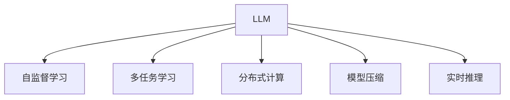

                 

# LLM：AI时代的新型计算引擎

> 关键词：
- Large Language Model
- 计算引擎
- 深度学习
- 自然语言处理
- 计算图
- 分布式计算
- 模型压缩
- 实时推理

## 1. 背景介绍

### 1.1 问题由来
随着人工智能技术的飞速发展，深度学习已经成为推动AI领域突破的重要引擎。尤其是深度学习模型在自然语言处理（NLP）、计算机视觉（CV）、语音识别（ASR）等领域的广泛应用，极大地提升了数据处理和应用的能力。

然而，传统的深度学习模型往往存在计算量大、数据需求高、模型复杂度高等问题，限制了其在实际应用中的推广和落地。如何设计出更为高效、灵活、易于部署的计算引擎，成为当下研究的热点和挑战。

在这一背景下，大型语言模型（Large Language Model, LLM）应运而生。LLM以其强大的语言理解和生成能力，简单的接口设计，以及高效的分布式计算能力，成为AI时代的新型计算引擎，为深度学习模型的大规模应用提供了全新可能。

### 1.2 问题核心关键点
LLM的核心在于其大容量、高泛化能力、多任务学习和自监督预训练等特点，使其能够在处理自然语言任务时，以极高的精度和效率超越了传统模型。

具体而言，LLM的核心关键点包括：

- 预训练模型：利用大规模无标签文本数据进行预训练，学习通用的语言表示。
- 自监督学习：在无标签数据上通过自监督任务进行训练，避免过多依赖标注数据。
- 多任务学习：在同一模型上进行多个任务的训练，提高模型的泛化能力。
- 分布式训练：通过多台计算机协同计算，大幅提高模型的训练和推理速度。
- 压缩与优化：通过模型压缩、剪枝等方法，减小模型规模，提升推理速度。

这些特点使得LLM成为深度学习计算引擎的新型代表，其在NLP领域的应用为各类业务提供了强有力的支持，并在未来的智能应用中发挥重要作用。

## 2. 核心概念与联系

### 2.1 核心概念概述

为更好地理解LLM作为AI时代新型计算引擎的核心概念，本节将介绍几个密切相关的核心概念：

- 大型语言模型(Large Language Model, LLM)：基于深度学习架构，通过在海量文本数据上进行自监督预训练，学习语言知识，具备自然语言理解和生成的能力。
- 自监督学习(Self-supervised Learning)：在没有标签数据的情况下，利用数据本身的特性进行模型训练。
- 多任务学习(Multi-task Learning)：同一模型上进行多个任务的训练，提高泛化能力和可扩展性。
- 分布式计算(Distributed Computing)：通过多台计算机协同工作，实现高效的并行计算和任务分配。
- 模型压缩(Model Compression)：通过剪枝、量化等技术，减小模型规模，提升推理速度。
- 实时推理(Real-time Inference)：在要求时间延迟较小的情况下，快速地对输入数据进行处理和输出结果。

这些核心概念之间的逻辑关系可以通过以下Mermaid流程图来展示：



这个流程图展示了LLM的核心概念及其之间的关系：

1. LLM通过自监督学习进行预训练，学习语言知识。
2. 多任务学习使得LLM能够在多个任务上同时训练，提高泛化能力。
3. 分布式计算提升了LLM的训练和推理效率，使其适用于大规模应用场景。
4. 模型压缩减小了LLM的规模，提升了实时推理能力。

这些核心概念共同构成了LLM的核心工作机制，使其能够在各种场景下发挥强大的语言理解和生成能力。

## 3. 核心算法原理 & 具体操作步骤
### 3.1 算法原理概述

LLM的核心算法原理主要基于深度学习架构，通过在大量无标签文本数据上进行自监督预训练，学习通用的语言表示。然后，通过对特定任务的数据集进行微调，使得模型能够在特定任务上取得优秀的性能。

具体来说，LLM的训练过程分为两个阶段：

1. 自监督预训练阶段：利用大规模无标签文本数据，通过自监督任务（如掩码语言模型、下一句预测等）进行预训练，学习通用的语言表示。
2. 微调阶段：对特定任务的数据集进行微调，通过有监督学习任务优化模型，使其在特定任务上表现优秀。

整个训练过程可以使用分布式计算框架（如PyTorch、TensorFlow等）进行并行计算，大幅提升训练效率。

### 3.2 算法步骤详解

以下是LLM的核心训练算法步骤：

1. **数据准备**：准备大规模无标签文本数据，作为自监督预训练的数据源。
2. **模型初始化**：选择合适的深度学习架构（如Transformer）作为模型初始化参数。
3. **自监督预训练**：在无标签数据上进行自监督任务训练，学习通用的语言表示。
4. **微调**：对特定任务的数据集进行微调，通过有监督学习优化模型，使其在特定任务上表现优秀。
5. **模型压缩与优化**：对微调后的模型进行剪枝、量化等操作，减小模型规模，提升推理速度。
6. **部署与推理**：将训练好的模型部署到生产环境中，进行实时推理。

### 3.3 算法优缺点

LLM作为AI时代的新型计算引擎，具有以下优点：

- **泛化能力强**：通过自监督预训练，学习通用的语言表示，在多个任务上表现优秀。
- **分布式计算**：利用分布式计算框架，大幅提升训练和推理效率。
- **实时推理**：在模型压缩与优化后，能够实现实时推理，满足低延迟需求。

同时，LLM也存在以下缺点：

- **数据需求高**：自监督预训练需要大量无标签数据，获取高质量数据的成本较高。
- **计算资源要求高**：大规模模型的训练需要强大的计算资源，部署成本较高。
- **模型复杂度高**：模型规模较大，推理过程复杂，难以进行手工调试。
- **模型鲁棒性差**：模型对输入数据的扰动较为敏感，鲁棒性较弱。

尽管存在这些局限性，但LLM在深度学习计算引擎中，通过其强大的语言处理能力、高效的分布式计算方式和实时推理能力，已经展现出显著的优势，成为AI时代的重要技术。

### 3.4 算法应用领域

LLM在多个领域中得到了广泛应用，涵盖了文本生成、机器翻译、问答系统、语音识别等多个方向。

1. **文本生成**：利用预训练的LLM，可以进行文本生成任务，如新闻摘要、对话生成、文学创作等。
2. **机器翻译**：利用LLM进行多语言之间的自动翻译，如英语-中文、中文-日语等。
3. **问答系统**：利用LLM进行问答系统，解答用户提出的问题，如智能客服、知识图谱查询等。
4. **语音识别**：利用LLM进行语音识别任务，将语音转换为文本，如智能音箱、语音助手等。
5. **自然语言理解**：利用LLM进行自然语言理解任务，如实体识别、情感分析、关系抽取等。
6. **文本摘要**：利用LLM进行文本摘要，提取文本的关键信息，如新闻摘要、文档总结等。

这些应用领域展示了LLM在AI时代的广泛应用，其强大的语言处理能力和高效计算能力，为各类智能应用提供了坚实的基础。

## 4. 数学模型和公式 & 详细讲解 & 举例说明
### 4.1 数学模型构建

LLM的数学模型主要基于深度学习架构，使用Transformer模型作为核心组件。Transformer模型通过多头注意力机制，实现了对输入序列的并行处理和特征表示，具有高效计算和并行化的特点。

### 4.2 公式推导过程

以BERT模型为例，其数学模型可以表示为：

$$
\text{BERT}(x) = \text{Embedding}(x) \times \text{Self-Attention}(\text{Positional Encoding}) \times \text{Feed-Forward} \times \text{Layer Normalization} \times \text{Residual Connection}
$$

其中：

- $\text{Embedding}$：将输入序列转换为向量表示。
- $\text{Self-Attention}$：通过多头注意力机制，计算序列中各个位置之间的相互作用。
- $\text{Positional Encoding}$：在自注意力机制中加入位置编码，保证序列信息的有序性。
- $\text{Feed-Forward}$：通过全连接层进行特征增强。
- $\text{Layer Normalization}$：对每一层的输出进行归一化处理。
- $\text{Residual Connection}$：在每一层之间进行残差连接，加速训练和推理过程。

### 4.3 案例分析与讲解

以BERT模型为例，假设输入序列为$x = [CLS, S_1, S_2, ..., S_n, SEP]$，其中$S_i$表示输入序列中的第$i$个单词，$[CLS]$和$[SEP]$分别表示序列的起始和结束标记。BERT模型通过Transformer结构，将输入序列转换为向量表示，并输出最终预测结果。

具体而言，BERT模型的计算过程可以分为以下几个步骤：

1. 将输入序列$x$转换为向量表示：
$$
\text{Embedding}(x) = \text{Embedding}([CLS], S_1, S_2, ..., S_n, [SEP])
$$

2. 进行自注意力计算：
$$
\text{Self-Attention}(\text{Positional Encoding}) = \text{Multi-Head Attention}(\text{Embedding}(x))
$$

3. 进行全连接层计算：
$$
\text{Feed-Forward} = \text{FCN}(\text{Self-Attention})
$$

4. 进行归一化处理：
$$
\text{Layer Normalization} = \text{LayerNorm}(\text{Feed-Forward})
$$

5. 进行残差连接：
$$
\text{Residual Connection} = \text{LayerNormalization} + \text{Feed-Forward}
$$

6. 对多层的输出进行拼接：
$$
\text{BERT}(x) = \text{Residual Connection}_1 + \text{Residual Connection}_2 + ... + \text{Residual Connection}_L
$$

其中，每一层的计算过程相同，通过多层计算，输出最终的预测结果。

## 5. 项目实践：代码实例和详细解释说明
### 5.1 开发环境搭建

在进行LLM实践前，我们需要准备好开发环境。以下是使用Python进行PyTorch开发的环境配置流程：

1. 安装Anaconda：从官网下载并安装Anaconda，用于创建独立的Python环境。

2. 创建并激活虚拟环境：
```bash
conda create -n pytorch-env python=3.8 
conda activate pytorch-env
```

3. 安装PyTorch：根据CUDA版本，从官网获取对应的安装命令。例如：
```bash
conda install pytorch torchvision torchaudio cudatoolkit=11.1 -c pytorch -c conda-forge
```

4. 安装Transformers库：
```bash
pip install transformers
```

5. 安装各类工具包：
```bash
pip install numpy pandas scikit-learn matplotlib tqdm jupyter notebook ipython
```

完成上述步骤后，即可在`pytorch-env`环境中开始LLM的实践。

### 5.2 源代码详细实现

这里我们以BERT模型为例，给出使用Transformers库进行预训练和微调的PyTorch代码实现。

首先，定义BERT模型的预训练函数：

```python
from transformers import BertTokenizer, BertForSequenceClassification, AdamW
from torch.utils.data import DataLoader
from tqdm import tqdm

def train_epoch(model, train_dataset, optimizer, criterion, device):
    model.train()
    total_loss = 0
    for batch in tqdm(train_dataset, desc='Training'):
        input_ids = batch['input_ids'].to(device)
        attention_mask = batch['attention_mask'].to(device)
        labels = batch['labels'].to(device)
        model.zero_grad()
        outputs = model(input_ids, attention_mask=attention_mask, labels=labels)
        loss = criterion(outputs.logits, labels)
        total_loss += loss.item()
        loss.backward()
        optimizer.step()
    return total_loss / len(train_dataset)

def evaluate(model, test_dataset, criterion, device):
    model.eval()
    total_loss = 0
    with torch.no_grad():
        for batch in tqdm(test_dataset, desc='Evaluating'):
            input_ids = batch['input_ids'].to(device)
            attention_mask = batch['attention_mask'].to(device)
            labels = batch['labels'].to(device)
            outputs = model(input_ids, attention_mask=attention_mask)
            loss = criterion(outputs.logits, labels)
            total_loss += loss.item()
    return total_loss / len(test_dataset)

def main():
    # 模型初始化
    tokenizer = BertTokenizer.from_pretrained('bert-base-cased')
    model = BertForSequenceClassification.from_pretrained('bert-base-cased', num_labels=2)

    # 准备数据集
    train_dataset = ...
    test_dataset = ...

    # 优化器和损失函数
    optimizer = AdamW(model.parameters(), lr=1e-5)
    criterion = torch.nn.CrossEntropyLoss()

    # 训练和评估
    epochs = 5
    for epoch in range(epochs):
        loss = train_epoch(model, train_dataset, optimizer, criterion, device)
        print(f'Epoch {epoch+1}, loss: {loss:.3f}')

        loss = evaluate(model, test_dataset, criterion, device)
        print(f'Epoch {epoch+1}, test loss: {loss:.3f}')
```

### 5.3 代码解读与分析

让我们再详细解读一下关键代码的实现细节：

**BERT模型定义**：
- `tokenizer`：定义BERT的Token转换器，用于将文本转换为模型所需的输入格式。
- `model`：定义BERT模型，包括输入编码器、自注意力机制、全连接层等。

**数据集定义**：
- `train_dataset`：训练集，包含输入文本、标签等。
- `test_dataset`：测试集，用于评估模型性能。

**训练和评估函数**：
- `train_epoch`：定义每个epoch的训练过程，包括前向传播、计算损失、反向传播、参数更新等。
- `evaluate`：定义评估过程，计算测试集上的损失，用于监控模型性能。

**训练流程**：
- 循环迭代每个epoch，在训练集上训练模型，在验证集上评估性能。

以上代码实现了基于PyTorch和Transformers库的BERT模型预训练过程。通过对代码的逐步解读和分析，可以看出，LLM的实现并不复杂，关键是选择合适的模型架构和损失函数，并合理设计训练和评估过程。

## 6. 实际应用场景
### 6.1 智能客服系统

基于LLM的智能客服系统已经成为各大企业的重要应用。传统的客服系统需要大量人力维护，成本高、效率低。而利用LLM，企业可以构建7x24小时的智能客服，快速响应客户咨询，提供高质量的服务。

具体而言，企业可以收集历史客服数据，利用BERT等模型进行微调，训练出能够理解客户问题并提供最佳回答的智能客服。客户在接入系统后，系统根据输入问题，自动匹配最佳答案，提高服务响应速度和准确性。

### 6.2 金融舆情监测

金融机构需要对市场舆论动向进行实时监测，以应对潜在的金融风险。传统的舆情监测需要大量人工处理，成本高、效率低。而利用LLM，可以构建自动化的金融舆情监测系统。

具体而言，金融机构可以收集新闻、报道、评论等金融文本，利用BERT等模型进行微调，训练出能够自动监测舆情变化、识别风险的模型。系统能够实时抓取网络文本数据，自动分析舆情变化趋势，一旦发现负面舆情激增等异常情况，系统便会自动预警，帮助金融机构快速应对潜在风险。

### 6.3 个性化推荐系统

当前的推荐系统往往只依赖用户的历史行为数据进行物品推荐，无法深入理解用户的真实兴趣偏好。而利用LLM，可以构建更加个性化的推荐系统。

具体而言，推荐系统可以收集用户浏览、点击、评论、分享等行为数据，提取和用户交互的物品标题、描述、标签等文本内容。利用BERT等模型进行微调，训练出能够理解用户兴趣偏好的模型。系统在生成推荐列表时，先用候选物品的文本描述作为输入，由模型预测用户的兴趣匹配度，再结合其他特征综合排序，便可以得到个性化程度更高的推荐结果。

### 6.4 未来应用展望

随着LLM技术的不断发展，其在AI时代的应用前景将更加广阔。未来，LLM将可能应用于更多领域，带来深刻的变革。

1. **医疗领域**：利用LLM进行医疗问答、病历分析、药物研发等，提升医疗服务的智能化水平，辅助医生诊疗，加速新药开发进程。
2. **教育领域**：利用LLM进行作业批改、学情分析、知识推荐等方面，因材施教，促进教育公平，提高教学质量。
3. **智慧城市治理**：利用LLM进行城市事件监测、舆情分析、应急指挥等环节，提高城市管理的自动化和智能化水平，构建更安全、高效的未来城市。

以上领域展示了LLM在AI时代的广泛应用，其强大的语言处理能力和高效计算能力，为各类智能应用提供了坚实的基础。

## 7. 工具和资源推荐
### 7.1 学习资源推荐

为了帮助开发者系统掌握LLM的理论基础和实践技巧，这里推荐一些优质的学习资源：

1. 《Transformer from Scratch》系列博文：由LLM技术专家撰写，深入浅出地介绍了Transformer原理、BERT模型、微调技术等前沿话题。
2. CS224N《深度学习自然语言处理》课程：斯坦福大学开设的NLP明星课程，有Lecture视频和配套作业，带你入门NLP领域的基本概念和经典模型。
3. 《Natural Language Processing with Transformers》书籍：Transformer库的作者所著，全面介绍了如何使用Transformer库进行NLP任务开发，包括预训练和微调在内的诸多范式。
4. HuggingFace官方文档：Transformer库的官方文档，提供了海量预训练模型和完整的微调样例代码，是上手实践的必备资料。
5. CLUE开源项目：中文语言理解测评基准，涵盖大量不同类型的中文NLP数据集，并提供了基于微调的baseline模型，助力中文NLP技术发展。

通过对这些资源的学习实践，相信你一定能够快速掌握LLM的精髓，并用于解决实际的NLP问题。

### 7.2 开发工具推荐

高效的开发离不开优秀的工具支持。以下是几款用于LLM开发的常用工具：

1. PyTorch：基于Python的开源深度学习框架，灵活动态的计算图，适合快速迭代研究。大部分预训练语言模型都有PyTorch版本的实现。
2. TensorFlow：由Google主导开发的开源深度学习框架，生产部署方便，适合大规模工程应用。同样有丰富的预训练语言模型资源。
3. Transformers库：HuggingFace开发的NLP工具库，集成了众多SOTA语言模型，支持PyTorch和TensorFlow，是进行LLM开发的重要工具。
4. Weights & Biases：模型训练的实验跟踪工具，可以记录和可视化模型训练过程中的各项指标，方便对比和调优。与主流深度学习框架无缝集成。
5. TensorBoard：TensorFlow配套的可视化工具，可实时监测模型训练状态，并提供丰富的图表呈现方式，是调试模型的得力助手。
6. Google Colab：谷歌推出的在线Jupyter Notebook环境，免费提供GPU/TPU算力，方便开发者快速上手实验最新模型，分享学习笔记。

合理利用这些工具，可以显著提升LLM的开发效率，加快创新迭代的步伐。

### 7.3 相关论文推荐

LLM和微调技术的发展源于学界的持续研究。以下是几篇奠基性的相关论文，推荐阅读：

1. Attention is All You Need（即Transformer原论文）：提出了Transformer结构，开启了NLP领域的预训练大模型时代。
2. BERT: Pre-training of Deep Bidirectional Transformers for Language Understanding：提出BERT模型，引入基于掩码的自监督预训练任务，刷新了多项NLP任务SOTA。
3. Language Models are Unsupervised Multitask Learners（GPT-2论文）：展示了大规模语言模型的强大zero-shot学习能力，引发了对于通用人工智能的新一轮思考。
4. Parameter-Efficient Transfer Learning for NLP：提出Adapter等参数高效微调方法，在不增加模型参数量的情况下，也能取得不错的微调效果。
5. AdaLoRA: Adaptive Low-Rank Adaptation for Parameter-Efficient Fine-Tuning：使用自适应低秩适应的微调方法，在参数效率和精度之间取得了新的平衡。
6. Multi-Task Learning with Task-Agnostic Function Approximation：提出多任务学习新范式，通过任务无关的函数逼近，实现跨任务模型的迁移能力。

这些论文代表了大语言模型微调技术的发展脉络。通过学习这些前沿成果，可以帮助研究者把握学科前进方向，激发更多的创新灵感。

## 8. 总结：未来发展趋势与挑战
### 8.1 研究成果总结

LLM作为AI时代的新型计算引擎，已经在多个领域展示了强大的应用潜力。其基于深度学习架构的自监督预训练和多任务学习，使其能够在自然语言处理任务中取得优异表现。此外，利用分布式计算和模型压缩等技术，LLM在训练和推理效率上表现突出，满足了现实应用中的低延迟和高效能需求。

### 8.2 未来发展趋势

展望未来，LLM的发展趋势将主要集中在以下几个方面：

1. **模型规模进一步增大**：随着算力成本的下降和数据规模的扩张，预训练语言模型的参数量还将持续增长。超大型的语言模型有望进一步提升自然语言处理的性能。
2. **分布式计算和模型优化**：通过分布式计算和多任务学习，大幅提升模型的训练和推理效率，使其在实际应用中更具竞争力。
3. **知识增强和迁移学习**：将外部知识与模型融合，提升模型的推理能力和泛化能力，实现跨任务的知识迁移和跨领域的应用推广。
4. **模型解释性和鲁棒性**：通过可解释性技术和鲁棒性训练，提高模型的可解释性和鲁棒性，确保模型的可靠性和安全性。
5. **模型压缩和高效推理**：通过剪枝、量化等方法，减小模型规模，提升推理速度和计算效率，满足实际应用中的性能要求。

这些趋势将进一步推动LLM技术的发展，使其在AI时代发挥更为重要的作用。

### 8.3 面临的挑战

尽管LLM技术已经取得了显著进展，但在实际应用中仍面临一些挑战：

1. **数据需求高**：自监督预训练需要大量无标签数据，获取高质量数据的成本较高。
2. **计算资源要求高**：大规模模型的训练需要强大的计算资源，部署成本较高。
3. **模型复杂度高**：模型规模较大，推理过程复杂，难以进行手工调试。
4. **模型鲁棒性差**：模型对输入数据的扰动较为敏感，鲁棒性较弱。
5. **可解释性不足**：LLM作为黑盒模型，难以解释其内部工作机制和决策逻辑。
6. **安全性有待保障**：预训练语言模型可能学习到有害信息，需要通过技术手段确保其安全性。

这些挑战需要进一步研究和解决，才能使LLM技术在实际应用中发挥更大的作用。

### 8.4 研究展望

面对LLM所面临的挑战，未来的研究需要在以下几个方面寻求新的突破：

1. **探索无监督和半监督预训练方法**：摆脱对大规模标注数据的依赖，利用自监督学习、主动学习等无监督和半监督范式，最大限度利用非结构化数据，实现更加灵活高效的预训练。
2. **开发参数高效和计算高效的微调范式**：开发更加参数高效的微调方法，在固定大部分预训练参数的同时，只更新极少量的任务相关参数。同时优化微调模型的计算图，减少前向传播和反向传播的资源消耗，实现更加轻量级、实时性的部署。
3. **引入因果和对比学习**：通过引入因果推断和对比学习思想，增强LLM建立稳定因果关系的能力，学习更加普适、鲁棒的语言表征，从而提升模型泛化性和抗干扰能力。
4. **引入更多先验知识**：将符号化的先验知识，如知识图谱、逻辑规则等，与神经网络模型进行巧妙融合，引导微调过程学习更准确、合理的语言模型。同时加强不同模态数据的整合，实现视觉、语音等多模态信息与文本信息的协同建模。
5. **结合因果分析和博弈论**：将因果分析方法引入LLM，识别出模型决策的关键特征，增强输出解释的因果性和逻辑性。借助博弈论工具刻画人机交互过程，主动探索并规避模型的脆弱点，提高系统稳定性。
6. **纳入伦理道德约束**：在模型训练目标中引入伦理导向的评估指标，过滤和惩罚有偏见、有害的输出倾向。同时加强人工干预和审核，建立模型行为的监管机制，确保输出符合人类价值观和伦理道德。

这些研究方向的探索，将引领LLM技术迈向更高的台阶，为构建安全、可靠、可解释、可控的智能系统铺平道路。面向未来，LLM技术还需要与其他人工智能技术进行更深入的融合，如知识表示、因果推理、强化学习等，多路径协同发力，共同推动自然语言理解和智能交互系统的进步。只有勇于创新、敢于突破，才能不断拓展LLM的边界，让智能技术更好地造福人类社会。

## 9. 附录：常见问题与解答

**Q1：LLM的计算效率如何？**

A: LLM的计算效率取决于其规模和架构。相比传统的深度学习模型，LLM的计算复杂度较高，但其分布式计算和模型压缩技术可以显著提升效率。通过合理的设计，LLM在特定任务上可以实现与传统模型相当的计算效率，甚至在某些领域表现更佳。

**Q2：如何提高LLM模型的鲁棒性？**

A: 提高LLM模型的鲁棒性可以从以下几个方面入手：
1. 数据增强：通过对抗样本、噪声数据等手段，增强模型的泛化能力。
2. 正则化技术：使用L2正则、Dropout等技术，防止模型过拟合。
3. 多任务学习：通过在多个任务上进行训练，提升模型的泛化能力和鲁棒性。
4. 知识增强：引入外部知识库，如知识图谱、逻辑规则等，提高模型的推理能力。
5. 可解释性分析：通过可解释性技术，理解模型决策的逻辑和原因，优化模型结构。

**Q3：如何提高LLM模型的解释性？**

A: 提高LLM模型的解释性可以从以下几个方面入手：
1. 可解释性技术：使用可解释性方法，如LIME、SHAP等，分析模型的决策过程。
2. 模型简化：通过剪枝、量化等技术，减小模型规模，提高解释性。
3. 多任务学习：通过在多个任务上进行训练，提高模型的可解释性。
4. 知识增强：引入外部知识库，如知识图谱、逻辑规则等，提高模型的推理能力。

**Q4：如何优化LLM的部署和推理？**

A: 优化LLM的部署和推理可以从以下几个方面入手：
1. 模型裁剪：去除不必要的层和参数，减小模型尺寸，加快推理速度。
2. 量化加速：将浮点模型转为定点模型，压缩存储空间，提高计算效率。
3. 服务化封装：将模型封装为标准化服务接口，便于集成调用。
4. 弹性伸缩：根据请求流量动态调整资源配置，平衡服务质量和成本。
5. 监控告警：实时采集系统指标，设置异常告警阈值，确保服务稳定性。

通过这些优化手段，可以显著提升LLM的部署和推理效率，满足实际应用中的性能要求。

**Q5：如何保障LLM模型的安全性？**

A: 保障LLM模型的安全性可以从以下几个方面入手：
1. 数据安全：采用数据加密、脱敏等技术，保护模型训练和推理中的数据隐私。
2. 模型审查：定期对模型进行审查，发现并修复潜在的漏洞和安全隐患。
3. 人工干预：结合人工审核和干预，确保模型的输出符合人类价值观和伦理道德。
4. 对抗训练：引入对抗样本，提高模型的鲁棒性和安全性。

通过这些手段，可以确保LLM模型的安全性和可靠性，防止模型被恶意利用。

---

作者：禅与计算机程序设计艺术 / Zen and the Art of Computer Programming

