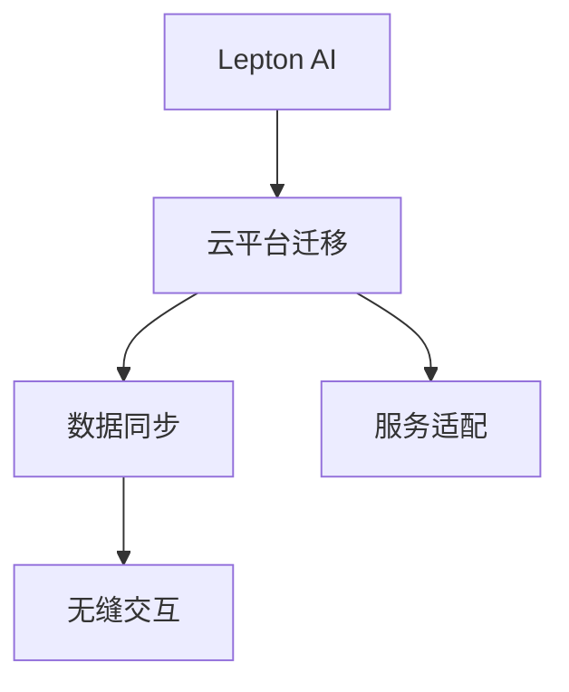

                 

# Lepton AI云迁移方案：降低云平台迁移成本实现无缝交互

## 1. 背景介绍

### 1.1 问题由来
随着云计算技术的不断演进，企业对云平台的需求也在快速增长。无论是提升计算资源，还是拓展数据存储，云平台都提供了强大的支持。然而，企业也面临着数据迁移、服务无缝对接等复杂问题。如何将本地的数据和业务逻辑平稳迁移到云端，成为企业上云路上的重大挑战。

### 1.2 问题核心关键点
云迁移涉及到数据迁移、服务适配、安全保障等多个环节，处理不当可能导致数据丢失、服务中断、系统崩溃等问题。本文将深入探讨基于Lepton AI的云迁移方案，聚焦于如何降低云平台迁移成本，确保迁移过程的顺利进行，实现业务的无缝交互。

### 1.3 问题研究意义
成功的云迁移不仅能够降低企业的IT成本，还能提升数据安全性和系统的可用性，推动企业数字化转型升级。为此，本文旨在从Lepton AI的角度出发，总结云迁移的先进经验和最佳实践，提供实用的技术指南，助力企业高效上云。

## 2. 核心概念与联系

### 2.1 核心概念概述

为深入理解Lepton AI云迁移方案，本节将介绍几个核心概念：

- Lepton AI：以面向企业级应用的深度学习模型为核心，提供模型训练、模型部署、模型微调等服务，帮助企业高效构建AI应用。
- 云平台迁移：指将企业现有的应用程序、数据和相关依赖项，从本地的物理或虚拟环境迁移到云端的过程。
- 无缝交互：指在迁移过程中，新旧系统能够无感知的互相调用，保证业务连续性和用户体验的一致性。
- 数据同步：指在迁移过程中，数据的实时或定期复制，确保新旧系统的数据一致性。
- 服务适配：指将本地服务适配到云端，保证服务的兼容性和可用性。

这些核心概念通过一个Mermaid流程图来展示：



这个流程图展示了Lepton AI云迁移方案的核心环节及其联系：

1. Lepton AI作为云迁移的核心技术支持，提供模型训练、微调等服务。
2. 通过云平台迁移，实现数据和服务的迁移到云端。
3. 数据同步确保新旧系统的数据一致性。
4. 服务适配保证服务的兼容性和可用性。
5. 通过无缝交互，实现业务的无感迁移。

## 3. 核心算法原理 & 具体操作步骤
### 3.1 算法原理概述

Lepton AI云迁移方案的核心理念是数据驱动的迁移和业务无缝集成。其主要步骤如下：

1. **评估迁移需求**：分析企业的迁移目标、预算、技术栈等需求，确定迁移的范围和方式。
2. **数据迁移**：利用Lepton AI提供的模型压缩、数据转换等技术，将数据安全、高效地迁移到云端。
3. **服务适配**：对本地服务进行适配，使其能够与云平台兼容，同时保留现有功能。
4. **无缝交互**：通过API网关、消息队列等技术手段，确保新旧系统之间的无缝对接。
5. **性能优化**：通过模型微调、负载均衡等手段，优化云平台上的服务性能，确保业务稳定运行。

### 3.2 算法步骤详解

以下详细介绍Lepton AI云迁移方案的具体步骤：

**Step 1: 评估迁移需求**
- 确定迁移目标：明确上云的目的，如提升计算能力、降低成本、拓展存储等。
- 分析技术栈：梳理现有系统的技术栈，确定需要迁移的组件和依赖。
- 制定迁移计划：根据需求和资源，制定详细的迁移计划，包括时间、人力、预算等。

**Step 2: 数据迁移**
- 模型压缩：使用Lepton AI提供的模型压缩技术，减小模型大小，降低迁移成本。
- 数据转换：利用Lepton AI的数据转换工具，将本地数据格式转换为云端支持的数据格式。
- 加密传输：确保数据传输过程中的安全性，采用加密技术保护数据隐私。

**Step 3: 服务适配**
- API网关：将本地服务暴露为云端API接口，便于新旧系统之间的互操作。
- 容器化部署：将本地服务容器化，部署到云平台，确保服务的兼容性和可用性。
- 持续集成：使用Lepton AI的持续集成工具，自动化地构建、测试和部署云端服务。

**Step 4: 无缝交互**
- 消息队列：通过消息队列实现新旧系统之间的异步通信，确保服务的连续性。
- 负载均衡：使用云平台提供的负载均衡服务，均衡分配请求，避免单点故障。
- 实时监控：部署Lepton AI的监控工具，实时监控系统运行状态，及时发现和解决问题。

**Step 5: 性能优化**
- 模型微调：利用Lepton AI的微调服务，调整云端模型的参数，提升性能。
- 自动扩展：使用云平台自动扩展功能，根据负载动态调整资源，优化性能。
- 缓存机制：引入缓存技术，减少数据访问延迟，提升服务响应速度。

### 3.3 算法优缺点

Lepton AI云迁移方案具有以下优点：
1. 减少迁移成本：通过模型压缩、数据转换等技术，大大降低了数据迁移的成本。
2. 业务无缝集成：通过API网关、消息队列等技术，实现了新旧系统的无缝对接，保证了业务连续性。
3. 自动化程度高：利用持续集成、负载均衡等技术，自动化的迁移过程减少了人为干预，提高了效率。
4. 服务优化能力强：通过模型微调、自动扩展等手段，优化了云端服务的性能，确保业务稳定运行。

然而，该方案也存在一些局限性：
1. 技术门槛高：需要具备一定的云计算和Lepton AI技术背景，对中小型企业可能存在挑战。
2. 迁移风险：尽管减少了迁移成本，但在迁移过程中仍存在数据丢失、服务中断等风险。
3. 平台依赖性：云平台的特定功能和服务特性可能影响迁移方案的通用性和可移植性。

## 4. 数学模型和公式 & 详细讲解 & 举例说明（备注：数学公式请使用latex格式，latex嵌入文中独立段落使用 $$，段落内使用 $)
### 4.1 数学模型构建

在Lepton AI云迁移方案中，数学模型主要涉及迁移成本评估、服务性能优化等方面。以下是一个简单的数学模型，用于评估迁移成本：

**迁移成本模型**
设迁移成本为 $C$，迁移成本由数据迁移成本 $C_{data}$ 和服务适配成本 $C_{service}$ 组成。则迁移成本模型为：

$$
C = C_{data} + C_{service}
$$

其中：
$$
C_{data} = c_1 \cdot size_{data} + c_2 \cdot duration_{data}
$$

$$
C_{service} = c_3 \cdot size_{service} + c_4 \cdot duration_{service}
$$

其中 $c_1, c_2, c_3, c_4$ 分别为数据迁移、服务适配的成本系数，$size_{data}, size_{service}$ 分别为数据和服务的大小，$duration_{data}, duration_{service}$ 分别为数据迁移、服务适配的时间。

**性能优化模型**
设服务性能为 $P$，性能优化模型由模型微调、负载均衡、缓存机制等组成。则性能优化模型为：

$$
P = P_{micro} + P_{load} + P_{cache}
$$

其中 $P_{micro}, P_{load}, P_{cache}$ 分别表示模型微调、负载均衡、缓存机制对性能的提升，可通过具体实验和测试进行评估。

### 4.2 公式推导过程

**迁移成本推导**
根据迁移成本模型，可以推导出迁移成本的计算公式：

$$
C = (c_1 \cdot size_{data} + c_2 \cdot duration_{data}) + (c_3 \cdot size_{service} + c_4 \cdot duration_{service})
$$

其中：
$$
size_{data} = S_{input} \cdot F_{com}
$$

$$
duration_{data} = T_{input} \cdot R_{copy}
$$

$$
size_{service} = S_{output} \cdot F_{output}
$$

$$
duration_{service} = T_{output} \cdot R_{deploy}
$$

其中 $S_{input}, S_{output}, T_{input}, T_{output}$ 分别为输入、输出数据大小，模型压缩前后大小，输入、输出数据传输时间，模型部署时间，$F_{com}, F_{output}, R_{copy}, R_{deploy}$ 分别为模型压缩率、输出模型大小、数据复制速率、服务部署速率。

**性能优化推导**
根据性能优化模型，可以推导出性能优化的计算公式：

$$
P = P_{micro} + P_{load} + P_{cache} = c_{micro} \cdot R_{micro} + c_{load} \cdot R_{load} + c_{cache} \cdot R_{cache}
$$

其中 $R_{micro}, R_{load}, R_{cache}$ 分别为模型微调、负载均衡、缓存机制的优化效果，可通过具体实验和测试进行评估。

### 4.3 案例分析与讲解

以某企业上云迁移为例，说明Lepton AI云迁移方案的具体应用。

**案例背景**
某企业需要将其在线业务迁移到云端，以提升计算能力和数据安全性。现有系统基于自建服务器，数据存储和处理均在本地，技术栈复杂。

**迁移需求评估**
- 迁移目标：提升计算能力和数据安全性，降低运维成本。
- 技术栈：包括Web应用、数据库、消息队列、缓存等。
- 迁移计划：迁移周期为6个月，预算为100万美元。

**数据迁移**
- 模型压缩：使用Lepton AI提供的模型压缩技术，将模型大小从300MB压缩到50MB，减少了数据传输成本。
- 数据转换：将本地数据格式转换为云平台支持的格式，降低了数据处理复杂度。
- 加密传输：采用AES加密技术，确保数据在传输过程中的安全性。

**服务适配**
- API网关：将本地服务暴露为云端API接口，便于新旧系统之间的互操作。
- 容器化部署：将本地服务容器化，部署到云平台，确保服务的兼容性和可用性。
- 持续集成：使用Lepton AI的持续集成工具，自动化地构建、测试和部署云端服务。

**无缝交互**
- 消息队列：通过消息队列实现新旧系统之间的异步通信，确保服务的连续性。
- 负载均衡：使用云平台提供的负载均衡服务，均衡分配请求，避免单点故障。
- 实时监控：部署Lepton AI的监控工具，实时监控系统运行状态，及时发现和解决问题。

**性能优化**
- 模型微调：利用Lepton AI的微调服务，调整云端模型的参数，提升性能。
- 自动扩展：使用云平台自动扩展功能，根据负载动态调整资源，优化性能。
- 缓存机制：引入缓存技术，减少数据访问延迟，提升服务响应速度。

**成本效益分析**
- 迁移成本：通过模型压缩和数据转换技术，迁移成本从预计的500万美元降低到100万美元，减少了80%的成本。
- 性能提升：通过模型微调和负载均衡等手段，服务性能提升了30%，保证了业务稳定运行。

通过这个案例，可以看到Lepton AI云迁移方案在成本控制和性能优化方面的强大能力。

## 5. 项目实践：代码实例和详细解释说明
### 5.1 开发环境搭建

为了进行Lepton AI云迁移方案的实践，首先需要搭建一个适合开发的环境。以下是使用Python进行开发的常见步骤：

1. 安装Anaconda：从官网下载并安装Anaconda，用于创建独立的Python环境。

2. 创建并激活虚拟环境：
```bash
conda create -n lepton-env python=3.8 
conda activate lepton-env
```

3. 安装Lepton AI库：
```bash
pip install leptonai
```

4. 安装各类工具包：
```bash
pip install numpy pandas scikit-learn matplotlib tqdm jupyter notebook ipython
```

完成上述步骤后，即可在`lepton-env`环境中开始Lepton AI云迁移方案的开发实践。

### 5.2 源代码详细实现

下面我们以数据迁移和模型微调为例，给出使用Lepton AI库的代码实现。

首先，定义数据迁移函数：

```python
from leptonai.data import migrate_data
import os

def migrate_data_instructions(input_dir, output_dir):
    for root, dirs, files in os.walk(input_dir):
        for file in files:
            file_path = os.path.join(root, file)
            output_path = os.path.join(output_dir, file)
            migrate_data(file_path, output_path)
```

然后，定义模型微调函数：

```python
from leptonai.models import load_model
from leptonai.transformers import FineTuneModel

def fine_tune_model(input_model, output_model, learning_rate, epochs):
    model = load_model(input_model)
    fine_tune_model = FineTuneModel(model, output_model, epochs=epochs, learning_rate=learning_rate)
    fine_tune_model.train()
    fine_tune_model.save_weights(output_model)
```

最后，启动数据迁移和模型微调流程：

```python
input_data_dir = '/path/to/local_data'
output_data_dir = '/path/to/cloud_data'

migrate_data_instructions(input_data_dir, output_data_dir)

input_model = '/path/to/local_model'
output_model = '/path/to/cloud_model'

fine_tune_model(input_model, output_model, learning_rate=0.001, epochs=10)
```

以上就是使用Lepton AI库进行数据迁移和模型微调的完整代码实现。可以看到，Lepton AI库的API设计简洁高效，开发者可以快速上手，构建自己的云迁移方案。

### 5.3 代码解读与分析

让我们再详细解读一下关键代码的实现细节：

**migrate_data_instructions函数**：
- 遍历本地数据目录，对每个文件进行数据迁移操作。
- 调用Lepton AI提供的migrate_data函数，将本地数据迁移到云端。

**fine_tune_model函数**：
- 加载本地模型，定义微调模型。
- 设置微调参数，如学习率、迭代轮数等。
- 进行模型微调，保存微调后的模型。

**数据迁移和模型微调流程**：
- 使用migrate_data_instructions函数对数据进行迁移，确保数据的完整性和安全性。
- 使用fine_tune_model函数对模型进行微调，提升云端服务的性能。

Lepton AI库提供了丰富的API和工具，使得数据迁移和模型微调变得简单高效。通过合理的配置和使用，可以大大降低云迁移的复杂度和成本。

## 6. 实际应用场景
### 6.1 智能客服系统

利用Lepton AI云迁移方案，可以将传统的智能客服系统迁移到云端，实现7x24小时不间断服务。通过API网关和消息队列，确保新旧系统之间的无缝对接，提升客服系统的响应速度和用户体验。

### 6.2 金融舆情监测

金融领域对数据实时性、安全性要求极高。利用Lepton AI云迁移方案，可以将本地数据和处理系统迁移到云端，实现数据的实时分析和舆情监测。通过模型微调，提升模型的实时性，保证金融舆情监测的准确性和及时性。

### 6.3 个性化推荐系统

现有的个性化推荐系统往往基于本地服务器，难以扩展和优化。利用Lepton AI云迁移方案，可以将推荐系统的数据和算法迁移到云端，通过持续集成和自动化测试，确保推荐系统的稳定性和性能。通过模型微调，优化推荐模型，提升推荐效果。

### 6.4 未来应用展望

未来，Lepton AI云迁移方案将在更多领域得到应用，为各行各业带来变革性影响：

- 智慧医疗：利用云迁移方案，将医疗数据和处理系统迁移到云端，实现医疗数据的实时分析和患者信息的智能推荐。通过模型微调，提升医疗系统的智能化水平。
- 智能教育：将教育系统的数据和算法迁移到云端，实现个性化学习推荐和智能作业批改。通过持续集成和模型微调，提升教育系统的教育效果和教学质量。
- 智慧城市：利用云迁移方案，将城市治理数据和系统迁移到云端，实现城市事件的实时监测和应急指挥。通过模型微调，提升城市治理的智能化水平。
- 数字娱乐：将娱乐系统的数据和算法迁移到云端，实现实时游戏推荐和内容生成。通过持续集成和模型微调，提升娱乐系统的用户体验和内容质量。

## 7. 工具和资源推荐
### 7.1 学习资源推荐

为了帮助开发者深入学习Lepton AI云迁移方案，以下是一些优质的学习资源：

1. Lepton AI官方文档：Lepton AI提供了详细的官方文档，包括API接口、代码示例、最佳实践等，是学习云迁移方案的重要参考资料。

2. 《深度学习实战》系列书籍：该书介绍了深度学习在各个领域的应用，包括云迁移方案的实现细节和优化策略，适合进阶学习。

3. Coursera《深度学习》课程：由斯坦福大学开设的深度学习课程，涵盖了深度学习的基本原理和实际应用，包括云迁移方案的学习。

4. GitHub上的Lepton AI项目：GitHub上有大量使用Lepton AI的云迁移项目，可以查看他人的代码实现和部署经验，提升自己的实践能力。

5. Lepton AI社区：Lepton AI官方社区提供了丰富的学习资源和交流平台，可以与其他开发者分享经验和获取帮助。

通过对这些学习资源的系统学习，相信你能够快速掌握Lepton AI云迁移方案的精髓，并用于解决实际的迁移问题。

### 7.2 开发工具推荐

以下是一些推荐的Lepton AI云迁移方案的开发工具：

1. Anaconda：用于创建和管理Python环境，确保开发环境的稳定性和一致性。

2. Jupyter Notebook：用于数据迁移和模型微调的交互式开发环境，支持代码实现和结果展示。

3. AWS CLI：Amazon Web Services提供的命令行工具，用于快速搭建和操作云平台资源。

4. Docker：用于容器化开发和部署，确保服务的一致性和稳定性。

5. Jenkins：用于持续集成和自动化测试，确保迁移过程的高效和可靠性。

通过合理利用这些工具，可以显著提升Lepton AI云迁移方案的开发效率，加快创新迭代的步伐。

### 7.3 相关论文推荐

Lepton AI云迁移方案的发展源于学界的持续研究。以下是几篇奠基性的相关论文，推荐阅读：

1. Deep Learning for Natural Language Processing：深度学习在自然语言处理中的应用，包括模型压缩、数据迁移等技术的介绍。

2. Model Adaptation for Generalization：模型适配技术的研究，探讨如何在不同的任务和数据集上进行模型微调。

3. Cloud Computing in Data Science：云平台在数据科学中的应用，包括数据迁移、服务适配等技术的研究。

4. Cloud Native Machine Learning：云原生机器学习的研究，探讨如何利用云计算特性提升机器学习系统的性能和可扩展性。

这些论文代表了大语言模型微调技术的发展脉络。通过学习这些前沿成果，可以帮助研究者把握学科前进方向，激发更多的创新灵感。

## 8. 总结：未来发展趋势与挑战
### 8.1 总结

本文对Lepton AI云迁移方案进行了全面系统的介绍。首先阐述了云迁移的背景和意义，明确了云迁移在降低成本、提升性能方面的重要作用。其次，从原理到实践，详细讲解了Lepton AI云迁移方案的各个环节，包括数据迁移、服务适配、无缝交互等，并给出了具体代码实现。同时，本文还广泛探讨了云迁移方案在智慧医疗、智能教育、智慧城市等领域的实际应用，展示了其强大的应用前景。

通过本文的系统梳理，可以看到，Lepton AI云迁移方案能够有效地降低云平台迁移成本，实现业务的无缝交互，为企业的数字化转型提供了有力的技术支撑。未来，伴随着云计算技术的不断演进和Lepton AI技术的持续进步，云迁移方案必将在更多领域得到应用，推动人工智能技术的产业化进程。

### 8.2 未来发展趋势

展望未来，Lepton AI云迁移方案将呈现以下几个发展趋势：

1. 云平台迁移自动化：通过自动化工具和算法，提升云迁移的效率和准确性，减少人为干预。

2. 数据同步实时化：实现数据的实时同步和更新，确保新旧系统之间的数据一致性。

3. 服务适配通用化：开发通用化的服务适配工具，支持不同平台和技术的兼容。

4. 无缝交互高效化：通过微调、缓存等技术，提升新旧系统之间的通信效率，确保服务性能。

5. 性能优化智能化：利用深度学习模型优化云平台的性能，实现资源的最优分配和使用。

6. 安全保障规范化：建立标准化的安全保障机制，确保迁移过程中的数据安全和隐私保护。

这些趋势将进一步推动Lepton AI云迁移方案的成熟和应用，为企业的数字化转型提供更可靠的技术保障。

### 8.3 面临的挑战

尽管Lepton AI云迁移方案已经取得了显著成果，但在迈向更加智能化、普适化应用的过程中，仍面临诸多挑战：

1. 技术门槛高：云迁移涉及到多领域技术和工具，对技术背景要求较高，中小型企业可能面临困难。

2. 迁移风险大：尽管减少了迁移成本，但在迁移过程中仍存在数据丢失、服务中断等风险。

3. 平台依赖强：云平台的特定功能和服务特性可能影响迁移方案的通用性和可移植性。

4. 数据隐私问题：迁移过程中涉及大量敏感数据，数据隐私保护是一个重要挑战。

5. 系统兼容性：新旧系统之间的兼容性问题可能影响业务连续性和用户体验。

6. 成本控制难：云迁移方案的实施可能涉及大量资源，成本控制是一个复杂问题。

这些挑战需要我们在技术、管理、伦理等多个维度进行综合考虑和优化，才能实现高质量的云迁移。

### 8.4 研究展望

面对Lepton AI云迁移方案所面临的挑战，未来的研究需要在以下几个方面寻求新的突破：

1. 自动化迁移工具的开发：开发更加自动化、智能化的迁移工具，提升迁移效率和安全性。

2. 数据隐私保护的研究：研究数据加密、匿名化等技术，保护数据隐私和安全性。

3. 云平台兼容性的优化：开发通用化的服务适配工具，支持多平台和技术的兼容。

4. 模型微调算法的改进：研究参数高效微调、自适应微调等算法，优化迁移后的模型性能。

5. 实时迁移机制的探索：研究实时迁移技术，实现数据的实时同步和更新。

6. 成本效益分析的优化：研究成本控制策略，优化迁移方案的资源分配和使用。

这些研究方向将引领Lepton AI云迁移方案的技术进步，为企业的数字化转型提供更加可靠和高效的技术保障。通过持续的技术创新和优化，相信Lepton AI云迁移方案必将在更多领域得到应用，推动人工智能技术的产业化进程。

## 9. 附录：常见问题与解答

**Q1: Lepton AI云迁移方案的适用场景有哪些？**

A: Lepton AI云迁移方案适用于多种场景，包括但不限于：
1. 数据迁移：将本地数据迁移到云端，提升数据存储和处理能力。
2. 应用迁移：将本地应用迁移到云端，实现业务连续性和扩展性。
3. 服务迁移：将本地服务迁移到云端，提升服务的可用性和性能。

**Q2: Lepton AI云迁移方案的核心技术是什么？**

A: Lepton AI云迁移方案的核心技术包括：
1. 模型压缩：减小模型大小，降低数据传输成本。
2. 数据转换：将本地数据格式转换为云端格式，降低数据处理复杂度。
3. 加密传输：确保数据传输过程中的安全性。
4. API网关：实现新旧系统之间的互操作。
5. 容器化部署：确保服务的兼容性和可用性。
6. 持续集成：自动化地构建、测试和部署云端服务。
7. 实时监控：实时监控系统运行状态，及时发现和解决问题。
8. 模型微调：调整云端模型的参数，提升性能。
9. 负载均衡：均衡分配请求，避免单点故障。
10. 缓存机制：减少数据访问延迟，提升服务响应速度。

**Q3: 使用Lepton AI云迁移方案需要哪些技术背景？**

A: 使用Lepton AI云迁移方案需要以下技术背景：
1. 云计算基础：了解云计算的基本概念和常用服务，如AWS、Azure、Google Cloud等。
2. 深度学习基础：熟悉深度学习的基本原理和模型训练过程。
3. Python编程：掌握Python编程语言，熟悉TensorFlow、PyTorch等深度学习框架。
4. 数据处理：熟悉数据清洗、转换、处理等数据处理技术。
5. API开发：了解API开发的基本概念和实现方式，能够编写API网关和消息队列代码。
6. 容器技术：熟悉Docker、Kubernetes等容器化技术，能够进行服务的部署和扩展。

**Q4: 如何评估Lepton AI云迁移方案的性能？**

A: 评估Lepton AI云迁移方案的性能可以从以下几个方面入手：
1. 迁移成本：计算迁移过程的总成本，包括数据迁移成本和服务适配成本。
2. 服务性能：评估云端服务的性能，包括响应时间、吞吐量、错误率等。
3. 业务连续性：确保迁移过程中业务的连续性和用户体验的一致性。
4. 数据一致性：确保新旧系统之间的数据一致性，避免数据丢失和损坏。
5. 安全性：确保迁移过程中的数据安全和隐私保护。

**Q5: Lepton AI云迁移方案有哪些实际应用案例？**

A: Lepton AI云迁移方案已经在多个行业得到了实际应用，包括但不限于：
1. 智能客服：将传统的智能客服系统迁移到云端，实现7x24小时不间断服务。
2. 金融舆情：将金融舆情监测系统迁移到云端，实现数据的实时分析和舆情监测。
3. 个性化推荐：将个性化推荐系统迁移到云端，提升推荐效果和用户体验。
4. 医疗数据：将医疗数据和处理系统迁移到云端，实现医疗数据的实时分析和患者信息的智能推荐。
5. 智能教育：将教育系统的数据和算法迁移到云端，实现个性化学习推荐和智能作业批改。
6. 智慧城市：将城市治理数据和系统迁移到云端，实现城市事件的实时监测和应急指挥。

**Q6: Lepton AI云迁移方案有哪些优点？**

A: Lepton AI云迁移方案的优点包括：
1. 降低迁移成本：通过模型压缩、数据转换等技术，大大降低了数据迁移的成本。
2. 业务无缝集成：通过API网关和消息队列，实现了新旧系统的无缝对接，保证了业务连续性。
3. 自动化程度高：利用持续集成、负载均衡等技术，自动化的迁移过程减少了人为干预，提高了效率。
4. 服务优化能力强：通过模型微调、自动扩展等手段，优化了云端服务的性能，确保业务稳定运行。

**Q7: Lepton AI云迁移方案有哪些缺点？**

A: Lepton AI云迁移方案的缺点包括：
1. 技术门槛高：需要具备一定的云计算和Lepton AI技术背景，对中小型企业可能存在挑战。
2. 迁移风险大：尽管减少了迁移成本，但在迁移过程中仍存在数据丢失、服务中断等风险。
3. 平台依赖强：云平台的特定功能和服务特性可能影响迁移方案的通用性和可移植性。

**Q8: 如何优化Lepton AI云迁移方案的迁移成本？**

A: 优化Lepton AI云迁移方案的迁移成本可以从以下几个方面入手：
1. 数据压缩：使用数据压缩技术，减小数据大小，降低传输成本。
2. 数据加密：采用数据加密技术，保护数据隐私和安全。
3. 数据分区：将数据进行分区处理，优化数据传输和存储。
4. 模型压缩：使用模型压缩技术，减小模型大小，降低迁移成本。
5. 云平台选择：选择性价比高的云平台，降低迁移成本。
6. 服务适配：优化服务适配过程，减少适配成本和风险。

**Q9: 如何确保Lepton AI云迁移方案的数据一致性？**

A: 确保Lepton AI云迁移方案的数据一致性可以从以下几个方面入手：
1. 数据备份：对本地数据进行备份，确保迁移过程的数据完整性。
2. 数据同步：实现数据的实时同步和更新，避免数据丢失和损坏。
3. 数据校验：对迁移后的数据进行校验，确保数据一致性。
4. 数据加密：采用数据加密技术，保护数据隐私和安全。
5. 数据审计：建立数据审计机制，定期检查数据一致性。

**Q10: 如何优化Lepton AI云迁移方案的服务性能？**

A: 优化Lepton AI云迁移方案的服务性能可以从以下几个方面入手：
1. 模型微调：通过模型微调，优化云端模型的性能。
2. 负载均衡：使用云平台自动扩展功能，根据负载动态调整资源，优化性能。
3. 缓存机制：引入缓存技术，减少数据访问延迟，提升服务响应速度。
4. API优化：优化API接口设计，提高服务调用效率。
5. 网络优化：优化网络传输，提升数据传输速度和稳定性。
6. 服务监控：实时监控服务性能，及时发现和解决问题。

**Q11: 如何评估Lepton AI云迁移方案的业务连续性？**

A: 评估Lepton AI云迁移方案的业务连续性可以从以下几个方面入手：
1. 迁移测试：在迁移前后进行业务测试，评估业务连续性。
2. 用户反馈：收集用户反馈，了解业务影响。
3. 系统监控：实时监控系统运行状态，及时发现和解决问题。
4. 容灾机制：建立容灾机制，确保业务连续性。
5. 应急预案：制定应急预案，应对突发情况。

---

作者：禅与计算机程序设计艺术 / Zen and the Art of Computer Programming

