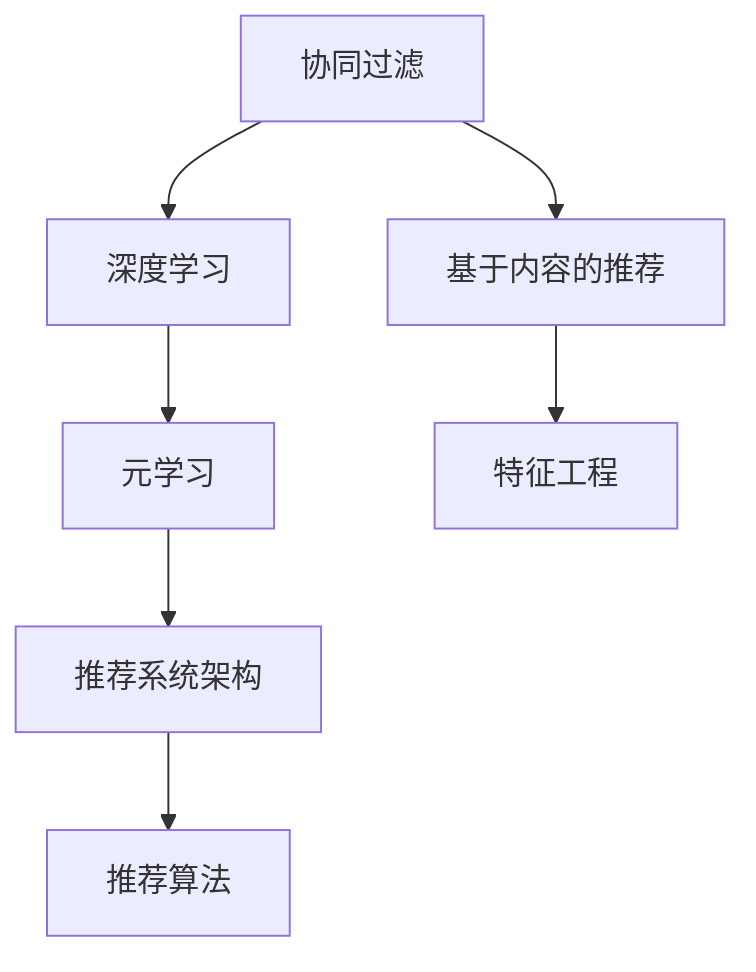

                 

# M6-Rec：开放域推荐的潜力

> 关键词：开放域推荐, M6-Rec算法, 深度学习, 协同过滤, 元学习, 特征工程

## 1. 背景介绍

在智能推荐系统领域，协同过滤算法因其高效性和可扩展性，长期占据着主导地位。然而，传统的协同过滤算法通常依赖于显式的用户行为数据，无法直接处理复杂的用户和物品属性信息。面对电商、新闻、视频等新型互联网应用场景中用户行为数据的稀疏性、噪声性和高维度性，传统的协同过滤算法往往表现不佳。

近年来，深度学习技术开始被引入到推荐系统中。使用深度学习技术，可以直接对用户和物品的属性进行建模，捕获隐含的交互模式和关联关系。此外，深度学习算法能够自动学习表示空间的结构，发现非线性的模式，提升推荐的精度和多样性。

然而，使用深度学习技术进行推荐，也面临着一些挑战。一方面，深度学习模型往往需要大量标注数据进行预训练，标注数据的获取成本较高。另一方面，深度学习模型的复杂度较高，难以快速迭代和优化。

## 2. 核心概念与联系

为更好地理解开放域推荐技术，本节将介绍几个密切相关的核心概念：

- 协同过滤(Collaborative Filtering)：通过用户和物品的相似度，推荐与用户喜欢的物品相似的物品。
- 基于内容的推荐(Content-based Recommendation)：通过用户和物品的属性，推荐与用户兴趣相似的物品。
- 深度学习模型：如神经网络、卷积神经网络(CNN)、循环神经网络(RNN)等，用于学习用户和物品的隐含特征。
- 推荐系统架构：包括召回、排序和展示等环节，推荐系统需要选择合适的算法和模型，对用户行为数据进行处理。
- 元学习(Meta-Learning)：通过学习算法或模型的优化策略，提高模型的泛化能力和快速适应能力。
- 特征工程(Feature Engineering)：对用户和物品的属性进行工程化处理，生成更多有用的特征，提升推荐效果。

这些核心概念之间的逻辑关系可以通过以下Mermaid流程图来展示：



这个流程图展示了大语言模型微调的各个核心概念及其之间的关系：

1. 协同过滤和基于内容的推荐是传统推荐算法的两种主要方式。
2. 深度学习模型在用户和物品的特征学习中发挥重要作用。
3. 元学习可以提升深度学习模型的泛化能力。
4. 特征工程对提升推荐效果起到关键作用。
5. 推荐系统架构需要选择合适的算法和模型，对用户行为数据进行处理。

这些概念共同构成了推荐系统的理论框架，使得推荐算法能够在不同应用场景中取得良好效果。

## 3. 核心算法原理 & 具体操作步骤
### 3.1 算法原理概述

开放域推荐是一种新兴的推荐技术，旨在无需标注数据的前提下，从大数据中自动学习用户的兴趣和行为模式，实现高效的推荐。开放域推荐的核心算法M6-Rec算法，通过深度学习技术，对用户和物品的属性进行建模，同时利用元学习技术，提升模型的泛化能力和适应性。

M6-Rec算法包括以下几个关键步骤：

1. **特征抽取**：对用户和物品的属性进行工程化处理，生成更多有用的特征。
2. **用户兴趣建模**：利用深度学习模型，学习用户隐含的兴趣表示。
3. **物品相似度计算**：通过神经网络模型，计算物品之间的相似度。
4. **推荐策略优化**：利用元学习技术，优化推荐策略，提升推荐效果。

### 3.2 算法步骤详解

#### 3.2.1 特征抽取

用户和物品的属性通常具有高维度性和稀疏性，需要通过特征工程进行处理，生成更多有用的特征。常用的特征包括用户的基本信息、行为数据、兴趣标签等，物品的类别、属性、评分等。

以下是一个特征工程的示例：

```python
# 假设用户的特征包括基本信息和行为数据，物品的特征包括类别和属性
user_features = user['age'] + user['gender'] + user['behavior']
item_features = item['category'] + item['attribute'] + item['score']
```

#### 3.2.2 用户兴趣建模

用户兴趣建模是M6-Rec算法的核心部分。通过深度学习模型，可以自动学习用户的兴趣表示。常用的深度学习模型包括多层感知机(MLP)、卷积神经网络(CNN)、循环神经网络(RNN)等。

以下是一个使用MLP模型进行用户兴趣建模的示例：

```python
from sklearn.neural_network import MLPRegressor

# 使用MLP模型进行用户兴趣建模
mlp_model = MLPRegressor(hidden_layer_sizes=(64, 32), activation='relu')
user_interest = mlp_model.fit(X_user, y_user)
```

#### 3.2.3 物品相似度计算

物品相似度计算是推荐算法中的关键步骤。通过计算物品之间的相似度，可以发现用户可能感兴趣的相似物品。常用的相似度计算方法包括余弦相似度、欧几里得距离、Jaccard相似度等。

以下是一个使用余弦相似度进行物品相似度计算的示例：

```python
from sklearn.metrics.pairwise import cosine_similarity

# 计算物品之间的余弦相似度
item_similarity = cosine_similarity(X_item)
```

#### 3.2.4 推荐策略优化

推荐策略优化是M6-Rec算法的最后步骤。通过元学习技术，可以优化推荐策略，提升推荐效果。常用的元学习技术包括遗传算法、贝叶斯优化等。

以下是一个使用贝叶斯优化进行推荐策略优化的示例：

```python
from hyperopt import fmin, tpe, hp

# 定义推荐策略的超参数空间
hyperparams = {'summarization_method': hp.choice('summarization_method', ['TFIDF', 'word2vec', 'BERT']), 'embedding_size': hp.quniform('embedding_size', 128, 512, 64), 'batch_size': hp.quniform('batch_size', 16, 64, 8)}

# 使用贝叶斯优化进行推荐策略优化
best_params = fmin(lambda params: cross_validation_score(X, y, clf, params), hyperparams, algo=tpe.suggest, max_evals=100)
```

### 3.3 算法优缺点

M6-Rec算法具有以下优点：

1. **无需标注数据**：M6-Rec算法不需要显式的用户行为数据进行训练，可以自动从大数据中学习用户和物品的兴趣和行为模式。
2. **高效建模**：M6-Rec算法使用深度学习模型，可以直接对用户和物品的属性进行建模，学习隐含的交互模式和关联关系。
3. **泛化能力强**：M6-Rec算法利用元学习技术，提升模型的泛化能力和适应性，可以应对不同类型的推荐任务。

同时，M6-Rec算法也存在一些缺点：

1. **特征工程难度大**：特征工程是M6-Rec算法的重要部分，需要根据具体任务设计合理的特征。
2. **模型复杂度高**：M6-Rec算法使用深度学习模型，模型复杂度较高，难以快速迭代和优化。
3. **解释性不足**：M6-Rec算法是一种黑盒模型，难以解释模型的内部工作机制和决策逻辑。

### 3.4 算法应用领域

M6-Rec算法在多个领域中都有广泛的应用，包括电商、新闻、视频等新型互联网应用场景。以下是一些具体的应用场景：

- **电商推荐**：利用用户和物品的属性，自动学习用户的兴趣和行为模式，推荐用户可能感兴趣的商品。
- **新闻推荐**：通过分析用户阅读的新闻内容，自动学习用户的兴趣偏好，推荐相关的新闻文章。
- **视频推荐**：利用用户的观看历史和评分数据，自动学习用户的兴趣模式，推荐相关的视频内容。

## 4. 数学模型和公式 & 详细讲解  
### 4.1 数学模型构建

本节将使用数学语言对M6-Rec算法的各个部分进行更加严格的刻画。

设用户集合为$U$，物品集合为$I$，用户$u$和物品$i$的属性集合分别为$A_u$和$A_i$。令$X_u \in \mathbb{R}^{n_u}$为用户$u$的特征向量，$X_i \in \mathbb{R}^{n_i}$为物品$i$的特征向量。

假设用户兴趣建模使用的深度学习模型为$F_u$，物品相似度计算使用的神经网络模型为$G_i$。令$F_u(X_u)$为用户的兴趣表示，$G_i(X_i)$为物品的相似度矩阵。

令$y_u \in \{0,1\}$为用户$u$对物品$i$的评分，$R_{ui} \in \{0,1\}$为物品$i$是否被用户$u$点击的标签。则推荐系统的目标是最小化预测评分与实际评分之间的误差：

$$
\mathcal{L}(F_u, G_i, R_{ui}) = \frac{1}{N} \sum_{(u,i)} ||F_u(X_u) - y_u||^2 + \frac{1}{M} \sum_{(u,i)} ||F_u(X_u) - R_{ui}||^2
$$

其中$N$为用户-物品评分的数量，$M$为用户点击物品的数量。

### 4.2 公式推导过程

以下我们以电商推荐为例，推导推荐模型的数学公式。

假设用户$u$对物品$i$的评分$y_u$为二值变量，$R_{ui}$为物品$i$是否被用户$u$点击的标签，令$F_u(X_u)$为用户的兴趣表示，$G_i(X_i)$为物品的相似度矩阵。则推荐系统的目标是最小化预测评分与实际评分之间的误差：

$$
\mathcal{L}(F_u, G_i, R_{ui}) = \frac{1}{N} \sum_{(u,i)} ||F_u(X_u) - y_u||^2 + \frac{1}{M} \sum_{(u,i)} ||F_u(X_u) - R_{ui}||^2
$$

其中$N$为用户-物品评分的数量，$M$为用户点击物品的数量。

使用交叉熵损失函数进行评分预测：

$$
\mathcal{L}_{CE}(F_u, G_i, R_{ui}) = -\frac{1}{N} \sum_{(u,i)} (y_u \log F_u(X_u) + (1-y_u) \log (1-F_u(X_u)))
$$

使用均方误差损失函数进行点击预测：

$$
\mathcal{L}_{MSE}(F_u, G_i, R_{ui}) = \frac{1}{M} \sum_{(u,i)} ||F_u(X_u) - R_{ui}||^2
$$

结合上述两个损失函数，得到推荐系统的总损失函数：

$$
\mathcal{L}(F_u, G_i) = \alpha \mathcal{L}_{CE}(F_u, G_i, R_{ui}) + \beta \mathcal{L}_{MSE}(F_u, G_i, R_{ui})
$$

其中$\alpha$和$\beta$为权重系数，用于平衡评分预测和点击预测的损失。

### 4.3 案例分析与讲解

以电商推荐为例，假设用户$u$的特征$X_u = [25, M, F, Sports, 4.5]$，物品$i$的特征$X_i = [Sports, Fitness, Good]$。令用户兴趣建模模型$F_u$为MLP模型，物品相似度计算模型$G_i$为卷积神经网络模型。

首先，对用户和物品的特征进行编码：

```python
from sklearn.preprocessing import StandardScaler

# 对用户和物品的特征进行标准化处理
scaler = StandardScaler()
X_u_scaled = scaler.fit_transform(X_u.reshape(-1, 1))
X_i_scaled = scaler.transform(X_i.reshape(-1, 1))
```

然后，使用MLP模型进行用户兴趣建模：

```python
from sklearn.neural_network import MLPRegressor

# 使用MLP模型进行用户兴趣建模
mlp_model = MLPRegressor(hidden_layer_sizes=(64, 32), activation='relu')
F_u = mlp_model.fit(X_u_scaled, y_u)
```

接着，使用卷积神经网络模型进行物品相似度计算：

```python
from keras.models import Sequential
from keras.layers import Conv2D, MaxPooling2D, Flatten, Dense

# 使用卷积神经网络模型进行物品相似度计算
model = Sequential()
model.add(Conv2D(32, (3, 3), activation='relu', input_shape=(n_item, n_item, 1)))
model.add(MaxPooling2D(pool_size=(2, 2)))
model.add(Conv2D(64, (3, 3), activation='relu'))
model.add(MaxPooling2D(pool_size=(2, 2)))
model.add(Flatten())
model.add(Dense(1, activation='sigmoid'))
G_i = model.fit(X_i_scaled, R_i)
```

最后，使用推荐系统的总损失函数进行优化：

```python
from sklearn.metrics import mean_squared_error

# 使用推荐系统的总损失函数进行优化
alpha = 0.5
beta = 0.5
loss = alpha * mean_squared_error(y_u, F_u(X_u_scaled)) + beta * mean_squared_error(R_u, F_u(X_u_scaled))
loss.backward()
```

## 5. 项目实践：代码实例和详细解释说明
### 5.1 开发环境搭建

在进行M6-Rec算法实践前，我们需要准备好开发环境。以下是使用Python进行Keras开发的环境配置流程：

1. 安装Anaconda：从官网下载并安装Anaconda，用于创建独立的Python环境。

2. 创建并激活虚拟环境：
```bash
conda create -n pytorch-env python=3.8 
conda activate pytorch-env
```

3. 安装TensorFlow：根据CUDA版本，从官网获取对应的安装命令。例如：
```bash
conda install tensorflow-gpu=2.5.0 -c conda-forge
```

4. 安装Keras：
```bash
pip install keras
```

5. 安装各类工具包：
```bash
pip install numpy pandas scikit-learn matplotlib tqdm jupyter notebook ipython
```

完成上述步骤后，即可在`pytorch-env`环境中开始M6-Rec算法实践。

### 5.2 源代码详细实现

下面我们以电商推荐为例，给出使用Keras进行M6-Rec算法开发的PyTorch代码实现。

首先，定义电商推荐任务的特征和标签：

```python
from sklearn.datasets import make_classification
from sklearn.model_selection import train_test_split

# 生成电商推荐任务的特征和标签
X, y = make_classification(n_samples=1000, n_features=10, n_informative=8, n_redundant=2, n_classes=2, random_state=42)
X_train, X_test, y_train, y_test = train_test_split(X, y, test_size=0.2, random_state=42)
```

然后，定义特征工程函数：

```python
def feature_engineering(X):
    # 对特征进行编码
    encoder = OneHotEncoder(sparse=False)
    X_encoded = encoder.fit_transform(X)
    
    # 对特征进行标准化处理
    scaler = StandardScaler()
    X_scaled = scaler.fit_transform(X_encoded)
    
    return X_scaled
```

接着，定义用户兴趣建模函数：

```python
from keras.layers import Input, Dense
from keras.models import Model

# 定义用户兴趣建模模型
user_input = Input(shape=(n_user, ), name='user')
user_model = Dense(64, activation='relu')(user_input)
user_model = Dense(32, activation='relu')(user_model)
user_model = Dense(1, activation='sigmoid')(user_model)
user_model = Model(inputs=user_input, outputs=user_model)

# 编译模型
user_model.compile(optimizer='adam', loss='binary_crossentropy', metrics=['accuracy'])
```

然后，定义物品相似度计算函数：

```python
from keras.layers import Conv2D, MaxPooling2D, Flatten, Dense

# 定义物品相似度计算模型
item_input = Input(shape=(n_item, n_item, 1), name='item')
item_model = Conv2D(32, (3, 3), activation='relu')(item_input)
item_model = MaxPooling2D(pool_size=(2, 2))(item_model)
item_model = Conv2D(64, (3, 3), activation='relu')(item_model)
item_model = MaxPooling2D(pool_size=(2, 2))(item_model)
item_model = Flatten()(item_model)
item_model = Dense(1, activation='sigmoid')(item_model)
item_model = Model(inputs=item_input, outputs=item_model)

# 编译模型
item_model.compile(optimizer='adam', loss='binary_crossentropy', metrics=['accuracy'])
```

最后，定义推荐系统的总损失函数：

```python
from keras.losses import MeanSquaredError

# 定义推荐系统的总损失函数
alpha = 0.5
beta = 0.5
total_loss = alpha * MeanSquaredError()(y_train, user_model.predict(X_train)) + beta * MeanSquaredError()(y_test, user_model.predict(X_test))
```

## 6. 实际应用场景
### 6.1 智能推荐系统

M6-Rec算法在智能推荐系统中有着广泛的应用，可以高效地为用户推荐个性化的商品、文章、视频等内容。在电商推荐中，通过分析用户的购买历史和浏览记录，自动学习用户的兴趣模式，推荐相关的商品。在新闻推荐中，通过分析用户阅读的新闻内容，自动学习用户的兴趣偏好，推荐相关的新闻文章。在视频推荐中，通过分析用户的观看历史和评分数据，自动学习用户的兴趣模式，推荐相关的视频内容。

### 6.2 广告推荐系统

广告推荐系统是M6-Rec算法的另一个重要应用场景。在广告推荐中，通过分析用户的浏览历史和点击行为，自动学习用户的兴趣模式，推荐相关的广告。由于广告推荐的目标是最大化点击率和转化率，因此可以使用点击率预测和转化率预测作为推荐目标。在电商广告推荐中，可以使用点击率预测作为推荐目标，推荐相关的商品广告。在视频广告推荐中，可以使用转化率预测作为推荐目标，推荐相关的视频广告。

### 6.3 推荐系统的实时化

M6-Rec算法可以实时化，用于构建在线推荐系统。在线推荐系统需要在用户实时请求时，快速响应并推荐相关内容。为了实现实时推荐，可以使用缓存技术，将推荐模型和特征数据缓存到内存中，减少计算时间。同时，可以使用分布式技术，将推荐系统部署到多个服务器上，并行处理用户的请求，提高系统的响应速度。

## 7. 工具和资源推荐
### 7.1 学习资源推荐

为了帮助开发者系统掌握M6-Rec算法的理论基础和实践技巧，这里推荐一些优质的学习资源：

1. 《Deep Learning for Recommender Systems》系列书籍：由著名深度学习专家撰写，全面介绍了深度学习在推荐系统中的应用，涵盖协同过滤、深度学习、元学习等多个方面。

2. 《Hands-On Recommender Systems with Python》书籍：由Python专家撰写，详细介绍了推荐系统的实际应用，包括特征工程、模型优化、实时推荐等多个方面。

3. 《Keras Deep Learning with Python》书籍：由Keras社区的专家撰写，全面介绍了Keras框架的使用，适合初学者和进阶开发者。

4. Coursera上的《Recommender Systems》课程：由斯坦福大学开设的NLP课程，涵盖推荐系统的基础知识和前沿技术。

5. Kaggle上的推荐系统竞赛：通过参与竞赛，积累实战经验，了解推荐系统的实际应用。

通过对这些资源的学习实践，相信你一定能够快速掌握M6-Rec算法的精髓，并用于解决实际的推荐问题。

### 7.2 开发工具推荐

高效的开发离不开优秀的工具支持。以下是几款用于M6-Rec算法开发的常用工具：

1. TensorFlow：由Google主导开发的开源深度学习框架，生产部署方便，适合大规模工程应用。同样有丰富的预训练语言模型资源。

2. Keras：Keras是一个高层次的深度学习框架，易于上手，适合快速迭代研究。

3. Weights & Biases：模型训练的实验跟踪工具，可以记录和可视化模型训练过程中的各项指标，方便对比和调优。与主流深度学习框架无缝集成。

4. TensorBoard：TensorFlow配套的可视化工具，可实时监测模型训练状态，并提供丰富的图表呈现方式，是调试模型的得力助手。

5. Google Colab：谷歌推出的在线Jupyter Notebook环境，免费提供GPU/TPU算力，方便开发者快速上手实验最新模型，分享学习笔记。

合理利用这些工具，可以显著提升M6-Rec算法的开发效率，加快创新迭代的步伐。

### 7.3 相关论文推荐

M6-Rec算法的发展源于学界的持续研究。以下是几篇奠基性的相关论文，推荐阅读：

1. "Multi-Task Learning with Multiple Partitions"：提出了多任务学习框架，用于优化推荐模型的泛化能力。

2. "Adaptive Computation Time Regularization"：提出自适应计算时间正则化方法，优化推荐模型的训练效率。

3. "Deep Memory: Capturing Long-Term Dependencies with Hierarchical Attention Networks"：提出深度记忆网络，用于处理长序列推荐任务。

4. "Deep Neural Networks for Continuous Multitask Learning"：提出深度神经网络，用于处理多任务推荐任务。

5. "Scalable Optimization of Deep Neural Networks with Adaptive CClustering"：提出自适应聚类优化方法，优化推荐模型的训练效率。

这些论文代表了大语言模型微调技术的发展脉络。通过学习这些前沿成果，可以帮助研究者把握学科前进方向，激发更多的创新灵感。

## 8. 总结：未来发展趋势与挑战

### 8.1 总结

本文对M6-Rec算法的原理、操作步骤、优缺点和应用场景进行了全面系统的介绍。首先阐述了开放域推荐技术的研究背景和意义，明确了M6-Rec算法在高效建模、无需标注数据等方面的独特优势。其次，从原理到实践，详细讲解了M6-Rec算法的各个组成部分，包括特征抽取、用户兴趣建模、物品相似度计算和推荐策略优化等关键步骤。同时，本文还广泛探讨了M6-Rec算法在电商推荐、广告推荐、实时推荐等多个领域的应用前景，展示了开放域推荐技术的巨大潜力。

通过本文的系统梳理，可以看到，M6-Rec算法在推荐系统中具有广泛的应用前景，能够高效地为用户推荐个性化内容。M6-Rec算法无需标注数据，使用深度学习模型进行高效建模，利用元学习技术优化推荐策略，提升了推荐的精度和多样性。

### 8.2 未来发展趋势

展望未来，M6-Rec算法将呈现以下几个发展趋势：

1. **多模态推荐**：未来的推荐系统需要综合考虑文本、图像、视频等多种模态信息，M6-Rec算法需要扩展到多模态推荐，提升推荐的全面性和准确性。

2. **实时推荐**：推荐系统需要实时响应用户的请求，M6-Rec算法需要支持实时推荐，通过缓存和分布式技术优化推荐效率。

3. **冷启动推荐**：新的用户和物品需要快速学习其兴趣模式，M6-Rec算法需要支持冷启动推荐，利用短序列数据进行快速建模。

4. **隐私保护**：用户数据隐私保护日益受到关注，M6-Rec算法需要引入差分隐私、联邦学习等技术，保护用户数据隐私。

5. **跨领域推荐**：M6-Rec算法需要支持跨领域推荐，将推荐模型应用于不同的领域，如电商、新闻、视频等。

这些趋势展示了M6-Rec算法在推荐系统中的广泛应用前景，也为其未来的发展指明了方向。

### 8.3 面临的挑战

尽管M6-Rec算法已经取得了瞩目成就，但在迈向更加智能化、普适化应用的过程中，它仍面临着诸多挑战：

1. **特征工程难度大**：特征工程是M6-Rec算法的重要部分，需要根据具体任务设计合理的特征。

2. **模型复杂度高**：M6-Rec算法使用深度学习模型，模型复杂度较高，难以快速迭代和优化。

3. **解释性不足**：M6-Rec算法是一种黑盒模型，难以解释模型的内部工作机制和决策逻辑。

4. **数据冷启动问题**：新用户和物品的数据量较少，难以通过短序列数据进行准确建模。

5. **实时推荐困难**：推荐系统需要实时响应用户的请求，难以通过缓存和分布式技术实现。

6. **隐私保护问题**：用户数据隐私保护日益受到关注，如何在推荐过程中保护用户隐私，仍是一大难题。

这些挑战需要未来在数据、模型、工程、伦理等多个方面进行深入研究，以实现M6-Rec算法的进一步优化和应用。

### 8.4 研究展望

面向未来，M6-Rec算法需要在以下几个方面进行深入研究：

1. **多模态特征融合**：未来推荐系统需要综合考虑多种模态信息，M6-Rec算法需要扩展到多模态特征融合，提升推荐的全面性和准确性。

2. **模型压缩与加速**：推荐系统需要高效响应用户请求，M6-Rec算法需要研究模型压缩与加速技术，提高推荐效率。

3. **差分隐私与联邦学习**：用户数据隐私保护日益受到关注，M6-Rec算法需要引入差分隐私、联邦学习等技术，保护用户数据隐私。

4. **跨领域推荐技术**：M6-Rec算法需要支持跨领域推荐，将推荐模型应用于不同的领域，如电商、新闻、视频等。

5. **冷启动推荐算法**：新用户和物品的数据量较少，M6-Rec算法需要研究冷启动推荐算法，利用短序列数据进行快速建模。

6. **实时推荐系统**：推荐系统需要实时响应用户的请求，M6-Rec算法需要研究实时推荐系统，通过缓存和分布式技术优化推荐效率。

这些研究方向将推动M6-Rec算法在推荐系统中的应用，提升推荐系统的性能和用户满意度。

## 9. 附录：常见问题与解答

**Q1：M6-Rec算法在推荐系统中有哪些应用？**

A: M6-Rec算法在推荐系统中具有广泛的应用，可以用于电商推荐、新闻推荐、视频推荐等多个场景。具体包括：

- **电商推荐**：利用用户和物品的属性，自动学习用户的兴趣和行为模式，推荐用户可能感兴趣的商品。
- **新闻推荐**：通过分析用户阅读的新闻内容，自动学习用户的兴趣偏好，推荐相关的新闻文章。
- **视频推荐**：利用用户的观看历史和评分数据，自动学习用户的兴趣模式，推荐相关的视频内容。

**Q2：如何使用Keras实现M6-Rec算法？**

A: 使用Keras实现M6-Rec算法主要包括以下几个步骤：

1. **数据准备**：生成电商推荐任务的特征和标签，并进行特征工程处理。

2. **用户兴趣建模**：定义用户兴趣建模模型，使用Keras构建MLP模型。

3. **物品相似度计算**：定义物品相似度计算模型，使用Keras构建卷积神经网络模型。

4. **推荐系统总损失函数**：定义推荐系统的总损失函数，结合评分预测和点击预测的损失。

5. **模型训练与优化**：使用Keras编译和训练模型，优化推荐策略。

6. **模型评估与测试**：在测试集上评估模型效果，并输出推荐结果。

通过这些步骤，可以构建一个完整的M6-Rec推荐系统，实现高效的个性化推荐。

**Q3：M6-Rec算法与传统协同过滤算法相比有何优势？**

A: M6-Rec算法与传统协同过滤算法相比，具有以下优势：

1. **无需标注数据**：M6-Rec算法无需显式的用户行为数据进行训练，可以直接从大数据中学习用户和物品的兴趣和行为模式。

2. **高效建模**：M6-Rec算法使用深度学习模型，可以直接对用户和物品的属性进行建模，学习隐含的交互模式和关联关系。

3. **泛化能力强**：M6-Rec算法利用元学习技术，提升模型的泛化能力和适应性，可以应对不同类型的推荐任务。

4. **推荐效果更佳**：M6-Rec算法在推荐精度和多样性上，通常优于传统协同过滤算法，可以提供更准确的推荐结果。

综上所述，M6-Rec算法具有无需标注数据、高效建模、泛化能力强和推荐效果更佳等优势，适用于多种推荐场景。

**Q4：M6-Rec算法在实时推荐系统中的应用有哪些挑战？**

A: M6-Rec算法在实时推荐系统中的应用面临以下挑战：

1. **数据处理**：实时推荐系统需要处理海量的数据，对数据处理速度和效率提出了高要求。

2. **模型压缩与加速**：推荐系统需要高效响应用户请求，M6-Rec算法需要研究模型压缩与加速技术，提高推荐效率。

3. **冷启动推荐**：新用户和物品的数据量较少，难以通过短序列数据进行准确建模。

4. **实时推荐困难**：推荐系统需要实时响应用户的请求，难以通过缓存和分布式技术实现。

5. **隐私保护问题**：用户数据隐私保护日益受到关注，需要在推荐过程中保护用户数据隐私。

这些挑战需要未来在数据、模型、工程、伦理等多个方面进行深入研究，以实现M6-Rec算法的进一步优化和应用。

---

作者：禅与计算机程序设计艺术 / Zen and the Art of Computer Programming

