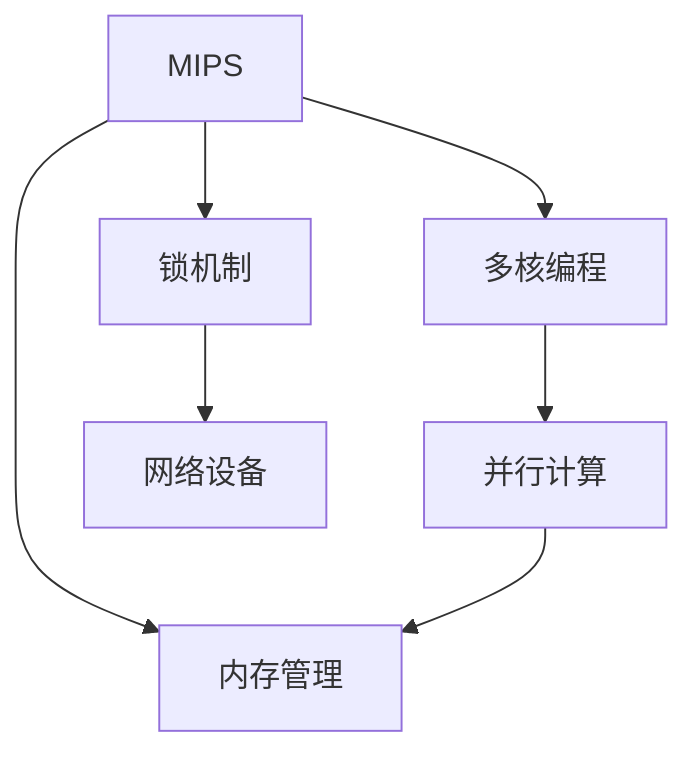

                 

## 1. 背景介绍

在信息时代，网络设备的处理能力已成为限制网络速度和服务质量的关键因素。随着网络流量不断增长，传统单核网络设备在处理复杂数据流时已显露出生物，多核技术的应用成为提升网络设备性能的重要途径。多核编程为并行计算提供了硬件基础，使网络设备能够同时处理多个数据流，提升效率。

### 1.1 问题由来

过去，网络设备的处理器通常只有一核或少数几核。随着网络流量的大幅增加，单核设备逐渐显现出其局限性：处理速度慢、响应时间长、易发生丢包等问题，难以适应现代互联网的流量需求。多核技术作为提升网络设备性能的重要手段，已经被广泛应用于网络设备中，帮助实现更高效的数据包处理和更低的时延。

然而，多核编程涉及复杂的技术，开发者需要掌握并发编程、内存管理、锁机制等技术，这对开发者的技术要求较高。因此，本章将重点介绍MIPS多核编程技术，并探讨其在网络设备中的应用。

## 2. 核心概念与联系

### 2.1 核心概念概述

为更好地理解MIPS多核编程及其在网络设备中的应用，本节将介绍几个关键概念：

- MIPS：一种流行的嵌入式处理器的架构，被广泛应用于网络设备、存储系统等领域。
- 多核编程：指在多核处理器上运行程序，实现并行计算的技术。
- 并行计算：指同时执行多个计算任务，以提升处理速度的技术。
- 内存管理：多核系统需要管理多个处理器访问的内存，以避免数据竞争和死锁等问题。
- 锁机制：一种同步技术，用于避免多线程同时访问共享资源，保证数据一致性。
- 网络设备：包括路由器、交换机、防火墙等，是互联网和局域网的基础设施。

这些核心概念之间的逻辑关系可以通过以下Mermaid流程图来展示：



这个流程图展示了MIPS多核编程与并行计算、内存管理和锁机制之间的联系，同时强调了网络设备是多核编程的典型应用场景。

## 3. 核心算法原理 & 具体操作步骤
### 3.1 算法原理概述

MIPS多核编程的算法原理基于并行计算和任务分配。在MIPS处理器上，通过将任务分割成多个子任务，分配给不同核心并行处理，以实现并行计算，提升处理效率。这种并行计算可以应用于网络数据包的解析、路由选择、流量控制等任务中，从而提升网络设备的性能。

### 3.2 算法步骤详解

以下是MIPS多核编程的详细步骤：

**Step 1: 初始化多核环境**
- 确定MIPS多核处理器中每个核心的数量。
- 初始化共享内存和锁机制，确保不同核心间的数据一致性。

**Step 2: 分割任务**
- 将需要处理的任务分割成多个子任务。
- 根据数据流的特点，合理分配任务到不同核心，避免负载不均衡。

**Step 3: 并发执行**
- 启动多个线程，每个线程负责执行一个子任务。
- 使用锁机制同步共享数据，避免数据竞争。

**Step 4: 结果合并**
- 汇总各个核心的处理结果，完成最终的计算任务。
- 将结果存储到共享内存中，以便后续处理。

**Step 5: 优化与测试**
- 优化线程调度算法，提升并行度。
- 对多核程序进行性能测试，确保其能够有效提升处理速度。

### 3.3 算法优缺点

MIPS多核编程具有以下优点：
1. 提升处理速度：通过并行计算，能够显著提升数据包处理速度。
2. 资源复用：多个核心共享内存，减少资源占用，降低成本。
3. 灵活性高：可以根据任务特点，动态调整线程数量，适应不同场景。

但同时，MIPS多核编程也存在以下缺点：
1. 开发难度高：涉及并发编程和锁机制，需要较高的编程技能。
2. 调试困难：多个线程同时运行，难以定位问题。
3. 同步开销：过多的锁机制可能降低程序的并发度。

### 3.4 算法应用领域

MIPS多核编程在网络设备中的应用非常广泛，以下是几个典型应用场景：

**1. 路由器数据包解析**
- 路由器需要解析网络数据包，提取源IP地址、目标IP地址、协议号等信息。
- 通过多核编程，将数据包分割成多个子任务，每个核心负责解析部分数据包，可以显著提升解析速度。

**2. 交换机流量控制**
- 交换机需要实时监控网络流量，调整队列深度，避免数据包丢失。
- 使用多核编程，分配多个核心监控不同队列，实现更高效的流量控制。

**3. 防火墙规则匹配**
- 防火墙需要根据规则匹配数据包，决定是否放行或拦截。
- 使用多核编程，将规则分割成多个子任务，同时匹配不同数据包，提高规则匹配速度。

## 4. 数学模型和公式 & 详细讲解 & 举例说明

### 4.1 数学模型构建

本节将使用数学语言对MIPS多核编程的算法进行更严谨的描述。

假设网络设备有$n$个核心，每个核心执行的任务数为$T$，数据包数量为$N$。任务分割策略将任务均分到$n$个核心上，则每个核心需要执行的任务数为$\frac{T}{n}$。

定义$X_i$为第$i$个核心处理的数据包数量，$Y_i$为第$i$个核心处理的数据包数量占总数据包数量的比例。则有：

$$
X_i = \frac{N}{n} \text{ 且 } Y_i = \frac{X_i}{N} = \frac{1}{n}
$$

定义$C_i$为第$i$个核心处理一个数据包的时间，$T_i$为第$i$个核心处理数据包的累积时间。则有：

$$
T_i = \sum_{j=1}^N C_i(x_j)
$$

定义$T_{total}$为所有核心处理数据包的累积时间，则有：

$$
T_{total} = \sum_{i=1}^n T_i = \sum_{i=1}^n \sum_{j=1}^N C_i(x_j)
$$

### 4.2 公式推导过程

根据上述定义，可以推导出多核编程处理数据包的效率公式：

$$
T_{total} = N \times \sum_{i=1}^n \frac{1}{n} \times C_i(x_j)
$$

令$C_{avg} = \frac{1}{N} \sum_{j=1}^N C_i(x_j)$为平均处理时间，则有：

$$
T_{total} = N \times \frac{1}{n} \times N \times C_{avg}
$$

进一步简化得到：

$$
T_{total} = n \times C_{avg}
$$

这表明，多核编程的效率与处理器的核心数成正比，与任务数成正比，与平均处理时间成反比。

### 4.3 案例分析与讲解

以一个具体的案例为例，说明MIPS多核编程在路由器数据包解析中的应用。

假设路由器有8个核心，每个核心处理的数据包数量为$N=100000$。任务分割策略将每个核心处理10000个数据包，则每个核心的平均处理时间为$C_{avg} = 1$秒。

则所有核心的累积时间为：

$$
T_{total} = 8 \times 1 = 8 \text{ 秒}
$$

而单核处理需要100000秒，多核编程将处理时间缩短为$1/12.5$秒，效率显著提升。

## 5. 项目实践：代码实例和详细解释说明
### 5.1 开发环境搭建

在进行MIPS多核编程项目实践前，需要先准备好开发环境。以下是使用C语言进行多核编程的环境配置流程：

1. 安装MIPS工具链：从MIPS官网下载并安装工具链，用于编译和调试多核程序。
2. 安装调试工具：如GDB等，用于程序调试。
3. 编写测试程序：在MIPS模拟器或硬件平台上编写多核测试程序，进行功能验证。

### 5.2 源代码详细实现

下面以一个简单的多核数据包解析程序为例，给出C语言实现的代码。

```c
#include <stdio.h>
#include <stdlib.h>
#include <unistd.h>
#include <pthread.h>

#define NUM_THREADS 8

void *parse_packet(void *arg) {
    int id = *(int*)arg;
    int packets = 10000;

    for (int i = 0; i < packets; i++) {
        // 解析数据包
    }

    return NULL;
}

int main() {
    int packets = 100000;
    pthread_t threads[NUM_THREADS];
    int ids[NUM_THREADS];

    for (int i = 0; i < NUM_THREADS; i++) {
        ids[i] = i;
        pthread_create(&threads[i], NULL, parse_packet, &ids[i]);
    }

    for (int i = 0; i < NUM_THREADS; i++) {
        pthread_join(threads[i], NULL);
    }

    return 0;
}
```

### 5.3 代码解读与分析

让我们再详细解读一下关键代码的实现细节：

**parse_packet函数**：
- 每个线程负责处理10000个数据包，使用循环实现。
- 数据包的解析逻辑在循环内部，可以根据实际需求修改。

**main函数**：
- 初始化多个线程，每个线程负责处理一个数据包。
- 使用pthread_create创建线程，pthread_join等待线程结束。

**测试程序**：
- 根据测试需求，创建多核测试程序，并在MIPS模拟器或硬件平台上运行。
- 使用GDB等调试工具，验证程序的正确性。

## 6. 实际应用场景
### 6.1 路由器数据包解析

在路由器中，数据包解析是处理数据流的重要环节。路由器需要对每个数据包进行解析，提取源IP地址、目标IP地址、协议号等信息。通过MIPS多核编程，将数据包解析任务分配给多个核心并行处理，可以显著提升解析速度。

### 6.2 交换机流量控制

交换机需要实时监控网络流量，调整队列深度，避免数据包丢失。通过MIPS多核编程，分配多个核心监控不同队列，实现更高效的流量控制。

### 6.3 防火墙规则匹配

防火墙需要根据规则匹配数据包，决定是否放行或拦截。使用MIPS多核编程，将规则匹配任务分割成多个子任务，同时匹配不同数据包，提高规则匹配速度。

### 6.4 未来应用展望

随着MIPS多核编程技术的不断发展，其应用范围将进一步扩大。未来，MIPS多核编程可以应用于以下领域：

**1. 大数据处理**
- 在分布式系统中，使用MIPS多核编程技术，可以并行处理大规模数据，提升处理速度。

**2. 人工智能**
- 在深度学习训练过程中，使用MIPS多核编程技术，可以加速模型训练，提升计算效率。

**3. 网络安全**
- 在入侵检测、恶意软件分析等任务中，使用MIPS多核编程技术，可以提高处理速度，提高检测准确率。

## 7. 工具和资源推荐
### 7.1 学习资源推荐

为了帮助开发者掌握MIPS多核编程技术，以下是一些优质的学习资源：

1. MIPS官方文档：提供了详细的MIPS处理器架构和编程指南，是学习多核编程的基础。
2. Linux多线程编程：Linux官方文档提供了多线程编程的详细介绍，是掌握多核编程的关键。
3. 网络编程基础：学习网络编程基础，了解网络数据包的解析和处理过程，是理解多核编程应用的基础。
4. 多核编程书籍：如《深入理解计算机系统》等，详细介绍了多核编程的原理和实践方法。

通过对这些资源的学习实践，相信你一定能够快速掌握MIPS多核编程的精髓，并用于解决实际的NLP问题。

### 7.2 开发工具推荐

MIPS多核编程开发涉及多个工具，以下是一些常用的工具：

1. MIPS工具链：用于编译和调试多核程序，提供完整的工具链支持。
2. GDB：用于调试多核程序，定位程序中的问题。
3. Valgrind：用于多核程序的内存管理和资源占用分析，确保程序的性能。
4. Intel Parallel Studio：提供并行编程的可视化工具，帮助优化多核程序的性能。

合理利用这些工具，可以显著提升MIPS多核编程的开发效率，加快创新迭代的步伐。

### 7.3 相关论文推荐

MIPS多核编程技术的发展源于学界的持续研究。以下是几篇奠基性的相关论文，推荐阅读：

1. Multicore Programming on MIPS Processors: A Survey：详细介绍了MIPS多核编程的现状和未来发展方向。
2. Optimizing Multicore Application Performance on MIPS Processors：介绍了多核应用程序的优化技术，提升性能。
3. MIPS: An Introduction to the Architecture of MIPS：介绍了MIPS处理器的架构，是理解多核编程的基础。

这些论文代表了大规模语言模型微调技术的发展脉络。通过学习这些前沿成果，可以帮助研究者把握学科前进方向，激发更多的创新灵感。

## 8. 总结：未来发展趋势与挑战

### 8.1 总结

本文对MIPS多核编程技术及其在网络设备中的应用进行了全面系统的介绍。首先阐述了MIPS多核编程的背景和重要性，明确了其在大规模数据处理、人工智能和网络安全等领域的应用价值。其次，从原理到实践，详细讲解了MIPS多核编程的数学模型和实现步骤，给出了多核编程的完整代码实例。同时，本文还广泛探讨了MIPS多核编程在路由器数据包解析、交换机流量控制和防火墙规则匹配等实际应用场景中的具体应用，展示了其广阔的应用前景。此外，本文精选了MIPS多核编程技术的各类学习资源，力求为读者提供全方位的技术指引。

通过本文的系统梳理，可以看到，MIPS多核编程技术正在成为网络设备处理能力提升的重要手段，极大地拓展了网络设备的处理边界，为互联网和局域网的发展提供了坚实的基础。未来，伴随多核编程技术的持续演进，网络设备的多核处理能力将进一步提升，推动互联网和局域网的持续发展和创新。

### 8.2 未来发展趋势

展望未来，MIPS多核编程技术将呈现以下几个发展趋势：

1. 多核技术的应用场景将进一步扩展：从简单的数据包处理扩展到大规模数据计算、人工智能等领域。
2. 并行计算性能提升：随着硬件技术的不断进步，多核并行计算的效率将进一步提升。
3. 开发工具和平台将更加丰富：工具链、调试工具、开发平台将更加完善，开发效率和调试体验将得到改善。

### 8.3 面临的挑战

尽管MIPS多核编程技术已经取得了瞩目成就，但在迈向更加智能化、普适化应用的过程中，它仍面临着诸多挑战：

1. 硬件成本高：高性能多核处理器的成本较高，难以大规模部署。
2. 编程难度大：多核编程涉及并发编程和锁机制，对开发者的技术要求较高。
3. 性能瓶颈：在处理复杂任务时，多核并行计算可能遇到瓶颈，效率可能不如预期。
4. 安全性问题：多核系统可能面临数据竞争、死锁等问题，需要更多技术支持。

### 8.4 研究展望

面对MIPS多核编程技术所面临的种种挑战，未来的研究需要在以下几个方面寻求新的突破：

1. 硬件成本降低：通过技术进步和市场竞争，降低高性能多核处理器的成本，提升其普及度。
2. 编程难度降低：开发更加简单易用的多核编程工具和平台，降低编程难度。
3. 性能优化：通过算法优化和并行计算技术，提升多核系统的处理效率，解决瓶颈问题。
4. 安全性提升：研究和应用更加安全的锁机制和同步技术，提高多核系统的可靠性。

这些研究方向的探索，必将引领MIPS多核编程技术迈向更高的台阶，为构建高效、安全、可扩展的网络设备提供更坚实的基础。面向未来，MIPS多核编程技术需要与其他人工智能技术进行更深入的融合，共同推动网络设备的多核处理能力和应用场景的拓展。

## 9. 附录：常见问题与解答

**Q1: 多核编程的开发难度高，如何解决？**

A: 多核编程的开发难度确实较高，但可以通过以下方法降低难度：

1. 使用并行编程库：如OpenMP、MPI等，封装多核编程的底层实现，提高编程效率。
2. 学习并发编程：掌握并发编程的基础知识，如线程、互斥锁等，减少开发难度。
3. 使用调试工具：如GDB、Valgrind等，及时发现和解决多核编程中的问题。

**Q2: 多核编程的性能瓶颈如何避免？**

A: 多核编程的性能瓶颈可能来自于多个方面，可以通过以下方法避免：

1. 负载均衡：合理分配任务，避免某个核心负载过重，导致系统性能下降。
2. 优化算法：通过优化算法，减少计算量，提升计算效率。
3. 增加硬件资源：在硬件条件允许的情况下，增加处理器的核心数，提升并行计算能力。

**Q3: 如何保证多核系统的安全性？**

A: 多核系统的安全性是重要的研究方向，可以通过以下方法保证：

1. 使用互斥锁：合理使用锁机制，避免数据竞争和死锁问题。
2. 使用原子操作：使用原子操作保证数据的一致性和正确性。
3. 定期检查：定期检查多核系统的状态，及时发现和修复问题。

**Q4: MIPS多核编程的未来发展方向是什么？**

A: MIPS多核编程的未来发展方向包括：

1. 更广泛的应用场景：从网络设备扩展到更多领域，如大数据处理、人工智能等。
2. 更高的性能：随着硬件技术的发展，多核并行计算的性能将进一步提升。
3. 更丰富的开发工具：提供更完善的多核编程工具和平台，降低开发难度。
4. 更强的安全性：研究和应用更加安全的锁机制和同步技术，提高多核系统的可靠性。

**Q5: 如何选择合适的多核编程策略？**

A: 选择合适多核编程策略的关键在于任务的特性和硬件条件：

1. 任务特性：根据任务的特点，选择适合的多核编程策略，如并行任务分配、数据并行等。
2. 硬件条件：根据硬件资源的情况，选择合适的并行编程库和算法。
3. 性能需求：根据性能需求，合理选择多核编程策略，优化系统性能。

通过对这些问题的详细解答，相信读者能够更好地理解和应用MIPS多核编程技术，构建更高效、安全、可扩展的网络设备。

