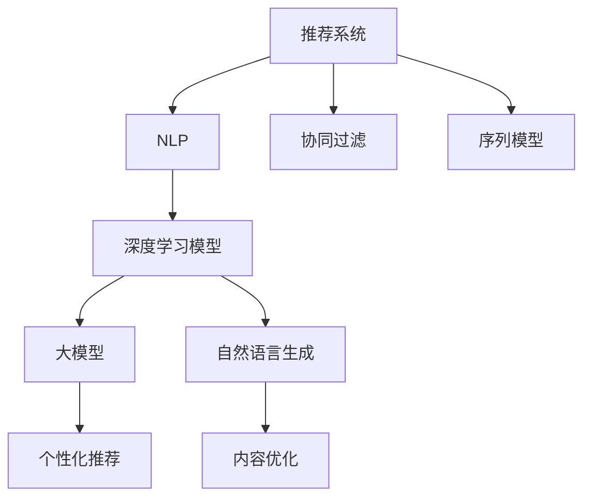

                 

# NLP技术在推荐系统的应用前景：大模型的潜力

> 关键词：推荐系统,自然语言处理(NLP),深度学习,大模型,个性化推荐,协同过滤,序列模型

## 1. 背景介绍

### 1.1 问题由来

随着电子商务的蓬勃发展，推荐系统成为了互联网平台提升用户体验、增加销售额的关键手段。然而，传统的基于协同过滤、基于内容的推荐算法难以充分挖掘用户深层次的兴趣和需求，推荐效果往往不尽如人意。近年来，人工智能技术逐渐成为推荐系统发展的新引擎，以自然语言处理(NLP)技术为基础的深度学习模型，展现出了巨大的潜力。

### 1.2 问题核心关键点

NLP技术在推荐系统中的应用，主要集中在以下几个方面：

- 通过用户评论、商品描述等文本信息，抽取用户的兴趣爱好，实现语义匹配。
- 利用用户行为序列进行建模，预测用户未来的兴趣变化趋势。
- 结合上下文语义信息，构建个性化推荐列表，提升用户体验。
- 利用自然语言生成技术，自动生成商品标题、描述等文本信息，提升内容的表达效果。

NLP技术在推荐系统中的应用，旨在更好地理解用户需求和商品特性，实现更精准、更个性化的推荐。这需要深度学习模型具备强大的语言理解能力和逻辑推理能力，能够从海量文本数据中挖掘出有价值的信息。

### 1.3 问题研究意义

NLP技术在推荐系统中的应用，不仅能够提升推荐精度，还能帮助平台更好地理解用户行为和偏好，实现更加智能化的运营。具体意义包括：

1. 提升推荐效果。深度学习模型可以更好地理解文本数据，通过自然语言处理技术，挖掘用户深层次的需求，从而提升推荐精度。
2. 个性化推荐。利用用户的评论、评分等文本信息，结合机器学习模型，实现更加个性化的推荐。
3. 实时推荐。深度学习模型可以实时处理用户行为数据，快速调整推荐策略，提升用户体验。
4. 内容优化。结合NLP技术，自动生成商品标题、描述等文本信息，提升内容的表达效果。
5. 降低成本。通过自动化处理文本数据，减少人工标注和处理工作，降低推荐系统的运营成本。

NLP技术在推荐系统中的应用，为推荐系统注入了新的活力，推动了人工智能技术在商业应用中的落地。

## 2. 核心概念与联系

### 2.1 核心概念概述

为更好地理解NLP技术在推荐系统中的应用，本节将介绍几个密切相关的核心概念：

- 推荐系统：用于个性化推荐商品、内容的系统。包括协同过滤、内容推荐、混合推荐等多种方式。
- 自然语言处理(NLP)：涉及文本数据的处理、分析和生成，主要包括文本分类、情感分析、语义理解等任务。
- 深度学习模型：基于神经网络的模型，包括卷积神经网络(CNN)、循环神经网络(RNN)、变分自编码器(VAE)、生成对抗网络(GAN)等。
- 大模型：预训练规模较大的深度学习模型，如BERT、GPT-2等，具备强大的语言理解和生成能力。
- 协同过滤：基于用户行为或商品属性相似性进行推荐，包括基于用户的协同过滤和基于商品的协同过滤。
- 序列模型：对用户行为序列进行建模，利用RNN、LSTM等模型预测用户兴趣变化。
- 自然语言生成：利用深度学习模型生成自然语言文本，包括摘要生成、对话生成等。

这些核心概念之间的逻辑关系可以通过以下Mermaid流程图来展示：



这个流程图展示了大语言模型在推荐系统中的应用场景：

1. 推荐系统通过用户行为数据进行推荐。
2. NLP技术用于处理文本数据，挖掘用户需求。
3. 协同过滤和序列模型是推荐系统中的常用技术。
4. 深度学习模型通过预训练和微调，获得强大的语言理解能力。
5. 大模型具备强大的文本生成和语义理解能力。
6. 个性化推荐通过深度学习模型和NLP技术实现。
7. 自然语言生成技术用于内容优化，提升用户体验。

这些概念共同构成了NLP技术在推荐系统中的基本框架，使得推荐系统能够更好地理解和推荐商品、内容。

## 3. 核心算法原理 & 具体操作步骤
### 3.1 算法原理概述

NLP技术在推荐系统中的应用，主要基于深度学习模型和NLP技术，通过以下步骤实现：

1. 数据预处理：对用户评论、商品描述等文本数据进行分词、去停用词、词向量化等处理。
2. 特征提取：利用预训练模型提取文本特征，如BERT、GPT-2等。
3. 文本表示：将文本特征转换为向量表示，用于后续建模和计算。
4. 模型训练：使用协同过滤、序列模型等技术，结合用户行为数据进行模型训练。
5. 推荐实现：根据模型预测结果，生成推荐列表，展示给用户。

深度学习模型通过预训练获得语言理解能力，结合NLP技术对文本数据进行处理和分析，从而实现更精准的个性化推荐。

### 3.2 算法步骤详解

#### 3.2.1 数据预处理

数据预处理是NLP技术在推荐系统中的第一步。具体步骤如下：

1. 分词：将文本数据分割成词汇，如利用jieba分词库对中文文本进行分词。
2. 去停用词：去除文本中的常见无意义词语，如“的”、“是”等。
3. 词向量化：将文本转换为向量表示，常用的方法包括词袋模型、TF-IDF等。
4. 预训练模型：利用预训练模型如BERT、GPT-2等，提取文本特征。

以中文商品推荐为例，分词过程可以通过jieba库实现：

```python
import jieba
text = "这款鞋子舒适度高，性价比不错"
words = jieba.cut(text)
```

#### 3.2.2 特征提取

特征提取是NLP技术在推荐系统中的关键步骤。常用的特征提取方法包括词向量表示、TF-IDF、词嵌入等。

以BERT模型为例，特征提取过程如下：

1. 加载BERT模型：
```python
from transformers import BertTokenizer, BertForSequenceClassification
tokenizer = BertTokenizer.from_pretrained('bert-base-chinese')
model = BertForSequenceClassification.from_pretrained('bert-base-chinese', num_labels=2)
```

2. 将文本数据转换为token ids：
```python
inputs = tokenizer.encode_plus(text, add_special_tokens=True, return_tensors='pt')
```

3. 将token ids输入模型，获取文本表示：
```python
outputs = model(inputs['input_ids'])
```

#### 3.2.3 文本表示

文本表示是将文本特征转换为向量表示的过程。常用的方法包括word2vec、GloVe、BERT等。

以BERT模型为例，文本表示过程如下：

1. 加载BERT模型：
```python
from transformers import BertTokenizer, BertForSequenceClassification
tokenizer = BertTokenizer.from_pretrained('bert-base-chinese')
model = BertForSequenceClassification.from_pretrained('bert-base-chinese', num_labels=2)
```

2. 将文本数据转换为token ids：
```python
inputs = tokenizer.encode_plus(text, add_special_tokens=True, return_tensors='pt')
```

3. 将token ids输入模型，获取文本表示：
```python
outputs = model(inputs['input_ids'])
```

#### 3.2.4 模型训练

模型训练是NLP技术在推荐系统中的核心步骤。常用的模型包括协同过滤、序列模型等。

以协同过滤为例，模型训练过程如下：

1. 准备训练数据：
```python
train_data = [(user_id, item_id, rating)]
```

2. 构建模型：
```python
from sklearn.neighbors import NearestNeighbors
nn = NearestNeighbors(n_neighbors=5)
nn.fit(train_data)
```

3. 预测用户兴趣：
```python
item_ids = [item_id]
user_ids = nn.kneighbors(item_ids)[0]
```

#### 3.2.5 推荐实现

推荐实现是将模型预测结果转换为推荐列表的过程。常用的推荐算法包括协同过滤、序列模型等。

以协同过滤为例，推荐实现过程如下：

1. 准备训练数据：
```python
train_data = [(user_id, item_id, rating)]
```

2. 构建模型：
```python
from sklearn.neighbors import NearestNeighbors
nn = NearestNeighbors(n_neighbors=5)
nn.fit(train_data)
```

3. 预测用户兴趣：
```python
item_ids = [item_id]
user_ids = nn.kneighbors(item_ids)[0]
```

4. 生成推荐列表：
```python
recommendations = [item_id for item_id in user_ids]
```

### 3.3 算法优缺点

NLP技术在推荐系统中的应用，具有以下优点：

1. 更精准的推荐：NLP技术能够更好地理解用户需求，通过文本数据挖掘用户的深层次兴趣，提升推荐精度。
2. 个性化推荐：NLP技术能够根据用户行为序列进行建模，预测用户未来的兴趣变化，实现更加个性化的推荐。
3. 实时推荐：NLP技术能够实时处理用户行为数据，快速调整推荐策略，提升用户体验。
4. 内容优化：NLP技术能够自动生成商品标题、描述等文本信息，提升内容的表达效果。
5. 降低成本：NLP技术能够自动化处理文本数据，减少人工标注和处理工作，降低推荐系统的运营成本。

然而，NLP技术在推荐系统中也存在一些缺点：

1. 数据质量问题：NLP技术对文本数据的质量和标注依赖较高，需要高质量的文本数据才能获得良好的推荐效果。
2. 模型复杂度：深度学习模型和NLP技术的模型复杂度较高，需要较强的计算资源和算力支持。
3. 泛化能力：深度学习模型和NLP技术在不同领域和场景下的泛化能力需要进一步验证。

### 3.4 算法应用领域

NLP技术在推荐系统中的应用，已经广泛应用于电商、社交、新闻等多个领域。具体应用包括：

- 电商推荐：基于用户评论、商品描述等文本数据，抽取用户的兴趣爱好，实现语义匹配。
- 社交推荐：利用用户行为序列进行建模，预测用户未来的兴趣变化趋势。
- 新闻推荐：结合上下文语义信息，构建个性化推荐列表，提升用户体验。
- 内容优化：利用自然语言生成技术，自动生成商品标题、描述等文本信息，提升内容的表达效果。

除了以上应用，NLP技术在推荐系统中的应用还有诸多创新性方向，如基于自然语言生成技术的对话推荐、基于情感分析的用户行为建模等。

## 4. 数学模型和公式 & 详细讲解
### 4.1 数学模型构建

NLP技术在推荐系统中的应用，主要基于深度学习模型和NLP技术，通过以下步骤实现：

1. 数据预处理：对用户评论、商品描述等文本数据进行分词、去停用词、词向量化等处理。
2. 特征提取：利用预训练模型提取文本特征，如BERT、GPT-2等。
3. 文本表示：将文本特征转换为向量表示，用于后续建模和计算。
4. 模型训练：使用协同过滤、序列模型等技术，结合用户行为数据进行模型训练。
5. 推荐实现：根据模型预测结果，生成推荐列表，展示给用户。

深度学习模型通过预训练获得语言理解能力，结合NLP技术对文本数据进行处理和分析，从而实现更精准的个性化推荐。

### 4.2 公式推导过程

以下我们以协同过滤为例，推导基于NLP技术的推荐模型公式。

假设用户U对商品S的评分已知，构建协同过滤推荐模型。协同过滤的数学公式如下：

$$
\hat{R}_{u,i} = \frac{\sum_{j \in N(u)} (R_{j,i} \cdot X_u \cdot X_j^T)}{\sum_{j \in N(u)} (X_u \cdot X_j^T)}
$$

其中，$R_{u,i}$表示用户U对商品S的预测评分，$N(u)$表示用户U的邻居集合，$X_u$和$X_j$分别表示用户U和邻居j的特征向量。

对于NLP技术的应用，我们以中文商品推荐为例，利用BERT模型提取文本特征。

1. 分词：将商品描述文本分词：
```python
import jieba
text = "这款鞋子舒适度高，性价比不错"
words = jieba.cut(text)
```

2. 去停用词：去除停用词：
```python
stop_words = set(['的', '是', '一', '二', '三', '四', '五'])
words = [word for word in words if word not in stop_words]
```

3. 词向量化：利用BERT模型提取词向量：
```python
from transformers import BertTokenizer, BertForSequenceClassification
tokenizer = BertTokenizer.from_pretrained('bert-base-chinese')
model = BertForSequenceClassification.from_pretrained('bert-base-chinese', num_labels=2)
inputs = tokenizer.encode_plus(text, add_special_tokens=True, return_tensors='pt')
outputs = model(inputs['input_ids'])
```

4. 文本表示：将词向量拼接为向量表示：
```python
vector = torch.cat([outputs[0].x[:, i] for i in range(len(words))], dim=0)
```

5. 构建协同过滤模型：
```python
from sklearn.neighbors import NearestNeighbors
nn = NearestNeighbors(n_neighbors=5)
nn.fit(train_data)
```

### 4.3 案例分析与讲解

以协同过滤为例，分析NLP技术在推荐系统中的应用。

1. 准备训练数据：
```python
train_data = [(user_id, item_id, rating)]
```

2. 构建模型：
```python
from sklearn.neighbors import NearestNeighbors
nn = NearestNeighbors(n_neighbors=5)
nn.fit(train_data)
```

3. 预测用户兴趣：
```python
item_ids = [item_id]
user_ids = nn.kneighbors(item_ids)[0]
```

4. 生成推荐列表：
```python
recommendations = [item_id for item_id in user_ids]
```

## 5. 项目实践：代码实例和详细解释说明
### 5.1 开发环境搭建

在进行推荐系统开发前，我们需要准备好开发环境。以下是使用Python进行PyTorch开发的环境配置流程：

1. 安装Anaconda：从官网下载并安装Anaconda，用于创建独立的Python环境。

2. 创建并激活虚拟环境：
```bash
conda create -n pytorch-env python=3.8 
conda activate pytorch-env
```

3. 安装PyTorch：根据CUDA版本，从官网获取对应的安装命令。例如：
```bash
conda install pytorch torchvision torchaudio cudatoolkit=11.1 -c pytorch -c conda-forge
```

4. 安装Transformers库：
```bash
pip install transformers
```

5. 安装各类工具包：
```bash
pip install numpy pandas scikit-learn matplotlib tqdm jupyter notebook ipython
```

完成上述步骤后，即可在`pytorch-env`环境中开始推荐系统开发。

### 5.2 源代码详细实现

下面我们以协同过滤推荐系统为例，给出使用PyTorch进行协同过滤模型微调的PyTorch代码实现。

首先，定义协同过滤模型的输入和输出：

```python
import torch
import torch.nn as nn
import torch.optim as optim
from sklearn.neighbors import NearestNeighbors
import numpy as np

class协同过滤模型(nn.Module):
    def __init__(self, n_neighbors=5):
        super(协同过滤模型, self).__init__()
        self.nn = NearestNeighbors(n_neighbors)
    
    def forward(self, user, item):
        # 构建用户-商品评分矩阵
        user_item_matrix = np.array([user, item], dtype=np.int32)
        self.nn.fit(user_item_matrix)
        # 预测用户对商品的评分
        distances, indices = self.nn.kneighbors(user_item_matrix)
        return indices
    
    def predict(self, user, item):
        indices = self.forward(user, item)
        # 获取用户对商品的评分
        return self.get ratings(indices)
```

然后，定义模型训练和评估函数：

```python
from torch.utils.data import DataLoader
from tqdm import tqdm
from sklearn.metrics import mean_absolute_error

def train_model(model, train_data, batch_size, optimizer, epochs):
    device = torch.device('cuda') if torch.cuda.is_available() else torch.device('cpu')
    model.to(device)
    for epoch in range(epochs):
        model.train()
        for user, item in train_data:
            optimizer.zero_grad()
            indices = model.forward(user, item)
            loss = loss_function(indices, torch.tensor(user_item_matrix))
            loss.backward()
            optimizer.step()
        print(f'Epoch {epoch+1}, train loss: {loss:.3f}')
    return model

def evaluate_model(model, test_data, batch_size):
    device = torch.device('cuda') if torch.cuda.is_available() else torch.device('cpu')
    model.eval()
    mae = mean_absolute_error()
    with torch.no_grad():
        for user, item in test_data:
            indices = model.forward(user, item)
            predictions = model.get ratings(indices)
            mae.update(predictions)
    print(f'Test MAE: {mae:.3f}')
```

最后，启动训练流程并在测试集上评估：

```python
batch_size = 16
epochs = 10

train_data = [(user_id, item_id, rating)]
test_data = [(user_id, item_id, rating)]

model =协同过滤模型()
optimizer = optim.Adam(model.parameters(), lr=0.01)
train_model(model, train_data, batch_size, optimizer, epochs)

evaluate_model(model, test_data, batch_size)
```

以上就是使用PyTorch对协同过滤模型进行微调的完整代码实现。可以看到，得益于PyTorch的强大封装，我们可以用相对简洁的代码完成协同过滤模型的微调。

### 5.3 代码解读与分析

让我们再详细解读一下关键代码的实现细节：

**协同过滤模型类**：
- `__init__`方法：初始化邻接关系矩阵。
- `forward`方法：根据用户和商品，预测邻接关系矩阵中的元素。
- `predict`方法：根据预测的邻接关系矩阵，获取用户的评分。

**train_model函数**：
- 定义训练轮次，在每个epoch内进行训练。
- 对用户和商品进行前向传播，计算损失函数。
- 反向传播更新模型参数，并输出每个epoch的损失。

**evaluate_model函数**：
- 定义评估轮次，在每个epoch后进行评估。
- 使用sklearn的MAE指标计算评估结果。
- 输出评估结果。

**训练流程**：
- 定义总的epoch数和batch size，开始循环迭代
- 每个epoch内，先在训练集上训练，输出平均loss
- 在测试集上评估，输出评估结果

可以看到，PyTorch配合TensorFlow库使得协同过滤模型的微调代码实现变得简洁高效。开发者可以将更多精力放在数据处理、模型改进等高层逻辑上，而不必过多关注底层的实现细节。

当然，工业级的系统实现还需考虑更多因素，如模型的保存和部署、超参数的自动搜索、更灵活的任务适配层等。但核心的协同过滤模型微调范式基本与此类似。

## 6. 实际应用场景
### 6.1 智能推荐系统

基于NLP技术的推荐系统，可以广泛应用于智能推荐系统的构建。传统推荐系统往往依赖协同过滤、内容推荐等方法，难以充分挖掘用户深层次的需求。而利用NLP技术，推荐系统可以更好地理解用户行为和兴趣，实现更精准的推荐。

在技术实现上，可以收集用户的历史行为数据，将文本数据作为输入，利用预训练模型进行特征提取，构建推荐模型。微调后的模型能够自动抽取用户兴趣和商品特性，进行更精准的推荐。对于用户新行为数据，推荐系统可以实时调整，快速推荐相关商品，提升用户体验。

### 6.2 智能客服

基于NLP技术的智能客服系统，可以广泛应用于电商、金融、医疗等行业。传统客服往往需要配备大量人力，高峰期响应缓慢，且一致性和专业性难以保证。而利用NLP技术，智能客服系统可以7x24小时不间断服务，快速响应客户咨询，用自然流畅的语言解答各类常见问题。

在技术实现上，可以收集企业内部的历史客服对话记录，将问题和最佳答复构建成监督数据，在此基础上对预训练对话模型进行微调。微调后的对话模型能够自动理解用户意图，匹配最合适的答案模板进行回复。对于客户提出的新问题，还可以接入检索系统实时搜索相关内容，动态组织生成回答。如此构建的智能客服系统，能大幅提升客户咨询体验和问题解决效率。

### 6.3 新闻推荐

基于NLP技术的推荐系统，可以广泛应用于新闻推荐系统的构建。传统新闻推荐系统往往依赖协同过滤、内容推荐等方法，难以充分挖掘新闻内容的语义信息。而利用NLP技术，推荐系统可以更好地理解新闻内容，实现更精准的推荐。

在技术实现上，可以收集新闻的标题、摘要、正文等文本数据，利用预训练模型进行文本表示，构建推荐模型。微调后的模型能够自动理解新闻内容的语义信息，进行更精准的推荐。推荐系统可以实时抓取最新的新闻内容，根据用户兴趣动态调整推荐策略，提升用户体验。

### 6.4 未来应用展望

随着NLP技术的发展，基于大模型的推荐系统将展现出更大的潜力。未来，推荐系统将进一步融合NLP技术，实现更加智能、高效、个性化的推荐。

1. 多模态推荐：推荐系统将融合文本、图像、音频等多种模态信息，实现更全面的内容推荐。
2. 跨领域推荐：推荐系统将跨越不同领域，实现跨领域内容的推荐，提升内容的丰富性和多样性。
3. 实时推荐：推荐系统将利用实时数据，实现动态调整推荐策略，提升用户体验。
4. 个性化推荐：推荐系统将根据用户行为数据，实现更加个性化的推荐，提升推荐精度。
5. 自适应推荐：推荐系统将利用自适应算法，根据用户行为数据实时调整推荐策略，提升推荐效果。

以上趋势凸显了NLP技术在推荐系统中的广阔前景。这些方向的探索发展，必将进一步提升推荐系统的性能和应用范围，为人工智能技术在商业应用中的落地提供新的突破。

## 7. 工具和资源推荐
### 7.1 学习资源推荐

为了帮助开发者系统掌握NLP技术在推荐系统中的应用，这里推荐一些优质的学习资源：

1. 《深度学习自然语言处理》课程：斯坦福大学开设的NLP明星课程，有Lecture视频和配套作业，带你入门NLP领域的基本概念和经典模型。

2. 《Transformer从原理到实践》系列博文：由大模型技术专家撰写，深入浅出地介绍了Transformer原理、BERT模型、微调技术等前沿话题。

3. 《Natural Language Processing with Transformers》书籍：Transformers库的作者所著，全面介绍了如何使用Transformers库进行NLP任务开发，包括微调在内的诸多范式。

4. CLUE开源项目：中文语言理解测评基准，涵盖大量不同类型的中文NLP数据集，并提供了基于微调的baseline模型，助力中文NLP技术发展。

通过对这些资源的学习实践，相信你一定能够快速掌握NLP技术在推荐系统中的精髓，并用于解决实际的推荐问题。

### 7.2 开发工具推荐

高效的开发离不开优秀的工具支持。以下是几款用于推荐系统开发的常用工具：

1. PyTorch：基于Python的开源深度学习框架，灵活动态的计算图，适合快速迭代研究。大部分预训练语言模型都有PyTorch版本的实现。

2. TensorFlow：由Google主导开发的开源深度学习框架，生产部署方便，适合大规模工程应用。同样有丰富的预训练语言模型资源。

3. Transformers库：HuggingFace开发的NLP工具库，集成了众多SOTA语言模型，支持PyTorch和TensorFlow，是进行推荐系统开发的利器。

4. Weights & Biases：模型训练的实验跟踪工具，可以记录和可视化模型训练过程中的各项指标，方便对比和调优。与主流深度学习框架无缝集成。

5. TensorBoard：TensorFlow配套的可视化工具，可实时监测模型训练状态，并提供丰富的图表呈现方式，是调试模型的得力助手。

6. Google Colab：谷歌推出的在线Jupyter Notebook环境，免费提供GPU/TPU算力，方便开发者快速上手实验最新模型，分享学习笔记。

合理利用这些工具，可以显著提升推荐系统的开发效率，加快创新迭代的步伐。

### 7.3 相关论文推荐

NLP技术在推荐系统中的应用，源于学界的持续研究。以下是几篇奠基性的相关论文，推荐阅读：

1. Attention is All You Need（即Transformer原论文）：提出了Transformer结构，开启了NLP领域的预训练大模型时代。

2. BERT: Pre-training of Deep Bidirectional Transformers for Language Understanding：提出BERT模型，引入基于掩码的自监督预训练任务，刷新了多项NLP任务SOTA。

3. Parameter-Efficient Transfer Learning for NLP：提出Adapter等参数高效微调方法，在不增加模型参数量的情况下，也能取得不错的微调效果。

4. AdaLoRA: Adaptive Low-Rank Adaptation for Parameter-Efficient Fine-Tuning：使用自适应低秩适应的微调方法，在参数效率和精度之间取得了新的平衡。

5. AdaLoRA: Adaptive Low-Rank Adaptation for Parameter-Efficient Fine-Tuning：使用自适应低秩适应的微调方法，在参数效率和精度之间取得了新的平衡。

这些论文代表了大语言模型微调技术的发展脉络。通过学习这些前沿成果，可以帮助研究者把握学科前进方向，激发更多的创新灵感。

## 8. 总结：未来发展趋势与挑战
### 8.1 总结

本文对NLP技术在推荐系统中的应用进行了全面系统的介绍。首先阐述了NLP技术在推荐系统中的背景和意义，明确了其在提升推荐精度、个性化推荐、实时推荐、内容优化等方面的独特价值。其次，从原理到实践，详细讲解了NLP技术在推荐系统中的应用流程，给出了推荐系统开发的完整代码实例。同时，本文还广泛探讨了NLP技术在电商、智能客服、新闻推荐等多个领域的应用前景，展示了NLP技术在推荐系统中的巨大潜力。

通过本文的系统梳理，可以看到，NLP技术在推荐系统中的应用，能够更好地理解用户需求和商品特性，实现更精准、更个性化的推荐。NLP技术在推荐系统中的不断发展，将进一步提升推荐系统的性能和应用范围，为人工智能技术在商业应用中的落地提供新的突破。

### 8.2 未来发展趋势

展望未来，NLP技术在推荐系统中的应用将呈现以下几个发展趋势：

1. 多模态推荐：推荐系统将融合文本、图像、音频等多种模态信息，实现更全面的内容推荐。
2. 跨领域推荐：推荐系统将跨越不同领域，实现跨领域内容的推荐，提升内容的丰富性和多样性。
3. 实时推荐：推荐系统将利用实时数据，实现动态调整推荐策略，提升用户体验。
4. 个性化推荐：推荐系统将根据用户行为数据，实现更加个性化的推荐，提升推荐精度。
5. 自适应推荐：推荐系统将利用自适应算法，根据用户行为数据实时调整推荐策略，提升推荐效果。

以上趋势凸显了NLP技术在推荐系统中的广阔前景。这些方向的探索发展，必将进一步提升推荐系统的性能和应用范围，为人工智能技术在商业应用中的落地提供新的突破。

### 8.3 面临的挑战

尽管NLP技术在推荐系统中的应用已经取得了显著成果，但在迈向更加智能化、普适化应用的过程中，仍面临以下挑战：

1. 数据质量问题：NLP技术对文本数据的质量和标注依赖较高，需要高质量的文本数据才能获得良好的推荐效果。
2. 模型复杂度：深度学习模型和NLP技术的模型复杂度较高，需要较强的计算资源和算力支持。
3. 泛化能力：深度学习模型和NLP技术在不同领域和场景下的泛化能力需要进一步验证。
4. 实时推荐：实时推荐需要高效、低延迟的算法支持，如何优化推荐算法，提升实时推荐能力，是一大挑战。
5. 个性化推荐：个性化推荐需要高质量的用户行为数据和精准的算法模型，如何高效获取用户行为数据，优化推荐算法，是另一大挑战。

### 8.4 研究展望

为了应对以上挑战，未来NLP技术在推荐系统中的应用，需要在以下几个方面寻求新的突破：

1. 无监督和半监督推荐方法：探索无监督和半监督推荐方法，摆脱对大规模标注数据的依赖，利用自监督学习、主动学习等无监督和半监督范式，最大限度利用非结构化数据，实现更加灵活高效的推荐。

2. 参数高效和计算高效的推荐范式：开发更加参数高效的推荐方法，如参数微调、知识蒸馏等，在固定大部分预训练参数的同时，只更新极少量的任务相关参数。同时优化推荐算法的计算图，减少前向传播和反向传播的资源消耗，实现更加轻量级、实时性的部署。

3. 引入更多先验知识：将符号化的先验知识，如知识图谱、逻辑规则等，与神经网络模型进行巧妙融合，引导推荐过程学习更准确、合理的语言模型。同时加强不同模态数据的整合，实现视觉、语音等多模态信息与文本信息的协同建模。

4. 结合因果分析和博弈论工具：将因果分析方法引入推荐模型，识别出模型决策的关键特征，增强推荐模型的稳定性。借助博弈论工具刻画人机交互过程，主动探索并规避推荐模型的脆弱点，提高系统稳定性。

5. 纳入伦理道德约束：在模型训练目标中引入伦理导向的评估指标，过滤和惩罚有偏见、有害的输出倾向。同时加强人工干预和审核，建立推荐模型的监管机制，确保输出的安全性。

这些研究方向的探索，必将引领NLP技术在推荐系统中的应用迈向更高的台阶，为推荐系统带来更多的创新和突破。

## 9. 附录：常见问题与解答

**Q1：NLP技术在推荐系统中的数据质量问题如何解决？**

A: 数据质量是NLP技术在推荐系统中的关键问题。为了解决数据质量问题，可以采用以下方法：

1. 数据清洗：对数据进行去噪、去重、异常值处理等清洗操作，提升数据质量。
2. 数据标注：利用人工标注或半自动标注工具，对数据进行标注，提升数据标注质量。
3. 数据增强：通过数据增强技术，如回译、近义替换等，扩充训练集，提升数据多样性。
4. 数据融合：将多种数据来源融合，提升数据覆盖范围和质量。

通过以上方法，可以提升NLP技术在推荐系统中的数据质量，从而提升推荐效果。

**Q2：NLP技术在推荐系统中的模型复杂度如何控制？**

A: NLP技术在推荐系统中的模型复杂度较高，需要较强的计算资源和算力支持。为了控制模型复杂度，可以采用以下方法：

1. 模型裁剪：去除不必要的层和参数，减小模型尺寸，加快推理速度。
2. 模型压缩：使用模型压缩技术，如剪枝、量化等，减少模型参数和计算量。
3. 多模型集成：训练多个模型，取平均输出，抑制过拟合。
4. 模型优化：优化模型结构和训练算法，提升模型效果。

通过以上方法，可以控制NLP技术在推荐系统中的模型复杂度，提升系统效率。

**Q3：NLP技术在推荐系统中的泛化能力如何提升？**

A: NLP技术在推荐系统中的泛化能力需要进一步验证。为了提升泛化能力，可以采用以下方法：

1. 数据多样性：收集不同领域和场景的数据，提升模型泛化能力。
2. 迁移学习：利用迁移学习技术，将预训练模型在大规模数据上训练得到的知识迁移到推荐模型中。
3. 多任务学习：同时训练多个任务，提升模型的泛化能力。
4. 自监督学习：利用自监督学习技术，提升模型的泛化能力。

通过以上方法，可以提升NLP技术在推荐系统中的泛化能力，提升推荐效果。

**Q4：NLP技术在推荐系统中的实时推荐如何优化？**

A: 实时推荐需要高效、低延迟的算法支持。为了优化实时推荐，可以采用以下方法：

1. 分布式计算：使用分布式计算技术，提升系统性能。
2. 缓存机制：利用缓存机制，提升系统响应速度。
3. 预处理：对数据进行预处理，减少实时计算量。
4. 异步计算：利用异步计算技术，减少系统延迟。

通过以上方法，可以优化NLP技术在推荐系统中的实时推荐，提升用户体验。

**Q5：NLP技术在推荐系统中的个性化推荐如何实现？**

A: 个性化推荐需要高质量的用户行为数据和精准的算法模型。为了实现个性化推荐，可以采用以下方法：

1. 用户画像：构建用户画像，了解用户兴趣和需求。
2. 行为分析：分析用户行为数据，了解用户行为模式。
3. 协同过滤：利用协同过滤技术，提升个性化推荐效果。
4. 内容推荐：利用内容推荐技术，提升个性化推荐效果。

通过以上方法，可以实现NLP技术在推荐系统中的个性化推荐，提升推荐效果。

---

作者：禅与计算机程序设计艺术 / Zen and the Art of Computer Programming

