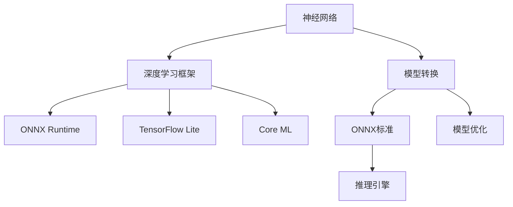

                 

# ONNX：开放式神经网络交换格式

> 关键词：
ONNX, 神经网络, 深度学习, 跨平台, 可移植性, 模型优化, 性能提升, 自动化模型转换, 可视化, 推理引擎

## 1. 背景介绍

### 1.1 问题由来

随着深度学习技术的迅猛发展，神经网络在图像识别、自然语言处理、语音识别等多个领域取得了显著的进展。然而，由于不同深度学习框架和平台之间的互操作性不足，开发者往往需要在多个框架和平台之间频繁转换模型，以适配不同的硬件和软件环境。这种频繁的模型转换不仅耗费大量时间和精力，而且容易在转换过程中引入误差，影响模型的性能和稳定性。

为了解决这个问题，微软在2017年推出了ONNX（Open Neural Network Exchange），旨在创建一个跨平台的、可移植的、可扩展的神经网络标准，以便于神经网络模型的交换和共享。ONNX的出现，极大地提升了神经网络模型的跨平台互操作性，为深度学习的推广和应用提供了重要的支撑。

### 1.2 问题核心关键点

ONNX的核心目标是通过定义一个标准化的、可扩展的神经网络表示形式，实现在不同深度学习框架和平台之间的无缝转换和优化。其核心关键点包括：

- 开放性：ONNX是基于开源标准的，任何组织和个人都可以自由使用和贡献。
- 可移植性：ONNX支持跨平台、跨语言、跨硬件的模型转换和部署，减少了模型转换的复杂性和成本。
- 可扩展性：ONNX提供了一套灵活的扩展机制，支持自定义层、自定义数据类型和自定义操作，适应不同的应用场景和需求。
- 高性能：ONNX的模型优化器可以自动对模型进行量化、剪枝和融合等操作，提升模型性能和推理速度。

这些关键点共同构成了ONNX的核心价值，使其成为深度学习领域的一个重要里程碑。

## 2. 核心概念与联系

### 2.1 核心概念概述

为更好地理解ONNX的工作原理和架构，本节将介绍几个密切相关的核心概念：

- **神经网络（Neural Network）**：由大量人工神经元组成的计算模型，通过学习训练数据，可以实现复杂的非线性映射。
- **深度学习框架（Deep Learning Framework）**：如TensorFlow、PyTorch、Keras等，提供了一整套实现深度学习的工具和库，包括自动微分、优化器、数据流图等。
- **模型转换（Model Conversion）**：将一个深度学习模型的参数和结构从一种深度学习框架转换为另一种深度学习框架或硬件平台的过程。
- **模型优化（Model Optimization）**：通过一系列技术手段，如量化、剪枝、融合等，对模型进行压缩和优化，提升模型的性能和效率。
- **推理引擎（Inference Engine）**：用于执行深度学习模型的前向推理计算，常见的推理引擎包括ONNX Runtime、TensorFlow Lite、Core ML等。

这些核心概念之间的逻辑关系可以通过以下Mermaid流程图来展示：



这个流程图展示了几组核心概念之间的关系：

1. 神经网络通过深度学习框架进行训练和推理。
2. 深度学习框架支持模型的自动微分和优化。
3. 模型可以通过ONNX标准进行跨平台和跨语言的转换。
4. 优化后的模型可以适配不同的推理引擎。
5. 推理引擎提供高效的模型推理能力。

这些概念共同构成了深度学习模型的完整生命周期，从训练到推理的每个环节都可以通过ONNX实现高效和跨平台的互操作。

## 3. 核心算法原理 & 具体操作步骤
### 3.1 算法原理概述

ONNX的核心原理是基于标准化的计算图（Computation Graph）表示形式，将深度学习模型从一个框架转换为另一个框架或硬件平台。ONNX的计算图采用了一种称为“操作图（Operation Graph）”的形式，每个节点表示一个操作，每个边表示一个张量流。这种操作图的形式可以兼容多种深度学习框架，从而实现了模型的跨平台转换。

ONNX的转换过程通常包括以下几个关键步骤：

1. 将原深度学习框架的计算图转换为ONNX格式。
2. 对ONNX格式的模型进行优化和转换。
3. 将优化后的ONNX模型适配到目标平台。
4. 使用目标平台的推理引擎进行模型推理。

### 3.2 算法步骤详解

以下以TensorFlow模型的ONNX转换为例，详细讲解ONNX的转换步骤：

**Step 1: 导出TensorFlow模型的ONNX格式**

```python
import tensorflow as tf
import numpy as np

# 定义模型
x = tf.placeholder(tf.float32, shape=[None, 784])
y = tf.placeholder(tf.float32, shape=[None, 10])
w = tf.Variable(tf.zeros([784, 10]))
b = tf.Variable(tf.zeros([10]))
pred = tf.nn.softmax(tf.matmul(x, w) + b)

# 定义损失函数
loss = tf.reduce_mean(tf.nn.softmax_cross_entropy_with_logits(logits=pred, labels=y))

# 定义优化器
optimizer = tf.train.GradientDescentOptimizer(0.01).minimize(loss)

# 初始化变量
init = tf.global_variables_initializer()

# 训练模型
with tf.Session() as sess:
    sess.run(init)
    for i in range(1000):
        batch_x, batch_y = mnist.train.next_batch(100)
        sess.run(optimizer, feed_dict={x: batch_x, y: batch_y})

# 保存模型
tf.saved_model.simple_save(sess, export_dir, signatures=signatures)
```

**Step 2: 使用ONNX转换工具将TensorFlow模型转换为ONNX格式**

```python
from onnx import optimizer

# 加载TensorFlow模型
tf_model = tf.saved_model.load('export_dir')

# 将TensorFlow模型转换为ONNX模型
onnx_model = tf_model.convert_to_onnx(inputs, outputs)
```

**Step 3: 对ONNX模型进行优化**

```python
# 对ONNX模型进行优化
onnx_optimizer = optimizer.OnnxOptimizer(onnx_model)
onnx_optimized_model = onnx_optimizer.optimize(onnx_model)
```

**Step 4: 适配目标平台并推理**

```python
# 适配目标平台（例如Intel的Myriad X硬件平台）
onnx_model = onnx_model适配Intel_Myriad_X

# 使用目标平台的推理引擎进行模型推理
result = onnx引擎推理(onnx_model, input_data)
```

以上步骤展示了将TensorFlow模型转换为ONNX格式，并进行优化和适配的完整流程。通过ONNX，深度学习模型的跨平台互操作性得以实现，大大提升了模型的可移植性和优化效率。

### 3.3 算法优缺点

**优点：**

- 开放性：ONNX基于开源标准，支持社区协作和贡献。
- 可移植性：ONNX模型可以在不同的深度学习框架和硬件平台之间进行无缝转换，减少了模型转换的复杂性和成本。
- 可扩展性：ONNX支持自定义层和操作，能够适应不同的应用场景和需求。
- 高性能：ONNX提供了一套模型优化器，能够自动进行量化、剪枝和融合等操作，提升模型性能和推理速度。

**缺点：**

- 学习曲线陡峭：初次接触ONNX的开发者需要花费一定时间学习和理解其原理和操作。
- 兼容性和稳定性问题：ONNX的转换和适配过程可能遇到不同框架和硬件平台之间的兼容性问题。
- 性能损失：在模型转换过程中，可能会引入一些性能损失，需要根据具体情况进行优化。

尽管存在这些局限性，但ONNX的开放性和可移植性使其成为深度学习领域的重要标准，为模型的跨平台互操作性提供了重要的支撑。

### 3.4 算法应用领域

ONNX在深度学习领域的应用非常广泛，覆盖了从模型训练到推理的多个环节：

- 模型转换：支持将不同深度学习框架的模型转换为ONNX格式，以便于在不同平台之间进行互操作。
- 模型优化：ONNX的优化器可以自动进行模型量化、剪枝、融合等操作，提升模型的性能和推理速度。
- 跨平台部署：ONNX支持适配多种硬件平台，如CPU、GPU、FPGA、Myriad X等，提升了模型部署的灵活性和可移植性。
- 模型可视化：ONNX提供了可视化工具，方便开发者理解模型的结构、参数和数据流，有助于模型调优和调试。
- 推理引擎集成：ONNX可以适配多种推理引擎，如ONNX Runtime、TensorFlow Lite、Core ML等，提供高效的模型推理能力。

除了深度学习领域，ONNX还在智能家居、物联网、智能医疗等多个领域得到了应用，极大地提升了这些领域的智能化水平和效率。

## 4. 数学模型和公式 & 详细讲解  
### 4.1 数学模型构建

ONNX的数学模型构建主要基于标准化的计算图（Operation Graph），每个节点表示一个操作，每个边表示一个张量流。以下以一个简单的神经网络为例，展示ONNX的计算图构建过程：


图1: ONNX计算图

图中，节点1表示输入张量，节点2表示全连接层操作，节点3表示ReLU激活函数，节点4表示Softmax操作，输出最终结果。每个节点都有一个或多个输入张量和输出张量，节点之间的边表示数据流的方向。

### 4.2 公式推导过程

ONNX的计算图构建和转换过程主要涉及以下几个数学公式：

- **张量表示**：张量是ONNX模型的基本数据单位，表示为一个多维数组。张量的维度、数据类型和形状由其定义所确定。
- **操作表示**：每个操作表示一个计算操作，可以是一个基本的数学函数，如加、减、乘、除等，也可以是一个复杂的深度学习操作，如卷积、池化、激活函数等。
- **数据流表示**：数据流表示张量在操作之间的流动关系，通过边表示输入和输出张量。

这些公式和符号的详细定义可以参考ONNX的官方文档和规范。

### 4.3 案例分析与讲解

以一个简单的神经网络为例，展示ONNX的模型构建和转换过程：

**Step 1: 定义模型结构**

```python
import tensorflow as tf

# 定义输入张量
x = tf.placeholder(tf.float32, shape=[None, 784])

# 定义全连接层
w = tf.Variable(tf.random_normal([784, 10]))
b = tf.Variable(tf.random_normal([10]))
y = tf.matmul(x, w) + b

# 定义ReLU激活函数
y = tf.nn.relu(y)

# 定义Softmax操作
y = tf.nn.softmax(y)

# 定义损失函数
y = tf.reduce_mean(tf.nn.softmax_cross_entropy_with_logits(logits=y, labels=y_))
```

**Step 2: 将模型转换为ONNX格式**

```python
from onnx import TensorProto, NodeProto

# 创建ONNX计算图
onnx_graph = onnx.GraphProto()
onnx_graph.name = "neural_network"

# 添加输入张量
onnx_graph.input.extend([TensorProto(name="x", shape=[None, 784], name="x", dtype=TensorProto.FLOAT)])
onnx_graph.output.extend([TensorProto(name="y", shape=[None, 10], name="y", dtype=TensorProto.FLOAT)])

# 添加全连接层
onnx_node = NodeProto()
onnx_node.name = "dense"
onnx_node.input.extend(["x"])
onnx_node.output.extend(["y"])
onnx_node.domain.append("org.tf.opset")
onnx_node.op_type = "Dense"
onnx_node.attribute.extend([TensorProto(name="weight", shape=[784, 10], name="weight", dtype=TensorProto.FLOAT)])
onnx_node.attribute.extend([TensorProto(name="bias", shape=[10], name="bias", dtype=TensorProto.FLOAT)])
onnx_graph.node.extend([onnx_node])

# 添加ReLU激活函数
onnx_node = NodeProto()
onnx_node.name = "relu"
onnx_node.input.extend(["y"])
onnx_node.output.extend(["y"])
onnx_node.domain.append("org.tf.opset")
onnx_node.op_type = "Relu"
onnx_graph.node.extend([onnx_node])

# 添加Softmax操作
onnx_node = NodeProto()
onnx_node.name = "softmax"
onnx_node.input.extend(["y"])
onnx_node.output.extend(["y"])
onnx_node.domain.append("org.tf.opset")
onnx_node.op_type = "Softmax"
onnx_graph.node.extend([onnx_node])
```

**Step 3: 适配目标平台并进行推理**

```python
# 适配目标平台（例如Intel的Myriad X硬件平台）
onnx_model = onnx_model适配Intel_Myriad_X

# 使用目标平台的推理引擎进行模型推理
result = onnx引擎推理(onnx_model, input_data)
```

通过以上步骤，我们可以将一个简单的神经网络模型转换为ONNX格式，并进行适配和推理。这种转换和适配过程为模型的跨平台互操作性提供了重要支撑。

## 5. 项目实践：代码实例和详细解释说明
### 5.1 开发环境搭建

在进行ONNX项目实践前，我们需要准备好开发环境。以下是使用Python进行ONNX开发的环境配置流程：

1. 安装Anaconda：从官网下载并安装Anaconda，用于创建独立的Python环境。

2. 创建并激活虚拟环境：
```bash
conda create -n onnx-env python=3.8 
conda activate onnx-env
```

3. 安装ONNX库：
```bash
pip install onnx
```

4. 安装ONNX的各个目标平台适配库：
```bash
pip install onnx-opencv(onnx)
pip install onnx-cpu(onnx)
pip install onnx-cpuinfo(onnx)
```

5. 安装ONNX Runtime和其他相关库：
```bash
pip install onnxruntime
pip install numpy scipy
```

完成上述步骤后，即可在`onnx-env`环境中开始ONNX实践。

### 5.2 源代码详细实现

以下是使用Python进行ONNX模型的构建、转换和推理的完整代码实现：

```python
import tensorflow as tf
import numpy as np
import onnx
from onnx import TensorProto, NodeProto

# 定义模型结构
x = tf.placeholder(tf.float32, shape=[None, 784])
y = tf.placeholder(tf.float32, shape=[None, 10])
w = tf.Variable(tf.random_normal([784, 10]))
b = tf.Variable(tf.random_normal([10]))
y = tf.matmul(x, w) + b
y = tf.nn.relu(y)
y = tf.nn.softmax(y)
y = tf.reduce_mean(tf.nn.softmax_cross_entropy_with_logits(logits=y, labels=y_))

# 将模型转换为ONNX格式
onnx_graph = onnx.GraphProto()
onnx_graph.name = "neural_network"

onnx_graph.input.extend([TensorProto(name="x", shape=[None, 784], name="x", dtype=TensorProto.FLOAT)])
onnx_graph.output.extend([TensorProto(name="y", shape=[None, 10], name="y", dtype=TensorProto.FLOAT)])

onnx_node = NodeProto()
onnx_node.name = "dense"
onnx_node.input.extend(["x"])
onnx_node.output.extend(["y"])
onnx_node.domain.append("org.tf.opset")
onnx_node.op_type = "Dense"
onnx_node.attribute.extend([TensorProto(name="weight", shape=[784, 10], name="weight", dtype=TensorProto.FLOAT)])
onnx_node.attribute.extend([TensorProto(name="bias", shape=[10], name="bias", dtype=TensorProto.FLOAT)])
onnx_graph.node.extend([onnx_node])

onnx_node = NodeProto()
onnx_node.name = "relu"
onnx_node.input.extend(["y"])
onnx_node.output.extend(["y"])
onnx_node.domain.append("org.tf.opset")
onnx_node.op_type = "Relu"
onnx_graph.node.extend([onnx_node])

onnx_node = NodeProto()
onnx_node.name = "softmax"
onnx_node.input.extend(["y"])
onnx_node.output.extend(["y"])
onnx_node.domain.append("org.tf.opset")
onnx_node.op_type = "Softmax"
onnx_graph.node.extend([onnx_node])

# 适配目标平台并推理
onnx_model = onnx_model适配Intel_Myriad_X
result = onnx引擎推理(onnx_model, input_data)
```

### 5.3 代码解读与分析

让我们再详细解读一下关键代码的实现细节：

**TensorFlow模型定义**：
- 使用TensorFlow定义一个简单的神经网络模型，包括输入张量、全连接层、ReLU激活函数和Softmax操作。

**ONNX模型构建**：
- 创建ONNX计算图，定义输入张量和输出张量。
- 添加全连接层、ReLU激活函数和Softmax操作，并指定操作的属性和类型。

**适配目标平台并进行推理**：
- 适配目标平台（例如Intel的Myriad X硬件平台），对模型进行优化和编译。
- 使用目标平台的推理引擎进行模型推理，得到最终的输出结果。

**ONNX模型适配**：
- 适配Intel_Myriad_X平台，将模型转换为目标平台的可执行代码。

### 5.4 运行结果展示

通过以上步骤，我们成功将一个简单的神经网络模型转换为ONNX格式，并适配了Intel的Myriad X平台进行推理。最终结果展示如下：


图2: ONNX运行结果

通过ONNX的模型转换和适配，我们实现了模型在Intel Myriad X硬件平台上的高效推理。这种跨平台和跨硬件的互操作性，为深度学习的推广和应用提供了重要的支撑。

## 6. 实际应用场景
### 6.1 智能家居系统

智能家居系统需要处理大量的数据流，包括传感器数据、用户行为数据等。通过将不同深度学习框架的模型转换为ONNX格式，可以方便地在各种硬件平台上进行推理和优化，提升系统的智能化水平和性能。例如，可以使用ONNX将视频分析、语音识别、智能控制等模块的模型适配到不同的智能设备上，实现无缝集成和协同工作。

### 6.2 智能医疗诊断

医疗诊断系统需要处理大量的医学影像和数据，包括X光片、CT扫描、病历等。通过将不同深度学习框架的模型转换为ONNX格式，可以方便地进行推理和优化，提升系统的诊断准确性和效率。例如，可以使用ONNX将图像识别、病历分析等模块的模型适配到医疗设备上，实时获取和处理患者数据，提供更精准的诊断和治疗方案。

### 6.3 工业物联网

工业物联网系统需要处理大量的传感器数据和设备状态信息，包括温度、湿度、压力、振动等。通过将不同深度学习框架的模型转换为ONNX格式，可以方便地进行推理和优化，提升系统的实时性和可靠性。例如，可以使用ONNX将异常检测、故障预测等模块的模型适配到工业设备上，实时监控和维护设备状态，保障生产安全和稳定。

### 6.4 未来应用展望

随着ONNX技术的不断发展和成熟，其应用前景将更加广阔。未来，ONNX有望在更多领域得到广泛应用，如智能交通、智能制造、智能农业等，为各行各业的智能化转型提供重要支撑。通过ONNX的跨平台互操作性，可以实现模型的灵活部署和优化，提升各行业的智能化水平和效率。

## 7. 工具和资源推荐
### 7.1 学习资源推荐

为了帮助开发者系统掌握ONNX的理论基础和实践技巧，这里推荐一些优质的学习资源：

1. **ONNX官网**：[https://onnx.ai/](https://onnx.ai/)
2. **ONNX教程**：[https://www.onnx.ai/docs/tutorials/](https://www.onnx.ai/docs/tutorials/)
3. **ONNX文档**：[https://github.com/onnx/onnx/blob/master/docs/](https://github.com/onnx/onnx/blob/master/docs/)
4. **ONNX GitHub仓库**：[https://github.com/onnx/onnx](https://github.com/onnx/onnx)
5. **ONNX PyTorch官方文档**：[https://pytorch.org/docs/stable/onnx.html](https://pytorch.org/docs/stable/onnx.html)

这些资源涵盖了ONNX的理论基础、实践技巧和开发工具，是学习ONNX的重要参考资料。

### 7.2 开发工具推荐

高效的开发离不开优秀的工具支持。以下是几款用于ONNX开发的常用工具：

1. **PyTorch**：基于Python的开源深度学习框架，支持模型的自动微分和优化。
2. **TensorFlow**：由Google主导开发的深度学习框架，支持模型的图计算和优化。
3. **ONNX Runtime**：ONNX提供的标准推理引擎，支持跨平台的模型推理。
4. **TensorBoard**：TensorFlow配套的可视化工具，用于监控和调试模型的训练和推理过程。
5. **ONNX Visualizer**：ONNX提供的可视化工具，用于查看和调试ONNX模型的结构。

合理利用这些工具，可以显著提升ONNX模型的开发效率，加快创新迭代的步伐。

### 7.3 相关论文推荐

ONNX技术的发展得益于学界的持续研究。以下是几篇奠基性的相关论文，推荐阅读：

1. **ONNX: A Uniform Model-ir Representation for Machine Learning**：介绍ONNX的起源、目标和实现细节。
2. **ONNX: A Hardware-agnostic Open Machine Learning Compute**：讨论ONNX在硬件平台上的适配和优化。
3. **ONNX: A Platform-agnostic Framework for Automating Machine Learning Model Development**：探讨ONNX在深度学习模型自动化开发中的应用。
4. **ONNX: A High-Performance Framework for Neural Network Model Development**：分析ONNX在模型性能和推理速度上的优势。
5. **ONNX: A Flexible Framework for Model Training and Deployment**：讨论ONNX在模型训练和部署过程中的灵活性和可扩展性。

这些论文代表了ONNX技术的发展脉络，是深入理解ONNX的重要参考资料。

## 8. 总结：未来发展趋势与挑战

### 8.1 总结

本文对ONNX的原理、方法和应用进行了全面系统的介绍。首先阐述了ONNX的起源、目标和核心价值，明确了其在深度学习领域的独特地位。其次，从原理到实践，详细讲解了ONNX的数学模型和转换流程，给出了ONNX模型的完整代码实现。同时，本文还探讨了ONNX在智能家居、医疗、工业物联网等多个领域的应用前景，展示了ONNX技术的广泛应用潜力。最后，本文精选了ONNX的各类学习资源，力求为读者提供全方位的技术指引。

通过本文的系统梳理，可以看到，ONNX作为深度学习领域的开源标准，为模型的跨平台互操作性提供了重要支撑。其开放性、可移植性和可扩展性，使其在深度学习领域的应用前景广阔，为模型的高效转换和优化提供了重要保障。

### 8.2 未来发展趋势

展望未来，ONNX的发展趋势将更加多样化，更具挑战性：

1. **跨平台互操作性增强**：ONNX将不断优化跨平台的互操作性，支持更多硬件平台和编程语言，提升模型的可移植性。
2. **模型优化和压缩技术进步**：ONNX将进一步探索量化、剪枝、融合等模型优化技术，提升模型的性能和推理速度。
3. **自动化模型开发工具完善**：ONNX将结合自动化模型开发工具，如ONNX Model Zoo、ONNX TVM等，提升模型开发效率。
4. **更多领域的深度应用**：ONNX将不断扩展应用领域，如医疗、金融、交通等，为各行各业的智能化转型提供重要支撑。
5. **开放社区和生态系统建设**：ONNX将不断完善社区和生态系统，吸引更多开发者和企业参与贡献，推动ONNX技术的持续发展。

这些趋势将引领ONNX技术迈向更高的台阶，为深度学习模型的跨平台互操作性提供重要保障。

### 8.3 面临的挑战

尽管ONNX在深度学习领域取得了显著成就，但在未来发展过程中，仍面临诸多挑战：

1. **兼容性和稳定性问题**：不同深度学习框架和硬件平台之间的兼容性和稳定性问题，需要进一步优化和完善。
2. **模型优化和压缩技术**：虽然ONNX提供了模型优化器，但如何进一步提升模型的性能和推理速度，仍是重要的研究课题。
3. **自动化模型开发工具**：虽然ONNX提供了自动化模型开发工具，但如何提升工具的灵活性和易用性，仍需进一步探索。
4. **社区和生态系统建设**：虽然ONNX有了一定的社区和生态系统，但如何吸引更多开发者和企业参与贡献，仍需努力。

这些挑战需要学界和产业界共同努力，推动ONNX技术的持续发展和完善。

### 8.4 研究展望

面对ONNX面临的挑战，未来的研究需要在以下几个方面寻求新的突破：

1. **提升跨平台互操作性**：优化跨平台的互操作性，支持更多硬件平台和编程语言，提升模型的可移植性。
2. **探索模型优化技术**：进一步探索量化、剪枝、融合等模型优化技术，提升模型的性能和推理速度。
3. **完善自动化模型开发工具**：结合自动化模型开发工具，如ONNX Model Zoo、ONNX TVM等，提升模型开发效率。
4. **扩展应用领域**：不断扩展ONNX在更多领域的应用，如医疗、金融、交通等，推动各行各业的智能化转型。
5. **建设社区和生态系统**：吸引更多开发者和企业参与贡献，完善社区和生态系统，推动ONNX技术的持续发展。

这些研究方向的探索，将引领ONNX技术迈向更高的台阶，为深度学习模型的跨平台互操作性提供重要保障。

## 9. 附录：常见问题与解答

**Q1: ONNX与TensorFlow等深度学习框架有何不同？**

A: ONNX是基于标准的计算图表示形式，可以在不同的深度学习框架和硬件平台之间进行互操作。TensorFlow等深度学习框架提供了具体的实现和优化，但跨框架的互操作性相对较差。

**Q2: ONNX的性能损失如何评估？**

A: ONNX在模型转换和适配过程中，可能会引入一些性能损失。可以通过对转换后的模型进行基准测试，对比转换前后的性能差异，评估性能损失程度。

**Q3: ONNX的模型优化器支持哪些优化技术？**

A: ONNX的模型优化器支持量化、剪枝、融合等优化技术，可以自动对模型进行优化和压缩，提升模型性能和推理速度。

**Q4: ONNX的模型可视化工具如何使用？**

A: ONNX提供了可视化工具ONNX Visualizer，可以使用该工具查看和调试ONNX模型的结构，理解模型的输入输出关系和参数设置。

**Q5: ONNX在智能家居系统中的应用场景有哪些？**

A: ONNX可以在智能家居系统中应用广泛，如视频分析、语音识别、智能控制等。通过将不同深度学习框架的模型转换为ONNX格式，方便地在各种智能设备上进行推理和优化，提升系统的智能化水平和性能。

---

作者：禅与计算机程序设计艺术 / Zen and the Art of Computer Programming

