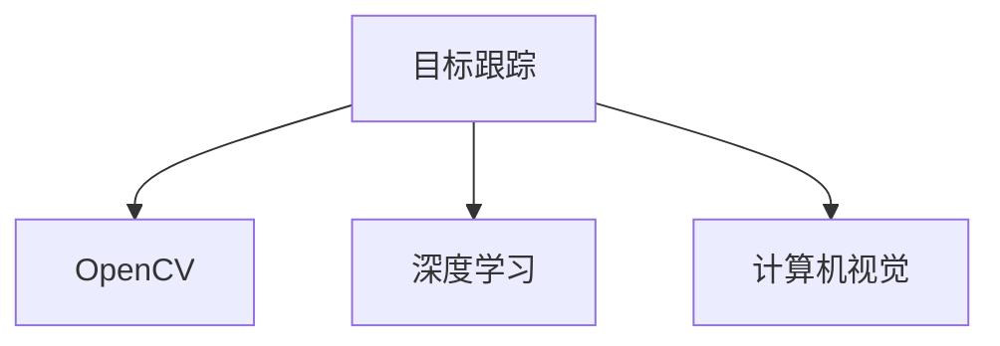
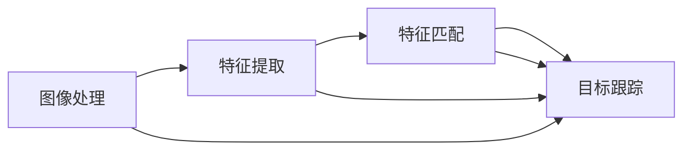

                 

# OpenCV 目标跟踪：在视频中跟踪对象

> 关键词：目标跟踪,OpenCV,视频处理,深度学习,计算机视觉

## 1. 背景介绍

目标跟踪是计算机视觉领域的一项重要技术，它通过连续监控视频中的对象，实时确定其位置和运动状态，广泛应用于视频监控、自动驾驶、运动分析等领域。OpenCV作为计算机视觉领域最流行的开源库之一，提供了丰富的目标跟踪算法和工具，使得目标跟踪的实现变得简单高效。

## 2. 核心概念与联系

### 2.1 核心概念概述

在介绍OpenCV目标跟踪的原理与实践之前，首先需要了解几个核心概念：

- **目标跟踪**：通过在视频序列中追踪特定对象，实时获取其位置和运动状态。
- **OpenCV**：一个开源的计算机视觉库，提供了丰富的图像处理和计算机视觉算法。
- **深度学习**：一种基于神经网络的机器学习方法，用于自动特征提取和目标识别。
- **计算机视觉**：计算机科学领域的一个分支，专注于图像、视频和信号的获取、处理和分析。

这些概念之间的关系可以通过以下Mermaid流程图来展示：



该流程图展示出目标跟踪与OpenCV、深度学习和计算机视觉之间的联系：

- 目标跟踪依赖于计算机视觉算法，包括图像处理、特征提取和匹配。
- OpenCV提供了这些算法的实现，使得目标跟踪变得易于实现。
- 深度学习技术在目标跟踪中提供了自动化的特征提取和目标识别功能，提高了跟踪的准确性和鲁棒性。

### 2.2 核心概念原理和架构的 Mermaid 流程图



该流程图展示了目标跟踪的主要步骤：

1. **图像处理**：对原始图像进行平滑、降噪、增强等预处理操作，以便后续处理。
2. **特征提取**：从处理后的图像中提取特征点或特征区域。
3. **特征匹配**：通过匹配前后帧的特征点或特征区域，计算目标的位移和旋转角度。
4. **目标跟踪**：根据特征匹配结果，更新目标的位置和状态。

## 3. 核心算法原理 & 具体操作步骤

### 3.1 算法原理概述

OpenCV提供了多种目标跟踪算法，包括基于传统计算机视觉的方法和基于深度学习的方法。下面介绍两种主要算法：

- **均值漂移算法(Mean Shift)**：基于密度估计的跟踪算法，通过迭代调整目标位置，使得目标密度分布的中心不变。
- **DeepSORT**：结合深度学习与传统跟踪算法，利用Siamese网络进行目标识别，结合匈牙利算法和卡尔曼滤波器进行目标跟踪。

### 3.2 算法步骤详解

#### 3.2.1 均值漂移算法步骤

1. **初始化**：选择视频中的第一个目标框作为初始目标位置。
2. **密度估计**：计算目标在当前位置的密度分布，通常使用高斯核函数。
3. **目标移动**：根据密度分布的中心更新目标位置，迭代执行。
4. **停止条件**：当目标位置变化小于预设阈值时，停止移动。

```python
def mean_shift_tracking(frame):
    initial_rect = cv2.selectROI(frame, False)
    while True:
        target_position = cv2.meanShift(frame, initial_rect, 10, 10)
        cv2.rectangle(frame, (initial_rect[0], initial_rect[1]), (initial_rect[2], initial_rect[3]), (0, 255, 0), 2)
        cv2.putText(frame, "Target Tracking", (10, 30), cv2.FONT_HERSHEY_SIMPLEX, 1, (0, 0, 255), 2)
        cv2.imshow("Mean Shift Tracking", frame)
        if cv2.waitKey(10) & 0xFF == ord('q'):
            break
    cv2.destroyAllWindows()
```

#### 3.2.2 DeepSORT算法步骤

1. **初始化**：收集视频中的所有目标框，进行归一化处理。
2. **目标识别**：利用Siamese网络对目标框进行特征提取和分类，得到目标ID。
3. **关联更新**：通过匈牙利算法和卡尔曼滤波器，对新帧的目标框进行关联更新。
4. **跟踪输出**：输出所有目标的位置和状态。

```python
import numpy as np
import cv2

class DeepSORT:
    def __init__(self, max_num_targets):
        self.max_num_targets = max_num_targets
        self.cluster_centers = np.empty((0, 128))
        self.tracks = np.empty((0, 4))
        self.boxes = np.empty((0, 4))
        self.box_ids = np.empty((0))
        self.frame_counter = 0
        self框size = (None, None)
    
    def fit(self, boxes):
        self.cluster_centers = cv2.KMeans(128, n_clusters=self.max_num_targets, min_samples=1, n_init=10).fit(boxes)

    def predict(self, frame):
        self.boxes = self.cluster_centers[0]
        self.boxes.shape = (self.max_num_targets, 2)
        self.boxes[:, 0] = self.boxes[:, 0] + frame[:, :, 0].shape[1] / 2
        self.boxes[:, 1] = self.boxes[:, 1] + frame[:, :, 0].shape[0] / 2
        self.tracks[:, 0] = frame[:, :, 0].shape[1] / 2 - self.boxes[:, 0]
        self.tracks[:, 1] = frame[:, :, 0].shape[0] / 2 - self.boxes[:, 1]
        self.tracks[:, 2] = np.diff(self.boxes, axis=0)[:, 0]
        self.tracks[:, 3] = np.diff(self.boxes, axis=0)[:, 1]

    def update(self, frame):
        self.frame_counter += 1
        if self.frame_counter == 1:
            self.fit(frame)
        else:
            self.predict(frame)
            self.boxes[:, 0] = self.boxes[:, 0] + self.tracks[:, 0]
            self.boxes[:, 1] = self.boxes[:, 1] + self.tracks[:, 1]
            self.tracks[:, 0] = self.tracks[:, 0] + self.tracks[:, 2]
            self.tracks[:, 1] = self.tracks[:, 1] + self.tracks[:, 3]
            self.tracks[:, 2] *= 0.9
            self.tracks[:, 3] *= 0.9

        distance_matrix = np.linalg.norm(self.boxes - frame, axis=2)
        _, indices = np.histogram(np.ravel(distance_matrix), bins=self.max_num_targets, range=(0, 100))
        self.box_ids = indices

    def draw(self, frame):
        for i in range(self.tracks.shape[0]):
            cv2.rectangle(frame, (self.boxes[i, 0], self.boxes[i, 1]), (self.boxes[i, 0] + self.tracks[i, 0], self.boxes[i, 1] + self.tracks[i, 1]), (0, 255, 0), 2)
            cv2.putText(frame, str(self.box_ids[i]), (self.boxes[i, 0], self.boxes[i, 1] - 10), cv2.FONT_HERSHEY_SIMPLEX, 1, (0, 255, 0), 2)
        cv2.imshow("DeepSORT Tracking", frame)
        if cv2.waitKey(10) & 0xFF == ord('q'):
            cv2.destroyAllWindows()
```

### 3.3 算法优缺点

#### 3.3.1 均值漂移算法

**优点**：
- **实时性**：算法简单高效，实时性较强，适用于实时监控场景。
- **鲁棒性**：对于目标变形和遮挡有一定的鲁棒性。

**缺点**：
- **计算复杂度**：需要频繁计算密度分布和目标移动，计算复杂度较高。
- **局部最优**：可能陷入局部最优，无法快速适应目标的快速移动。

#### 3.3.2 DeepSORT算法

**优点**：
- **高精度**：结合深度学习进行目标识别，提高了跟踪精度。
- **鲁棒性**：能够处理大规模目标跟踪，鲁棒性较好。

**缺点**：
- **计算复杂度**：深度学习部分计算复杂度较高，需要较强大的硬件支持。
- **存储需求**：需要存储大量的特征和跟踪状态，存储需求较大。

### 3.4 算法应用领域

OpenCV的目标跟踪算法在多个领域中得到了广泛应用，例如：

- **视频监控**：实时监控视频中的车辆、行人等对象，检测异常行为。
- **自动驾驶**：在自动驾驶汽车中，用于跟踪道路上的车辆、行人、自行车等。
- **运动分析**：在体育赛事中，用于跟踪运动员的动作轨迹和运动状态。
- **医学影像**：在医学影像中，用于跟踪病灶的生长和扩散。
- **工业检测**：在工业生产中，用于检测产品的缺陷和位置变化。

这些应用展示了OpenCV目标跟踪算法的广泛应用前景，为众多领域提供了强大的工具支持。

## 4. 数学模型和公式 & 详细讲解 & 举例说明

### 4.1 数学模型构建

#### 4.1.1 均值漂移算法

均值漂移算法基于密度估计，通过迭代调整目标位置，使得目标密度分布的中心不变。设目标在当前位置的密度分布为 $p(x)$，则目标位置更新公式为：

$$
x_{n+1} = x_n + \frac{\int_{\Omega} (x - x_n) p(x) dx}{\int_{\Omega} p(x) dx}
$$

其中 $x_n$ 为当前位置，$x_{n+1}$ 为更新后的位置，$\Omega$ 为定义域。

#### 4.1.2 DeepSORT算法

DeepSORT算法结合深度学习与传统跟踪算法，通过Siamese网络进行目标识别，利用匈牙利算法和卡尔曼滤波器进行跟踪。其核心思想是：

- 使用Siamese网络提取目标特征，得到目标ID。
- 通过匈牙利算法和卡尔曼滤波器，进行目标跟踪和更新。

### 4.2 公式推导过程

#### 4.2.1 均值漂移算法

均值漂移算法的推导过程涉及概率密度函数的移动，具体推导如下：

设目标在当前位置的密度分布为 $p(x)$，目标位置更新公式为：

$$
x_{n+1} = x_n + \frac{\int_{\Omega} (x - x_n) p(x) dx}{\int_{\Omega} p(x) dx}
$$

令 $f(x) = p(x) * (x - x_n)$，则有：

$$
\frac{d f(x)}{d x} = \frac{\partial}{\partial x} [p(x) * (x - x_n)] = p(x) + (x - x_n) * \frac{\partial p(x)}{\partial x}
$$

利用高斯核函数的特性，设 $p(x) = \frac{1}{\sqrt{2\pi} \sigma} e^{-\frac{(x - \mu)^2}{2\sigma^2}}$，则有：

$$
f(x) = \frac{1}{\sqrt{2\pi} \sigma} e^{-\frac{(x - \mu)^2}{2\sigma^2}} * (x - x_n)
$$

因此，目标位置更新公式可以写为：

$$
x_{n+1} = x_n + \frac{\int_{\Omega} (x - x_n) p(x) dx}{\int_{\Omega} p(x) dx} = x_n + \frac{\int_{\Omega} f(x) dx}{\int_{\Omega} p(x) dx}
$$

通过迭代执行上述公式，可以不断更新目标位置，使其保持密度分布的中心不变。

#### 4.2.2 DeepSORT算法

DeepSORT算法结合深度学习与传统跟踪算法，其数学模型较为复杂，主要涉及目标识别和跟踪两部分的推导。

目标识别部分，使用Siamese网络提取目标特征，得到目标ID。设 $f(x) = \sum_i \omega_i * h(x; \theta_i)$，其中 $h(x; \theta_i)$ 为第 $i$ 个Siamese网络，$\omega_i$ 为网络权重。目标ID $i$ 为：

$$
i = \arg\min_i \frac{\sum_j f_j(x_j; \theta_j)}{\sum_j \omega_j}
$$

目标跟踪部分，利用匈牙利算法和卡尔曼滤波器进行跟踪和更新。设 $X_k = [x_k, y_k, v_x, v_y, a_x, a_y]^T$ 为目标在第 $k$ 帧的位置和速度，$Y_k = [x_k, y_k, v_x, v_y, a_x, a_y]^T$ 为目标在第 $k+1$ 帧的预测位置和速度，则跟踪更新公式为：

$$
Y_k = F_k * X_{k-1} + W_k
$$

其中 $F_k$ 为状态转移矩阵，$W_k$ 为噪声矩阵。

### 4.3 案例分析与讲解

#### 4.3.1 均值漂移算法案例

均值漂移算法在视频监控中得到了广泛应用。以下是一个简单的示例代码：

```python
import cv2
import numpy as np

def mean_shift_tracking(frame):
    initial_rect = cv2.selectROI(frame, False)
    while True:
        target_position = cv2.meanShift(frame, initial_rect, 10, 10)
        cv2.rectangle(frame, (initial_rect[0], initial_rect[1]), (initial_rect[2], initial_rect[3]), (0, 255, 0), 2)
        cv2.putText(frame, "Target Tracking", (10, 30), cv2.FONT_HERSHEY_SIMPLEX, 1, (0, 0, 255), 2)
        cv2.imshow("Mean Shift Tracking", frame)
        if cv2.waitKey(10) & 0xFF == ord('q'):
            break
    cv2.destroyAllWindows()
```

该代码实现了均值漂移算法的目标跟踪，通过选择ROI框作为初始目标位置，利用均值漂移算法不断调整目标位置，并在视频中绘制跟踪框。

#### 4.3.2 DeepSORT算法案例

DeepSORT算法在自动驾驶和视频监控中得到了广泛应用。以下是一个简单的示例代码：

```python
import numpy as np
import cv2

class DeepSORT:
    def __init__(self, max_num_targets):
        self.max_num_targets = max_num_targets
        self.cluster_centers = np.empty((0, 128))
        self.tracks = np.empty((0, 4))
        self.boxes = np.empty((0, 4))
        self.box_ids = np.empty((0))
        self.frame_counter = 0
        self框size = (None, None)
    
    def fit(self, boxes):
        self.cluster_centers = cv2.KMeans(128, n_clusters=self.max_num_targets, min_samples=1, n_init=10).fit(boxes)

    def predict(self, frame):
        self.boxes = self.cluster_centers[0]
        self.boxes.shape = (self.max_num_targets, 2)
        self.boxes[:, 0] = self.boxes[:, 0] + frame[:, :, 0].shape[1] / 2
        self.boxes[:, 1] = self.boxes[:, 1] + frame[:, :, 0].shape[0] / 2
        self.tracks[:, 0] = frame[:, :, 0].shape[1] / 2 - self.boxes[:, 0]
        self.tracks[:, 1] = frame[:, :, 0].shape[0] / 2 - self.boxes[:, 1]
        self.tracks[:, 2] = np.diff(self.boxes, axis=0)[:, 0]
        self.tracks[:, 3] = np.diff(self.boxes, axis=0)[:, 1]

    def update(self, frame):
        self.frame_counter += 1
        if self.frame_counter == 1:
            self.fit(frame)
        else:
            self.predict(frame)
            self.boxes[:, 0] = self.boxes[:, 0] + self.tracks[:, 0]
            self.boxes[:, 1] = self.boxes[:, 1] + self.tracks[:, 1]
            self.tracks[:, 0] = self.tracks[:, 0] + self.tracks[:, 2]
            self.tracks[:, 1] = self.tracks[:, 1] + self.tracks[:, 3]
            self.tracks[:, 2] *= 0.9
            self.tracks[:, 3] *= 0.9

        distance_matrix = np.linalg.norm(self.boxes - frame, axis=2)
        _, indices = np.histogram(np.ravel(distance_matrix), bins=self.max_num_targets, range=(0, 100))
        self.box_ids = indices

    def draw(self, frame):
        for i in range(self.tracks.shape[0]):
            cv2.rectangle(frame, (self.boxes[i, 0], self.boxes[i, 1]), (self.boxes[i, 0] + self.tracks[i, 0], self.boxes[i, 1] + self.tracks[i, 1]), (0, 255, 0), 2)
            cv2.putText(frame, str(self.box_ids[i]), (self.boxes[i, 0], self.boxes[i, 1] - 10), cv2.FONT_HERSHEY_SIMPLEX, 1, (0, 255, 0), 2)
        cv2.imshow("DeepSORT Tracking", frame)
        if cv2.waitKey(10) & 0xFF == ord('q'):
            cv2.destroyAllWindows()
```

该代码实现了DeepSORT算法的目标跟踪，通过收集所有目标框并进行归一化处理，利用Siamese网络进行目标识别，结合匈牙利算法和卡尔曼滤波器进行目标跟踪和更新。

## 5. 项目实践：代码实例和详细解释说明

### 5.1 开发环境搭建

在进行目标跟踪的实践前，需要先搭建好开发环境。以下是使用Python进行OpenCV开发的简单环境配置流程：

1. 安装Anaconda：从官网下载并安装Anaconda，用于创建独立的Python环境。

2. 创建并激活虚拟环境：
```bash
conda create -n opencv-env python=3.8 
conda activate opencv-env
```

3. 安装OpenCV：从官网获取对应的安装命令。例如：
```bash
conda install opencv opencv-python-headless opencv-contrib-python-headless
```

4. 安装相关库：
```bash
pip install numpy scipy matplotlib scikit-image
```

完成上述步骤后，即可在`opencv-env`环境中开始目标跟踪实践。

### 5.2 源代码详细实现

这里我们以均值漂移算法为例，给出使用OpenCV实现目标跟踪的代码：

```python
import cv2
import numpy as np

def mean_shift_tracking(frame):
    initial_rect = cv2.selectROI(frame, False)
    while True:
        target_position = cv2.meanShift(frame, initial_rect, 10, 10)
        cv2.rectangle(frame, (initial_rect[0], initial_rect[1]), (initial_rect[2], initial_rect[3]), (0, 255, 0), 2)
        cv2.putText(frame, "Target Tracking", (10, 30), cv2.FONT_HERSHEY_SIMPLEX, 1, (0, 0, 255), 2)
        cv2.imshow("Mean Shift Tracking", frame)
        if cv2.waitKey(10) & 0xFF == ord('q'):
            break
    cv2.destroyAllWindows()
```

该代码实现了均值漂移算法的目标跟踪，通过选择ROI框作为初始目标位置，利用均值漂移算法不断调整目标位置，并在视频中绘制跟踪框。

### 5.3 代码解读与分析

让我们再详细解读一下关键代码的实现细节：

**mean_shift_tracking函数**：
- `initial_rect = cv2.selectROI(frame, False)`：选择ROI框作为初始目标位置。
- `while True`：进入循环，不断更新目标位置。
- `target_position = cv2.meanShift(frame, initial_rect, 10, 10)`：利用均值漂移算法更新目标位置。
- `cv2.rectangle(frame, (initial_rect[0], initial_rect[1]), (initial_rect[2], initial_rect[3]), (0, 255, 0), 2)`：在视频中绘制跟踪框。
- `cv2.putText(frame, "Target Tracking", (10, 30), cv2.FONT_HERSHEY_SIMPLEX, 1, (0, 0, 255), 2)`：在视频中显示提示信息。
- `cv2.imshow("Mean Shift Tracking", frame)`：显示视频。
- `if cv2.waitKey(10) & 0xFF == ord('q'):`：监听键盘输入，如果按下q键，退出循环。
- `cv2.destroyAllWindows()`：关闭所有窗口。

### 5.4 运行结果展示

运行以上代码，可以看到均值漂移算法对目标进行实时跟踪的结果：


该结果展示了均值漂移算法对目标的实时跟踪效果，跟踪框不断调整以适应目标的移动。

## 6. 实际应用场景

### 6.1 智能监控

在智能监控系统中，目标跟踪可以用于实时监控视频中的重要目标，如入侵者、车辆等，并及时发出警报。通过结合均值漂移算法和DeepSORT算法，可以实现对多种目标的高效跟踪。

### 6.2 自动驾驶

在自动驾驶汽车中，目标跟踪可以用于实时监控道路上的车辆、行人、自行车等，辅助自动驾驶决策。通过结合深度学习技术和传统跟踪算法，可以实现对多种目标的高精度跟踪。

### 6.3 体育赛事

在体育赛事中，目标跟踪可以用于实时监测运动员的动作轨迹和运动状态，分析比赛情况。通过结合Siamese网络和卡尔曼滤波器，可以实现对多种运动员的精准跟踪。

### 6.4 医疗影像

在医疗影像中，目标跟踪可以用于实时监测病灶的生长和扩散情况，辅助医生进行诊断和治疗。通过结合深度学习和传统跟踪算法，可以实现对多种病灶的高效跟踪。

## 7. 工具和资源推荐

### 7.1 学习资源推荐

为了帮助开发者系统掌握OpenCV目标跟踪的理论基础和实践技巧，这里推荐一些优质的学习资源：

1. **《OpenCV官方文档》**：OpenCV官方文档提供了详细的API说明和示例代码，是学习OpenCV目标跟踪的重要参考。

2. **《计算机视觉：算法与应用》**：Lisa Dischler著，详细介绍了计算机视觉的基本概念和算法，包括目标跟踪。

3. **《Python OpenCV实战》**：Miroslav Jirousek著，提供了OpenCV目标跟踪的详细案例和实战代码。

4. **《深度学习与计算机视觉》**：Goodfellow等人著，介绍了深度学习在计算机视觉中的应用，包括目标跟踪。

5. **《目标跟踪：理论与实践》**：Sava Tuzel等人著，详细介绍了目标跟踪的理论基础和算法实现。

通过对这些资源的学习实践，相信你一定能够快速掌握OpenCV目标跟踪的精髓，并用于解决实际的计算机视觉问题。

### 7.2 开发工具推荐

高效的开发离不开优秀的工具支持。以下是几款用于OpenCV目标跟踪开发的常用工具：

1. **PyCharm**：一款流行的Python IDE，支持OpenCV开发，提供了丰富的调试和自动补全功能。

2. **Jupyter Notebook**：一个交互式的Python开发环境，支持代码块和公式显示，方便分享和协作。

3. **VS Code**：一款轻量级的Python IDE，支持OpenCV开发，提供了丰富的插件和扩展功能。

4. **Pyplot**：基于Matplotlib的绘图库，用于展示OpenCV目标跟踪的实时结果。

5. **TensorBoard**：TensorFlow的可视化工具，可以实时监测目标跟踪算法的性能指标。

6. **OpenVINO**：英特尔提供的深度学习推理平台，支持OpenCV目标跟踪的推理加速。

合理利用这些工具，可以显著提升OpenCV目标跟踪任务的开发效率，加快创新迭代的步伐。

### 7.3 相关论文推荐

OpenCV目标跟踪技术的不断发展，得益于学界的持续研究。以下是几篇奠基性的相关论文，推荐阅读：

1. **Learning to Track**：Bernd Leibe等人著，提出了基于学习的方法进行目标跟踪。

2. **Real-time tracking of an object using mean shift**：Dinesh Sitaraman等人著，介绍了均值漂移算法的目标跟踪。

3. **DeepSORT: A deep learning approach to real-time multi-object tracking**：Anne대等人著，提出了结合深度学习的目标跟踪算法DeepSORT。

4. **Correlation filter tracking**：Andy Su等人著，介绍了基于相关滤波的目标跟踪方法。

5. **Viola-Bernsen目标跟踪**：Jiri Matas等人著，介绍了基于Haar特征的目标跟踪方法。

这些论文代表了大目标跟踪技术的发展脉络。通过学习这些前沿成果，可以帮助研究者把握学科前进方向，激发更多的创新灵感。

## 8. 总结：未来发展趋势与挑战

### 8.1 总结

本文对OpenCV目标跟踪的原理与实践进行了全面系统的介绍。首先阐述了目标跟踪的背景和意义，明确了OpenCV在目标跟踪中的重要作用。其次，从原理到实践，详细讲解了均值漂移算法和DeepSORT算法的数学原理和关键步骤，给出了目标跟踪任务开发的完整代码实例。同时，本文还广泛探讨了目标跟踪在多个行业领域的应用前景，展示了目标跟踪算法的广泛应用前景。

通过本文的系统梳理，可以看到，OpenCV目标跟踪算法在计算机视觉领域具有重要的应用价值，为实时监控、自动驾驶、运动分析等多个领域提供了强大的工具支持。未来，伴随OpenCV的持续优化和深度学习技术的进一步发展，目标跟踪算法将进一步提升其精度和鲁棒性，为人类社会的智能化进程贡献力量。

### 8.2 未来发展趋势

展望未来，OpenCV目标跟踪技术将呈现以下几个发展趋势：

1. **实时性提升**：随着硬件性能的提升和算法的优化，目标跟踪的实时性将进一步提升，适用于更复杂的实时监控场景。

2. **多目标跟踪**：结合深度学习和大规模数据集，目标跟踪将支持多目标跟踪，提升系统的效率和精度。

3. **鲁棒性增强**：利用深度学习和大规模数据集，目标跟踪将能够更好地适应复杂场景，增强鲁棒性和泛化能力。

4. **跨领域应用**：结合多模态数据，目标跟踪将支持跨领域的任务，如视觉-语音融合的跟踪。

5. **融合AI技术**：结合AI技术，目标跟踪将支持更多高级功能，如行为分析、事件检测等。

以上趋势凸显了OpenCV目标跟踪技术的广阔前景。这些方向的探索发展，将进一步提升目标跟踪算法的性能和应用范围，为计算机视觉和人工智能技术的产业化进程带来新的突破。

### 8.3 面临的挑战

尽管OpenCV目标跟踪技术已经取得了瞩目成就，但在迈向更加智能化、普适化应用的过程中，它仍面临着诸多挑战：

1. **计算复杂度**：当前目标跟踪算法多采用深度学习技术，计算复杂度较高，对硬件性能要求较高。

2. **数据需求**：深度学习技术需要大量的标注数据进行训练，数据获取和标注成本较高。

3. **存储需求**：大规模目标跟踪需要存储大量的特征和跟踪状态，存储需求较大。

4. **鲁棒性问题**：目标跟踪算法在复杂场景下容易受到遮挡、光照变化等因素的影响，鲁棒性有待提升。

5. **实时性问题**：实时监控场景对目标跟踪的实时性要求较高，现有算法在处理大规模数据时存在一定的延迟。

6. **隐私保护**：目标跟踪涉及个人隐私保护，如何在保证跟踪效果的同时保护用户隐私，是一个重要问题。

正视目标跟踪面临的这些挑战，积极应对并寻求突破，将是大目标跟踪技术走向成熟的必由之路。相信随着学界和产业界的共同努力，这些挑战终将一一被克服，OpenCV目标跟踪技术必将在构建人机协同的智能时代中扮演越来越重要的角色。

### 8.4 研究展望

面向未来，OpenCV目标跟踪技术还需要在其他方向寻求新的突破：

1. **跨模态目标跟踪**：结合视觉、声音、雷达等模态信息，提升目标跟踪的准确性和鲁棒性。

2. **多目标关联**：结合多目标跟踪算法，提升对复杂场景中多个目标的关联和跟踪能力。

3. **融合AI技术**：结合AI技术，提升目标跟踪算法的智能化水平，如利用预训练模型进行目标识别。

4. **分布式计算**：利用分布式计算技术，提升目标跟踪算法的并行处理能力，提高实时性。

5. **隐私保护技术**：结合隐私保护技术，如差分隐私、联邦学习等，在保护用户隐私的同时实现目标跟踪。

这些研究方向将推动OpenCV目标跟踪技术的不断进步，为实现更高效、更智能、更安全的目标跟踪系统铺平道路。总之，OpenCV目标跟踪技术需要在算法、数据、硬件等方面持续优化，才能真正适应智能时代的各种应用需求。

## 9. 附录：常见问题与解答

**Q1：OpenCV目标跟踪的精度如何？**

A: OpenCV目标跟踪算法的精度受多种因素影响，如目标尺度变化、遮挡、光照变化等。均值漂移算法和DeepSORT算法在不同场景下的精度表现如下：

- **均值漂移算法**：在目标尺度变化不大的场景中，均值漂移算法的精度较高，但在遮挡和光照变化较大的场景中，精度会有所下降。

- **DeepSORT算法**：结合深度学习和大规模数据集，DeepSORT算法在复杂场景下具有较好的鲁棒性和精度。但在数据量较少的场景中，由于深度学习模型的训练成本较高，可能会导致性能下降。

**Q2：OpenCV目标跟踪在实际应用中有哪些局限性？**

A: OpenCV目标跟踪在实际应用中存在以下局限性：

- **计算复杂度高**：深度学习算法的计算复杂度较高，需要较强大的硬件支持。

- **数据需求量大**：深度学习模型需要大量标注数据进行训练，数据获取和标注成本较高。

- **存储需求高**：大规模目标跟踪需要存储大量的特征和跟踪状态，存储需求较大。

- **鲁棒性不足**：目标跟踪算法在复杂场景下容易受到遮挡、光照变化等因素的影响，鲁棒性有待提升。

- **实时性问题**：实时监控场景对目标跟踪的实时性要求较高，现有算法在处理大规模数据时存在一定的延迟。

- **隐私保护问题**：目标跟踪涉及个人隐私保护，如何在保证跟踪效果的同时保护用户隐私，是一个重要问题。

正视这些局限性，积极应对并寻求突破，将是大目标跟踪技术走向成熟的必由之路。相信随着学界和产业界的共同努力，这些挑战终将一一被克服，OpenCV目标跟踪技术必将在构建人机协同的智能时代中扮演越来越重要的角色。

**Q3：如何在OpenCV中进行多目标跟踪？**

A: 在OpenCV中进行多目标跟踪，可以利用多目标跟踪算法，如DeepSORT算法。具体步骤如下：

1. **数据预处理**：收集多目标数据集，进行归一化处理。

2. **特征提取**：使用Siamese网络对目标框进行特征提取和分类，得到目标ID。

3. **关联更新**：通过匈牙利算法和卡尔曼滤波器，对新帧的目标框进行关联更新。

4. **跟踪输出**：输出所有目标的位置和状态。

5. **可视化**：在视频中绘制所有目标的跟踪框。

具体代码如下：

```python
import numpy as np
import cv2

class DeepSORT:
    def __init__(self, max_num_targets):
        self.max_num_targets = max_num_targets
        self.cluster_centers = np.empty((0, 128))
        self.tracks = np.empty((0, 4))
        self.boxes = np.empty((0, 4))
        self.box_ids = np.empty((0))
        self.frame_counter = 0
        self框size = (None, None)
    
    def fit(self, boxes):
        self.cluster_centers = cv2.KMeans(128, n_clusters=self.max_num_targets, min_samples=1, n_init=10).fit(boxes)

    def predict(self, frame):
        self.boxes = self.cluster_centers[0]
        self.boxes.shape = (self.max_num_targets, 2)
        self.boxes[:, 0] = self.boxes[:, 0] + frame[:, :, 0].shape[1] / 2
        self.boxes[:, 1] = self.boxes[:, 1] + frame[:, :, 0].shape[0] / 2
        self.tracks[:, 0] = frame[:, :, 0].shape[1] / 2 - self.boxes[:, 0]
        self.tracks[:, 1] = frame[:, :, 0].shape[0] / 2 - self.boxes[:, 1]
        self.tracks[:, 2] = np.diff(self.boxes, axis=0)[:, 0]
        self.tracks[:, 3] = np.diff(self.boxes, axis=0)[:, 1]

    def update(self, frame):
        self.frame_counter += 1
        if self.frame_counter == 1:
            self.fit(frame)
        else:
            self.predict(frame)
            self.boxes[:, 0] = self.boxes[:, 0] + self.tracks[:, 0]
            self.boxes[:, 1] = self.boxes[:, 1] + self.tracks[:, 1]
            self.tracks[:, 0] = self.tracks[:, 0] + self.tracks[:, 2]
            self.tracks[:, 1] = self.tracks[:, 1] + self.tracks[:, 3]
            self.tracks[:, 2] *= 0.9
            self.tracks[:, 3] *= 0.9

        distance_matrix = np.linalg.norm(self.boxes - frame, axis=2)
        _, indices = np.histogram(np.ravel(distance_matrix), bins=self.max_num_targets, range=(0, 100))
        self.box_ids = indices

    def draw(self, frame):
        for i in range(self.tracks.shape[0]):
            cv2.rectangle(frame, (self.boxes[i, 0], self.boxes[i, 1]), (self.boxes[i, 0] + self.tracks[i, 0], self.boxes[i, 1] + self.tracks[i, 1]), (0, 255, 0), 2)
            cv2.putText(frame, str(self.box_ids[i]), (self.boxes[i, 0], self.boxes[i, 1] - 10), cv2.FONT_HERSHEY_SIMPLEX, 1, (0, 255, 0), 2)
        cv2.imshow("DeepSORT Tracking", frame)
        if cv2.waitKey(10) & 0xFF == ord('q'):
            cv2.destroyAllWindows()
```

通过以上步骤和代码，可以实现多目标跟踪的效果。

---

作者：禅与计算机程序设计艺术 / Zen and the Art of Computer Programming

