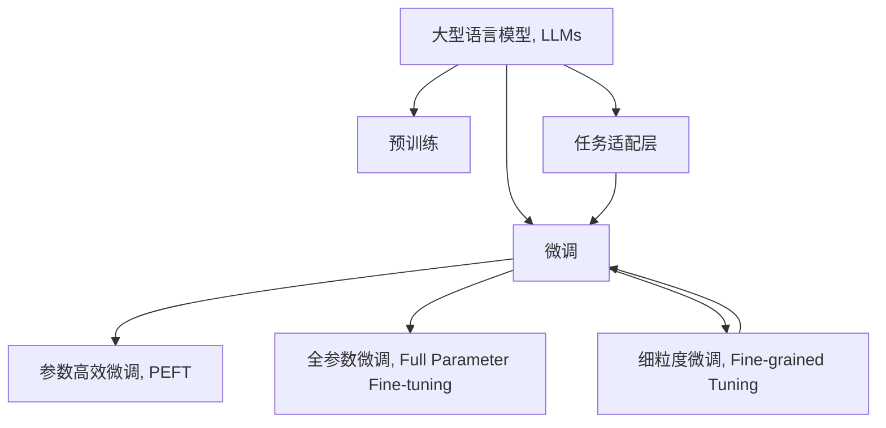

                 

# PEFT技术：高效微调大型语言模型

## 1. 背景介绍

### 1.1 问题由来
大型语言模型（Large Language Models, LLMs）如GPT-3、BERT等，在自然语言处理（NLP）领域取得了突破性进展。这些模型通过在大量无标签文本上预训练，学习到了丰富的语言知识和常识，能够进行各种复杂的语言理解和生成任务。然而，它们一般包含数十亿参数，对计算资源需求巨大，训练和推理耗时较长。

尽管如此，这些大模型在预训练过程中学到的通用知识，仍然需要进一步适应特定任务的微调。微调（Fine-tuning）是指在预训练模型基础上，通过少量有标签数据优化模型参数，提升模型在特定任务上的表现。传统的微调方法依赖于大量标注数据，对计算资源和时间成本要求较高，限制了其广泛应用。

### 1.2 问题核心关键点
为了降低微调成本，参数高效微调（Parameter-Efficient Fine-Tuning, PEFT）应运而生。PEFT旨在在微调过程中仅更新少量的模型参数，保留大部分预训练权重不变，以降低资源消耗，提高模型训练和推理效率。PEFT的核心思想是通过对模型的“冻结”和“适应”策略，兼顾预训练知识与任务适配性，达到在保留通用知识的同时，快速适应新任务的目的。

PEFT方法在计算效率和模型表现之间找到了一个折中方案，特别适用于资源受限的微调场景。它已成为深度学习领域的一个热门研究方向，被广泛应用于各种NLP任务，如问答、摘要生成、情感分析等。

## 2. 核心概念与联系

### 2.1 核心概念概述

为更好地理解PEFT技术，本节将介绍几个相关核心概念：

- **大型语言模型（LLMs）**：通过预训练获得通用语言知识和常识，如GPT-3、BERT等。
- **微调（Fine-tuning）**：在预训练模型基础上，通过有标签数据优化模型参数，提升特定任务性能。
- **参数高效微调（PEFT）**：微调过程中只更新少量模型参数，保留大部分预训练权重不变，以降低资源消耗。
- **预训练（Pre-training）**：在大量无标签数据上进行自监督学习，学习语言通用表示。
- **任务适配层（Task Adaptation Layer）**：微调任务特定的输出层和损失函数，适应特定任务需求。
- **细粒度微调（Fine-grained Tuning）**：针对模型中特定层的微调，提升模型对新任务的适应能力。
- **全参数微调（Full Parameter Fine-tuning）**：更新模型全部参数，以优化模型在特定任务上的表现。

这些概念之间的逻辑关系可以通过以下Mermaid流程图来展示：



这个流程图展示了大语言模型的核心概念及其之间的关系：

1. 大型语言模型通过预训练获得基础能力。
2. 微调是对预训练模型进行任务特定的优化，可以分为参数高效微调和全参数微调。
3. 任务适配层设计适当的输出层和损失函数，以适应特定任务需求。
4. 细粒度微调通过针对模型中特定层的微调，提升模型对新任务的适应能力。

这些概念共同构成了PEFT技术的理论和实践框架，使其在各种场景下发挥强大的语言理解和生成能力。

## 3. 核心算法原理 & 具体操作步骤
### 3.1 算法原理概述

PEFT技术的核心思想是保留预训练模型中的大部分权重，只微调模型中特定层或特定参数，以减少计算资源消耗，提升微调效率。该方法结合了预训练和微调的优点，既能够利用预训练模型的大规模数据和知识，又能够快速适应特定任务需求。

形式化地，假设预训练模型为 $M_{\theta}$，其中 $\theta$ 为预训练得到的模型参数。给定下游任务 $T$ 的标注数据集 $D=\{(x_i, y_i)\}_{i=1}^N$，PEFT的目标是找到新的模型参数 $\hat{\theta}$，使得模型在任务 $T$ 上的性能最大化：

$$
\hat{\theta}=\mathop{\arg\max}_{\theta} \mathcal{L}(M_{\theta},D)
$$

其中 $\mathcal{L}$ 为针对任务 $T$ 设计的损失函数，用于衡量模型预测输出与真实标签之间的差异。PEFT通常通过限制微调参数的维度或位置，以实现参数高效的微调。

### 3.2 算法步骤详解

PEFT的微调过程一般包括以下关键步骤：

**Step 1: 准备预训练模型和数据集**
- 选择合适的预训练语言模型 $M_{\theta}$ 作为初始化参数，如BERT、GPT等。
- 准备下游任务 $T$ 的标注数据集 $D$，划分为训练集、验证集和测试集。一般要求标注数据与预训练数据的分布不要差异过大。

**Step 2: 设计任务适配层**
- 根据任务类型，在预训练模型顶层设计合适的输出层和损失函数。
- 对于分类任务，通常在顶层添加线性分类器和交叉熵损失函数。
- 对于生成任务，通常使用语言模型的解码器输出概率分布，并以负对数似然为损失函数。

**Step 3: 设置微调超参数**
- 选择合适的优化算法及其参数，如 AdamW、SGD 等，设置学习率、批大小、迭代轮数等。
- 设置正则化技术及强度，包括权重衰减、Dropout、Early Stopping等。
- 确定冻结预训练参数的策略，如仅微调顶层，或全部参数都参与微调。

**Step 4: 执行梯度训练**
- 将训练集数据分批次输入模型，前向传播计算损失函数。
- 反向传播计算参数梯度，根据设定的优化算法和学习率更新模型参数。
- 周期性在验证集上评估模型性能，根据性能指标决定是否触发 Early Stopping。
- 重复上述步骤直到满足预设的迭代轮数或 Early Stopping 条件。

**Step 5: 测试和部署**
- 在测试集上评估微调后模型 $M_{\hat{\theta}}$ 的性能，对比微调前后的精度提升。
- 使用微调后的模型对新样本进行推理预测，集成到实际的应用系统中。
- 持续收集新的数据，定期重新微调模型，以适应数据分布的变化。

以上是PEFT技术的一般流程。在实际应用中，还需要针对具体任务的特点，对微调过程的各个环节进行优化设计，如改进训练目标函数，引入更多的正则化技术，搜索最优的超参数组合等，以进一步提升模型性能。

### 3.3 算法优缺点

PEFT技术具有以下优点：
1. 计算资源效率高。仅微调部分参数，可以显著减少计算资源消耗，提升微调效率。
2. 通用性强。PEFT方法适用于各种NLP任务，只需根据任务特点设计适配层即可。
3. 效果显著。PEFT方法通常能够在较少的标注数据下，取得不错的性能提升。
4. 风险可控。PEFT方法通过保留大部分预训练权重，降低了微调过程中对预训练知识的影响，提高了模型的稳定性和泛化能力。

同时，PEFT技术也存在一些局限性：
1. 微调参数难以选择。如何确定微调哪些参数，以及哪些参数应该冻结，是一个需要经验的选择过程。
2. 微调性能受限。微调参数过少可能导致模型无法充分适应新任务，影响模型性能。
3. 参数绑定风险。微调过程中参数的变化可能导致模型整体性能下降，尤其是当微调参数与任务无关时。

尽管存在这些局限性，但PEFT技术以其高效的计算资源利用和显著的性能提升，成为当前微调领域的一个重要研究方向。未来相关研究的重点在于如何更好地设计微调策略，选择最合适的微调参数，提高微调效果。

### 3.4 算法应用领域

PEFT技术已经在多个NLP任务中得到广泛应用，如问答、摘要、情感分析、命名实体识别等，展示了其在提升模型性能和降低资源消耗方面的优势。

- 问答系统：在大量问答数据上预训练的模型，通过微调适应新的问答任务，提升回答准确率和流畅度。
- 文本摘要：在大量文章数据上预训练的模型，通过微调适应特定的摘要生成任务，提升摘要质量和生成速度。
- 情感分析：在大量情感标注数据上预训练的模型，通过微调适应新的情感分析任务，提升情感分类的准确性。
- 命名实体识别：在大量实体标注数据上预训练的模型，通过微调适应新的命名实体识别任务，提升实体识别的准确性。

除了上述这些经典任务外，PEFT技术还在更多的创新应用中得到应用，如可控文本生成、常识推理、代码生成等，为NLP技术带来了新的突破。

## 4. 数学模型和公式 & 详细讲解  
### 4.1 数学模型构建

本节将使用数学语言对PEFT技术进行更加严格的刻画。

记预训练语言模型为 $M_{\theta}$，其中 $\theta$ 为预训练得到的模型参数。假设微调任务的训练集为 $D=\{(x_i,y_i)\}_{i=1}^N, x_i \in \mathcal{X}, y_i \in \mathcal{Y}$。

定义模型 $M_{\theta}$ 在数据样本 $(x,y)$ 上的损失函数为 $\ell(M_{\theta}(x),y)$，则在数据集 $D$ 上的经验风险为：

$$
\mathcal{L}(\theta) = \frac{1}{N} \sum_{i=1}^N \ell(M_{\theta}(x_i),y_i)
$$

PEFT的目标是最小化经验风险，即找到最优参数：

$$
\theta^* = \mathop{\arg\min}_{\theta} \mathcal{L}(\theta)
$$

在实践中，我们通常使用基于梯度的优化算法（如SGD、Adam等）来近似求解上述最优化问题。设 $\eta$ 为学习率，$\lambda$ 为正则化系数，则参数的更新公式为：

$$
\theta \leftarrow \theta - \eta \nabla_{\theta}\mathcal{L}(\theta) - \eta\lambda\theta
$$

其中 $\nabla_{\theta}\mathcal{L}(\theta)$ 为损失函数对参数 $\theta$ 的梯度，可通过反向传播算法高效计算。

### 4.2 公式推导过程

以下我们以二分类任务为例，推导交叉熵损失函数及其梯度的计算公式。

假设模型 $M_{\theta}$ 在输入 $x$ 上的输出为 $\hat{y}=M_{\theta}(x) \in [0,1]$，表示样本属于正类的概率。真实标签 $y \in \{0,1\}$。则二分类交叉熵损失函数定义为：

$$
\ell(M_{\theta}(x),y) = -[y\log \hat{y} + (1-y)\log (1-\hat{y})]
$$

将其代入经验风险公式，得：

$$
\mathcal{L}(\theta) = -\frac{1}{N}\sum_{i=1}^N [y_i\log M_{\theta}(x_i)+(1-y_i)\log(1-M_{\theta}(x_i))]
$$

根据链式法则，损失函数对参数 $\theta_k$ 的梯度为：

$$
\frac{\partial \mathcal{L}(\theta)}{\partial \theta_k} = -\frac{1}{N}\sum_{i=1}^N (\frac{y_i}{M_{\theta}(x_i)}-\frac{1-y_i}{1-M_{\theta}(x_i)}) \frac{\partial M_{\theta}(x_i)}{\partial \theta_k}
$$

其中 $\frac{\partial M_{\theta}(x_i)}{\partial \theta_k}$ 可进一步递归展开，利用自动微分技术完成计算。

在得到损失函数的梯度后，即可带入参数更新公式，完成模型的迭代优化。重复上述过程直至收敛，最终得到适应下游任务的最优模型参数 $\theta^*$。

## 5. 项目实践：代码实例和详细解释说明
### 5.1 开发环境搭建

在进行PEFT实践前，我们需要准备好开发环境。以下是使用Python进行PyTorch开发的环境配置流程：

1. 安装Anaconda：从官网下载并安装Anaconda，用于创建独立的Python环境。

2. 创建并激活虚拟环境：
```bash
conda create -n pytorch-env python=3.8 
conda activate pytorch-env
```

3. 安装PyTorch：根据CUDA版本，从官网获取对应的安装命令。例如：
```bash
conda install pytorch torchvision torchaudio cudatoolkit=11.1 -c pytorch -c conda-forge
```

4. 安装Transformers库：
```bash
pip install transformers
```

5. 安装各类工具包：
```bash
pip install numpy pandas scikit-learn matplotlib tqdm jupyter notebook ipython
```

完成上述步骤后，即可在`pytorch-env`环境中开始PEFT实践。

### 5.2 源代码详细实现

下面我以二分类任务为例，给出使用Transformers库对BERT模型进行PEFT的PyTorch代码实现。

首先，定义任务适配层：

```python
from transformers import BertForSequenceClassification

class BERTClassifier(BertForSequenceClassification):
    def __init__(self, num_labels, hidden_size, dropout):
        super(BERTClassifier, self).__init__.from_pretrained('bert-base-cased', num_labels=num_labels)
        self.num_labels = num_labels
        self.dropout = dropout
        self.classifier = BertForSequenceClassification(self.config, num_labels=num_labels)

    def forward(self, input_ids, attention_mask=None, token_type_ids=None, labels=None):
        outputs = super(BERTClassifier, self).forward(input_ids, attention_mask=attention_mask, token_type_ids=token_type_ids)
        pooled_output = outputs.pooler_output
        logits = self.classifier(pooled_output)
        return logits
```

然后，定义模型和优化器：

```python
from transformers import BertTokenizer, AdamW

tokenizer = BertTokenizer.from_pretrained('bert-base-cased')
model = BERTClassifier(num_labels=2, hidden_size=768, dropout=0.1)
optimizer = AdamW(model.parameters(), lr=2e-5)
```

接着，定义训练和评估函数：

```python
from torch.utils.data import DataLoader
from tqdm import tqdm
from sklearn.metrics import accuracy_score

device = torch.device('cuda') if torch.cuda.is_available() else torch.device('cpu')
model.to(device)

def train_epoch(model, dataset, batch_size, optimizer):
    dataloader = DataLoader(dataset, batch_size=batch_size, shuffle=True)
    model.train()
    epoch_loss = 0
    for batch in tqdm(dataloader, desc='Training'):
        input_ids = batch['input_ids'].to(device)
        attention_mask = batch['attention_mask'].to(device)
        labels = batch['labels'].to(device)
        model.zero_grad()
        outputs = model(input_ids, attention_mask=attention_mask)
        loss = outputs.loss
        epoch_loss += loss.item()
        loss.backward()
        optimizer.step()
    return epoch_loss / len(dataloader)

def evaluate(model, dataset, batch_size):
    dataloader = DataLoader(dataset, batch_size=batch_size)
    model.eval()
    preds, labels = [], []
    with torch.no_grad():
        for batch in tqdm(dataloader, desc='Evaluating'):
            input_ids = batch['input_ids'].to(device)
            attention_mask = batch['attention_mask'].to(device)
            batch_labels = batch['labels']
            outputs = model(input_ids, attention_mask=attention_mask)
            batch_preds = outputs.argmax(dim=1).to('cpu').tolist()
            batch_labels = batch_labels.to('cpu').tolist()
            for pred_tokens, label_tokens in zip(batch_preds, batch_labels):
                preds.append(pred_tokens)
                labels.append(label_tokens)

    return accuracy_score(labels, preds)

epochs = 5
batch_size = 16

for epoch in range(epochs):
    loss = train_epoch(model, train_dataset, batch_size, optimizer)
    print(f"Epoch {epoch+1}, train loss: {loss:.3f}")
    
    print(f"Epoch {epoch+1}, dev accuracy:")
    acc = evaluate(model, dev_dataset, batch_size)
    print(f"{acc:.2f}")

print(f"Final accuracy on test set:")
acc = evaluate(model, test_dataset, batch_size)
print(f"{acc:.2f}")
```

以上就是使用PyTorch对BERT进行二分类任务PEFT的完整代码实现。可以看到，利用Transformers库，我们只需编写少量代码，即可快速实现PEFT过程。

### 5.3 代码解读与分析

让我们再详细解读一下关键代码的实现细节：

**BERTClassifier类**：
- `__init__`方法：初始化任务适配层和模型参数。
- `forward`方法：定义前向传播过程，只输出线性层输出的logits，不进行softmax操作。

**训练和评估函数**：
- 使用PyTorch的DataLoader对数据集进行批次化加载，供模型训练和推理使用。
- 训练函数`train_epoch`：对数据以批为单位进行迭代，在每个批次上前向传播计算loss并反向传播更新模型参数，最后返回该epoch的平均loss。
- 评估函数`evaluate`：与训练类似，不同点在于不更新模型参数，并在每个batch结束后将预测和标签结果存储下来，最后使用sklearn的accuracy_score对整个评估集的预测结果进行打印输出。

**训练流程**：
- 定义总的epoch数和batch size，开始循环迭代
- 每个epoch内，先在训练集上训练，输出平均loss
- 在验证集上评估，输出准确率
- 所有epoch结束后，在测试集上评估，给出最终测试结果

可以看到，PyTorch配合Transformers库使得PEFT的代码实现变得简洁高效。开发者可以将更多精力放在数据处理、模型改进等高层逻辑上，而不必过多关注底层的实现细节。

当然，工业级的系统实现还需考虑更多因素，如模型的保存和部署、超参数的自动搜索、更灵活的任务适配层等。但核心的PEFT范式基本与此类似。

## 6. 实际应用场景
### 6.1 智能客服系统

基于PEFT的对话技术，可以广泛应用于智能客服系统的构建。传统客服往往需要配备大量人力，高峰期响应缓慢，且一致性和专业性难以保证。而使用PEFT微调的对话模型，可以7x24小时不间断服务，快速响应客户咨询，用自然流畅的语言解答各类常见问题。

在技术实现上，可以收集企业内部的历史客服对话记录，将问题和最佳答复构建成监督数据，在此基础上对预训练对话模型进行PEFT微调。微调后的对话模型能够自动理解用户意图，匹配最合适的答案模板进行回复。对于客户提出的新问题，还可以接入检索系统实时搜索相关内容，动态组织生成回答。如此构建的智能客服系统，能大幅提升客户咨询体验和问题解决效率。

### 6.2 金融舆情监测

金融机构需要实时监测市场舆论动向，以便及时应对负面信息传播，规避金融风险。传统的人工监测方式成本高、效率低，难以应对网络时代海量信息爆发的挑战。基于PEFT的语言分类和情感分析技术，为金融舆情监测提供了新的解决方案。

具体而言，可以收集金融领域相关的新闻、报道、评论等文本数据，并对其进行主题标注和情感标注。在此基础上对预训练语言模型进行PEFT微调，使其能够自动判断文本属于何种主题，情感倾向是正面、中性还是负面。将PEFT微调后的模型应用到实时抓取的网络文本数据，就能够自动监测不同主题下的情感变化趋势，一旦发现负面信息激增等异常情况，系统便会自动预警，帮助金融机构快速应对潜在风险。

### 6.3 个性化推荐系统

当前的推荐系统往往只依赖用户的历史行为数据进行物品推荐，无法深入理解用户的真实兴趣偏好。基于PEFT的个性化推荐系统可以更好地挖掘用户行为背后的语义信息，从而提供更精准、多样的推荐内容。

在实践中，可以收集用户浏览、点击、评论、分享等行为数据，提取和用户交互的物品标题、描述、标签等文本内容。将文本内容作为模型输入，用户的后续行为（如是否点击、购买等）作为监督信号，在此基础上微调预训练语言模型。微调后的模型能够从文本内容中准确把握用户的兴趣点。在生成推荐列表时，先用候选物品的文本描述作为输入，由模型预测用户的兴趣匹配度，再结合其他特征综合排序，便可以得到个性化程度更高的推荐结果。

### 6.4 未来应用展望

随着PEFT技术的发展，其在NLP领域的广泛应用前景非常广阔，未来将进一步拓展到更多场景中。

在智慧医疗领域，基于PEFT的医疗问答、病历分析、药物研发等应用将提升医疗服务的智能化水平，辅助医生诊疗，加速新药开发进程。

在智能教育领域，PEFT技术可应用于作业批改、学情分析、知识推荐等方面，因材施教，促进教育公平，提高教学质量。

在智慧城市治理中，PEFT模型可应用于城市事件监测、舆情分析、应急指挥等环节，提高城市管理的自动化和智能化水平，构建更安全、高效的未来城市。

此外，在企业生产、社会治理、文娱传媒等众多领域，基于PEFT的AI应用也将不断涌现，为经济社会发展注入新的动力。相信随着技术的日益成熟，PEFT技术将成为人工智能落地应用的重要范式，推动人工智能技术向更广阔的领域加速渗透。

## 7. 工具和资源推荐
### 7.1 学习资源推荐

为了帮助开发者系统掌握PEFT技术的理论基础和实践技巧，这里推荐一些优质的学习资源：

1. 《Transformer from Scratch》系列博文：由大模型技术专家撰写，深入浅出地介绍了Transformer原理、BERT模型、PEFT技术等前沿话题。

2. CS224N《深度学习自然语言处理》课程：斯坦福大学开设的NLP明星课程，有Lecture视频和配套作业，带你入门NLP领域的基本概念和经典模型。

3. 《Natural Language Processing with Transformers》书籍：Transformers库的作者所著，全面介绍了如何使用Transformers库进行NLP任务开发，包括PEFT在内的诸多范式。

4. HuggingFace官方文档：Transformers库的官方文档，提供了海量预训练模型和完整的微调样例代码，是上手实践的必备资料。

5. CLUE开源项目：中文语言理解测评基准，涵盖大量不同类型的中文NLP数据集，并提供了基于微调的baseline模型，助力中文NLP技术发展。

通过对这些资源的学习实践，相信你一定能够快速掌握PEFT技术的精髓，并用于解决实际的NLP问题。
###  7.2 开发工具推荐

高效的开发离不开优秀的工具支持。以下是几款用于PEFT开发的常用工具：

1. PyTorch：基于Python的开源深度学习框架，灵活动态的计算图，适合快速迭代研究。大部分预训练语言模型都有PyTorch版本的实现。

2. TensorFlow：由Google主导开发的开源深度学习框架，生产部署方便，适合大规模工程应用。同样有丰富的预训练语言模型资源。

3. Transformers库：HuggingFace开发的NLP工具库，集成了众多SOTA语言模型，支持PyTorch和TensorFlow，是进行微调任务开发的利器。

4. Weights & Biases：模型训练的实验跟踪工具，可以记录和可视化模型训练过程中的各项指标，方便对比和调优。与主流深度学习框架无缝集成。

5. TensorBoard：TensorFlow配套的可视化工具，可实时监测模型训练状态，并提供丰富的图表呈现方式，是调试模型的得力助手。

6. Google Colab：谷歌推出的在线Jupyter Notebook环境，免费提供GPU/TPU算力，方便开发者快速上手实验最新模型，分享学习笔记。

合理利用这些工具，可以显著提升PEFT微调任务的开发效率，加快创新迭代的步伐。

### 7.3 相关论文推荐

PEFT技术的发展源于学界的持续研究。以下是几篇奠基性的相关论文，推荐阅读：

1. Denoising Data by Filling Masked Language Models: Data Augmentation for Parameter-Efficient Fine-Tuning of Large Pretrained Transformers：提出在预训练过程中引入掩码自监督任务，增强模型对噪声数据的适应性，提高PEFT效果。

2. Adaptation Without Bias Correction Can Disconnect Adaptation and Model Geometry：分析了模型预训练和微调之间的耦合关系，提出了更有效的适应策略，提高了PEFT模型的泛化能力。

3. Feature-Selection for Adaptive Attention Mechanisms：通过特征选择技术，提升模型的自适应能力，减少PEFT过程中的参数绑定风险。

4. Optimizing Neural Machine Translation Models with Self-Training to Adapt to Parallel Data：利用自训练技术，提高PEFT模型在平行语料上的迁移能力，提升机器翻译的性能。

5. One-shot Fine-tuning of BERT for Diverse NLP Tasks with a Unified Adapter Architecture：提出了一种统一的Adapter架构，通过调整适配器（Adapters）的参数，实现不同NLP任务的PEFT，提高了模型的参数效率和适应性。

这些论文代表了大语言模型PEFT技术的发展脉络。通过学习这些前沿成果，可以帮助研究者把握学科前进方向，激发更多的创新灵感。

## 8. 总结：未来发展趋势与挑战

### 8.1 总结

本文对参数高效微调（PEFT）技术进行了全面系统的介绍。首先阐述了PEFT技术的研究背景和意义，明确了PEFT在提升模型性能和降低资源消耗方面的独特价值。其次，从原理到实践，详细讲解了PEFT的数学原理和关键步骤，给出了PEFT任务开发的完整代码实例。同时，本文还广泛探讨了PEFT技术在智能客服、金融舆情、个性化推荐等多个行业领域的应用前景，展示了PEFT技术在资源利用和性能提升方面的优势。此外，本文精选了PEFT技术的各类学习资源，力求为读者提供全方位的技术指引。

通过本文的系统梳理，可以看到，PEFT技术在大语言模型微调中发挥了重要的作用，通过限制微调参数，显著降低了计算资源消耗，提高了模型训练和推理效率。PEFT方法不仅适用于资源受限的微调场景，而且在保持预训练知识的基础上，提升了模型的通用性和适应性，成为当前微调领域的重要研究方向。未来，随着PEFT技术的发展和优化，其在NLP领域的应用将更加广泛，为人工智能技术的落地提供更多可能性。

### 8.2 未来发展趋势

展望未来，PEFT技术将呈现以下几个发展趋势：

1. **计算资源效率进一步提升**。随着硬件技术的进步，PEFT技术将利用更大规模的分布式计算资源，提升微调效率，降低计算成本。
2. **自适应能力增强**。未来的PEFT模型将通过更灵活的微调策略和自适应算法，进一步提升对新任务的适应能力。
3. **多模态融合**。PEFT技术将进一步拓展到视觉、语音等多模态数据微调，提升模型在多模态场景下的性能。
4. **深度学习范式融合**。PEFT技术将与深度强化学习、因果推理等前沿技术进行更深入的融合，增强模型的决策能力。
5. **跨领域迁移能力提升**。通过PEFT技术，模型将具备更强的跨领域迁移能力，能够更好地适应新任务和新领域。
6. **知识整合能力增强**。PEFT模型将能够更好地整合符号化的先验知识，提升模型的知识推理和生成能力。

以上趋势凸显了PEFT技术的广阔前景。这些方向的探索发展，必将进一步提升PEFT模型的性能和应用范围，为人工智能技术在更多领域的落地提供坚实基础。

### 8.3 面临的挑战

尽管PEFT技术已经取得了显著进展，但在迈向更加智能化、普适化应用的过程中，它仍面临一些挑战：

1. **微调参数选择困难**。如何选择最合适的微调参数，是一个需要经验和实验的过程，增加了微调策略设计的复杂度。
2. **微调性能受限**。微调参数过少可能导致模型无法充分适应新任务，影响模型性能。
3. **计算资源消耗依然较高**。尽管PEFT方法比全参数微调更为高效，但部分微调参数仍需要一定的计算资源，限制了其在资源受限环境中的应用。
4. **参数绑定风险存在**。微调过程中参数的变化可能导致模型整体性能下降，尤其是当微调参数与任务无关时。
5. **模型稳定性和泛化能力需进一步提高**。如何在保留预训练知识的同时，提升模型对新任务的泛化能力，仍是一个需要深入研究的问题。

尽管存在这些挑战，但PEFT技术以其高效的计算资源利用和显著的性能提升，成为当前微调领域的一个重要研究方向。未来相关研究的重点在于如何更好地设计微调策略，选择最合适的微调参数，提高微调效果。

### 8.4 研究展望

面对PEFT技术所面临的挑战，未来的研究需要在以下几个方面寻求新的突破：

1. **更灵活的微调策略**。开发更灵活、更高效的微调策略，如自适应微调、迁移微调等，以适应更多样化的微调场景。
2. **优化微调参数选择**。通过更科学的参数选择方法，提高PEFT模型的微调效果，降低微调参数选择的复杂性。
3. **减少计算资源消耗**。探索更高效、更轻量的微调算法，利用分布式计算资源，提升PEFT模型的计算效率。
4. **增强模型稳定性和泛化能力**。通过更有效的自适应算法和正则化技术，提高PEFT模型的泛化能力和稳定性。
5. **多模态数据融合**。将PEFT技术拓展到视觉、语音等多模态数据微调，提升模型在多模态场景下的性能。
6. **跨领域迁移能力提升**。通过PEFT技术，提升模型在不同领域之间的迁移能力，使其在更多应用场景中发挥作用。

这些研究方向的探索，必将引领PEFT技术向更高的台阶迈进，为人工智能技术的落地提供更多可能性。面向未来，PEFT技术需要与其他人工智能技术进行更深入的融合，如知识表示、因果推理、强化学习等，多路径协同发力，共同推动自然语言理解和智能交互系统的进步。

## 9. 附录：常见问题与解答

**Q1：PEFT是否适用于所有NLP任务？**

A: PEFT技术在大多数NLP任务上都能取得不错的效果，特别是对于数据量较小的任务。但对于一些特定领域的任务，如医学、法律等，仅仅依靠通用语料预训练的模型可能难以很好地适应。此时需要在特定领域语料上进一步预训练，再进行PEFT微调。此外，对于一些需要时效性、个性化很强的任务，如对话、推荐等，PEFT方法也需要针对性的改进优化。

**Q2：如何选择合适的微调参数？**

A: PEFT方法通过选择部分预训练权重进行微调，选择哪些参数需要根据具体任务进行实验。一般推荐对模型的顶层（如softmax层、分类器等）进行微调，这样可以快速适应新任务，同时保留预训练模型的基础能力。

**Q3：PEFT过程中需要注意哪些问题？**

A: PEFT过程中，需要注意以下几个问题：
1. 微调参数的选择。如何选择最合适的微调参数，是一个需要经验和实验的过程。
2. 微调性能的平衡。微调参数过少可能导致模型无法充分适应新任务，影响模型性能。
3. 计算资源消耗。尽管PEFT方法比全参数微调更为高效，但部分微调参数仍需要一定的计算资源，限制了其在资源受限环境中的应用。
4. 参数绑定风险。微调过程中参数的变化可能导致模型整体性能下降，尤其是当微调参数与任务无关时。

**Q4：PEFT模型在落地部署时需要注意哪些问题？**

A: 将PEFT模型转化为实际应用，还需要考虑以下因素：
1. 模型裁剪。去除不必要的层和参数，减小模型尺寸，加快推理速度。
2. 量化加速。将浮点模型转为定点模型，压缩存储空间，提高计算效率。
3. 服务化封装。将模型封装为标准化服务接口，便于集成调用。
4. 弹性伸缩。根据请求流量动态调整资源配置，平衡服务质量和成本。
5. 监控告警。实时采集系统指标，设置异常告警阈值，确保服务稳定性。

PEFT技术在大语言模型微调中发挥了重要的作用，通过限制微调参数，显著降低了计算资源消耗，提高了模型训练和推理效率。PEFT方法不仅适用于资源受限的微调场景，而且在保持预训练知识的基础上，提升了模型的通用性和适应性，成为当前微调领域的重要研究方向。未来，随着PEFT技术的发展和优化，其在NLP领域的应用将更加广泛，为人工智能技术的落地提供更多可能性。

---

作者：禅与计算机程序设计艺术 / Zen and the Art of Computer Programming

