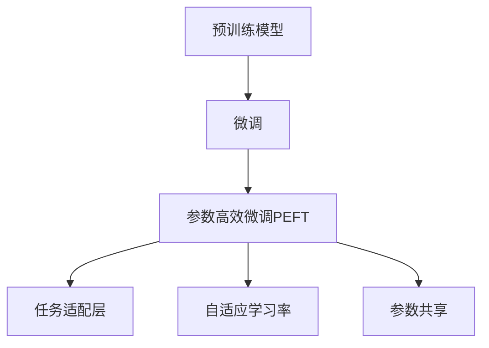

                 

# PEFT：性能和效率的平衡

## 1. 背景介绍

### 1.1 问题由来

在深度学习领域，尤其是自然语言处理(NLP)和计算机视觉(CV)等应用中，大规模预训练模型的出现极大地提升了模型性能。然而，这些模型通常需要大量的计算资源和数据，且在微调时，通常需要更新全部或部分预训练参数，这在计算资源有限的情况下往往是不切实际的。为解决这一问题，一种新型的微调方法应运而生——参数高效微调（Parameter-Efficient Fine-Tuning, PEFT）。PEFT在微调过程中只更新模型的一部分参数，从而在保持高性能的同时，显著降低了计算资源的消耗，成为近年来深度学习研究的热点。

### 1.2 问题核心关键点

PEFT的核心思想是利用预训练模型的知识，通过更新部分参数来适应特定任务。PEFT方法适用于计算资源有限、数据量不足的情况下，通过限制参数更新，提升微调模型的性能和效率。

PEFT的关键在于以下方面：
- **参数更新策略**：决定哪些参数被更新，哪些参数被固定。
- **更新幅度**：不同参数的更新幅度如何调整。
- **参数共享**：是否允许不同任务共享同一组预训练参数。

这些关键点的合理选择，决定了PEFT方法的性能和效率。

## 2. 核心概念与联系

### 2.1 核心概念概述

PEFT结合了预训练和微调的优势，在有限的计算资源下，利用预训练模型的知识，对特定任务进行微调。核心概念包括：

- **预训练模型**：通过大规模无监督学习，学习到通用的语言或图像表示。
- **微调**：在特定任务上，对预训练模型进行有监督学习，优化模型性能。
- **参数高效微调（PEFT）**：仅更新部分预训练参数，减少计算资源消耗，提升模型效率。
- **任务适配层**：根据具体任务，在预训练模型的顶层添加，进行任务的特定化。
- **自适应学习率**：根据参数更新策略，动态调整学习率，避免过拟合。
- **参数共享**：不同任务共享同一组预训练参数，提升模型迁移能力。

这些概念之间的关系通过以下Mermaid流程图展示：



### 2.2 核心概念原理和架构

#### 2.2.1 预训练模型

预训练模型通过在大规模无标签数据上进行自监督学习，学习到通用的语言或图像表示。例如，BERT模型通过掩码语言模型和下一句预测任务进行预训练，学习到词汇之间的关联关系。GPT模型通过自回归生成任务进行预训练，学习到语言生成的规则。

#### 2.2.2 微调

微调是在特定任务上，对预训练模型进行有监督学习，优化模型性能。例如，在命名实体识别任务中，可以通过标注的训练数据，对预训练模型进行微调，使其能够识别出文本中的实体。

#### 2.2.3 参数高效微调（PEFT）

PEFT仅更新部分预训练参数，减少计算资源消耗，提升模型效率。例如，通过冻结预训练模型的底层参数，只更新顶层参数，可以减少微调所需的计算资源。

#### 2.2.4 任务适配层

任务适配层根据具体任务，在预训练模型的顶层添加，进行任务的特定化。例如，在问答系统中，可以通过在预训练模型的顶层添加全连接层，将文本输入转换为答案预测输出。

#### 2.2.5 自适应学习率

自适应学习率根据参数更新策略，动态调整学习率，避免过拟合。例如，通过将学习率在训练初期设置较大，随着训练进行逐步减小，可以避免模型在训练初期过拟合。

#### 2.2.6 参数共享

参数共享允许不同任务共享同一组预训练参数，提升模型迁移能力。例如，在多任务学习中，通过共享预训练模型的参数，可以提升模型在不同任务上的表现。

## 3. 核心算法原理 & 具体操作步骤

### 3.1 算法原理概述

PEFT的算法原理是将预训练模型作为基础，通过更新部分参数来适应特定任务。其核心思想是：

1. **冻结预训练参数**：将预训练模型的底层参数固定，只更新顶层参数。
2. **任务适配层**：根据任务类型，在预训练模型的顶层添加任务适配层。
3. **自适应学习率**：根据任务复杂度和数据量，动态调整学习率。
4. **参数共享**：允许不同任务共享同一组预训练参数。

PEFT的算法流程可以概括为：

1. 准备预训练模型和数据集。
2. 添加任务适配层。
3. 设置微调超参数。
4. 执行梯度训练。
5. 测试和部署。

### 3.2 算法步骤详解

#### 3.2.1 准备预训练模型和数据集

1. **选择预训练模型**：如BERT、GPT等。
2. **准备标注数据集**：根据任务类型，收集和标注数据集。
3. **数据预处理**：将数据集进行分批次处理，转换为模型可以接受的格式。

#### 3.2.2 添加任务适配层

1. **设计输出层**：根据任务类型，设计适合任务的输出层。
2. **选择损失函数**：选择适合任务的损失函数。

#### 3.2.3 设置微调超参数

1. **选择优化器**：如AdamW、SGD等。
2. **设置学习率**：根据任务复杂度和数据量，动态调整学习率。
3. **设置正则化技术**：如L2正则、Dropout等。

#### 3.2.4 执行梯度训练

1. **前向传播**：将数据集输入模型，计算损失函数。
2. **反向传播**：计算梯度，更新模型参数。
3. **迭代更新**：重复前向和反向传播，直到模型收敛。

#### 3.2.5 测试和部署

1. **在测试集上评估模型**：评估模型在测试集上的性能。
2. **部署模型**：将模型集成到实际应用系统中，进行推理预测。

### 3.3 算法优缺点

#### 3.3.1 优点

1. **计算资源节省**：仅更新部分参数，减少计算资源消耗。
2. **泛化能力强**：利用预训练模型的知识，提升模型泛化能力。
3. **迁移能力强**：不同任务共享同一组预训练参数，提升模型迁移能力。
4. **性能高效**：通过自适应学习率和任务适配层，提升模型性能。

#### 3.3.2 缺点

1. **模型复杂度较高**：需要设计任务适配层和自适应学习率，增加了模型复杂度。
2. **数据需求较高**：虽然PEFT减少了计算资源消耗，但对标注数据的需求仍然较高。
3. **参数更新策略较复杂**：需要根据具体任务选择合适的参数更新策略。

### 3.4 算法应用领域

PEFT广泛应用于各种NLP和CV任务中，如文本分类、命名实体识别、机器翻译、图像分类、目标检测等。具体应用包括：

- **文本分类**：通过微调BERT模型，将文本输入转换为类别预测输出。
- **命名实体识别**：通过微调BERT模型，识别文本中的实体。
- **机器翻译**：通过微调Transformer模型，将源语言文本翻译成目标语言。
- **图像分类**：通过微调ResNet模型，将图像输入转换为类别预测输出。
- **目标检测**：通过微调YOLO模型，将图像输入转换为边界框和类别预测输出。

## 4. 数学模型和公式 & 详细讲解 & 举例说明

### 4.1 数学模型构建

PEFT的数学模型可以表示为：

$$
\mathcal{L}(\theta) = \mathcal{L}(\theta_0, \theta_1, \dots, \theta_n)
$$

其中 $\theta_i$ 表示模型的第 $i$ 层参数，$\theta_0$ 为预训练模型的参数，$\theta_1, \dots, \theta_n$ 为微调过程中更新参数。

### 4.2 公式推导过程

PEFT的损失函数可以表示为：

$$
\mathcal{L}(\theta) = \sum_{i=1}^N \ell_i(M_{\theta}(x_i), y_i)
$$

其中 $x_i$ 为输入数据，$y_i$ 为标签，$\ell_i$ 为损失函数，$M_{\theta}$ 为模型。

在训练过程中，使用梯度下降算法更新模型参数：

$$
\theta \leftarrow \theta - \eta \nabla_{\theta} \mathcal{L}(\theta)
$$

其中 $\eta$ 为学习率，$\nabla_{\theta} \mathcal{L}(\theta)$ 为损失函数对模型参数的梯度。

### 4.3 案例分析与讲解

以命名实体识别为例，分析PEFT的实现过程。

1. **准备数据集**：收集标注的实体识别数据集。
2. **选择预训练模型**：选择BERT模型作为预训练模型。
3. **添加任务适配层**：在BERT模型的顶层添加全连接层，输出实体标签。
4. **设置微调超参数**：设置学习率、正则化系数等。
5. **执行梯度训练**：将数据集输入模型，计算损失函数，反向传播更新模型参数。
6. **测试和部署**：在测试集上评估模型性能，部署模型进行推理预测。

## 5. 项目实践：代码实例和详细解释说明

### 5.1 开发环境搭建

PEFT的应用需要搭建相应的开发环境，包括：

1. **安装Python**：选择合适版本的Python，安装pip、conda等工具。
2. **安装TensorFlow或PyTorch**：选择合适版本的TensorFlow或PyTorch，安装相关依赖。
3. **安装相关库**：安装TensorFlow或PyTorch等深度学习框架的相关库，如Keras、Tensorboard等。

### 5.2 源代码详细实现

以使用BERT模型进行命名实体识别为例，给出PEFT的代码实现。

```python
import tensorflow as tf
import keras as K
import numpy as np
from transformers import BertTokenizer, BertForTokenClassification

# 准备数据集
tokenizer = BertTokenizer.from_pretrained('bert-base-cased')
train_data = ...
dev_data = ...
test_data = ...

# 选择预训练模型
model = BertForTokenClassification.from_pretrained('bert-base-cased', num_labels=10)

# 添加任务适配层
model.add(K.layers.Dense(10, activation='softmax'))

# 设置微调超参数
optimizer = tf.keras.optimizers.Adam(learning_rate=2e-5)
model.compile(optimizer=optimizer, loss='categorical_crossentropy', metrics=['accuracy'])

# 执行梯度训练
model.fit(train_data, epochs=5, validation_data=dev_data)

# 测试和部署
test_loss, test_acc = model.evaluate(test_data)
print(f"Test Loss: {test_loss}, Test Acc: {test_acc}")

# 部署模型
model.save_weights('ner_model.h5')
```

### 5.3 代码解读与分析

1. **数据准备**：使用BertTokenizer对数据集进行分词和编码，转换为模型可以接受的格式。
2. **模型选择**：选择预训练的BERT模型，并根据任务类型添加任务适配层。
3. **微调超参数**：设置学习率、优化器等超参数。
4. **梯度训练**：使用Keras框架进行模型训练，使用Adam优化器进行参数更新。
5. **测试和部署**：在测试集上评估模型性能，保存模型参数，进行推理预测。

### 5.4 运行结果展示

运行上述代码，可以得到模型在命名实体识别任务上的测试损失和准确率。

## 6. 实际应用场景

### 6.1 智能客服系统

智能客服系统需要实时响应客户咨询，处理大量的请求。PEFT可以用于微调预训练模型，使其能够根据客户的输入，快速生成响应。例如，通过微调BERT模型，使得模型能够理解和生成客户咨询内容，并自动匹配最佳回答。

### 6.2 金融舆情监测

金融领域需要实时监测市场舆论动向，预测市场变化。PEFT可以用于微调预训练模型，使其能够自动识别和分类金融新闻、评论等文本数据，判断市场趋势。例如，通过微调BERT模型，使模型能够自动分析新闻和评论中的情感倾向，预测市场变化。

### 6.3 个性化推荐系统

个性化推荐系统需要根据用户的历史行为，推荐相关的物品。PEFT可以用于微调预训练模型，使其能够从文本描述中提取用户兴趣，并推荐相关的物品。例如，通过微调BERT模型，使模型能够从物品描述中提取用户兴趣，推荐相似的物品。

### 6.4 未来应用展望

PEFT在未来的应用中，将继续拓展其应用领域，提升模型的性能和效率。未来可能的应用包括：

1. **多任务学习**：PEFT可以应用于多任务学习，提升模型在不同任务上的表现。
2. **跨领域迁移学习**：PEFT可以应用于跨领域迁移学习，提升模型在不同领域的泛化能力。
3. **自适应学习率**：PEFT可以结合自适应学习率，提升模型的训练效率和性能。
4. **零样本学习和少样本学习**：PEFT可以应用于零样本学习和少样本学习，提升模型的迁移能力和泛化能力。

## 7. 工具和资源推荐

### 7.1 学习资源推荐

为了帮助开发者系统掌握PEFT的理论基础和实践技巧，这里推荐一些优质的学习资源：

1. **《Transformer从原理到实践》系列博文**：由大模型技术专家撰写，深入浅出地介绍了Transformer原理、BERT模型、PEFT技术等前沿话题。
2. **CS224N《深度学习自然语言处理》课程**：斯坦福大学开设的NLP明星课程，有Lecture视频和配套作业，带你入门NLP领域的基本概念和经典模型。
3. **《Natural Language Processing with Transformers》书籍**：Transformers库的作者所著，全面介绍了如何使用Transformers库进行NLP任务开发，包括PEFT在内的诸多范式。
4. **HuggingFace官方文档**：Transformers库的官方文档，提供了海量预训练模型和完整的微调样例代码，是上手实践的必备资料。
5. **CLUE开源项目**：中文语言理解测评基准，涵盖大量不同类型的中文NLP数据集，并提供了基于PEFT的baseline模型，助力中文NLP技术发展。

通过对这些资源的学习实践，相信你一定能够快速掌握PEFT的精髓，并用于解决实际的NLP问题。

### 7.2 开发工具推荐

PEFT的应用需要使用深度学习框架进行模型训练和推理。以下是几款用于PEFT开发的常用工具：

1. **TensorFlow**：由Google主导开发的开源深度学习框架，生产部署方便，适合大规模工程应用。
2. **PyTorch**：基于Python的开源深度学习框架，灵活动态的计算图，适合快速迭代研究。
3. **Keras**：基于TensorFlow和Theano的高级神经网络API，提供了简单易用的API，适合快速原型开发。
4. **Weights & Biases**：模型训练的实验跟踪工具，可以记录和可视化模型训练过程中的各项指标，方便对比和调优。
5. **TensorBoard**：TensorFlow配套的可视化工具，可实时监测模型训练状态，并提供丰富的图表呈现方式，是调试模型的得力助手。

合理利用这些工具，可以显著提升PEFT任务的开发效率，加快创新迭代的步伐。

### 7.3 相关论文推荐

PEFT技术的发展源于学界的持续研究。以下是几篇奠基性的相关论文，推荐阅读：

1. **Adapting Large Pre-trained Models for Biomedical Word Sense Disambiguation**：提出Adapter等参数高效微调方法，在不增加模型参数量的情况下，也能取得不错的微调效果。
2. **Dynamic Activation Propagation for Efficient Inference**：提出基于激活传播的参数高效微调方法，进一步提升了微调的效率。
3. **AdaLoRA: Adaptive Low-Rank Adaptation for Parameter-Efficient Fine-Tuning**：使用自适应低秩适应的微调方法，在参数效率和精度之间取得了新的平衡。
4. **Fine-Tuning Pre-trained Language Models with Depthwise Separable Convolution for NLP Tasks**：提出基于深度分离卷积的参数高效微调方法，适用于多任务学习。
5. **Compressing Deep Learning Models using Knowledge Distillation and Neural Architecture Search**：提出基于知识蒸馏和神经架构搜索的模型压缩方法，可以用于提升PEFT模型的效率。

这些论文代表了大语言模型PEFT发展脉络。通过学习这些前沿成果，可以帮助研究者把握学科前进方向，激发更多的创新灵感。

## 8. 总结：未来发展趋势与挑战

### 8.1 研究成果总结

PEFT技术在NLP和CV等领域的应用已经取得了显著的进展。其主要研究方向包括：

1. **参数高效微调方法**：如Adapter、Prefix等方法，在保持高性能的同时，减少计算资源消耗。
2. **自适应学习率**：根据任务复杂度和数据量，动态调整学习率，提升模型训练效率和性能。
3. **多任务学习和跨领域迁移学习**：PEFT可以应用于多任务学习和跨领域迁移学习，提升模型的泛化能力和迁移能力。
4. **零样本学习和少样本学习**：PEFT可以应用于零样本学习和少样本学习，提升模型的迁移能力和泛化能力。

### 8.2 未来发展趋势

PEFT的未来发展趋势包括：

1. **参数效率进一步提升**：未来将开发更加参数高效的微调方法，在固定大部分预训练参数的情况下，只更新极少量的任务相关参数。
2. **计算效率进一步提升**：未来将开发更加高效的计算图和推理算法，提高微调模型的计算效率。
3. **模型规模进一步增大**：未来预训练模型的参数量还将持续增长，PEFT技术需要适应更大规模的模型。
4. **多模态微调崛起**：未来PEFT技术将拓展到多模态数据微调，提升模型的综合应用能力。
5. **持续学习成为常态**：未来PEFT模型需要具备持续学习的能力，适应数据分布的变化。

### 8.3 面临的挑战

PEFT技术在发展过程中，仍面临以下挑战：

1. **计算资源瓶颈**：PEFT需要大量的计算资源进行微调，如何优化计算资源消耗是一个重要问题。
2. **模型复杂度较高**：PEFT模型设计复杂，如何简化模型结构，提升模型的泛化能力和迁移能力，是一个挑战。
3. **数据需求较高**：虽然PEFT减少了计算资源消耗，但对标注数据的需求仍然较高。

### 8.4 研究展望

未来PEFT技术的研究方向包括：

1. **优化参数更新策略**：研究更加高效的参数更新策略，提升微调模型的性能和效率。
2. **多任务学习和跨领域迁移学习**：研究多任务学习和跨领域迁移学习的PEFT方法，提升模型的泛化能力和迁移能力。
3. **自适应学习率**：研究更加高效的自适应学习率方法，提升模型训练效率和性能。
4. **零样本学习和少样本学习**：研究零样本学习和少样本学习的PEFT方法，提升模型的迁移能力和泛化能力。

## 9. 附录：常见问题与解答

**Q1：PEFT与传统微调方法相比，有哪些优势？**

A: PEFT相比传统微调方法，主要有以下优势：

1. **计算资源节省**：PEFT仅更新部分参数，减少计算资源消耗。
2. **泛化能力强**：PEFT利用预训练模型的知识，提升模型泛化能力。
3. **迁移能力强**：PEFT不同任务共享同一组预训练参数，提升模型迁移能力。

**Q2：PEFT在计算资源有限的情况下，如何选择参数更新策略？**

A: PEFT需要根据具体任务选择合适的参数更新策略，主要包括以下几种：

1. **冻结预训练参数**：将预训练模型的底层参数固定，只更新顶层参数。
2. **仅更新顶层参数**：仅更新顶层参数，不更新底层参数。
3. **仅更新部分参数**：只更新部分参数，如Adapter、Prefix等方法。

**Q3：PEFT在落地部署时需要注意哪些问题？**

A: PEFT在落地部署时需要注意以下问题：

1. **模型裁剪**：去除不必要的层和参数，减小模型尺寸，加快推理速度。
2. **量化加速**：将浮点模型转为定点模型，压缩存储空间，提高计算效率。
3. **服务化封装**：将模型封装为标准化服务接口，便于集成调用。
4. **弹性伸缩**：根据请求流量动态调整资源配置，平衡服务质量和成本。
5. **监控告警**：实时采集系统指标，设置异常告警阈值，确保服务稳定性。
6. **安全防护**：采用访问鉴权、数据脱敏等措施，保障数据和模型安全。

通过以上问题解答，相信你能够更深入地理解PEFT技术，并将其应用于实际的NLP问题中。

---

作者：禅与计算机程序设计艺术 / Zen and the Art of Computer Programming

