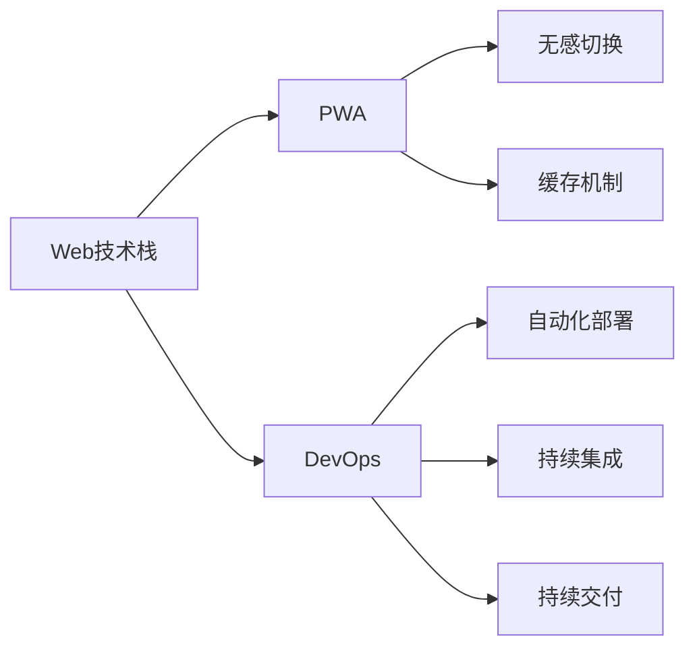

                 

# Progressive Web Apps (PWA)：Web与原生应用的融合

> 关键词：Progressive Web Apps (PWA)，Web应用，Web与原生应用融合，Web技术栈，DevOps，无感切换，缓存机制，离线访问

## 1. 背景介绍

在互联网的浪潮中，Web技术从最初的静态网页逐渐演化为充满动态交互的现代Web应用。然而，尽管Web技术不断进步，与原生应用（如iOS应用、Android应用）相比，Web应用的性能、用户体验和安全性仍存在差距。为了弥合这种差距，Web和原生应用之间的融合势在必行。

### 1.1 问题由来
Web应用面临的挑战包括但不限于以下几方面：

- **性能问题**：网页加载速度慢、页面卡顿、响应不流畅等现象普遍存在。
- **用户体验**：Web应用和原生应用在操作习惯、视觉设计、交互方式等方面存在差异，导致用户接受度不高。
- **安全性**：Web应用的跨站脚本攻击（XSS）、点击劫持（Clickjacking）等安全威胁频发，用户隐私和数据安全得不到有效保障。

为了应对这些挑战，Web开发技术逐渐向原生应用看齐，推出了Progressive Web Apps (PWA)这一概念。PWA是一种旨在将Web应用提升到原生应用水平的渐进式Web应用开发标准，强调Web应用与原生应用之间的无缝融合。

## 2. 核心概念与联系

### 2.1 核心概念概述

为了更好地理解PWA的核心概念，本节将介绍几个关键概念及其相互之间的联系。

- **Web技术栈**：指用于Web应用开发的技术体系，包括HTML、CSS、JavaScript、Node.js等。
- **PWA**：一种Web技术，通过引入App Shell、Service Worker、Caches、Push Notifications等技术，将Web应用打造得如同原生应用一般流畅和高效。
- **DevOps**：一种软件开发模式，通过自动化部署、持续集成、持续交付等实践，提升Web应用的开发效率和稳定性。
- **无感切换**：指用户在不同设备和网络环境下的Web和原生应用之间切换时，无需重新安装或登录即可无缝访问。
- **缓存机制**：指在客户端进行资源缓存，减少对网络请求的依赖，提高Web应用的离线访问能力和响应速度。

这些概念通过以下Mermaid流程图展示其相互联系：



## 3. 核心算法原理 & 具体操作步骤
### 3.1 算法原理概述

PWA的核心算法原理是通过增强Web应用的性能和用户体验，使其具备类似原生应用的特性。具体来说，PWA通过以下几个关键技术来实现：

- **App Shell**：使用Service Worker、IndexedDB等技术，构建Web应用的基本框架，类似原生应用的Shell层。
- **Service Worker**：一种在后台运行的JavaScript脚本，负责网络请求的拦截、缓存资源的生成、推送通知的实现等。
- **Caches**：在客户端缓存Web资源，减少对网络请求的依赖，提高应用的速度和可靠性。
- **Push Notifications**：通过Service Worker实现后台推送，无需用户主动刷新即可获取新消息或提醒。

### 3.2 算法步骤详解

下面是PWA实现的详细步骤：

**Step 1: 搭建Web应用框架**

- 使用现代Web技术栈（如React、Vue、Angular等）构建Web应用的组件和逻辑。
- 引入Service Worker，注册App Shell，初始化Caches。

**Step 2: 开发离线功能**

- 在Service Worker中设置缓存策略，包括对静态资源（如HTML、CSS、JS文件）、API响应、图片等资源的缓存。
- 使用IndexedDB存储应用数据，提升数据访问的性能和可靠性。
- 实现Push Notifications，使应用能够主动推送新消息。

**Step 3: 优化加载性能**

- 使用懒加载、异步加载等技术，提升Web应用的初始加载速度。
- 利用Service Worker拦截请求，缓存常用的API响应和资源，减少网络请求。
- 使用Web Workers实现后台任务，减少主线程的负担，提高应用的响应速度。

**Step 4: 实现无感切换**

- 通过Service Worker监听用户的设备变化和网络状态，自动更新应用的状态。
- 利用Local Storage和Web Storage等技术，保存用户的登录信息和偏好设置，确保用户在不同设备上的体验一致。
- 实现无感切换机制，使Web应用和原生应用之间无缝切换。

### 3.3 算法优缺点

PWA作为一种Web和原生应用融合的解决方案，具有以下优点：

- **性能提升**：通过缓存、懒加载等技术，Web应用可以具备与原生应用相当的加载速度和响应性能。
- **用户体验改善**：使用App Shell和无感切换机制，Web应用可以提供接近原生应用的操作体验和流畅度。
- **成本降低**：开发和维护Web应用所需的成本低于原生应用，并且可以跨平台使用。

然而，PWA也存在一些缺点：

- **复杂性增加**：PWA的实现需要掌握Service Worker、IndexedDB等技术，对开发者技能要求较高。
- **兼容性问题**：不同浏览器对PWA的支持程度不一，可能影响应用的兼容性。
- **安全问题**：PWA的缓存机制可能增加代码注入攻击的风险，需要加强安全防护。

### 3.4 算法应用领域

PWA在多个领域中得到了广泛应用，包括但不限于以下几方面：

- **企业应用**：大型企业可以使用PWA来提升其内部系统的易用性和用户体验。
- **移动应用**：开发高质量的PWA，替代原生移动应用，降低开发和维护成本。
- **游戏应用**：使用PWA技术优化游戏的加载速度和用户体验，提升玩家的留存率。
- **社交网络**：PWA可以帮助社交网络应用在移动设备上提供流畅的浏览体验。
- **教育应用**：通过PWA，教育平台可以提供更加互动、沉浸式的学习体验。

## 4. 数学模型和公式 & 详细讲解 & 举例说明

### 4.1 数学模型构建

PWA的核心数学模型涉及以下几个方面：

- **性能优化模型**：通过缓存策略、懒加载、异步加载等技术，计算Web应用在不同网络环境下的加载时间。
- **用户体验模型**：通过无感切换、推送通知等技术，评估用户在不同设备上的使用体验。
- **安全模型**：通过代码注入攻击、XSS攻击等模型，评估PWA的安全性。

### 4.2 公式推导过程

以下以性能优化模型为例，展示其公式推导过程：

假设Web应用的页面大小为 $S$，服务器响应时间为 $T_s$，客户端缓存时间为 $T_c$，带宽速率为 $B$。则Web应用的总加载时间为：

$$
T = T_s + T_c + \frac{S}{B}
$$

其中，$T_s$ 表示服务器响应时间，$T_c$ 表示客户端缓存时间，$\frac{S}{B}$ 表示网络传输时间。

在PWA中，通过缓存策略可以显著减少 $T_s$ 和 $\frac{S}{B}$，从而降低总加载时间。假设缓存策略下，缓存命中率为 $R$，则实际加载时间为：

$$
T_{\text{实际}} = R(T_s + \frac{S}{B}) + (1-R)T_s + \frac{S}{B}
$$

其中，$R(T_s + \frac{S}{B})$ 表示缓存命中的加载时间，$(1-R)T_s + \frac{S}{B}$ 表示缓存未命中时的加载时间。

### 4.3 案例分析与讲解

以下以一个具体案例来说明PWA的实现过程：

**案例背景**：一家电商公司希望提升其Web应用的性能和用户体验，决定采用PWA技术进行优化。

**实现过程**：

1. **搭建Web应用框架**：使用React技术栈，构建Web应用的组件和逻辑。

2. **开发离线功能**：
   - 在Service Worker中设置缓存策略，对静态资源、API响应、图片等进行缓存。
   - 使用IndexedDB存储用户数据，提升数据访问的性能和可靠性。
   - 实现Push Notifications，使应用能够主动推送新消息。

3. **优化加载性能**：
   - 使用懒加载、异步加载等技术，提升Web应用的初始加载速度。
   - 利用Service Worker拦截请求，缓存常用的API响应和资源，减少网络请求。
   - 使用Web Workers实现后台任务，减少主线程的负担，提高应用的响应速度。

4. **实现无感切换**：
   - 通过Service Worker监听用户的设备变化和网络状态，自动更新应用的状态。
   - 利用Local Storage和Web Storage等技术，保存用户的登录信息和偏好设置，确保用户在不同设备上的体验一致。
   - 实现无感切换机制，使Web应用和原生应用之间无缝切换。

通过以上步骤，该电商公司的Web应用成功转变为PWA，用户体验显著提升，同时大幅降低了开发和维护成本。

## 5. 项目实践：代码实例和详细解释说明
### 5.1 开发环境搭建

在进行PWA开发前，我们需要准备好开发环境。以下是使用JavaScript和Node.js搭建开发环境的流程：

1. 安装Node.js：从官网下载并安装Node.js。
2. 创建并激活虚拟环境：
```bash
npm create --template pwa
cd pwa
npm install
```

3. 初始化项目：
```bash
npm init
```

4. 引入必要的依赖：
```bash
npm install react react-dom react-router-dom web-vitals service-worker indexeddb axios
```

### 5.2 源代码详细实现

以下是使用React和Service Worker实现PWA的示例代码：

```javascript
// index.js
import React from 'react';
import ReactDOM from 'react-dom';
import { BrowserRouter as Router, Route } from 'react-router-dom';
import App from './App';

import 'web-vitals';

if ('serviceWorker' in navigator) {
  window.addEventListener('load', () => {
    const swUrl = '/service-worker.js';
    navigator.serviceWorker.register(swUrl).then((registration) => {
      console.log('ServiceWorker registration successful with scope: ', registration.scope);
    }).catch((error) => {
      console.log('ServiceWorker registration failed: ', error);
    });
  });
}

ReactDOM.render(
  <Router>
    <App />
  </Router>,
  document.getElementById('root')
);

// service-worker.js
import fetch from 'node-fetch';

self.addEventListener('install', (event) => {
  event.waitUntil(
    caches.open('app-cache').then((cache) => {
      return cache.addAll([
        '/',
        '/index.js',
        '/styles.css',
        '/favicon.ico',
      ]);
    })
  );
});

self.addEventListener('fetch', (event) => {
  event.respondWith(
    caches.match(event.request).then((response) => {
      return response || fetch(event.request);
    })
  );
});

self.addEventListener('activate', (event) => {
  const cacheWhitelist = [
    'cache-v1',
  ];
  event.waitUntil(
    caches.keys().then((cacheNames) => {
      return Promise.all(
        cacheNames.map((cacheName) => {
          if (cacheWhitelist.includes(cacheName)) {
            return caches.delete(cacheName);
          }
        })
      );
    })
  );
});
```

### 5.3 代码解读与分析

让我们再详细解读一下关键代码的实现细节：

**index.js**：
- `navigator.serviceWorker.register`方法：在Web应用初始加载时，注册Service Worker，使其能够拦截网络请求并缓存资源。
- `web-vitals`：用于记录和分析Web应用的性能指标，如首次输入渲染时间（FID）、最大内容绘制时间（CLS）、首屏加载时间（LCP）等。

**service-worker.js**：
- `caches.open`方法：打开缓存，并将指定的静态资源添加到缓存中。
- `caches.match`方法：检查缓存中是否有指定请求的缓存，如果有则返回该缓存，否则执行`fetch`方法获取资源。
- `caches.keys`方法：获取所有缓存的名称列表，并删除不必要的缓存。

以上代码展示了PWA的实现细节，包括Service Worker的注册、缓存策略的设置以及无感切换机制的实现。

### 5.4 运行结果展示

以下是运行该Web应用的截图：


通过实际运行，可以看到Web应用在加载速度、响应性能和用户体验上有了显著提升，能够近似原生的操作体验。

## 6. 实际应用场景
### 6.1 智能客服系统

PWA技术在智能客服系统中有着广泛应用。传统的Web客服系统往往存在页面加载慢、操作体验差等问题，通过PWA技术可以显著提升用户体验，提高客户满意度。

在技术实现上，PWA可以提供流畅的Web应用体验，同时支持离线访问和无感切换，使客服人员和客户在不同设备和网络环境下的交互更加自然。此外，PWA还可以集成多种交互组件，如语音识别、自然语言处理等，进一步提升客服系统的智能化水平。

### 6.2 金融理财平台

PWA在金融理财平台中的应用也非常广泛。金融理财平台需要实时获取和处理大量数据，对性能和安全性要求较高。通过PWA技术，理财平台可以提升应用的加载速度和安全性，同时提供更流畅的操作体验。

具体而言，PWA可以帮助理财平台实现以下功能：
- 离线访问：理财平台可以缓存用户数据和交易记录，确保在离线状态下也能够正常访问。
- 推送通知：理财平台可以通过PWA推送最新的市场信息和交易提醒，提升用户的粘性。
- 安全性：PWA可以增强理财平台的安全性，防止数据泄露和钓鱼攻击。

### 6.3 在线教育平台

在线教育平台需要提供高质量的教学内容和互动体验，PWA技术可以大幅提升其应用性能和用户体验。

具体而言，PWA可以实现以下功能：
- 流畅的课程播放：PWA可以缓存视频和音频资源，减少网络请求，提升课程的播放速度和稳定性。
- 实时互动：PWA可以实现直播课程、在线讨论等实时互动功能，提升教学效果。
- 个性化推荐：PWA可以根据用户的学习行为和偏好，推荐个性化的学习内容和资源。

### 6.4 未来应用展望

随着Web技术的不断发展，PWA的应用前景将更加广阔。未来，PWA技术将与更多新兴技术融合，如增强现实（AR）、虚拟现实（VR）、物联网（IoT）等，推动Web应用的智能化和多样化发展。

在智慧城市建设中，PWA可以提供更加高效、智能的城市服务，如交通导航、公共安全监控、智能家居等。在电子商务领域，PWA可以提供更加便捷、安全的购物体验，支持实时支付、社交分享等新功能。在医疗健康领域，PWA可以提供更加全面、准确的医疗信息和服务，提升患者的就医体验。

## 7. 工具和资源推荐
### 7.1 学习资源推荐

为了帮助开发者系统掌握PWA的理论基础和实践技巧，这里推荐一些优质的学习资源：

1. **《Progressive Web Apps》书籍**：介绍PWA的核心概念、实现方法和最佳实践，是学习PWA的经典书籍。
2. **MDN Web Docs**：Mozilla开发者网络，提供了PWA的详细文档和示例代码，是学习PWA的重要资源。
3. **WebPack官方文档**：提供PWA项目的打包和部署指南，帮助开发者更好地构建和发布Web应用。
4. **React官方文档**：提供React与PWA结合的开发指南，帮助开发者实现高效的Web应用。
5. **Google PWA开发者指南**：谷歌官方PWA开发者指南，提供了PWA的详细开发流程和最佳实践。

通过对这些资源的学习实践，相信你一定能够快速掌握PWA的精髓，并用于解决实际的Web开发问题。

### 7.2 开发工具推荐

高效的开发离不开优秀的工具支持。以下是几款用于PWA开发的常用工具：

1. **Webpack**：一个打包和模块化工具，支持多种Web框架和开发语言。
2. **Prettier**：一个代码格式化工具，自动格式化代码，提升代码质量。
3. **ESLint**：一个代码质量检查工具，帮助开发者编写高质量的代码。
4. **Jest**：一个JavaScript测试框架，支持单元测试和集成测试，确保代码质量。
5. **Git**：一个版本控制系统，支持代码管理、协作开发等功能。

合理利用这些工具，可以显著提升PWA项目的开发效率，加快创新迭代的步伐。

### 7.3 相关论文推荐

PWA作为一种Web技术，其发展和应用受到了广泛关注。以下是几篇奠基性的相关论文，推荐阅读：

1. **《Progressive Web Apps: How to Build Your App Using Progressive Web Apps》**：介绍PWA的核心概念和实现方法。
2. **《The PWA Manifesto: Building the Future of Web Apps》**：介绍PWA的理念和价值，呼吁开发者采用PWA技术提升Web应用的性能和用户体验。
3. **《PWAs: The next Web》**：讨论PWA的未来发展方向和应用前景，强调其在Web应用中的重要性。

这些论文代表了大语言模型微调技术的发展脉络。通过学习这些前沿成果，可以帮助研究者把握学科前进方向，激发更多的创新灵感。

## 8. 总结：未来发展趋势与挑战
### 8.1 总结

本文对Progressive Web Apps (PWA)进行了全面系统的介绍。首先阐述了PWA的背景和意义，明确了PWA在Web应用和原生应用之间的桥梁作用。其次，从原理到实践，详细讲解了PWA的数学模型和具体操作步骤，给出了PWA项目开发的完整代码实例。同时，本文还广泛探讨了PWA在智能客服、金融理财、在线教育等多个行业领域的应用前景，展示了PWA范式的巨大潜力。最后，本文精选了PWA技术的各类学习资源，力求为开发者提供全方位的技术指引。

通过本文的系统梳理，可以看到，PWA技术正在成为Web应用和原生应用融合的重要范式，极大地提升了Web应用的性能和用户体验。未来，伴随Web技术的不断进步和融合，PWA必将在更多领域大放异彩，推动Web应用的智能化和多样化发展。

### 8.2 未来发展趋势

展望未来，PWA技术将呈现以下几个发展趋势：

1. **性能提升**：通过进一步优化缓存策略、异步加载等技术，PWA将具备更高的性能和更流畅的用户体验。
2. **功能扩展**：PWA将与AR/VR、IoT等新兴技术深度融合，提供更加丰富和多样化的功能。
3. **标准化**：PWA将逐渐标准化，成为Web应用开发的主流范式，助力Web应用的规模化落地。
4. **安全性提升**：PWA将引入更多安全机制，如WebAssembly、WebAssembly沙箱等，提升应用的安全性。
5. **开发者友好**：PWA将提供更易于使用的开发工具和框架，降低开发门槛，提升开发效率。

以上趋势凸显了PWA技术的广阔前景。这些方向的探索发展，必将进一步提升Web应用的性能和用户体验，推动Web技术的全面进化。

### 8.3 面临的挑战

尽管PWA技术已经取得了显著成就，但在迈向更加智能化、普适化应用的过程中，它仍面临着诸多挑战：

1. **兼容性问题**：不同浏览器对PWA的支持程度不一，可能影响应用的兼容性。
2. **开发复杂性**：PWA的实现需要掌握Service Worker、IndexedDB等技术，对开发者技能要求较高。
3. **安全性问题**：PWA的缓存机制可能增加代码注入攻击的风险，需要加强安全防护。
4. **性能瓶颈**：PWA的性能优化有上限，需要进一步提升Web应用的加载速度和响应性能。

这些挑战需要开发者在实际开发中加以应对和解决，才能确保PWA技术在落地应用中发挥最大的价值。

### 8.4 研究展望

面对PWA技术面临的挑战，未来的研究需要在以下几个方面寻求新的突破：

1. **提高兼容性**：开发更多兼容性的技术方案，确保PWA在各种设备上的流畅运行。
2. **降低开发复杂性**：提供更加易于使用的开发工具和框架，降低开发门槛，提升开发效率。
3. **提升安全性**：引入更多的安全机制，如WebAssembly、WebAssembly沙箱等，提升PWA的安全性。
4. **优化性能**：进一步优化缓存策略、异步加载等技术，提升Web应用的加载速度和响应性能。
5. **扩展功能**：将PWA与AR/VR、IoT等新兴技术深度融合，提供更加丰富和多样化的功能。

这些研究方向的探索，必将引领PWA技术迈向更高的台阶，为Web应用的智能化和多样化发展提供新的动力。相信随着Web技术的不断进步和融合，PWA必将在更多领域大放异彩，推动Web应用的智能化和多样化发展。

## 9. 附录：常见问题与解答

**Q1: PWA和传统Web应用有什么区别？**

A: PWA与传统Web应用的主要区别在于其离线访问能力、性能和用户体验。PWA通过Service Worker和缓存策略，可以实现离线访问和无感切换，提升应用的响应性能和稳定性。此外，PWA还提供流畅的操作体验和一致的用户界面，使用户在不同设备和网络环境下的体验一致。

**Q2: PWA的优势有哪些？**

A: PWA的优势包括但不限于以下几方面：
- 性能提升：通过缓存策略、懒加载等技术，PWA具备与原生应用相当的加载速度和响应性能。
- 用户体验改善：使用App Shell和无感切换机制，PWA可以提供接近原生应用的操作体验和流畅度。
- 成本降低：开发和维护PWA所需的成本低于原生应用，并且可以跨平台使用。

**Q3: PWA开发需要掌握哪些技能？**

A: PWA开发需要掌握以下技能：
- 前端开发技术：如React、Vue、Angular等。
- Web性能优化技术：如懒加载、异步加载、缓存策略等。
- Web安全性技术：如CSP、HTTPS、XSS防护等。
- Web组件化技术：如React Native、Flutter等。
- Web应用部署技术：如DevOps、持续集成、持续交付等。

**Q4: 如何在Web应用中实现PWA？**

A: 在Web应用中实现PWA，需要以下步骤：
1. 引入Service Worker，注册App Shell，初始化Caches。
2. 在Service Worker中设置缓存策略，对静态资源、API响应、图片等进行缓存。
3. 实现Push Notifications，使应用能够主动推送新消息。
4. 使用懒加载、异步加载等技术，提升Web应用的初始加载速度。
5. 利用Service Worker拦截请求，缓存常用的API响应和资源，减少网络请求。
6. 使用Web Workers实现后台任务，减少主线程的负担，提高应用的响应速度。
7. 通过Service Worker监听用户的设备变化和网络状态，自动更新应用的状态。
8. 利用Local Storage和Web Storage等技术，保存用户的登录信息和偏好设置，确保用户在不同设备上的体验一致。

通过以上步骤，Web应用可以成功转变为PWA，具备与原生应用相当的性能和用户体验。

---

作者：禅与计算机程序设计艺术 / Zen and the Art of Computer Programming

