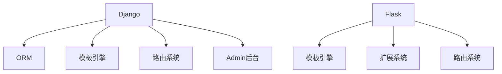

                 

## 1. 背景介绍

### 1.1 问题由来

随着互联网的发展，Web应用程序的需求日益增长，传统的Web开发模式已经无法满足现代应用的需要。为了提高开发效率和程序性能，Web框架应运而生。Python Web框架主要有Django和Flask两大类，它们不仅提供了强大的开发工具和模板引擎，还支持快速迭代和扩展。

### 1.2 问题核心关键点

Django和Flask之所以受到广泛关注，在于它们在以下几个方面具有优势：

- 高效：在处理Web请求时，两者均支持异步I/O，提高了Web应用的处理速度和响应效率。
- 易用：Django提供了强大的ORM和管理员后台，简化了数据库操作和页面设计。Flask则提供了清晰明了的API和路由系统，易于上手。
- 扩展性强：Django的插件系统（即Django Applications）可以方便地扩展和定制功能。Flask则灵活使用扩展包，满足不同应用的需求。
- 生态丰富：Django拥有庞大的社区和丰富的第三方插件，可以方便地进行二次开发。Flask则以轻量级著称，提供了简单易用的框架结构，便于开发者构建高效、稳定的应用。

## 2. 核心概念与联系

### 2.1 核心概念概述

为了更好地理解Django和Flask，首先介绍几个核心概念：

- Django：Python中最流行的Web框架之一，支持快速开发、快速迭代，并提供了强大的ORM和管理员后台。Django的开发重点在于提供丰富的功能，使得开发者可以专注于业务逻辑的实现。
- Flask：一个微型的Web框架，适合小型项目和快速原型开发。Flask的核心理念是“最少量即是最好”，强调简单、清晰的API和自由度高的扩展能力。
- ORM：对象关系映射技术，将数据库表映射为Python对象，简化了数据库操作。Django自带的ORM非常强大，支持多种数据库，易于使用。Flask则支持多种ORM，如SQLAlchemy等，需要开发者自行选择。
- 模板引擎：用于渲染Web页面，将数据动态插入到HTML模板中。Django自带模板引擎，支持各种标签和过滤器。Flask则支持Jinja2等模板引擎，灵活性更高。
- 路由系统：用于映射URL请求到具体处理函数。Django的路由系统非常完善，支持多种路由配置方式。Flask则使用简单的装饰器来实现路由功能，更加灵活。

这些概念之间的联系可以通过以下Mermaid流程图来展示：



这个流程图展示了大框架和小框架在核心功能上的区别与联系。

## 3. 核心算法原理 & 具体操作步骤
### 3.1 算法原理概述

Django和Flask的核心算法原理都基于MVC（Model-View-Controller）模式。在处理Web请求时，框架首先根据路由系统将请求映射到具体处理函数，然后调用ORM层进行数据库操作，最后通过模板引擎渲染数据并返回HTML页面。

### 3.2 算法步骤详解

#### 3.2.1 Django步骤详解

1. **安装和配置**：使用pip安装Django，并创建Django项目。设置项目的名称、数据库信息等，并初始化数据库。

2. **设计模型**：在Django中，模型是ORM中的数据表。设计模型时，需要继承`models.Model`类，并定义好字段、关系等。

3. **创建视图**：视图是处理函数，负责接收HTTP请求并返回HTTP响应。可以使用`views`模块中的装饰器来创建视图。

4. **配置路由**：将URL请求映射到具体视图，使用`urls.py`文件配置路由。

5. **编写模板**：使用Django模板引擎，将数据动态插入到HTML模板中。模板可以继承多个基础模板，以提高复用性。

6. **测试和部署**：使用Django内置的测试框架编写测试用例，确保应用稳定运行。部署应用时，可以采用Gunicorn、uWSGI等WSGI服务器，并使用Nginx等反向代理。

#### 3.2.2 Flask步骤详解

1. **安装和配置**：使用pip安装Flask，并创建Flask应用。设置应用的名称、调试模式等，并初始化应用。

2. **设计视图**：在Flask中，视图是处理函数，使用装饰器`@app.route`将函数映射到URL。

3. **配置路由**：将URL请求映射到具体函数，使用Flask内置的`Flask`类创建应用对象，并使用`add_url_rule`方法添加路由。

4. **编写模板**：使用Flask支持的Jinja2模板引擎，将数据动态插入到HTML模板中。模板可以继承多个基础模板。

5. **测试和部署**：使用Flask内置的测试框架编写测试用例，确保应用稳定运行。部署应用时，可以采用Gunicorn、uWSGI等WSGI服务器，并使用Nginx等反向代理。

### 3.3 算法优缺点

Django和Flask的优点和缺点如下：

#### Django的优点

- 高度集成的ORM：提供了强大的数据库操作功能，支持多种数据库，易于使用。
- 强大的管理后台：提供了可视化界面，方便管理和操作数据。
- 丰富的功能：提供了大量的中间件和插件，可以方便地扩展功能。

#### Django的缺点

- 学习曲线陡峭：框架功能丰富，学习成本较高。
- 性能开销较大：集成的功能较多，性能消耗较大。

#### Flask的优点

- 轻量级：框架功能简单，体积小，易于上手。
- 灵活性高：支持多种扩展包，易于满足不同应用的需求。
- 易于扩展：插件系统灵活，可以方便地扩展和定制功能。

#### Flask的缺点

- 功能相对较少：内置功能较少，需要开发者自行开发部分功能。
- 开发效率较低：相比于Django，Flask需要更多的自定义代码。

## 4. 数学模型和公式 & 详细讲解 & 举例说明

### 4.1 数学模型构建

Django和Flask的数学模型主要涉及路由映射和数据库操作。这里以Flask为例，介绍其数学模型的构建。

在Flask中，路由映射通过URL和处理函数的映射关系来实现。假设我们有一个简单的路由：

```python
from flask import Flask

app = Flask(__name__)

@app.route('/')
def index():
    return 'Hello, World!'
```

在这个例子中，URL`/`被映射到`index`函数。当用户访问`/`时，`index`函数将被调用，并返回`'Hello, World!'`。

### 4.2 公式推导过程

Flask的路由映射过程可以通过以下公式推导：

1. 将URL路径分解为不同的部分，例如`/path/to/resource`可以分解为`/path`, `/to`, `/resource`。
2. 使用正则表达式匹配URL路径，例如`/path/to/resource`可以匹配到`/path/to`和`/resource`。
3. 将匹配到的URL路径与预定义的路由规则进行匹配，例如`/path/to`可以被映射到`/user`。
4. 将URL路径映射到具体的处理函数，例如`/user`可以映射到`app.user`。
5. 调用处理函数并返回响应，例如`app.user()`可以返回`'Hello, World!'`。

### 4.3 案例分析与讲解

#### 4.3.1 数据库操作

在Flask中，可以使用SQLAlchemy ORM进行数据库操作。假设我们有一个简单的模型：

```python
from flask import Flask
from flask_sqlalchemy import SQLAlchemy

app = Flask(__name__)
app.config['SQLALCHEMY_DATABASE_URI'] = 'sqlite:///test.db'
db = SQLAlchemy(app)

class User(db.Model):
    id = db.Column(db.Integer, primary_key=True)
    name = db.Column(db.String(80))
    email = db.Column(db.String(120))
```

在这个例子中，我们定义了一个`User`模型，包含`id`、`name`和`email`三个字段。

#### 4.3.2 数据增删改查

在Flask中，可以使用SQLAlchemy的API进行数据增删改查。例如，向数据库中添加数据：

```python
user = User(name='John Doe', email='john@example.com')
db.session.add(user)
db.session.commit()
```

在这个例子中，我们创建了一个`User`对象，并将其添加到数据库中。

## 5. 项目实践：代码实例和详细解释说明
### 5.1 开发环境搭建

#### 5.1.1 Django开发环境搭建

1. **安装Python和pip**：在Linux或MacOS中，可以使用以下命令安装Python和pip：

   ```bash
   sudo apt-get install python3 python3-pip python3-dev libpq-dev
   ```

2. **安装Django**：使用pip安装Django：

   ```bash
   pip install django
   ```

3. **创建Django项目**：使用以下命令创建一个新的Django项目：

   ```bash
   django-admin startproject myproject
   cd myproject
   ```

4. **创建Django应用**：使用以下命令创建一个新的Django应用：

   ```bash
   python manage.py startapp myapp
   ```

#### 5.1.2 Flask开发环境搭建

1. **安装Python和pip**：在Linux或MacOS中，可以使用以下命令安装Python和pip：

   ```bash
   sudo apt-get install python3 python3-pip python3-dev libpq-dev
   ```

2. **安装Flask**：使用pip安装Flask：

   ```bash
   pip install flask
   ```

3. **创建Flask应用**：创建一个新的Python文件，命名为`app.py`，并在其中编写Flask应用：

   ```python
   from flask import Flask

   app = Flask(__name__)

   @app.route('/')
   def index():
       return 'Hello, World!'
   ```

### 5.2 源代码详细实现

#### 5.2.1 Django源代码实现

```python
# settings.py
DATABASES = {
    'default': {
        'ENGINE': 'django.db.backends.postgresql',
        'NAME': 'mydatabase',
        'USER': 'myuser',
        'PASSWORD': 'mypassword',
        'HOST': 'localhost',
        'PORT': '5432',
    }
}

# urls.py
from django.urls import path
from myapp.views import IndexView

urlpatterns = [
    path('', IndexView.as_view(), name='index'),
]

# views.py
from django.views.generic import TemplateView
from django.shortcuts import render

class IndexView(TemplateView):
    template_name = 'index.html'

    def get(self, request, *args, **kwargs):
        return render(request, self.template_name)
```

#### 5.2.2 Flask源代码实现

```python
# app.py
from flask import Flask

app = Flask(__name__)

@app.route('/')
def index():
    return 'Hello, World!'
```

### 5.3 代码解读与分析

#### 5.3.1 Django代码解读与分析

- `settings.py`：定义了数据库连接信息和其他配置项，例如`DATABASES`。
- `urls.py`：定义了路由映射关系，使用`path`函数将URL`/`映射到`IndexView`视图。
- `views.py`：定义了`IndexView`视图，继承自`TemplateView`，使用`template_name`属性指定了模板文件`index.html`。

#### 5.3.2 Flask代码解读与分析

- `app.py`：定义了Flask应用对象，使用`@app.route`装饰器将URL`/`映射到`index`函数。

### 5.4 运行结果展示

#### 5.4.1 Django运行结果展示

使用以下命令启动Django应用：

```bash
python manage.py runserver
```

在浏览器中访问`http://127.0.0.1:8000/`，即可看到`Hello, World!`的展示。

#### 5.4.2 Flask运行结果展示

使用以下命令启动Flask应用：

```bash
python app.py
```

在浏览器中访问`http://127.0.0.1:5000/`，即可看到`Hello, World!`的展示。

## 6. 实际应用场景

### 6.1 社交网络应用

社交网络应用是Django和Flask的典型应用场景。用户可以在应用中发布动态、评论、点赞等。Django的管理后台可以方便地管理用户和文章，Flask的灵活性则可以支持自定义的API接口，满足不同功能需求。

### 6.2 博客系统

博客系统是Django和Flask的另一个典型应用场景。用户可以在博客系统中发布文章、评论、分类等。Django的ORM可以方便地管理文章和分类，Flask的灵活性则可以支持自定义的API接口，满足不同功能需求。

### 6.3 电子商务网站

电子商务网站需要处理大量的商品信息、订单信息等。Django的管理后台可以方便地管理商品和订单，Flask的灵活性则可以支持自定义的API接口，满足不同功能需求。

### 6.4 未来应用展望

随着技术的不断进步，Django和Flask将会在以下几个方面继续发展和改进：

1. **异步处理**：支持异步I/O，提高Web应用的响应速度和吞吐量。
2. **微服务架构**：支持微服务架构，将应用拆分为多个独立的服务，提高系统的可扩展性和维护性。
3. **容器化**：支持Docker等容器化技术，方便应用部署和管理。
4. **API开发**：支持RESTful API开发，方便前后端分离。
5. **安全性**：支持SSL加密、跨站脚本攻击防护等安全措施，提高系统的安全性。

## 7. 工具和资源推荐

### 7.1 学习资源推荐

#### 7.1.1 Django学习资源推荐

- Django官方文档：Django官方文档提供了丰富的教程和API参考，是学习Django的最佳资源。

- Django Girl：Django Girl是一本面向初学者的Django教程，适合初学者入门。

- Real Python：Real Python提供大量Django教程和文章，内容丰富且易于理解。

#### 7.1.2 Flask学习资源推荐

- Flask官方文档：Flask官方文档提供了丰富的教程和API参考，是学习Flask的最佳资源。

- Flask Mega-Tutorial：Flask Mega-Tutorial是一本面向初学者的Flask教程，适合初学者入门。

- Real Python：Real Python提供大量Flask教程和文章，内容丰富且易于理解。

### 7.2 开发工具推荐

#### 7.2.1 Django开发工具推荐

- Django Admin：Django Admin是一个可视化的管理后台，可以方便地管理数据库。

- Django REST framework：Django REST framework是一个强大的RESTful API框架，支持多种数据格式和认证方式。

- Django Debug Toolbar：Django Debug Toolbar是一个调试工具，可以方便地调试Django应用。

#### 7.2.2 Flask开发工具推荐

- Flask-SQLAlchemy：Flask-SQLAlchemy是一个支持SQLAlchemy ORM的Flask扩展，可以方便地进行数据库操作。

- Flask-RESTful：Flask-RESTful是一个支持RESTful API的Flask扩展，支持多种认证和授权方式。

- Flask-DebugToolbar：Flask-DebugToolbar是一个调试工具，可以方便地调试Flask应用。

### 7.3 相关论文推荐

#### 7.3.1 Django相关论文推荐

- “Django: The Web Framework for Python”：Django官方文档提供的一篇详细介绍Django架构和技术栈的论文。

- “Django REST framework: a toolkit for building Web APIs”：Django REST framework官方文档提供的一篇详细介绍RESTful API开发的论文。

- “Django Debug Toolbar: a comprehensive debugging tool for Django”：Django Debug Toolbar官方文档提供的一篇详细介绍调试工具的论文。

#### 7.3.2 Flask相关论文推荐

- “Microframeworks for Python: Microblogging with Flask”：Flask官方文档提供的一篇详细介绍Flask架构和技术栈的论文。

- “Flask-SQLAlchemy: An Object-Relational Mapper for Flask”：Flask-SQLAlchemy官方文档提供的一篇详细介绍ORM的论文。

- “Flask-RESTful: A Flask extension for building REST APIs”：Flask-RESTful官方文档提供的一篇详细介绍RESTful API开发的论文。

## 8. 总结：未来发展趋势与挑战

### 8.1 研究成果总结

Django和Flask作为Python Web框架的两大主流代表，在Web开发领域都有着广泛的应用。Django以其强大的功能和完善的管理后台著称，适合大型企业级应用。Flask以其轻量级和灵活性著称，适合小型项目和快速原型开发。

### 8.2 未来发展趋势

随着Web技术的不断进步，Django和Flask将会在以下几个方面继续发展和改进：

1. **性能优化**：进一步优化性能，提高Web应用的响应速度和吞吐量。
2. **微服务架构**：支持微服务架构，将应用拆分为多个独立的服务，提高系统的可扩展性和维护性。
3. **容器化**：支持Docker等容器化技术，方便应用部署和管理。
4. **API开发**：支持RESTful API开发，方便前后端分离。
5. **安全性**：支持SSL加密、跨站脚本攻击防护等安全措施，提高系统的安全性。

### 8.3 面临的挑战

尽管Django和Flask在Web开发领域有着广泛的应用，但它们仍然面临以下挑战：

1. **学习曲线陡峭**：框架功能丰富，学习成本较高，初学者可能会感到难以入门。
2. **性能开销较大**：集成的功能较多，性能消耗较大，对于高并发场景可能不够高效。
3. **灵活性不足**：尽管Flask具有较高的灵活性，但其扩展性仍不如Django，可能无法满足某些特殊需求。

### 8.4 研究展望

未来，Django和Flask需要不断改进和优化，以适应Web技术的不断变化和发展。可以预见，在性能优化、微服务架构、安全性等方面，Django和Flask将继续发挥重要作用。

总之，Django和Flask作为Python Web框架的两大代表，都有着广泛的应用前景和研究价值。开发者应根据实际需求选择适合的框架，并在开发过程中不断优化和改进，以实现高效、稳定的Web应用。

## 9. 附录：常见问题与解答

### 9.1 常见问题

**Q1：Django和Flask哪个更适合开发Web应用？**

A: 根据项目需求选择。Django功能强大，适合大型企业级应用；Flask轻量级，适合小型项目和快速原型开发。

**Q2：Django和Flask的性能差异大吗？**

A: Django由于功能丰富，性能开销较大，可能不适合高并发场景。Flask由于轻量级，性能较好，适合高并发场景。

**Q3：Django和Flask都支持异步I/O吗？**

A: Django支持异步I/O，但其功能较为复杂，开发成本较高。Flask由于轻量级，异步I/O支持相对简单，但需要开发者自行实现。

**Q4：Django和Flask的扩展性如何？**

A: Django功能丰富，扩展性强，但学习曲线陡峭。Flask轻量级，灵活性高，但功能相对较少，需要开发者自行开发部分功能。

### 9.2 解答

Django和Flask作为Python Web框架的两大代表，都有着广泛的应用前景和研究价值。开发者应根据实际需求选择适合的框架，并在开发过程中不断优化和改进，以实现高效、稳定的Web应用。

