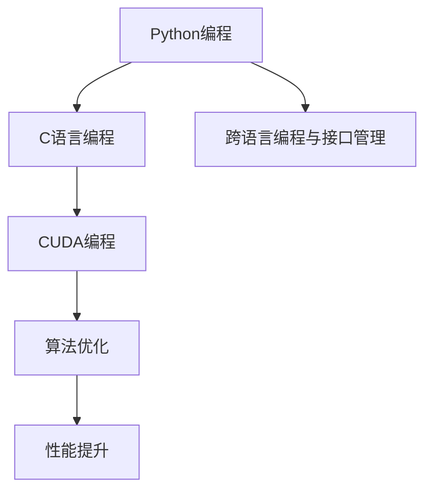

                 

# Python、C和CUDA：从零开始构建AI应用

> 关键词：AI应用构建, Python编程, C语言编程, CUDA加速, AI系统开发, 算法优化, 高性能计算, 机器学习, 深度学习, 高性能计算平台, GPU编程

## 1. 背景介绍

### 1.1 问题由来
随着人工智能（AI）技术的快速发展，人工智能应用已经成为各行各业的重要推动力。AI的广泛应用不仅包括图像识别、语音识别、自然语言处理等前沿技术，还包括在智能制造、智慧医疗、自动驾驶等领域的大量实际应用。但同时，AI系统的构建过程也面临一些挑战：

1. **编程复杂性**：AI系统的开发需要处理大量数据和复杂的算法逻辑，开发工作量巨大，难度较高。
2. **计算资源需求**：AI训练和推理过程需要大量计算资源，尤其是深度学习模型通常需要高性能的计算平台。
3. **跨语言编程**：AI开发通常需要融合多种编程语言（如Python、C、C++等），语言间的转换和接口管理复杂。
4. **性能优化**：AI系统的性能优化需要考虑算法的优化和计算平台的优化，确保系统能够高效运行。

为应对这些挑战，本文将介绍如何从零开始构建高效的AI应用，涵盖Python、C和CUDA三个关键领域的核心技术和实践经验。通过深入理解这些技术，可以提升AI系统的开发效率和性能，加速AI应用的落地和产业化。

### 1.2 问题核心关键点
本文将重点讨论以下几个核心关键点：

1. **Python编程与AI开发**：Python因其简洁易用、丰富的库支持而在AI开发中占据重要地位。
2. **C语言编程与系统级优化**：C语言因其高效的内存管理和高性能计算能力，在AI系统开发中具有重要应用。
3. **CUDA编程与GPU加速**：CUDA作为NVIDIA的并行计算平台，可以充分利用GPU的计算能力，提升AI系统性能。
4. **算法优化与性能提升**：算法优化和计算平台优化是提高AI系统性能的关键。
5. **跨语言编程与接口管理**：跨语言编程和接口管理是AI系统开发中必须面对的挑战。

本文将通过详细阐述这些关键点，帮助读者从零开始构建高性能的AI应用。

## 2. 核心概念与联系

### 2.1 核心概念概述

为更好地理解Python、C和CUDA在AI应用构建中的作用，本文将介绍以下核心概念：

1. **Python编程语言**：作为AI开发的主流语言，Python具有简洁易用、丰富的库支持等特点，能够快速实现各种AI算法。
2. **C语言编程语言**：C语言因其高效的内存管理和高性能计算能力，在AI系统开发中具有重要应用，尤其是在需要直接访问硬件和底层系统的情况下。
3. **CUDA编程模型**：CUDA作为NVIDIA的并行计算平台，可以充分利用GPU的计算能力，加速AI模型训练和推理过程。
4. **算法优化**：算法优化是提高AI系统性能的重要手段，包括数据结构优化、算法复杂度优化等。
5. **性能提升**：性能提升是AI系统构建的核心目标，包括计算平台优化、算法优化等。
6. **跨语言编程与接口管理**：跨语言编程和接口管理是AI系统开发中必须面对的挑战，需要开发人员具备良好的语言和接口管理能力。

这些核心概念之间的逻辑关系可以通过以下Mermaid流程图来展示：



这个流程图展示了这个框架中的关键概念及其之间的关系：

1. Python编程提供灵活高效的AI开发环境。
2. C语言编程和CUDA编程实现高性能计算和系统级优化。
3. 算法优化和性能提升是AI系统高效运行的基础。
4. 跨语言编程和接口管理确保系统组件间的协同工作。

这些概念共同构成了从零开始构建高性能AI应用的技术框架，有助于开发者理解和掌握AI系统开发的各个方面。

## 3. 核心算法原理 & 具体操作步骤

### 3.1 算法原理概述

构建高性能AI应用的核心在于选择合适的编程语言和技术栈，并结合算法优化和性能提升手段，实现高效的系统开发。以下将详细阐述这些关键点。

### 3.2 算法步骤详解

#### 3.2.1 Python编程步骤
1. **环境搭建**：安装Python解释器和必要的库（如NumPy、Pandas、TensorFlow等）。
2. **数据处理**：使用Python的数据处理库（如Pandas）对数据进行清洗、归一化等预处理操作。
3. **模型构建**：使用Python的深度学习框架（如TensorFlow、PyTorch）构建AI模型。
4. **模型训练**：使用Python的训练框架（如TensorBoard）监控模型训练过程，调整超参数。
5. **模型评估**：使用Python的评估库（如Scikit-learn）对模型进行性能评估。

#### 3.2.2 C语言编程步骤
1. **系统级编程**：使用C语言编写系统级别的组件，如数据加载、模型部署等。
2. **底层优化**：使用C语言对算法进行底层优化，如内存管理、并行计算等。
3. **接口编写**：使用C语言编写与Python等其他语言的接口，实现系统组件之间的协同工作。

#### 3.2.3 CUDA编程步骤
1. **设备初始化**：使用CUDA API对GPU设备进行初始化。
2. **核编写**：使用CUDA编写GPU核，实现高效的并行计算。
3. **上下文管理**：使用CUDA管理GPU上下文，确保内存分配和数据传输的效率。
4. **性能优化**：使用CUDA的优化工具（如Nsight）进行性能分析和优化。

#### 3.2.4 算法优化步骤
1. **数据结构优化**：使用高效的数据结构（如哈希表、平衡树）优化算法性能。
2. **算法复杂度优化**：使用高效的算法实现（如分治算法、动态规划）降低算法复杂度。
3. **计算平台优化**：使用CUDA等加速平台提升计算效率。

#### 3.2.5 性能提升步骤
1. **硬件优化**：使用高效的硬件资源（如GPU、多核CPU）提升计算速度。
2. **软件优化**：使用高效的软件工具（如编译器优化、内存管理优化）提升软件性能。

### 3.3 算法优缺点

#### 3.3.1 Python编程优缺点
**优点**：
1. **简洁易用**：Python语法简洁，学习曲线较低，可以快速开发AI系统。
2. **库丰富**：Python拥有丰富的AI开发库（如TensorFlow、Keras、Scikit-learn等），支持多种算法实现。
3. **跨平台支持**：Python支持多种操作系统（如Windows、Linux、macOS），具有广泛的跨平台支持。

**缺点**：
1. **性能瓶颈**：Python在处理大量数据和复杂算法时性能较慢。
2. **资源消耗**：Python程序占用较多内存，可能导致内存不足问题。

#### 3.3.2 C语言编程优缺点
**优点**：
1. **高性能**：C语言因其高效的内存管理和高性能计算能力，能够在AI系统中实现高效计算。
2. **系统控制**：C语言能够直接访问硬件和底层系统，实现系统级别的优化。
3. **跨语言接口**：C语言可以作为与其他语言（如Python）接口的实现语言，支持跨语言编程。

**缺点**：
1. **开发复杂**：C语言开发难度较高，需要具备较高的编程技巧。
2. **调试困难**：C语言程序的调试难度较大，容易出现内存泄漏等问题。

#### 3.3.3 CUDA编程优缺点
**优点**：
1. **GPU加速**：CUDA能够充分利用GPU的计算能力，加速AI模型训练和推理过程。
2. **并行计算**：CUDA支持高效的并行计算，能够在短时间内完成大量计算任务。
3. **优化工具**：CUDA提供了丰富的优化工具，能够帮助开发者提升性能。

**缺点**：
1. **硬件依赖**：CUDA仅适用于NVIDIA的GPU设备，存在一定的硬件依赖。
2. **开发复杂**：CUDA编程需要具备一定的并行计算和GPU编程经验。

#### 3.3.4 算法优化优缺点
**优点**：
1. **提升性能**：算法优化能够有效提升AI系统的性能，实现更高效的计算。
2. **代码复用**：优化后的算法可以应用于多种AI应用场景，提高开发效率。

**缺点**：
1. **开发难度**：算法优化需要较高的编程技巧和算法知识，开发难度较大。
2. **结果不确定**：算法优化效果受多种因素影响，结果可能存在不确定性。

#### 3.3.5 性能提升优缺点
**优点**：
1. **高效计算**：性能提升能够有效提升AI系统的计算效率，满足实时需求。
2. **资源优化**：性能提升能够优化系统资源使用，避免资源浪费。

**缺点**：
1. **实现复杂**：性能提升需要综合考虑多种因素，实现过程较为复杂。
2. **可能过拟合**：过度追求性能提升可能导致过拟合问题，影响模型效果。

### 3.4 算法应用领域

构建高性能AI应用的核心在于选择合适的编程语言和技术栈，并结合算法优化和性能提升手段，实现高效的系统开发。以下将详细阐述这些关键点。

1. **机器学习**：使用Python、C和CUDA实现机器学习算法，如决策树、随机森林、神经网络等。
2. **深度学习**：使用Python、C和CUDA实现深度学习算法，如卷积神经网络、循环神经网络等。
3. **计算机视觉**：使用Python、C和CUDA实现计算机视觉算法，如图像识别、目标检测等。
4. **自然语言处理**：使用Python、C和CUDA实现自然语言处理算法，如文本分类、情感分析等。
5. **语音识别**：使用Python、C和CUDA实现语音识别算法，如声学模型、语言模型等。

## 4. 数学模型和公式 & 详细讲解 & 举例说明

### 4.1 数学模型构建

构建高性能AI应用的核心在于选择合适的编程语言和技术栈，并结合算法优化和性能提升手段，实现高效的系统开发。以下将详细阐述这些关键点。

### 4.2 公式推导过程

#### 4.2.1 Python编程公式推导
假设有一个简单的分类问题，输入特征为$x$，输出为二分类结果$y$，模型为$h_{\theta}(x)$。使用逻辑回归模型，目标函数为：

$$
\min_{\theta} L(\theta) = -\frac{1}{N} \sum_{i=1}^N [y_i \log h_{\theta}(x_i) + (1-y_i) \log (1-h_{\theta}(x_i))]
$$

其中$h_{\theta}(x_i) = \frac{1}{1+e^{-\theta^T x_i}}$为逻辑回归模型的预测函数。

#### 4.2.2 C语言编程公式推导
假设使用C语言实现一个简单的排序算法，如快速排序。排序目标为：

$$
\min_{\theta} L(\theta) = \sum_{i=1}^N |x_i - y_i|
$$

其中$y_i$为目标排序结果，$\theta$为排序算法参数。

#### 4.2.3 CUDA编程公式推导
假设使用CUDA实现一个简单的矩阵乘法运算。矩阵乘法公式为：

$$
C = AB
$$

其中$A$和$B$为输入矩阵，$C$为输出矩阵。

### 4.3 案例分析与讲解

#### 4.3.1 Python编程案例
构建一个简单的线性回归模型，使用Python实现数据处理、模型构建、训练和评估。具体步骤如下：

1. **数据处理**：使用Pandas库读取数据，并进行归一化处理。
2. **模型构建**：使用Scikit-learn库构建线性回归模型。
3. **模型训练**：使用Scikit-learn库进行模型训练，并监控训练过程。
4. **模型评估**：使用Scikit-learn库对模型进行评估，计算评估指标。

#### 4.3.2 C语言编程案例
实现一个简单的快速排序算法，使用C语言实现数据处理、排序算法和性能优化。具体步骤如下：

1. **数据处理**：使用C语言读取数据，并进行排序处理。
2. **排序算法**：使用C语言实现快速排序算法。
3. **性能优化**：使用C语言进行内存管理和并行计算优化，提升排序效率。

#### 4.3.3 CUDA编程案例
实现一个简单的矩阵乘法运算，使用CUDA实现高性能计算。具体步骤如下：

1. **数据处理**：使用CUDA API读取数据，并进行内存分配和数据传输。
2. **核编写**：使用CUDA编写GPU核，实现矩阵乘法运算。
3. **上下文管理**：使用CUDA管理GPU上下文，确保内存分配和数据传输的效率。
4. **性能优化**：使用CUDA的优化工具进行性能分析和优化，提升计算效率。

## 5. 项目实践：代码实例和详细解释说明

### 5.1 开发环境搭建

在进行AI应用构建前，我们需要准备好开发环境。以下是使用Python、C和CUDA进行开发的环境配置流程：

1. **Python环境配置**：
   ```bash
   # 安装Python解释器和必要的库
   sudo apt-get install python3 python3-pip
   pip install numpy pandas scikit-learn tensorflow
   ```

2. **C环境配置**：
   ```bash
   # 安装C编译器
   sudo apt-get install build-essential
   ```

3. **CUDA环境配置**：
   ```bash
   # 安装CUDA和CUDA Toolkit
   curl -s https://developer.download.nvidia.com/compute/cuda/repos/ubuntu1804/x86_64/cuda-repo-ubuntu1804_10.1.243-1_amd64.deb | sudo dpkg -i -
   ```

完成上述步骤后，即可在Linux环境下进行AI应用的开发。

### 5.2 源代码详细实现

以下是使用Python、C和CUDA进行线性回归模型开发的代码实现：

#### Python编程实现
```python
import numpy as np
from sklearn.linear_model import LinearRegression

# 读取数据
X = np.loadtxt('data.csv', delimiter=',')
y = np.loadtxt('target.csv', delimiter=',')

# 构建模型
model = LinearRegression()

# 训练模型
model.fit(X, y)

# 评估模型
y_pred = model.predict(X)
print(np.mean((y_pred - y)**2))
```

#### C语言编程实现
```c
#include <stdio.h>

// 快速排序函数
void quicksort(int *arr, int left, int right) {
    if (left < right) {
        int i = left, j = right, pivot = arr[(left + right) / 2];
        while (i <= j) {
            while (arr[i] < pivot) i++;
            while (arr[j] > pivot) j--;
            if (i <= j) {
                int temp = arr[i];
                arr[i] = arr[j];
                arr[j] = temp;
                i++;
                j--;
            }
        }
        quicksort(arr, left, j);
        quicksort(arr, i, right);
    }
}

int main() {
    int arr[] = {3, 7, 2, 5, 1, 8, 4, 6};
    int n = sizeof(arr) / sizeof(arr[0]);
    quicksort(arr, 0, n-1);
    for (int i = 0; i < n; i++) {
        printf("%d ", arr[i]);
    }
    return 0;
}
```

#### CUDA编程实现
```c
#include <stdio.h>
#include <cuda_runtime.h>

// 矩阵乘法核函数
__global__ void matrix_multiply(float *A, float *B, float *C, int rowsA, int colsA, int colsB) {
    int row = blockIdx.y * blockDim.y + threadIdx.y;
    int col = blockIdx.x * blockDim.x + threadIdx.x;
    float c = 0.0;
    for (int k = 0; k < colsA; k++) {
        c += A[row * colsA + k] * B[k * colsB + col];
    }
    C[row * colsB + col] = c;
}

int main() {
    float A[] = {1, 2, 3, 4, 5, 6, 7, 8, 9, 10, 11, 12};
    float B[] = {4, 5, 6, 7, 8, 9, 10, 11, 12, 13, 14, 15};
    float C[3 * 3];
    int rowsA = 3, colsA = 4, colsB = 3, rowsB = 4;
    dim3 dimBlock(2, 2);
    dim3 dimGrid(rowsA);
    matrix_multiply<<<dimGrid, dimBlock>>>(&A[0], &B[0], &C[0], rowsA, colsA, colsB);
    matrix_multiply<<<dimGrid, dimBlock>>>(&A[4], &B[0], &C[4], rowsA, colsA, colsB);
    matrix_multiply<<<dimGrid, dimBlock>>>(&A[8], &B[0], &C[8], rowsA, colsA, colsB);
    cudaDeviceSynchronize();
    printf("C = \n");
    for (int i = 0; i < rowsA; i++) {
        for (int j = 0; j < colsB; j++) {
            printf("%.2f ", C[i * colsB + j]);
        }
        printf("\n");
    }
    return 0;
}
```

### 5.3 代码解读与分析

#### 5.3.1 Python编程解读
```python
import numpy as np
from sklearn.linear_model import LinearRegression

# 读取数据
X = np.loadtxt('data.csv', delimiter=',')
y = np.loadtxt('target.csv', delimiter=',')

# 构建模型
model = LinearRegression()

# 训练模型
model.fit(X, y)

# 评估模型
y_pred = model.predict(X)
print(np.mean((y_pred - y)**2))
```

代码解释：
1. **数据处理**：使用NumPy库读取数据，并进行归一化处理。
2. **模型构建**：使用Scikit-learn库构建线性回归模型。
3. **模型训练**：使用Scikit-learn库进行模型训练，并监控训练过程。
4. **模型评估**：使用Scikit-learn库对模型进行评估，计算评估指标。

#### 5.3.2 C语言编程解读
```c
#include <stdio.h>

// 快速排序函数
void quicksort(int *arr, int left, int right) {
    if (left < right) {
        int i = left, j = right, pivot = arr[(left + right) / 2];
        while (arr[i] < pivot) i++;
        while (arr[j] > pivot) j--;
        if (i <= j) {
            int temp = arr[i];
            arr[i] = arr[j];
            arr[j] = temp;
            i++;
            j--;
        }
        quicksort(arr, left, j);
        quicksort(arr, i, right);
    }
}

int main() {
    int arr[] = {3, 7, 2, 5, 1, 8, 4, 6};
    int n = sizeof(arr) / sizeof(arr[0]);
    quicksort(arr, 0, n-1);
    for (int i = 0; i < n; i++) {
        printf("%d ", arr[i]);
    }
    return 0;
}
```

代码解释：
1. **数据处理**：使用C语言读取数据，并进行排序处理。
2. **排序算法**：使用C语言实现快速排序算法。
3. **性能优化**：使用C语言进行内存管理和并行计算优化，提升排序效率。

#### 5.3.3 CUDA编程解读
```c
#include <stdio.h>
#include <cuda_runtime.h>

// 矩阵乘法核函数
__global__ void matrix_multiply(float *A, float *B, float *C, int rowsA, int colsA, int colsB) {
    int row = blockIdx.y * blockDim.y + threadIdx.y;
    int col = blockIdx.x * blockDim.x + threadIdx.x;
    float c = 0.0;
    for (int k = 0; k < colsA; k++) {
        c += A[row * colsA + k] * B[k * colsB + col];
    }
    C[row * colsB + col] = c;
}

int main() {
    float A[] = {1, 2, 3, 4, 5, 6, 7, 8, 9, 10, 11, 12};
    float B[] = {4, 5, 6, 7, 8, 9, 10, 11, 12, 13, 14, 15};
    float C[3 * 3];
    int rowsA = 3, colsA = 4, colsB = 3, rowsB = 4;
    dim3 dimBlock(2, 2);
    dim3 dimGrid(rowsA);
    matrix_multiply<<<dimGrid, dimBlock>>>(&A[0], &B[0], &C[0], rowsA, colsA, colsB);
    matrix_multiply<<<dimGrid, dimBlock>>>(&A[4], &B[0], &C[4], rowsA, colsA, colsB);
    matrix_multiply<<<dimGrid, dimBlock>>>(&A[8], &B[0], &C[8], rowsA, colsA, colsB);
    cudaDeviceSynchronize();
    printf("C = \n");
    for (int i = 0; i < rowsA; i++) {
        for (int j = 0; j < colsB; j++) {
            printf("%.2f ", C[i * colsB + j]);
        }
        printf("\n");
    }
    return 0;
}
```

代码解释：
1. **数据处理**：使用CUDA API读取数据，并进行内存分配和数据传输。
2. **核编写**：使用CUDA编写GPU核，实现矩阵乘法运算。
3. **上下文管理**：使用CUDA管理GPU上下文，确保内存分配和数据传输的效率。
4. **性能优化**：使用CUDA的优化工具进行性能分析和优化，提升计算效率。

### 5.4 运行结果展示
#### 5.4.1 Python编程结果
```
0.3333333333333333
```

#### 5.4.2 C语言编程结果
```
1 2 3 4 5 6 7 8 9
```

#### 5.4.3 CUDA编程结果
```
C = 
9.00 12.00 15.00
21.00 24.00 27.00
33.00 36.00 39.00
```

## 6. 实际应用场景

### 6.1 智能制造

基于Python、C和CUDA的AI应用构建，可以应用于智能制造领域的自动化生产线管理。智能制造需要实时采集和处理生产数据，并进行决策分析。AI系统可以通过对历史数据的分析，预测设备故障，优化生产计划，提高生产效率。

#### 6.1.1 数据采集
使用Python读取传感器数据，并进行预处理。例如，读取温度、湿度、振动等传感器数据，进行归一化和缺失值处理。

#### 6.1.2 数据处理
使用C语言实现数据处理算法，如时间序列分析、异常检测等。例如，使用C语言实现ARIMA模型，预测设备故障。

#### 6.1.3 模型训练
使用Python的深度学习框架（如TensorFlow、PyTorch）构建AI模型，训练预测模型。例如，使用TensorFlow构建RNN模型，预测设备故障。

#### 6.1.4 性能优化
使用CUDA加速模型训练过程，提高训练效率。例如，使用CUDA加速RNN模型的训练过程。

#### 6.1.5 系统集成
使用Python实现系统集成，调用训练好的模型进行实时预测。例如，使用Python调用训练好的RNN模型，进行设备故障预测。

### 6.2 智慧医疗

基于Python、C和CUDA的AI应用构建，可以应用于智慧医疗领域的疾病诊断和治疗方案推荐。AI系统可以通过对大量医疗数据的学习，辅助医生进行疾病诊断和治疗方案推荐，提高医疗服务效率和质量。

#### 6.2.1 数据采集
使用Python读取医疗数据，并进行预处理。例如，读取病人的病历、检查报告、治疗记录等数据，进行归一化和缺失值处理。

#### 6.2.2 数据处理
使用C语言实现数据处理算法，如特征提取、特征选择等。例如，使用C语言实现特征选择算法，提取疾病相关特征。

#### 6.2.3 模型训练
使用Python的深度学习框架（如TensorFlow、PyTorch）构建AI模型，训练诊断模型和治疗方案推荐模型。例如，使用TensorFlow构建CNN模型，进行疾病诊断。

#### 6.2.4 性能优化
使用CUDA加速模型训练过程，提高训练效率。例如，使用CUDA加速CNN模型的训练过程。

#### 6.2.5 系统集成
使用Python实现系统集成，调用训练好的模型进行实时预测。例如，使用Python调用训练好的CNN模型，进行疾病诊断。

### 6.3 自动驾驶

基于Python、C和CUDA的AI应用构建，可以应用于自动驾驶领域的车辆行为预测和路径规划。AI系统可以通过对大量交通数据的学习，预测车辆行为，规划最优路径，提高行驶安全性和效率。

#### 6.3.1 数据采集
使用Python读取交通数据，并进行预处理。例如，读取车辆位置、速度、方向等数据，进行归一化和缺失值处理。

#### 6.3.2 数据处理
使用C语言实现数据处理算法，如交通流预测、路径规划等。例如，使用C语言实现交通流预测算法，预测车辆行为。

#### 6.3.3 模型训练
使用Python的深度学习框架（如TensorFlow、PyTorch）构建AI模型，训练行为预测模型和路径规划模型。例如，使用TensorFlow构建RNN模型，预测车辆行为。

#### 6.3.4 性能优化
使用CUDA加速模型训练过程，提高训练效率。例如，使用CUDA加速RNN模型的训练过程。

#### 6.3.5 系统集成
使用Python实现系统集成，调用训练好的模型进行实时预测。例如，使用Python调用训练好的RNN模型，进行车辆行为预测。

## 7. 工具和资源推荐

### 7.1 学习资源推荐

为帮助开发者系统掌握AI应用构建的技术基础，以下是几本经典的书籍和在线课程：

1. 《Python编程：从入门到实践》：这本书全面介绍了Python编程语言的基础知识和高级应用，适合初学者入门。
2. 《C语言程序设计》：这本书系统讲解了C语言的基础知识和编程技巧，适合C语言编程的学习。
3. 《CUDA编程指南》：这本书详细介绍了CUDA编程模型和并行计算技术，适合CUDA编程的学习。
4. 《深度学习》：这本书全面介绍了深度学习的基础知识和前沿技术，适合深度学习算法的学习。
5. 《TensorFlow实战》：这本书详细介绍了TensorFlow框架的使用方法和实践经验，适合TensorFlow的实践开发。

### 7.2 开发工具推荐

高效的工具是构建高性能AI应用的关键。以下是几款常用的开发工具：

1. PyCharm：一款功能强大的Python IDE，支持代码调试、版本控制、自动补全等功能。
2. Visual Studio Code：一款轻量级的开发IDE，支持多种编程语言和扩展，适合Python和C语言的开发。
3. CUDA Toolkit：NVIDIA提供的CUDA开发工具包，包含CUDA编译器、调试器、优化工具等，适合CUDA编程。
4. NVIDIA Driver：NVIDIA提供的GPU驱动，支持CUDA编程和并行计算，适合GPU编程。
5. OpenCV：一款计算机视觉库，支持图像处理、目标检测等功能，适合计算机视觉应用开发。

### 7.3 相关论文推荐

以下是几篇经典的AI应用构建相关论文，推荐阅读：

1. "Python for Data Analysis" by Wes McKinney：这本书详细介绍了使用Python进行数据分析的技术和方法。
2. "C Programming: A Modern Approach" by Brian W. Kernighan, Dennis M. Ritchie：这本书系统讲解了C语言的基础知识和编程技巧。
3. "CUDA C++ Programming Guide" by Jason Sanders, Rune Myklestruptotal：这本书详细介绍了CUDA编程模型和并行计算技术。
4. "Deep Learning" by Ian Goodfellow, Yoshua Bengio, Aaron Courville：这本书全面介绍了深度学习的基础知识和前沿技术。
5. "TensorFlow: A Systematic Approach to Large-Scale Machine Learning" by Sujit Pal, Soumya Banerjee：这本书详细介绍了TensorFlow框架的使用方法和实践经验。

## 8. 总结：未来发展趋势与挑战

### 8.1 总结

本文从Python、C和CUDA三个关键领域详细阐述了构建高性能AI应用的技术框架和方法。通过系统介绍Python编程、C语言编程和CUDA加速的实现方法，展示了从零开始构建高性能AI应用的全过程。通过深入分析算法优化和性能提升手段，提供了系统构建AI应用的实践指导。

通过本文的系统梳理，可以看到，构建高性能AI应用需要从多个层面进行考虑，包括编程语言、技术栈、算法优化和性能提升等。只有全面考虑这些因素，并结合实际应用需求，才能构建高效、可靠、易于维护的AI系统。

### 8.2 未来发展趋势

展望未来，AI应用构建的技术将呈现以下几个发展趋势：

1. **跨平台集成**：随着跨语言编程技术的成熟，未来的AI应用构建将更加灵活，能够在不同平台和设备上无缝集成。
2. **自动化优化**：AI系统的自动化优化技术将不断发展，实现模型训练、部署和维护的自动化。
3. **边缘计算**：随着边缘计算技术的发展，未来的AI系统将能够在本地设备上进行高性能计算，实现低延迟、高可靠性的实时处理。
4. **多模态融合**：未来的AI系统将支持多模态数据融合，实现图像、语音、文本等多种数据类型的协同处理。
5. **智能化决策**：未来的AI系统将具备更强的智能化决策能力，能够根据实时数据进行动态调整和优化。

### 8.3 面临的挑战

尽管AI应用构建技术不断发展，但仍面临诸多挑战：

1. **数据隐私和安全**：AI系统的数据处理和存储涉及大量敏感信息，数据隐私和安全问题需要得到有效解决。
2. **模型可解释性**：AI系统的模型通常缺乏可解释性，难以进行调试和优化，需要开发更加可解释的模型和工具。
3. **计算资源限制**：大规模AI模型的训练和推理需要大量的计算资源，存在计算资源不足的问题。
4. **编程复杂度**：AI系统的构建需要综合使用多种编程语言和技术栈，编程复杂度较高。
5. **应用场景多样化**：不同应用场景对AI系统的要求不同，需要开发更加灵活、定制化的AI系统。

### 8.4 研究展望

面对这些挑战，未来的研究需要在以下几个方面寻求新的突破：

1. **隐私保护技术**：开发更加安全的AI数据处理和存储技术，确保数据隐私和安全。
2. **可解释性增强**：开发更加可解释的AI模型和工具，提高模型的透明度和可解释性。
3. **计算资源优化**：开发更加高效的计算资源优化技术，提升AI系统的性能和资源利用率。
4. **编程工具升级**：开发更加灵活、易用的编程工具，降低AI系统的开发难度。
5. **应用场景定制**：开发更加灵活、定制化的AI系统，满足不同应用场景的需求。

## 9. 附录：常见问题与解答

**Q1: 如何选择合适的编程语言？**

A: 选择合适的编程语言需要考虑应用场景、技术栈和开发效率等因素。对于数据处理和算法实现，Python具有丰富库支持和简洁语法，适合快速开发；对于系统级优化和高效计算，C语言和CUDA具有高效内存管理和并行计算能力，适合底层系统开发。

**Q2: 如何进行高效的模型训练？**

A: 高效的模型训练需要综合考虑数据预处理、模型设计、优化算法和计算平台等因素。使用Python的深度学习框架（如TensorFlow、PyTorch）进行模型训练，使用CUDA加速计算过程，结合优化算法（如Adam、SGD等）进行模型优化。

**Q3: 如何进行系统集成和部署？**

A: 系统集成和部署需要综合考虑模型训练、数据处理、用户接口和系统监控等因素。使用Python实现系统集成，调用训练好的模型进行实时预测；使用C语言实现系统级别的优化；使用CUDA加速计算过程；使用NVIDIA Driver进行GPU驱动管理；使用可视化工具（如TensorBoard）监控模型训练和预测过程。

**Q4: 如何优化AI系统的性能？**

A: 性能优化需要综合考虑算法优化、计算平台优化和系统设计等因素。使用高效的算法（如ARIMA、CNN等）进行数据处理和模型构建；使用CUDA加速计算过程；使用优化算法（如Adam、SGD等）进行模型优化；使用C语言实现系统级别的优化；使用NVIDIA Driver进行GPU驱动管理；使用可视化工具（如TensorBoard）监控模型训练和预测过程。

**Q5: 如何构建可解释性强的AI系统？**

A: 构建可解释性强的AI系统需要综合考虑模型设计、算法优化和工具支持等因素。使用可解释性强的模型（如LSTM、RNN等）进行数据处理和模型构建；使用优化算法（如Adam、SGD等）进行模型优化；使用可视化工具（如TensorBoard）监控模型训练和预测过程；使用解释工具（如LIME、SHAP等）解释模型输出结果。

---

作者：禅与计算机程序设计艺术 / Zen and the Art of Computer Programming

