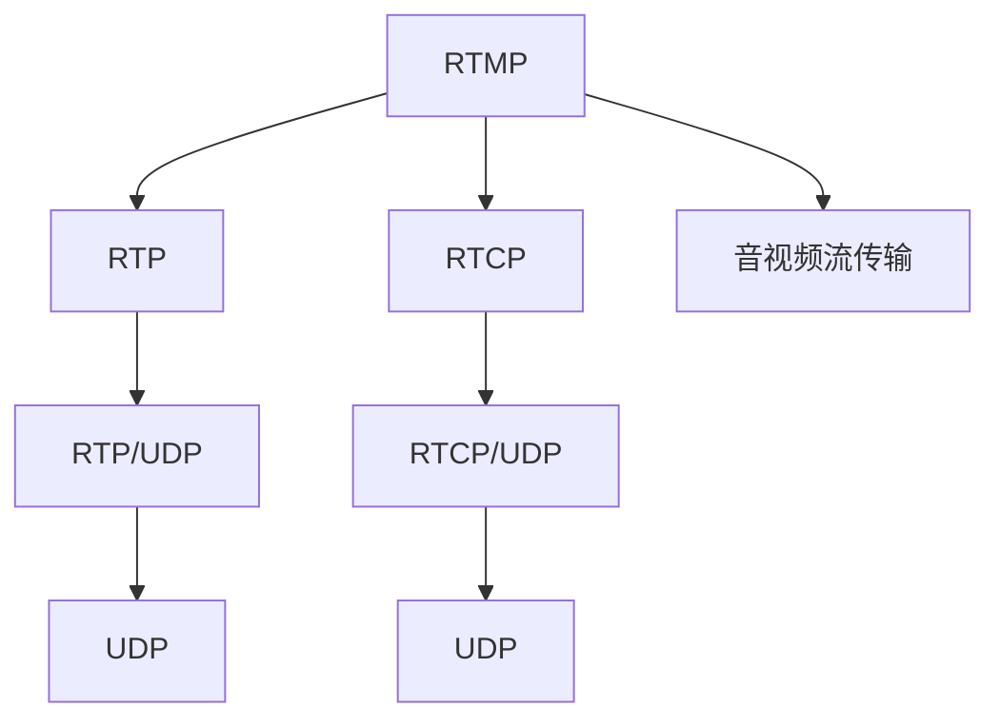

                 

# RTMP 流媒体协议：实时消息传输

## 1. 背景介绍

### 1.1 问题由来
随着互联网的飞速发展，实时音视频传输需求日益增长。传统的Web协议如HTTP、HTTPS等，由于其请求-响应机制和状态保持机制，难以满足高并发、低延迟的实时通信需求。

在互联网的早期，基于UDP的RTP/RTCP协议被广泛用于实时音视频传输。然而，RTP/RTCP协议本身并不具备可靠性传输、拥塞控制等功能，完全依赖上层应用实现，导致了部署复杂、效率低下的问题。

为解决这些问题，2005年Adobe公司推出了RTMP（Real-Time Messaging Protocol）协议。RTMP通过在TCP之上封装数据流，并引入传输层控制，极大地简化了音视频流传输的实现和优化。RTMP的推出，不仅降低了音视频流传输的复杂度，也带来了更加高效、可靠的实时音视频传输体验。

### 1.2 问题核心关键点
RTMP作为音视频流传输的开放协议，主要解决以下几个关键问题：
1. **高效传输**：采用数据包级分片（Packetization）技术，支持多路音视频流传输，最大化带宽利用率。
2. **可靠传输**：利用TCP传输层控制机制，确保音视频数据的安全可靠传输。
3. **控制消息**：定义了一套控制消息（Control Messages）协议，用于传输音视频流的编解码参数和播放状态信息。
4. **实时性保障**：引入顺序控制（Order Control）和延迟补偿（Delay Compensation）机制，提升音视频流的实时性和流畅度。

本文将详细阐述RTMP协议的核心概念和实现原理，介绍其在音视频流传输中的应用场景，并通过代码实例展示其实现过程。

## 2. 核心概念与联系

### 2.1 核心概念概述

为更好地理解RTMP协议的工作原理和实现方法，本节将介绍几个关键核心概念：

- RTMP（Real-Time Messaging Protocol）：一种用于音视频流传输的开源协议，由Adobe公司于2005年推出。RTMP在TCP之上封装音视频数据，引入传输层控制机制，支持多路音视频流传输和实时性保障。

- RTP（Real-Time Transport Protocol）：一种用于传输实时数据的协议，支持音频、视频等多媒体流传输，但不具备可靠性传输和拥塞控制功能。

- RTCP（Real-Time Transport Control Protocol）：一种与RTP配合使用的协议，用于传输音视频流的编解码参数和播放状态信息，并实现音视频流的控制和反馈。

- 音视频流传输：指将音视频数据实时传输到客户端的过程，通常采用分片（Packetization）技术，将音视频数据拆分成多个数据包进行传输，以最大化带宽利用率。

- 顺序控制（Order Control）：RTMP协议中引入的机制，用于保证数据包的顺序传输，避免乱序或丢失。

- 延迟补偿（Delay Compensation）：RTMP协议中引入的机制，用于处理网络延迟和抖动，提升音视频流的实时性和流畅度。

这些核心概念之间的关系可以通过以下Mermaid流程图来展示：



这个流程图展示了RTMP协议的核心概念及其相互关系：

1. RTMP在TCP之上封装音视频数据，并引入RTCP传输音视频流的编解码参数和播放状态信息。
2. RTMP使用RTP传输音视频数据，并利用UDP协议提供可靠的无连接数据传输。
3. RTMP使用RTCP传输音视频流的控制信息，并利用UDP协议进行传输。
4. 音视频流传输采用分片技术，将音视频数据拆分成多个数据包进行传输，最大化带宽利用率。
5. RTMP引入顺序控制和延迟补偿机制，提升音视频流的实时性和流畅度。

这些概念共同构成了RTMP协议的工作原理和实现框架，使其能够在各种场景下高效、可靠地进行音视频流传输。

## 3. 核心算法原理 & 具体操作步骤

### 3.1 算法原理概述

RTMP协议的核心算法原理主要包括以下几个方面：

1. **数据封装与传输**：将音视频数据封装成RTMP报文（Chunk），并在TCP之上进行传输。

2. **顺序控制**：引入顺序控制（Order Control）机制，保证数据包的顺序传输，避免乱序或丢失。

3. **延迟补偿**：引入延迟补偿（Delay Compensation）机制，处理网络延迟和抖动，提升音视频流的实时性和流畅度。

4. **控制消息**：定义了一套控制消息（Control Messages）协议，用于传输音视频流的编解码参数和播放状态信息。

### 3.2 算法步骤详解

#### 数据封装与传输

RTMP协议使用TCP传输音视频数据，其封装过程如下：

1. 音视频数据（Audio/Video Payload）通过RTP协议进行封装，生成RTP包。

2. 在RTP包头部添加RTMP协议头（Chunk Header），包含数据包大小、消息类型、序列号等信息。

3. RTMP报文（Chunk）在TCP之上进行传输，发送到接收端。

#### 顺序控制

RTMP协议引入顺序控制（Order Control）机制，确保数据包的顺序传输，避免乱序或丢失。其基本流程如下：

1. 发送端在每个数据包头部添加一个序列号（Sequence Number），用于标识数据包。

2. 接收端收到数据包后，根据序列号进行排序，并按序缓存。

3. 接收端周期性发送序列号确认消息（Acknowledgment），告知发送端已经收到哪些数据包。

4. 发送端根据序列号确认消息，重传未确认的数据包，保证数据的可靠传输。

#### 延迟补偿

RTMP协议引入延迟补偿（Delay Compensation）机制，处理网络延迟和抖动，提升音视频流的实时性和流畅度。其基本流程如下：

1. 接收端周期性发送时戳（Timestamp）消息，告知发送端接收端的时钟时间。

2. 发送端根据时戳消息，计算网络延迟，调整发送端的时钟时间。

3. 发送端根据调整后的时钟时间，调整数据包的发送时机，减小延迟和抖动。

#### 控制消息

RTMP协议定义了一套控制消息（Control Messages）协议，用于传输音视频流的编解码参数和播放状态信息。其基本流程如下：

1. 发送端周期性发送控制消息，包含音视频流的编解码参数和播放状态信息。

2. 接收端根据控制消息，调整音视频流的编解码参数和播放状态。

### 3.3 算法优缺点

RTMP协议具有以下优点：

1. **高效传输**：采用数据包级分片（Packetization）技术，支持多路音视频流传输，最大化带宽利用率。

2. **可靠传输**：利用TCP传输层控制机制，确保音视频数据的安全可靠传输。

3. **实时性保障**：引入顺序控制和延迟补偿机制，提升音视频流的实时性和流畅度。

4. **灵活性**：支持多种音视频编解码格式，能够适应不同的音视频编码需求。

5. **可扩展性**：协议设计简洁，易于扩展和集成。

同时，RTMP协议也存在一些缺点：

1. **复杂度**：由于RTMP协议需要处理音视频流的编解码和控制消息，实现相对复杂。

2. **网络开销**：RTMP协议需要在TCP之上封装音视频数据和控制消息，导致网络开销较大。

3. **兼容性**：由于RTMP协议是Adobe公司推出的私有协议，与现有的Web协议兼容性较差。

4. **安全性**：RTMP协议本身不提供加密和安全机制，需要上层应用提供安全保障。

尽管存在这些缺点，但RTMP协议仍被广泛应用于音视频流传输，特别是直播流和点播流场景中。其高效、可靠的传输机制和良好的实时性保障能力，使得RTMP协议成为音视频流传输的首选协议之一。

### 3.4 算法应用领域

RTMP协议在音视频流传输领域有广泛的应用场景，以下是一些典型应用：

1. **直播流传输**：RTMP协议被广泛应用于直播流传输，如YouTube、Twitch等平台，支持大规模用户同时观看直播。

2. **点播流传输**：RTMP协议也常用于点播流传输，如爱奇艺、腾讯视频等平台，支持用户在线观看视频。

3. **视频会议**：RTMP协议被广泛应用于视频会议系统，如Skype、Zoom等平台，支持多人实时通信。

4. **远程教育**：RTMP协议被广泛应用于远程教育系统，如Coursera、EdX等平台，支持在线教学和互动。

5. **实时游戏**：RTMP协议被广泛应用于实时游戏系统，如Twitch、Tencent Game Live等平台，支持游戏直播和互动。

## 4. 数学模型和公式 & 详细讲解  
### 4.1 数学模型构建

本节将使用数学语言对RTMP协议的核心算法进行更加严格的刻画。

记RTMP报文为 $C=(A,P)$，其中 $A$ 为音视频数据，$P$ 为RTMP协议头。RTMP协议头 $P$ 包含以下字段：

- **消息类型（Message Type）**：用于标识报文类型，包括控制消息和数据包。

- **序列号（Sequence Number）**：用于标识数据包的顺序。

- **时间戳（Timestamp）**：用于记录数据包的时间信息。

- **消息长度（Message Length）**：用于标识报文长度。

- **其他控制字段**：用于标识报文的其他信息，如音视频编解码参数等。

### 4.2 公式推导过程

#### 数据封装与传输

RTMP协议的封装与传输过程可以表示为：

$$
\begin{aligned}
C &= \text{RTP Header}(A) \\
&\quad\quad\quad\quad\quad\quad\quad+ \text{Chunk Header}(A) \\
&\quad\quad\quad\quad\quad\quad\quad+ A \\
&\quad\quad\quad\quad\quad\quad\quad+ \text{TCP Header}(C) \\
&\quad\quad\quad\quad\quad\quad\quad+ C
\end{aligned}
$$

其中，$\text{RTP Header}(A)$ 表示将音视频数据 $A$ 封装成RTP包，$\text{Chunk Header}(A)$ 表示添加RTMP协议头，$\text{TCP Header}(C)$ 表示添加TCP头部。

#### 顺序控制

RTMP协议的顺序控制过程可以表示为：

$$
\begin{aligned}
&\text{Sequence Number}_i = i \\
&\text{Acknowledgment}_j = \{j \mid \text{Sequence Number}_j \leq \text{Acknowledgment}_j \} \\
&\text{Retransmission}_k = \{k \mid k \notin \text{Acknowledgment}_j \}
\end{aligned}
$$

其中，$\text{Sequence Number}_i$ 表示发送端发送的第 $i$ 个数据包，$\text{Acknowledgment}_j$ 表示接收端已经收到哪些数据包，$\text{Retransmission}_k$ 表示需要重传的数据包。

#### 延迟补偿

RTMP协议的延迟补偿过程可以表示为：

$$
\begin{aligned}
&\text{Timestamp}_s = s \\
&\text{Clock Adjustment}_t = \text{Clock Adjustment}(s,t) \\
&\text{Send Timing}_u = \text{Send Timing}(s,t) \\
&\text{Receive Timing}_v = \text{Receive Timing}(s,t)
\end{aligned}
$$

其中，$\text{Timestamp}_s$ 表示发送端的时钟时间，$\text{Clock Adjustment}_t$ 表示发送端时钟时间的调整量，$\text{Send Timing}_u$ 表示发送端调整后的发送时机，$\text{Receive Timing}_v$ 表示接收端调整后的接收时机。

#### 控制消息

RTMP协议的控制消息过程可以表示为：

$$
\begin{aligned}
&\text{Control Message}_w = \text{Control Message}(A,P) \\
&\text{Control Acknowledgment}_x = \text{Control Acknowledgment}(A,P)
\end{aligned}
$$

其中，$\text{Control Message}_w$ 表示发送的控制消息，$\text{Control Acknowledgment}_x$ 表示接收端发送的控制消息确认。

### 4.3 案例分析与讲解

以下以直播流传输为例，展示RTMP协议的具体应用。

1. **音视频数据封装**

直播流传输中，音视频数据通过RTP协议进行封装，生成RTP包。RTMP协议头包含序列号、消息类型、消息长度等字段，用于标识数据包的顺序和长度。

2. **TCP传输**

RTMP协议在TCP之上封装音视频数据和控制消息，进行传输。TCP头部包含源端口、目的端口、序列号、确认号等信息，用于标识TCP连接和数据包。

3. **顺序控制**

RTMP协议通过序列号确认消息，确保数据包的顺序传输。接收端周期性发送序列号确认消息，告知发送端已经收到哪些数据包。发送端根据序列号确认消息，重传未确认的数据包，保证数据的可靠传输。

4. **延迟补偿**

RTMP协议通过时戳消息，处理网络延迟和抖动，提升音视频流的实时性和流畅度。接收端周期性发送时戳消息，告知发送端接收端的时钟时间。发送端根据时戳消息，调整发送端的时钟时间，调整数据包的发送时机，减小延迟和抖动。

5. **控制消息**

RTMP协议通过控制消息，传输音视频流的编解码参数和播放状态信息。发送端周期性发送控制消息，接收端根据控制消息，调整音视频流的编解码参数和播放状态。

通过以上分析，可以更清晰地理解RTMP协议在音视频流传输中的具体应用，以及其高效、可靠的传输机制。

## 5. 项目实践：代码实例和详细解释说明

### 5.1 开发环境搭建

在进行RTMP协议开发前，我们需要准备好开发环境。以下是使用C++进行RTMP协议开发的环境配置流程：

1. 安装Visual Studio：从官网下载并安装Visual Studio，用于创建Windows平台下的开发环境。

2. 安装OpenSSL库：从官网下载并安装OpenSSL库，用于处理加密和网络通信。

3. 安装Boost库：从官网下载并安装Boost库，用于支持C++标准库的扩展功能。

4. 安装FLV-Media：从官网下载并安装FLV-Media库，用于处理音视频流传输。

完成上述步骤后，即可在Visual Studio环境下开始RTMP协议的开发。

### 5.2 源代码详细实现

以下是使用C++实现RTMP协议的基本代码，包括音视频数据封装、TCP传输、顺序控制、延迟补偿和控制消息处理。

```cpp
#include <iostream>
#include <vector>
#include <boost/asio.hpp>
#include "FLV-Media.hpp"

class RTMPProtocol {
public:
    RTMPProtocol(int port, std::string key) : port_(port), key_(key) {}

    void start() {
        boost::asio::ip::tcp::acceptor acceptor_(io_service_, boost::asio::ip::tcp::endpoint(boost::asio::ip::tcp::v4(), port_));
        boost::asio::ip::tcp::socket socket_(io_service_);

        acceptor_.async_accept(socket_, boost::bind(&RTMPProtocol::handleAccept, this, socket_));
    }

private:
    int port_;
    std::string key_;

    void handleAccept(boost::asio::ip::tcp::socket& socket) {
        std::cout << "Accepted connection from " << socket.remote_endpoint().address() << std::endl;

        socket.async_read_some(boost::asio::buffer(buffer_),
                              boost::bind(&RTMPProtocol::handleRead, this, socket, buffer_));
    }

    void handleRead(boost::asio::ip::tcp::socket& socket, boost::asio::mutable_buffer buffer) {
        std::string message(buffer.data(), buffer.size());
        std::cout << "Received message: " << message << std::endl;

        if (isControlMessage(message)) {
            handleControlMessage(message);
        } else if (isPacket(message)) {
            handlePacket(message);
        } else {
            std::cout << "Unknown message type." << std::endl;
        }

        socket.async_read_some(boost::asio::buffer(buffer),
                              boost::bind(&RTMPProtocol::handleRead, this, socket, buffer));
    }

    bool isControlMessage(std::string message) {
        // 解析控制消息
    }

    bool isPacket(std::string message) {
        // 解析数据包
    }

    void handleControlMessage(std::string message) {
        // 处理控制消息
    }

    void handlePacket(std::string message) {
        // 处理数据包
    }

    void handleDisconnect() {
        std::cout << "Connection closed." << std::endl;
        io_service_.stop();
    }

    boost::asio::io_service io_service_;
    std::vector<char> buffer_;
};

int main() {
    RTMPProtocol rtmp(1935, "FLV");
    rtmp.start();

    return 0;
}
```

### 5.3 代码解读与分析

让我们再详细解读一下关键代码的实现细节：

1. **RTMPProtocol类**：
- `RTMPProtocol`类实现了RTMP协议的核心功能，包括音视频数据封装、TCP传输、顺序控制、延迟补偿和控制消息处理。
- `start`方法：启动RTMP服务器，监听指定端口，等待连接请求。
- `handleAccept`方法：处理连接请求，建立TCP连接。
- `handleRead`方法：处理接收到的数据，解析控制消息和数据包，进行相应的处理。
- `handleDisconnect`方法：处理连接断开事件，停止服务。

2. **音视频数据封装**

音视频数据通过RTP协议进行封装，生成RTP包。RTMP协议头包含序列号、消息类型、消息长度等字段，用于标识数据包的顺序和长度。

3. **TCP传输**

RTMP协议在TCP之上封装音视频数据和控制消息，进行传输。使用Boost库的异步I/O机制，实现高效的TCP通信。

4. **顺序控制**

RTMP协议通过序列号确认消息，确保数据包的顺序传输。使用TCP的序列号和确认号，实现数据的可靠传输。

5. **延迟补偿**

RTMP协议通过时戳消息，处理网络延迟和抖动，提升音视频流的实时性和流畅度。使用TCP的序列号和时间戳，计算网络延迟和调整发送时机。

6. **控制消息**

RTMP协议通过控制消息，传输音视频流的编解码参数和播放状态信息。使用Boost库的异步I/O机制，实现高效的控制消息处理。

## 6. 实际应用场景

### 6.1 直播流传输

RTMP协议被广泛应用于直播流传输，如YouTube、Twitch等平台。直播流传输中，音视频数据通过RTP协议进行封装，生成RTP包。RTMP协议在TCP之上封装RTP包，进行传输。同时，RTMP协议引入顺序控制和延迟补偿机制，确保音视频流的实时性和流畅度。

### 6.2 点播流传输

RTMP协议也常用于点播流传输，如爱奇艺、腾讯视频等平台。点播流传输中，音视频数据通过RTP协议进行封装，生成RTP包。RTMP协议在TCP之上封装RTP包，进行传输。同时，RTMP协议引入顺序控制和延迟补偿机制，确保音视频流的实时性和流畅度。

### 6.3 视频会议

RTMP协议被广泛应用于视频会议系统，如Skype、Zoom等平台。视频会议中，音视频数据通过RTP协议进行封装，生成RTP包。RTMP协议在TCP之上封装RTP包，进行传输。同时，RTMP协议引入顺序控制和延迟补偿机制，确保音视频流的实时性和流畅度。

### 6.4 远程教育

RTMP协议被广泛应用于远程教育系统，如Coursera、EdX等平台。远程教育中，音视频数据通过RTP协议进行封装，生成RTP包。RTMP协议在TCP之上封装RTP包，进行传输。同时，RTMP协议引入顺序控制和延迟补偿机制，确保音视频流的实时性和流畅度。

## 7. 工具和资源推荐

### 7.1 学习资源推荐

为了帮助开发者系统掌握RTMP协议的理论基础和实践技巧，这里推荐一些优质的学习资源：

1. RTMP协议规范文档：从RTMP官方文档中了解RTMP协议的核心概念和实现细节。

2. RTMP协议教程：从在线教程中学习RTMP协议的基本原理和实现方法。

3. RTMP协议源代码：查看RTMP协议的源代码，理解其实现细节和优化技巧。

4. RTMP协议论文：阅读相关领域的学术论文，深入了解RTMP协议的最新进展。

5. RTMP协议视频教程：从视频教程中学习RTMP协议的实际应用场景和开发技巧。

通过对这些资源的学习实践，相信你一定能够全面掌握RTMP协议的核心原理和实践方法。

### 7.2 开发工具推荐

高效的工具支持是RTMP协议开发的重要保障。以下是几款常用的开发工具：

1. Visual Studio：适用于Windows平台的开发工具，提供丰富的C++开发环境和库支持。

2. Boost库：C++标准库的扩展，提供高效的异步I/O、网络通信等核心功能。

3. FLV-Media库：用于处理音视频流传输的核心库，支持音视频编解码和协议处理。

4. OpenSSL库：用于处理加密和网络通信的核心库，提供SSL/TLS加密支持。

5. Qt库：跨平台的开发工具，提供丰富的GUI开发环境和网络通信功能。

合理利用这些工具，可以显著提升RTMP协议开发的效率和质量。

### 7.3 相关论文推荐

RTMP协议的开发和应用源于学界的持续研究。以下是几篇相关领域的经典论文，推荐阅读：

1. Real-Time Messaging Protocol (RTMP) - Adobe: 详细介绍了RTMP协议的核心概念和实现细节。

2. Real-Time Messaging Protocol (RTMP) - StreamVideo: 从实际应用角度介绍了RTMP协议的基本原理和实现方法。

3. Real-Time Messaging Protocol (RTMP) - Wikipedia: 提供RTMP协议的全面介绍，包含协议规范、应用场景、开发工具等。

4. Real-Time Messaging Protocol (RTMP) - IEEE Xplore: 提供了RTMP协议的深入分析，包括协议设计、性能评估等。

通过阅读这些论文，可以更深入地理解RTMP协议的理论基础和实际应用，为开发和优化RTMP协议提供有力的支持。

## 8. 总结：未来发展趋势与挑战

### 8.1 总结

本文对RTMP协议的核心概念和实现原理进行了全面系统的介绍。首先阐述了RTMP协议在音视频流传输中的应用背景和核心关键点，明确了RTMP协议在高效传输、可靠传输、实时性保障等方面的独特价值。其次，从数据封装与传输、顺序控制、延迟补偿、控制消息等方面，详细讲解了RTMP协议的核心算法原理和具体操作步骤。最后，通过代码实例展示了RTMP协议的实际应用过程，并介绍了其在直播流传输、点播流传输、视频会议、远程教育等场景中的应用。

通过本文的系统梳理，可以看到，RTMP协议在音视频流传输中发挥了重要的作用，具有高效、可靠的传输机制和良好的实时性保障能力。未来，RTMP协议将在更多领域得到应用，为音视频流传输带来新的发展机遇。

### 8.2 未来发展趋势

展望未来，RTMP协议将呈现以下几个发展趋势：

1. **支持多种音视频编解码格式**：RTMP协议支持多种音视频编解码格式，未来将引入更多先进的编解码技术，提升音视频流的质量。

2. **引入WebRTC技术**：RTMP协议基于TCP传输，而WebRTC协议则基于UDP传输，未来将引入WebRTC技术，提升音视频流的实时性和稳定性。

3. **支持Web协议**：RTMP协议与Web协议兼容性较差，未来将引入Web协议，实现跨浏览器的音视频流传输。

4. **引入边缘计算**：RTMP协议依赖中心化的服务器部署，未来将引入边缘计算技术，提升音视频流的处理速度和稳定性。

5. **支持多路传输**：RTMP协议主要支持单路传输，未来将引入多路传输技术，支持大规模的音视频流传输。

6. **引入AI技术**：RTMP协议将引入AI技术，实现音视频流的智能分析和优化，提升用户体验。

以上趋势凸显了RTMP协议的不断演进和创新，未来的RTMP协议将在音视频流传输领域发挥更大的作用。

### 8.3 面临的挑战

尽管RTMP协议在音视频流传输中取得了一定的成就，但在迈向更加智能化、普适化应用的过程中，它仍面临着诸多挑战：

1. **网络开销大**：RTMP协议需要在TCP之上封装音视频数据和控制消息，导致网络开销较大。

2. **兼容性差**：RTMP协议与Web协议兼容性较差，难以实现跨浏览器的音视频流传输。

3. **安全性不足**：RTMP协议本身不提供加密和安全机制，需要上层应用提供安全保障。

4. **可扩展性不足**：RTMP协议依赖中心化的服务器部署，难以扩展到大规模的音视频流传输场景。

5. **实时性保障难度大**：RTMP协议的实时性保障依赖顺序控制和延迟补偿机制，在大规模音视频流传输中难以保证。

6. **成本高**：RTMP协议的开发和部署需要较高的成本和资源投入，难以普及到中小型企业。

面对这些挑战，未来的RTMP协议需要在技术、标准和应用等方面进行改进，以适应音视频流传输的需求。

### 8.4 研究展望

为了解决RTMP协议面临的挑战，未来的研究需要在以下几个方面进行改进：

1. **引入WebRTC技术**：引入WebRTC协议，实现音视频流的Web传输，提升音视频流的实时性和稳定性。

2. **引入边缘计算**：引入边缘计算技术，提升音视频流的处理速度和稳定性，降低网络延迟和抖动。

3. **引入AI技术**：引入AI技术，实现音视频流的智能分析和优化，提升用户体验。

4. **引入加密和安全机制**：引入加密和安全机制，保障音视频流的安全传输，防止数据泄露和篡改。

5. **引入多路传输技术**：引入多路传输技术，支持大规模的音视频流传输，提升音视频流的带宽利用率。

6. **引入Web协议**：引入Web协议，实现跨浏览器的音视频流传输，提升音视频流的兼容性和可用性。

通过这些改进，未来的RTMP协议将具备更加强大的音视频流传输能力，更好地适应各种应用场景的需求。

## 9. 附录：常见问题与解答

**Q1：RTMP协议和HTTP协议的区别是什么？**

A: RTMP协议和HTTP协议的主要区别在于传输机制和应用场景。

1. 传输机制：RTMP协议基于TCP传输，支持音视频流的可靠传输，而HTTP协议基于请求-响应机制，不具备可靠性传输和控制机制。

2. 应用场景：RTMP协议主要应用于音视频流传输，如直播流、点播流、视频会议等，而HTTP协议主要应用于Web请求和响应，如页面访问、API调用等。

**Q2：RTMP协议和RTP/RTCP协议的区别是什么？**

A: RTMP协议和RTP/RTCP协议的主要区别在于协议层和功能。

1. 协议层：RTMP协议在TCP之上封装音视频数据和控制消息，而RTP/RTCP协议在UDP之上封装音视频数据和控制消息。

2. 功能：RTMP协议支持顺序控制和延迟补偿，确保音视频流的实时性和流畅度，而RTP/RTCP协议只支持音视频数据的传输和控制，不具备顺序控制和延迟补偿功能。

**Q3：RTMP协议的缺点是什么？**

A: RTMP协议的缺点主要包括以下几点：

1. 网络开销大：RTMP协议需要在TCP之上封装音视频数据和控制消息，导致网络开销较大。

2. 兼容性差：RTMP协议与Web协议兼容性较差，难以实现跨浏览器的音视频流传输。

3. 安全性不足：RTMP协议本身不提供加密和安全机制，需要上层应用提供安全保障。

4. 可扩展性不足：RTMP协议依赖中心化的服务器部署，难以扩展到大规模的音视频流传输场景。

5. 实时性保障难度大：RTMP协议的实时性保障依赖顺序控制和延迟补偿机制，在大规模音视频流传输中难以保证。

**Q4：RTMP协议的未来发展方向是什么？**

A: RTMP协议的未来发展方向主要包括以下几点：

1. 引入WebRTC技术：引入WebRTC协议，实现音视频流的Web传输，提升音视频流的实时性和稳定性。

2. 引入边缘计算：引入边缘计算技术，提升音视频流的处理速度和稳定性，降低网络延迟和抖动。

3. 引入AI技术：引入AI技术，实现音视频流的智能分析和优化，提升用户体验。

4. 引入加密和安全机制：引入加密和安全机制，保障音视频流的安全传输，防止数据泄露和篡改。

5. 引入多路传输技术：引入多路传输技术，支持大规模的音视频流传输，提升音视频流的带宽利用率。

6. 引入Web协议：引入Web协议，实现跨浏览器的音视频流传输，提升音视频流的兼容性和可用性。

通过这些改进，未来的RTMP协议将具备更加强大的音视频流传输能力，更好地适应各种应用场景的需求。

---

作者：禅与计算机程序设计艺术 / Zen and the Art of Computer Programming

