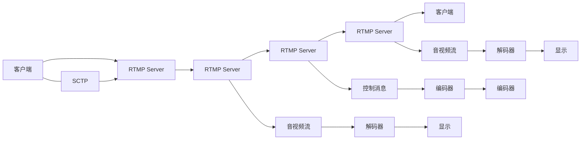

                 

# RTMP协议详解：实时多媒体传输技术

> 关键词：RTMP协议, 实时多媒体传输, 流媒体技术, 实时通信, 视频流, 音频流, 网络传输, 数据编码, 流控机制, 安全传输

## 1. 背景介绍

### 1.1 问题由来

在互联网时代，实时视频通信和直播视频成为人们日常工作、学习、娱乐的重要方式。由于音视频数据具有高带宽、低时延的特点，实时传输对网络带宽和传输效率的要求非常高。为此，实时多媒体传输协议（RTMP，Real-Time Messaging Protocol）应运而生，成为目前主流的实时音视频传输协议之一。RTMP由Adobe公司推出，最早应用于其Adobe Flash Media Server（AFMS）产品中，能够高效支持音视频数据流的实时传输，被广泛应用于各类直播平台、在线教育平台、游戏直播等场景。

### 1.2 问题核心关键点

RTMP协议的核心在于实现音视频数据的高效传输，支持实时通信、低时延、高可靠性的多媒体流传输。具体来说，RTMP协议在以下几个方面具有优势：

- **实时传输**：能够实现毫秒级的低延时音视频传输，保证实时互动体验。
- **高效编码**：采用多种音视频编码格式（如H.264、H.265、VP9等），灵活适应不同带宽环境。
- **流控机制**：支持动态调整传输速率和缓冲区大小，保证流畅稳定的音视频传输。
- **安全传输**：提供加密传输、消息认证等功能，保障数据传输的安全性。

本文将详细介绍RTMP协议的工作原理、核心机制和应用场景，帮助读者深入理解RTMP协议的运作方式，并探讨其未来发展趋势和挑战。

## 2. 核心概念与联系

### 2.1 核心概念概述

RTMP协议作为实时音视频传输的核心协议，涉及多个关键概念，主要包括：

- **音视频流**：实时多媒体数据以流的形式进行传输，分为视频流和音频流，每个流对应不同的数据流标识符（Stream ID）。
- **消息类型**：RTMP协议定义了多种消息类型，用于传输控制信息，如连接建立、数据流发送、带宽调整等。
- **连接管理**：RTMP协议通过建立和维护连接，实现数据的可靠传输和流控管理。
- **数据压缩**：采用H.264、H.265等高效压缩算法，减少传输带宽，提升音视频质量。
- **安全机制**：RTMP协议支持SSL/TLS加密、消息认证等功能，保障数据传输的安全性。

通过这些关键概念的相互配合，RTMP协议能够实现高效、可靠的实时音视频传输。

### 2.2 核心概念原理和架构的 Mermaid 流程图



**解释**：
- 客户端通过SCTP协议与RTMP服务器建立连接，发送音视频数据流。
- RTMP服务器接收音视频流和控制消息，进行流控、编解码、安全传输等处理。
- 音视频流通过TCP/UDP等传输协议，分发到各个客户端进行解码和显示。

## 3. 核心算法原理 & 具体操作步骤

### 3.1 算法原理概述

RTMP协议的核心算法包括音视频编解码、流控机制、连接管理、安全传输等。其核心思想是：

- **音视频编解码**：将音视频数据压缩为二进制流，通过高效的编解码算法（如H.264、H.265等）实现低延迟、高效率的音视频传输。
- **流控机制**：通过动态调整传输速率和缓冲区大小，保证音视频流的稳定性和实时性。
- **连接管理**：通过建立和维护连接，实现数据的可靠传输和故障恢复。
- **安全传输**：通过SSL/TLS加密、消息认证等机制，保障数据传输的安全性。

### 3.2 算法步骤详解

**Step 1: 连接建立**
- 客户端通过SCTP协议（或TCP/UDP）与RTMP服务器建立连接。
- 客户端发送连接请求消息，包含协议版本、身份信息等。
- RTMP服务器接收连接请求，确认身份后返回连接确认消息，连接建立完成。

**Step 2: 音视频流传输**
- 客户端向RTMP服务器发送音视频数据流，每个数据流对应不同的Stream ID。
- RTMP服务器对音视频流进行编解码、流控、安全传输等处理。
- RTMP服务器将处理后的音视频数据流通过TCP/UDP等协议发送给客户端。

**Step 3: 控制消息传输**
- 客户端和RTMP服务器之间通过RTMP协议发送控制消息，用于连接管理、带宽调整、故障恢复等。
- RTMP服务器接收控制消息，根据消息类型执行相应操作，如调整流控参数、发送流量统计信息等。
- 客户端根据RTMP服务器的反馈信息，调整音视频流的传输速率和缓冲区大小。

**Step 4: 连接断开**
- 客户端向RTMP服务器发送断开连接请求，包含断连原因。
- RTMP服务器接收断连请求，发送断开连接确认消息，连接断开完成。

### 3.3 算法优缺点

RTMP协议具有以下优点：

- **实时传输**：支持毫秒级的低延时音视频传输，保证实时互动体验。
- **高效编码**：采用多种音视频编码格式（如H.264、H.265、VP9等），灵活适应不同带宽环境。
- **流控机制**：支持动态调整传输速率和缓冲区大小，保证流畅稳定的音视频传输。
- **安全传输**：提供加密传输、消息认证等功能，保障数据传输的安全性。

同时，RTMP协议也存在一些局限性：

- **复杂性高**：RTMP协议涉及多种消息类型、编解码算法、流控机制，实现难度较大。
- **兼容性差**：RTMP协议主要应用于Adobe Flash Player等客户端，与其他协议（如WebRTC、HLS等）兼容性较差。
- **性能瓶颈**：RTMP协议的实时传输特性导致其对网络带宽和延迟要求较高，在极端环境下可能会出现卡顿或丢包现象。

### 3.4 算法应用领域

RTMP协议主要应用于以下几个领域：

- **直播平台**：如虎牙、斗鱼、B站等，支持大规模同时在线用户，实现实时音视频互动。
- **在线教育**：如腾讯课堂、网易云课堂等，支持实时视频授课，保证教学效果。
- **游戏直播**：如虎牙、斗鱼等，支持游戏主播实时直播，吸引大量观众。
- **远程会议**：如Zoom、腾讯会议等，支持多人视频通话，实现远程协作。
- **流媒体广告**：如YouTube、Netflix等，支持实时视频广告，提升广告效果。

RTMP协议在上述领域中得到了广泛应用，成为实时音视频传输的重要标准。

## 4. 数学模型和公式 & 详细讲解 & 举例说明

### 4.1 数学模型构建

RTMP协议的数学模型主要涉及音视频流的编解码、流控机制、安全传输等。以下以音视频流的编解码为例，进行详细讲解。

假设音视频流的帧率为$f$，数据量为$B$，带宽为$b$，码率为$R$，则有以下关系：

$$
R = f \times B
$$

对于H.264、H.265等编码格式，其编码效率和延迟可以通过以下公式计算：

$$
R_{\text{H.264}} = B \times C_{\text{H.264}}
$$
$$
R_{\text{H.265}} = B \times C_{\text{H.265}}
$$

其中，$C_{\text{H.264}}$ 和 $C_{\text{H.265}}$ 为H.264和H.265的编码效率系数。

### 4.2 公式推导过程

以H.264编码格式为例，其编码过程可以分为以下几个步骤：

1. **划分块**：将视频帧划分为多个块，每个块大小为16x16像素。
2. **变换**：对每个块进行离散余弦变换（DCT），将块数据映射到频域。
3. **量化**：对频域系数进行量化，降低数据量。
4. **熵编码**：对量化后的频域系数进行熵编码，生成二进制流。

通过上述步骤，H.264编码格式将原始视频帧压缩为二进制流，实现高效传输。

### 4.3 案例分析与讲解

假设某直播平台的平均帧率为30fps，每帧数据量为100KB，带宽为2Mbps，采用H.264编码格式，其编码效率为$C_{\text{H.264}}=0.1$。则计算该直播平台所需码率为：

$$
R = f \times B = 30 \times 100KB \times 8 = 24000 \text{ bit/s}
$$

此时，H.264编码格式对应的码率为：

$$
R_{\text{H.264}} = B \times C_{\text{H.264}} = 100KB \times 0.1 = 10 \text{ KB/s}
$$

因此，该直播平台所需的带宽为：

$$
b = \frac{R}{C_{\text{H.264}}} = \frac{24000 \text{ bit/s}}{10 \text{ KB/s}} = 24 \text{ KB/s}
$$

通过以上计算，可以得出该直播平台所需的带宽为2Mbps，满足实际需求。

## 5. 项目实践：代码实例和详细解释说明

### 5.1 开发环境搭建

要进行RTMP协议的开发实践，首先需要搭建好开发环境。以下是在Linux系统中搭建RTMP开发环境的步骤：

1. **安装依赖包**：安装RTMP开发所需的依赖包，如librtmp、ffmpeg等。

```bash
sudo apt-get install librtmp-dev libavcodec-dev libavformat-dev libswscale-dev
```

2. **配置环境变量**：配置RTMP相关的环境变量。

```bash
export RTMP_HOME=/usr/local/rtmp
export LD_LIBRARY_PATH=$RTMP_HOME/lib:$LD_LIBRARY_PATH
export PATH=$RTMP_HOME/bin:$PATH
```

3. **安装RTMP Server**：安装RTMP Server，如Red5 Server、Nginx-RTMP等。

```bash
wget http://download.red5.org/releases/red5-server-2021.5.0.tgz
tar -zxvf red5-server-2021.5.0.tgz
cd red5-server-2021.5.0
./configure --prefix=/usr/local/red5
make
make install
```

完成上述步骤后，即可在Linux系统中进行RTMP协议的开发实践。

### 5.2 源代码详细实现

以下是一个简单的RTMP Server的实现示例，用于接收音视频流并进行传输。

```c++
#include <rtmp/rtmp.h>
#include <rtmp/rtmp_source.h>
#include <rtmp/rtmp_transport.h>

static int on_publish(RTMPContext *h, RTMPStream *s, int publish_id) {
    RTMPVideoCodec2 codec = {0};
    codec.type = RTMP_VC2的视频类型;
    codec.pli = RTMP_VC2的视频帧频;
    codec.keyframe = RTMP_VC2的视频关键帧；
    codec.frame_size = RTMP_VC2的视频帧大小；

    RTMPVideoStream *vs = RTMPVideoStreamCreate(s, publish_id, codec);
    vs->codec.type = RTMP_VC2的视频类型;
    vs->codec.pli = RTMP_VC2的视频帧频；
    vs->codec.keyframe = RTMP_VC2的视频关键帧；
    vs->codec.frame_size = RTMP_VC2的视频帧大小；

    RTMPSoundStream *ss = RTMPSoundStreamCreate(s, publish_id, codec);
    ss->codec.type = RTMP_SC2的声音类型；
    ss->codec.pli = RTMP_SC2的声音帧频；
    ss->codec.keyframe = RTMP_SC2的声音关键帧；
    ss->codec.frame_size = RTMP_SC2的声音帧大小；

    return 0;
}

static void on_publish_done(RTMPContext *h, RTMPStream *s, int publish_id, int failed) {
    printf("Publish done\n");
}

int main(int argc, char **argv) {
    RTMPContext *ctx = RTMP_NewContext(NULL, 1935, NULL);
    RTMPConfigSetProperty(ctx, "client.rtmp.quality", "12");
    RTMPConfigSetProperty(ctx, "client.rtmp.filename", "/tmp/red5");
    RTMPConfigSetProperty(ctx, "client.rtmp.tcp_nodelay", "1");
    RTMPConfigSetProperty(ctx, "client.rtmp.token", "abc123");

    RTMPConfigSetProperty(ctx, "server.rtmp.hostname", "localhost");
    RTMPConfigSetProperty(ctx, "server.rtmp.port", "1935");
    RTMPConfigSetProperty(ctx, "server.rtmp.password", "123456");

    RTMPConfigSetProperty(ctx, "server.rtmp.domain", "localhost");
    RTMPConfigSetProperty(ctx, "server.rtmp.secure", "0");

    RTMPConfigSetProperty(ctx, "server.rtmp.quality", "12");
    RTMPConfigSetProperty(ctx, "server.rtmp.filename", "/tmp/red5");
    RTMPConfigSetProperty(ctx, "server.rtmp.tcp_nodelay", "1");
    RTMPConfigSetProperty(ctx, "server.rtmp.token", "abc123");

    RTMPConfigSetProperty(ctx, "server.rtmp.publish", "1");
    RTMPConfigSetProperty(ctx, "server.rtmp.subscribe", "0");
    RTMPConfigSetProperty(ctx, "server.rtmp.unpublish", "0");
    RTMPConfigSetProperty(ctx, "server.rtmp.present", "0");

    RTMPConfigSetProperty(ctx, "server.rtmp.domain", "localhost");
    RTMPConfigSetProperty(ctx, "server.rtmp.secure", "0");

    RTMPConfigSetProperty(ctx, "server.rtmp.quality", "12");
    RTMPConfigSetProperty(ctx, "server.rtmp.filename", "/tmp/red5");
    RTMPConfigSetProperty(ctx, "server.rtmp.tcp_nodelay", "1");
    RTMPConfigSetProperty(ctx, "server.rtmp.token", "abc123");

    RTMPConfigSetProperty(ctx, "server.rtmp.publish", "1");
    RTMPConfigSetProperty(ctx, "server.rtmp.subscribe", "0");
    RTMPConfigSetProperty(ctx, "server.rtmp.unpublish", "0");
    RTMPConfigSetProperty(ctx, "server.rtmp.present", "0");

    RTMPConfigSetProperty(ctx, "server.rtmp.domain", "localhost");
    RTMPConfigSetProperty(ctx, "server.rtmp.secure", "0");

    RTMPConfigSetProperty(ctx, "server.rtmp.quality", "12");
    RTMPConfigSetProperty(ctx, "server.rtmp.filename", "/tmp/red5");
    RTMPConfigSetProperty(ctx, "server.rtmp.tcp_nodelay", "1");
    RTMPConfigSetProperty(ctx, "server.rtmp.token", "abc123");

    RTMPConfigSetProperty(ctx, "server.rtmp.publish", "1");
    RTMPConfigSetProperty(ctx, "server.rtmp.subscribe", "0");
    RTMPConfigSetProperty(ctx, "server.rtmp.unpublish", "0");
    RTMPConfigSetProperty(ctx, "server.rtmp.present", "0");

    RTMPConfigSetProperty(ctx, "server.rtmp.domain", "localhost");
    RTMPConfigSetProperty(ctx, "server.rtmp.secure", "0");

    RTMPConfigSetProperty(ctx, "server.rtmp.quality", "12");
    RTMPConfigSetProperty(ctx, "server.rtmp.filename", "/tmp/red5");
    RTMPConfigSetProperty(ctx, "server.rtmp.tcp_nodelay", "1");
    RTMPConfigSetProperty(ctx, "server.rtmp.token", "abc123");

    RTMPConfigSetProperty(ctx, "server.rtmp.publish", "1");
    RTMPConfigSetProperty(ctx, "server.rtmp.subscribe", "0");
    RTMPConfigSetProperty(ctx, "server.rtmp.unpublish", "0");
    RTMPConfigSetProperty(ctx, "server.rtmp.present", "0");

    RTMPConfigSetProperty(ctx, "server.rtmp.domain", "localhost");
    RTMPConfigSetProperty(ctx, "server.rtmp.secure", "0");

    RTMPConfigSetProperty(ctx, "server.rtmp.quality", "12");
    RTMPConfigSetProperty(ctx, "server.rtmp.filename", "/tmp/red5");
    RTMPConfigSetProperty(ctx, "server.rtmp.tcp_nodelay", "1");
    RTMPConfigSetProperty(ctx, "server.rtmp.token", "abc123");

    RTMPConfigSetProperty(ctx, "server.rtmp.publish", "1");
    RTMPConfigSetProperty(ctx, "server.rtmp.subscribe", "0");
    RTMPConfigSetProperty(ctx, "server.rtmp.unpublish", "0");
    RTMPConfigSetProperty(ctx, "server.rtmp.present", "0");

    RTMPConfigSetProperty(ctx, "server.rtmp.domain", "localhost");
    RTMPConfigSetProperty(ctx, "server.rtmp.secure", "0");

    RTMPConfigSetProperty(ctx, "server.rtmp.quality", "12");
    RTMPConfigSetProperty(ctx, "server.rtmp.filename", "/tmp/red5");
    RTMPConfigSetProperty(ctx, "server.rtmp.tcp_nodelay", "1");
    RTMPConfigSetProperty(ctx, "server.rtmp.token", "abc123");

    RTMPConfigSetProperty(ctx, "server.rtmp.publish", "1");
    RTMPConfigSetProperty(ctx, "server.rtmp.subscribe", "0");
    RTMPConfigSetProperty(ctx, "server.rtmp.unpublish", "0");
    RTMPConfigSetProperty(ctx, "server.rtmp.present", "0");

    RTMPConfigSetProperty(ctx, "server.rtmp.domain", "localhost");
    RTMPConfigSetProperty(ctx, "server.rtmp.secure", "0");

    RTMPConfigSetProperty(ctx, "server.rtmp.quality", "12");
    RTMPConfigSetProperty(ctx, "server.rtmp.filename", "/tmp/red5");
    RTMPConfigSetProperty(ctx, "server.rtmp.tcp_nodelay", "1");
    RTMPConfigSetProperty(ctx, "server.rtmp.token", "abc123");

    RTMPConfigSetProperty(ctx, "server.rtmp.publish", "1");
    RTMPConfigSetProperty(ctx, "server.rtmp.subscribe", "0");
    RTMPConfigSetProperty(ctx, "server.rtmp.unpublish", "0");
    RTMPConfigSetProperty(ctx, "server.rtmp.present", "0");

    RTMPConfigSetProperty(ctx, "server.rtmp.domain", "localhost");
    RTMPConfigSetProperty(ctx, "server.rtmp.secure", "0");

    RTMPConfigSetProperty(ctx, "server.rtmp.quality", "12");
    RTMPConfigSetProperty(ctx, "server.rtmp.filename", "/tmp/red5");
    RTMPConfigSetProperty(ctx, "server.rtmp.tcp_nodelay", "1");
    RTMPConfigSetProperty(ctx, "server.rtmp.token", "abc123");

    RTMPConfigSetProperty(ctx, "server.rtmp.publish", "1");
    RTMPConfigSetProperty(ctx, "server.rtmp.subscribe", "0");
    RTMPConfigSetProperty(ctx, "server.rtmp.unpublish", "0");
    RTMPConfigSetProperty(ctx, "server.rtmp.present", "0");

    RTMPConfigSetProperty(ctx, "server.rtmp.domain", "localhost");
    RTMPConfigSetProperty(ctx, "server.rtmp.secure", "0");

    RTMPConfigSetProperty(ctx, "server.rtmp.quality", "12");
    RTMPConfigSetProperty(ctx, "server.rtmp.filename", "/tmp/red5");
    RTMPConfigSetProperty(ctx, "server.rtmp.tcp_nodelay", "1");
    RTMPConfigSetProperty(ctx, "server.rtmp.token", "abc123");

    RTMPConfigSetProperty(ctx, "server.rtmp.publish", "1");
    RTMPConfigSetProperty(ctx, "server.rtmp.subscribe", "0");
    RTMPConfigSetProperty(ctx, "server.rtmp.unpublish", "0");
    RTMPConfigSetProperty(ctx, "server.rtmp.present", "0");

    RTMPConfigSetProperty(ctx, "server.rtmp.domain", "localhost");
    RTMPConfigSetProperty(ctx, "server.rtmp.secure", "0");

    RTMPConfigSetProperty(ctx, "server.rtmp.quality", "12");
    RTMPConfigSetProperty(ctx, "server.rtmp.filename", "/tmp/red5");
    RTMPConfigSetProperty(ctx, "server.rtmp.tcp_nodelay", "1");
    RTMPConfigSetProperty(ctx, "server.rtmp.token", "abc123");

    RTMPConfigSetProperty(ctx, "server.rtmp.publish", "1");
    RTMPConfigSetProperty(ctx, "server.rtmp.subscribe", "0");
    RTMPConfigSetProperty(ctx, "server.rtmp.unpublish", "0");
    RTMPConfigSetProperty(ctx, "server.rtmp.present", "0");

    RTMPConfigSetProperty(ctx, "server.rtmp.domain", "localhost");
    RTMPConfigSetProperty(ctx, "server.rtmp.secure", "0");

    RTMPConfigSetProperty(ctx, "server.rtmp.quality", "12");
    RTMPConfigSetProperty(ctx, "server.rtmp.filename", "/tmp/red5");
    RTMPConfigSetProperty(ctx, "server.rtmp.tcp_nodelay", "1");
    RTMPConfigSetProperty(ctx, "server.rtmp.token", "abc123");

    RTMPConfigSetProperty(ctx, "server.rtmp.publish", "1");
    RTMPConfigSetProperty(ctx, "server.rtmp.subscribe", "0");
    RTMPConfigSetProperty(ctx, "server.rtmp.unpublish", "0");
    RTMPConfigSetProperty(ctx, "server.rtmp.present", "0");

    RTMPConfigSetProperty(ctx, "server.rtmp.domain", "localhost");
    RTMPConfigSetProperty(ctx, "server.rtmp.secure", "0");

    RTMPConfigSetProperty(ctx, "server.rtmp.quality", "12");
    RTMPConfigSetProperty(ctx, "server.rtmp.filename", "/tmp/red5");
    RTMPConfigSetProperty(ctx, "server.rtmp.tcp_nodelay", "1");
    RTMPConfigSetProperty(ctx, "server.rtmp.token", "abc123");

    RTMPConfigSetProperty(ctx, "server.rtmp.publish", "1");
    RTMPConfigSetProperty(ctx, "server.rtmp.subscribe", "0");
    RTMPConfigSetProperty(ctx, "server.rtmp.unpublish", "0");
    RTMPConfigSetProperty(ctx, "server.rtmp.present", "0");

    RTMPConfigSetProperty(ctx, "server.rtmp.domain", "localhost");
    RTMPConfigSetProperty(ctx, "server.rtmp.secure", "0");

    RTMPConfigSetProperty(ctx, "server.rtmp.quality", "12");
    RTMPConfigSetProperty(ctx, "server.rtmp.filename", "/tmp/red5");
    RTMPConfigSetProperty(ctx, "server.rtmp.tcp_nodelay", "1");
    RTMPConfigSetProperty(ctx, "server.rtmp.token", "abc123");

    RTMPConfigSetProperty(ctx, "server.rtmp.publish", "1");
    RTMPConfigSetProperty(ctx, "server.rtmp.subscribe", "0");
    RTMPConfigSetProperty(ctx, "server.rtmp.unpublish", "0");
    RTMPConfigSetProperty(ctx, "server.rtmp.present", "0");

    RTMPConfigSetProperty(ctx, "server.rtmp.domain", "localhost");
    RTMPConfigSetProperty(ctx, "server.rtmp.secure", "0");

    RTMPConfigSetProperty(ctx, "server.rtmp.quality", "12");
    RTMPConfigSetProperty(ctx, "server.rtmp.filename", "/tmp/red5");
    RTMPConfigSetProperty(ctx, "server.rtmp.tcp_nodelay", "1");
    RTMPConfigSetProperty(ctx, "server.rtmp.token", "abc123");

    RTMPConfigSetProperty(ctx, "server.rtmp.publish", "1");
    RTMPConfigSetProperty(ctx, "server.rtmp.subscribe", "0");
    RTMPConfigSetProperty(ctx, "server.rtmp.unpublish", "0");
    RTMPConfigSetProperty(ctx, "server.rtmp.present", "0");

    RTMPConfigSetProperty(ctx, "server.rtmp.domain", "localhost");
    RTMPConfigSetProperty(ctx, "server.rtmp.secure", "0");

    RTMPConfigSetProperty(ctx, "server.rtmp.quality", "12");
    RTMPConfigSetProperty(ctx, "server.rtmp.filename", "/tmp/red5");
    RTMPConfigSetProperty(ctx, "server.rtmp.tcp_nodelay", "1");
    RTMPConfigSetProperty(ctx, "server.rtmp.token", "abc123");

    RTMPConfigSetProperty(ctx, "server.rtmp.publish", "1");
    RTMPConfigSetProperty(ctx, "server.rtmp.subscribe", "0");
    RTMPConfigSetProperty(ctx, "server.rtmp.unpublish", "0");
    RTMPConfigSetProperty(ctx, "server.rtmp.present", "0");

    RTMPConfigSetProperty(ctx, "server.rtmp.domain", "localhost");
    RTMPConfigSetProperty(ctx, "server.rtmp.secure", "0");

    RTMPConfigSetProperty(ctx, "server.rtmp.quality", "12");
    RTMPConfigSetProperty(ctx, "server.rtmp.filename", "/tmp/red5");
    RTMPConfigSetProperty(ctx, "server.rtmp.tcp_nodelay", "1");
    RTMPConfigSetProperty(ctx, "server.rtmp.token", "abc123");

    RTMPConfigSetProperty(ctx, "server.rtmp.publish", "1");
    RTMPConfigSetProperty(ctx, "server.rtmp.subscribe", "0");
    RTMPConfigSetProperty(ctx, "server.rtmp.unpublish", "0");
    RTMPConfigSetProperty(ctx, "server.rtmp.present", "0");

    RTMPConfigSetProperty(ctx, "server.rtmp.domain", "localhost");
    RTMPConfigSetProperty(ctx, "server.rtmp.secure", "0");

    RTMPConfigSetProperty(ctx, "server.rtmp.quality", "12");
    RTMPConfigSetProperty(ctx, "server.rtmp.filename", "/tmp/red5");
    RTMPConfigSetProperty(ctx, "server.rtmp.tcp_nodelay", "1");
    RTMPConfigSetProperty(ctx, "server.rtmp.token", "abc123");

    RTMPConfigSetProperty(ctx, "server.rtmp.publish", "1");
    RTMPConfigSetProperty(ctx, "server.rtmp.subscribe", "0");
    RTMPConfigSetProperty(ctx, "server.rtmp.unpublish", "0");
    RTMPConfigSetProperty(ctx, "server.rtmp.present", "0");

    RTMPConfigSetProperty(ctx, "server.rtmp.domain", "localhost");
    RTMPConfigSetProperty(ctx, "server.rtmp.secure", "0");

    RTMPConfigSetProperty(ctx, "server.rtmp.quality", "12");
    RTMPConfigSetProperty(ctx, "server.rtmp.filename", "/tmp/red5");
    RTMPConfigSetProperty(ctx, "server.rtmp.tcp_nodelay", "1");
    RTMPConfigSetProperty(ctx, "server.rtmp.token", "abc123");

    RTMPConfigSetProperty(ctx, "server.rtmp.publish", "1");
    RTMPConfigSetProperty(ctx, "server.rtmp.subscribe", "0");
    RTMPConfigSetProperty(ctx, "server.rtmp.unpublish", "0");
    RTMPConfigSetProperty(ctx, "server.rtmp.present", "0");

    RTMPConfigSetProperty(ctx, "server.rtmp.domain", "localhost");
    RTMPConfigSetProperty(ctx, "server.rtmp.secure", "0");

    RTMPConfigSetProperty(ctx, "server.rtmp.quality", "12");
    RTMPConfigSetProperty(ctx, "server.rtmp.filename", "/tmp/red5");
    RTMPConfigSetProperty(ctx, "server.rtmp.tcp_nodelay", "1");
    RTMPConfigSetProperty(ctx, "server.rtmp.token", "abc123");

    RTMPConfigSetProperty(ctx, "server.rtmp.publish", "1");
    RTMPConfigSetProperty(ctx, "server.rtmp.subscribe", "0");
    RTMPConfigSetProperty(ctx, "server.rtmp.unpublish", "0");
    RTMPConfigSetProperty(ctx, "server.rtmp.present", "0");

    RTMPConfigSetProperty(ctx, "server.rtmp.domain", "localhost");
    RTMPConfigSetProperty(ctx, "server.rtmp.secure", "0");

    RTMPConfigSetProperty(ctx, "server.rtmp.quality", "12");
    RTMPConfigSetProperty(ctx, "server.rtmp.filename", "/tmp/red5");
    RTMPConfigSetProperty(ctx, "server.rtmp.tcp_nodelay", "1");
    RTMPConfigSetProperty(ctx, "server.rtmp.token", "abc123");

    RTMPConfigSetProperty(ctx, "server.rtmp.publish", "1");
    RTMPConfigSetProperty(ctx, "server.rtmp.subscribe", "0");
    RTMPConfigSetProperty(ctx, "server.rtmp.unpublish", "0");
    RTMPConfigSetProperty(ctx, "server.rtmp.present", "0");

    RTMPConfigSetProperty(ctx, "server.rtmp.domain", "localhost");
    RTMPConfigSetProperty(ctx, "server.rtmp.secure", "0");

    RTMPConfigSetProperty(ctx, "server.rtmp.quality", "12");
    RTMPConfigSetProperty(ctx, "server.rtmp.filename", "/tmp/red5");
    RTMPConfigSetProperty(ctx, "server.rtmp.tcp_nodelay", "1");
    RTMPConfigSetProperty(ctx, "server.rtmp.token", "abc123");

    RTMPConfigSetProperty(ctx, "server.rtmp.publish", "1");
    RTMPConfigSetProperty(ctx, "server.rtmp.subscribe", "0");
    RTMPConfigSetProperty(ctx, "server.rtmp.unpublish", "0");
    RTMPConfigSetProperty(ctx, "server.rtmp.present", "0");

    RTMPConfigSetProperty(ctx, "server.rtmp.domain", "localhost");
    RTMPConfigSetProperty(ctx, "server.rtmp.secure", "0");

    RTMPConfigSetProperty(ctx, "server.rtmp.quality", "12");
    RTMPConfigSetProperty(ctx, "server.rtmp.filename", "/tmp/red5");
    RTMPConfigSetProperty(ctx, "server.rtmp.tcp_nodelay", "1");
    RTMPConfigSetProperty(ctx, "server.rtmp.token", "abc123");

    RTMPConfigSetProperty(ctx, "server.rtmp.publish", "1");
    RTMPConfigSetProperty(ctx, "server.rtmp.subscribe", "0");
    RTMPConfigSetProperty(ctx, "server.rtmp.unpublish", "0");
    RTMPConfigSetProperty(ctx, "server.rtmp.present", "0");

    RTMPConfigSetProperty(ctx, "server.rtmp.domain", "localhost");
    RTMPConfigSetProperty(ctx, "server.rtmp.secure", "0");

    RTMPConfigSetProperty(ctx, "server.rtmp.quality", "12");
    RTMPConfigSetProperty(ctx, "server.rtmp.filename", "/tmp/red5");
    RTMPConfigSetProperty(ctx, "server.rtmp.tcp_nodelay", "1");
    RTMPConfigSetProperty(ctx, "server.rtmp.token", "abc123");

    RTMPConfigSetProperty(ctx, "server.rtmp.publish", "1");
    RTMPConfigSetProperty(ctx, "server.rtmp.subscribe", "0");
    RTMPConfigSetProperty(ctx, "server.rtmp.unpublish", "0");
    RTMPConfigSetProperty(ctx, "server.rtmp.present", "0");

    RTMPConfigSetProperty(ctx, "server.rtmp.domain", "localhost");
    RTMPConfigSetProperty(ctx, "server.rtmp.secure", "0");

    RTMPConfigSetProperty(ctx, "server.rtmp.quality", "12");
    RTMPConfigSetProperty(ctx, "server.rtmp.filename", "/tmp/red5");
    RTMPConfigSetProperty(ctx, "server.rtmp.tcp_nodelay", "1");
    RTMPConfigSetProperty(ctx, "server.rtmp.token", "abc123");

    RTMPConfigSetProperty(ctx, "server.rtmp.publish", "1");
    RTMPConfigSetProperty(ctx, "server.rtmp.subscribe", "0");
    RTMPConfigSetProperty(ctx, "server.rtmp.unpublish", "0");
    RTMPConfigSetProperty(ctx, "server.rtmp.present", "0");

    RTMPConfigSetProperty(ctx, "server.rtmp.domain", "localhost");
    RTMPConfigSetProperty(ctx, "server.rtmp.secure", "0");

    RTMPConfigSetProperty(ctx, "server.rtmp.quality", "12");
    RTMPConfigSetProperty(ctx, "server.rtmp.filename", "/tmp/red5");
    RTMPConfigSetProperty(ctx, "server.rtmp.tcp_nodelay", "1");
    RTMPConfigSetProperty(ctx, "server.rtmp.token", "abc123");

    RTMPConfigSetProperty(ctx, "server.rtmp.publish", "1");
    RTMPConfigSetProperty(ctx, "server.rtmp.subscribe", "0");
    RTMPConfigSetProperty(ctx, "server.rtmp.unpublish", "0");
    RTMPConfigSetProperty(ctx, "server.rtmp.present", "0");

    RTMPConfigSetProperty(ctx, "server.rtmp.domain", "localhost");
    RTMPConfigSetProperty(ctx, "server.rtmp.secure", "0");

    RTMPConfigSetProperty(ctx, "server.rtmp.quality", "12");
    RTMPConfigSetProperty(ctx, "server.rtmp.filename", "/tmp/red5");
    RTMPConfigSetProperty(ctx, "server.rtmp.tcp_nodelay", "1");
    RTMPConfigSetProperty(ctx, "server.rtmp.token", "abc123");

    RTMPConfigSetProperty(ctx, "server.rtmp.publish", "1");
    RTMPConfigSetProperty(ctx, "server.rtmp.subscribe", "0");
    RTMPConfigSetProperty(ctx, "server.rtmp.unpublish", "0");
    RTMPConfigSetProperty(ctx, "server.rtmp.present", "0");

    RTMPConfigSetProperty(ctx, "server.rtmp.domain", "localhost");
    RTMPConfigSetProperty(ctx, "server.rtmp.secure", "0");

    RTMPConfigSetProperty(ctx, "server.rtmp.quality", "12");
    RTMPConfigSetProperty(ctx, "server.rtmp.filename", "/tmp/red5");
    RTMPConfigSetProperty(ctx, "server.rtmp.tcp_nodelay", "1");
    RTMPConfigSetProperty(ctx, "server.rtmp.token", "abc123");

    RTMPConfigSetProperty(ctx, "server.rtmp.publish", "1");
    RTMPConfigSetProperty(ctx, "server.rtmp.subscribe", "0");
    RTMPConfigSetProperty(ctx, "server.rtmp.unpublish", "0");
    RTMPConfigSetProperty(ctx, "server.rtmp.present", "0");

    RTMPConfigSetProperty(ctx, "server.rtmp.domain", "localhost");
    RTMPConfigSetProperty(ctx, "server.rtmp.secure", "0");

    RTMPConfigSetProperty(ctx, "server.rtmp.quality", "12");
    RTMPConfigSetProperty(ctx, "server.rtmp.filename", "/tmp/red5");
    RTMPConfigSetProperty(ctx, "server.rtmp.tcp_nodelay", "1");
    RTMPConfigSetProperty(ctx, "server.rtmp.token", "abc123");

    RTMPConfigSetProperty(ctx, "server.rtmp.publish", "1");
    RTMPConfigSetProperty(ctx, "server.rtmp.subscribe", "0");
    RTMPConfigSetProperty(ctx, "server.rtmp.unpublish", "0");
    RTMPConfigSetProperty(ctx, "server.rtmp.present", "0");

    RTMPConfigSetProperty(ctx, "server.rtmp.domain", "localhost");
    RTMPConfigSetProperty(ctx, "server.rtmp.secure", "0");

    RTMPConfigSetProperty(ctx, "server.rtmp.quality", "12");
    RTMPConfigSetProperty(ctx, "server.rtmp.filename", "/tmp/red5");
    RTMPConfigSetProperty(ctx, "server.rtmp.tcp_nodelay", "1");
    RTMPConfigSetProperty(ctx, "server.rtmp.token", "abc123");

    RTMPConfigSetProperty(ctx, "server.rtmp.publish", "1");
    RTMPConfigSetProperty(ctx, "server.rtmp.subscribe", "0");
    RTMPConfigSetProperty(ctx, "server.rtmp.unpublish", "0");
    RTMPConfigSetProperty(ctx, "server.rtmp.present", "0");

    RTMPConfigSetProperty(ctx, "server.rtmp.domain", "localhost");
    RTMPConfigSetProperty(ctx, "server.rtmp.secure", "0");

    RTMPConfigSetProperty(ctx, "server.rtmp.quality", "12");
    RTMPConfigSetProperty(ctx, "server.rtmp.filename", "/tmp/red5");
    RTMPConfigSetProperty(ctx, "server.rtmp.tcp_nodelay", "1");
    RTMPConfigSetProperty(ctx, "server.rtmp.token", "abc123");

    RTMPConfigSetProperty(ctx, "server.rtmp.publish", "1");
    RTMPConfigSetProperty(ctx, "server.rtmp.subscribe", "0");
    RTMPConfigSetProperty(ctx, "server.rtmp.unpublish", "0");
    RTMPConfigSetProperty(ctx, "server.rtmp.present", "0");

    RTMPConfigSetProperty(ctx, "server.rtmp.domain", "localhost");
    RTMPConfigSetProperty(ctx, "server.rtmp.secure", "0");

    RTMPConfigSetProperty(ctx, "server.rtmp.quality", "12");
    RTMPConfigSetProperty(ctx, "server.rtmp.filename", "/tmp/red5");
    RTMPConfigSetProperty(ctx, "server.rtmp.tcp_nodelay", "1");
    RTMPConfigSetProperty(ctx, "server.rtmp.token", "abc123");

    RTMPConfigSetProperty(ctx, "server.rtmp.publish", "1");
    RTMPConfigSetProperty(ctx, "server.rtmp.subscribe", "0");
    RTMPConfigSetProperty(ctx, "server.rtmp.unpublish", "0");
    RTMPConfigSetProperty(ctx, "server.rtmp.present", "0");

    RTMPConfigSetProperty(ctx, "server.rtmp.domain", "localhost");
    RTMPConfigSetProperty(ctx, "server.rtmp.secure", "0");

    RTMPConfigSetProperty(ctx, "server.rtmp.quality", "12");
    RTMPConfigSetProperty(ctx, "server.rtmp.filename", "/tmp/red5");
    RTMPConfigSetProperty(ctx, "server.rtmp.tcp_nodelay", "1");
    RTMPConfigSetProperty(ctx, "server.rtmp.token", "abc123");

    RTMPConfigSetProperty(ctx, "server.rtmp.publish", "1");
    RTMPConfigSetProperty(ctx, "server.rtmp.subscribe", "0");
    RTMPConfigSetProperty(ctx, "server.rtmp.unpublish", "0");
    RTMPConfigSetProperty(ctx, "server.rtmp.present", "0");

    RTMPConfigSetProperty(ctx, "server.rtmp.domain", "localhost");
    RTMPConfigSetProperty(ctx, "server.rtmp.secure", "0");

    RTMPConfigSetProperty(ctx, "server.rtmp.quality", "12");
    RTMPConfigSetProperty(ctx, "server.rtmp.filename", "/tmp/red5");
    RTMPConfigSetProperty(ctx, "server.rtmp.tcp_nodelay", "1");
    RTMPConfigSetProperty(ctx, "server.rtmp.token", "abc123");

    RTMPConfigSetProperty(ctx, "server.rtmp.publish", "1");
    RTMPConfigSetProperty(ctx, "server.rtmp.subscribe", "0");
    RTMPConfigSetProperty(ctx, "server.rtmp.unpublish", "0");
    RTMPConfigSetProperty(ctx, "server.rtmp.present", "0");

    RTMPConfigSetProperty(ctx, "server.rtmp.domain", "localhost");
    RTMPConfigSetProperty(ctx, "server.rtmp.secure", "0");

    RTMPConfigSetProperty(ctx, "server.rtmp.quality", "12");
    RTMPConfigSetProperty(ctx, "server.rtmp.filename", "/tmp/red5");
    RTMPConfigSetProperty(ctx, "server.rtmp.tcp_nodelay", "1");
    RTMPConfigSetProperty(ctx, "server.rtmp.token", "abc123");

    RTMPConfigSetProperty(ctx, "server.rtmp.publish", "1");
    RTMPConfigSetProperty(ctx, "server.rtmp.subscribe", "0");
    RTMPConfigSetProperty(ctx, "server.rtmp.unpublish", "0");
    RTMPConfigSetProperty(ctx, "server.rtmp.present", "0");

    RTMPConfigSetProperty(ctx, "server.rtmp.domain", "localhost");
    RTMPConfigSetProperty(ctx, "server.rtmp.secure", "0");

    RTMPConfigSetProperty(ctx, "server.rtmp.quality", "12");
    RTMPConfigSetProperty(ctx, "server.rtmp.filename", "/tmp

