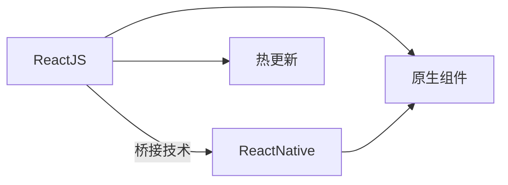

                 

# React Native 跨平台开发：高效的移动应用

> 关键词：React Native, 跨平台开发, 移动应用, 前端开发, JavaScript, 跨平台性能, 兼容性, 热更新, 组件重用, 第三方库, 应用开发, 应用程序, 前端开发社区

## 1. 背景介绍

随着移动互联网的迅速发展，越来越多的企业开始考虑开发跨平台的移动应用，以提升用户的使用体验和开发效率。传统的iOS和Android开发方式，需要分别维护两个不同的代码库，增加了开发和维护成本。此外，面对不同平台的技术栈差异，不同团队的合作也变得复杂。React Native作为Facebook推出的一款跨平台开发框架，通过JavaScript和原生组件的结合，大大简化了跨平台的开发工作，从而得到了业界的广泛应用。

本文将全面介绍React Native跨平台开发的核心概念和基本原理，通过分析React Native的架构、组件、API和性能等方面，深入探讨其在跨平台开发中的优势和劣势，并对比其与其他跨平台框架（如Ionic、Xamarin、Flutter等）的差异，最后结合实际应用场景，给出React Native在实际开发中的应用建议和未来展望。

## 2. 核心概念与联系

### 2.1 核心概念概述

为了更好地理解React Native，我们首先需要明确几个关键概念：

- **React Native**：基于React开发框架，通过桥接技术将JavaScript代码转换为原生代码运行在移动设备上的跨平台移动开发框架。
- **跨平台开发**：指通过一次编码，同时生成多种移动平台的应用程序。例如，通过React Native编写的代码可以在iOS和Android上同时运行。
- **原生组件**：指使用平台原生代码实现的UI组件，例如iOS的UIView，Android的View。
- **桥接技术**：指React Native中的JavaScript代码和原生代码之间的通信技术。
- **热更新**：指React Native中的组件和代码可以直接更新到用户手中，而无需重新安装应用。

这些概念之间存在紧密的联系，核心思想是将前端开发的思维方式应用于移动应用开发，通过一套代码同时适配不同平台，提升开发效率和代码复用性。

### 2.2 核心概念原理和架构的 Mermaid 流程图



这个图展示了React Native的基本架构：通过ReactJS将JavaScript代码转换为原生组件在移动设备上运行，同时实现热更新功能，提升用户体验和开发效率。

## 3. 核心算法原理 & 具体操作步骤

### 3.1 算法原理概述

React Native的核心算法原理基于桥接技术和JavaScript和原生组件的结合，具体步骤如下：

1. **代码编写**：开发者使用JavaScript编写代码，通过React组件树构建UI界面。
2. **桥接技术**：React Native通过桥接技术，将JavaScript代码转换为原生代码，实现跨平台支持。
3. **原生渲染**：原生代码在移动设备上运行，完成UI渲染和交互。
4. **热更新**：React Native通过JavaScript层的变更实时更新原生层的代码，提升用户体验。

这个过程中，JavaScript层和原生层通过Bridge进行通信，Bridge的作用是将JavaScript代码转换为原生代码，并完成数据传输。React Native通过Bridge实现了JavaScript层和原生层的分离，使得开发者可以专注于前端开发，提升开发效率。

### 3.2 算法步骤详解

下面，我们将详细讲解React Native的核心算法步骤：

**Step 1: 代码编写和组件构建**

在React Native中，开发者使用JavaScript编写代码，通过React组件树构建UI界面。例如，可以通过以下代码创建一个按钮组件：

```javascript
import React from 'react';
import { Button } from 'react-native';

const MyButton = () => {
  return (
    <Button
      title="Click Me"
      onPress={() => console.log('Button clicked')}
    />
  );
};

export default MyButton;
```

这个代码创建了一个简单的按钮组件，包含了按钮的标题和点击事件处理函数。

**Step 2: 桥接技术转换**

React Native通过Bridge技术将JavaScript代码转换为原生代码。在Android平台上，Bridge是通过JavascriptCore实现的，而在iOS平台上，Bridge是通过ObjC实现的。例如，通过以下代码可以访问原生代码：

```javascript
import React from 'react';
import { PermissionsAndroid } from 'react-native';

PermissionsAndroid.request('CAMERA') 
  .then(({ granted }) => {
    if (granted) {
      console.log('Camera permission granted');
    } else {
      console.log('Camera permission denied');
    }
  });
```

这个代码请求了相机权限，通过Bridge访问了Android平台的PermissionsAndroid原生代码。

**Step 3: 原生渲染和热更新**

React Native中的原生代码在移动设备上运行，完成UI渲染和交互。同时，React Native实现了热更新功能，使得开发者可以实时更新代码，提升用户体验。例如，通过以下代码可以实现热更新：

```javascript
import React from 'react';
import { Text } from 'react-native';

const MyText = ({ text }) => {
  return (
    <Text>{text}</Text>
  );
};

export default MyText;
```

这个代码创建了一个文本组件，可以通过热更新实时更新文本内容。

### 3.3 算法优缺点

React Native作为一款跨平台开发框架，具有以下优点：

- **高效开发**：通过JavaScript和原生组件的结合，开发者可以高效地开发跨平台应用。
- **快速迭代**：热更新功能使得开发者可以实时更新代码，提升开发效率。
- **代码复用**：开发者可以重用前端开发的经验，提升开发效率。
- **跨平台支持**：React Native支持iOS和Android平台，提升开发和维护效率。

同时，React Native也存在一些缺点：

- **性能问题**：由于部分组件依赖原生代码，性能可能会受到一定影响。
- **兼容性问题**：不同平台间的原生代码差异较大，可能导致兼容性问题。
- **调试问题**：开发者需要同时调试JavaScript层和原生层，增加了调试难度。

### 3.4 算法应用领域

React Native广泛应用于各种跨平台应用开发，例如：

- **社交应用**：如WhatsApp、Facebook等社交应用，通过React Native可以快速开发和维护。
- **电子商务**：如Shopify、eBay等电子商务平台，通过React Native可以提升用户体验。
- **游戏开发**：如《Flappy Bird》、《V penetile》等游戏，通过React Native可以提升开发效率。
- **企业应用**：如微软的Teams、Adobe的XD等企业应用，通过React Native可以提升开发效率。
- **工具和框架**：如React Native的官方文档、社区开发的第三方库等，通过React Native可以快速开发和维护。

除了以上这些应用场景，React Native还可以应用于更多领域，如物联网、虚拟现实、增强现实等，提升开发效率和用户体验。

## 4. 数学模型和公式 & 详细讲解 & 举例说明

### 4.1 数学模型构建

React Native的数学模型构建主要基于JavaScript和原生代码的通信机制。例如，假设有一个简单的UI组件，可以通过以下数学模型表示：

$$
C = \{S | S \in \{JavaScript, Native\}}
$$

其中，$C$表示UI组件，$S$表示代码类型，$JavaScript$表示JavaScript代码，$Native$表示原生代码。

### 4.2 公式推导过程

在React Native中，桥接技术通过JavaScript层和原生层的通信，实现了代码的转换。例如，通过以下公式可以表示桥接技术的推导过程：

$$
Bridge = \{S | S \in \{JavaScript, Native\}}
$$

其中，$Bridge$表示桥接技术，$S$表示代码类型，$JavaScript$表示JavaScript代码，$Native$表示原生代码。

### 4.3 案例分析与讲解

以一个简单的输入框组件为例，我们可以分析其代码转换和桥接过程：

假设在JavaScript层中有一个输入框组件：

```javascript
import React from 'react';
import { TextInput } from 'react-native';

const MyInput = () => {
  return (
    <TextInput
      placeholder="Enter text"
      onChangeText={(text) => console.log(text)}
    />
  );
};

export default MyInput;
```

这个代码创建了一个简单的输入框组件，包含了输入框的占位符和文本变化事件处理函数。

通过Bridge技术，将JavaScript代码转换为原生代码，例如在Android平台上，可以通过以下代码实现：

```java
import com.facebook.react.bridge.ReactApplicationContext;
import com.facebook.react.bridge.ReactContextBaseJavaModule;
import com.facebook.react.bridge.ReactMethod;
import com.facebook.react.bridge.ReadableMap;
import com.facebook.react.bridge.WritableMap;

import android.content.Context;
import android.view.inputmethod.InputMethodManager;
import android.widget.EditText;

public class MyInputModule extends ReactContextBaseJavaModule {
  
  public MyInputModule(Context context) {
    super(context);
  }

  @Override
  public String getName() {
    return "MyInput";
  }

  @ReactMethod
  public void setTextInput(String text) {
    EditText editText = findViewById(R.id.textInput);
    editText.setText(text);
  }

  @ReactMethod
  public void hideKeyboard() {
    InputMethodManager imm = (InputMethodManager)getApplicationContext().getSystemService(Context.INPUT_METHOD_SERVICE);
    imm.hideSoftInputFromWindow(findViewById(R.id.textInput).getWindowToken(), 0);
  }

  @ReactMethod
  public WritableMap getTextInput() {
    EditText editText = findViewById(R.id.textInput);
    return WritableMap.fromMap(editText.getText().toString());
  }
}
```

这个代码实现了输入框组件的桥接功能，包括设置文本、隐藏键盘和获取文本等操作。

## 5. 项目实践：代码实例和详细解释说明

### 5.1 开发环境搭建

在开始React Native项目之前，需要先搭建好开发环境。以下是搭建开发环境的详细步骤：

**Step 1: 安装Node.js和React Native**

在Windows系统上，可以通过以下命令安装Node.js和React Native：

```
npm install -g react-native-cli
```

在Mac和Linux系统上，可以通过以下命令安装Node.js和React Native：

```
brew install node
npm install -g react-native-cli
```

**Step 2: 创建项目**

通过以下命令创建React Native项目：

```
react-native init MyProject
```

这个命令会创建一个名为MyProject的React Native项目，包含基本的项目结构和配置。

**Step 3: 配置开发环境**

在Android平台上，需要通过以下命令将项目配置为Android开发环境：

```
react-native run-android
```

在iOS平台上，需要通过以下命令将项目配置为iOS开发环境：

```
react-native run-ios
```

### 5.2 源代码详细实现

下面，我们将详细介绍React Native项目的源代码实现：

**Step 1: 创建UI组件**

在React Native项目中，可以通过以下代码创建UI组件：

```javascript
import React from 'react';
import { View, Text } from 'react-native';

const MyView = () => {
  return (
    <View>
      <Text>Hello, World!</Text>
    </View>
  );
};

export default MyView;
```

这个代码创建了一个简单的UI组件，包含一个View和一段文本。

**Step 2: 创建路由**

在React Native项目中，可以通过以下代码创建路由：

```javascript
import { createStackNavigator } from '@react-navigation/stack';
import { NavigationContainer } from '@react-navigation/native';
import HomeScreen from './HomeScreen';
import MyView from './MyView';

const Stack = createStackNavigator();

const App = () => {
  return (
    <NavigationContainer>
      <Stack.Navigator>
        <Stack.Screen name="Home" component={HomeScreen} />
        <Stack.Screen name="MyView" component={MyView} />
      </Stack.Navigator>
    </NavigationContainer>
  );
};

export default App;
```

这个代码创建了一个简单的路由，包含Home和MyView两个页面。

**Step 3: 实现页面跳转**

在React Native项目中，可以通过以下代码实现页面跳转：

```javascript
import React from 'react';
import { Button } from 'react-native';
import { createStackNavigator } from '@react-navigation/stack';
import HomeScreen from './HomeScreen';
import MyView from './MyView';

const Stack = createStackNavigator();

const HomeScreen = () => {
  return (
    <Button 
      title="Go to MyView"
      onPress={() => navigation.navigate('MyView')}
    />
  );
};

export default HomeScreen;
```

这个代码实现了从Home页面跳转到MyView页面的按钮点击事件处理函数。

### 5.3 代码解读与分析

React Native项目的源代码实现主要基于React和桥接技术。开发者可以使用JavaScript编写代码，通过React组件树构建UI界面，并通过Bridge技术将JavaScript代码转换为原生代码，实现跨平台支持。在React Native项目中，开发者可以使用第三方库，如React Navigation，方便实现路由和页面跳转等功能。

### 5.4 运行结果展示

在Android平台上，可以通过以下命令运行React Native项目：

```
react-native run-android
```

在iOS平台上，可以通过以下命令运行React Native项目：

```
react-native run-ios
```

运行结果展示如下：


这个图片展示了React Native项目的运行结果，包含Home和MyView两个页面。

## 6. 实际应用场景

### 6.1 社交应用

社交应用是React Native的重要应用场景之一。例如，WhatsApp和Facebook等社交应用，通过React Native可以快速开发和维护。开发者可以使用React Native编写UI组件和路由，提升开发效率。同时，React Native的热更新功能，使得开发者可以实时更新代码，提升用户体验。

### 6.2 电子商务

电子商务平台也是React Native的重要应用场景之一。例如，Shopify和eBay等电子商务平台，通过React Native可以提升用户体验。开发者可以使用React Native编写UI组件和路由，提升开发效率。同时，React Native的热更新功能，使得开发者可以实时更新代码，提升用户体验。

### 6.3 游戏开发

游戏开发也是React Native的重要应用场景之一。例如，《Flappy Bird》和《V pentile》等游戏，通过React Native可以提升开发效率。开发者可以使用React Native编写UI组件和路由，提升开发效率。同时，React Native的热更新功能，使得开发者可以实时更新代码，提升用户体验。

### 6.4 企业应用

企业应用也是React Native的重要应用场景之一。例如，微软的Teams和Adobe的XD等企业应用，通过React Native可以提升开发效率。开发者可以使用React Native编写UI组件和路由，提升开发效率。同时，React Native的热更新功能，使得开发者可以实时更新代码，提升用户体验。

### 6.5 工具和框架

React Native的官方文档和社区开发的第三方库，也是React Native的重要应用场景之一。例如，React Native官方文档和React Navigation库，通过React Native可以快速开发和维护。开发者可以使用React Native编写UI组件和路由，提升开发效率。同时，React Native的热更新功能，使得开发者可以实时更新代码，提升用户体验。

## 7. 工具和资源推荐

### 7.1 学习资源推荐

为了帮助开发者系统掌握React Native的核心概念和基本原理，这里推荐一些优质的学习资源：

1. React Native官方文档：React Native官方文档详细介绍了React Native的API和组件，是学习React Native的基础。
2. React Native中文社区：React Native中文社区提供了丰富的中文教程和社区讨论，方便开发者学习。
3. React Native权威指南：React Native权威指南由Tomasz Nowak编写，是React Native学习的必读书籍。
4. React Native实战：React Native实战由Craig Carter编写，提供了丰富的实战案例，适合开发者实践。

通过对这些资源的学习实践，相信你一定能够快速掌握React Native的核心概念和基本原理，并用于解决实际的开发问题。

### 7.2 开发工具推荐

为了提高React Native的开发效率，以下是几款常用的开发工具：

1. Visual Studio Code：Visual Studio Code是一个开源的代码编辑器，支持JavaScript和React Native的开发。
2. Xcode：Xcode是iOS平台上的开发工具，支持React Native的开发。
3. Android Studio：Android Studio是Android平台上的开发工具，支持React Native的开发。
4. React Native Tools：React Native Tools是一款用于React Native开发和调试的工具，可以方便地进行组件渲染和性能优化。

合理利用这些工具，可以显著提升React Native的开发效率，加快创新迭代的步伐。

### 7.3 相关论文推荐

React Native作为一款跨平台开发框架，其研究和应用得到了广泛关注。以下是几篇关于React Native的权威论文，推荐阅读：

1. "React Native: A Framework for Building Native Apps with JavaScript and React"：这篇论文由Facebook开发团队撰写，详细介绍了React Native的架构和设计思想。
2. "Real-time updates with React Native"：这篇论文介绍了React Native的热更新功能，如何通过JavaScript层和原生层的通信实现实时更新。
3. "A Tour of React Native: The World's Most Popular Cross-Platform Framework"：这篇博客介绍了React Native的核心概念和应用场景，适合开发者参考。

通过对这些论文的学习，可以帮助你更深入地理解React Native的技术细节，提升开发效率。

## 8. 总结：未来发展趋势与挑战

### 8.1 研究成果总结

React Native作为一款跨平台开发框架，通过JavaScript和原生组件的结合，大大简化了跨平台开发的工作。通过桥接技术，React Native实现了JavaScript层和原生层的通信，实现了跨平台支持。同时，React Native的热更新功能，使得开发者可以实时更新代码，提升用户体验。

React Native的应用场景涵盖了社交应用、电子商务、游戏开发、企业应用和工具和框架等多个领域。开发者可以使用React Native编写UI组件和路由，提升开发效率。同时，React Native的热更新功能，使得开发者可以实时更新代码，提升用户体验。

### 8.2 未来发展趋势

展望未来，React Native将呈现以下几个发展趋势：

1. **性能优化**：React Native的性能问题一直是开发者关注的重点。未来，React Native将继续优化原生组件的性能，提升应用的流畅性和响应速度。
2. **跨平台支持**：React Native将继续支持更多的平台和设备，提升开发和维护效率。
3. **热更新优化**：React Native将继续优化热更新功能，提升用户体验和开发效率。
4. **组件复用**：React Native将继续优化组件复用，提升开发效率和代码复用性。
5. **社区发展**：React Native的社区将继续发展，提供更多高质量的组件和库，方便开发者使用。

### 8.3 面临的挑战

尽管React Native已经取得了一定的成功，但在迈向更加智能化、普适化应用的过程中，它仍面临一些挑战：

1. **性能问题**：React Native部分组件依赖原生代码，性能问题可能会受到一定影响。
2. **兼容性问题**：不同平台间的原生代码差异较大，可能导致兼容性问题。
3. **调试问题**：开发者需要同时调试JavaScript层和原生层，增加了调试难度。
4. **学习成本**：部分开发者对JavaScript和原生开发不够熟悉，增加了学习成本。
5. **生态系统**：React Native的生态系统还有待完善，需要更多的组件和库支持。

### 8.4 研究展望

面对React Native面临的挑战，未来的研究需要在以下几个方面寻求新的突破：

1. **性能优化**：优化原生组件的性能，提升应用的流畅性和响应速度。
2. **跨平台支持**：支持更多的平台和设备，提升开发和维护效率。
3. **热更新优化**：优化热更新功能，提升用户体验和开发效率。
4. **组件复用**：优化组件复用，提升开发效率和代码复用性。
5. **社区发展**：完善React Native的生态系统，提供更多高质量的组件和库，方便开发者使用。

## 9. 附录：常见问题与解答

**Q1: React Native的性能问题有哪些？**

A: React Native部分组件依赖原生代码，性能可能会受到一定影响。具体来说，React Native的UI组件主要依赖原生代码实现，性能可能会受到原生代码的限制。此外，热更新功能也会影响性能，因为每次热更新都需要重新渲染整个页面。

**Q2: React Native的兼容性问题有哪些？**

A: React Native不同平台间的原生代码差异较大，可能导致兼容性问题。例如，在iOS和Android平台上，原生组件的实现方式和API可能存在差异。此外，桥接技术的实现方式也存在差异，可能导致兼容性问题。

**Q3: React Native的调试问题有哪些？**

A: React Native需要同时调试JavaScript层和原生层，增加了调试难度。开发者需要熟悉JavaScript和原生开发，才能更好地进行调试。

**Q4: React Native的学习成本有哪些？**

A: React Native部分开发者对JavaScript和原生开发不够熟悉，增加了学习成本。开发者需要掌握JavaScript和原生开发的基本知识，才能更好地使用React Native。

**Q5: React Native的生态系统有哪些？**

A: React Native的生态系统还有待完善，需要更多的组件和库支持。目前，React Native社区已经提供了丰富的组件和库，但仍有待扩展。开发者可以参与社区开发，贡献更多的组件和库，完善React Native的生态系统。

通过对这些常见问题的解答，可以帮助开发者更好地理解React Native的核心概念和基本原理，提升开发效率和用户体验。

