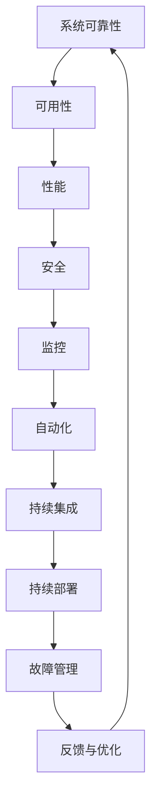
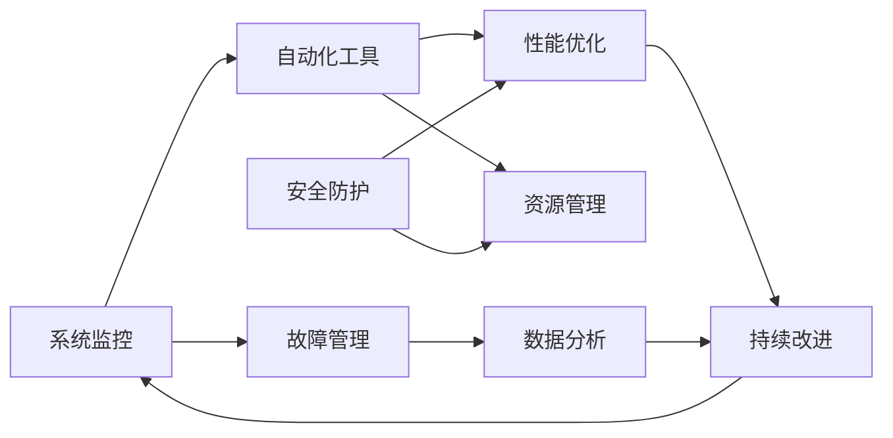

                 

# SRE（站点可靠性工程）：确保大规模系统的可靠性

## 1. 背景介绍

### 1.1 问题由来
在当今数字化、网络化的社会中，大规模系统如社交网络、金融交易平台、电商网站等，承担着对数千万甚至数十亿用户的日常服务。这些系统的可靠性（Reliability）直接关系着用户的生活质量，关乎社会的稳定和经济发展。然而，随着系统规模的不断扩大，如何确保这些系统能够稳定可靠地运行，成为了每一个IT从业人员和组织必须面对的重要问题。

### 1.2 问题核心关键点
为了确保大规模系统的可靠性，站点可靠性工程（Site Reliability Engineering, SRE）应运而生。SRE是一种将软件工程实践和运维操作紧密结合的管理模式，其核心目标是保证系统的高可用性、稳定性和安全性。具体而言，SRE通过跨部门协作、自动化工具的运用、持续监控与优化等方式，保障系统的稳定运行，快速响应和解决突发问题，从而提高用户满意度并降低运维成本。

SRE的实践不仅关注系统的故障预防与恢复，更注重系统的性能优化、安全防护、资源管理等方面的综合提升。它在很大程度上推动了DevOps理念的实践，使得开发、测试、运维等环节紧密衔接，共同致力于实现“开发运维一体化”。

### 1.3 问题研究意义
SRE的实践对于保障大规模系统的可靠性具有重要意义：

1. **提升系统可用性**：通过全面的监控和自动化手段，快速定位和修复故障，确保系统7x24小时持续可用。
2. **降低运维成本**：SRE引入标准化流程和自动化工具，减少人工干预，提升运维效率，降低人力成本。
3. **优化系统性能**：通过持续监控与优化，不断改进系统性能，提高用户体验。
4. **增强安全防护**：通过安全监控和防护措施，保障系统免受各类攻击和威胁。
5. **促进团队协作**：SRE推动跨部门协作，消除部门间的沟通壁垒，提升团队协作效率。
6. **实现持续改进**：SRE注重数据分析与反馈，持续迭代改进系统可靠性。

总之，SRE的实践是确保大规模系统可靠性的关键，对于任何依赖网络技术的服务而言，都有着不可替代的重要性。

## 2. 核心概念与联系

### 2.1 核心概念概述

SRE的核心概念和其与其他IT相关概念的关系可以通过以下Mermaid流程图来展示：



从图中可以看出，系统可靠性（A）是由可用性（B）、性能（C）、安全（D）等多方面的综合体现。这些方面又通过监控（E）、自动化（F）、持续集成与部署（G、H）、故障管理（I）和持续改进（J）等手段进行保障和优化。SRE通过协调这些环节，构建起一个全面、高效、稳定的系统可靠性保障体系。

### 2.2 核心概念原理和架构的 Mermaid 流程图



上图展示了SRE架构的多个组成部分及其之间的关系。系统监控（A）负责实时监控系统状态，自动化工具（B）用于执行常规和应急任务，故障管理（C）在故障发生时快速响应和恢复，安全防护（D）保障系统免受攻击，性能优化（E）确保系统响应及时、资源合理分配，资源管理（F）优化资源使用，数据分析（G）提供决策支持，持续改进（H）基于数据反馈不断优化系统。

## 3. 核心算法原理 & 具体操作步骤

### 3.1 算法原理概述

SRE的算法原理主要包括以下几个方面：

1. **可用性模型**：通过计算系统在某时间间隔内的可用时间与总时间的比率，来评估系统的可靠性。
2. **性能监控与分析**：通过收集和分析系统性能指标（如响应时间、吞吐量等），来识别性能瓶颈并采取优化措施。
3. **故障管理与恢复**：建立故障检测与恢复机制，快速定位和修复故障。
4. **安全防护与检测**：实施安全监控和防护措施，防止系统遭受攻击和威胁。
5. **资源管理与优化**：合理分配和管理系统资源，避免资源浪费和过度消耗。
6. **持续监控与改进**：通过持续监控和数据反馈，不断优化系统性能和可靠性。

这些算法原理通过一系列的标准化流程和自动化工具，共同构建起一个高效、全面的系统可靠性保障体系。

### 3.2 算法步骤详解

SRE的算法步骤主要包括：

1. **需求分析与目标设定**：明确系统的可用性、性能、安全性等需求，并设定具体的目标指标。
2. **系统监控与告警**：部署监控工具，实时监控系统状态，设置告警规则。
3. **故障检测与分析**：使用自动化工具对告警信息进行分析，快速定位故障点。
4. **故障恢复与修复**：执行预定的故障恢复流程，修复故障并确认系统恢复。
5. **性能优化与资源管理**：根据性能监控数据，进行系统调优和资源管理。
6. **安全防护与检测**：实施安全措施，定期进行安全扫描和检测。
7. **持续改进与反馈**：通过数据分析，识别系统瓶颈和改进点，制定持续改进计划。

### 3.3 算法优缺点

SRE的算法有以下优点：

1. **提升系统可用性**：通过全面的监控和自动化手段，快速定位和修复故障，确保系统7x24小时持续可用。
2. **降低运维成本**：引入自动化工具和标准化流程，减少人工干预，提升运维效率。
3. **优化系统性能**：通过持续监控与优化，不断改进系统性能，提高用户体验。
4. **增强安全防护**：实施安全监控和防护措施，保障系统免受各类攻击和威胁。
5. **促进团队协作**：推动跨部门协作，消除部门间的沟通壁垒，提升团队协作效率。

同时，SRE也存在以下缺点：

1. **实施复杂**：需要跨部门协作，涉及多方面的技术和管理工作。
2. **持续投入**：需要持续进行监控、优化和改进，成本较高。
3. **技术要求高**：涉及自动化工具、监控系统、数据分析等技术，需要专业人才。
4. **挑战多变**：系统的需求和环境不断变化，需要灵活应对和调整策略。

### 3.4 算法应用领域

SRE广泛应用于以下领域：

1. **云平台运维**：如AWS、Azure、Google Cloud等，通过SRE保障云平台的高可用性和稳定性。
2. **金融服务**：如银行、证券、保险等行业，保障金融系统的安全、稳定运行。
3. **电子商务**：如淘宝、亚马逊、京东等，通过SRE提升电商平台的用户体验。
4. **社交网络**：如Facebook、Twitter、微信等，确保社交网络的稳定运行和用户体验。
5. **医疗健康**：如远程医疗平台、电子病历系统等，保障医疗系统的可靠性和安全性。

## 4. 数学模型和公式 & 详细讲解 & 举例说明

### 4.1 数学模型构建

SRE的数学模型主要包括以下几个方面：

1. **系统可用性模型**：
   $$
   A(t) = 1 - \int_{0}^{t} P(F(t'))dt'
   $$
   其中，$A(t)$ 为系统在时间$t$的可用性，$P(F(t'))$ 为系统在时间$t'$故障的概率。

2. **性能监控模型**：
   $$
   P = \frac{R}{C}
   $$
   其中，$P$ 为系统性能，$R$ 为系统吞吐量，$C$ 为系统资源消耗。

3. **故障恢复模型**：
   $$
   T_R = T_M + T_D
   $$
   其中，$T_R$ 为故障恢复时间，$T_M$ 为故障检测时间，$T_D$ 为故障修复时间。

### 4.2 公式推导过程

**系统可用性模型**：
$$
A(t) = 1 - \int_{0}^{t} P(F(t'))dt'
$$
$$
A(t) = 1 - \int_{0}^{t} (1 - A(t'))dt'
$$
$$
A(t) = \int_{0}^{t} A(t')dt'
$$

**性能监控模型**：
$$
P = \frac{R}{C}
$$
$$
P = \frac{R}{C} \cdot \frac{C}{\max(C)}
$$
$$
P = \frac{R}{\max(C)}
$$

**故障恢复模型**：
$$
T_R = T_M + T_D
$$
$$
T_R = T_M + T_D + E
$$
其中$E$为修复过程的额外时间，考虑到未知因素和不确定性。

### 4.3 案例分析与讲解

假设某电商平台有100个服务节点，每个节点可用性为99%，总节点数为100个，那么整个系统的可用性$A(t)$为：
$$
A(t) = \left( \prod_{i=1}^{100} (1 - P(F(t_i))) \right)^{100}
$$
假设某个节点在$t_1$时刻故障，经过$T_M = 1$小时检测，$T_D = 2$小时修复，那么故障恢复时间$T_R$为：
$$
T_R = 1 + 2 = 3\text{小时}
$$
假设系统在$t_1$到$t_2$时刻可用性下降1%，那么系统可用性下降的总时间$T_A$为：
$$
T_A = \int_{t_1}^{t_2} (1 - 0.99)dt' = 0.01 \cdot (t_2 - t_1)
$$
因此，系统可用性$A(t_2)$为：
$$
A(t_2) = 1 - \int_{0}^{t_2} (1 - A(t'))dt' = 1 - (0.01 \cdot (t_2 - t_1))
$$

## 5. 项目实践：代码实例和详细解释说明

### 5.1 开发环境搭建

SRE的实践开发需要搭建一套完善的运维和监控环境，以下是搭建环境的详细步骤：

1. **准备硬件环境**：使用高性能服务器或集群，配置CPU、内存、网络等资源。
2. **安装监控工具**：安装Prometheus、Grafana、Nagios等监控系统，用于实时监控系统状态。
3. **部署自动化工具**：安装Ansible、Kubernetes等自动化工具，用于自动化部署和管理。
4. **建立告警系统**：通过配置告警规则，实现系统状态的实时监控和异常告警。
5. **实施安全防护**：部署防火墙、IDS/IPS、SSL证书等安全设备，保障系统安全。
6. **优化性能监控**：配置监控脚本，收集系统性能数据，进行实时分析。
7. **实施故障管理**：建立故障检测与恢复流程，确保系统故障的快速定位和修复。

### 5.2 源代码详细实现

以下是一个基于Prometheus和Grafana构建的监控系统的代码实现：

**prometheus.yml配置文件**：
```yaml
global:
  scrape_interval: 1m
  evaluation_interval: 1m
  scrape_timeout: 10s
  external_labels:
    prometheus: prometheus

scrape_configs:
  - job_name: 'prometheus'
    honor_labels: true
    scheme: http
    static_configs:
      - targets: ['localhost:9090']
```

**Grafana配置文件**：
```yaml
grafana:
  url: http://grafana:3000
  auth:
    token: 'admin'
```

**监控脚本**：
```python
from prometheus_client import Gauge, register
from flask import Flask, jsonify

app = Flask(__name__)

# 定义Gauge指标
gauges = {
    'cpu_usage': Gauge('cpu_usage', 'CPU使用率', 'node'),
    'memory_usage': Gauge('memory_usage', '内存使用率', 'node'),
}

# 注册监控指标
register(gauges)

@app.route('/api/metrics')
def metrics():
    return jsonify(gauges.collect())

@app.route('/api/node_info/<node>')
def node_info(node):
    return jsonify({
        'cpu_usage': gauges['cpu_usage'].get(node).get_metric_value(),
        'memory_usage': gauges['memory_usage'].get(node).get_metric_value(),
    })

if __name__ == '__main__':
    app.run(host='0.0.0.0', port=5005)
```

### 5.3 代码解读与分析

**prometheus.yml配置文件**：
- `global`部分配置全局监控参数，如监控间隔、超时时间等。
- `scrape_configs`部分配置监控任务，指定监控目标和数据收集方式。

**Grafana配置文件**：
- 配置Grafana服务器的URL和认证令牌，用于访问Grafana的API。

**监控脚本**：
- 通过Prometheus Client库，定义Gauge指标和监控任务，实现CPU和内存使用率的监控。
- Flask应用程序，通过HTTP接口暴露监控数据，供Grafana进行展示和告警。

### 5.4 运行结果展示

运行上述代码，启动监控脚本，通过访问`http://localhost:5005/api/metrics`和`http://localhost:5005/api/node_info/<node>`接口，可以看到实时监控数据的展示。例如，在Grafana中加载CPU和内存使用率的Gauge指标，就可以直观地看到各节点的资源使用情况，并设置告警规则，确保系统的稳定运行。

## 6. 实际应用场景

### 6.1 云平台运维

在云平台如AWS、Azure等环境中，SRE通过部署监控、自动化和故障管理工具，保障云基础设施的稳定运行。例如，AWS的OpsWorks服务提供了一套完整的SRE工具和流程，帮助用户管理和优化云资源，确保云应用的高可用性。

### 6.2 金融服务

金融服务行业对系统的稳定性和安全性要求极高，SRE通过实施全面监控、自动化部署和安全防护，保障金融系统的可靠运行。例如，JP摩根通过建立SRE团队，实施基于云的SRE实践，确保其交易系统的稳定性和安全性。

### 6.3 电子商务

电子商务平台如淘宝、京东等，通过SRE技术，确保网站的高可用性和用户体验。例如，亚马逊使用Kubernetes和SRE团队，实现了电子商务系统的自动伸缩和快速恢复，保障了全球用户的服务体验。

### 6.4 社交网络

社交网络平台如Facebook、Twitter等，通过SRE技术，确保用户数据的实时处理和存储，保障系统的稳定运行。例如，Twitter通过实施SRE实践，实现了数据中心的自动监控和故障恢复，确保了全球用户的信息流畅通。

### 6.5 医疗健康

医疗健康系统如远程医疗平台、电子病历系统等，通过SRE技术，确保系统的可靠性和数据安全。例如，Kaiser Permanente通过建立SRE团队，保障其医疗系统的稳定运行，确保患者数据的安全和及时性。

## 7. 工具和资源推荐

### 7.1 学习资源推荐

为了系统掌握SRE的实践技巧，以下是一些优质的学习资源：

1. **《站点可靠性工程》（Title: Site Reliability Engineering）**：由SRE之父Betsy Beyer、Chris Jones、Holger Schmiede等人合著，系统讲解了SRE的核心概念和实践方法。
2. **《DevOps革命》（Title: The DevOps Handbook）**：由Patrick Debois、John Willis等人合著，详细介绍了DevOps与SRE的结合实践。
3. **《SRE：站点可靠性工程》（Title: SRE: Site Reliability Engineering）**：由William MacKenzie、Felix Porl, Lisa Stelzner合著，全面介绍了SRE的理论和实践。
4. **《SRE进阶指南》（Title: Advanced Site Reliability Engineering）**：由Lily Traynor等人合著，深入探讨了SRE的高级实践和案例分析。
5. **《SRE博客》（Title: Site Reliability Engineering Blog）**：由Doug Boneham、Jeff Brueser等人运营的博客，分享了最新的SRE实践和案例。

通过学习这些资源，可以全面了解SRE的理论基础和实践方法，提升系统可靠性保障能力。

### 7.2 开发工具推荐

SRE的实践离不开各类工具的支持，以下是一些常用的开发工具：

1. **Prometheus**：开源监控系统，提供实时监控和数据收集功能。
2. **Grafana**：开源数据可视化平台，支持多种数据源和图表展示。
3. **Ansible**：自动化运维工具，支持自动化任务执行和管理。
4. **Kubernetes**：容器编排平台，支持容器化应用的自动部署和扩展。
5. **New Relic**：云监控服务，提供应用性能监控和故障管理功能。
6. **Datadog**：云监控服务，提供日志分析和安全防护功能。

这些工具的结合使用，可以构建起一个全面、高效的SRE实践环境。

### 7.3 相关论文推荐

SRE的实践来源于学界的持续研究，以下是几篇奠基性的相关论文，推荐阅读：

1. **站点可靠性工程：挑战与应对**（Title: Site Reliability Engineering: How Google Runs Production Systems）：由Betsy Beyer等人合著，介绍了Google的SRE实践和挑战。
2. **DevOps自动化与SRE实践**（Title: Continuous Delivery in the Large: Designing and Building a Maintainable System with CircleCI）：由David N. Yao等人合著，探讨了DevOps与SRE的自动化实践。
3. **云平台可靠性的优化**（Title: Optimizing for Reliability: A Case Study of Cloud Computing）：由Vladimir Osipov等人合著，介绍了云平台可靠性优化的案例。
4. **自动运维的探索**（Title: Automation as the Foundation of Site Reliability Engineering）：由Amy Brown等人合著，探讨了自动运维在SRE中的应用。
5. **SRE的最佳实践**（Title: Site Reliability Engineering Best Practices）：由Hans Johansson等人合著，介绍了SRE的最佳实践和案例分析。

这些论文代表了SRE发展的最新进展，通过学习这些前沿成果，可以深入理解SRE的理论和技术。

## 8. 总结：未来发展趋势与挑战

### 8.1 总结

本文对SRE的实践进行了全面系统的介绍，从背景、核心概念、算法原理到具体实现和应用案例，全面展示了SRE的实践过程和效果。通过系统梳理，可以看出SRE在确保大规模系统可靠性方面的重要作用，并介绍了SRE在多个领域的成功应用。

SRE不仅是一种技术实践，更是一种管理理念，通过跨部门协作和自动化工具的引入，实现了系统的高可用性、稳定性和安全性。未来，随着技术的不断发展和完善，SRE必将成为保障大规模系统可靠性的重要手段，推动IT行业的持续进步。

### 8.2 未来发展趋势

展望未来，SRE的发展趋势如下：

1. **自动化程度提升**：通过更高级的自动化工具和流程，进一步降低人工干预，提升运维效率。
2. **实时监控与分析**：利用大数据和人工智能技术，实现实时监控和异常分析，提前发现并解决问题。
3. **智能化运维**：引入机器学习、深度学习等技术，实现更智能的故障预测和优化。
4. **跨部门协作增强**：推动开发、运维、安全等多部门的紧密协作，构建更全面的系统可靠性保障体系。
5. **云计算与云原生**：基于云平台和云原生技术的SRE实践，提升系统的弹性和可伸缩性。
6. **开源生态繁荣**：更多开源工具和框架的涌现，将推动SRE的普及和应用。

### 8.3 面临的挑战

尽管SRE在保障系统可靠性方面取得了显著成效，但在发展过程中仍面临一些挑战：

1. **复杂度增加**：系统规模和复杂度的增加，使得SRE实践变得更加复杂和困难。
2. **技术更新迅速**：新技术和工具层出不穷，需要不断学习和更新知识。
3. **资源消耗大**：监控和自动化工具需要大量资源支持，成本较高。
4. **数据安全和隐私**：监控和分析工具需要处理大量敏感数据，如何保障数据安全和隐私是一个重要问题。
5. **团队协作难度**：跨部门协作需要克服沟通障碍和文化差异，提升团队协作效率。

### 8.4 研究展望

为了克服SRE面临的挑战，未来的研究应在以下几个方面寻求突破：

1. **自动化工具的优化**：开发更智能、更高效的自动化工具，降低人工干预。
2. **实时监控的强化**：利用大数据和机器学习技术，实现更精准的实时监控和异常分析。
3. **智能化运维的探索**：引入机器学习和深度学习技术，提升故障预测和系统优化能力。
4. **跨部门协作机制的建立**：推动跨部门协作，消除沟通障碍，提升团队协作效率。
5. **开源工具和框架的完善**：加强开源社区的建设，推动SRE工具和框架的完善和普及。

通过这些研究方向，SRE必将迎来新的突破和发展，保障大规模系统的可靠性，推动IT行业的持续进步。

## 9. 附录：常见问题与解答

**Q1：SRE与DevOps的区别是什么？**

A: SRE是DevOps实践的一部分，主要关注系统的可靠性和运维管理。而DevOps更广泛，涵盖了开发、测试、运维等全流程，旨在实现持续交付和自动化。SRE强调系统可靠性和运维效率，是DevOps的聚焦领域之一。

**Q2：SRE需要哪些关键技能？**

A: SRE需要具备以下关键技能：
- 系统监控与故障管理：掌握Prometheus、Grafana等监控工具，熟悉故障检测与恢复流程。
- 自动化部署与运维：熟悉Ansible、Kubernetes等自动化工具，能够实现自动部署和运维。
- 数据处理与分析：掌握SQL、Python等工具，能够处理和分析系统监控数据。
- 安全防护与检测：了解防火墙、IDS/IPS等安全设备，能够实施安全防护措施。
- 持续改进与反馈：具备数据分析和反馈的能力，能够根据数据反馈进行持续优化。

**Q3：SRE是否适合所有企业？**

A: SRE适合各种规模和类型的企业，尤其是那些依赖网络技术和服务的行业。但是，实施SRE需要一定的时间和资源投入，中小企业和传统行业可能需要根据实际情况进行评估和选择。

**Q4：如何评估SRE的实施效果？**

A: SRE的实施效果可以从以下几个方面进行评估：
- 系统可用性和稳定性的提升。
- 故障恢复时间的缩短。
- 自动化工具和流程的引入。
- 监控和分析数据的质量和可用性。
- 团队协作效率的提升。

通过定期评估和反馈，可以不断改进SRE实践，提升系统可靠性保障能力。

通过本文的系统介绍和深入分析，希望读者能够全面理解SRE的概念、算法原理和实践方法，掌握SRE的关键技能，并在实际工作中成功应用SRE技术，确保大规模系统的可靠性和稳定性。

---

作者：禅与计算机程序设计艺术 / Zen and the Art of Computer Programming

