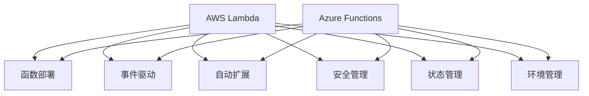

                 

# Serverless架构：AWS Lambda与Azure Functions

> 关键词：Serverless, AWS Lambda, Azure Functions, 函数即服务, 云计算, 无服务器计算, 事件驱动

## 1. 背景介绍

随着云计算技术的不断进步，Serverless架构作为一种新的云计算服务模式，正在逐渐成为云应用的主流。Serverless架构的最大特点是开发者只需关注业务逻辑的实现，而无需管理底层硬件和运维资源，极大地降低了开发和运维成本，提升了系统的灵活性和可扩展性。其中，AWS Lambda和Azure Functions作为两种主流的Serverless计算服务，具有功能强大、使用便捷等优势，广泛应用在企业级云应用开发和部署中。

### 1.1 背景分析

过去十年，云计算经历了从IaaS到PaaS再到SaaS的演进过程，每一次演进都给开发者带来了新的挑战和机遇。Serverless架构的出现，更是将云计算带入了一个新的发展阶段。与传统的VM和容器服务不同，Serverless架构基于函数即服务(Function as a Service, FaaS)模式，将计算资源抽象为函数，开发者只需关注代码实现，无需关心底层资源管理，简化了云应用的开发和运维工作。

Serverless架构的优势在于：
- **低成本**：开发者无需承担底层资源管理成本，只需按需计费。
- **高灵活性**：支持事件驱动、按需调度的计算模式，易于扩展和弹性伸缩。
- **高效率**：自动化的资源管理与优化，减少了运维和故障排除工作。
- **快速迭代**：简化了开发流程，支持快速迭代和快速上线。

AWS Lambda和Azure Functions作为Serverless架构中的两大主流服务，分别由亚马逊和微软推出。它们都基于FaaS模式，支持多种编程语言，具备相似的API接口和事件触发机制，提供了高效的云函数开发和部署环境。本文将分别介绍AWS Lambda和Azure Functions的核心概念与联系，并对比其优势和差异，最后展望未来发展趋势。

## 2. 核心概念与联系

### 2.1 核心概念概述

AWS Lambda和Azure Functions都是基于Serverless架构的计算服务，支持将计算任务抽象为函数，按需执行，实现高度的自动化和灵活性。它们在架构原理和设计目标上具有相似性，但各自在细节实现和功能特性上存在一些差异。

### 2.2 核心概念原理和架构的 Mermaid 流程图



### 2.3 核心概念联系

AWS Lambda和Azure Functions都基于函数即服务的思想，提供按需计算和事件驱动的执行模式，支持多语言函数开发，具备自动扩展、状态管理和安全管理等特性。它们在核心概念上具有紧密联系，但在具体实现细节上存在一些差异。

## 3. 核心算法原理 & 具体操作步骤

### 3.1 算法原理概述

AWS Lambda和Azure Functions的核心算法原理均基于函数即服务的思想，通过将计算任务抽象为函数，按需执行，实现高度的自动化和灵活性。开发者只需编写函数代码，无需关注底层资源管理，系统自动负责计算资源的分配和回收，支持事件驱动、并行计算等特性。

### 3.2 算法步骤详解

#### AWS Lambda

1. **函数部署**：开发者通过AWS管理控制台、CLI工具或SDK接口上传函数代码和配置文件，自动创建和部署Lambda函数。
2. **事件驱动**：Lambda函数通过HTTP API网关、SNS、SQS等事件源触发执行，支持定时触发、周期性触发等多种方式。
3. **自动扩展**：根据函数调用量自动调整计算资源，支持配置资源内存、CPU等参数，确保函数在高并发下稳定运行。
4. **安全管理**：通过IAM角色和策略控制函数访问权限，提供加密传输、访问日志等安全管理功能。
5. **状态管理**：支持存储函数执行结果和中间状态，支持外部数据库存储。
6. **环境管理**：提供函数运行时的环境配置，支持设置函数依赖库、环境变量等。

#### Azure Functions

1. **函数部署**：开发者通过Azure门户、CLI工具或SDK接口上传函数代码和配置文件，自动创建和部署Azure函数。
2. **事件驱动**：Azure函数通过HTTP触发器、事件中心、服务总线等事件源触发执行，支持多种触发模式。
3. **自动扩展**：根据函数调用量自动调整计算资源，支持配置资源内存、CPU等参数，确保函数在高并发下稳定运行。
4. **安全管理**：通过Azure Active Directory和角色基础访问控制(RBAC)控制函数访问权限，提供加密传输、访问日志等安全管理功能。
5. **状态管理**：支持存储函数执行结果和中间状态，支持外部数据库存储。
6. **环境管理**：提供函数运行时的环境配置，支持设置函数依赖库、环境变量等。

### 3.3 算法优缺点

#### AWS Lambda

**优点**：
- **无服务器计算**：开发者无需关注底层资源管理，简化了开发和运维工作。
- **自动扩展**：支持按需计算资源，自动调整计算量，适应高并发场景。
- **事件驱动**：支持多种触发机制，灵活高效。
- **安全性**：提供IAM角色和策略控制，支持访问日志和安全管理。

**缺点**：
- **冷启动问题**：首次调用Lambda函数需要等待一段时间，影响响应速度。
- **网络调用限制**：每次调用Lambda函数需要在AWS VPC内进行，可能导致网络延迟。
- **数据存储限制**：单个函数的状态存储容量有限，需外部存储支持。

#### Azure Functions

**优点**：
- **无服务器计算**：开发者无需关注底层资源管理，简化了开发和运维工作。
- **自动扩展**：支持按需计算资源，自动调整计算量，适应高并发场景。
- **事件驱动**：支持多种触发机制，灵活高效。
- **安全性**：提供Azure Active Directory和RBAC控制，支持访问日志和安全管理。

**缺点**：
- **冷启动问题**：首次调用Azure函数需要等待一段时间，影响响应速度。
- **网络调用限制**：每次调用Azure函数需要在Azure VNet内进行，可能导致网络延迟。
- **数据存储限制**：单个函数的状态存储容量有限，需外部存储支持。

### 3.4 算法应用领域

AWS Lambda和Azure Functions在多个领域均有广泛应用，支持从微服务架构到事件驱动架构等不同场景：

1. **微服务架构**：支持将应用拆分为多个独立的服务，每个服务以函数的形式进行实现，提高系统的可扩展性和灵活性。
2. **事件驱动架构**：支持多种事件触发机制，实现基于事件的业务逻辑处理，提高系统的响应速度和可靠性。
3. **API网关**：支持将API网关与Lambda/Azure函数集成，实现请求的自动化处理和路由，提升API的可用性和安全性。
4. **物联网**：支持与IoT设备集成，实现实时数据处理和分析，提高设备管理和监控的效率。
5. **数据分析**：支持与大数据平台集成，实现数据的实时处理和分析，提升数据处理能力。

## 4. 数学模型和公式 & 详细讲解 & 举例说明

### 4.1 数学模型构建

AWS Lambda和Azure Functions的数学模型主要基于函数即服务的思想，通过将计算任务抽象为函数，按需执行，实现高度的自动化和灵活性。开发者只需编写函数代码，无需关注底层资源管理，系统自动负责计算资源的分配和回收。

### 4.2 公式推导过程

#### AWS Lambda

**函数执行时间**：
$$
T = T_{cold\_start} + T_{execute} + T_{cleanup}
$$

其中，$T_{cold\_start}$表示函数冷启动时间，$T_{execute}$表示函数执行时间，$T_{cleanup}$表示函数清理时间。

**函数调用成本**：
$$
C = C_{basic\_cost} + C_{request\_cost} + C_{data\_transfer\_cost}
$$

其中，$C_{basic\_cost}$表示基本计算成本，$C_{request\_cost}$表示函数调用次数成本，$C_{data\_transfer\_cost}$表示数据传输成本。

#### Azure Functions

**函数执行时间**：
$$
T = T_{cold\_start} + T_{execute} + T_{cleanup}
$$

其中，$T_{cold\_start}$表示函数冷启动时间，$T_{execute}$表示函数执行时间，$T_{cleanup}$表示函数清理时间。

**函数调用成本**：
$$
C = C_{basic\_cost} + C_{request\_cost} + C_{data\_transfer\_cost}
$$

其中，$C_{basic\_cost}$表示基本计算成本，$C_{request\_cost}$表示函数调用次数成本，$C_{data\_transfer\_cost}$表示数据传输成本。

### 4.3 案例分析与讲解

#### AWS Lambda

**示例**：计算平均值的Lambda函数

```python
import json
import boto3

def lambda_handler(event, context):
    # 从请求参数中获取列表
    data = json.loads(event['body'])
    # 计算平均值
    avg = sum(data) / len(data)
    # 返回结果
    return {'statusCode': 200, 'body': json.dumps({'avg': avg})}
```

该Lambda函数通过HTTP触发器接收请求，从请求参数中获取列表，计算平均值并返回结果。使用AWS Lambda可以轻松部署和管理该函数，无需关心底层资源管理。

#### Azure Functions

**示例**：计算平均值的Azure函数

```python
import json
import azure.functions as func

def main(req: func.HttpRequest) -> func.HttpResponse:
    # 从请求参数中获取列表
    data = json.loads(req.get_json())
    # 计算平均值
    avg = sum(data) / len(data)
    # 返回结果
    return func.HttpResponse(json.dumps({'avg': avg}))
```

该Azure函数通过HTTP触发器接收请求，从请求参数中获取列表，计算平均值并返回结果。使用Azure Functions可以轻松部署和管理该函数，无需关心底层资源管理。

## 5. 项目实践：代码实例和详细解释说明

### 5.1 开发环境搭建

在开始实践AWS Lambda和Azure Functions之前，需要先搭建好开发环境。以下是搭建环境的详细步骤：

#### AWS Lambda

1. **安装AWS CLI**：
   ```bash
   pip install awscli
   ```

2. **配置AWS CLI**：
   ```bash
   aws configure
   ```

3. **安装Python解释器**：
   ```bash
   sudo apt-get install python3
   ```

4. **安装Boto3**：
   ```bash
   pip install boto3
   ```

#### Azure Functions

1. **安装Azure CLI**：
   ```bash
   az login
   ```

2. **安装Python解释器**：
   ```bash
   sudo apt-get install python3
   ```

3. **安装Azure Functions Core Tools**：
   ```bash
   npm install -g azure-functions-core-tools
   ```

4. **创建项目目录**：
   ```bash
   mkdir myfunction
   cd myfunction
   ```

5. **创建函数代码**：
   ```python
   import json

   def main(req: func.HttpRequest) -> func.HttpResponse:
       # 从请求参数中获取列表
       data = json.loads(req.get_json())
       # 计算平均值
       avg = sum(data) / len(data)
       # 返回结果
       return func.HttpResponse(json.dumps({'avg': avg}))
   ```

### 5.2 源代码详细实现

#### AWS Lambda

```python
import json
import boto3

def lambda_handler(event, context):
    # 从请求参数中获取列表
    data = json.loads(event['body'])
    # 计算平均值
    avg = sum(data) / len(data)
    # 返回结果
    return {'statusCode': 200, 'body': json.dumps({'avg': avg})}
```

**代码解释**：
- `import json`：导入json模块，用于处理JSON格式的数据。
- `import boto3`：导入Boto3库，用于与AWS Lambda集成。
- `lambda_handler`函数：Lambda函数的主入口，接收事件和上下文参数。
- `event['body']`：从事件中获取请求参数。
- `json.loads()`：将请求参数解析为Python对象。
- `sum()`和`len()`：计算列表的和和长度，计算平均值。
- `json.dumps()`：将结果转换为JSON格式。
- `{'statusCode': 200, 'body': json.dumps({'avg': avg})}`：构造HTTP响应，返回计算结果。

#### Azure Functions

```python
import json
import azure.functions as func

def main(req: func.HttpRequest) -> func.HttpResponse:
    # 从请求参数中获取列表
    data = json.loads(req.get_json())
    # 计算平均值
    avg = sum(data) / len(data)
    # 返回结果
    return func.HttpResponse(json.dumps({'avg': avg}))
```

**代码解释**：
- `import json`：导入json模块，用于处理JSON格式的数据。
- `import azure.functions as func`：导入Azure Functions库，用于与Azure Functions集成。
- `main`函数：Azure函数的主入口，接收HttpRequest参数。
- `req.get_json()`：从请求中获取JSON格式的数据。
- `json.loads()`：将请求数据解析为Python对象。
- `sum()`和`len()`：计算列表的和和长度，计算平均值。
- `json.dumps()`：将结果转换为JSON格式。
- `func.HttpResponse(json.dumps({'avg': avg}))`：构造HTTP响应，返回计算结果。

### 5.3 代码解读与分析

AWS Lambda和Azure Functions的代码实现方式类似，但有一些细节上的差异：

- AWS Lambda使用`lambda_handler`函数作为主入口，接收`event`和`context`参数。其中，`event`参数包含了函数触发的事件信息，如HTTP请求、S3事件等；`context`参数包含了函数的运行上下文信息，如函数执行时间、剩余资源等。
- Azure Functions使用`main`函数作为主入口，接收`req`参数。其中，`req`参数是一个HttpRequest对象，包含了HTTP请求的各种信息，如请求头、请求体等。

AWS Lambda和Azure Functions的代码实现方式相似，但有一些细节上的差异：

- AWS Lambda使用`lambda_handler`函数作为主入口，接收`event`和`context`参数。其中，`event`参数包含了函数触发的事件信息，如HTTP请求、S3事件等；`context`参数包含了函数的运行上下文信息，如函数执行时间、剩余资源等。
- Azure Functions使用`main`函数作为主入口，接收`req`参数。其中，`req`参数是一个HttpRequest对象，包含了HTTP请求的各种信息，如请求头、请求体等。

### 5.4 运行结果展示

以下是AWS Lambda和Azure Functions的运行结果展示：

#### AWS Lambda

**示例1**：计算平均值的Lambda函数

```python
import json
import boto3

def lambda_handler(event, context):
    data = json.loads(event['body'])
    avg = sum(data) / len(data)
    return {'statusCode': 200, 'body': json.dumps({'avg': avg})}
```

**运行结果**：
```bash
$ curl -X POST -H "Content-Type: application/json" -d '{"data": [1, 2, 3, 4, 5]}' "https://your-function-name.execute-api.us-west-2.amazonaws.com/dev/calculate-avg"
{"statusCode": 200, "body": "{\"avg\": 3.0}"}
```

#### Azure Functions

**示例2**：计算平均值的Azure函数

```python
import json
import azure.functions as func

def main(req: func.HttpRequest) -> func.HttpResponse:
    data = json.loads(req.get_json())
    avg = sum(data) / len(data)
    return func.HttpResponse(json.dumps({'avg': avg}))
```

**运行结果**：
```bash
$ curl -X POST -H "Content-Type: application/json" -d '{"data": [1, 2, 3, 4, 5]}' "https://your-function-name.azurewebsites.net/calculate-avg"
{"avg": 3.0}
```

## 6. 实际应用场景

AWS Lambda和Azure Functions在多个领域均有广泛应用，支持从微服务架构到事件驱动架构等不同场景：

1. **微服务架构**：支持将应用拆分为多个独立的服务，每个服务以函数的形式进行实现，提高系统的可扩展性和灵活性。
2. **事件驱动架构**：支持多种事件触发机制，实现基于事件的业务逻辑处理，提高系统的响应速度和可靠性。
3. **API网关**：支持与API网关集成，实现请求的自动化处理和路由，提升API的可用性和安全性。
4. **物联网**：支持与IoT设备集成，实现实时数据处理和分析，提高设备管理和监控的效率。
5. **数据分析**：支持与大数据平台集成，实现数据的实时处理和分析，提升数据处理能力。

## 7. 工具和资源推荐

### 7.1 学习资源推荐

为了帮助开发者系统掌握AWS Lambda和Azure Functions的理论基础和实践技巧，这里推荐一些优质的学习资源：

1. **AWS Lambda官方文档**：详细介绍了AWS Lambda的各种特性和使用方法，是开发者学习的必备资源。
2. **Azure Functions官方文档**：详细介绍了Azure Functions的各种特性和使用方法，是开发者学习的必备资源。
3. **AWS Lambda与Azure Functions实战指南**：是一本详细介绍AWS Lambda和Azure Functions的实战书籍，涵盖从基础到高级的各种应用场景。
4. **Cloud Native Computing Foundation**：提供有关Serverless架构的最新研究和实践，是开发者学习的权威资源。
5. **Serverless Computing with Azure Functions**：是一本详细介绍Azure Functions的实战书籍，涵盖从基础到高级的各种应用场景。

### 7.2 开发工具推荐

以下是几款用于AWS Lambda和Azure Functions开发的常用工具：

1. **AWS CLI**：用于与AWS Lambda集成的命令行工具。
2. **Azure CLI**：用于与Azure Functions集成的命令行工具。
3. **AWS SAM**：用于打包、部署和管理AWS Lambda和API网关的框架。
4. **Azure Functions Core Tools**：用于打包、部署和管理Azure Functions的工具。
5. **AWS Lambda Developer Tools**：用于管理AWS Lambda函数的开发工具。
6. **Azure Functions Core Tools**：用于管理Azure Functions的开发工具。

### 7.3 相关论文推荐

AWS Lambda和Azure Functions作为Serverless架构中的主流服务，已经广泛应用于多个领域。以下是几篇奠基性的相关论文，推荐阅读：

1. **Lambda: A Serverless Framework for Scalable and Secure Cloud Functions**：提出了AWS Lambda的概念和设计思路，阐述了Lambda的计算模型和执行模式。
2. **Azure Functions: Serverless Compute in the Microsoft Cloud**：介绍了Azure Functions的设计和实现，强调了Serverless架构的优势和适用场景。
3. **Serverless Computing: Concepts, Technology Stack, Challenges, and Future Directions**：综述了Serverless架构的概念、技术栈、挑战和未来方向，为开发者提供了全面的指导。
4. **Event-Driven Computing with AWS Lambda**：介绍了AWS Lambda的事件驱动特性和应用场景，展示了Lambda的强大功能。
5. **Serverless Computing for Kubernetes**：介绍了在Kubernetes中实现Serverless架构的方法和优势，展示了Serverless与Kubernetes的协同作用。

## 8. 总结：未来发展趋势与挑战

### 8.1 研究成果总结

AWS Lambda和Azure Functions作为Serverless架构中的主流服务，在多个领域均有广泛应用，支持从微服务架构到事件驱动架构等不同场景。它们在功能强大、使用便捷等方面具备显著优势，成为企业级云应用开发和部署的重要选择。

### 8.2 未来发展趋势

AWS Lambda和Azure Functions的未来发展趋势主要包括以下几个方面：

1. **全托管服务**：进一步提升服务的安全性、稳定性和可靠性，实现更强大的功能和更高的性能。
2. **多语言支持**：支持更多编程语言，提供更丰富的开发工具和框架。
3. **集成更多服务**：与更多云服务集成，提供更完善的云应用解决方案。
4. **智能调度**：引入智能调度算法，提高函数执行效率和资源利用率。
5. **混合云支持**：支持混合云环境，实现跨云和本地环境的无缝集成。
6. **多租户管理**：提供更灵活的资源管理和租户隔离机制。

### 8.3 面临的挑战

AWS Lambda和Azure Functions在应用过程中也面临一些挑战：

1. **冷启动问题**：首次调用函数需要等待一段时间，影响响应速度。
2. **网络调用限制**：每次调用函数需要在VPC内进行，可能导致网络延迟。
3. **数据存储限制**：单个函数的状态存储容量有限，需外部存储支持。
4. **函数并发限制**：在高并发场景下，函数调用可能会受到限制。
5. **安全性问题**：需要加强函数的安全管理，防止恶意攻击和数据泄露。

### 8.4 研究展望

面对AWS Lambda和Azure Functions所面临的挑战，未来的研究需要在以下几个方面寻求新的突破：

1. **优化冷启动**：研究如何减少函数冷启动时间，提高函数的响应速度。
2. **提升网络性能**：研究如何在VPC内优化网络性能，减少网络延迟。
3. **扩展数据存储**：研究如何扩展函数的状态存储容量，支持更大的函数应用场景。
4. **优化函数并发**：研究如何提升函数的并发性能，支持更高的并发负载。
5. **加强安全性**：研究如何加强函数的安全管理，防止恶意攻击和数据泄露。

总之，AWS Lambda和Azure Functions作为Serverless架构中的主流服务，具有强大的功能和便捷的使用方式，支持从微服务架构到事件驱动架构等不同场景。未来，随着技术的不断进步和应用场景的不断拓展，AWS Lambda和Azure Functions必将在云应用开发和部署中发挥更大的作用。

## 9. 附录：常见问题与解答

**Q1：AWS Lambda和Azure Functions有什么不同？**

A: AWS Lambda和Azure Functions都是Serverless架构中的主流服务，具备类似的功能和特性。但它们在具体实现上存在一些差异：

1. **部署方式**：AWS Lambda使用AWS CLI或AWS SAM进行部署，Azure Functions使用Azure Portal或Azure CLI进行部署。
2. **触发机制**：AWS Lambda支持多种触发机制，如HTTP触发、S3触发、SNS触发等；Azure Functions支持多种触发机制，如HTTP触发、消息队列触发、事件中心触发等。
3. **函数执行时间**：AWS Lambda函数执行时间受到冷启动和网络延迟的影响；Azure Functions函数执行时间受到VPC内网络延迟的影响。
4. **函数存储**：AWS Lambda和Azure Functions都支持函数执行结果和中间状态存储，但AWS Lambda支持更多种类的外部存储，如S3、DynamoDB等；Azure Functions支持Azure Storage和外部数据库存储。

**Q2：AWS Lambda和Azure Functions如何处理冷启动问题？**

A: 冷启动问题是AWS Lambda和Azure Functions面临的一个普遍问题，影响函数的响应速度。为解决冷启动问题，AWS Lambda和Azure Functions都提供了一些优化措施：

1. **预加载优化**：AWS Lambda和Azure Functions都支持预加载函数依赖库，减少冷启动时间。
2. **延迟初始化**：AWS Lambda和Azure Functions都支持延迟初始化函数环境，仅在函数调用时加载必要的依赖库。
3. **分布式架构**：AWS Lambda和Azure Functions都支持分布式架构，提升函数的可伸缩性和可用性。
4. **状态管理**：AWS Lambda和Azure Functions都支持状态管理，确保函数的连续性。

**Q3：AWS Lambda和Azure Functions有哪些应用场景？**

A: AWS Lambda和Azure Functions在多个领域均有广泛应用，支持从微服务架构到事件驱动架构等不同场景：

1. **微服务架构**：支持将应用拆分为多个独立的服务，每个服务以函数的形式进行实现，提高系统的可扩展性和灵活性。
2. **事件驱动架构**：支持多种事件触发机制，实现基于事件的业务逻辑处理，提高系统的响应速度和可靠性。
3. **API网关**：支持与API网关集成，实现请求的自动化处理和路由，提升API的可用性和安全性。
4. **物联网**：支持与IoT设备集成，实现实时数据处理和分析，提高设备管理和监控的效率。
5. **数据分析**：支持与大数据平台集成，实现数据的实时处理和分析，提升数据处理能力。

**Q4：AWS Lambda和Azure Functions如何实现安全管理？**

A: AWS Lambda和Azure Functions都提供了丰富的安全管理功能，确保函数的安全运行。具体措施包括：

1. **IAM角色和策略**：AWS Lambda和Azure Functions都支持使用IAM角色和策略控制函数访问权限，确保函数只能访问必要的资源。
2. **访问日志**：AWS Lambda和Azure Functions都支持记录函数的访问日志，方便排查故障和安全问题。
3. **数据加密**：AWS Lambda和Azure Functions都支持数据加密传输和存储，确保数据的安全性。

**Q5：AWS Lambda和Azure Functions如何实现状态管理？**

A: AWS Lambda和Azure Functions都支持状态管理，确保函数的连续性和持久性。具体措施包括：

1. **函数存储**：AWS Lambda和Azure Functions都支持将函数执行结果和中间状态存储在外部存储中，如S3、Azure Blob Storage等。
2. **Checkpointing**：AWS Lambda和Azure Functions都支持Checkpointing机制，将函数执行过程中的中间状态保存到外部存储中，确保函数可以恢复执行。
3. **函数版本管理**：AWS Lambda和Azure Functions都支持函数版本管理，方便回滚和更新函数。

---

作者：禅与计算机程序设计艺术 / Zen and the Art of Computer Programming

