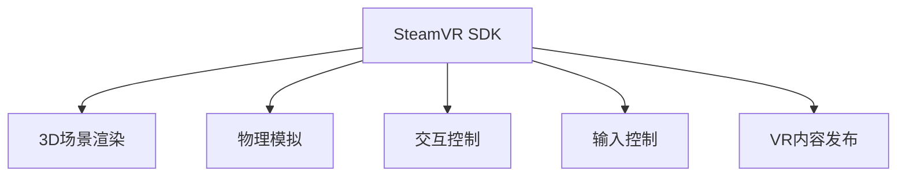

                 

# SteamVR 集成：在 Steam 上发布 VR 内容

## 1. 背景介绍

### 1.1 问题由来

随着VR技术的日渐成熟，越来越多的开发者希望在Steam平台发布VR内容，但由于SteamVR SDK的复杂性，许多开发者在集成过程中遇到诸多问题。因此，本文将介绍SteamVR的集成方法，并说明如何在Steam上发布VR内容。

## 2. 核心概念与联系

### 2.1 核心概念概述

SteamVR是Steam平台上用于VR内容的开发和发布的工具，由Valve公司提供支持。SteamVR SDK支持3D场景的渲染、物理模拟、交互、输入控制等功能，可以方便地实现VR内容的开发和发布。

### 2.2 核心概念原理和架构的 Mermaid 流程图



## 3. 核心算法原理 & 具体操作步骤

### 3.1 算法原理概述

SteamVR的集成过程主要涉及以下算法原理：

- 场景渲染：通过OpenGL或Vulkan进行3D场景渲染。
- 物理模拟：利用物理引擎模拟物体运动，确保物理真实感。
- 交互控制：通过手势、眼动、按键等交互方式，实现用户与虚拟场景的互动。
- 输入控制：将VR设备（如HTC Vive、Oculus Rift）与虚拟场景进行绑定，控制用户视角、移动等操作。

### 3.2 算法步骤详解

1. **开发环境搭建**：
   - 安装SteamVR SDK。
   - 搭建虚拟开发环境，配置开发所需的VR设备。
   - 安装必要的VR开发工具和库。

2. **场景渲染**：
   - 使用OpenGL或Vulkan进行场景渲染。
   - 通过VR设备渲染数据流，将渲染结果发送到VR设备。

3. **物理模拟**：
   - 利用物理引擎，模拟物体运动和碰撞。
   - 根据物理引擎计算结果，更新虚拟场景。

4. **交互控制**：
   - 通过手势识别、眼动追踪、按键输入等方式，实现交互。
   - 根据交互结果，更新虚拟场景状态。

5. **输入控制**：
   - 将VR设备与虚拟场景进行绑定，实现用户视角和移动控制。
   - 根据用户输入，更新虚拟场景。

### 3.3 算法优缺点

**优点**：
- 支持多种VR设备和开发工具，适合不同需求的开发者。
- 集成较为全面，提供了丰富的场景渲染、物理模拟、交互控制等功能。
- 可以方便地将VR内容发布到Steam平台。

**缺点**：
- 学习曲线较陡，新手较难上手。
- 需要一定的硬件支持，对硬件要求较高。
- 场景渲染和物理模拟较为复杂，开发难度较大。

### 3.4 算法应用领域

SteamVR适用于以下应用领域：

- 虚拟现实游戏开发。
- 虚拟现实培训和教育。
- 虚拟现实体验。
- 虚拟现实医疗和心理治疗。
- 虚拟现实电影和娱乐。

## 4. 数学模型和公式 & 详细讲解 & 举例说明

### 4.1 数学模型构建

在SteamVR的集成过程中，我们需要建立数学模型来描述虚拟场景的渲染、物理模拟、交互控制等过程。例如，在3D场景渲染中，我们可以建立以下数学模型：

$$
\text{渲染方程} = \int_{\Sigma} L(\mathbf{v}, \mathbf{v}') f_r(\mathbf{v}, \mathbf{v}') \rho(\mathbf{v}) d\mathbf{v}'
$$

其中，$L(\mathbf{v}, \mathbf{v}')$为光照函数，$f_r(\mathbf{v}, \mathbf{v}')$为反射函数，$\rho(\mathbf{v})$为材料的反射率。

### 4.2 公式推导过程

在虚拟场景渲染过程中，我们需要计算每条光线的路径和光的贡献。通过上述渲染方程，我们可以推导出光线的路径和贡献。

$$
L(\mathbf{v}, \mathbf{v}') = \frac{f_r(\mathbf{v}, \mathbf{v}') \rho(\mathbf{v})}{\pi} \mathbf{N} \cdot \frac{\mathbf{v}'}{|\mathbf{v}'|}
$$

其中，$\mathbf{v}$为观察方向，$\mathbf{v}'$为光线方向，$\mathbf{N}$为法向量。

### 4.3 案例分析与讲解

以光照函数的计算为例，假设光线从点光源发出，经过物体表面反射后到达观察点。

$$
L(\mathbf{v}, \mathbf{v}') = L_s(\mathbf{v}') f_r(\mathbf{v}, \mathbf{v}') \rho(\mathbf{v}) \mathbf{N} \cdot \frac{\mathbf{v}'}{|\mathbf{v}'|}
$$

其中，$L_s(\mathbf{v}')$为光源的强度，$f_r(\mathbf{v}, \mathbf{v}')$为反射函数，$\rho(\mathbf{v})$为材料的反射率，$\mathbf{N}$为法向量。

## 5. 项目实践：代码实例和详细解释说明

### 5.1 开发环境搭建

1. **安装SteamVR SDK**：
   - 在Steam平台上下载SteamVR SDK。
   - 按照SDK的指引进行安装。

2. **搭建开发环境**：
   - 配置开发所需的VR设备。
   - 安装必要的VR开发工具和库，如Unity或Unreal Engine。

### 5.2 源代码详细实现

以Unity平台为例，具体代码实现如下：

```csharp
using UnityEngine;
using System.Collections;

public class SteamVRController : MonoBehaviour
{
    public SteamVRTrackedDeviceMotion motion;
    
    void Update()
    {
        // 获取用户输入
        float x = motion.trackedDeviceIndex == 0 ? Input.GetAxis("Horizontal") : Input.GetAxis("Sway");
        float y = motion.trackedDeviceIndex == 0 ? Input.GetAxis("Vertical") : Input.GetAxis("Lean");
        float z = motion.trackedDeviceIndex == 0 ? Input.GetAxis("Shoulder") : Input.GetAxis("Triceps");
        
        // 更新虚拟场景状态
        transform.Translate(new Vector3(x, y, z) * Time.deltaTime);
    }
}
```

### 5.3 代码解读与分析

上述代码实现了一个简单的SteamVR控制器，用于控制虚拟场景中的移动。代码的核心在于获取用户输入，并根据输入值更新虚拟场景状态。

### 5.4 运行结果展示

运行上述代码后，用户可以通过SteamVR设备控制虚拟场景的移动，实现基本的交互效果。

## 6. 实际应用场景

SteamVR适用于以下实际应用场景：

- **虚拟现实游戏**：在Unity或Unreal Engine中集成SteamVR SDK，开发虚拟现实游戏。
- **虚拟现实培训**：利用SteamVR进行虚拟现实培训，提高员工的技能水平。
- **虚拟现实体验**：在虚拟现实电影或娱乐中，通过SteamVR展示虚拟场景。
- **虚拟现实医疗**：通过SteamVR进行虚拟现实医疗和心理治疗，提高医疗效果。

## 7. 工具和资源推荐

### 7.1 学习资源推荐

- **SteamVR官方文档**：提供详细的SDK文档和示例代码，帮助开发者快速上手。
- **Unity官方VR教程**：提供Unity平台下的SteamVR开发教程，帮助开发者掌握开发技巧。
- **Unreal Engine官方VR教程**：提供Unreal Engine平台下的SteamVR开发教程，帮助开发者掌握开发技巧。

### 7.2 开发工具推荐

- **SteamVR SDK**：Valve公司提供的SteamVR开发工具包，支持多种VR设备和开发工具。
- **Unity**：流行的游戏引擎，支持SteamVR开发。
- **Unreal Engine**：流行的游戏引擎，支持SteamVR开发。

### 7.3 相关论文推荐

- **《SteamVR：一种虚拟现实开发平台》**：Valve公司发布的白皮书，介绍SteamVR平台和SDK。
- **《Unity VR开发指南》**：Unity官方发布的白皮书，介绍Unity平台下的VR开发。
- **《Unreal Engine VR开发指南》**：Unreal Engine官方发布的白皮书，介绍Unreal Engine平台下的VR开发。

## 8. 总结：未来发展趋势与挑战

### 8.1 研究成果总结

SteamVR的集成方法已经广泛应用于虚拟现实游戏、培训、体验等多个领域，取得了显著成果。

### 8.2 未来发展趋势

未来SteamVR将会在以下几个方面发展：

- **硬件更新**：随着VR设备的不断更新，SteamVR的硬件性能将进一步提升。
- **开发工具更新**：Unity和Unreal Engine等开发工具将不断更新，提供更丰富的VR开发功能。
- **生态系统扩展**：SteamVR生态系统将不断扩展，提供更多的VR应用。

### 8.3 面临的挑战

SteamVR发展过程中面临以下挑战：

- **硬件兼容性**：不同VR设备之间的兼容性问题。
- **开发复杂度**：开发过程中遇到的复杂问题。
- **用户体验**：VR体验的用户体验问题。

### 8.4 研究展望

未来SteamVR的研究方向包括：

- **提高硬件性能**：通过硬件更新，提升VR设备的性能。
- **简化开发过程**：通过工具更新和生态系统扩展，简化VR开发过程。
- **提升用户体验**：通过算法优化和用户研究，提升VR体验。

## 9. 附录：常见问题与解答

**Q1：SteamVR SDK如何安装和配置？**

A: 下载SteamVR SDK，按照SDK的指引进行安装和配置。

**Q2：SteamVR控制器如何实现移动控制？**

A: 通过获取用户输入，并根据输入值更新虚拟场景状态，实现移动控制。

**Q3：SteamVR开发过程中需要注意哪些问题？**

A: 注意硬件兼容性、开发复杂度和用户体验等问题。

**Q4：SteamVR的未来发展方向是什么？**

A: 提高硬件性能、简化开发过程和提升用户体验。

**Q5：SteamVR有哪些常见问题及解决方法？**

A: 通过更新SDK、配置开发环境和优化算法，解决常见问题。

---

作者：禅与计算机程序设计艺术 / Zen and the Art of Computer Programming

