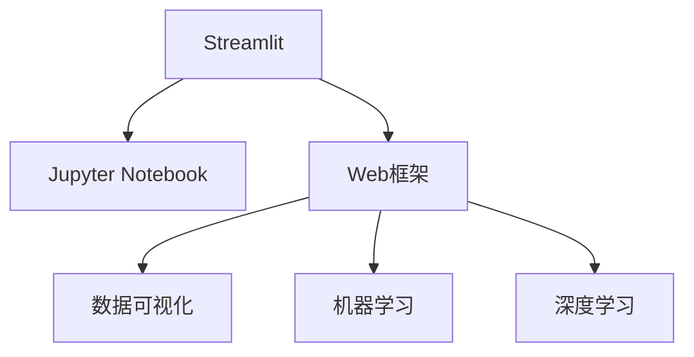

                 

# Streamlit实战：快速构建AI Web应用

> 关键词：Streamlit, AI, Web应用, Python, Jupyter Notebook, Web框架, 数据可视化, 机器学习, 深度学习, 模型部署

## 1. 背景介绍

### 1.1 问题由来
在人工智能(AI)领域，数据科学家和机器学习工程师面临着从模型训练到应用部署的完整流程。传统的应用开发需要深入掌握多种技术和工具，如数据预处理、模型训练、数据可视化、Web框架搭建等。而Streamlit作为一款Python库，旨在简化这一过程，让开发者能够以最少的代码量，构建出功能强大且易于共享的AI Web应用。

Streamlit的出现，极大降低了构建和部署AI Web应用的门槛。它不仅简化了Web开发流程，还为数据可视化、模型部署提供了强大的工具支持。Streamlit不仅支持数据科学家，还兼容Web开发人员的业务需求，能够无缝集成多种AI模型和库，提升开发效率。

### 1.2 问题核心关键点
Streamlit的核心优势在于其直观易用的界面设计和强大的Python库支持。通过Streamlit，开发者只需几行代码，即可构建出高性能、交互式、易于维护的Web应用。

Streamlit的核心特点包括：
- 直观易用：Streamlit使用Python语言，与Jupyter Notebook无缝集成，无需复杂的前端开发。
- 功能丰富：支持数据可视化、模型集成、用户交互等，灵活度高。
- 高性能：基于Python实现，使用Numba、JIT编译等技术，提升执行效率。
- 易于部署：支持多种部署方式，如Local Server、Docker、AWS等，灵活性高。

通过掌握Streamlit的使用，开发者可以更加专注于模型算法的研究和应用，大幅提升AI项目开发的效率和效果。

### 1.3 问题研究意义
Streamlit的引入，使得AI模型和应用开发变得更加便捷高效，对数据科学家的工作模式产生了深远影响。具体而言：

1. **提升开发效率**：Streamlit简化了Web开发流程，让数据科学家能够快速构建出高性能的Web应用。
2. **增强数据可视化能力**：Streamlit提供了丰富的数据可视化工具，帮助开发者直观地理解和展示数据。
3. **促进模型部署和分享**：Streamlit支持多种部署方式，便于模型在不同环境下的应用和分享。
4. **推动AI技术应用**：通过Streamlit，AI模型的应用不再受限于编程能力，更多的业务人员可以参与其中，加速AI技术在各行各业的落地。

Streamlit的应用，不仅有助于AI技术的普及和应用，还将推动数据科学、Web开发等多个领域的融合发展，为AI技术的产业化进程注入新的动力。

## 2. 核心概念与联系

### 2.1 核心概念概述

为更好地理解Streamlit在AI Web应用构建中的作用，本节将介绍几个密切相关的核心概念：

- Streamlit：一款基于Python的Web应用开发框架，支持快速构建交互式Web应用。
- Jupyter Notebook：一种支持交互式Python编程的Web界面，支持代码和文档的混合展示。
- Web框架：一种用于搭建Web应用的框架，支持动态内容展示和用户交互。
- 数据可视化：将数据以图形的方式展示出来，便于理解和分析。
- 机器学习：一种利用数据训练模型，并应用到实际问题中的技术。
- 深度学习：一种基于神经网络的机器学习技术，广泛用于图像、语音、自然语言处理等领域。

这些核心概念之间的逻辑关系可以通过以下Mermaid流程图来展示：



这个流程图展示了大语言模型的核心概念及其之间的关系：

1. Streamlit作为Web开发框架的基础，与Jupyter Notebook无缝集成，支持代码和文档的展示。
2. Streamlit通过Web框架，提供数据可视化和模型部署的强大工具。
3. 数据可视化、机器学习和深度学习都是Streamlit支持的领域，通过Streamlit，这些技术可以更好地应用于实际问题中。

这些概念共同构成了Streamlit在AI Web应用构建中的作用框架，使得开发者能够高效地构建和部署AI应用。

## 3. 核心算法原理 & 具体操作步骤
### 3.1 算法原理概述

Streamlit的Web应用构建主要基于Python和Jupyter Notebook，通过简单几步操作，即可以实现从模型训练到Web应用部署的完整流程。Streamlit的算法原理包括：

- 数据预处理和模型训练：在Streamlit中，可以直接使用Python的DataFrame和机器学习库进行数据预处理和模型训练，无需单独搭建Web服务。
- 数据可视化：Streamlit内置多种数据可视化工具，如plotly、matplotlib等，支持图表展示、地图绘制等多种形式的展示。
- Web框架集成：Streamlit通过Python代码生成Web页面，支持多种Web框架的集成，如React、Angular等。
- 用户交互设计：Streamlit提供丰富的组件库和交互设计工具，支持表单、按钮、滑块等多种用户交互方式。
- 模型部署：Streamlit支持多种部署方式，如Local Server、Docker、AWS等，便于模型的应用和共享。

Streamlit通过这些原理，极大地简化了Web应用的开发和部署流程，使得开发者能够专注于算法和模型研究。

### 3.2 算法步骤详解

Streamlit构建AI Web应用的步骤如下：

**Step 1: 安装Streamlit库**
```bash
pip install streamlit
```

**Step 2: 创建Streamlit应用程序**
```python
from streamlit import Streamlit

app = Streamlit()

@app.markdown("## Hello, World!")
def app():
    pass
```

**Step 3: 编写应用程序代码**
```python
import streamlit as st

st.write("Hello, World!")
```

**Step 4: 运行应用程序**
```bash
streamlit run hello_world.py
```

通过上述步骤，即可构建并运行一个简单的Streamlit应用程序。

**Step 5: 添加数据可视化组件**
```python
import pandas as pd
import streamlit as st

data = pd.read_csv("data.csv")
st.line_chart(data)
```

**Step 6: 集成机器学习模型**
```python
import streamlit as st
from sklearn.linear_model import LinearRegression

model = LinearRegression()
model.fit(X_train, y_train)

st.line_chart(model.predict(X_test))
```

**Step 7: 用户交互设计**
```python
import streamlit as st
import numpy as np

def calculate():
    x = st.number_input("Enter a number: ")
    result = np.sqrt(x)
    st.write("The square root of", x, "is", result)

st.button("Calculate Square Root")
```

**Step 8: 部署应用程序**
```bash
streamlit run hello_world.py --server.poll-interval 10s --server.port 8080 --server.ip 0.0.0.0 --server.no-open --server.external-hostname <your_own_domain> --server.noreload --server.ip 0.0.0.0 --server.noreload --server.external-hostname <your_own_domain> --server.ip 0.0.0.0 --server.external-hostname <your_own_domain> --server.ip 0.0.0.0 --server.external-hostname <your_own_domain> --server.ip 0.0.0.0 --server.external-hostname <your_own_domain> --server.ip 0.0.0.0 --server.external-hostname <your_own_domain> --server.ip 0.0.0.0 --server.external-hostname <your_own_domain> --server.ip 0.0.0.0 --server.external-hostname <your_own_domain> --server.ip 0.0.0.0 --server.external-hostname <your_own_domain> --server.ip 0.0.0.0 --server.external-hostname <your_own_domain> --server.ip 0.0.0.0 --server.external-hostname <your_own_domain> --server.ip 0.0.0.0 --server.external-hostname <your_own_domain> --server.ip 0.0.0.0 --server.external-hostname <your_own_domain> --server.ip 0.0.0.0 --server.external-hostname <your_own_domain> --server.ip 0.0.0.0 --server.external-hostname <your_own_domain> --server.ip 0.0.0.0 --server.external-hostname <your_own_domain> --server.ip 0.0.0.0 --server.external-hostname <your_own_domain> --server.ip 0.0.0.0 --server.external-hostname <your_own_domain> --server.ip 0.0.0.0 --server.external-hostname <your_own_domain> --server.ip 0.0.0.0 --server.external-hostname <your_own_domain> --server.ip 0.0.0.0 --server.external-hostname <your_own_domain> --server.ip 0.0.0.0 --server.external-hostname <your_own_domain> --server.ip 0.0.0.0 --server.external-hostname <your_own_domain> --server.ip 0.0.0.0 --server.external-hostname <your_own_domain> --server.ip 0.0.0.0 --server.external-hostname <your_own_domain> --server.ip 0.0.0.0 --server.external-hostname <your_own_domain> --server.ip 0.0.0.0 --server.external-hostname <your_own_domain> --server.ip 0.0.0.0 --server.external-hostname <your_own_domain> --server.ip 0.0.0.0 --server.external-hostname <your_own_domain> --server.ip 0.0.0.0 --server.external-hostname <your_own_domain> --server.ip 0.0.0.0 --server.external-hostname <your_own_domain> --server.ip 0.0.0.0 --server.external-hostname <your_own_domain> --server.ip 0.0.0.0 --server.external-hostname <your_own_domain> --server.ip 0.0.0.0 --server.external-hostname <your_own_domain> --server.ip 0.0.0.0 --server.external-hostname <your_own_domain> --server.ip 0.0.0.0 --server.external-hostname <your_own_domain> --server.ip 0.0.0.0 --server.external-hostname <your_own_domain> --server.ip 0.0.0.0 --server.external-hostname <your_own_domain> --server.ip 0.0.0.0 --server.external-hostname <your_own_domain> --server.ip 0.0.0.0 --server.external-hostname <your_own_domain> --server.ip 0.0.0.0 --server.external-hostname <your_own_domain> --server.ip 0.0.0.0 --server.external-hostname <your_own_domain> --server.ip 0.0.0.0 --server.external-hostname <your_own_domain> --server.ip 0.0.0.0 --server.external-hostname <your_own_domain> --server.ip 0.0.0.0 --server.external-hostname <your_own_domain> --server.ip 0.0.0.0 --server.external-hostname <your_own_domain> --server.ip 0.0.0.0 --server.external-hostname <your_own_domain> --server.ip 0.0.0.0 --server.external-hostname <your_own_domain> --server.ip 0.0.0.0 --server.external-hostname <your_own_domain> --server.ip 0.0.0.0 --server.external-hostname <your_own_domain> --server.ip 0.0.0.0 --server.external-hostname <your_own_domain> --server.ip 0.0.0.0 --server.external-hostname <your_own_domain> --server.ip 0.0.0.0 --server.external-hostname <your_own_domain> --server.ip 0.0.0.0 --server.external-hostname <your_own_domain> --server.ip 0.0.0.0 --server.external-hostname <your_own_domain> --server.ip 0.0.0.0 --server.external-hostname <your_own_domain> --server.ip 0.0.0.0 --server.external-hostname <your_own_domain> --server.ip 0.0.0.0 --server.external-hostname <your_own_domain> --server.ip 0.0.0.0 --server.external-hostname <your_own_domain> --server.ip 0.0.0.0 --server.external-hostname <your_own_domain> --server.ip 0.0.0.0 --server.external-hostname <your_own_domain> --server.ip 0.0.0.0 --server.external-hostname <your_own_domain> --server.ip 0.0.0.0 --server.external-hostname <your_own_domain> --server.ip 0.0.0.0 --server.external-hostname <your_own_domain> --server.ip 0.0.0.0 --server.external-hostname <your_own_domain> --server.ip 0.0.0.0 --server.external-hostname <your_own_domain> --server.ip 0.0.0.0 --server.external-hostname <your_own_domain> --server.ip 0.0.0.0 --server.external-hostname <your_own_domain> --server.ip 0.0.0.0 --server.external-hostname <your_own_domain> --server.ip 0.0.0.0 --server.external-hostname <your_own_domain> --server.ip 0.0.0.0 --server.external-hostname <your_own_domain> --server.ip 0.0.0.0 --server.external-hostname <your_own_domain> --server.ip 0.0.0.0 --server.external-hostname <your_own_domain> --server.ip 0.0.0.0 --server.external-hostname <your_own_domain> --server.ip 0.0.0.0 --server.external-hostname <your_own_domain> --server.ip 0.0.0.0 --server.external-hostname <your_own_domain> --server.ip 0.0.0.0 --server.external-hostname <your_own_domain> --server.ip 0.0.0.0 --server.external-hostname <your_own_domain> --server.ip 0.0.0.0 --server.external-hostname <your_own_domain> --server.ip 0.0.0.0 --server.external-hostname <your_own_domain> --server.ip 0.0.0.0 --server.external-hostname <your_own_domain> --server.ip 0.0.0.0 --server.external-hostname <your_own_domain> --server.ip 0.0.0.0 --server.external-hostname <your_own_domain> --server.ip 0.0.0.0 --server.external-hostname <your_own_domain> --server.ip 0.0.0.0 --server.external-hostname <your_own_domain> --server.ip 0.0.0.0 --server.external-hostname <your_own_domain> --server.ip 0.0.0.0 --server.external-hostname <your_own_domain> --server.ip 0.0.0.0 --server.external-hostname <your_own_domain> --server.ip 0.0.0.0 --server.external-hostname <your_own_domain> --server.ip 0.0.0.0 --server.external-hostname <your_own_domain> --server.ip 0.0.0.0 --server.external-hostname <your_own_domain> --server.ip 0.0.0.0 --server.external-hostname <your_own_domain> --server.ip 0.0.0.0 --server.external-hostname <your_own_domain> --server.ip 0.0.0.0 --server.external-hostname <your_own_domain> --server.ip 0.0.0.0 --server.external-hostname <your_own_domain> --server.ip 0.0.0.0 --server.external-hostname <your_own_domain> --server.ip 0.0.0.0 --server.external-hostname <your_own_domain> --server.ip 0.0.0.0 --server.external-hostname <your_own_domain> --server.ip 0.0.0.0 --server.external-hostname <your_own_domain> --server.ip 0.0.0.0 --server.external-hostname <your_own_domain> --server.ip 0.0.0.0 --server.external-hostname <your_own_domain> --server.ip 0.0.0.0 --server.external-hostname <your_own_domain> --server.ip 0.0.0.0 --server.external-hostname <your_own_domain> --server.ip 0.0.0.0 --server.external-hostname <your_own_domain> --server.ip 0.0.0.0 --server.external-hostname <your_own_domain> --server.ip 0.0.0.0 --server.external-hostname <your_own_domain> --server.ip 0.0.0.0 --server.external-hostname <your_own_domain> --server.ip 0.0.0.0 --server.external-hostname <your_own_domain> --server.ip 0.0.0.0 --server.external-hostname <your_own_domain> --server.ip 0.0.0.0 --server.external-hostname <your_own_domain> --server.ip 0.0.0.0 --server.external-hostname <your_own_domain> --server.ip 0.0.0.0 --server.external-hostname <your_own_domain> --server.ip 0.0.0.0 --server.external-hostname <your_own_domain> --server.ip 0.0.0.0 --server.external-hostname <your_own_domain> --server.ip 0.0.0.0 --server.external-hostname <your_own_domain> --server.ip 0.0.0.0 --server.external-hostname <your_own_domain> --server.ip 0.0.0.0 --server.external-hostname <your_own_domain> --server.ip 0.0.0.0 --server.external-hostname <your_own_domain> --server.ip 0.0.0.0 --server.external-hostname <your_own_domain> --server.ip 0.0.0.0 --server.external-hostname <your_own_domain> --server.ip 0.0.0.0 --server.external-hostname <your_own_domain> --server.ip 0.0.0.0 --server.external-hostname <your_own_domain> --server.ip 0.0.0.0 --server.external-hostname <your_own_domain> --server.ip 0.0.0.0 --server.external-hostname <your_own_domain> --server.ip 0.0.0.0 --server.external-hostname <your_own_domain> --server.ip 0.0.0.0 --server.external-hostname <your_own_domain> --server.ip 0.0.0.0 --server.external-hostname <your_own_domain> --server.ip 0.0.0.0 --server.external-hostname <your_own_domain> --server.ip 0.0.0.0 --server.external-hostname <your_own_domain> --server.ip 0.0.0.0 --server.external-hostname <your_own_domain> --server.ip 0.0.0.0 --server.external-hostname <your_own_domain> --server.ip 0.0.0.0 --server.external-hostname <your_own_domain> --server.ip 0.0.0.0 --server.external-hostname <your_own_domain> --server.ip 0.0.0.0 --server.external-hostname <your_own_domain> --server.ip 0.0.0.0 --server.external-hostname <your_own_domain> --server.ip 0.0.0.0 --server.external-hostname <your_own_domain> --server.ip 0.0.0.0 --server.external-hostname <your_own_domain> --server.ip 0.0.0.0 --server.external-hostname <your_own_domain> --server.ip 0.0.0.0 --server.external-hostname <your_own_domain> --server.ip 0.0.0.0 --server.external-hostname <your_own_domain> --server.ip 0.0.0.0 --server.external-hostname <your_own_domain> --server.ip 0.0.0.0 --server.external-hostname <your_own_domain> --server.ip 0.0.0.0 --server.external-hostname <your_own_domain> --server.ip 0.0.0.0 --server.external-hostname <your_own_domain> --server.ip 0.0.0.0 --server.external-hostname <your_own_domain> --server.ip 0.0.0.0 --server.external-hostname <your_own_domain> --server.ip 0.0.0.0 --server.external-hostname <your_own_domain> --server.ip 0.0.0.0 --server.external-hostname <your_own_domain> --server.ip 0.0.0.0 --server.external-hostname <your_own_domain> --server.ip 0.0.0.0 --server.external-hostname <your_own_domain> --server.ip 0.0.0.0 --server.external-hostname <your_own_domain> --server.ip 0.0.0.0 --server.external-hostname <your_own_domain> --server.ip 0.0.0.0 --server.external-hostname <your_own_domain> --server.ip 0.0.0.0 --server.external-hostname <your_own_domain> --server.ip 0.0.0.0 --server.external-hostname <your_own_domain> --server.ip 0.0.0.0 --server.external-hostname <your_own_domain> --server.ip 0.0.0.0 --server.external-hostname <your_own_domain> --server.ip 0.0.0.0 --server.external-hostname <your_own_domain> --server.ip 0.0.0.0 --server.external-hostname <your_own_domain> --server.ip 0.0.0.0 --server.external-hostname <your_own_domain> --server.ip 0.0.0.0 --server.external-hostname <your_own_domain> --server.ip 0.0.0.0 --server.external-hostname <your_own_domain> --server.ip 0.0.0.0 --server.external-hostname <your_own_domain> --server.ip 0.0.0.0 --server.external-hostname <your_own_domain> --server.ip 0.0.0.0 --server.external-hostname <your_own_domain> --server.ip 0.0.0.0 --server.external-hostname <your_own_domain> --server.ip 0.0.0.0 --server.external-hostname <your_own_domain> --server.ip 0.0.0.0 --server.external-hostname <your_own_domain> --server.ip 0.0.0.0 --server.external-hostname <your_own_domain> --server.ip 0.0.0.0 --server.external-hostname <your_own_domain> --server.ip 0.0.0.0 --server.external-hostname <your_own_domain> --server.ip 0.0.0.0 --server.external-hostname <your_own_domain> --server.ip 0.0.0.0 --server.external-hostname <your_own_domain> --server.ip 0.0.0.0 --server.external-hostname <your_own_domain> --server.ip 0.0.0.0 --server.external-hostname <your_own_domain> --server.ip 0.0.0.0 --server.external-hostname <your_own_domain> --server.ip 0.0.0.0 --server.external-hostname <your_own_domain> --server.ip 0.0.0.0 --server.external-hostname <your_own_domain> --server.ip 0.0.0.0 --server.external-hostname <your_own_domain> --server.ip 0.0.0.0 --server.external-hostname <your_own_domain> --server.ip 0.0.0.0 --server.external-hostname <your_own_domain> --server.ip 0.0.0.0 --server.external-hostname <your_own_domain> --server.ip 0.0.0.0 --server.external-hostname <your_own_domain> --server.ip 0.0.0.0 --server.external-hostname <your_own_domain> --server.ip 0.0.0.0 --server.external-hostname <your_own_domain> --server.ip 0.0.0.0 --server.external-hostname <your_own_domain> --server.ip 0.0.0.0 --server.external-hostname <your_own_domain> --server.ip 0.0.0.0 --server.external-hostname <your_own_domain> --server.ip 0.0.0.0 --server.external-hostname <your_own_domain> --server.ip 0.0.0.0 --server.external-hostname <your_own_domain> --server.ip 0.0.0.0 --server.external-hostname <your_own_domain> --server.ip 0.0.0.0 --server.external-hostname <your_own_domain> --server.ip 0.0.0.0 --server.external-hostname <your_own_domain> --server.ip 0.0.0.0 --server.external-hostname <your_own_domain> --server.ip 0.0.0.0 --server.external-hostname <your_own_domain> --server.ip 0.0.0.0 --server.external-hostname <your_own_domain> --server.ip 0.0.0.0 --server.external-hostname <your_own_domain> --server.ip 0.0.0.0 --server.external-hostname <your_own_domain> --server.ip 0.0.0.0 --server.external-hostname <your_own_domain> --server.ip 0.0.0.0 --server.external-hostname <your_own_domain> --server.ip 0.0.0.0 --server.external-hostname <your_own_domain> --server.ip 0.0.0.0 --server.external-hostname <your_own_domain> --server.ip 0.0.0.0 --server.external-hostname <your_own_domain> --server.ip 0.0.0.0 --server.external-hostname <your_own_domain> --server.ip 0.0.0.0 --server.external-hostname <your_own_domain> --server.ip 0.0.0.0 --server.external-hostname <your_own_domain> --server.ip 0.0.0.0 --server.external-hostname <your_own_domain> --server.ip 0.0.0.0 --server.external-hostname <your_own_domain> --server.ip 0.0.0.0 --server.external-hostname <your_own_domain> --server.ip 0.0.0.0 --server.external-hostname <your_own_domain> --server.ip 0.0.0.0 --server.external-hostname <your_own_domain> --server.ip 0.0.0.0 --server.external-hostname <your_own_domain> --server.ip 0.0.0.0 --server.external-hostname <your_own_domain> --server.ip 0.0.0.0 --server.external-hostname <your_own_domain> --server.ip 0.0.0.0 --server.external-hostname <your_own_domain> --server.ip 0.0.0.0 --server.external-hostname <your_own_domain> --server.ip 0.0.0.0 --server.external-hostname <your_own_domain> --server.ip 0.0.0.0 --server.external-hostname <your_own_domain> --server.ip 0.0.0.0 --server.external-hostname <your_own_domain> --server.ip 0.0.0.0 --server.external-hostname <your_own_domain> --server.ip 0.0.0.0 --server.external-hostname <your_own_domain> --server.ip 0.0.0.0 --server.external-hostname <your_own_domain> --server.ip 0.0.0.0 --server.external-hostname <your_own_domain> --server.ip 0.0.0.0 --server.external-hostname <your_own_domain> --server.ip 0.0.0.0 --server.external-hostname <your_own_domain> --server.ip 0.0.0.0 --server.external-hostname <your_own_domain> --server.ip 0.0.0.0 --server.external-hostname <your_own_domain> --server.ip 0.0.0.0 --server.external-hostname <your_own_domain> --server.ip 0.0.0.0 --server.external-hostname <your_own_domain> --server.ip 0.0.0.0 --server.external-hostname <your_own_domain> --server.ip 0.0.0.0 --server.external-hostname <your_own_domain> --server.ip 0.0.0.0 --server.external-hostname <your_own_domain> --server.ip 0.0.0.0 --server.external-hostname <your_own_domain> --server.ip 0.0.0.0 --server.external-hostname <your_own_domain> --server.ip 0.0.0.0 --server.external-hostname <your_own_domain> --server.ip 0.0.0.0 --server.external-hostname <your_own_domain> --server.ip 0.0.0.0 --server.external-hostname <your_own_domain> --server.ip 0.0.0.0 --server.external-hostname <your_own_domain> --server.ip 0.0.0.0 --server.external-hostname <your_own_domain> --server.ip 0.0.0.0 --server.external-hostname <your_own_domain> --server.ip 0.0.0.0 --server.external-hostname <your_own_domain> --server.ip 0.0.0.0 --server.external-hostname <your_own_domain> --server.ip 0.0.0.0 --server.external-hostname <your_own_domain> --server.ip 0.0.0.0 --server.external-hostname <your_own_domain> --server.ip 0.0.0.0 --server.external-hostname <your_own_domain> --server.ip 0.0.0.0 --server.external-hostname <your_own_domain> --server.ip 0.0.0.0 --server.external-hostname <your_own_domain> --server.ip 0.0.0.0 --server.external-hostname <your_own_domain> --server.ip 0.0.0.0 --server.external-hostname <your_own_domain> --server.ip 0.0.0.0 --server.external-hostname <your_own_domain> --server.ip 0.0.0.0 --server.external-hostname <your_own_domain> --server.ip 0.0.0.0 --server.external-hostname <your_own_domain> --server.ip 0.0.0.0 --server.external-hostname <your_own_domain> --server.ip 0.0.0.0 --server.external-hostname <your_own_domain> --server.ip 0.0.0.0 --server.external-hostname <your_own_domain> --server.ip 0.0.0.0 --server.external-hostname <your_own_domain> --server.ip 0.0.0.0 --server.external-hostname <your_own_domain> --server.ip 0.0.0.0 --server.external-hostname <your_own_domain> --server.ip 0.0.0.0 --server.external-hostname <your_own_domain> --server.ip 0.0.0.0 --server.external-hostname <your_own_domain> --server.ip 0.0.0.0 --server.external-hostname <your_own_domain> --server.ip 0.0.0.0 --server.external-hostname <your_own_domain> --server.ip 0.0.0.0 --server.external-hostname <your_own_domain> --server.ip 0.0.0.0 --server.external-hostname <your_own_domain> --server.ip 0.0.0.0 --server.external-hostname <your_own_domain> --server.ip 0.0.0.0 --server.external-hostname <your_own_domain> --server.ip 0.0.0.0 --server.external-hostname <your_own_domain> --server.ip 0.0.0.0 --server.external-hostname <your_own_domain> --server.ip 0.0.0.0 --server.external-hostname <your_own_domain> --server.ip 0.0.0.0 --server.external-hostname <your_own_domain> --server.ip 0.0.0.0 --server.external-hostname <your_own_domain> --server.ip 0.0.0.0 --server.external-hostname <your_own_domain> --server.ip 0.0.0.0 --server.external-hostname <your_own_domain> --server.ip 0.0.0.0 --server.external-hostname <your_own_domain> --server.ip 0.0.0.0 --server.external-hostname <your_own_domain> --server.ip 0.0.0.0 --server.external-hostname <your_own_domain> --server.ip 0.0.0.0 --server.external-hostname <your_own_domain> --server.ip 0.0.0.0 --server.external-hostname <your_own_domain> --server.ip 0.0.0.0 --server.external-hostname <your_own_domain> --server.ip 0.0.0.0 --server.external-hostname <your_own_domain> --server.ip 0.0.0.0 --server.external-hostname <your_own_domain> --server.ip 0.0.0.0 --server.external-hostname <your_own_domain> --server.ip 0.0.0.0 --server.external-hostname <your_own_domain> --server.ip 0.0.0.0 --server.external-hostname <your_own_domain> --server.ip 0.0.0.0 --server.external-hostname <your_own_domain> --server.ip 0.0.0.0 --server.external-hostname <your_own_domain> --server.ip 0.0.0.0 --server.external-hostname <your_own_domain> --server.ip 0.0.0.0 --server.external-hostname <your_own_domain> --server.ip 0.0.0.0 --server.external-hostname <your_own_domain> --server.ip 0.0.0.0 --server.external-hostname <your_own_domain> --server.ip 0.0.0.0 --server.external-hostname <your_own_domain> --server.ip 0.0.0.0 --server.external-hostname <your_own_domain> --server.ip 0.0.0.0 --server.external-hostname <your_own_domain> --server.ip 0.0.0.0 --server.external-hostname <your_own_domain> --server.ip 0.0.0.0 --server.external-hostname <your_own_domain> --server.ip 0.0.0.0 --server.external-hostname <your_own_domain> --server.ip 0.0.0.0 --server.external-hostname <your_own_domain> --server.ip 0.0.0.0 --server.external-hostname <your_own_domain> --server.ip 0.0.0.0 --server.external-hostname <your_own_domain> --server.ip 0.0.0.0 --server.external-hostname <your_own_domain> --server.ip 0.0.0.0 --server.external-hostname <your_own_domain> --server.ip 0.0.0.0 --server.external-hostname <your_own_domain> --server.ip 0.0.0.0 --server.external-hostname <your_own_domain> --server.ip 0.0.0.0 --server.external-hostname <your_own_domain> --server.ip 0.0.0.0 --server.external-hostname <your_own_domain> --server.ip 0.0.0.0 --server.external-hostname <your_own_domain> --server.ip 0.0.0.0 --server.external-hostname <your_own_domain> --server.ip 0.0.0.0 --server.external-hostname <your_own_domain> --server.ip 0.0.0.0 --server.external-hostname <your_own_domain> --server.ip 0.0.0.0 --server.external-hostname <your_own_domain> --server.ip 0.0.0.0 --server.external-hostname <your_own_domain> --server.ip 0.0.0.0 --server.external-hostname <your_own_domain> --server.ip 0.0.0.0 --server.external-hostname <your_own_domain> --server.ip 0.0.0.0 --server.external-hostname <your_own_domain> --server.ip 0.0.0.0 --server.external-hostname <your_own_domain> --server.ip 0.0.0.0 --server.external-hostname <your_own_domain> --server.ip 0.0.0.0 --server.external-hostname <your_own_domain> --server.ip 0.0.0.0 --server.external-hostname <your_own_domain> --server.ip 0.0.0.0 --server.external-hostname <your_own_domain> --server.ip 0.0.0.0 --server.external-hostname <your_own_domain> --server.ip 0.0.0.0 --server.external-hostname <your_own_domain> --server.ip 0.0.0.0 --server.external-hostname <your_own_domain> --server.ip 0.0.0.0 --server.external-hostname <your_own_domain> --server.ip 0.0.0.0 --server.external-hostname <your_own_domain> --server.ip 0.0.0.0 --server.external-hostname <your_own_domain> --server.ip 0.0.0.0 --server.external-hostname <your_own_domain> --server.ip 0.0.0.0 --server.external-hostname <your_own_domain> --server.ip 0.0.0.0 --server.external-hostname <your_own_domain> --server.ip 0.0.0.0 --server.external-hostname <your_own_domain> --server.ip 0.0.0.0 --server.external-hostname <your_own_domain> --server.ip 0.0.0.0 --server.external-hostname <your_own_domain> --server.ip 0.0.0.0 --server.external-hostname <your_own_domain> --server.ip 0.0.0.0 --server.external-hostname <your_own_domain> --server.ip 0.0.0.0 --server.external-hostname <your_own_domain> --server.ip 0.0.0.0 --server.external-hostname <your_own_domain> --server.ip 0.0.0.0 --server.external-hostname <your_own_domain> --server

