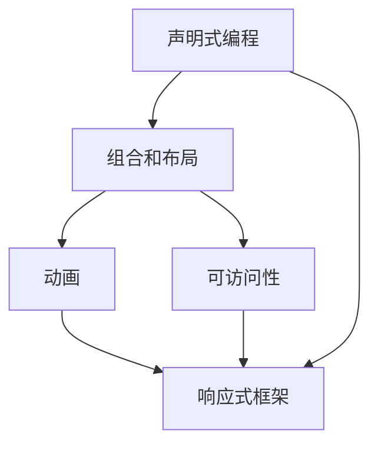

                 

# SwiftUI 框架设计：苹果的声明式 UI 框架

> 关键词：SwiftUI, 声明式 UI, 组合, 布局, 动画, 可访问性

## 1. 背景介绍

在过去的数十年中，移动应用的开发一直依赖于传统的界面编程范式，开发人员需要手动管理界面元素、布局和响应式逻辑，以创建令人愉悦的用户体验。然而，这些传统的框架逐渐暴露出其局限性，包括代码复用性差、难以维护、灵活性不足等问题。因此，苹果公司于2019年推出了SwiftUI框架，旨在提供一种声明式的UI编程体验，以更简洁、更直观的方式来构建界面。

SwiftUI的发布，标志着苹果在UI开发框架上的新篇章。这一框架的发布，不仅仅是苹果的一次技术创新，更是对整个移动开发生态系统的深刻变革。通过SwiftUI，开发者可以更快速、更有效地构建复杂、响应式的用户界面，同时保持代码的可读性和可维护性。

## 2. 核心概念与联系

### 2.1 核心概念概述

SwiftUI框架是基于声明式UI设计原则构建的，通过组合和布局来构建UI元素，支持动画、可访问性等高级特性。SwiftUI的核心概念包括：

- **声明式编程**：通过声明式的语法，将UI构建过程从指令式编程转向声明式编程，开发者只需描述所需的用户界面，而不必关心具体的布局和交互逻辑。

- **组合和布局**：利用组合和布局系统，开发者可以通过简单的函数式API，组合和布局不同的UI元素，快速构建复杂的界面。

- **动画**：提供内置的动画系统，使开发者能够轻松创建响应式、流畅的动画效果。

- **可访问性**：包含一系列API，使UI元素更容易被辅助技术（如屏幕阅读器）理解和访问。

- **响应式框架**：能够自动响应设备尺寸和方向的变化，适应不同的屏幕环境。

- **声明式框架**：将界面描述和布局逻辑分离，使代码更具可读性和可维护性。

SwiftUI的这些特性，使它成为构建现代移动应用和用户界面的理想选择。

### 2.2 核心概念原理和架构的 Mermaid 流程图



此流程图展示了SwiftUI的核心概念之间的联系。声明式编程通过组合和布局，定义了UI元素的构建过程，并利用动画和响应式框架，使界面更加动态和响应式。同时，通过可访问性API，确保了UI对所有用户都易于访问。

## 3. 核心算法原理 & 具体操作步骤

### 3.1 算法原理概述

SwiftUI的核心算法原理主要基于组合和布局，通过函数式编程的方式，组合不同的UI元素，创建复杂的布局结构。这种基于声明式的算法，减少了手动管理布局和响应的代码量，使开发者可以更专注于应用的核心业务逻辑。

SwiftUI的算法原理包括以下几个关键点：

1. **组合**：通过组合函数，将不同的UI元素和布局结构进行组合，创建复杂的布局。

2. **布局**：提供了一套灵活的布局系统，支持各种常见的布局方式，如网格布局、弹性布局等。

3. **动画**：基于演化的动画算法，使得UI元素能够流畅、自然地变化。

4. **可访问性**：通过一系列的API，确保UI元素可以被辅助技术访问和理解。

5. **响应式**：利用响应式框架，使得UI能够自动适应不同的屏幕环境。

### 3.2 算法步骤详解

SwiftUI的算法步骤可以分为以下几个关键步骤：

**Step 1: 定义视图**  
开发者首先定义一个或多个视图，这些视图描述了界面的基本结构和布局。

**Step 2: 组合视图**  
通过组合函数，将不同的视图组合在一起，创建复杂的布局。

**Step 3: 应用布局**  
为视图应用不同的布局方式，如水平或垂直布局、网格布局等。

**Step 4: 添加动画**  
为视图添加动画效果，使UI元素能够流畅地变化。

**Step 5: 实现可访问性**  
通过添加可访问性标记和描述，使UI元素能够被辅助技术访问和理解。

**Step 6: 处理响应式**  
利用响应式框架，使得UI能够自动适应不同的屏幕环境。

**Step 7: 测试和调试**  
在完成UI构建后，开发者可以通过模拟器或真实设备进行测试和调试，确保UI的可用性和性能。

### 3.3 算法优缺点

SwiftUI的优点包括：

1. **简洁和可读性**：声明式编程使得代码更加简洁和易于理解，开发者可以更快速地构建复杂的UI。

2. **可维护性**：通过组合和布局，代码的可读性和可维护性得到了显著提升，易于修改和扩展。

3. **灵活性**：灵活的布局系统和动画系统，使开发者能够创建动态、响应式的UI。

4. **可访问性**：内置的可访问性API，使UI元素更容易被辅助技术访问。

5. **响应式**：自动适应的响应式框架，使得UI能够适应不同的设备尺寸和方向。

SwiftUI的缺点包括：

1. **学习曲线**：由于与传统的界面编程范式不同，开发者需要适应新的编程方式。

2. **性能问题**：复杂的UI和动画可能导致性能问题，特别是在高帧率和高数据量的应用中。

3. **缺乏细节控制**：在处理复杂的UI布局时，可能缺乏对底层控件的细粒度控制。

### 3.4 算法应用领域

SwiftUI的应用领域非常广泛，可以用于各种类型的移动应用和用户界面，包括：

1. **移动应用**：构建iOS和macOS应用的用户界面。

2. **网页应用**：使用SwiftUI的Web视图，构建响应式网页界面。

3. **游戏应用**：利用SwiftUI的动画和布局系统，创建交互式的游戏界面。

4. **桌面应用**：使用SwiftUI的macOS视图，构建桌面应用的用户界面。

5. **可穿戴设备**：利用SwiftUI的可访问性API，为可穿戴设备创建易于访问的UI。

6. **汽车和车载设备**：通过SwiftUI创建交互式的车载界面和仪表盘。

SwiftUI的这些应用领域，使得它在现代移动开发中成为不可或缺的工具。

## 4. 数学模型和公式 & 详细讲解 & 举例说明

SwiftUI的数学模型和公式主要集中在UI元素的位置、大小和布局上。以下是一些关键公式的详细讲解：

### 4.1 数学模型构建

SwiftUI的数学模型主要包括以下几个部分：

1. **视图定义**：通过函数描述UI元素，包括视图的位置、大小和内容。

2. **布局算法**：确定UI元素的相对位置和大小，支持常见的布局方式。

3. **动画算法**：描述UI元素的动画变化，包括位移、缩放和旋转等。

4. **可访问性API**：为UI元素添加可访问性标记和描述。

5. **响应式框架**：根据设备尺寸和方向，调整UI元素的位置和大小。

### 4.2 公式推导过程

SwiftUI的公式推导过程主要基于组合和布局的原理。以下是一些关键公式的推导：

**网格布局**：
```swift
Grid(columns: [20, 80], rows: [30, 70]) {
    Text("Column 1")
    Text("Column 2")
}
```
网格布局公式：
```
rows: [a, b], columns: [c, d]
```

**弹性布局**：
```swift
HStack {
    VStack {
        Text("First item")
        Text("Second item")
    }
    spacer(10)
    VStack {
        Text("Third item")
        Text("Fourth item")
    }
}
```
弹性布局公式：
```
HStack(VStack(items: [a, b]), spacer(10), VStack(items: [c, d]))
```

### 4.3 案例分析与讲解

以一个简单的UI为例，分析SwiftUI的实现过程：

```swift
struct ContentView: View {
    var body: some View {
        VStack {
            Text("Hello, World!")
                .font(.headline)
                .padding()
            Button("Click Me") {
                print("Button clicked!")
            }
        }
    }
}
```

这个视图定义了一个垂直堆叠的视图，包含一个字体大小为标题、居中对齐的文本和一个带有点击事件的的按钮。

## 5. 项目实践：代码实例和详细解释说明

### 5.1 开发环境搭建

在开始SwiftUI开发之前，需要安装Xcode和SwiftUI框架。Xcode是苹果官方的开发环境，包含SwiftUI的完整支持。在Xcode中，开发者可以直接创建新的SwiftUI项目，并使用内置的模拟器进行测试。

### 5.2 源代码详细实现

以下是一个简单的SwiftUI视图，用于展示如何在Xcode中创建和调试SwiftUI应用：

```swift
import SwiftUI

struct ContentView: View {
    var body: some View {
        VStack {
            Text("Hello, World!")
                .font(.headline)
                .padding()
            Button("Click Me") {
                print("Button clicked!")
            }
        }
    }
}

struct ContentView_Previews: PreviewProvider {
    static var previews: some View {
        ContentView()
    }
}
```

这个视图定义了一个垂直堆叠的视图，包含一个字体大小为标题、居中对齐的文本和一个带有点击事件的的按钮。在Xcode中，可以使用Preview提供程序来预览和测试视图。

### 5.3 代码解读与分析

SwiftUI的代码非常简洁和直观，开发者只需定义视图函数，即可创建复杂的UI界面。例如，在上面的代码中，`ContentView`函数定义了一个垂直堆叠的视图，包含一个文本和一个按钮。开发者只需关注视图的逻辑和内容，而不必关心具体的布局和响应逻辑。

## 6. 实际应用场景

SwiftUI在实际应用场景中表现出色，已经在多个领域得到了广泛应用，包括：

1. **iOS应用**：苹果官方推荐使用SwiftUI构建iOS应用的用户界面。

2. **macOS应用**：使用SwiftUI的macOS视图，构建桌面应用的用户界面。

3. **Web应用**：利用SwiftUI的Web视图，构建响应式网页界面。

4. **游戏应用**：利用SwiftUI的动画和布局系统，创建交互式的游戏界面。

5. **汽车和车载设备**：通过SwiftUI创建交互式的车载界面和仪表盘。

6. **可穿戴设备**：利用SwiftUI的可访问性API，为可穿戴设备创建易于访问的UI。

SwiftUI的这些应用场景，展示了其在现代移动开发中的强大能力和广泛适用性。

## 7. 工具和资源推荐

### 7.1 学习资源推荐

为了帮助开发者系统掌握SwiftUI的理论基础和实践技巧，这里推荐一些优质的学习资源：

1. **SwiftUI官方文档**：苹果公司提供的官方文档，详细介绍了SwiftUI的API、用法和最佳实践。

2. **SwiftUI教程**：由苹果公司开发的在线教程，适合初学者入门学习。

3. **SwiftUI Cookbook**：一本关于SwiftUI的实践指南，提供了大量实用代码和案例。

4. **Udemy SwiftUI课程**：Udemy上提供的SwiftUI课程，涵盖SwiftUI的各个方面，从基础到高级。

5. **SwiftUI社区**：苹果官方提供的SwiftUI社区，开发者可以在这里交流经验、分享代码。

### 7.2 开发工具推荐

SwiftUI的开发工具主要有：

1. **Xcode**：苹果官方提供的开发环境，包含SwiftUI的完整支持。

2. **Xcode playground**：用于测试和调试SwiftUI代码的交互式环境。

3. **GitHub**：开发者可以使用GitHub存储和共享SwiftUI代码。

### 7.3 相关论文推荐

SwiftUI的开发和学习资源主要集中在苹果的官方文档和社区中。以下是一些相关论文，供开发者进一步阅读：

1. **SwiftUI Design Principles**：苹果公司提供的SwiftUI设计原则，详细介绍了SwiftUI的设计理念和最佳实践。

2. **SwiftUI Architecture Patterns**：探讨SwiftUI中的架构模式，包括组合、布局和响应式架构等。

3. **SwiftUI Performance Optimization**：介绍如何优化SwiftUI应用的性能，包括动画优化和内存管理。

## 8. 总结：未来发展趋势与挑战

### 8.1 研究成果总结

SwiftUI自推出以来，在UI开发领域引发了深刻变革。其简洁、声明式的编程模型，使得开发者能够更快速、更高效地构建复杂的UI界面。SwiftUI的支持和应用，也展示了苹果在UI开发框架上的前瞻性和创新能力。

### 8.2 未来发展趋势

SwiftUI的未来发展趋势包括：

1. **更多的UI组件**：苹果公司将不断推出新的UI组件和布局系统，使开发者能够更方便地构建复杂的UI界面。

2. **更强大的动画系统**：SwiftUI将不断增强动画系统的功能，提供更多动态、流畅的动画效果。

3. **更完善的可访问性**：SwiftUI将不断完善可访问性API，使UI元素更容易被辅助技术访问和理解。

4. **更灵活的布局系统**：SwiftUI将不断增强布局系统的灵活性，支持更多样的布局方式。

5. **更高效的性能优化**：SwiftUI将不断优化性能，解决复杂的UI和动画带来的性能问题。

### 8.3 面临的挑战

SwiftUI面临的挑战包括：

1. **学习曲线**：由于与传统的界面编程范式不同，开发者需要适应新的编程方式。

2. **性能问题**：复杂的UI和动画可能导致性能问题，特别是在高帧率和高数据量的应用中。

3. **细粒度控制**：在处理复杂的UI布局时，可能缺乏对底层控件的细粒度控制。

4. **社区支持**：SwiftUI社区仍在不断发展中，可能存在一些未解决的问题和挑战。

### 8.4 研究展望

SwiftUI的未来研究展望包括：

1. **更多的UI组件**：苹果公司将不断推出新的UI组件和布局系统，使开发者能够更方便地构建复杂的UI界面。

2. **更强大的动画系统**：SwiftUI将不断增强动画系统的功能，提供更多动态、流畅的动画效果。

3. **更完善的可访问性**：SwiftUI将不断完善可访问性API，使UI元素更容易被辅助技术访问和理解。

4. **更灵活的布局系统**：SwiftUI将不断增强布局系统的灵活性，支持更多样的布局方式。

5. **更高效的性能优化**：SwiftUI将不断优化性能，解决复杂的UI和动画带来的性能问题。

6. **社区支持**：苹果公司将不断完善SwiftUI的社区支持，解决开发者在实际开发中遇到的问题。

## 9. 附录：常见问题与解答

**Q1: 如何处理复杂的UI布局？**

A: 使用SwiftUI的组合和布局系统，可以通过简单的函数式API，组合和布局不同的UI元素，创建复杂的布局。

**Q2: SwiftUI的性能问题如何解决？**

A: 利用SwiftUI的动画优化、内存管理和响应式框架，可以解决复杂的UI和动画带来的性能问题。

**Q3: SwiftUI的可访问性API有哪些？**

A: SwiftUI提供了多种可访问性API，包括可访问性标记、描述、语言标签等，使UI元素更容易被辅助技术访问。

**Q4: 如何学习SwiftUI？**

A: 可以参考SwiftUI官方文档、教程、书籍和社区资源，逐步掌握SwiftUI的基础知识和高级技巧。

---

作者：禅与计算机程序设计艺术 / Zen and the Art of Computer Programming

