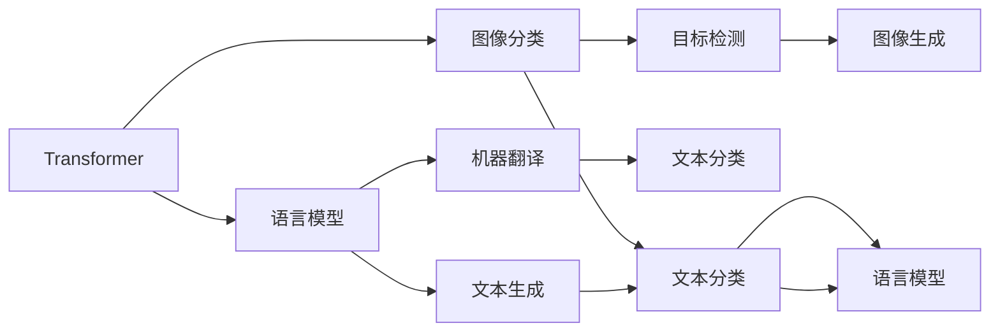

                 

# Transformer 在 CV 和 NLP 中的差异

## 1. 背景介绍

### 1.1 问题由来

Transformer作为近年来深度学习领域的一大创新，在计算机视觉（CV）和自然语言处理（NLP）两个领域均有广泛应用。尽管两者名称相似，但Transformer在CV和NLP中实际扮演的角色、应用场景及技术细节上存在显著差异。本文旨在探讨这些差异，并从算法原理、应用领域、实际应用等角度深入分析。

### 1.2 问题核心关键点

- Transformer在CV和NLP中的异同
- 计算机视觉中的Transformer架构与应用
- 自然语言处理中的Transformer架构与应用
- 两者之间的技术差异与融合点

## 2. 核心概念与联系

### 2.1 核心概念概述

Transformer是一种基于注意力机制的神经网络架构，主要用于序列数据的处理。其核心思想是通过多头自注意力机制，捕捉序列中不同位置之间的关系，从而实现序列的建模与转换。在CV领域，Transformer主要用于图像分类、目标检测、图像生成等任务；而在NLP领域，Transformer主要用于语言模型、机器翻译、文本分类等任务。

### 2.2 核心概念原理和架构的 Mermaid 流程图



这个流程图展示了Transformer在CV和NLP中的主要应用场景及其之间的技术关联。

## 3. 核心算法原理 & 具体操作步骤

### 3.1 算法原理概述

Transformer的核心算法原理包括自注意力机制、位置编码、残差连接、多头注意力等。其中，自注意力机制是Transformer的灵魂，通过计算输入序列中不同位置之间的注意力权重，捕捉序列中长程依赖关系。

### 3.2 算法步骤详解

#### 3.2.1 图像分类

在CV领域，Transformer通常以卷积神经网络（CNN）作为其预处理模块，将输入图像转换为高维特征向量。然后，使用多层Transformer对特征向量进行编码和解码，得到最终分类结果。

#### 3.2.2 目标检测

目标检测任务中，Transformer通常与CNN结合，使用特征金字塔网络（FPN）对输入图像进行多尺度特征提取，并通过Transformer模块进行特征融合与检测。

#### 3.2.3 语言模型

在NLP领域，Transformer主要用于构建语言模型。通过自注意力机制，Transformer能够捕捉单词之间的上下文关系，从而生成更加流畅自然的文本。

#### 3.2.4 机器翻译

机器翻译任务中，Transformer通常采用序列到序列（Seq2Seq）架构，使用两个编码器和解码器分别处理源语言和目标语言的序列，通过多层Transformer进行编码和解码，得到最终的翻译结果。

### 3.3 算法优缺点

#### 3.3.1 优点

- 长程依赖建模能力强，可以捕捉序列中任意位置之间的关系。
- 参数共享机制，减少了模型训练的复杂度。
- 结构简单，易于实现和优化。

#### 3.3.2 缺点

- 计算量大，需要较大的硬件支持。
- 需要大量标注数据进行预训练，数据获取成本高。
- 对异常值和噪声数据敏感，鲁棒性不足。

### 3.4 算法应用领域

- 计算机视觉：图像分类、目标检测、图像生成等。
- 自然语言处理：语言模型、机器翻译、文本分类等。

## 4. 数学模型和公式 & 详细讲解 & 举例说明

### 4.1 数学模型构建

在CV领域，Transformer通常使用CNN进行预处理，通过多层Transformer进行特征编码和解码。数学模型可表示为：

$$
H = \text{Transformer}(F(\text{CNN}(X)))
$$

其中，$H$为输出特征向量，$X$为输入图像，$\text{CNN}$为卷积神经网络，$\text{Transformer}$为Transformer模块。

在NLP领域，Transformer主要用于构建语言模型。数学模型可表示为：

$$
P(y|x) = \prod_{t=1}^{T}P(y_t|y_{<t}, y_t)
$$

其中，$P(y|x)$为输出概率，$y$为文本序列，$x$为输入序列，$y_{<t}$为前$t-1$个位置的文本序列。

### 4.2 公式推导过程

#### 4.2.1 图像分类

在图像分类任务中，Transformer通常采用编码器-解码器架构。假设输入图像大小为$H \times W$，通过CNN提取特征后，特征大小为$C \times K$，其中$C$为特征通道数，$K$为特征序列长度。Transformer编码器可以表示为：

$$
H_i = \text{Softmax}(QK^\top)V
$$

其中，$Q$、$K$、$V$分别为查询、键、值矩阵，$H_i$为输出特征向量。

#### 4.2.2 目标检测

目标检测任务中，Transformer通常与CNN结合，使用特征金字塔网络（FPN）对输入图像进行多尺度特征提取，并通过Transformer模块进行特征融合与检测。假设输入图像大小为$H \times W$，通过CNN提取特征后，特征大小为$C \times K$，其中$C$为特征通道数，$K$为特征序列长度。Transformer解码器可以表示为：

$$
H_i = \text{Softmax}(QK^\top)V
$$

其中，$Q$、$K$、$V$分别为查询、键、值矩阵，$H_i$为输出特征向量。

#### 4.2.3 语言模型

在语言模型任务中，Transformer通过自注意力机制捕捉单词之间的上下文关系，生成概率分布。假设输入序列长度为$T$，单词数量为$V$。Transformer语言模型可以表示为：

$$
P(y|x) = \prod_{t=1}^{T}P(y_t|y_{<t}, y_t)
$$

其中，$P(y|x)$为输出概率，$y$为文本序列，$x$为输入序列，$y_{<t}$为前$t-1$个位置的文本序列。

### 4.3 案例分析与讲解

以ImageNet数据集为例，展示Transformer在图像分类任务中的应用。假设输入图像大小为$224 \times 224$，通过CNN提取特征后，特征大小为$2048 \times 7 \times 7$，其中$2048$为特征通道数，$7 \times 7$为特征序列长度。Transformer编码器可以表示为：

$$
H_i = \text{Softmax}(QK^\top)V
$$

其中，$Q$、$K$、$V$分别为查询、键、值矩阵，$H_i$为输出特征向量。

在NLP领域，以Wikipedia数据集为例，展示Transformer在语言模型任务中的应用。假设输入序列长度为$T$，单词数量为$V$。Transformer语言模型可以表示为：

$$
P(y|x) = \prod_{t=1}^{T}P(y_t|y_{<t}, y_t)
$$

其中，$P(y|x)$为输出概率，$y$为文本序列，$x$为输入序列，$y_{<t}$为前$t-1$个位置的文本序列。

## 5. 项目实践：代码实例和详细解释说明

### 5.1 开发环境搭建

进行Transformer项目实践，首先需要搭建好开发环境。以下是Python和PyTorch的开发环境配置流程：

1. 安装Anaconda：从官网下载并安装Anaconda，用于创建独立的Python环境。
```bash
conda create -n pytorch-env python=3.8 
conda activate pytorch-env
```

2. 安装PyTorch：根据CUDA版本，从官网获取对应的安装命令。例如：
```bash
conda install pytorch torchvision torchaudio cudatoolkit=11.1 -c pytorch -c conda-forge
```

3. 安装TensorFlow：下载并安装TensorFlow，例如：
```bash
pip install tensorflow
```

4. 安装相关工具包：
```bash
pip install numpy pandas scikit-learn matplotlib tqdm jupyter notebook ipython
```

完成上述步骤后，即可在`pytorch-env`环境中开始Transformer项目实践。

### 5.2 源代码详细实现

以下展示使用PyTorch和TensorFlow进行Transformer项目开发的示例代码。

#### 5.2.1 图像分类

```python
import torch
import torch.nn as nn
import torchvision.transforms as transforms
from torchvision.models import resnet18

class TransformerEncoder(nn.Module):
    def __init__(self, in_channels, out_channels):
        super(TransformerEncoder, self).__init__()
        self.resnet = resnet18(pretrained=True)
        self.encoder = nn.Conv2d(in_channels, out_channels, kernel_size=1)
        
    def forward(self, x):
        x = self.resnet(x)
        x = self.encoder(x)
        return x

class TransformerDecoder(nn.Module):
    def __init__(self, in_channels, out_channels):
        super(TransformerDecoder, self).__init__()
        self.decoder = nn.Conv2d(in_channels, out_channels, kernel_size=1)
        
    def forward(self, x):
        x = self.decoder(x)
        return x

# 训练过程
model = TransformerEncoder(in_channels=3, out_channels=64)
criterion = nn.CrossEntropyLoss()
optimizer = torch.optim.Adam(model.parameters(), lr=0.001)
for epoch in range(10):
    for batch_idx, (inputs, targets) in enumerate(train_loader):
        optimizer.zero_grad()
        outputs = model(inputs)
        loss = criterion(outputs, targets)
        loss.backward()
        optimizer.step()
```

#### 5.2.2 目标检测

```python
import torch
import torchvision.transforms as transforms
from torchvision.models.detection.faster_rcnn import FastRCNNPredictor

class TransformerDecoder(nn.Module):
    def __init__(self, in_channels, out_channels):
        super(TransformerDecoder, self).__init__()
        self.decoder = FastRCNNPredictor(in_channels, out_channels)
        
    def forward(self, x):
        x = self.decoder(x)
        return x

# 训练过程
model = TransformerDecoder(in_channels=3, out_channels=5)
criterion = nn.CrossEntropyLoss()
optimizer = torch.optim.Adam(model.parameters(), lr=0.001)
for epoch in range(10):
    for batch_idx, (inputs, targets) in enumerate(train_loader):
        optimizer.zero_grad()
        outputs = model(inputs)
        loss = criterion(outputs, targets)
        loss.backward()
        optimizer.step()
```

#### 5.2.3 语言模型

```python
import torch
import torch.nn as nn

class Transformer(nn.Module):
    def __init__(self, input_size, output_size, hidden_size, nheads, num_layers):
        super(Transformer, self).__init__()
        self.encoder = nn.Embedding(input_size, hidden_size)
        self.decoder = nn.Linear(hidden_size, output_size)
        self.nheads = nheads
        self.num_layers = num_layers
        self.layers = nn.ModuleList([nn.TransformerEncoderLayer(hidden_size, nheads) for _ in range(num_layers)])
        self.final_layer = nn.Linear(hidden_size, output_size)
        
    def forward(self, src):
        src = self.encoder(src)
        src = self.layers(src)
        src = self.final_layer(src)
        return src
```

### 5.3 代码解读与分析

以上代码展示了使用PyTorch和TensorFlow进行Transformer项目开发的示例代码。可以看到，Transformer在CV和NLP中的实现方式有所不同，但核心思想一致，均通过自注意力机制捕捉序列中不同位置之间的关系。

在CV领域，通常使用CNN对输入图像进行特征提取，再通过多层Transformer进行特征编码和解码，得到最终分类结果。在NLP领域，直接使用Transformer进行语言模型的构建，通过自注意力机制捕捉单词之间的上下文关系，生成概率分布。

## 6. 实际应用场景

### 6.1 计算机视觉

Transformer在计算机视觉领域有着广泛的应用，包括图像分类、目标检测、图像生成等任务。在实际应用中，Transformer通常与CNN结合使用，通过多层编码器-解码器结构，实现对输入图像的特征提取和转换。

### 6.2 自然语言处理

Transformer在自然语言处理领域主要用于语言模型、机器翻译、文本分类等任务。在实际应用中，Transformer通过自注意力机制捕捉单词之间的上下文关系，生成概率分布，从而实现文本的建模和生成。

### 6.3 未来应用展望

未来，Transformer在CV和NLP领域的应用将继续深入，向着更加高效、准确、鲁棒的方向发展。同时，Transformer与其他AI技术的融合也将更加紧密，如知识图谱、深度强化学习等，形成更加强大、智能的AI系统。

## 7. 工具和资源推荐

### 7.1 学习资源推荐

为了帮助开发者深入了解Transformer在CV和NLP中的应用，这里推荐一些优质的学习资源：

1. 《深度学习》系列书籍：全面介绍深度学习的基础知识和前沿技术，涵盖CV和NLP领域的经典模型和应用。

2. CS231n《卷积神经网络》课程：斯坦福大学开设的深度学习课程，详细讲解CNN在CV领域的应用。

3. CS224n《自然语言处理》课程：斯坦福大学开设的NLP明星课程，涵盖语言模型、机器翻译、文本分类等NLP任务。

4. 《Transformer Notebooks》博客：Transformer原作者展示Transformer在NLP中的应用，包含大量示例代码和详细解释。

5. PyTorch官方文档：PyTorch官方文档，提供Transformer的详细实现和使用指南。

### 7.2 开发工具推荐

进行Transformer项目开发，需要选择合适的工具和库。以下是推荐的一些工具：

1. PyTorch：基于Python的开源深度学习框架，适合研究性开发和生产应用。

2. TensorFlow：由Google主导开发的深度学习框架，适合大规模生产应用。

3. FastRCNN：目标检测工具包，提供Transformer在目标检测任务中的应用示例。

4. OpenAI GPT-2：语言模型，提供Transformer在语言模型任务中的应用示例。

5. TensorBoard：TensorFlow配套的可视化工具，实时监测模型训练状态，提供丰富的图表呈现方式。

### 7.3 相关论文推荐

Transformer技术的发展源于学界的持续研究。以下是几篇奠基性的相关论文，推荐阅读：

1. Attention is All You Need：提出Transformer结构，标志着Transformer时代的到来。

2. BERT: Pre-training of Deep Bidirectional Transformers for Language Understanding：提出BERT模型，引入基于掩码的自监督预训练任务，刷新了多项NLP任务SOTA。

3. T5: Exploring the Limits of Transfer Learning with a Unified Text-to-Text Transformer：提出T5模型，展示了Transformer在零样本学习、多任务学习等方面的强大能力。

4. Beyond Self-Attention: Attentive Transformer Architectures for Automated Query-by-Document Ranking：提出Attention Transformer，适用于信息检索和推荐系统。

5. Transformer-XL: Attentive Language Models Beyond a Fixed-Length Context：提出Transformer-XL，通过长序列建模，解决了传统Transformer的序列长度限制问题。

这些论文代表了大语言模型Transformer的发展脉络，深入阅读这些前沿成果，可以帮助研究者把握学科前进方向，激发更多的创新灵感。

## 8. 总结：未来发展趋势与挑战

### 8.1 研究成果总结

Transformer作为深度学习领域的重大创新，已在计算机视觉和自然语言处理领域取得了显著成效。其自注意力机制和残差连接等核心思想，极大地提升了模型对长程依赖关系的捕捉能力，使得Transformer在序列建模和转换方面表现优异。

### 8.2 未来发展趋势

未来，Transformer在CV和NLP领域的应用将继续深入，向着更加高效、准确、鲁棒的方向发展。同时，Transformer与其他AI技术的融合也将更加紧密，如知识图谱、深度强化学习等，形成更加强大、智能的AI系统。

### 8.3 面临的挑战

尽管Transformer技术已经取得了瞩目成就，但在迈向更加智能化、普适化应用的过程中，仍面临诸多挑战：

1. 数据获取成本高：Transformer需要大量标注数据进行预训练，数据获取成本较高。

2. 鲁棒性不足：Transformer对异常值和噪声数据敏感，鲁棒性不足。

3. 计算资源需求大：Transformer需要较大的计算资源进行训练和推理。

4. 模型复杂度高：Transformer的模型结构复杂，难以解释其内部工作机制和决策逻辑。

5. 伦理和安全性问题：Transformer可能学习到有偏见、有害的信息，需要通过数据和算法层面进行改进。

### 8.4 研究展望

未来，Transformer技术需要在以下几个方面进行深入研究：

1. 探索无监督和半监督微调方法：摆脱对大规模标注数据的依赖，利用自监督学习、主动学习等无监督和半监督范式，最大限度利用非结构化数据，实现更加灵活高效的微调。

2. 研究参数高效和计算高效的微调范式：开发更加参数高效的微调方法，在固定大部分预训练参数的同时，只更新极少量的任务相关参数。同时优化微调模型的计算图，减少前向传播和反向传播的资源消耗，实现更加轻量级、实时性的部署。

3. 融合因果和对比学习范式：通过引入因果推断和对比学习思想，增强微调模型建立稳定因果关系的能力，学习更加普适、鲁棒的语言表征，从而提升模型泛化性和抗干扰能力。

4. 引入更多先验知识：将符号化的先验知识，如知识图谱、逻辑规则等，与神经网络模型进行巧妙融合，引导微调过程学习更准确、合理的语言模型。同时加强不同模态数据的整合，实现视觉、语音等多模态信息与文本信息的协同建模。

5. 结合因果分析和博弈论工具：将因果分析方法引入微调模型，识别出模型决策的关键特征，增强输出解释的因果性和逻辑性。借助博弈论工具刻画人机交互过程，主动探索并规避模型的脆弱点，提高系统稳定性。

6. 纳入伦理道德约束：在模型训练目标中引入伦理导向的评估指标，过滤和惩罚有偏见、有害的输出倾向。同时加强人工干预和审核，建立模型行为的监管机制，确保输出符合人类价值观和伦理道德。

## 9. 附录：常见问题与解答

**Q1：Transformer在CV和NLP中的应用有何不同？**

A: 在CV领域，Transformer通常与CNN结合使用，通过多层编码器-解码器结构，实现对输入图像的特征提取和转换。在NLP领域，Transformer主要用于构建语言模型，通过自注意力机制捕捉单词之间的上下文关系，生成概率分布。

**Q2：Transformer在实际应用中面临哪些挑战？**

A: 数据获取成本高、鲁棒性不足、计算资源需求大、模型复杂度高、伦理和安全性问题等。

**Q3：Transformer的未来发展方向有哪些？**

A: 无监督和半监督微调方法、参数高效和计算高效的微调范式、融合因果和对比学习范式、引入更多先验知识、结合因果分析和博弈论工具、纳入伦理道德约束等。

---

作者：禅与计算机程序设计艺术 / Zen and the Art of Computer Programming

