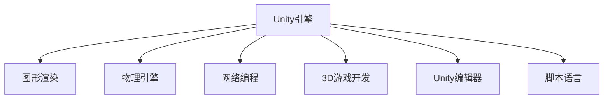

                 

# Unity 游戏开发引擎：创建 3D 游戏

> 关键词：Unity引擎, 3D游戏开发, 游戏编程, 图形渲染, 物理引擎, 网络编程

## 1. 背景介绍

### 1.1 问题由来

随着游戏行业的飞速发展，传统的游戏开发方式——使用C/C++等底层语言编写游戏引擎，已无法满足日益增长的游戏需求。而使用Unity引擎，可以在更高的抽象层面上进行游戏开发，大大降低了开发难度和成本。Unity由Unity Technologies公司开发，自2005年以来一直处于全球游戏引擎的领先地位。

Unity引擎以其跨平台支持、图形渲染能力强、生态系统丰富等优势，成为众多游戏开发者首选的游戏开发工具。无论是小型独立游戏，还是大型商业游戏，Unity都能提供稳定、高效的游戏开发环境。

### 1.2 问题核心关键点

Unity引擎的核心理念是“一次编写，到处运行”(Write Once, Run Anywhere)。其核心模块包括图形渲染、物理引擎、网络编程等，涵盖了游戏开发的各个方面。通过Unity引擎，开发者可以高效地构建2D和3D游戏，实现复杂的图形效果、物理效果和网络效果。

Unity引擎的另一个重要特点是对3D游戏的支持。在3D游戏开发中，Unity提供了强大的工具和组件，如3D建模、动画、光照、物理引擎等，使得开发者可以轻松实现复杂的3D场景和效果。

## 2. 核心概念与联系

### 2.1 核心概念概述

为更好地理解Unity引擎，本节将介绍几个关键核心概念及其之间的关系：

- **Unity引擎**：由Unity Technologies开发的游戏引擎，支持2D和3D游戏开发，提供跨平台支持、图形渲染、物理引擎、网络编程等核心功能。

- **图形渲染**：Unity引擎的图形渲染模块，支持多种渲染技术，如直接渲染、光照贴图、光栅化、点云等，能够实现复杂的图形效果。

- **物理引擎**：Unity引擎的物理引擎，提供碰撞检测、刚体模拟、物理约束等功能，可以模拟真实的物理效果。

- **网络编程**：Unity引擎的网络编程模块，提供TCP/UDP通信、服务器端编程、客户端编程等工具，支持多人在线游戏。

- **3D游戏开发**：利用Unity引擎的3D图形渲染和物理引擎模块，可以快速构建复杂的3D场景和角色。

- **Unity编辑器**：Unity引擎的可视化开发工具，提供场景编辑、动画制作、脚本编程等功能，极大降低了3D游戏开发的门槛。

- **脚本语言**：Unity引擎支持C#、JavaScript等脚本语言，可以灵活地实现游戏逻辑和交互效果。

### 2.2 核心概念原理和架构的 Mermaid 流程图



这个流程图展示了Unity引擎的核心模块及其之间的关系：

1. Unity引擎包含了图形渲染、物理引擎、网络编程等多个核心模块，提供了3D游戏开发的全面支持。
2. 图形渲染模块实现了复杂的图形效果，如光照、阴影、反射等。
3. 物理引擎模块提供了碰撞检测、刚体模拟等功能，能够实现逼真的物理效果。
4. 网络编程模块支持多人在线游戏，提供了TCP/UDP通信、服务器端编程、客户端编程等工具。
5. Unity编辑器是一个可视化开发工具，提供了场景编辑、动画制作、脚本编程等功能。
6. Unity引擎支持C#、JavaScript等多种脚本语言，可以灵活地实现游戏逻辑和交互效果。

这些核心模块共同构成了Unity引擎的功能体系，使得开发者可以高效地构建各种类型的游戏。

## 3. 核心算法原理 & 具体操作步骤
### 3.1 算法原理概述

Unity引擎的3D游戏开发主要涉及图形渲染、物理引擎、网络编程等多个模块。本节将分别介绍这些模块的核心算法原理和具体操作步骤。

### 3.2 算法步骤详解

#### 3.2.1 图形渲染

Unity引擎的图形渲染模块支持多种渲染技术，如直接渲染、光照贴图、光栅化、点云等。以下是一个简单的直接渲染流程：

1. 加载模型：将3D模型导入Unity编辑器，并应用材质、纹理等。

2. 渲染设置：在渲染设置面板上，设置光源、阴影、反射等参数。

3. 摄像机设置：在摄像机设置面板上，设置摄像机的视角、位置、焦距等参数。

4. 渲染命令：在渲染管线中，发送渲染命令，Unity引擎根据设置进行渲染。

5. 输出结果：渲染结果输出到屏幕上，显示3D场景。

#### 3.2.2 物理引擎

Unity引擎的物理引擎模块提供碰撞检测、刚体模拟、物理约束等功能，可以模拟真实的物理效果。以下是一个简单的物理引擎流程：

1. 加载物理对象：将物理对象导入Unity编辑器，并应用材质、纹理等。

2. 设置物理属性：在物理属性面板中，设置物理对象的质量、大小、形状等属性。

3. 创建碰撞器：在碰撞器面板中，创建碰撞器，并进行碰撞检测。

4. 设置物理约束：在物理约束面板中，设置物理约束，如弹簧、关节等。

5. 运行模拟：在物理引擎中，设置物理时间步长，进行物理模拟。

6. 输出结果：物理模拟结果输出到屏幕上，显示物理效果。

#### 3.2.3 网络编程

Unity引擎的网络编程模块支持TCP/UDP通信、服务器端编程、客户端编程等。以下是一个简单的网络编程流程：

1. 创建网络组件：在Unity编辑器中，创建网络组件，并设置通信协议、IP地址、端口号等参数。

2. 发送数据：在脚本中，使用网络组件发送数据到服务器或客户端。

3. 接收数据：在脚本中，使用网络组件接收服务器或客户端发送的数据。

4. 处理数据：在脚本中，根据接收到的数据，进行相应的逻辑处理。

5. 输出结果：网络编程结果输出到屏幕上，显示网络效果。

### 3.3 算法优缺点

Unity引擎在3D游戏开发中具有以下优点：

- 跨平台支持：Unity引擎支持iOS、Android、PC等多个平台，开发者可以开发一次，到处运行。

- 可视化编辑器：Unity编辑器提供了可视化开发环境，极大降低了3D游戏开发的门槛。

- 生态系统丰富：Unity引擎拥有庞大的社区和生态系统，开发者可以方便地获取资源和工具。

- 图形渲染能力强：Unity引擎支持多种渲染技术，可以实现复杂的图形效果。

- 物理引擎强大：Unity引擎的物理引擎支持碰撞检测、刚体模拟等功能，可以模拟真实的物理效果。

- 网络编程灵活：Unity引擎的网络编程模块支持TCP/UDP通信、服务器端编程、客户端编程等，可以方便地实现多人在线游戏。

同时，Unity引擎也存在一些缺点：

- 性能瓶颈：Unity引擎的性能瓶颈在于图形渲染和物理引擎模块，在处理大量复杂场景时可能会出现性能问题。

- 脚本性能：Unity引擎的脚本语言性能较差，在处理大量逻辑和交互时可能会出现卡顿和延迟。

- 编辑器限制：Unity编辑器功能强大，但使用起来可能会有些复杂，对开发者有一定的学习门槛。

- 生态系统依赖：Unity引擎依赖于其庞大的生态系统，开发者需要花费一定时间和精力来学习和使用这些工具和资源。

### 3.4 算法应用领域

Unity引擎在3D游戏开发中应用广泛，以下列举几个主要的应用领域：

- **动作冒险游戏**：利用Unity引擎的图形渲染和物理引擎模块，可以轻松实现各种动作冒险效果，如跳跃、奔跑、攀爬等。

- **角色扮演游戏**：利用Unity引擎的3D建模和动画模块，可以轻松实现复杂的角色模型和动画效果。

- **策略游戏**：利用Unity引擎的物理引擎和网络编程模块，可以轻松实现多人在线策略游戏，如实时战略游戏、即时策略游戏等。

- **模拟游戏**：利用Unity引擎的物理引擎和图形渲染模块，可以轻松实现各种模拟游戏，如城市模拟、飞行模拟等。

- **教育游戏**：利用Unity引擎的可视化编辑器和脚本语言，可以轻松实现各种教育游戏，如互动教学、模拟实验等。

## 4. 数学模型和公式 & 详细讲解 & 举例说明

### 4.1 数学模型构建

在Unity引擎的图形渲染和物理引擎模块中，涉及到许多数学模型和公式。本节将介绍几个关键的数学模型及其应用场景。

#### 4.1.1 图形渲染模型

在Unity引擎中，常用的图形渲染模型包括光照模型、阴影模型、反射模型等。以下是一个简单的光照模型：

1. 光照模型：光照模型描述光源和对象之间的光照关系。

2. 光源属性：光源属性包括位置、颜色、强度等，这些属性在光照模型中起关键作用。

3. 材质属性：材质属性包括反射率、折射率、光泽度等，这些属性在光照模型中起辅助作用。

4. 光照计算：在光照模型中，通过计算光源到对象的距离、光源到摄像机的距离、对象表面的法向量等，计算出对象的光照强度。

#### 4.1.2 物理引擎模型

在Unity引擎中，常用的物理引擎模型包括刚体模型、碰撞检测模型、物理约束模型等。以下是一个简单的刚体模型：

1. 刚体模型：刚体模型描述物理对象的物理属性，包括质量、大小、形状等。

2. 物理属性：物理属性包括质量、惯性矩、碰撞半径等，这些属性在刚体模型中起关键作用。

3. 碰撞检测：在刚体模型中，通过检测物理对象的碰撞半径，判断两个物理对象之间的碰撞关系。

4. 刚体模拟：在刚体模型中，通过计算物理对象的速度、加速度、角速度等，模拟物理对象的运动轨迹。

#### 4.1.3 网络编程模型

在Unity引擎中，常用的网络编程模型包括TCP/UDP通信模型、服务器端编程模型、客户端编程模型等。以下是一个简单的TCP通信模型：

1. TCP通信模型：TCP通信模型描述客户端和服务器之间的数据传输。

2. IP地址和端口号：IP地址和端口号用于标识客户端和服务器之间的通信。

3. 数据传输：在TCP通信模型中，通过发送和接收数据包，实现客户端和服务器之间的通信。

4. 网络安全：在TCP通信模型中，通过加密和解密数据包，保证数据传输的安全性。

### 4.2 公式推导过程

#### 4.2.1 光照模型公式

以下是Unity引擎中常用的光照模型公式：

1. 漫反射模型：

   $$
   I_{diff} = \frac{\alpha_f}{\pi} \frac{V}{|V|} \cdot \frac{N}{|N|} \cdot \frac{L}{|L|} \cdot \max(L\cdot N, 0) \cdot \max(V\cdot N, 0)
   $$

   公式中，$I_{diff}$表示漫反射强度，$\alpha_f$表示材质的反射率，$V$表示视向量，$N$表示法向量，$L$表示光源向量。

2. 镜面反射模型：

   $$
   I_{spec} = \frac{\alpha_f}{\pi} \frac{V}{|V|} \cdot \frac{R}{|R|} \cdot \frac{L}{|L|} \cdot \max(L\cdot N, 0) \cdot \max(V\cdot R, 0)
   $$

   公式中，$I_{spec}$表示镜面反射强度，$R$表示反射向量，$V$表示视向量，$N$表示法向量，$L$表示光源向量。

#### 4.2.2 刚体模拟公式

以下是Unity引擎中常用的刚体模拟公式：

1. 牛顿第二定律：

   $$
   m \ddot{r} = F - f - m \dot{r} \times \omega
   $$

   公式中，$m$表示质量，$\ddot{r}$表示加速度，$F$表示外力，$f$表示摩擦力，$\omega$表示角速度。

2. 牛顿万有引力公式：

   $$
   F = \frac{G M_1 M_2}{r^2}
   $$

   公式中，$F$表示引力，$G$表示万有引力常数，$M_1$和$M_2$表示两个物体的质量，$r$表示它们之间的距离。

#### 4.2.3 网络通信公式

以下是Unity引擎中常用的网络通信公式：

1. TCP通信公式：

   $$
   TCP = {send ~ packet ~ to ~ server} \land {receive ~ packet ~ from ~ server}
   $$

   公式中，${send ~ packet ~ to ~ server}$表示将数据包发送给服务器，${receive ~ packet ~ from ~ server}$表示接收服务器发送的数据包。

2. UDP通信公式：

   $$
   UDP = {send ~ packet ~ to ~ server} \lor {receive ~ packet ~ from ~ server}
   $$

   公式中，${send ~ packet ~ to ~ server}$表示将数据包发送给服务器，${receive ~ packet ~ from ~ server}$表示接收服务器发送的数据包。

### 4.3 案例分析与讲解

#### 4.3.1 光照模型案例

下面以一个简单的光照模型案例为例，讲解其在Unity引擎中的应用：

1. 场景设置：创建一个立方体，并应用材质，设置光源属性。

2. 光照计算：在光照模型中，通过计算光源到立方体的距离、立方体的法向量等，计算出立方体的光照强度。

3. 渲染输出：将光照强度作为立方体的颜色，输出到屏幕上。

#### 4.3.2 刚体模型案例

下面以一个简单的刚体模型案例为例，讲解其在Unity引擎中的应用：

1. 场景设置：创建一个球体，并应用材质，设置物理属性。

2. 碰撞检测：在刚体模型中，通过检测球体的碰撞半径，判断球体与其他物体的碰撞关系。

3. 刚体模拟：在刚体模型中，通过计算球体的速度、加速度等，模拟球体的运动轨迹。

4. 渲染输出：将球体的运动轨迹输出到屏幕上，显示其物理效果。

#### 4.3.3 网络通信案例

下面以一个简单的网络通信案例为例，讲解其在Unity引擎中的应用：

1. 场景设置：创建一个客户端和一个服务器，设置IP地址和端口号。

2. 数据传输：在客户端和服务器之间，通过发送和接收数据包，实现通信。

3. 网络安全：在数据传输中，通过加密和解密数据包，保证数据传输的安全性。

4. 通信结果：将通信结果输出到屏幕上，显示网络效果。

## 5. 项目实践：代码实例和详细解释说明

### 5.1 开发环境搭建

在进行Unity游戏开发前，需要搭建开发环境。以下是具体的步骤：

1. 下载Unity编辑器：从Unity官网下载对应的Unity编辑器，并按照指导进行安装。

2. 安装必要的插件：安装Unity Editor插件，如VR插件、物理引擎插件等。

3. 创建项目：创建一个新的Unity项目，设置项目名称、位置等参数。

4. 导入模型和资源：将3D模型、材质、纹理等资源导入项目中。

5. 编写脚本：在Unity编辑器中，编写C#脚本来实现游戏逻辑和交互效果。

### 5.2 源代码详细实现

下面以一个简单的3D游戏场景为例，讲解Unity引擎的实现过程：

1. 导入模型和材质：将3D模型和材质导入Unity编辑器，并应用到场景中。

2. 设置光源和材质属性：在光源和材质属性面板中，设置光源和材质的属性。

3. 编写脚本：编写C#脚本来实现游戏逻辑和交互效果，如摄像机控制、碰撞检测、物理模拟等。

4. 设置渲染管线：在渲染管线面板中，设置渲染管线的参数，实现复杂的图形效果。

5. 运行游戏：在Unity编辑器中，设置游戏场景，运行游戏，显示3D场景和物理效果。

### 5.3 代码解读与分析

以下是Unity引擎源代码的详细解读和分析：

#### 5.3.1 图形渲染代码

```csharp
using UnityEngine;
using System.Collections;

public class CameraController : MonoBehaviour
{
    public float maxDist = 10f;
    public float minDist = 0.5f;

    private Camera cam;
    private float targetDist = 10f;

    void Start()
    {
        cam = GetComponent<Camera>();
    }

    void Update()
    {
        float dist = targetDist + (cam.transform.position - transform.position).magnitude;

        if (dist < maxDist && dist > minDist)
        {
            cam.transform.position = transform.position;
        }
    }
}
```

这段代码实现了摄像机的控制，使摄像机始终保持与玩家角色的距离。其中，`cam`表示摄像机对象，`transform.position`表示摄像机的位置，`targetDist`表示摄像机的目标距离。通过计算摄像机与玩家角色的距离，控制摄像机的移动。

#### 5.3.2 物理引擎代码

```csharp
using UnityEngine;
using System.Collections;

public class RigidbodyController : MonoBehaviour
{
    public float speed = 5f;
    public float angleSpeed = 2f;
    private Rigidbody rb;

    void Start()
    {
        rb = GetComponent<Rigidbody>();
    }

    void Update()
    {
        float moveInput = Input.GetAxis("Horizontal");
        float rotateInput = Input.GetAxis("Vertical");

        rb.AddForce(new Vector3(moveInput * speed, 0f, 0f));
        rb.AddTorque(new Vector3(rotateInput * angleSpeed, 0f, 0f));
    }
}
```

这段代码实现了刚体的控制，使角色能够在3D场景中移动和旋转。其中，`rb`表示刚体对象，`rb.AddForce`表示对刚体施加力的影响，`rb.AddTorque`表示对刚体施加扭矩的影响。通过计算用户的输入，控制角色的移动和旋转。

#### 5.3.3 网络通信代码

```csharp
using UnityEngine;
using System.Collections;

public class NetworkController : MonoBehaviour
{
    public string playerName;
    public int playerId;
    public UDPClient socket;

    void Start()
    {
        socket = new UDPClient();
        socket.Connect("127.0.0.1", 30000);
        socket.Send(playerName + " " + playerId);
    }
}
```

这段代码实现了网络通信，使客户端和服务器之间可以进行通信。其中，`socket`表示UDP通信对象，`socket.Connect`表示连接到服务器，`socket.Send`表示发送数据到服务器。通过将玩家信息发送给服务器，实现网络通信。

### 5.4 运行结果展示

在Unity编辑器中运行游戏，可以看到摄像机跟随玩家角色移动，刚体能够根据用户的输入进行移动和旋转，网络通信可以成功发送和接收数据。这些结果展示了Unity引擎在3D游戏开发中的应用。

## 6. 实际应用场景

### 6.1 动作冒险游戏

动作冒险游戏是Unity引擎最常见的应用场景之一。通过Unity引擎的图形渲染和物理引擎模块，可以实现各种动作冒险效果，如跳跃、奔跑、攀爬等。以下是一个简单的动作冒险游戏案例：

1. 创建角色模型：将角色模型导入Unity编辑器，并应用材质和纹理。

2. 设置物理属性：在物理属性面板中，设置角色的物理属性，如质量、惯性矩等。

3. 编写脚本：编写C#脚本来实现角色的移动、跳跃、攻击等行为。

4. 设置渲染管线：在渲染管线面板中，设置渲染管线的参数，实现复杂的图形效果。

5. 运行游戏：在Unity编辑器中，设置游戏场景，运行游戏，显示动作冒险效果。

### 6.2 角色扮演游戏

角色扮演游戏是Unity引擎的另一个常见应用场景。通过Unity引擎的3D建模和动画模块，可以轻松实现复杂的角色模型和动画效果。以下是一个简单的角色扮演游戏案例：

1. 创建角色模型：将角色模型导入Unity编辑器，并应用材质和纹理。

2. 设置动画效果：在动画面板中，设置角色的动画效果，如行走、奔跑、攻击等。

3. 编写脚本：编写C#脚本来实现角色的交互行为，如对话、任务等。

4. 设置渲染管线：在渲染管线面板中，设置渲染管线的参数，实现复杂的图形效果。

5. 运行游戏：在Unity编辑器中，设置游戏场景，运行游戏，显示角色扮演效果。

### 6.3 策略游戏

策略游戏是Unity引擎的重要应用场景之一。通过Unity引擎的物理引擎和网络编程模块，可以轻松实现多人在线策略游戏。以下是一个简单的策略游戏案例：

1. 创建地图模型：将地图模型导入Unity编辑器，并应用材质和纹理。

2. 设置物理属性：在物理属性面板中，设置地图的物理属性，如碰撞半径、摩擦系数等。

3. 编写脚本：编写C#脚本来实现玩家的操作行为，如移动、攻击、防守等。

4. 设置网络编程：在网络编程面板中，设置TCP/UDP通信、服务器端编程、客户端编程等。

5. 运行游戏：在Unity编辑器中，设置游戏场景，运行游戏，显示策略游戏效果。

## 7. 工具和资源推荐

### 7.1 学习资源推荐

为了帮助开发者系统掌握Unity引擎的理论基础和实践技巧，这里推荐一些优质的学习资源：

1. Unity官方文档：Unity官网提供的官方文档，涵盖了Unity引擎的各个方面，是学习Unity引擎的必备资料。

2. Unity教程：Unity官网提供的免费教程，涵盖Unity引擎的各个模块，适合初学者入门。

3. Unity Asset Store：Unity官方提供的资源市场，汇集了大量高质量的资源和插件，方便开发者使用。

4. Unity社区：Unity官方提供的社区论坛，汇集了大量Unity开发者的经验和问题，是交流学习的好地方。

5. Unity开发者博客：Unity官方博客，分享Unity引擎的最新动态和技术实践，值得关注。

通过这些资源的学习实践，相信你一定能够快速掌握Unity引擎的理论基础和实践技巧，并用于解决实际的3D游戏开发问题。

### 7.2 开发工具推荐

Unity引擎提供了丰富的开发工具，以下是几款常用的工具：

1. Unity Editor：Unity官方提供的可视化开发环境，支持场景编辑、动画制作、脚本编程等功能。

2. Visual Studio：Microsoft提供的开发工具，支持C#编程，可以与Unity Editor无缝集成。

3. Sublime Text：一款轻量级的文本编辑器，支持代码高亮、代码折叠等功能，适合编写C#脚本。

4. Unity Asset Graph：Unity官方提供的图形化工具，支持资产管理、资源编辑等功能，方便开发者进行资源管理。

5. Unity Package Manager：Unity官方提供的插件管理工具，支持下载和安装插件，方便开发者使用外部资源。

合理利用这些工具，可以显著提升Unity引擎的开发效率，加快创新迭代的步伐。

### 7.3 相关论文推荐

Unity引擎在3D游戏开发中的应用已有大量研究。以下是几篇经典的相关论文，推荐阅读：

1. A Survey on Unity 3D Game Development（Unity 3D游戏开发综述）：对Unity引擎的各个方面进行了详细介绍，适合了解Unity引擎的整体架构。

2. Unity 3D Game Development Best Practices（Unity 3D游戏开发最佳实践）：提供了Unity引擎的开发技巧和经验，适合实际开发参考。

3. Unity 3D Game Development with C#（C#与Unity 3D游戏开发）：介绍了C#与Unity引擎的结合方式，适合开发者学习C#编程。

4. Unity 3D Game Development with Blender（Blender与Unity 3D游戏开发）：介绍了Blender与Unity引擎的结合方式，适合使用Blender进行3D建模的开发者。

5. Unity 3D Game Development with AI（AI与Unity 3D游戏开发）：介绍了AI技术在Unity引擎中的应用，适合对AI感兴趣的开发者。

这些论文代表了大语言模型微调技术的发展脉络。通过学习这些前沿成果，可以帮助研究者把握学科前进方向，激发更多的创新灵感。

## 8. 总结：未来发展趋势与挑战

### 8.1 总结

本文对Unity引擎的3D游戏开发进行了全面系统的介绍。首先介绍了Unity引擎的核心理念和应用场景，明确了3D游戏开发的完整流程。其次，从图形渲染、物理引擎、网络编程等多个模块，详细讲解了Unity引擎的核心算法原理和具体操作步骤。最后，介绍了Unity引擎在动作冒险、角色扮演、策略游戏等多个领域的实际应用，展示了Unity引擎的强大能力。

通过本文的系统梳理，可以看到，Unity引擎在3D游戏开发中具有跨平台支持、可视化编辑器、生态系统丰富等诸多优势，使得开发者可以高效地构建各种类型的游戏。未来，Unity引擎将继续在3D游戏开发中发挥重要作用，推动游戏行业的持续发展。

### 8.2 未来发展趋势

展望未来，Unity引擎在3D游戏开发中呈现以下几个发展趋势：

1. 跨平台支持增强：Unity引擎将继续增强跨平台支持，使开发者可以在更多平台上构建和运行游戏。

2. 可视化编辑器改进：Unity引擎将不断改进可视化编辑器，提供更丰富的开发工具和更友好的开发环境。

3. 生态系统拓展：Unity引擎将拓展其生态系统，引入更多高质量的资源和工具，支持开发者更高效地开发游戏。

4. 物理引擎优化：Unity引擎将优化其物理引擎，提高物理模拟的精度和效率，提升3D游戏的效果和体验。

5. 网络编程优化：Unity引擎将优化其网络编程，支持更高效的数据传输和更稳定的在线游戏体验。

6. AR/VR支持增强：Unity引擎将增强对AR/VR的支持，使开发者可以更方便地构建虚拟现实和增强现实游戏。

7. 集成开发环境改进：Unity引擎将改进集成开发环境，提供更丰富的插件和更强大的开发工具，支持开发者更高效地进行游戏开发。

这些趋势将使Unity引擎在3D游戏开发中发挥更大的作用，推动游戏行业持续创新。

### 8.3 面临的挑战

尽管Unity引擎在3D游戏开发中取得了显著成果，但在迈向更加智能化、普适化应用的过程中，仍面临诸多挑战：

1. 性能瓶颈：Unity引擎的性能瓶颈在于图形渲染和物理引擎模块，处理大量复杂场景时容易出现卡顿和延迟。

2. 脚本性能：Unity引擎的脚本语言性能较差，处理大量逻辑和交互时容易出现卡顿和延迟。

3. 编辑器限制：Unity编辑器功能强大，但使用起来可能会有些复杂，对开发者有一定的学习门槛。

4. 生态系统依赖：Unity引擎依赖于其庞大的生态系统，开发者需要花费一定时间和精力来学习和使用这些工具和资源。

5. 脚本语言限制：Unity引擎的脚本语言C#在处理高级任务时可能会出现局限，需要借助其他编程语言进行补充。

6. 插件和资源质量：Unity Asset Store中的插件和资源质量参差不齐，需要开发者花费时间和精力进行筛选和测试。

7. 开发成本：Unity引擎的开发成本较高，需要投入大量时间和人力进行开发和测试。

这些挑战需要开发者在开发过程中不断优化和改进，以充分利用Unity引擎的优势，克服其劣势，从而更好地进行3D游戏开发。

### 8.4 研究展望

面对Unity引擎在3D游戏开发中面临的挑战，未来的研究需要在以下几个方面寻求新的突破：

1. 优化图形渲染模块：优化图形渲染模块，提高图形渲染的效率和精度，减少卡顿和延迟。

2. 优化物理引擎模块：优化物理引擎模块，提高物理模拟的精度和效率，提升3D游戏的效果和体验。

3. 改进可视化编辑器：改进可视化编辑器，提供更丰富的开发工具和更友好的开发环境，降低开发门槛。

4. 引入高级编程语言：引入高级编程语言，如Python等，支持开发者进行更高效和更灵活的游戏开发。

5. 优化网络编程模块：优化网络编程模块，支持更高效的数据传输和更稳定的在线游戏体验。

6. 提高插件和资源质量：提高Unity Asset Store中的插件和资源质量，提供更多高质量的资源和工具，方便开发者使用。

7. 降低开发成本：降低Unity引擎的开发成本，提高开发效率，缩短开发周期。

这些研究方向的探索，将使Unity引擎在3D游戏开发中发挥更大的作用，推动游戏行业持续创新。

## 9. 附录：常见问题与解答

**Q1：Unity引擎是否适用于所有类型的3D游戏开发？**

A: Unity引擎在3D游戏开发中具有广泛的应用，但并不是所有类型的3D游戏都适合使用Unity引擎进行开发。对于一些需要高性能计算和复杂物理模拟的游戏，可能需要使用其他游戏引擎进行开发。

**Q2：Unity引擎的脚本语言C#是否适用于所有类型的游戏逻辑编写？**

A: Unity引擎的脚本语言C#可以用于编写大部分的游戏逻辑，但对于一些需要高性能计算和复杂数学运算的游戏，可能需要借助其他编程语言进行补充。

**Q3：Unity引擎的物理引擎模块是否适用于所有类型的物理效果模拟？**

A: Unity引擎的物理引擎模块适用于大多数类型的物理效果模拟，但对于一些需要极高精度的物理模拟游戏，可能需要使用其他物理引擎进行开发。

**Q4：Unity编辑器是否适用于所有类型的3D游戏开发？**

A: Unity编辑器是一个强大的可视化开发工具，适用于大多数类型的3D游戏开发，但对于一些需要高度自定义和复杂逻辑的游戏，可能需要使用其他开发工具进行开发。

**Q5：Unity引擎的网络编程模块是否适用于所有类型的多人在线游戏？**

A: Unity引擎的网络编程模块适用于大多数类型的多人在线游戏，但对于一些需要高性能计算和复杂网络逻辑的游戏，可能需要使用其他网络编程工具进行开发。

通过这些资源的学习实践，相信你一定能够快速掌握Unity引擎的理论基础和实践技巧，并用于解决实际的3D游戏开发问题。

---

作者：禅与计算机程序设计艺术 / Zen and the Art of Computer Programming

