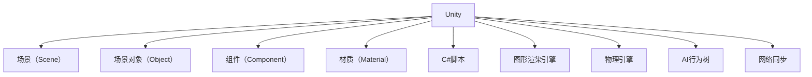

                 

## 1. 背景介绍

随着游戏行业的迅猛发展，Unity游戏引擎因其易学易用、跨平台支持等优点，成为了游戏开发的主流工具之一。本篇文章将从入门到进阶，带你系统了解Unity游戏引擎开发的基础知识和应用场景，涵盖图形渲染、物理引擎、AI行为等核心技术，以及游戏框架搭建和团队协作技巧。

## 2. 核心概念与联系

### 2.1 核心概念概述

Unity是一个支持跨平台开发的游戏引擎，支持PC、移动、AR/VR等多种平台。它基于C#语言，并提供了强大的编辑工具和脚本机制，使得游戏开发变得更加简单。

- **Unity核心组件**：包括场景（Scene）、场景对象（Object）、组件（Component）、材质（Material）等。
- **C#脚本**：用于编写游戏逻辑和行为的脚本语言，由Unity提供。
- **图形渲染引擎**：Unity内置的图形渲染引擎支持多种渲染模式，如静态批处理、光照贴图、粒子系统等。
- **物理引擎**：提供2D和3D物理模拟功能，支持碰撞检测、刚体物理、软体模拟等。
- **AI行为树**：用于构建角色和敌人的智能行为，支持状态机、决策树等高级逻辑。
- **网络同步**：支持多玩家同步，实现实时的游戏对弈。

这些概念通过组合，构建了一个完整的Unity游戏开发框架，帮助开发者高效创建游戏场景和交互元素。

### 2.2 核心概念原理和架构的 Mermaid 流程图



## 3. 核心算法原理 & 具体操作步骤

### 3.1 算法原理概述

Unity的开发过程主要分为两个阶段：编辑阶段和运行阶段。在编辑阶段，通过Unity编辑器构建和调试场景、角色和物理环境，而在运行阶段，游戏被导出为可执行文件，并在目标平台上运行。

- **编辑阶段**：包括场景构建、资产导入、资源管理、交互脚本编写等。
- **运行阶段**：涉及渲染器渲染场景、物理引擎处理碰撞、脚本机制实现交互等。

这些过程通过Unity引擎内部的组件和脚本进行协调，形成了一个动态的执行框架。

### 3.2 算法步骤详解

#### 步骤一：环境搭建

1. **安装Unity编辑器**：访问Unity官网，下载并安装适合你操作系统的Unity编辑器。
2. **创建项目**：使用Unity编辑器创建新的项目，设置项目名称、存放路径等基本信息。
3. **导入资产**：将必要的3D模型、材质、贴图等资源导入到Unity项目中。

#### 步骤二：场景搭建

1. **创建场景**：使用编辑器中的“创建”工具，在场景中创建角色、物体、光照等元素。
2. **布局场景**：通过调整物体的位置、旋转、缩放，合理布局场景元素，使其符合设计要求。
3. **光照设置**：为场景设置光源，调整光强、阴影等参数，确保场景光照效果自然。

#### 步骤三：交互脚本编写

1. **创建脚本**：在编辑器中选择场景中的对象，使用“组件”菜单创建脚本组件。
2. **编写脚本代码**：在脚本编辑器中编写C#脚本，实现对象的逻辑行为。
3. **测试脚本**：在编辑器中运行场景，测试脚本的执行效果，根据需要进行调整。

#### 步骤四：物理模拟

1. **创建刚体**：为需要物理模拟的物体添加刚体组件，设置物理属性如质量、摩擦系数等。
2. **设置碰撞器**：为刚体添加碰撞器，设置碰撞检测参数，如碰撞半径、碰撞材料等。
3. **模拟物理效果**：在脚本中设置物理引擎，实现物体之间的碰撞、弹跳等物理效果。

#### 步骤五：动画制作

1. **创建动画**：使用动画编辑器创建角色动作的动画序列。
2. **绑定骨骼**：将动画与角色骨骼绑定，确保动画效果自然流畅。
3. **动画测试**：在场景中运行动画，测试动画效果，进行微调优化。

### 3.3 算法优缺点

**优点**：
- **跨平台支持**：Unity支持Windows、macOS、Linux、iOS、Android等多个平台，开发一次，多处部署。
- **易学易用**：相比其他游戏引擎，Unity的学习曲线较低，适合初学者快速上手。
- **生态丰富**：拥有庞大的开发者社区和第三方插件库，资源丰富，开发效率高。

**缺点**：
- **性能瓶颈**：在高并发和大场景下，Unity的性能可能面临瓶颈，需要优化和调试。
- **内存管理**：在资源管理不当的情况下，Unity的内存消耗可能较大，影响性能。
- **脚本性能**：在脚本执行频繁时，性能可能下降，需要优化脚本逻辑。

### 3.4 算法应用领域

Unity在游戏开发中的应用非常广泛，涵盖了2D和3D游戏、虚拟现实、增强现实、交互式体验等多个领域。

- **移动游戏开发**：Unity在iOS和Android平台上应用广泛，支持多种移动游戏类型。
- **PC游戏开发**：支持高质量的图形渲染和物理模拟，适合制作大型PC游戏。
- **虚拟现实**：Unity在VR和AR领域有广泛应用，支持复杂的虚拟环境体验。
- **交互式体验**：如桌面应用、教育软件、模拟训练等，Unity提供了丰富的交互脚本和工具。

## 4. 数学模型和公式 & 详细讲解 & 举例说明

### 4.1 数学模型构建

Unity的图形渲染引擎基于物理光照模型和着色器模型，其渲染过程涉及以下数学模型：

- **几何模型**：定义物体的形状、位置、法向量等。
- **光照模型**：定义光源、光强、反射率等，计算光照效果。
- **着色器模型**：定义材料属性，如漫反射、镜面反射、透明度等，实现表面渲染。

### 4.2 公式推导过程

以着色器模型为例，假设有一个三维物体，其顶点坐标为 $(x,y,z)$，光照模型为环境光和漫反射光，则着色器模型可以表示为：

$$
C(x,y,z) = \alpha \cdot \left( \frac{I_e}{N \cdot L_e} + \frac{I_d}{N \cdot L_d} \right)
$$

其中：
- $\alpha$ 为材料属性。
- $I_e$ 为环境光强度。
- $N$ 为物体法向量。
- $L_e$ 为环境光方向向量。
- $I_d$ 为漫反射光强度。
- $L_d$ 为漫反射光方向向量。

通过上述公式，可以计算出物体在给定光照下的颜色。

### 4.3 案例分析与讲解

以《美术笔记》游戏为例，该游戏利用Unity的图形渲染引擎和脚本系统，实现了一个艺术风格的游戏世界。

1. **场景搭建**：使用Unity的3D模型和材质库，构建了游戏世界的场景和角色。
2. **物理模拟**：为场景中的物体添加刚体和碰撞器，实现了角色的跳跃和碰撞。
3. **动画制作**：使用Unity的动画编辑器，制作了角色的行走和绘画动画。
4. **脚本编写**：通过C#脚本编写游戏逻辑，如角色交互、绘画行为等。

## 5. 项目实践：代码实例和详细解释说明

### 5.1 开发环境搭建

1. **安装Unity编辑器**：访问Unity官网，下载并安装适合你操作系统的Unity编辑器。
2. **创建项目**：使用Unity编辑器创建新的项目，设置项目名称、存放路径等基本信息。
3. **导入资产**：将必要的3D模型、材质、贴图等资源导入到Unity项目中。

### 5.2 源代码详细实现

```csharp
using UnityEngine;

public class PlayerController : MonoBehaviour
{
    public float moveSpeed = 5f;
    private Rigidbody rb;
    private AudioSource stepSound;

    void Start()
    {
        rb = GetComponent<Rigidbody>();
        stepSound = GetComponent<AudioSource>();
    }

    void Update()
    {
        float moveHorizontal = Input.GetAxis("Horizontal");
        float moveVertical = Input.GetAxis("Vertical");
        Vector3 movement = new Vector3(moveHorizontal, 0f, moveVertical) * moveSpeed * Time.deltaTime;
        rb.MovePosition(movement);
        if (Input.GetButtonDown("Jump"))
        {
            rb.AddForce(new Vector3(0f, 10f, 0f) * Physics.gravity.magnitude * 3f);
            stepSound.Play();
        }
    }
}
```

### 5.3 代码解读与分析

- **PlayerController类**：定义玩家控制器，处理玩家的移动和跳跃行为。
- **moveSpeed属性**：控制玩家的移动速度。
- **Rigidbody组件**：用于控制玩家物体的物理属性，如位置、速度等。
- **AudioSource组件**：用于播放步幅声音效果。
- **Update方法**：在每一帧更新玩家的位置和跳跃行为。
- **Input.GetAxis方法**：获取玩家的输入方向，处理玩家的左右和上下移动。
- **rb.MovePosition方法**：根据输入方向更新玩家位置。
- **rb.AddForce方法**：实现玩家的跳跃效果。
- **stepSound.Play方法**：播放步幅声音效果。

### 5.4 运行结果展示

运行上述代码，可以看到玩家能够在场景中移动和跳跃，同时听到步幅的声音效果。

## 6. 实际应用场景

### 6.1 游戏场景

Unity在游戏场景中的应用非常广泛，适合制作各种类型的游戏，如射击、角色扮演、模拟经营等。其跨平台支持和多样的脚本机制，使得开发高效、维护方便。

### 6.2 虚拟现实

Unity在VR领域也有广泛应用，支持复杂的虚拟环境体验。通过Unity的VR插件，可以实现虚拟现实游戏的开发，如《虚拟实境体验》等。

### 6.3 教育软件

Unity可以用于开发各种类型的教育软件，如科学模拟器、交互式学习工具等。通过Unity的脚本机制，可以灵活实现教学场景和交互逻辑。

### 6.4 未来应用展望

未来，Unity在游戏开发中的应用将更加广泛，涵盖更多平台和类型。随着VR、AR等新技术的发展，Unity的虚拟现实应用也将更加深入。

## 7. 工具和资源推荐

### 7.1 学习资源推荐

1. **Unity官方文档**：提供详细的编辑器和脚本使用指南，是学习和理解Unity的最佳资源。
2. **Unity官方论坛**：开发者社区，提供丰富的交流和学习资源，分享经验和技术。
3. **Unity教程网站**：提供各种类型的视频教程和文章，帮助初学者快速入门。
4. **《Unity游戏编程快速上手》**：一本介绍Unity基础和高级功能的书籍，适合读者系统学习。

### 7.2 开发工具推荐

1. **Unity编辑器**：主流的Unity开发工具，支持跨平台开发，功能强大。
2. **Visual Studio**：用于编写和管理Unity项目中的C#脚本。
3. **Luminance Editor**：Unity的高性能编辑工具，优化编辑性能，支持多线程渲染。
4. **Asset Store**：Unity的第三方插件库，提供丰富的资源和工具，提高开发效率。

### 7.3 相关论文推荐

1. **《Unity游戏引擎技术实现》**：详细介绍了Unity引擎的技术实现和应用原理，适合深入了解Unity的内部机制。
2. **《Unity脚本编程与游戏开发》**：介绍如何使用C#脚本编写游戏逻辑和交互，适合初学者和进阶开发者。
3. **《Unity物理引擎原理与实践》**：详细讲解Unity的物理引擎原理和应用，适合物理模拟开发人员参考。

## 8. 总结：未来发展趋势与挑战

### 8.1 总结

本文系统介绍了Unity游戏引擎开发的基础知识和应用场景，包括场景搭建、交互脚本编写、物理引擎和动画制作等核心技术。通过实际项目案例，展示了Unity引擎的强大功能和应用潜力。

### 8.2 未来发展趋势

未来，Unity在以下方面将迎来新的发展趋势：

1. **跨平台支持**：Unity将继续支持更多平台，实现更广泛的游戏覆盖。
2. **性能优化**：通过优化渲染引擎和物理引擎，提高Unity在高端设备上的表现。
3. **AI和机器学习**：引入AI和机器学习技术，提升游戏的智能化水平和互动体验。
4. **虚拟现实和增强现实**：随着VR和AR技术的进步，Unity在虚拟现实和增强现实领域的应用将更加深入。

### 8.3 面临的挑战

尽管Unity在游戏开发中已经取得巨大成功，但仍面临一些挑战：

1. **性能瓶颈**：在高并发和大场景下，Unity的性能可能面临瓶颈，需要优化和调试。
2. **资源管理**：在资源管理不当的情况下，Unity的内存消耗可能较大，影响性能。
3. **脚本性能**：在脚本执行频繁时，性能可能下降，需要优化脚本逻辑。
4. **学习曲线**：虽然Unity易学易用，但对于高级功能的学习曲线仍较为陡峭，需要更多时间和实践。

### 8.4 研究展望

未来，Unity在以下方面需要进行更多研究和改进：

1. **性能优化**：进一步优化渲染引擎和物理引擎，提高Unity的性能表现。
2. **脚本优化**：优化脚本执行效率，提升代码运行速度。
3. **AI整合**：引入AI和机器学习技术，提升游戏的智能化水平和互动体验。
4. **跨平台开发**：支持更多平台和设备，实现更广泛的游戏覆盖。

通过不断改进和创新，Unity必将在游戏开发领域继续保持领先地位，为开发者提供更加强大和高效的工具。

## 9. 附录：常见问题与解答

**Q1：如何高效管理Unity项目中的资产和资源？**

A: 使用Unity的Asset Store和Pack Manager，方便管理第三方插件和资源库。同时，合理使用Unity的资源打包和导出功能，减少项目文件的大小。

**Q2：Unity脚本应该如何编写？**

A: 编写脚本时，应遵循清晰、易读、高效的原则。使用有意义的命名规范，编写模块化、可复用的代码。使用Unity提供的API和工具，提高脚本的编写效率。

**Q3：如何优化Unity中的物理模拟？**

A: 使用轻量级物理引擎，如PhysX和BonePhysics，减少物理模拟的计算量。使用碰撞优化技术，如动态碰撞检测和容忍区，提高物理模拟的效率。

**Q4：Unity中的动画如何实现？**

A: 使用Unity的动画编辑器，创建角色的动作序列，并绑定到角色骨骼上。使用状态机、决策树等高级逻辑，实现复杂的动画效果。

**Q5：Unity的性能瓶颈如何优化？**

A: 优化渲染引擎和物理引擎，减少渲染和物理计算的资源消耗。合理使用Unity的资源管理工具，减少内存占用。使用异步加载和资源预加载技术，提高加载速度。

通过本文的系统介绍，相信你已经对Unity游戏引擎开发有了一个全面而深入的了解。通过实践和持续学习，你将能够高效地构建和管理Unity项目，开发出高质量的游戏和应用。

