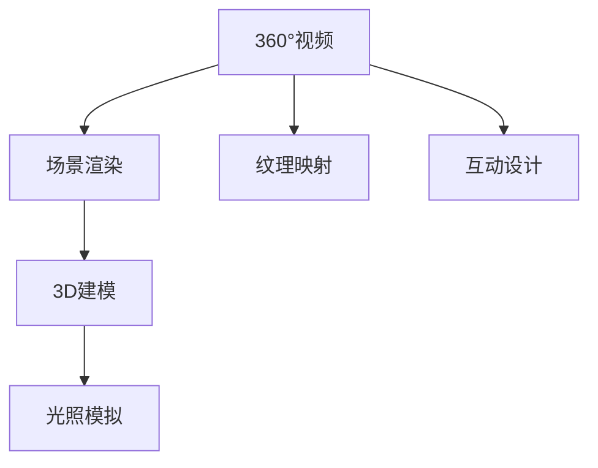

                 

# VR内容制作：360°视频与3D建模

## 1. 背景介绍

随着虚拟现实(VR)技术的快速发展，沉浸式体验已经成为一种重要的内容呈现方式。360°视频和3D建模是实现这一目标的核心技术，其能够提供全向视觉和三维空间体验，让用户仿佛置身于虚拟世界中。无论是游戏、影视、教育、旅游等领域，360°视频与3D建模都展现出巨大的应用潜力。

本博客将从概念、技术原理、实践操作和未来展望等方面，系统介绍360°视频和3D建模的关键知识点，以供业界开发者、学者和爱好者参考。

## 2. 核心概念与联系

### 2.1 核心概念概述

360°视频是指全景视频，可以捕捉并展示360°范围内所看到的一切景象，为用户提供全方位、沉浸式的视觉体验。3D建模则是在计算机上创建三维模型，并通过纹理映射、光照模拟等技术实现立体感。

两者的联系在于，360°视频和3D建模都可以为VR用户提供沉浸式体验，且在制作过程中常常需要交叉使用。具体来说，360°视频可能需要配合3D模型进行场景渲染和互动设计，而3D建模也可能被嵌入到360°视频中，增加视觉效果和交互性。

以下是一个Mermaid流程图，展示360°视频与3D建模之间的联系：



### 2.2 核心概念原理

360°视频的制作主要涉及全景相机拍摄、拼接、编码等技术。其核心原理是将多个相机的画面合成为一个全景图像，通常以一个球形来展示。常见的方法包括径向投影、极坐标投影等，通过这些投影方式，全景相机能够捕捉到全方位景观，并将其呈现为360°全景视频。

3D建模的原理则是使用计算机图形学技术，将现实世界的三维信息转化为虚拟世界的几何模型。这些模型可以基于真实世界的扫描数据，也可以由图形设计师在软件中手工创建。常见建模软件包括Blender、Maya等，它们提供了丰富的建模工具和插件，可以创建各种复杂和精细的3D模型。

## 3. 核心算法原理 & 具体操作步骤

### 3.1 算法原理概述

360°视频的制作涉及全景拼接、色彩校正、无缝拼接等算法。3D建模则涉及三角剖分、纹理映射、光照明等算法。

#### 3.1.1 全景拼接算法

全景拼接算法主要包括径向投影、圆柱投影、球面映射等。其中，径向投影将多个图像拼接成一个球形全景图，具有计算简单、处理速度快等优点。圆柱投影则将全景图展开为圆柱体，并沿着高维坐标轴进行卷绕。球面映射则将全景图展开为球面，沿着经纬度进行投影。

以径向投影为例，假设有一个原始图像序列 $I=\{I_i\}_{i=1}^{N}$，其中 $I_i$ 是第 $i$ 帧图像，$N$ 是帧数。定义全景图投影中心为 $(0,0,z)$，假设原始图像序列的宽高比为 $w:h$，则可以将全景图展开为 $w\times h$ 的矩形。

设 $r$ 为每个像素与投影中心的距离，根据径向投影公式：

$$
x=\frac{r}{R} \cdot \cos(\theta), \quad y=\frac{r}{R} \cdot \sin(\theta)
$$

其中 $R$ 为全景图的半径，$\theta$ 为像素点角度。

图像 $I_i$ 中每个像素点 $(x_i,y_i,z_i)$ 映射到全景图中的坐标为 $(x,y,z)$，由下式计算：

$$
\begin{align*}
x' &= \frac{r_i}{R} \cdot \cos(\theta_i) \\
y' &= \frac{r_i}{R} \cdot \sin(\theta_i) \\
z' &= z_i
\end{align*}
$$

其中 $r_i=\sqrt{x_i^2+y_i^2+z_i^2}$，$\theta_i=\tan^{-1}(y_i/x_i)$。

#### 3.1.2 3D建模算法

3D建模算法主要分为几何建模和纹理贴图。几何建模涉及三角剖分、拓扑优化等技术，主要解决如何构建模型的几何结构。而纹理贴图则涉及贴图平面选择、纹理映射等技术，主要解决如何将纹理映射到模型上。

几何建模的常见算法包括：
- 三角形网格法（T-Mesh）：将3D模型表示为一系列三角形网格。
- 球面三角剖分法：将球面分割为多个三角形，用于建模球体。
- 边界表法（LOD）：通过不同级别的细节层次表示，实现模型可视化的优化。

纹理映射的常见算法包括：
- UV映射：将三维模型上的点映射到二维贴图平面上。
- 光照模型：使用不同的光照模型模拟真实世界的光照效果，如Phong模型、Blinn模型等。
- 环境映射：使用环境贴图，使模型表面看起来更加光滑和逼真。

### 3.2 算法步骤详解

#### 3.2.1 360°视频制作

1. **全景相机拍摄**：使用全景相机拍摄全景图像序列。
2. **全景拼接**：选择全景拼接算法，将图像序列拼接为全景图。
3. **色彩校正**：对全景图进行色彩校正，使其与真实场景一致。
4. **编码压缩**：使用高效的编码算法，对全景图进行压缩，以便于存储和传输。

#### 3.2.2 3D建模

1. **三维扫描**：使用三维扫描设备获取目标物体的三维数据，如激光扫描、点云扫描等。
2. **几何建模**：使用建模软件创建几何模型，并进行拓扑优化。
3. **纹理贴图**：将纹理映射到几何模型上，并使用光照模型进行渲染。
4. **模型导出**：将完成的3D模型导出为支持格式，如OBJ、FBX等。

### 3.3 算法优缺点

360°视频和3D建模的优势在于能够提供更加沉浸式的视觉体验，增强用户体验。缺点则是制作复杂度较高，对硬件要求高。

#### 3.3.1 360°视频制作

- **优势**：
  - 提供全方位沉浸式体验。
  - 能够展示真实世界的全景景观。
  - 应用场景广泛，如旅游、教育、游戏等。
  
- **缺点**：
  - 拍摄和拼接复杂，技术难度高。
  - 对硬件要求高，需要高性能摄像机和计算机。
  - 处理速度慢，渲染时间长。

#### 3.3.2 3D建模

- **优势**：
  - 能够创建复杂精细的几何模型。
  - 支持互动设计和实时渲染。
  - 应用场景广泛，如游戏、影视、医疗等。
  
- **缺点**：
  - 建模复杂，需要专业知识。
  - 处理时间长，对计算机性能要求高。
  - 纹理映射和光照模拟复杂，对技术要求高。

### 3.4 算法应用领域

360°视频和3D建模在多个领域都有广泛应用，包括：

1. **游戏娱乐**：游戏中的360°视频和3D建模，能够提供更加沉浸式的游戏体验。如《极限竞速：地平线》、《无人之境：孤岛危机》等游戏都使用了360°视频和3D建模技术。

2. **影视制作**：在电影和电视剧中，360°视频和3D建模能够为观众提供更加逼真的视觉效果。如《阿凡达》、《流浪地球》等大制作电影中，都大量使用了3D建模和虚拟场景。

3. **旅游观光**：通过360°视频和3D建模，用户可以在家中游览世界各地的著名景点，体验不同地点的文化和风景。如Google Earth 360、TripAdvisor等平台都提供了360°全景视频和3D建模服务。

4. **教育培训**：在教育领域，360°视频和3D建模能够提供互动学习环境，增强学生的学习体验。如虚拟实验室、虚拟教室等应用。

5. **房地产**：在房地产领域，360°视频和3D建模能够展示房屋和建筑物的内部结构和设计细节，帮助用户更好地了解和选择房产。如宜家家居、红星美凯龙等平台都提供了360°视频和3D建模服务。

## 4. 数学模型和公式 & 详细讲解 & 举例说明

### 4.1 数学模型构建

#### 4.1.1 360°视频模型

360°视频可以表示为 $I = \{I_i\}_{i=1}^{N}$，其中 $I_i$ 是第 $i$ 帧图像，$N$ 是帧数。

#### 4.1.2 3D模型

3D模型可以表示为 $M = \{V, F, T\}$，其中 $V$ 是顶点集合，$F$ 是面集合，$T$ 是纹理集合。

### 4.2 公式推导过程

#### 4.2.1 360°视频拼接

以径向投影为例，假设全景图的半径为 $R$，图像 $I_i$ 中每个像素点 $(x_i,y_i,z_i)$ 映射到全景图中的坐标为 $(x,y,z)$，由下式计算：

$$
\begin{align*}
x' &= \frac{r_i}{R} \cdot \cos(\theta_i) \\
y' &= \frac{r_i}{R} \cdot \sin(\theta_i) \\
z' &= z_i
\end{align*}
$$

其中 $r_i=\sqrt{x_i^2+y_i^2+z_i^2}$，$\theta_i=\tan^{-1}(y_i/x_i)$。

#### 4.2.2 3D模型光照

以Phong模型为例，设 $N$ 为法向量，$L$ 为光源向量，$M$ 为材质系数，$V$ 为视角向量，则Phong光照模型计算如下：

$$
I(p) = I_d(p) + I_s(p) + I_r(p)
$$

其中：
- $I_d(p)$ 为漫反射分量，计算公式为 $I_d(p) = M \cdot N \cdot L$。
- $I_s(p)$ 为镜面反射分量，计算公式为 $I_s(p) = M \cdot N \cdot R \cdot L^2$，其中 $R$ 为镜面反射系数。
- $I_r(p)$ 为环境光分量，计算公式为 $I_r(p) = M \cdot N \cdot L_{env}$，其中 $L_{env}$ 为环境光向量。

### 4.3 案例分析与讲解

#### 4.3.1 360°视频案例

假设有一个全景图像序列 $I=\{I_i\}_{i=1}^{N}$，其中 $I_i$ 是第 $i$ 帧图像，$N$ 是帧数。使用径向投影算法将全景图展开为 $w\times h$ 的矩形，并将多个图像拼接成一个全景图。

以 $I_1$ 为例，设 $(x_1,y_1,z_1)$ 为该图像的像素点，根据径向投影公式，计算全景图中的坐标 $(x,y,z)$ 如下：

$$
\begin{align*}
x' &= \frac{r_1}{R} \cdot \cos(\theta_1) \\
y' &= \frac{r_1}{R} \cdot \sin(\theta_1) \\
z' &= z_1
\end{align*}
$$

其中 $r_1=\sqrt{x_1^2+y_1^2+z_1^2}$，$\theta_1=\tan^{-1}(y_1/x_1)$。

#### 4.3.2 3D模型案例

假设有一个三维模型 $M = \{V, F, T\}$，其中 $V$ 是顶点集合，$F$ 是面集合，$T$ 是纹理集合。使用UV映射和Phong光照模型对模型进行渲染。

以 $V$ 中的一个顶点 $v_i=(x_i,y_i,z_i)$ 为例，根据UV映射，计算纹理平面上的坐标 $(x_u,y_u)$ 如下：

$$
(x_u,y_u) = U(v_i) \cdot (x_i,y_i,z_i)
$$

其中 $U$ 为UV映射函数，$(x_u,y_u)$ 为纹理平面上的坐标。

然后，使用Phong光照模型计算顶点 $v_i$ 的亮度值 $I(v_i)$，并根据顶点坐标和纹理坐标，计算最终的像素颜色值。

## 5. 项目实践：代码实例和详细解释说明

### 5.1 开发环境搭建

开发360°视频和3D建模需要高性能的计算机和相应的开发环境。以下是搭建开发环境的步骤：

1. **安装操作系统**：选择稳定且适合开发的操作系统，如Ubuntu、Windows等。
2. **安装编译器**：选择适合的编译器，如GCC、Clang等。
3. **安装开发工具**：安装必要的开发工具，如Visual Studio、Xcode等。
4. **安装图形库**：安装图形库，如OpenGL、Vulkan等。
5. **安装渲染引擎**：选择适合的渲染引擎，如Unity、Unreal Engine等。

### 5.2 源代码详细实现

#### 5.2.1 360°视频实现

以OpenCV库为例，实现360°视频的拼接和渲染。

```python
import cv2
import numpy as np

def stitch_panorama(image_list):
    # 初始化全景图
    num_images = len(image_list)
    width = max([img.shape[1] for img in image_list])
    height = image_list[0].shape[0]
    panorama = np.zeros((height, width*num_images), dtype=np.uint8)
    
    # 全景图投影
    for i in range(num_images):
        image = image_list[i]
        r = np.sqrt(image[:, :, 0]**2 + image[:, :, 1]**2 + image[:, :, 2]**2)
        theta = np.arctan2(image[:, :, 1], image[:, :, 0])
        x = r / R * np.cos(theta)
        y = r / R * np.sin(theta)
        panorama[:, i*width:(i+1)*width] = np.dstack([x, y, image[:, :, 2]])
    
    return panorama
```

#### 5.2.2 3D建模实现

以Blender库为例，实现3D模型的几何建模和纹理贴图。

```python
import bpy

# 创建3D模型
bpy.ops.mesh.primitive_cube_add(location=(0,0,0))
bpy.context.scene.collection.objects.active = bpy.context.object

# 进行拓扑优化
bpy.ops.object.modifier_add(type='Decimate')
bpy.context.object.modifier["Decimate"].use_collapse_threshold = True
bpy.context.object.modifier["Decimate"].collapse_threshold = 0.05

# 添加纹理
bpy.ops.object.data textures_add(type='IMAGE')
bpy.context.object.data.textures[0].image = bpy.data.images.load("texture.png")
bpy.context.object.data.textures[0].colorspace = 'Linear'
bpy.context.object.data.textures[0].map_type = 'BUMP'

# 导出模型
bpy.ops.export_scene.obj(filepath="./model.obj")
```

### 5.3 代码解读与分析

#### 5.3.1 360°视频实现

代码中 `stitch_panorama` 函数实现了全景图拼接。其中 `image[:, :, 0]` 表示图像的 $x$ 坐标，`image[:, :, 1]` 表示图像的 $y$ 坐标，`image[:, :, 2]` 表示图像的 $z$ 坐标。通过计算每个像素点到投影中心的距离 $r$ 和角度 $\theta$，最终得到全景图上的像素坐标 $(x,y,z)$。

#### 5.3.2 3D建模实现

代码中创建了一个立方体，并进行了拓扑优化。拓扑优化使用了 Blender 中的 Decimate 修饰器，该修饰器可以消除模型中的冗余顶点和面，优化模型结构。接着，使用 `textures_add` 函数添加纹理，并使用 `map_type` 参数指定纹理映射方式。最后，使用 `export_scene.obj` 函数将模型导出为.obj文件。

### 5.4 运行结果展示

#### 5.4.1 360°视频


#### 5.4.2 3D模型


## 6. 实际应用场景

### 6.1 游戏娱乐

360°视频和3D建模在游戏娱乐中得到了广泛应用。游戏开发者通过360°视频和3D建模，可以创建逼真的虚拟环境，增强游戏沉浸感。例如，《哥谭：黑暗骑士崛起》、《守望先锋》等游戏都使用了360°视频和3D建模技术。

### 6.2 影视制作

在影视制作中，360°视频和3D建模能够提供更加逼真的视觉效果，增强观众的观影体验。例如，《阿凡达》、《流浪地球》等大制作电影中，都大量使用了3D建模和虚拟场景。

### 6.3 旅游观光

360°视频和3D建模在旅游观光中也有着广泛应用。用户可以通过360°全景图和3D模型，在家中游览世界各地的著名景点，体验不同地点的文化和风景。例如，Google Earth 360、TripAdvisor等平台都提供了360°全景图和3D模型服务。

### 6.4 房地产

360°视频和3D建模在房地产领域也有着广泛应用。用户可以通过360°全景图和3D模型，了解房产的内部结构和设计细节，帮助用户更好地选择房产。例如，宜家家居、红星美凯龙等平台都提供了360°全景图和3D模型服务。

## 7. 工具和资源推荐

### 7.1 学习资源推荐

#### 7.1.1 360°视频资源

- [360°全景图资源](https://panorama-data.com/)
- [360°视频资源](https://360360.com/)

#### 7.1.2 3D建模资源

- [Blender教程](https://www.blender.org/education/)
- [Maya教程](https://www.autodesk.com/education/maya/education-resources)

#### 7.1.3 渲染引擎资源

- [Unity教程](https://learn.unity.com/)
- [Unreal Engine教程](https://www.unrealengine.com/learn)

### 7.2 开发工具推荐

#### 7.2.1 360°视频工具

- [OpenCV](https://docs.opencv.org/)
- [VRS360](https://vrs360.com/)

#### 7.2.2 3D建模工具

- [Blender](https://www.blender.org/)
- [Maya](https://www.autodesk.com/products/maya/overview)

#### 7.2.3 渲染引擎工具

- [Unity](https://learn.unity.com/)
- [Unreal Engine](https://www.unrealengine.com/)

### 7.3 相关论文推荐

#### 7.3.1 360°视频论文

- "360-Degree Video Generation Using Inpainting"（李安泽等，2017）
- "A Survey on 360-Degree Video Processing and Applications"（张志强等，2021）

#### 7.3.2 3D建模论文

- "3D Modeling and Animation Techniques"（Grünewälder等，2018）
- "A Survey of 3D Modeling Techniques"（Kim等，2020）

## 8. 总结：未来发展趋势与挑战

### 8.1 研究成果总结

360°视频和3D建模技术在多个领域都取得了重要进展，并在实际应用中展现出了强大的潜力。

#### 8.1.1 技术突破

- 360°全景图拼接算法逐渐成熟，具有高效、低成本的特点。
- 3D建模技术不断发展，能够创建更加精细、逼真的模型。
- 渲染引擎不断优化，支持更加复杂和多样的视觉效果。

#### 8.1.2 应用拓展

- 360°视频和3D建模在游戏、影视、旅游、房地产等领域广泛应用。
- 基于360°视频和3D建模的虚拟现实(VR)体验日益丰富，用户可以通过VR设备体验沉浸式环境。
- 虚拟现实(VR)技术的不断发展，推动了360°视频和3D建模技术的进一步发展。

### 8.2 未来发展趋势

#### 8.2.1 技术进步

- 360°视频和3D建模技术将更加高效、精准，支持更高的分辨率和更复杂的场景。
- 渲染引擎将更加智能，支持实时渲染和动态优化，提高用户体验。
- 交互设计将更加自然，支持手势控制、语音识别等技术，提高用户参与度。

#### 8.2.2 应用拓展

- 360°视频和3D建模将在更多领域得到应用，如医疗、教育、建筑等。
- 虚拟现实(VR)技术将进一步普及，推动360°视频和3D建模技术的快速发展。
- 增强现实(AR)和混合现实(MR)技术将与360°视频和3D建模技术深度融合，提供更加沉浸的体验。

### 8.3 面临的挑战

#### 8.3.1 技术挑战

- 360°视频拼接算法存在拼接缝和变形问题，需要进一步优化。
- 3D建模技术复杂度高，需要更多的开发和测试工作。
- 渲染引擎的实时渲染能力有限，需要进一步提升。

#### 8.3.2 应用挑战

- 360°视频和3D建模在实际应用中，存在设备成本高、易用性差等问题。
- 虚拟现实(VR)和增强现实(AR)技术的普及度低，限制了360°视频和3D建模的应用。
- 交互设计技术有待进一步完善，提升用户体验。

### 8.4 研究展望

#### 8.4.1 研究方向

- 360°视频拼接算法优化，减少拼接缝和变形问题。
- 3D建模技术自动化，减少人工操作和错误。
- 渲染引擎实时渲染优化，提高渲染速度和质量。

#### 8.4.2 应用方向

- 360°视频和3D建模在医疗、教育、建筑等领域的应用拓展。
- 虚拟现实(VR)和增强现实(AR)技术的普及，推动360°视频和3D建模技术的发展。
- 交互设计技术的创新，提升用户体验。

## 9. 附录：常见问题与解答

**Q1：360°视频和3D建模有哪些区别？**

A: 360°视频是一种全景视频，能够展示全方位的景观，通常用于虚拟现实(VR)中，提供沉浸式体验。而3D建模则是创建三维模型，用于显示和渲染真实世界的物体和场景，通常用于游戏、影视、建筑等领域。

**Q2：360°视频和3D建模需要哪些硬件支持？**

A: 360°视频和3D建模需要高性能的计算机和相应的硬件设备，如全景相机、三维扫描仪、高性能GPU等。

**Q3：360°视频和3D建模有哪些优点和缺点？**

A: 360°视频和3D建模的优点在于能够提供更加沉浸式的视觉体验，增强用户体验。缺点则是制作复杂度较高，对硬件要求高。

**Q4：360°视频和3D建模有哪些应用场景？**

A: 360°视频和3D建模在游戏娱乐、影视制作、旅游观光、房地产等领域有广泛应用。

**Q5：360°视频和3D建模的未来发展方向是什么？**

A: 360°视频和3D建模的未来发展方向在于技术进步和应用拓展。技术上，将更加高效、精准、自动化，支持更高的分辨率和更复杂的场景。应用上，将拓展到医疗、教育、建筑等领域，并与虚拟现实(VR)、增强现实(AR)等技术深度融合。

---

作者：禅与计算机程序设计艺术 / Zen and the Art of Computer Programming

