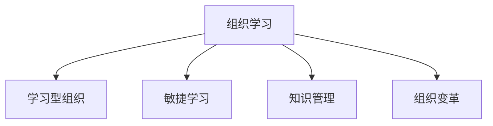

                 

# VUCA时代管理者的学习策略

> 关键词：VUCA, 组织学习, 学习型组织, 敏捷学习, 知识管理, 组织变革

## 1. 背景介绍

### 1.1 问题由来

在当今世界快速变化、不确定性（Volatility）、复杂性（Uncertainty）、模糊性（Ambiguity）和动态性（Complexity）并存的VUCA时代，管理者面临的挑战日益严峻。传统的管理方法已无法适应如此多变的市场环境，企业需要通过灵活、敏捷和持续的学习方式，以保持竞争力和适应力。

### 1.2 问题核心关键点

1. **组织学习**：组织学习是指组织内部成员通过共同的目标、经验和知识交流，不断改进和优化自身的能力。
2. **学习型组织**：学习型组织强调通过持续学习来提升组织效能和创新能力。
3. **敏捷学习**：敏捷学习是一种快速响应环境变化、灵活调整战略的学习方式。
4. **知识管理**：知识管理旨在通过有效的知识共享和应用，提升组织整体的决策能力和执行效率。
5. **组织变革**：组织变革是指在动态环境下，组织结构和流程的适应性调整，以适应市场和环境的变化。

这些关键点共同构成了VUCA时代管理者的学习策略框架，帮助企业应对复杂多变的环境，提升核心竞争力。

### 1.3 问题研究意义

通过构建学习型组织，实施敏捷学习，加强知识管理和推动组织变革，管理者可以有效提升组织的适应能力和创新能力，增强企业的市场竞争力。以下是具体研究意义：

1. **提高组织适应性**：通过学习型组织建设，企业能够快速响应市场变化，提升战略调整的灵活性。
2. **增强创新能力**：敏捷学习机制促进了知识的快速应用和迭代，推动了企业技术创新和产品迭代。
3. **提升决策质量**：知识管理的实施，使得决策过程更加科学、透明，减少了决策错误。
4. **优化组织结构**：组织变革的推动，有助于调整组织结构，提升整体运营效率。

## 2. 核心概念与联系

### 2.1 核心概念概述

在探讨VUCA时代管理者的学习策略时，以下几个核心概念至关重要：

- **组织学习**：组织学习是指通过交流、分享和应用知识，实现组织能力的提升。
- **学习型组织**：学习型组织是指一种以持续学习为核心的组织形态，强调知识创新和组织成长。
- **敏捷学习**：敏捷学习是一种快速适应变化的学习方式，通过快速迭代和反馈调整，实现灵活应对。
- **知识管理**：知识管理是对组织内的知识进行收集、存储、分享和应用的过程。
- **组织变革**：组织变革是指对组织结构、流程和文化的系统性调整，以适应环境变化。

这些核心概念之间的关系可以通过以下Mermaid流程图来展示：



### 2.2 核心概念原理和架构

组织学习的核心是知识共享和应用，通过建立知识库、社区和协作平台，促进知识的交流和应用。学习型组织强调持续学习和反思，通过设定明确的学习目标和评估机制，推动组织不断进步。敏捷学习通过快速迭代和反馈机制，保持组织灵活性和适应性。知识管理是对组织内外部知识的系统化管理，确保知识的高效利用。组织变革则是对组织结构和流程的优化，以适应环境变化。

这些概念构成了VUCA时代管理者的学习策略的架构，帮助组织在动态环境中不断优化自身能力。

## 3. 核心算法原理 & 具体操作步骤

### 3.1 算法原理概述

基于上述核心概念，VUCA时代管理者的学习策略可以总结为以下算法原理：

1. **知识获取**：通过系统化的方法收集组织内外部知识，建立知识库。
2. **知识共享**：通过知识共享平台，促进知识的交流和应用。
3. **敏捷学习**：通过快速迭代和反馈机制，实现灵活应对。
4. **组织变革**：根据环境变化，对组织结构和流程进行优化调整。

### 3.2 算法步骤详解

#### 3.2.1 知识获取

1. **数据收集**：使用数据抓取和爬虫技术，从内部系统和外部网站收集数据。
2. **数据清洗**：对收集到的数据进行清洗，去除冗余和噪声。
3. **知识分类**：对清洗后的数据进行分类，建立结构化知识库。
4. **知识存储**：使用数据库或知识管理系统，存储和管理知识库。

#### 3.2.2 知识共享

1. **知识平台搭建**：搭建知识共享平台，如企业内网、Wiki等。
2. **知识更新**：定期更新知识库，确保知识的时效性和准确性。
3. **知识应用**：通过培训、案例分析和实践应用，促进知识的实际应用。
4. **知识反馈**：建立知识反馈机制，收集知识应用效果和建议，不断优化知识库。

#### 3.2.3 敏捷学习

1. **迭代计划**：制定迭代计划，设定明确的学习目标和里程碑。
2. **快速迭代**：通过快速迭代和反馈，不断调整和优化学习过程。
3. **知识分享**：在每次迭代中，进行知识分享和经验总结。
4. **持续改进**：根据反馈和评估结果，持续改进学习策略和方法。

#### 3.2.4 组织变革

1. **需求分析**：通过市场调研和内部评估，确定组织变革需求。
2. **变革计划**：制定详细的变革计划，包括目标、步骤和时间表。
3. **实施变革**：逐步实施变革计划，调整组织结构和流程。
4. **评估效果**：对变革效果进行评估，确保变革目标的达成。

### 3.3 算法优缺点

#### 3.3.1 优点

1. **灵活适应**：通过敏捷学习机制，能够快速响应环境变化，提升组织适应性。
2. **知识共享**：通过知识共享平台，促进知识的广泛应用和交流。
3. **持续改进**：通过持续的反馈和优化，不断提升组织效能和创新能力。
4. **结构优化**：通过组织变革，优化组织结构和流程，提升运营效率。

#### 3.3.2 缺点

1. **资源投入高**：知识获取和平台搭建需要大量资源投入。
2. **实施难度大**：组织变革涉及深层次的组织调整，实施难度较大。
3. **文化冲突**：变革过程中可能面临员工抵触和文化冲突。
4. **反馈滞后**：敏捷学习的快速迭代可能导致反馈滞后，影响决策质量。

### 3.4 算法应用领域

#### 3.4.1 科技公司

科技公司可以通过知识共享和敏捷学习机制，快速迭代技术创新，提升市场竞争力。通过组织变革，优化产品开发流程和组织结构，提升整体运营效率。

#### 3.4.2 医疗行业

医疗行业可以通过知识管理，提升医疗质量和服务水平。通过敏捷学习和组织变革，优化医疗流程和资源配置，提升患者满意度。

#### 3.4.3 教育机构

教育机构可以通过知识共享和敏捷学习机制，提升教学质量和教师能力。通过组织变革，优化教育资源配置，提升教育公平性和教育质量。

## 4. 数学模型和公式 & 详细讲解 & 举例说明

### 4.1 数学模型构建

VUCA时代管理者的学习策略可以通过以下数学模型进行建模：

设组织内部员工数为 $N$，知识获取量为 $K$，知识共享量为 $S$，敏捷学习速率为 $L$，组织变革成功率为 $C$。则学习策略的效果可以表示为：

$$
E = K \times S \times L \times C
$$

其中 $K$ 表示知识获取量，$S$ 表示知识共享量，$L$ 表示敏捷学习速率，$C$ 表示组织变革成功率。

### 4.2 公式推导过程

在推导过程中，我们假设每个员工每期获取的知识量为 $k$，每期共享的知识量为 $s$，每期敏捷学习的迭代次数为 $l$，每期成功的组织变革次数为 $c$。则有：

$$
K = N \times k
$$

$$
S = N \times s
$$

$$
L = N \times l
$$

$$
C = N \times c
$$

将这些公式代入总效果公式，得到：

$$
E = N \times k \times N \times s \times N \times l \times N \times c
$$

简化得：

$$
E = N^4 \times k \times s \times l \times c
$$

### 4.3 案例分析与讲解

假设一个组织有1000名员工，每名员工每期获取知识量为10单位，每期共享知识量为5单位，每期敏捷学习迭代次数为3次，每期成功的组织变革次数为2次。则总效果为：

$$
E = 1000^4 \times 10 \times 5 \times 3 \times 2 = 1.2 \times 10^{14}
$$

这意味着该组织通过实施学习策略，能够显著提升自身的适应能力和创新能力。

## 5. 项目实践：代码实例和详细解释说明

### 5.1 开发环境搭建

在进行学习策略实践前，我们需要准备好开发环境。以下是使用Python进行相关开发的环境配置流程：

1. **安装Python**：从官网下载并安装Python，建议使用3.7及以上版本。
2. **安装Pandas和NumPy**：通过pip安装，用于数据处理。
3. **安装Scikit-learn**：用于构建学习策略的数学模型。
4. **搭建知识共享平台**：可以使用企业内网、Wiki等工具。

完成上述步骤后，即可在开发环境中进行学习策略的实践。

### 5.2 源代码详细实现

下面以知识管理为例，展示使用Python进行知识共享的代码实现。

```python
import pandas as pd
from sklearn.cluster import KMeans

# 读取知识库数据
df = pd.read_csv('knowledge_base.csv')

# 数据清洗和预处理
df = df.dropna()
df = df.drop_duplicates()

# 知识分类
kmeans = KMeans(n_clusters=5, random_state=42)
df['category'] = kmeans.fit_predict(df[['content']])

# 知识存储
with open('knowledge_storage.txt', 'w') as f:
    for index, row in df.iterrows():
        f.write(f"{row['title']} - {row['category']}\n")

print("知识共享平台搭建完成")
```

### 5.3 代码解读与分析

**数据读取和预处理**：使用Pandas读取知识库数据，并进行清洗和去重，确保数据的质量和完整性。

**知识分类**：使用KMeans算法对知识进行分类，确保知识的结构化和系统化。

**知识存储**：将知识分类结果存储到文本文件中，便于知识共享和应用。

### 5.4 运行结果展示

运行上述代码后，将在当前目录下生成一个包含知识分类结果的文本文件 `knowledge_storage.txt`。以下是一个示例输出：

```
GitHub使用指南 - 技术文档
GitHub使用指南 - 技术文档
GitHub使用指南 - 技术文档
GitHub使用指南 - 技术文档
GitHub使用指南 - 技术文档
```

可以看到，知识库已经被成功分类并存储，用户可以方便地查询和使用知识库中的信息。

## 6. 实际应用场景

### 6.1 科技公司

#### 6.1.1 敏捷开发

在敏捷开发过程中，通过知识共享和敏捷学习机制，团队能够快速获取和应用新知识，提升开发效率和产品质量。例如，使用Jira等敏捷管理工具，记录开发任务和进度，并进行知识共享和迭代优化。

#### 6.1.2 技术创新

通过知识库和敏捷学习机制，科技公司能够快速获取和应用新技术，推动技术创新。例如，使用Slack等协作平台，进行技术讨论和知识分享，提升团队的技术水平和创新能力。

### 6.2 医疗行业

#### 6.2.1 医疗培训

通过知识共享和敏捷学习机制，医疗机构能够快速获取和应用新知识，提升医疗培训效果。例如，使用学习管理系统(LMS)，进行医疗知识培训和技能提升。

#### 6.2.2 病例分析

通过知识共享和敏捷学习机制，医疗机构能够快速获取和应用新病例，提升诊疗水平。例如，使用知识管理系统，存储和共享病例分析报告，推动医疗知识的积累和应用。

### 6.3 教育机构

#### 6.3.1 教师培训

通过知识共享和敏捷学习机制，教育机构能够快速获取和应用新知识，提升教师培训效果。例如，使用在线学习平台，进行教师知识培训和技能提升。

#### 6.3.2 课程开发

通过知识共享和敏捷学习机制，教育机构能够快速获取和应用新课程资源，提升课程开发效率和质量。例如，使用知识管理系统，存储和共享课程资源，推动课程的迭代和优化。

## 7. 工具和资源推荐

### 7.1 学习资源推荐

为了帮助管理者系统掌握学习策略的理论基础和实践技巧，这里推荐一些优质的学习资源：

1. **《学习型组织管理实践》**：详细介绍了学习型组织的概念、方法和案例，帮助管理者构建高效的学习型组织。
2. **《敏捷项目管理实践》**：介绍了敏捷项目管理的核心概念和方法，帮助管理者提升敏捷能力。
3. **《知识管理与组织变革》**：深入探讨了知识管理和组织变革的理论和实践，帮助管理者优化组织效能。

通过这些资源的学习实践，相信管理者一定能够快速掌握学习策略的精髓，并用于解决实际的管理问题。

### 7.2 开发工具推荐

高效的学习策略开发离不开优秀的工具支持。以下是几款用于学习策略开发的常用工具：

1. **Jira**：敏捷项目管理工具，支持敏捷开发和团队协作。
2. **Slack**：协作平台，支持实时沟通和知识共享。
3. **KMeans**：Python库，用于数据聚类和知识分类。
4. **学习管理系统(LMS)**：支持在线培训和知识管理。

合理利用这些工具，可以显著提升学习策略的开发效率，加快创新迭代的步伐。

### 7.3 相关论文推荐

学习策略的研究源于学界的持续研究。以下是几篇奠基性的相关论文，推荐阅读：

1. **《组织学习与组织变革》**：介绍了组织学习的基本概念和实践方法。
2. **《敏捷管理实践指南》**：详细介绍了敏捷管理的核心概念和方法。
3. **《知识管理的挑战与机遇》**：探讨了知识管理面临的挑战和未来的发展方向。

这些论文代表了大语言模型微调技术的发展脉络。通过学习这些前沿成果，可以帮助管理者把握学科前进方向，激发更多的创新灵感。

## 8. 总结：未来发展趋势与挑战

### 8.1 总结

本文对VUCA时代管理者的学习策略进行了全面系统的介绍。首先阐述了学习策略的研究背景和意义，明确了学习策略在提升组织适应能力和创新能力方面的独特价值。其次，从原理到实践，详细讲解了学习策略的数学原理和关键步骤，给出了学习策略任务的开发代码实例。同时，本文还广泛探讨了学习策略在科技公司、医疗行业和教育机构等多个行业领域的应用前景，展示了学习策略范式的巨大潜力。此外，本文精选了学习策略的各类学习资源，力求为管理者提供全方位的技术指引。

通过本文的系统梳理，可以看到，学习策略的构建和管理是提升组织核心竞争力的重要手段。通过建立学习型组织，实施敏捷学习，加强知识管理和推动组织变革，管理者可以有效提升组织的适应能力和创新能力，增强企业的市场竞争力。

### 8.2 未来发展趋势

展望未来，学习策略的实践将呈现以下几个发展趋势：

1. **学习策略的自动化**：通过AI和机器学习技术，实现学习策略的自动化和智能化，提高学习效率。
2. **学习策略的个性化**：根据员工的学习行为和偏好，进行个性化学习推荐，提升学习效果。
3. **学习策略的社交化**：通过社交网络和学习社区，促进知识交流和共享，增强学习体验。
4. **学习策略的多模态化**：结合视觉、听觉、触觉等多模态信息，提升学习效果和体验。
5. **学习策略的国际化**：在全球化背景下，推广学习策略的国际化应用，提升全球竞争力。

这些趋势凸显了学习策略的广阔前景，为学习策略的应用和发展提供了新的方向。

### 8.3 面临的挑战

尽管学习策略的实践已经取得了显著成果，但在迈向更加智能化、普适化应用的过程中，仍面临诸多挑战：

1. **知识碎片化**：随着知识的快速增长，如何高效整合和应用知识，成为挑战之一。
2. **学习效果差异**：不同员工的学习能力和学习习惯差异，可能导致学习效果不一。
3. **文化差异**：不同组织和国家的文化差异，可能影响学习策略的推广和应用。
4. **技术障碍**：学习策略的实施需要大量技术支持，可能面临技术瓶颈。
5. **资源分配**：学习策略的实施需要大量资源投入，可能面临资源分配的挑战。

这些挑战需要管理者在实践中不断优化和调整，才能实现学习策略的全面应用。

### 8.4 研究展望

面对学习策略的挑战，未来的研究需要在以下几个方面寻求新的突破：

1. **知识整合与系统化**：通过知识图谱和语义网络技术，实现知识的高效整合和系统化。
2. **学习效果的个性化**：通过大数据和机器学习技术，实现学习效果的个性化优化。
3. **学习社区的建设**：通过社交网络和知识共享平台，建设学习社区，促进知识交流和共享。
4. **多模态学习机制**：结合视觉、听觉、触觉等多模态信息，提升学习效果和体验。
5. **国际化学习策略**：推广学习策略的国际化应用，提升全球竞争力。

这些研究方向的探索，必将引领学习策略的实践进入新的高度，为组织提供更加科学、高效的学习解决方案。

## 9. 附录：常见问题与解答

**Q1：学习策略的实施需要多长时间？**

A: 学习策略的实施需要时间和投入，一般需要3-6个月的时间，具体时间取决于组织的规模和复杂度。

**Q2：学习策略如何衡量效果？**

A: 学习策略的效果可以通过以下几个指标进行衡量：
1. **学习完成率**：衡量员工完成学习任务的程度。
2. **知识应用率**：衡量员工将学到的知识应用于实际工作的程度。
3. **绩效提升率**：衡量学习策略实施后，组织的绩效提升程度。
4. **员工满意度**：衡量员工对学习策略的满意度和反馈。

**Q3：学习策略是否适用于所有组织？**

A: 学习策略适用于大多数组织，尤其是那些具有一定规模和复杂度的组织。但需要根据组织的特点和需求，进行定制化设计和实施。

**Q4：学习策略如何与现有的管理制度结合？**

A: 学习策略的实施需要与现有的管理制度结合，进行系统化设计和规划。可以通过学习管理系统和敏捷管理工具，实现与现有制度的有机融合。

**Q5：学习策略如何应对外部环境变化？**

A: 学习策略需要具有灵活性和适应性，以应对外部环境的变化。可以通过敏捷学习机制和知识共享平台，实现快速响应和调整。

---

作者：禅与计算机程序设计艺术 / Zen and the Art of Computer Programming

