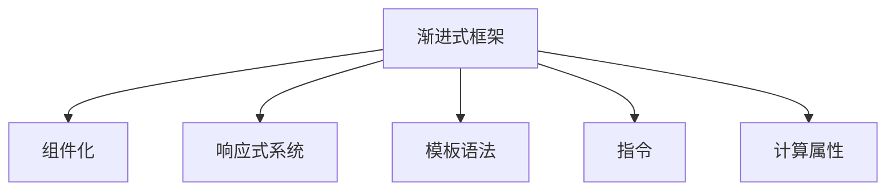

                 

# Vue.js 框架特点：渐进式 JavaScript 框架的选择

## 1. 背景介绍

### 1.1 问题由来

在现代前端开发中，框架的选择直接决定了应用的开发效率、性能表现以及后续维护的便利性。JavaScript框架的演进经历了从原始的原生JavaScript开发，到后来的MVC/MVVM框架，再到目前最流行的React、Vue等库和框架。Vue.js作为一款渐进式JavaScript框架，以其“易学易用、组件化、高效”等特点逐渐成为开发者们的新宠。然而，对于初学者而言，选择一款适合自己的框架仍然是件头疼的事。本文将从背景介绍、核心概念与联系、算法原理与操作步骤、数学模型与公式、项目实践、应用场景、工具与资源推荐等方面，全面剖析Vue.js框架的特点，并给出从入门到进阶的学习路线图。

## 2. 核心概念与联系

### 2.1 核心概念概述

要全面理解Vue.js框架，需要先理解其核心概念和它们之间的联系：

- **渐进式框架（Progressive Framework）**：渐进式框架允许开发者逐步引入框架，不强制要求一次性完成框架集成。这样既能降低学习门槛，又能保证应用的稳定性和性能。
- **组件化（Component-Based）**：Vue.js以组件为单位构建应用，每个组件可以独立开发、测试和部署。组件化有助于代码复用和模块化开发，提升开发效率。
- **响应式系统（Reactive System）**：Vue.js通过双向数据绑定实现响应式系统，当数据变化时，UI会自动更新，反之亦然。这样的实时同步性提高了开发和调试的便利性。
- **模板语法（Template Syntax）**：Vue.js使用简单的HTML模板语法，便于开发者在渐进式框架中构建视图，并实现与JavaScript的语法分离。
- **指令（Directives）**：Vue.js提供了各种指令，用于在模板中绑定数据、处理事件等，增强了框架的灵活性。
- **计算属性（Computed Properties）**：计算属性是Vue.js提供的一种特殊的数据响应式处理方式，可以帮助开发者实现复杂的计算逻辑，而不必依赖嵌套watcher。

这些核心概念共同构成了Vue.js框架的基础，并从不同角度影响着框架的使用体验。

### 2.2 核心概念原理和架构的 Mermaid 流程图



该流程图展示了Vue.js框架中核心概念之间的关系。从渐进式框架出发，通过组件化提升开发效率，利用响应式系统和模板语法简化开发流程，借助指令和计算属性实现复杂逻辑的快速处理。

## 3. 核心算法原理 & 具体操作步骤

### 3.1 算法原理概述

Vue.js框架的原理可归纳为以下几个方面：

- **响应式系统**：Vue.js通过双向数据绑定实现响应式系统。当数据发生变化时，视图自动更新，反之亦然。这种双向数据绑定技术，通过watcher机制实现，能够准确跟踪数据变化，及时更新视图。
- **组件化**：Vue.js将应用划分为多个组件，每个组件独立开发、测试和部署。组件之间通过props和events传递数据，使得开发和维护更加模块化。
- **虚拟DOM**：Vue.js使用虚拟DOM优化DOM操作，提高渲染效率。虚拟DOM通过diff算法，比较新旧模板的差异，只更新需要更新的部分，避免不必要的操作。
- **编译器**：Vue.js的编译器能够将模板转换为指令，实现了对模板的解析和渲染。编译器分为静态编译和动态编译，静态编译适用于全功能的Vue应用，动态编译则适用于简单的单文件组件。

### 3.2 算法步骤详解

使用Vue.js框架进行开发的步骤如下：

1. **项目初始化**：使用Vue CLI创建项目，并选择合适的模板。
2. **组件编写**：编写组件，包括组件函数和模板。
3. **数据绑定**：通过props和events在组件间传递数据。
4. **生命周期钩子**：定义组件的生命周期钩子函数，如created、mounted、beforeUpdate等。
5. **计算属性**：使用计算属性实现复杂逻辑，提高代码复用性。
6. **指令使用**：使用指令绑定数据和事件，增强开发灵活性。
7. **路由配置**：使用Vue Router进行路由配置，实现页面导航。
8. **状态管理**：使用Vuex管理全局状态，实现跨组件的数据共享。
9. **单元测试**：编写单元测试，保证代码的正确性。
10. **性能优化**：使用性能分析工具，如Vue DevTools，优化性能瓶颈。

### 3.3 算法优缺点

Vue.js框架的优点包括：

- **易学易用**：渐进式框架降低了学习门槛，组件化提高了开发效率，响应式系统和模板语法使得开发过程更加直观。
- **性能优越**：虚拟DOM优化了DOM操作，编译器提高了渲染效率，计算属性和指令增强了代码复用性和灵活性。
- **社区活跃**：作为一款流行的框架，Vue.js拥有庞大的社区和丰富的插件，便于开发者解决各种问题。

但 Vue.js 也存在一些缺点：

- **性能瓶颈**：在大规模应用中，Vue.js的性能瓶颈可能体现出来，尤其是数据绑定的开销较大。
- **模块粒度**：Vue.js的组件粒度较大，不利于微模块化开发。
- **学习成本**：虽然渐进式框架降低了学习门槛，但复杂的组件结构和指令语法，可能对初学者有一定挑战。

### 3.4 算法应用领域

Vue.js框架适用于各种类型的Web应用，包括单页应用（SPA）、移动应用、桌面应用等。具体的应用领域包括：

- **电商网站**：通过组件化和响应式系统，实现复杂的商品展示、购物车管理和用户登录等功能。
- **前端仪表盘**：使用计算属性和指令，快速构建复杂的仪表盘和数据可视化界面。
- **企业应用**：通过路由和状态管理，实现前后端分离的企业级应用，提升开发效率。
- **移动应用**：使用Vue.js构建原生移动应用或混合应用，实现跨平台开发。
- **桌面应用**：使用Vue.js构建桌面应用，提升用户体验和性能。

## 4. 数学模型和公式 & 详细讲解 & 举例说明

Vue.js框架的核心算法原理和具体操作步骤涉及了响应式系统、虚拟DOM、编译器等关键技术，下面将通过数学模型和公式对这些技术进行详细讲解。

### 4.1 数学模型构建

- **响应式系统**：通过观察数据变化，触发视图更新。数据变化时，计算新旧视图差异，更新需要更新的部分。
- **虚拟DOM**：使用虚拟DOM树代替真实DOM树，通过diff算法比较新旧虚拟DOM的差异，只更新需要更新的部分。
- **编译器**：将模板转换为指令，通过静态编译器或动态编译器进行编译。

### 4.2 公式推导过程

- **响应式系统**：
  $$
  \text{旧视图} \rightarrow \text{数据变化} \rightarrow \text{新视图}
  $$
- **虚拟DOM**：
  $$
  \text{旧虚拟DOM} - \text{新虚拟DOM} = \text{需要更新的部分}
  $$
- **编译器**：
  $$
  \text{模板} \rightarrow \text{指令} \rightarrow \text{渲染结果}
  $$

### 4.3 案例分析与讲解

以一个简单的Vue应用为例，分析响应式系统、虚拟DOM和编译器的具体应用：

```html
<template>
  <div>
    <p>{{ message }}</p>
    <button @click="updateMessage">更新消息</button>
  </div>
</template>

<script>
export default {
  name: 'App',
  data() {
    return {
      message: 'Hello Vue.js!'
    }
  },
  methods: {
    updateMessage() {
      this.message = '更新成功'
    }
  }
}
</script>
```

- **响应式系统**：当`message`数据发生变化时，视图中的`<p>`元素会自动更新。
- **虚拟DOM**：在点击按钮时，虚拟DOM会计算新旧视图的差异，只更新`<p>`元素的内容，避免了不必要的DOM操作。
- **编译器**：模板中的`{{ message }}`会被编译器转换为指令，实现数据的双向绑定。

## 5. 项目实践：代码实例和详细解释说明

### 5.1 开发环境搭建

使用Vue CLI创建项目，并安装依赖包：

```bash
vue create my-app
cd my-app
npm install vue-router vuex
```

### 5.2 源代码详细实现

以下是一个简单的Vue应用示例，包含路由、组件和计算属性：

```html
<template>
  <div>
    <h1>{{ title }}</h1>
    <p>{{ message }}</p>
  </div>
</template>

<script>
import Vue from 'vue'
import VueRouter from 'vue-router'

Vue.use(VueRouter)

export default {
  name: 'Home',
  data() {
    return {
      title: '欢迎访问Vue.js应用'
    }
  },
  computed: {
    message() {
      return `欢迎访问${this.title}！`
    }
  },
  methods: {
    toAbout() {
      this.$router.push('/about')
    }
  }
}
</script>
```

### 5.3 代码解读与分析

**组件**：
- `name`属性指定组件的名称。
- `data`方法返回组件的初始化数据。
- `computed`属性定义计算属性，实现复杂逻辑。
- `methods`属性定义组件的方法，处理事件等。

**路由**：
- 使用Vue Router进行路由配置，实现页面导航。

**计算属性**：
- 使用计算属性简化数据处理，提高代码复用性。

### 5.4 运行结果展示

启动开发服务器，访问`http://localhost:8080`，即可看到运行结果：

```
欢迎访问Vue.js应用！
```

点击“前往关于页面”按钮，路由自动切换到`/about`页面。

## 6. 实际应用场景

### 6.1 电商网站

电商网站需要展示复杂的商品信息、用户评价、购物车管理等功能。使用Vue.js框架，可以轻松构建页面组件，并通过路由实现复杂的业务逻辑。

```html
<template>
  <div>
    <h1>{{ product.title }}</h1>
    <p>{{ product.description }}</p>
    <p>{{ product.price }}</p>
    <button @click="addToCart">加入购物车</button>
  </div>
</template>

<script>
import Vue from 'vue'
import Vuex from 'vuex'

Vue.use(Vuex)

export default {
  name: 'Product',
  computed: {
    product() {
      return this.$store.state.product
    }
  },
  methods: {
    addToCart() {
      this.$store.commit('addToCart', this.product)
    }
  }
}
</script>
```

### 6.2 前端仪表盘

前端仪表盘需要展示复杂的图表和数据可视化界面。使用Vue.js的计算属性和指令，可以快速构建复杂的仪表盘。

```html
<template>
  <div>
    <p>当前时间：{{ date }}</p>
    <line-chart :data="chartData" />
  </div>
</template>

<script>
import Vue from 'vue'
import { LineChart } from 'vue-chartjs'

Vue.component('line-chart', LineChart)

export default {
  data() {
    return {
      chartData: {
        labels: ['2022-01-01', '2022-01-02', '2022-01-03'],
        datasets: [{
          label: '数据',
          data: [10, 20, 30]
        }]
      }
    }
  },
  computed: {
    date() {
      return new Date().toLocaleDateString()
    }
  }
}
</script>
```

### 6.3 企业应用

企业应用需要前后端分离，提高开发效率。使用Vue.js的组件化和状态管理，可以实现前后端分离的企业级应用。

```javascript
const router = new VueRouter()
router.push('/home')

const store = new Vuex.Store({
  state: {
    todos: []
  },
  mutations: {
    addTodo(state, todo) {
      state.todos.push(todo)
    }
  },
  actions: {
    addTodo({ commit }, todo) {
      commit('addTodo', todo)
    }
  }
})
```

## 7. 工具和资源推荐

### 7.1 学习资源推荐

为了帮助开发者系统掌握Vue.js框架的理论基础和实践技巧，这里推荐一些优质的学习资源：

- **官方文档**：Vue.js官网提供了详细的使用手册和API文档，是学习Vue.js的必备资源。
- **Vue.js教程**：阮一峰老师的《Vue.js教程》系列文章，全面介绍了Vue.js框架的核心概念和开发实践。
- **Vue.js源码**：Vue.js官方提供的源码，可以帮助开发者深入理解框架的实现原理。
- **Vue.js插件**：Vue.js社区提供了丰富的插件和扩展，开发者可以根据自己的需求选择合适的插件。

### 7.2 开发工具推荐

以下是几款用于Vue.js开发常用的工具：

- **Vue CLI**：Vue.js官方提供的开发工具，提供了快速启动项目、版本控制等功能。
- **Vue DevTools**：Chrome浏览器的插件，用于调试Vue.js应用，实时监控数据变化和性能指标。
- **Visual Studio Code**：流行的代码编辑器，支持Vue.js开发和调试。
- **Webpack**：打包构建工具，支持Vue.js应用的构建和优化。

### 7.3 相关论文推荐

Vue.js框架的发展源于学界的持续研究。以下是几篇奠基性的相关论文，推荐阅读：

- **Vue.js: Lightweight Framework for Progressive Web Apps**：官方论文，详细介绍了Vue.js框架的架构和设计思路。
- **React vs Vue vs Angular**：关于React、Vue和Angular三款框架的对比分析，帮助开发者选择适合自己的框架。
- **Progressive Web Applications**：关于渐进式Web应用的经典论文，详细介绍了渐进式Web应用的设计和实现。

## 8. 总结：未来发展趋势与挑战

### 8.1 研究成果总结

Vue.js框架以其易学易用、组件化、高效等特点，成为开发者们的热门选择。当前，Vue.js框架在电商网站、前端仪表盘、企业应用等领域得到了广泛应用，开发者对Vue.js的认可度持续提升。

### 8.2 未来发展趋势

展望未来，Vue.js框架将呈现以下几个发展趋势：

1. **组件化更加灵活**：未来Vue.js将进一步提升组件的灵活性，支持更多粒度、更多功能的组件。
2. **性能优化**：通过优化响应式系统和虚拟DOM，提升Vue.js框架的性能表现。
3. **生态系统更加完善**：Vue.js社区将不断引入新功能和新插件，丰富Vue.js的生态系统。
4. **国际化支持**：未来Vue.js框架将支持更多的语言和国际化功能，提升全球化开发体验。

### 8.3 面临的挑战

尽管Vue.js框架已经取得了瞩目成就，但在迈向更加智能化、普适化应用的过程中，仍面临诸多挑战：

1. **性能瓶颈**：Vue.js在大规模应用中，可能遇到性能瓶颈，尤其是数据绑定的开销较大。
2. **组件粒度**：Vue.js的组件粒度较大，不利于微模块化开发。
3. **学习成本**：虽然渐进式框架降低了学习门槛，但复杂的组件结构和指令语法，可能对初学者有一定挑战。

### 8.4 研究展望

面对Vue.js框架面临的挑战，未来的研究需要在以下几个方面寻求新的突破：

1. **性能优化**：开发更加高效的响应式系统和虚拟DOM实现，提高Vue.js框架的性能表现。
2. **组件粒度优化**：提升组件的粒度灵活性，支持更多功能的组件开发。
3. **学习资源优化**：优化Vue.js的学习资源，降低初学者的学习成本，提高学习效率。
4. **国际化支持**：提供更完善的国际化功能，提升全球化开发体验。

## 9. 附录：常见问题与解答

**Q1：Vue.js框架有哪些优点和缺点？**

A: Vue.js框架的优点包括易学易用、组件化、高效等。缺点包括性能瓶颈、组件粒度较大、学习成本较高。

**Q2：Vue.js的虚拟DOM是如何实现的？**

A: Vue.js的虚拟DOM使用差分算法（diff算法）实现。通过比较新旧虚拟DOM的差异，只更新需要更新的部分，避免了不必要的DOM操作。

**Q3：Vue.js的响应式系统是如何实现的？**

A: Vue.js的响应式系统通过watcher机制实现。当数据发生变化时，watcher会自动更新视图，并触发视图的变化。

**Q4：如何提高Vue.js应用的性能？**

A: 可以通过优化响应式系统和虚拟DOM、使用异步渲染、避免不必要的watcher等措施，提高Vue.js应用的性能。

---

作者：禅与计算机程序设计艺术 / Zen and the Art of Computer Programming

