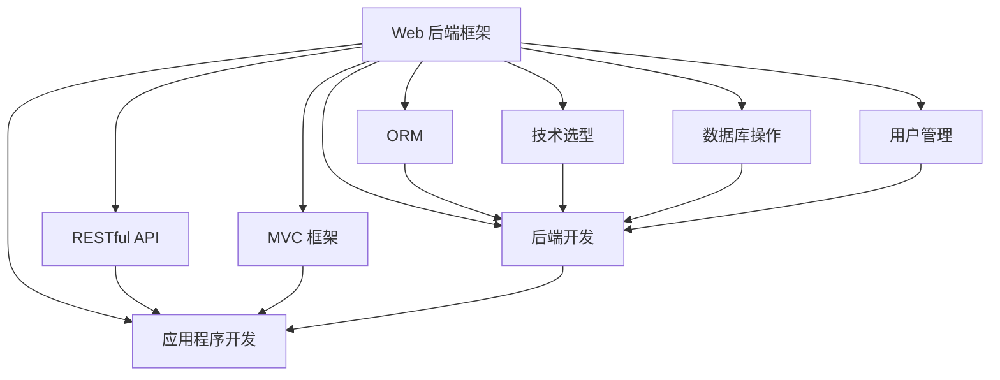

                 

# Web 后端框架：Express、Django 和 Flask

> 关键词：Express, Django, Flask, Web 后端框架, RESTful API, MVC 框架, ORM, 后端开发, 应用程序开发, 技术选型, 数据库操作, 用户管理

## 1. 背景介绍

随着互联网技术的迅猛发展，Web应用程序的规模和复杂度也在不断增长。为了提高开发效率和代码可维护性，Web后端框架（Backend Frameworks）应运而生。这些框架提供了许多抽象层，使得开发者可以更专注于业务逻辑的实现，而不是底层的网络协议或数据库操作。

Web后端框架的发展已经历了多个阶段，从早期的CGI到现代的RESTful API，从MVC框架到无状态的微服务，框架的类型和特性也在不断演进。本文将重点介绍三个广受欢迎的Web后端框架：Express、Django和Flask，并对比它们的优缺点和适用场景，以帮助开发者更好地选择适合自己项目的框架。

## 2. 核心概念与联系

### 2.1 核心概念概述

- **Web 后端框架**：提供了一系列功能和工具，以帮助开发者快速开发Web应用程序的底层架构。
- **RESTful API**：一种基于HTTP协议的设计风格，遵循原则如资源定位、无状态、客户端-服务器分离等。
- **MVC 框架**：Model-View-Controller的缩写，是一种常见的软件架构模式，用于分离内部表示的业务逻辑、用于向用户显示信息的用户界面、用于处理用户输入的控制器。
- **ORM**（Object-Relational Mapping）：一种编程技术，用于在关系型数据库和对象模型之间进行映射，简化数据操作。
- **后端开发**：开发Web应用程序中处理业务逻辑、数据存储、数据访问、权限控制等功能的模块。
- **应用程序开发**：设计、实现、部署和管理Web应用程序的全过程。
- **技术选型**：根据项目需求和团队经验，选择合适的技术栈和工具集。
- **数据库操作**：对数据库进行增删改查等操作，确保数据的一致性和完整性。
- **用户管理**：包括用户注册、登录、权限管理等功能，确保系统的安全性和可扩展性。

### 2.2 核心概念原理和架构的 Mermaid 流程图



此图展示了各个核心概念之间的联系。Web后端框架支持RESTful API、MVC框架、ORM等关键功能，同时还负责后端开发、应用程序开发、技术选型、数据库操作和用户管理等任务。

## 3. 核心算法原理 & 具体操作步骤

### 3.1 算法原理概述

Web后端框架的核心算法原理主要围绕如何管理HTTP请求、路由和响应，以及如何处理业务逻辑和数据库操作。

- **HTTP请求管理**：框架通常提供HTTP请求处理器，可以处理GET、POST、PUT、DELETE等请求方法。
- **路由处理**：框架提供路由系统，用于将HTTP请求映射到对应的处理函数或类。
- **响应处理**：框架处理HTTP响应，通常支持JSON、XML等数据格式，以及状态码和头信息的自定义。
- **中间件处理**：框架提供中间件机制，可以在请求和响应之间插入额外的处理逻辑。
- **ORM集成**：框架通常支持多种ORM，如Django的ORM、Express的Mongoose等，用于简化数据库操作。

### 3.2 算法步骤详解

以下以Express框架为例，详细讲解其核心算法步骤：

1. **初始化**：通过`app.listen()`启动Express服务器，监听指定端口。
2. **中间件注册**：通过`app.use()`注册中间件，如body-parser解析请求体、cookie-parser解析Cookie等。
3. **路由定义**：通过`app.get()`、`app.post()`等方法定义路由，绑定对应的处理函数或类。
4. **请求处理**：当收到HTTP请求时，Express根据路由匹配规则找到对应的处理函数或类，并进行处理。
5. **响应返回**：处理函数或类根据请求处理结果，构造HTTP响应，并返回给客户端。
6. **中间件处理**：处理完请求后，依次执行注册的中间件，处理完毕后再返回响应。

### 3.3 算法优缺点

Express框架的优点包括：

- **灵活性高**：Express允许开发者灵活定制中间件和路由规则，适用于各种类型的Web应用程序。
- **性能优化**：Express提供了多种性能优化手段，如压缩中间件、错误处理中间件等，可以提高Web应用程序的性能。
- **社区支持**：Express拥有庞大的社区，丰富的插件和工具支持，可以快速开发和部署Web应用程序。

缺点包括：

- **配置复杂**：Express的配置相对复杂，初学者容易混淆各种选项和钩子。
- **缺乏内置的ORM**：Express本身不提供ORM，需要结合第三方ORM工具使用。
- **安全性不足**：Express默认提供的安全措施有限，需要开发者自行实现。

### 3.4 算法应用领域

Express框架适用于需要灵活性和扩展性的Web应用程序，特别是在中小型项目和初创公司中应用广泛。适合以下应用场景：

- **API开发**：通过Express可以轻松构建RESTful API，用于数据交换和第三方服务集成。
- **单页应用（SPA）**：Express可以作为后端框架，与前端框架如React、Vue.js等配合，构建全栈Web应用。
- **静态文件服务**：Express可以简单地处理静态文件请求，如图片、CSS、JavaScript等。
- **中间件插件**：Express的中间件机制非常灵活，可以轻松实现自定义的中间件和插件。

## 4. 数学模型和公式 & 详细讲解

### 4.1 数学模型构建

Web后端框架的数学模型主要基于请求响应模型和路由匹配模型。

- **请求响应模型**：用于描述HTTP请求和响应的处理流程，包括请求方法、URL路径、请求体、响应头、响应体等。
- **路由匹配模型**：用于描述路由规则的匹配过程，包括路由路径、请求方法、参数、处理函数等。

### 4.2 公式推导过程

以下是一个简单的路由匹配公式：

假设有一个路由规则`/users/:id`，表示获取用户信息，其中`:id`表示动态参数。当收到HTTP GET请求时，Express会根据URL路径`/users/123`匹配到该路由，并将参数`:id`绑定为`123`，然后执行对应的处理函数。

### 4.3 案例分析与讲解

假设有一个简单的Express应用，用于处理用户注册和登录：

```javascript
const express = require('express');
const app = express();

// 中间件注册
app.use(express.json());

// 路由定义
app.post('/api/users/register', (req, res) => {
  const { username, password } = req.body;
  // 处理用户注册逻辑
  res.json({ message: '注册成功' });
});

app.post('/api/users/login', (req, res) => {
  const { username, password } = req.body;
  // 处理用户登录逻辑
  res.json({ message: '登录成功' });
});

// 请求处理
app.listen(3000, () => {
  console.log('Server started on port 3000');
});
```

该应用通过Express处理HTTP POST请求，路由为`/api/users/register`和`/api/users/login`，并使用中间件`express.json()`解析请求体。

## 5. 项目实践：代码实例和详细解释说明

### 5.1 开发环境搭建

- **Node.js**：Express是基于Node.js平台开发的，需要先安装Node.js环境。
- **npm**：Node.js自带npm包管理器，用于安装和卸载依赖。
- **Express框架**：通过npm安装Express框架。

### 5.2 源代码详细实现

以下是一个简单的Express应用程序，用于处理HTTP请求和响应：

```javascript
const express = require('express');
const app = express();

// 中间件注册
app.use(express.json());

// 路由定义
app.get('/api/hello', (req, res) => {
  res.json({ message: 'Hello, World!' });
});

app.listen(3000, () => {
  console.log('Server started on port 3000');
});
```

该应用程序定义了一个路由`/api/hello`，当收到HTTP GET请求时，返回`{ message: 'Hello, World!' }`。

### 5.3 代码解读与分析

- **app.use()**：注册中间件，用于解析请求体，支持JSON格式的请求体。
- **app.get()**：定义GET请求路由，绑定对应的处理函数。
- **app.listen()**：启动Express服务器，监听3000端口。

### 5.4 运行结果展示

可以通过curl或浏览器访问`http://localhost:3000/api/hello`，即可收到`{ message: 'Hello, World!' }`的JSON响应。

## 6. 实际应用场景

### 6.1 后端API开发

Express框架非常适合开发RESTful API，通过`app.get()`、`app.post()`、`app.put()`等方法定义API接口，并使用中间件处理请求和响应。

### 6.2 全栈Web应用开发

Express可以作为后端框架，与React、Vue.js等前端框架配合，构建全栈Web应用。

### 6.3 静态文件服务

Express可以简单地处理静态文件请求，如图片、CSS、JavaScript等，并支持文件上传和下载。

### 6.4 中间件插件

Express的中间件机制非常灵活，可以轻松实现自定义的中间件和插件，如身份验证、权限控制、日志记录等。

### 6.5 任务调度

Express可以与Node.js的Child Process模块配合，实现任务调度功能，支持异步任务和定时任务。

## 7. 工具和资源推荐

### 7.1 学习资源推荐

- **《Express快速入门》**：一本非常实用的Express入门书籍，适合初学者学习Express的基本用法。
- **《Node.js 高级程序设计》**：深入介绍Node.js的内部机制和高级应用，适合有Node.js基础的开发者。
- **《JavaScript设计模式》**：介绍JavaScript常用的设计模式，包括中间件和MVC架构等。
- **《Django官方文档》**：Django的官方文档，详细介绍了Django框架的使用方法。
- **《Flask官方文档》**：Flask的官方文档，详细介绍了Flask框架的使用方法。
- **《RESTful API设计指南》**：一本介绍RESTful API设计原则和实践的书籍，适合API开发人员学习。
- **《Web应用程序的开发和部署》**：介绍Web应用程序开发和部署的书籍，适合全栈开发者学习。

### 7.2 开发工具推荐

- **Visual Studio Code**：一款轻量级且功能强大的代码编辑器，支持Node.js和Express框架。
- **Git**：版本控制系统，支持团队协作开发和版本控制。
- **npm**：Node.js的包管理器，支持安装和卸载依赖。
- **Postman**：API测试工具，可以模拟HTTP请求和响应，便于调试API接口。
- **Chrome DevTools**：浏览器开发工具，可以调试JavaScript和DOM，优化Web应用程序性能。

### 7.3 相关论文推荐

- **《Node.js生态系统的未来》**：探讨Node.js和Express框架的未来发展趋势。
- **《Web框架比较研究》**：比较Express、Django和Flask等框架的优缺点和适用场景。
- **《RESTful API设计原则》**：介绍RESTful API设计的原则和实践。
- **《ORM框架比较研究》**：比较Django的ORM、Express的Mongoose和SQLite等ORM框架的优缺点。

## 8. 总结：未来发展趋势与挑战

### 8.1 研究成果总结

本文介绍了三个常用的Web后端框架：Express、Django和Flask，并对比了它们的优缺点和适用场景。通过学习这些框架，开发者可以更好地选择适合自己项目的框架。

### 8.2 未来发展趋势

Web后端框架的未来发展趋势包括：

- **无状态化**：随着微服务架构的兴起，无状态服务变得更加重要。Web后端框架将更加强调无状态和分布式架构。
- **性能优化**：Web应用程序的性能优化一直是热点问题，未来的框架将更加注重性能优化，如异步编程、中间件缓存等。
- **安全性**：Web应用程序的安全性问题越来越受到关注，未来的框架将更加注重安全性和漏洞修复。
- **云原生**：云原生技术如Docker、Kubernetes等正在成为主流，未来的框架将更加支持云原生技术。

### 8.3 面临的挑战

Web后端框架在发展过程中也面临着一些挑战：

- **学习曲线**：新的框架和新技术层出不穷，开发者需要不断学习和适应。
- **性能瓶颈**：Web应用程序的性能瓶颈越来越多，如何优化性能成为开发者的挑战。
- **安全问题**：Web应用程序的安全问题复杂多样，如何应对各种安全威胁是一个难题。
- **用户体验**：Web应用程序的用户体验非常重要，如何提升用户体验是一个长期任务。

### 8.4 研究展望

未来的研究方向包括：

- **前后端一体化**：将前端和后端技术进一步融合，提升开发效率和用户体验。
- **无代码开发**：通过低代码平台和可视化开发工具，简化开发流程，降低开发门槛。
- **机器学习集成**：将机器学习技术集成到Web后端框架中，提升数据分析和预测能力。
- **DevOps自动化**：通过DevOps工具和流程自动化，提高开发和运维效率。

## 9. 附录：常见问题与解答

**Q1：Express和Django哪个更适合开发RESTful API？**

A: Express更适合开发RESTful API，因为它更加灵活，可以自定义中间件和路由规则，而Django的ORM限制较多。

**Q2：Django和Flask哪个更适合开发全栈Web应用？**

A: Django更适合开发全栈Web应用，因为它提供了完整的ORM、模板引擎和路由系统，而Flask更注重灵活性和性能。

**Q3：如何提高Express的性能？**

A: 可以通过使用中间件、压缩静态文件、启用缓存等手段来提高Express的性能。

**Q4：Django和Flask有哪些区别？**

A: Django提供了完整的ORM、模板引擎和路由系统，适合大型项目和复杂的Web应用。Flask更注重灵活性和性能，适合中小型项目和初创公司。

**Q5：Django和Flask的优缺点是什么？**

A: Django的优点是提供了丰富的内置功能，易于上手，缺点是灵活性不足。Flask的优点是灵活性高，易于扩展，缺点是配置复杂，需要手动实现ORM等。

