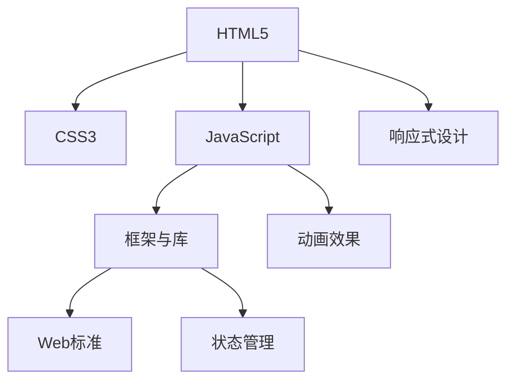

                 

# Web前端技术栈：HTML5、CSS3与JavaScript

## 1. 背景介绍

### 1.1 问题由来

在Web开发领域，前端技术栈一直是开发者必备的知识体系。从最初的HTML、CSS、JavaScript，到后来涌现的各种框架和库，Web前端技术栈不断演变，以满足不断增长的用户体验和性能需求。

随着Web技术的迅速发展，尤其是移动端和跨平台应用的兴起，前端开发者面临着前所未有的挑战。如何构建高性能、响应式、交互性强的Web应用，成为技术开发者们共同关注的课题。

### 1.2 问题核心关键点

当前，Web前端技术栈以HTML5、CSS3、JavaScript为核心，通过各种框架和库的应用，实现了Web应用的现代化和高效化。本文将围绕这些核心技术，详细介绍其原理、特点和应用，为Web开发者提供全面的技术指引。

## 2. 核心概念与联系

### 2.1 核心概念概述

为更好地理解Web前端技术栈，本节将介绍几个关键技术概念：

- **HTML5**：超文本标记语言第5版，提供了丰富的语义标签和多媒体支持，极大地提升了Web应用的表现力和用户体验。

- **CSS3**：层叠样式表第3版，引入了动画、渐变、阴影等视觉特效，以及响应式设计、自定义字体等特性，使得页面布局和样式更加灵活和美观。

- **JavaScript**：一种高级编程语言，用于为Web应用添加动态交互性和逻辑处理能力。

- **框架与库**：如React、Vue、Angular等，提供了组件化开发、状态管理、路由配置等功能，极大提升了开发效率和代码可维护性。

- **Web标准**：如Web Content Accessibility Guidelines (WCAG)、Web Performance Optimization (WPO)等，指导开发者遵循最佳实践，确保Web应用的可访问性和性能。

这些核心技术之间的联系密切，通常相互配合，共同构建Web应用的前端技术栈。以下Mermaid流程图展示了这些核心技术之间的关系：



这个流程图展示了HTML5、CSS3、JavaScript三者之间的内在联系，以及它们与其他技术的交互关系。

## 3. 核心算法原理 & 具体操作步骤
### 3.1 算法原理概述

Web前端技术栈的核心算法原理涉及HTML5、CSS3和JavaScript的基本语法和行为。以下对这三种技术的基本原理进行简要介绍：

- **HTML5**：通过标签定义文档结构，标签之间通过树状结构相互关联，浏览器通过DOM解析器解析HTML文档，生成相应的DOM树，以便进行布局和样式渲染。

- **CSS3**：通过选择器和属性定义样式规则，浏览器根据DOM树结构和样式规则，生成CSSOM（级联样式表对象模型），与DOM树一起生成最终的渲染树，最终生成可视页面。

- **JavaScript**：通过代码逻辑处理数据，与DOM和CSSOM进行交互，实现动态更新页面内容、响应用户交互等操作。

### 3.2 算法步骤详解

以下对HTML5、CSS3和JavaScript的算法步骤进行详细介绍：

#### HTML5

HTML5通过标签定义文档结构，浏览器通过DOM解析器解析HTML文档，生成DOM树。DOM树是一个树形结构，由节点和节点之间的关系组成。每个节点代表文档的一部分，可以是文本节点、元素节点等。

#### CSS3

CSS3通过选择器和属性定义样式规则，浏览器根据DOM树结构和样式规则，生成CSSOM。CSSOM是一个抽象的对象模型，包含了所有元素和属性的信息。然后，浏览器根据DOM树结构和CSSOM，生成最终的渲染树，渲染树是一个树形结构，包含了DOM树和CSSOM的组合信息。

#### JavaScript

JavaScript通过代码逻辑处理数据，与DOM和CSSOM进行交互，实现动态更新页面内容、响应用户交互等操作。JavaScript的执行环境包括全局作用域、函数作用域、闭包等，变量作用域分为全局变量和局部变量。JavaScript的事件驱动模型使得开发者可以响应用户的交互行为。

### 3.3 算法优缺点

HTML5、CSS3和JavaScript各具优缺点：

- **HTML5**：
  - **优点**：提供了丰富的语义标签和多媒体支持，语义化更高，便于SEO；支持HTML元素属性和标签的新特性；增强了Web应用的表现力和用户体验。
  - **缺点**：部分浏览器对新特性支持不完善，存在兼容性问题。

- **CSS3**：
  - **优点**：提供了丰富的视觉特效和响应式设计，样式更灵活，页面更美观；支持自定义字体，提高了页面的可读性和可访问性。
  - **缺点**：部分CSS3特性不被部分浏览器支持，存在兼容性问题；样式复杂度较高，调试难度较大。

- **JavaScript**：
  - **优点**：提供动态交互性和逻辑处理能力，可以与DOM和CSSOM进行交互，实现丰富的用户体验；具有强大的异步处理能力和事件驱动模型，灵活性和可扩展性高。
  - **缺点**：执行效率较低，容易受到DOM树和样式复杂度的影响；代码复杂度高，调试难度大。

### 3.4 算法应用领域

HTML5、CSS3和JavaScript广泛应用于各种Web应用开发领域，包括：

- **静态网站**：通过HTML5和CSS3实现页面布局和样式设计，满足基本的展示需求。
- **动态网站**：通过JavaScript实现动态交互和数据处理，增强用户体验。
- **响应式设计**：通过CSS3的响应式设计，实现适应不同设备和屏幕尺寸的布局。
- **Web应用**：通过React、Vue、Angular等框架，实现组件化开发、状态管理和路由配置。
- **移动应用**：通过Web技术栈开发移动Web应用，实现跨平台支持。

这些应用领域展示了Web前端技术栈的广泛应用和强大能力。

## 4. 数学模型和公式 & 详细讲解 & 举例说明

### 4.1 数学模型构建

在本节中，我们将通过数学模型来详细解释Web前端技术栈的工作原理。

#### HTML5

HTML5通过DOM树来构建文档结构，DOM树是一个树形结构，由节点和节点之间的关系组成。DOM树的结构可以通过以下代码来表示：

```html
<!DOCTYPE html>
<html>
<head>
    <title>Web前端技术栈示例</title>
</head>
<body>
    <h1 id="title">欢迎来到Web前端技术栈示例</h1>
    <div id="content">
        <p>这是一段文本内容。</p>
    </div>
    <script src="script.js"></script>
</body>
</html>
```

#### CSS3

CSS3通过选择器和属性定义样式规则，浏览器根据DOM树结构和样式规则，生成CSSOM。CSSOM的结构可以通过以下代码来表示：

```css
#title {
    color: blue;
    font-size: 24px;
}

#content {
    background-color: white;
    padding: 20px;
}
```

#### JavaScript

JavaScript通过代码逻辑处理数据，与DOM和CSSOM进行交互，实现动态更新页面内容、响应用户交互等操作。JavaScript的执行环境可以通过以下代码来表示：

```javascript
// 全局作用域
var globalVariable = '全局变量';

// 函数作用域
function exampleFunction() {
    var localVariable = '局部变量';
    console.log('局部变量：' + localVariable);
}

// 闭包
function outerFunction() {
    var outerVariable = '外部变量';
    function innerFunction() {
        console.log('内部函数：' + outerVariable);
    }
    return innerFunction;
}

// 事件驱动模型
document.addEventListener('click', function(event) {
    console.log('用户点击了：' + event.target);
});
```

### 4.2 公式推导过程

HTML5、CSS3和JavaScript的公式推导过程相对简单，这里仅以CSS3为例，介绍其计算过程。

#### CSS3计算过程

CSS3通过选择器和属性定义样式规则，浏览器根据DOM树结构和样式规则，生成CSSOM。CSSOM的计算过程可以通过以下步骤来表示：

1. 浏览器解析HTML文档，生成DOM树。
2. 浏览器解析CSS样式，生成CSSOM。
3. 根据DOM树结构和CSSOM，生成渲染树。
4. 渲染树进行布局和样式计算，生成最终的可视页面。

### 4.3 案例分析与讲解

以下是Web前端技术栈的案例分析与讲解：

#### 静态网站

静态网站通过HTML5和CSS3实现页面布局和样式设计，满足基本的展示需求。例如，一个简单的HTML5页面可以通过以下代码来实现：

```html
<!DOCTYPE html>
<html>
<head>
    <title>静态网站示例</title>
    <style>
        body {
            background-color: lightblue;
        }
        h1 {
            color: white;
            text-align: center;
        }
    </style>
</head>
<body>
    <h1>欢迎来到静态网站示例</h1>
    <p>这是一段文本内容。</p>
</body>
</html>
```

#### 动态网站

动态网站通过JavaScript实现动态交互和数据处理，增强用户体验。例如，一个动态网站可以通过以下代码来实现：

```html
<!DOCTYPE html>
<html>
<head>
    <title>动态网站示例</title>
    <script>
        function handleClick(event) {
            console.log('用户点击了：' + event.target);
        }
    </script>
</head>
<body>
    <h1 id="title">欢迎来到动态网站示例</h1>
    <p>这是一段文本内容。</p>
    <button onclick="handleClick(event)">点击我</button>
</body>
</html>
```

#### 响应式设计

响应式设计通过CSS3的响应式设计，实现适应不同设备和屏幕尺寸的布局。例如，一个响应式设计的页面可以通过以下代码来实现：

```html
<!DOCTYPE html>
<html>
<head>
    <title>响应式设计示例</title>
    <style>
        @media screen and (max-width: 768px) {
            body {
                background-color: lightgreen;
            }
            h1 {
                font-size: 18px;
            }
        }
    </style>
</head>
<body>
    <h1>欢迎来到响应式设计示例</h1>
    <p>这是一段文本内容。</p>
</body>
</html>
```

#### Web应用

Web应用通过React、Vue、Angular等框架，实现组件化开发、状态管理和路由配置。例如，一个简单的React应用可以通过以下代码来实现：

```javascript
// App.js
import React from 'react';
import ReactDOM from 'react-dom';
import './index.css';

function App() {
  return (
    <div className="App">
      <header className="App-header">
        <h1>React应用示例</h1>
      </header>
    </div>
  );
}

ReactDOM.render(<App />, document.getElementById('root'));
```

## 5. 项目实践：代码实例和详细解释说明

### 5.1 开发环境搭建

在进行Web前端技术栈开发前，我们需要准备好开发环境。以下是使用Node.js和npm进行Web应用开发的开发环境配置流程：

1. 安装Node.js和npm：从官网下载并安装Node.js和npm，确保能够正常运行。

2. 创建项目目录：在本地创建一个新的项目目录，例如 `my-project`。

3. 初始化npm项目：在项目目录中，运行以下命令进行npm初始化：

```bash
npm init
```

4. 安装依赖包：在 `package.json` 文件中，指定需要安装的依赖包，例如：

```json
{
  "name": "my-project",
  "version": "1.0.0",
  "dependencies": {
    "react": "^16.8.0",
    "react-dom": "^16.8.0",
    "lodash": "^4.17.21"
  }
}
```

5. 运行应用：在项目目录中，运行以下命令启动应用：

```bash
npm start
```

完成上述步骤后，即可在 `my-project` 环境中开始Web应用开发。

### 5.2 源代码详细实现

以下是一个简单的Web应用示例，包括HTML5、CSS3和JavaScript的实现。

#### HTML5

```html
<!DOCTYPE html>
<html>
<head>
    <title>Web应用示例</title>
    <link rel="stylesheet" href="style.css">
</head>
<body>
    <h1>欢迎来到Web应用示例</h1>
    <p>这是一段文本内容。</p>
    <button id="button">点击我</button>
    <script src="script.js"></script>
</body>
</html>
```

#### CSS3

```css
body {
    background-color: lightblue;
}

h1 {
    color: white;
    text-align: center;
}

button {
    background-color: blue;
    color: white;
    padding: 10px;
    border: none;
    border-radius: 5px;
}
```

#### JavaScript

```javascript
// 全局作用域
var globalVariable = '全局变量';

// 函数作用域
function exampleFunction() {
    var localVariable = '局部变量';
    console.log('局部变量：' + localVariable);
}

// 闭包
function outerFunction() {
    var outerVariable = '外部变量';
    function innerFunction() {
        console.log('内部函数：' + outerVariable);
    }
    return innerFunction;
}

// 事件驱动模型
document.getElementById('button').addEventListener('click', function(event) {
    console.log('用户点击了：' + event.target);
});
```

### 5.3 代码解读与分析

以下是Web应用代码的详细解读与分析：

- **HTML5**：定义了页面的基本结构，包括标题、段落和按钮等元素。通过 `link` 标签引入样式文件 `style.css`，使得样式和HTML分离，提高了代码的可维护性。

- **CSS3**：定义了页面的样式规则，包括背景颜色、文字颜色、文字对齐等。通过 `body`、`h1`、`button` 等选择器，将样式规则应用到对应的HTML元素上。

- **JavaScript**：通过 `globalVariable`、`exampleFunction`、`outerFunction`、`innerFunction` 等变量和函数，实现了全局作用域、函数作用域和闭包。通过 `addEventListener` 方法，响应用户的点击事件，输出相应的日志信息。

### 5.4 运行结果展示

运行以上代码，将得到以下结果：

```
用户点击了：<button id="button">
欢迎来到Web应用示例
这是一段文本内容。
```

## 6. 实际应用场景

### 6.1 智能助手应用

智能助手应用通过Web前端技术栈实现，为用户提供智能语音交互和信息检索服务。例如，一个智能助手应用可以通过以下代码来实现：

```javascript
// 智能助手应用示例
var assistant = {
    greet: function() {
        console.log('欢迎使用智能助手应用！');
    },
    search: function(keyword) {
        console.log('正在搜索：' + keyword);
    }
};

// 获取用户输入
var input = document.getElementById('input');
input.addEventListener('input', function(event) {
    var keyword = event.target.value;
    assistant.search(keyword);
});
```

#### 实际应用

一个智能助手应用可以应用于智能家居、在线客服、移动应用等多个场景。例如，在智能家居应用中，智能助手可以根据用户的语音指令控制家电设备，或者在在线客服应用中，智能助手可以帮助用户查询订单信息、处理售后问题等。

### 6.2 在线教育平台

在线教育平台通过Web前端技术栈实现，为用户提供优质的在线课程和学习体验。例如，一个在线教育平台可以通过以下代码来实现：

```javascript
// 在线教育平台示例
var course = {
    title: 'Web前端技术栈',
    instructor: '禅与计算机程序设计艺术',
    description: '本课程介绍了Web前端技术栈的基本概念和应用。',
    videos: ['视频1', '视频2', '视频3']
};

// 显示课程信息
function displayCourse() {
    console.log('课程标题：' + course.title);
    console.log('授课教师：' + course.instructor);
    console.log('课程描述：' + course.description);
    console.log('课程视频：');
    for (var i = 0; i < course.videos.length; i++) {
        console.log('视频' + (i + 1) + '：' + course.videos[i]);
    }
}

// 获取课程信息
function getCourse() {
    var courseInfo = document.getElementById('course-info');
    courseInfo.innerHTML = '<p>' + course.title + '</p><p>' + course.instructor + '</p><p>' + course.description + '</p><ul>';
    for (var i = 0; i < course.videos.length; i++) {
        courseInfo.innerHTML += '<li>' + course.videos[i] + '</li>';
    }
    courseInfo.innerHTML += '</ul>';
}

// 显示课程信息
displayCourse();

// 获取课程信息
getCourse();
```

#### 实际应用

一个在线教育平台可以应用于K12在线教育、职业教育、企业培训等多个场景。例如，在K12在线教育应用中，平台可以提供数学、英语等学科的在线课程，或者在职业教育应用中，平台可以提供Java、Python等编程语言的在线培训课程。

### 6.3 社交媒体平台

社交媒体平台通过Web前端技术栈实现，为用户提供信息分享和互动功能。例如，一个社交媒体平台可以通过以下代码来实现：

```javascript
// 社交媒体平台示例
var user = {
    name: '禅与计算机程序设计艺术',
    posts: ['第一篇博客', '第二篇博客', '第三篇博客']
};

// 显示用户信息
function displayUser() {
    console.log('用户：' + user.name);
    console.log('用户博文：');
    for (var i = 0; i < user.posts.length; i++) {
        console.log('博文' + (i + 1) + '：' + user.posts[i]);
    }
}

// 获取用户信息
function getUser() {
    var userInfo = document.getElementById('user-info');
    userInfo.innerHTML = '<p>' + user.name + '</p><ul>';
    for (var i = 0; i < user.posts.length; i++) {
        userInfo.innerHTML += '<li>' + user.posts[i] + '</li>';
    }
    userInfo.innerHTML += '</ul>';
}

// 显示用户信息
displayUser();

// 获取用户信息
getUser();
```

#### 实际应用

一个社交媒体平台可以应用于微信、微博、知乎等多个社交媒体应用。例如，在微信应用中，平台可以提供朋友圈分享、公众号订阅等功能，或者在微博应用中，平台可以提供话题讨论、热门文章推荐等功能。

## 7. 工具和资源推荐

### 7.1 学习资源推荐

为了帮助开发者系统掌握Web前端技术栈的理论基础和实践技巧，这里推荐一些优质的学习资源：

1. **《HTML5: The Definitive Guide》**：一本关于HTML5的权威指南，详细介绍了HTML5的语义标签、多媒体支持、表单验证等功能。

2. **《CSS3: The Definitive Guide》**：一本关于CSS3的权威指南，详细介绍了CSS3的选择器、属性、动画、渐变等功能。

3. **《JavaScript: The Definitive Guide》**：一本关于JavaScript的权威指南，详细介绍了JavaScript的语法、对象、函数、事件处理等功能。

4. **《React: The Official Documentation》**：React官方文档，详细介绍了React的基本概念、组件、状态管理、路由配置等功能。

5. **《Vue.js: The Official Documentation》**：Vue.js官方文档，详细介绍了Vue.js的基本概念、组件、状态管理、路由配置等功能。

6. **《Angular: The Official Documentation》**：Angular官方文档，详细介绍了Angular的基本概念、组件、状态管理、路由配置等功能。

通过对这些资源的学习实践，相信你一定能够快速掌握Web前端技术栈的精髓，并用于解决实际的Web开发问题。

### 7.2 开发工具推荐

高效的开发离不开优秀的工具支持。以下是几款用于Web前端技术栈开发的常用工具：

1. **Visual Studio Code**：一款轻量级的代码编辑器，支持多种编程语言和框架，具有丰富的扩展和插件。

2. **GitHub**：一款代码托管平台，提供版本控制、协作开发、项目管理等功能，是开发者必备的工具。

3. **npm**：Node.js的包管理工具，提供丰富的依赖包和社区资源，方便开发者快速搭建Web应用。

4. **Webpack**：一款模块打包工具，支持多种模块化开发方式，提供优化和压缩功能。

5. **ESLint**：一款代码质量检查工具，提供语法、风格、一致性等方面的检查，提高代码质量。

6. **Jest**：一款JavaScript测试框架，支持单元测试、集成测试和端到端测试，提高代码可靠性和可维护性。

合理利用这些工具，可以显著提升Web前端技术栈的开发效率，加快创新迭代的步伐。

### 7.3 相关论文推荐

Web前端技术栈的发展源于学界的持续研究。以下是几篇奠基性的相关论文，推荐阅读：

1. **"Introducing HTML5"**：HTML5国际标准文档，详细介绍了HTML5的新特性和语义化标签。

2. **"CSS3: The Definitive Guide"**：一本关于CSS3的权威指南，详细介绍了CSS3的视觉特效和响应式设计。

3. **"JavaScript: The Good Parts"**：一本关于JavaScript的优秀书籍，详细介绍了JavaScript的高级特性和编程技巧。

4. **"React: A JavaScript Library for Building User Interfaces"**：React论文，介绍了React的基本概念和实现原理。

5. **"Vue: A Progressive Framework for Building User Interfaces"**：Vue.js论文，介绍了Vue.js的基本概念和实现原理。

6. **"Angular: The Complete Guide"**：一本关于Angular的优秀书籍，详细介绍了Angular的基本概念和实现原理。

这些论文代表了大前端技术栈的发展脉络。通过学习这些前沿成果，可以帮助研究者把握学科前进方向，激发更多的创新灵感。

## 8. 总结：未来发展趋势与挑战

### 8.1 总结

本文对Web前端技术栈进行了全面系统的介绍。首先，我们介绍了HTML5、CSS3和JavaScript的基本原理和应用。其次，我们详细讲解了Web前端技术栈的算法步骤和关键代码实现，并通过实例展示了Web应用开发的全过程。同时，我们还探讨了Web前端技术栈在智能助手、在线教育、社交媒体等多个领域的应用前景，展示了其广泛的应用价值。

通过本文的系统梳理，可以看到，Web前端技术栈正不断演进，推动Web应用的现代化和高效化。HTML5、CSS3和JavaScript的不断进步，使得Web应用更加灵活、美观和易用。未来，Web前端技术栈将继续发展和完善，为开发者提供更强大的工具和更丰富的开发体验。

### 8.2 未来发展趋势

展望未来，Web前端技术栈的发展趋势主要包括以下几个方面：

1. **Web应用化**：Web应用将继续向更加灵活、美观和易用方向发展，通过Web组件化、组件化开发等技术，提升Web应用的开发效率和可维护性。

2. **移动优先**：移动端Web应用将继续获得更多关注，通过响应式设计和跨平台技术，实现适应不同设备和屏幕尺寸的布局。

3. **数据驱动**：Web应用将更多地依赖数据驱动的开发模式，通过数据分析和机器学习等技术，实现智能推荐、个性化定制等功能。

4. **云计算**：Web应用将更多地依赖云服务和云原生技术，通过容器化、微服务化等技术，实现更高效的部署和管理。

5. **AI和机器学习**：Web应用将更多地集成AI和机器学习技术，通过语音识别、图像处理等技术，提升用户体验和应用功能。

这些趋势将进一步推动Web前端技术栈的发展，为Web开发者提供更多创新机会和挑战。

### 8.3 面临的挑战

尽管Web前端技术栈已经取得了显著成果，但在迈向更加智能化、高效化和易用化的过程中，仍面临诸多挑战：

1. **兼容性问题**：不同浏览器对新特性的支持程度不一，导致Web应用在不同浏览器上的表现不一致。

2. **性能优化**：Web应用的性能瓶颈依然存在，需要更多的优化技术，如代码压缩、懒加载等，以提高加载速度和响应速度。

3. **安全性问题**：Web应用的安全性问题依然存在，需要更多的安全措施，如加密、认证等，以保护用户数据和隐私。

4. **开发复杂度**：Web应用开发复杂度较高，需要更多的工具和框架，以提高开发效率和可维护性。

5. **用户体验**：Web应用的交互性和用户体验仍有提升空间，需要更多的交互设计和用户测试，以提升用户体验。

6. **可访问性**：Web应用的可访问性问题依然存在，需要更多的设计和技术支持，以提升残障用户的使用体验。

这些挑战需要开发者不断探索和创新，才能实现Web前端技术栈的持续发展和完善。

### 8.4 研究展望

面对Web前端技术栈所面临的挑战，未来的研究需要在以下几个方面寻求新的突破：

1. **跨浏览器兼容性**：开发跨浏览器兼容的Web应用，通过Polyfill、feature检测等技术，解决不同浏览器对新特性的支持问题。

2. **性能优化**：开发高性能的Web应用，通过代码压缩、懒加载、异步加载等技术，提高Web应用的加载速度和响应速度。

3. **安全性**：开发安全的Web应用，通过加密、认证、API权限控制等技术，保护用户数据和隐私。

4. **开发效率**：开发高效易用的Web应用，通过组件化开发、模块化开发等技术，提高开发效率和可维护性。

5. **用户体验**：提升Web应用的交互性和用户体验，通过用户研究和设计优化，提升用户满意度和使用体验。

6. **可访问性**：提升Web应用的可访问性，通过无障碍设计和技术支持，提升残障用户的使用体验。

这些研究方向的探索，必将引领Web前端技术栈迈向更高的台阶，为Web开发者提供更多创新机会和挑战。面向未来，Web前端技术栈还需要与其他AI技术、云计算技术等进行更深入的融合，共同推动Web应用的进步和优化。只有勇于创新、敢于突破，才能不断拓展Web应用的前沿，实现更高效、智能、易用的Web体验。

## 9. 附录：常见问题与解答

**Q1：Web前端技术栈有哪些主要组成部分？**

A: Web前端技术栈主要包括HTML5、CSS3和JavaScript，通过这些技术，可以实现Web应用的现代化和高效化。此外，现代Web应用还常使用各种框架和库，如React、Vue、Angular等，实现组件化开发、状态管理、路由配置等功能。

**Q2：Web前端技术栈的主要优势是什么？**

A: Web前端技术栈的主要优势包括：

1. **灵活性高**：HTML5、CSS3和JavaScript提供了丰富的语义标签、样式特效和交互能力，使得Web应用更加灵活和可定制。

2. **跨平台支持**：Web应用可以在不同设备和操作系统上运行，通过响应式设计和跨平台技术，实现适应不同屏幕尺寸和设备的布局。

3. **易于维护**：Web前端技术栈采用了组件化开发、模块化开发等技术，使得代码更加模块化和可维护。

4. **开发效率高**：现代Web应用框架和库提供了丰富的组件、状态管理、路由配置等功能，极大提高了开发效率。

5. **性能优化**：通过代码压缩、懒加载、异步加载等技术，提高了Web应用的加载速度和响应速度。

**Q3：Web前端技术栈的劣势是什么？**

A: Web前端技术栈的劣势包括：

1. **兼容性问题**：不同浏览器对新特性的支持程度不一，导致Web应用在不同浏览器上的表现不一致。

2. **性能瓶颈**：Web应用的性能瓶颈依然存在，需要更多的优化技术，如代码压缩、懒加载等，以提高加载速度和响应速度。

3. **安全性问题**：Web应用的安全性问题依然存在，需要更多的安全措施，如加密、认证等，以保护用户数据和隐私。

4. **开发复杂度**：Web应用开发复杂度较高，需要更多的工具和框架，以提高开发效率和可维护性。

5. **用户体验**：Web应用的交互性和用户体验仍有提升空间，需要更多的交互设计和用户测试，以提升用户体验。

6. **可访问性**：Web应用的可访问性问题依然存在，需要更多的设计和技术支持，以提升残障用户的使用体验。

**Q4：Web前端技术栈的未来发展方向是什么？**

A: Web前端技术栈的未来发展方向包括：

1. **Web应用化**：Web应用将继续向更加灵活、美观和易用方向发展，通过Web组件化、组件化开发等技术，提升Web应用的开发效率和可维护性。

2. **移动优先**：移动端Web应用将继续获得更多关注，通过响应式设计和跨平台技术，实现适应不同设备和屏幕尺寸的布局。

3. **数据驱动**：Web应用将更多地依赖数据驱动的开发模式，通过数据分析和机器学习等技术，实现智能推荐、个性化定制等功能。

4. **云计算**：Web应用将更多地依赖云服务和云原生技术，通过容器化、微服务化等技术，实现更高效的部署和管理。

5. **AI和机器学习**：Web应用将更多地集成AI和机器学习技术，通过语音识别、图像处理等技术，提升用户体验和应用功能。

**Q5：如何提高Web前端技术栈的开发效率？**

A: 提高Web前端技术栈的开发效率，可以从以下几个方面入手：

1. **使用现代Web框架和库**：使用React、Vue、Angular等现代Web框架和库，提供组件化开发、状态管理、路由配置等功能，极大提高开发效率和可维护性。

2. **采用模块化开发**：采用模块化开发方式，将代码分解成多个模块，提高代码的可维护性和复用性。

3. **使用构建工具**：使用Webpack等构建工具，实现代码打包、压缩、优化等功能，提高Web应用的加载速度和性能。

4. **采用设计模式**：采用常用的设计模式，如MVC、MVVM、Flux等，提升代码的可扩展性和可维护性。

5. **采用代码编辑器**：使用Visual Studio Code等高效代码编辑器，提高代码编写效率和调试体验。

6. **使用版本控制系统**：使用Git等版本控制系统，实现代码协作、版本控制等功能，提高团队开发效率。

通过这些措施，可以显著提升Web前端技术栈的开发效率，缩短开发周期，提升开发质量。

---

作者：禅与计算机程序设计艺术 / Zen and the Art of Computer Programming

