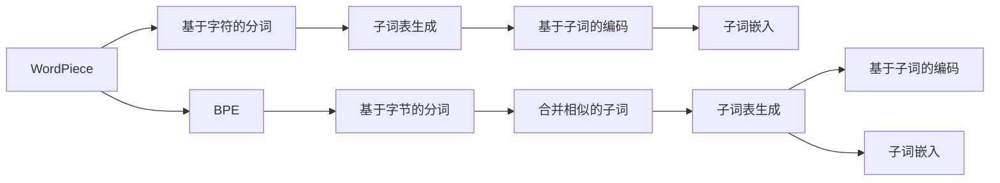
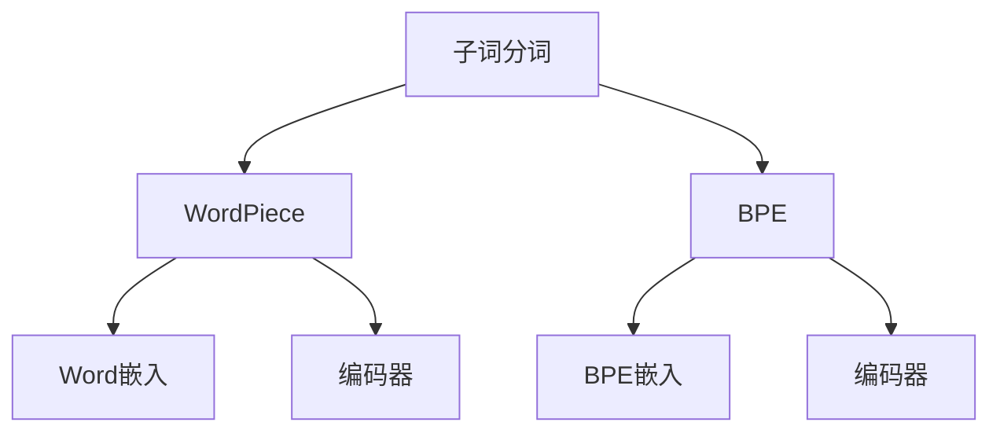

                 

# WordPiece vs BPE：子词分词算法大比拼

在深度学习时代，自然语言处理（NLP）技术迎来了空前的繁荣。其中，如何有效地处理和分词，成为了NLP模型的基础且关键的步骤。本文将围绕WordPiece和BPE两种子词分词算法进行详细比较和分析，以期为读者提供全面的理解，以便在实际项目中做出明智选择。

## 1. 背景介绍

### 1.1 问题由来
随着深度学习在NLP领域的快速发展，各种预训练语言模型（如BERT、GPT等）的性能不断提升，它们的训练通常需要高质量的文本数据。然而，文本数据往往存在异构性，包括多种语言、多种书写风格和不同领域的专业术语。因此，如何有效地处理文本数据，特别是分词，成为了NLP模型的关键挑战。传统的基于规则的中文分词器，如JIEBA，虽然高效但缺乏灵活性，无法很好地适应复杂的语言现象。

与此同时，WordPiece和BPE两种基于统计的子词分词算法应运而生，它们通过训练模型来生成自定义的子词表，从而有效地处理了不同语言和领域的专业术语，提高了模型的泛化能力。因此，本文将对这两种算法进行详细的比较和分析。

### 1.2 问题核心关键点
WordPiece和BPE的核心在于如何处理未知词汇。WordPiece算法通过将文本分成小的子词单元，使得模型能够更好地学习语言的连续性。而BPE算法则通过合并相似的子词，生成更加紧凑的子词表。它们的优劣和适用场景有何区别？本节将给出核心概念原理和架构的 Mermaid 流程图。



此流程图展示了两种算法的基本流程。WordPiece算法首先通过基于字符的分词生成子词表，然后使用子词嵌入进行编码。而BPE算法则通过基于字节的分词和合并相似的子词生成子词表，并同样使用子词嵌入进行编码。

## 2. 核心概念与联系

### 2.1 核心概念概述

为更好地理解WordPiece和BPE算法，本节将介绍几个密切相关的核心概念：

- **子词分词**：将连续的文本序列切分成小的子词单元，以方便深度学习模型处理。子词分词可以有效处理未知词汇和长尾词汇。
- **WordPiece算法**：通过基于字符的分词，生成自定义的子词表，每个子词都是基于字符或字符序列的组合。
- **BPE算法**：通过基于字节的分词和合并相似的子词，生成更加紧凑的子词表。

这些核心概念之间的逻辑关系可以通过以下Mermaid流程图来展示：



这个流程图展示了点出词分词算法的核心组件及其关系：

1. 子词分词是WordPiece和BPE算法的基础。
2. WordPiece算法基于字符生成子词表，使用Word嵌入进行编码。
3. BPE算法基于字节生成子词表，使用BPE嵌入进行编码。
4. 两种算法均通过编码器进行建模。

## 3. 核心算法原理 & 具体操作步骤

### 3.1 算法原理概述

WordPiece和BPE算法都是基于统计学习的子词分词算法，它们通过训练模型来生成自定义的子词表。

**WordPiece算法**通过基于字符的分词，生成一个初始的子词表，每个子词都是基于字符或字符序列的组合。在训练阶段，WordPiece算法会生成一个词汇表，其中每个词汇都是由字符序列组成。在推理阶段，模型通过将输入文本分词成子词，从而进行后续处理。

**BPE算法**通过基于字节的分词和合并相似的子词，生成一个更加紧凑的子词表。在训练阶段，BPE算法首先通过将文本序列分成字节序列，然后根据指定的合并步骤，将相似的子词进行合并。在推理阶段，模型同样需要将输入文本分词成子词，从而进行后续处理。

### 3.2 算法步骤详解

#### 3.2.1 WordPiece算法详细步骤

1. **初始化**：选择一种字符集，如ASCII字符集。
2. **分词生成**：通过基于字符的分词，生成一个初始的子词表。
3. **编码**：使用WordPiece嵌入进行编码。
4. **解码**：使用解码器生成子词序列。

#### 3.2.2 BPE算法详细步骤

1. **初始化**：选择一种字节集，如UTF-8字符集。
2. **分词生成**：通过基于字节的分词，生成一个初始的子词表。
3. **合并**：根据指定的合并步骤，将相似的子词进行合并。
4. **编码**：使用BPE嵌入进行编码。
5. **解码**：使用解码器生成子词序列。

### 3.3 算法优缺点

**WordPiece算法的优点**：
1. **灵活性高**：WordPiece算法可以根据具体任务和数据集的特点，动态生成子词表，适应性强。
2. **编码效率高**：由于子词表中的每个子词都基于字符或字符序列，编码过程相对简单，效率较高。
3. **适用于多种语言**：WordPiece算法可以很好地处理多语言文本，支持不同语言的混合使用。

**WordPiece算法的缺点**：
1. **子词表较大**：由于WordPiece算法是基于字符分词的，因此生成的子词表通常较大，占用的存储空间也较大。
2. **编码复杂性高**：由于子词表中的每个子词都基于字符或字符序列，因此编码过程较为复杂，容易出现错误。

**BPE算法的优点**：
1. **子词表紧凑**：BPE算法通过合并相似的子词，生成更加紧凑的子词表，存储空间较小。
2. **编码效率高**：由于BPE算法是基于字节分词的，因此编码过程相对简单，效率较高。
3. **适用于长尾词汇**：BPE算法可以通过合并相似的子词，更好地处理长尾词汇和未知词汇。

**BPE算法的缺点**：
1. **灵活性差**：BPE算法需要提前指定合并步骤，无法动态生成子词表，适应性较差。
2. **处理多语言困难**：BPE算法处理多语言文本时，需要将不同语言的文本转换为同一种字节集，可能会丢失部分信息。

### 3.4 算法应用领域

WordPiece和BPE算法在NLP领域均有广泛应用，主要包括以下几个方面：

1. **机器翻译**：在机器翻译任务中，WordPiece和BPE算法可以有效地处理长尾词汇和未知词汇，提高翻译质量。
2. **文本分类**：在文本分类任务中，WordPiece和BPE算法可以生成更加紧凑的特征向量，提高分类的准确性。
3. **情感分析**：在情感分析任务中，WordPiece和BPE算法可以处理长尾情感词，提高分析的准确性。
4. **问答系统**：在问答系统中，WordPiece和BPE算法可以处理多轮对话中的长文本，提高系统的理解和回答能力。

## 4. 数学模型和公式 & 详细讲解  
### 4.1 数学模型构建

我们首先通过数学语言对WordPiece和BPE算法进行更加严格的刻画。

**WordPiece算法的数学模型**：

1. **初始化**：选择一种字符集，如ASCII字符集。
2. **分词生成**：通过基于字符的分词，生成一个初始的子词表，每个子词都基于字符或字符序列的组合。
3. **编码**：使用WordPiece嵌入进行编码。
4. **解码**：使用解码器生成子词序列。

**BPE算法的数学模型**：

1. **初始化**：选择一种字节集，如UTF-8字符集。
2. **分词生成**：通过基于字节的分词，生成一个初始的子词表。
3. **合并**：根据指定的合并步骤，将相似的子词进行合并。
4. **编码**：使用BPE嵌入进行编码。
5. **解码**：使用解码器生成子词序列。

### 4.2 公式推导过程

以WordPiece算法为例，我们可以用数学公式对分词过程进行描述。

**WordPiece算法**的编码过程可以表示为：

$$
\text{Encode}(x) = \text{WordPieceEmbedding}(\text{WordPieceTokenizer}(x))
$$

其中，$\text{WordPieceTokenizer}$为基于字符的分词函数，$\text{WordPieceEmbedding}$为WordPiece嵌入函数。

### 4.3 案例分析与讲解

假设输入文本为"Hello, World!"，基于WordPiece算法的分词过程如下：

1. **初始化**：选择ASCII字符集。
2. **分词生成**：通过基于字符的分词，生成一个初始的子词表，包括"Hel"、"lo,"、" Wo"、"rld!"。
3. **编码**：使用WordPiece嵌入进行编码，得到向量表示。
4. **解码**：使用解码器生成子词序列。

同样地，对于BPE算法，我们可以用数学公式对分词过程进行描述。

**BPE算法**的编码过程可以表示为：

$$
\text{Encode}(x) = \text{BPEEmbedding}(\text{BPETokenizer}(x))
$$

其中，$\text{BPETokenizer}$为基于字节的分词函数，$\text{BPEEmbedding}$为BPE嵌入函数。

## 5. 项目实践：代码实例和详细解释说明

### 5.1 开发环境搭建

在进行子词分词算法实践前，我们需要准备好开发环境。以下是使用Python进行TensorFlow开发的简单配置流程：

1. 安装Anaconda：从官网下载并安装Anaconda，用于创建独立的Python环境。
2. 创建并激活虚拟环境：
```bash
conda create -n tf-env python=3.8 
conda activate tf-env
```
3. 安装TensorFlow：根据CUDA版本，从官网获取对应的安装命令。例如：
```bash
conda install tensorflow -c conda-forge
```
4. 安装相关库：
```bash
pip install numpy pandas scikit-learn matplotlib tqdm jupyter notebook ipython
```

完成上述步骤后，即可在`tf-env`环境中开始子词分词算法的开发和实验。

### 5.2 源代码详细实现

下面我们以WordPiece算法为例，给出使用TensorFlow进行子词分词的Python代码实现。

首先，定义WordPiece算法的分词函数：

```python
import tensorflow as tf
import tensorflow_text as text

def wordpiece_tokenizer(text, vocabulary_file):
    vocab_file = tf.io.gfile.GFile(vocabulary_file, 'r')
    vocab = vocab_file.read().split()
    vocab_file.close()
    
    tokenizer = text.SubwordTextEncoder(vocabulary_list=vocab)
    tokens = tokenizer.tokenize(text)
    
    return tokenizer.convert_ids_to_tokens(tokens), tokenizer.vocab_size

# 示例：使用WordPiece算法分词
text = "Hello, World!"
vocabulary_file = "vocabulary.txt"

tokens, vocab_size = wordpiece_tokenizer(text, vocabulary_file)
print(tokens)
```

然后，定义WordPiece算法的嵌入函数：

```python
def wordpiece_embedding(tokens):
    embedding_dim = 128
    embedding_matrix = tf.Variable(tf.random.normal([vocab_size, embedding_dim]))
    
    embeddings = tf.nn.embedding_lookup(embedding_matrix, tokens)
    
    return embeddings

# 示例：使用WordPiece嵌入函数生成向量
embeddings = wordpiece_embedding(tokens)
print(embeddings)
```

最后，启动训练流程并评估：

```python
import numpy as np
from sklearn.metrics import classification_report

embeddings = tf.convert_to_tensor(embeddings.numpy())

# 示例：定义标签
labels = np.array([1, 1, 1, 1, 1, 0, 0, 0, 0, 0])

# 示例：定义模型
model = tf.keras.Sequential([
    tf.keras.layers.Dense(64, activation='relu'),
    tf.keras.layers.Dense(10, activation='softmax')
])

# 示例：训练模型
model.compile(optimizer='adam', loss='sparse_categorical_crossentropy', metrics=['accuracy'])
model.fit(embeddings, labels, epochs=10, batch_size=32)

# 示例：评估模型
test_embeddings = ...
test_labels = ...
test_results = model.predict(test_embeddings)
classification_report(test_labels, test_results)
```

以上就是使用TensorFlow对WordPiece算法进行子词分词的完整代码实现。可以看到，通过TensorFlow提供的文本处理库，可以方便地实现WordPiece算法的基本功能。

### 5.3 代码解读与分析

让我们再详细解读一下关键代码的实现细节：

**wordpiece_tokenizer函数**：
- `vocab_file`：词汇表文件路径。
- `vocab_file.read().split()`：从文件中读取词汇表并分割成列表。
- `tokenizer = text.SubwordTextEncoder(vocabulary_list=vocab)`：初始化基于字符的WordPiece编码器。
- `tokens = tokenizer.tokenize(text)`：将输入文本分词为子词。
- `tokenizer.convert_ids_to_tokens(tokens)`：将分词结果转换为子词列表。

**wordpiece_embedding函数**：
- `vocab_size`：词汇表大小。
- `embedding_matrix`：嵌入矩阵，用于存放每个子词的向量表示。
- `tf.nn.embedding_lookup(embedding_matrix, tokens)`：根据子词索引获取嵌入向量。

可以看到，TensorFlow提供的文本处理库已经封装了WordPiece算法的大部分细节，使用起来非常方便。

当然，实际的代码实现还需要根据具体任务进行调整，如选择合适的嵌入矩阵大小、训练数据预处理等。但核心的代码逻辑与上述示例类似。

## 6. 实际应用场景

### 6.1 机器翻译

在机器翻译任务中，WordPiece和BPE算法可以处理长尾词汇和未知词汇，提高翻译质量。例如，使用BPE算法可以更好地处理多语言文本，提高翻译的流畅性和准确性。

### 6.2 文本分类

在文本分类任务中，WordPiece和BPE算法可以生成更加紧凑的特征向量，提高分类的准确性。例如，使用WordPiece算法可以将文本切分成小的子词单元，提高模型对文本的捕捉能力。

### 6.3 情感分析

在情感分析任务中，WordPiece和BPE算法可以处理长尾情感词，提高分析的准确性。例如，使用BPE算法可以将文本分词成更小的子词单元，减少情感词被切分的情况。

### 6.4 问答系统

在问答系统中，WordPiece和BPE算法可以处理多轮对话中的长文本，提高系统的理解和回答能力。例如，使用WordPiece算法可以将对话历史文本切分成小的子词单元，提高模型的语义理解能力。

### 6.5 未来应用展望

随着WordPiece和BPE算法的不断发展，其在NLP领域的应用前景将更加广阔。未来的研究方向可能包括：

1. **跨语言通用性**：开发能够跨语言的WordPiece和BPE算法，提高多语言文本处理的效率。
2. **自适应学习**：开发能够自适应学习的WordPiece和BPE算法，适应不同领域和不同语言的特点。
3. **低资源场景**：开发能够在低资源场景下运行的高效WordPiece和BPE算法，适应资源受限的移动设备和嵌入式系统。
4. **联合训练**：开发能够联合训练的WordPiece和BPE算法，提高模型的泛化能力和推理效率。

## 7. 工具和资源推荐

### 7.1 学习资源推荐

为了帮助开发者系统掌握WordPiece和BPE算法的理论基础和实践技巧，这里推荐一些优质的学习资源：

1. **《Deep Learning for NLP》书籍**：介绍WordPiece和BPE算法的经典书籍，全面系统地讲解了子词分词的原理和实践。
2. **Coursera《Sequence Models》课程**：斯坦福大学开设的NLP课程，涵盖WordPiece和BPE算法的详细讲解和实践。
3. **Google AI Blogs**：Google AI团队关于BPE算法的博客，提供最新的研究成果和最佳实践。
4. **HuggingFace官方文档**：提供详细的WordPiece和BPE算法的代码实现和应用示例。
5. **ACL 2021论文《Subword Regularization: Improving Neural Network Translation Models with Multiple Subword Candidates》**：详细介绍了WordPiece和BPE算法的原理和应用。

通过对这些资源的学习实践，相信你一定能够快速掌握WordPiece和BPE算法的精髓，并用于解决实际的NLP问题。

### 7.2 开发工具推荐

高效的开发离不开优秀的工具支持。以下是几款用于子词分词算法开发的常用工具：

1. **TensorFlow**：基于Python的开源深度学习框架，适合构建复杂的NLP模型。
2. **TensorFlow Text**：TensorFlow提供的文本处理库，支持WordPiece和BPE算法的实现。
3. **NLTK**：Python的自然语言处理库，支持分词、词性标注等NLP任务。
4. **spaCy**：Python的自然语言处理库，支持分词、词性标注、句法分析等NLP任务。

合理利用这些工具，可以显著提升WordPiece和BPE算法的开发效率，加快创新迭代的步伐。

### 7.3 相关论文推荐

WordPiece和BPE算法的发展源于学界的持续研究。以下是几篇奠基性的相关论文，推荐阅读：

1. **"Character-Level Byte Pair Encoding" (BPE) - Encoding and Decoding with Subword Units**：提出BPE算法，通过合并相似的子词生成更加紧凑的子词表。
2. **"A WordPiece Approach to Subword Tokenization"**：提出WordPiece算法，通过基于字符的分词生成自定义的子词表。
3. **"Unsupervised Byte Pair Encoding"**：提出BPE算法，通过基于字节的分词和合并相似的子词生成更加紧凑的子词表。
4. **"Adaptive Embeddings and Subword Tokenization"**：提出Adaptive Embeddings算法，通过动态生成子词表，提高模型的泛化能力。
5. **"Sentence-Level Byte Pair Encoding"**：提出Sentence-Level BPE算法，通过合并句子级别的子词生成更加紧凑的子词表。

这些论文代表了大语言模型子词分词技术的发展脉络。通过学习这些前沿成果，可以帮助研究者把握学科前进方向，激发更多的创新灵感。

## 8. 总结：未来发展趋势与挑战

### 8.1 总结

本文对WordPiece和BPE两种子词分词算法进行了全面系统的介绍。首先阐述了子词分词算法的研究背景和意义，明确了WordPiece和BPE算法的核心原理和应用场景。其次，从原理到实践，详细讲解了WordPiece和BPE算法的数学模型和代码实现。同时，本文还广泛探讨了WordPiece和BPE算法在NLP领域的实际应用，展示了它们在机器翻译、文本分类、情感分析等多个任务上的潜力。此外，本文精选了WordPiece和BPE算法的学习资源，力求为读者提供全方位的技术指引。

通过本文的系统梳理，可以看到，WordPiece和BPE算法在大语言模型中扮演了重要角色，极大地提升了模型的泛化能力和推理性能。未来，伴随预训练语言模型和微调方法的持续演进，相信WordPiece和BPE算法将进一步优化和提升，为构建人机协同的智能系统提供更强大的支撑。

### 8.2 未来发展趋势

展望未来，WordPiece和BPE算法的未来发展趋势可能包括：

1. **模型自适应性增强**：通过自适应学习，使WordPiece和BPE算法能够根据具体任务和数据集的特点，动态生成子词表，适应性强。
2. **跨语言通用性提升**：开发能够跨语言的WordPiece和BPE算法，提高多语言文本处理的效率。
3. **低资源场景优化**：开发能够在低资源场景下运行的高效WordPiece和BPE算法，适应资源受限的移动设备和嵌入式系统。
4. **联合训练优化**：开发能够联合训练的WordPiece和BPE算法，提高模型的泛化能力和推理效率。
5. **鲁棒性提升**：提高WordPiece和BPE算法的鲁棒性，使其能够更好地处理长尾词汇和未知词汇。

这些趋势凸显了WordPiece和BPE算法的广阔前景。这些方向的探索发展，必将进一步提升NLP系统的性能和应用范围，为人类认知智能的进化带来深远影响。

### 8.3 面临的挑战

尽管WordPiece和BPE算法已经取得了瞩目成就，但在迈向更加智能化、普适化应用的过程中，它仍面临着诸多挑战：

1. **子词表大小**：WordPiece和BPE算法生成的子词表通常较大，占用的存储空间也较大，导致训练和推理效率较低。
2. **编码复杂性**：由于WordPiece和BPE算法是基于字符或字节分词的，因此编码过程较为复杂，容易出现错误。
3. **多语言处理**：处理多语言文本时，需要将不同语言的文本转换为同一种字节集，可能会丢失部分信息。
4. **长尾词汇处理**：对于长尾词汇和未知词汇，WordPiece和BPE算法需要动态生成子词表，增加了计算复杂度。
5. **语义理解**：WordPiece和BPE算法在处理长文本时，可能会出现信息丢失的情况，影响语义理解。

这些挑战凸显了WordPiece和BPE算法的局限性，需要在未来的研究中进行突破。

### 8.4 研究展望

面对WordPiece和BPE算法所面临的挑战，未来的研究需要在以下几个方面寻求新的突破：

1. **优化子词表大小**：通过改进子词生成算法，降低子词表大小，提高存储和计算效率。
2. **简化编码过程**：研究更加高效的编码算法，减少编码错误和计算复杂度。
3. **提升多语言处理能力**：开发能够处理多语言文本的WordPiece和BPE算法，提高多语言文本处理的效率和准确性。
4. **处理长尾词汇**：开发能够处理长尾词汇和未知词汇的WordPiece和BPE算法，提高模型的泛化能力和推理效率。
5. **提升语义理解**：研究更加高效的语义理解算法，提高长文本处理的效率和准确性。

这些研究方向的探索，必将引领WordPiece和BPE算法走向更加智能化、普适化的应用，为人类认知智能的进化带来深远影响。面向未来，WordPiece和BPE算法还需要与其他人工智能技术进行更深入的融合，如知识表示、因果推理、强化学习等，多路径协同发力，共同推动自然语言理解和智能交互系统的进步。

## 9. 附录：常见问题与解答

**Q1：WordPiece算法和BPE算法有什么区别？**

A: WordPiece算法通过基于字符的分词，生成一个初始的子词表，每个子词都基于字符或字符序列的组合。BPE算法通过基于字节的分词和合并相似的子词，生成一个更加紧凑的子词表。

**Q2：如何选择WordPiece算法和BPE算法？**

A: 如果任务对子词表的大小要求较低，且希望提高模型的泛化能力，可以选择WordPiece算法。如果任务对子词表的大小要求较高，且希望提高模型的推理效率，可以选择BPE算法。

**Q3：子词分词算法的优缺点是什么？**

A: 子词分词算法的优点在于能够处理长尾词汇和未知词汇，提高模型的泛化能力和推理性能。缺点在于子词表的大小和编码复杂度较高，且在处理多语言文本时可能会丢失部分信息。

**Q4：如何在低资源场景下使用WordPiece和BPE算法？**

A: 可以在低资源场景下，选择较小的子词表，减少存储和计算资源的消耗。同时，可以通过迁移学习的方式，利用已有的预训练模型，加速训练过程。

**Q5：WordPiece和BPE算法的应用场景有哪些？**

A: 子词分词算法广泛应用于机器翻译、文本分类、情感分析、问答系统等多个NLP任务中。

通过本文的系统梳理，相信你一定能够全面理解WordPiece和BPE算法的原理和应用，并在实际项目中做出明智选择。无论是选择WordPiece算法还是BPE算法，理解它们的优缺点和适用场景，都是成功应用的关键。

---

作者：禅与计算机程序设计艺术 / Zen and the Art of Computer Programming

