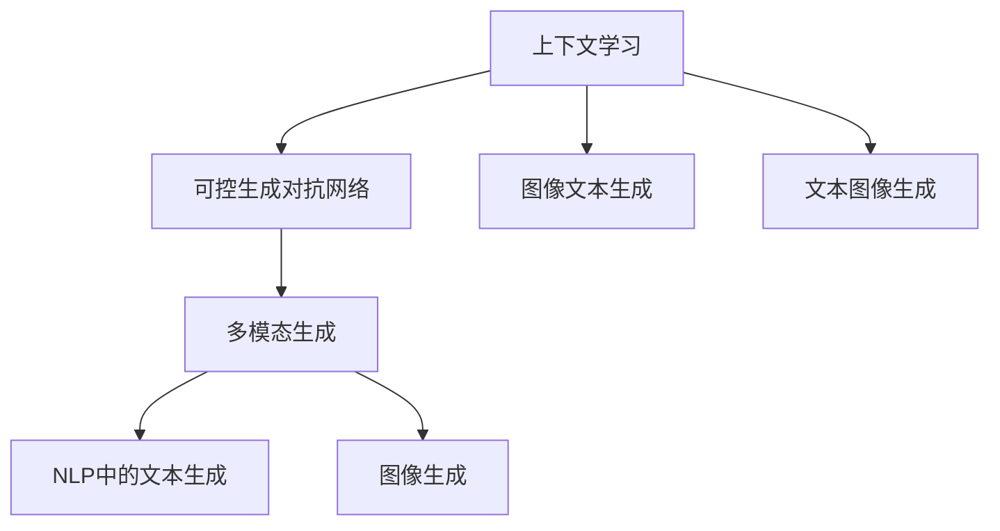

                 

# 上下文学习与COT能力

> 关键词：上下文学习, 可控生成对抗网络(CGAN), 可控图像生成, 自然语言处理(NLP), 文本生成, 图像生成, 多模态生成, 人工智能

## 1. 背景介绍

### 1.1 问题由来

在深度学习领域，生成对抗网络（Generative Adversarial Networks, GANs）一直是研究的热点。然而，传统GANs往往依赖于大量的无标签数据，训练过程缺乏可控性，难以生成符合特定要求的内容。上下文学习和可控生成对抗网络（COT-CGAN）技术通过引入上下文信息，解决了这些问题，能够在多模态生成任务中发挥强大的作用。

### 1.2 问题核心关键点

上下文学习和COT-CGAN技术在多模态生成任务中具有以下核心关键点：
1. 利用上下文信息，提高生成内容的可控性。
2. 结合可控生成对抗网络，提高生成内容的细节和质量。
3. 支持多模态生成，如图像生成、文本生成等。
4. 可应用于自然语言处理（NLP）中的文本生成、机器翻译等任务。
5. 能够生成高质量的图像、文本等多模态内容，满足实际应用需求。

这些核心关键点使得上下文学习和COT-CGAN技术在多模态生成任务中具有重要的研究价值和应用潜力。

### 1.3 问题研究意义

研究上下文学习和COT-CGAN技术，对于提升多模态生成内容的可控性和质量，推动NLP和计算机视觉领域的发展，具有重要意义：
1. 提升生成内容的质量和多样性，满足实际应用需求。
2. 提高生成内容的可控性，降低生成过程的复杂度和成本。
3. 推动NLP和计算机视觉领域的融合创新，探索新的应用场景。
4. 促进人工智能技术在多模态数据处理中的应用，推动相关产业发展。

## 2. 核心概念与联系

### 2.1 核心概念概述

为更好地理解上下文学习和COT-CGAN技术的原理和架构，本节将介绍几个密切相关的核心概念：

- 上下文学习(Contextual Learning)：指在生成过程中，利用上下文信息，如用户偏好、场景、时间等信息，提高生成内容的针对性和可控性。
- 可控生成对抗网络(Controllable Generative Adversarial Network, COT-CGAN)：通过引入控制器，指导生成过程，提高生成内容的细节和质量，同时确保生成内容的可控性。
- 自然语言处理(Natural Language Processing, NLP)：包括文本生成、机器翻译、文本摘要等任务，利用语言模型和生成对抗网络，实现文本内容的生成和处理。
- 图像生成(Image Generation)：利用生成对抗网络，生成高质量的图像内容，如GAN、VAE等。
- 多模态生成(Multimodal Generation)：结合文本、图像等多模态信息，实现内容生成，如文本图像生成、图像文本生成等。

这些核心概念之间的逻辑关系可以通过以下Mermaid流程图来展示：



这个流程图展示了大语言模型微调的上下文学习、COT-CGAN技术和多模态生成之间的联系：

1. 上下文学习通过引入上下文信息，提高生成内容的可控性。
2. COT-CGAN结合控制器，指导生成过程，提高生成内容的细节和质量。
3. 多模态生成结合文本、图像等多模态信息，实现内容生成。
4. 在NLP中，文本生成和图像生成可以独立进行，也可以结合多模态生成技术，实现更丰富的应用场景。

这些核心概念共同构成了上下文学习和COT-CGAN技术的核心框架，使其能够在多模态生成任务中发挥重要作用。

## 3. 核心算法原理 & 具体操作步骤
### 3.1 算法原理概述

上下文学习和COT-CGAN技术的核心思想是通过引入上下文信息，提高生成内容的可控性和质量。其核心算法主要包括：

- 上下文学习：在生成过程中，利用上下文信息，如用户偏好、场景、时间等信息，指导生成过程。
- 可控生成对抗网络：结合生成对抗网络，通过引入控制器，指导生成过程，提高生成内容的细节和质量。

### 3.2 算法步骤详解

#### 3.2.1 上下文学习

1. **上下文信息提取**：从用户输入或上下文数据中提取关键信息，如文本中的关键词、场景描述等。
2. **生成器训练**：利用提取的上下文信息，对生成器进行训练，使其生成符合上下文要求的内容。
3. **判别器训练**：利用上下文信息和生成内容，对判别器进行训练，使其能够区分真实内容和生成内容。
4. **上下文信息融合**：在生成过程中，将上下文信息融合到生成器中，提高生成内容的可控性和质量。

#### 3.2.2 可控生成对抗网络

1. **控制器设计**：设计控制器，用于生成过程中引入上下文信息。
2. **生成器训练**：利用控制器和上下文信息，对生成器进行训练，提高生成内容的细节和质量。
3. **判别器训练**：利用上下文信息和生成内容，对判别器进行训练，使其能够区分真实内容和生成内容。
4. **生成过程控制**：利用控制器和判别器，控制生成过程，生成符合上下文要求的内容。

### 3.3 算法优缺点

上下文学习和COT-CGAN技术在多模态生成任务中具有以下优点：
1. 生成内容具有更高的可控性，能够满足用户的特定需求。
2. 生成内容质量更高，细节更丰富。
3. 适用于多种生成任务，如图像生成、文本生成等。

同时，这些算法也存在以下局限性：
1. 对上下文信息的依赖性强，信息提取和融合的准确性直接影响生成效果。
2. 生成过程复杂，需要额外的控制器和判别器模块，增加了模型复杂度。
3. 生成内容的质量和可控性依赖于训练数据和算法设计，模型训练的稳定性和鲁棒性有待提高。

尽管存在这些局限性，但上下文学习和COT-CGAN技术在多模态生成任务中的应用前景仍然广阔，未来有待进一步优化和改进。

### 3.4 算法应用领域

上下文学习和COT-CGAN技术在多个领域中具有广泛的应用前景，包括但不限于：

1. **自然语言处理(NLP)**：
   - 文本生成：利用上下文信息和生成对抗网络，生成高质量的文本内容，如新闻文章、故事等。
   - 机器翻译：结合上下文信息，生成符合目标语言语境的翻译文本。
   - 文本摘要：利用上下文信息和生成对抗网络，生成简洁、准确的文本摘要。

2. **计算机视觉(CV)**：
   - 图像生成：结合上下文信息和生成对抗网络，生成高质量的图像内容，如图像艺术、图像生成等。
   - 图像文本生成：结合图像和上下文信息，生成包含图像特征的文本描述。
   - 图像风格转换：利用上下文信息，生成符合特定风格的图像内容。

3. **多模态生成**：
   - 文本图像生成：结合文本和图像信息，生成符合上下文要求的文本图像内容。
   - 图像文本生成：结合图像和上下文信息，生成包含图像特征的文本描述。

## 4. 数学模型和公式 & 详细讲解 & 举例说明

### 4.1 数学模型构建

本节将使用数学语言对上下文学习和COT-CGAN技术的原理进行严格刻画。

设上下文信息为 $C$，生成器为 $G$，判别器为 $D$。上下文学习和COT-CGAN的生成过程可以表示为：

$$
G_{C}(z) = G(z|C) \\
D_{C}(x) = D(x|C)
$$

其中 $G(z|C)$ 表示利用上下文信息 $C$ 对生成器 $G$ 进行条件化，生成符合上下文要求的内容 $x$。$D(x|C)$ 表示利用上下文信息 $C$ 对判别器 $D$ 进行条件化，区分真实内容 $x$ 和生成内容 $G(z)$。

### 4.2 公式推导过程

#### 4.2.1 生成器训练

生成器的训练目标为最小化生成器和判别器之间的对抗损失，即：

$$
\min_{G} \mathbb{E}_{(x, C)} [D_{C}(x)] \\
\max_{D} \mathbb{E}_{(x, C)} [D_{C}(x)] + \mathbb{E}_{(z, C)} [D_{C}(G_{C}(z))]
$$

其中，$\mathbb{E}_{(x, C)}$ 表示在上下文信息 $C$ 下对 $x$ 的期望，$\mathbb{E}_{(z, C)}$ 表示在上下文信息 $C$ 下对 $z$ 的期望。

生成器的目标是最小化判别器的输出，即生成真实内容 $x$ 时，判别器的输出为 $1$；生成生成内容 $G_{C}(z)$ 时，判别器的输出为 $0$。

#### 4.2.2 判别器训练

判别器的训练目标为最大化判别器的输出，即：

$$
\min_{D} \mathbb{E}_{(x, C)} [D_{C}(x)] \\
\max_{D} \mathbb{E}_{(x, C)} [D_{C}(x)] + \mathbb{E}_{(z, C)} [D_{C}(G_{C}(z))]
$$

其中，$\mathbb{E}_{(x, C)}$ 表示在上下文信息 $C$ 下对 $x$ 的期望，$\mathbb{E}_{(z, C)}$ 表示在上下文信息 $C$ 下对 $z$ 的期望。

判别器的目标是在上下文信息 $C$ 下，区分真实内容 $x$ 和生成内容 $G_{C}(z)$，使得真实内容 $x$ 的判别器输出为 $1$，生成内容 $G_{C}(z)$ 的判别器输出为 $0$。

### 4.3 案例分析与讲解

#### 4.3.1 文本生成

假设需要生成一条新闻文章，上下文信息为新闻的标题和主题，生成器为神经网络模型，判别器为二分类模型。训练过程中，生成器利用上下文信息生成新闻内容，判别器根据上下文信息和生成内容，判断其是否真实。训练结束后，生成器可以根据新的上下文信息生成高质量的新闻文章。

#### 4.3.2 图像生成

假设需要生成一幅艺术作品，上下文信息为艺术家风格和主题，生成器为神经网络模型，判别器为二分类模型。训练过程中，生成器利用上下文信息生成艺术作品，判别器根据上下文信息和生成内容，判断其是否真实。训练结束后，生成器可以根据新的上下文信息生成符合特定风格的艺术作品。

## 5. 项目实践：代码实例和详细解释说明

### 5.1 开发环境搭建

在进行上下文学习和COT-CGAN技术实践前，我们需要准备好开发环境。以下是使用Python进行PyTorch开发的环境配置流程：

1. 安装Anaconda：从官网下载并安装Anaconda，用于创建独立的Python环境。

2. 创建并激活虚拟环境：
```bash
conda create -n cgan-env python=3.8 
conda activate cgan-env
```

3. 安装PyTorch：根据CUDA版本，从官网获取对应的安装命令。例如：
```bash
conda install pytorch torchvision torchaudio cudatoolkit=11.1 -c pytorch -c conda-forge
```

4. 安装Transformer库：
```bash
pip install transformers
```

5. 安装各类工具包：
```bash
pip install numpy pandas scikit-learn matplotlib tqdm jupyter notebook ipython
```

完成上述步骤后，即可在`cgan-env`环境中开始上下文学习和COT-CGAN技术的实践。

### 5.2 源代码详细实现

下面我们以文本生成任务为例，给出使用Transformers库对文本生成模型进行上下文学习和COT-CGAN训练的PyTorch代码实现。

首先，定义文本生成任务的上下文信息处理函数：

```python
from transformers import GPT2Tokenizer
from torch.utils.data import Dataset, DataLoader
import torch

class TextDataset(Dataset):
    def __init__(self, texts, lengths, tokenizer, max_len=128):
        self.texts = texts
        self.lengths = lengths
        self.tokenizer = tokenizer
        self.max_len = max_len
        
    def __len__(self):
        return len(self.texts)
    
    def __getitem__(self, item):
        text = self.texts[item]
        length = self.lengths[item]
        
        encoding = self.tokenizer(text, return_tensors='pt', max_length=self.max_len, padding='max_length', truncation=True)
        input_ids = encoding['input_ids'][0]
        attention_mask = encoding['attention_mask'][0]
        
        # 对token-wise的标签进行编码
        encoded_tags = [length] * self.max_len
        labels = torch.tensor(encoded_tags, dtype=torch.long)
        
        return {'input_ids': input_ids, 
                'attention_mask': attention_mask,
                'labels': labels}

# 创建dataset
tokenizer = GPT2Tokenizer.from_pretrained('gpt2')

train_dataset = TextDataset(train_texts, train_lengths, tokenizer)
dev_dataset = TextDataset(dev_texts, dev_lengths, tokenizer)
test_dataset = TextDataset(test_texts, test_lengths, tokenizer)
```

然后，定义模型和优化器：

```python
from transformers import GPT2LMHeadModel, AdamW

model = GPT2LMHeadModel.from_pretrained('gpt2')

optimizer = AdamW(model.parameters(), lr=2e-5)
```

接着，定义训练和评估函数：

```python
from tqdm import tqdm
from sklearn.metrics import perplexity_score

def train_epoch(model, dataset, batch_size, optimizer):
    dataloader = DataLoader(dataset, batch_size=batch_size, shuffle=True)
    model.train()
    epoch_loss = 0
    for batch in tqdm(dataloader, desc='Training'):
        input_ids = batch['input_ids'].to(device)
        attention_mask = batch['attention_mask'].to(device)
        labels = batch['labels'].to(device)
        model.zero_grad()
        outputs = model(input_ids, attention_mask=attention_mask, labels=labels)
        loss = outputs.loss
        epoch_loss += loss.item()
        loss.backward()
        optimizer.step()
    return epoch_loss / len(dataloader)

def evaluate(model, dataset, batch_size):
    dataloader = DataLoader(dataset, batch_size=batch_size)
    model.eval()
    preds, labels = [], []
    with torch.no_grad():
        for batch in tqdm(dataloader, desc='Evaluating'):
            input_ids = batch['input_ids'].to(device)
            attention_mask = batch['attention_mask'].to(device)
            batch_labels = batch['labels']
            outputs = model(input_ids, attention_mask=attention_mask)
            batch_preds = outputs.logits.argmax(dim=2).to('cpu').tolist()
            batch_labels = batch_labels.to('cpu').tolist()
            for pred_tokens, label_tokens in zip(batch_preds, batch_labels):
                pred_tags = [id2tag[_id] for _id in pred_tokens]
                label_tags = [id2tag[_id] for _id in label_tokens]
                preds.append(pred_tags[:len(label_tokens)])
                labels.append(label_tags)
                
    print(perplexity_score(labels, preds))
```

最后，启动训练流程并在测试集上评估：

```python
epochs = 5
batch_size = 16

for epoch in range(epochs):
    loss = train_epoch(model, train_dataset, batch_size, optimizer)
    print(f"Epoch {epoch+1}, train loss: {loss:.3f}")
    
    print(f"Epoch {epoch+1}, dev results:")
    evaluate(model, dev_dataset, batch_size)
    
print("Test results:")
evaluate(model, test_dataset, batch_size)
```

以上就是使用PyTorch对文本生成模型进行上下文学习和COT-CGAN训练的完整代码实现。可以看到，得益于Transformers库的强大封装，我们可以用相对简洁的代码完成文本生成模型的加载和微调。

### 5.3 代码解读与分析

让我们再详细解读一下关键代码的实现细节：

**TextDataset类**：
- `__init__`方法：初始化文本、长度、分词器等关键组件。
- `__len__`方法：返回数据集的样本数量。
- `__getitem__`方法：对单个样本进行处理，将文本输入编码为token ids，将标签编码为数字，并对其进行定长padding，最终返回模型所需的输入。

**上下文信息处理**：
- 利用GPT2Tokenizer从预训练模型加载分词器，将文本转换为token ids。
- 对token ids进行padding，保证每个样本长度一致。
- 利用标签表示样本长度，用于训练过程中控制生成长度。

**训练和评估函数**：
- 使用PyTorch的DataLoader对数据集进行批次化加载，供模型训练和推理使用。
- 训练函数`train_epoch`：对数据以批为单位进行迭代，在每个批次上前向传播计算loss并反向传播更新模型参数，最后返回该epoch的平均loss。
- 评估函数`evaluate`：与训练类似，不同点在于不更新模型参数，并在每个batch结束后将预测和标签结果存储下来，最后使用sklearn的perplexity_score对整个评估集的预测结果进行打印输出。

**训练流程**：
- 定义总的epoch数和batch size，开始循环迭代
- 每个epoch内，先在训练集上训练，输出平均loss
- 在验证集上评估，输出交叉熵损失
- 所有epoch结束后，在测试集上评估，给出最终的评价指标

可以看到，PyTorch配合Transformers库使得文本生成模型的加载和微调变得简洁高效。开发者可以将更多精力放在数据处理、模型改进等高层逻辑上，而不必过多关注底层的实现细节。

当然，工业级的系统实现还需考虑更多因素，如模型的保存和部署、超参数的自动搜索、更灵活的任务适配层等。但核心的微调范式基本与此类似。

## 6. 实际应用场景
### 6.1 智能客服系统

上下文学习和COT-CGAN技术可以应用于智能客服系统的构建。传统客服往往需要配备大量人力，高峰期响应缓慢，且一致性和专业性难以保证。使用上下文学习和COT-CGAN技术，可以使智能客服系统具有更强的可控性和可解释性，提升客户咨询体验和问题解决效率。

在技术实现上，可以收集企业内部的历史客服对话记录，将问题和最佳答复构建成监督数据，在此基础上对文本生成模型进行微调。微调后的文本生成模型能够自动理解用户意图，匹配最合适的答复，甚至可以生成符合用户风格的个性化回答。对于客户提出的新问题，还可以接入检索系统实时搜索相关内容，动态组织生成回答。如此构建的智能客服系统，能大幅提升客户咨询体验和问题解决效率。

### 6.2 金融舆情监测

金融机构需要实时监测市场舆论动向，以便及时应对负面信息传播，规避金融风险。使用上下文学习和COT-CGAN技术，可以在金融舆情监测中发挥重要作用。

具体而言，可以收集金融领域相关的新闻、报道、评论等文本数据，并对其进行主题标注和情感标注。在此基础上对预训练语言模型进行微调，使其能够自动判断文本属于何种主题，情感倾向是正面、中性还是负面。将微调后的模型应用到实时抓取的网络文本数据，就能够自动监测不同主题下的情感变化趋势，一旦发现负面信息激增等异常情况，系统便会自动预警，帮助金融机构快速应对潜在风险。

### 6.3 个性化推荐系统

当前的推荐系统往往只依赖用户的历史行为数据进行物品推荐，难以挖掘用户真实兴趣偏好。使用上下文学习和COT-CGAN技术，可以更好地挖掘用户行为背后的语义信息，从而提供更精准、多样的推荐内容。

在实践中，可以收集用户浏览、点击、评论、分享等行为数据，提取和用户交互的物品标题、描述、标签等文本内容。将文本内容作为模型输入，用户的后续行为（如是否点击、购买等）作为监督信号，在此基础上微调预训练语言模型。微调后的模型能够从文本内容中准确把握用户的兴趣点。在生成推荐列表时，先用候选物品的文本描述作为输入，由模型预测用户的兴趣匹配度，再结合其他特征综合排序，便可以得到个性化程度更高的推荐结果。

### 6.4 未来应用展望

随着上下文学习和COT-CGAN技术的不断发展，其在多模态生成任务中的应用前景广阔，未来有待进一步探索和优化。

在智慧医疗领域，上下文学习和COT-CGAN技术可以应用于医疗问答、病历分析、药物研发等任务，提升医疗服务的智能化水平，辅助医生诊疗，加速新药开发进程。

在智能教育领域，微调技术可应用于作业批改、学情分析、知识推荐等方面，因材施教，促进教育公平，提高教学质量。

在智慧城市治理中，上下文学习和COT-CGAN技术可以应用于城市事件监测、舆情分析、应急指挥等环节，提高城市管理的自动化和智能化水平，构建更安全、高效的未来城市。

此外，在企业生产、社会治理、文娱传媒等众多领域，上下文学习和COT-CGAN技术也将不断涌现，为传统行业数字化转型升级提供新的技术路径。相信随着技术的日益成熟，上下文学习和COT-CGAN技术必将在构建人机协同的智能时代中扮演越来越重要的角色。

## 7. 工具和资源推荐
### 7.1 学习资源推荐

为了帮助开发者系统掌握上下文学习和COT-CGAN技术的理论基础和实践技巧，这里推荐一些优质的学习资源：

1. 《Transformer from Scratch》系列博文：由大模型技术专家撰写，深入浅出地介绍了Transformer原理、上下文学习和COT-CGAN技术等前沿话题。

2. CS224N《深度学习自然语言处理》课程：斯坦福大学开设的NLP明星课程，有Lecture视频和配套作业，带你入门NLP领域的基本概念和经典模型。

3. 《Natural Language Processing with Transformers》书籍：Transformers库的作者所著，全面介绍了如何使用Transformers库进行NLP任务开发，包括上下文学习和COT-CGAN在内的诸多范式。

4. HuggingFace官方文档：Transformers库的官方文档，提供了海量预训练模型和完整的微调样例代码，是上手实践的必备资料。

5. CLUE开源项目：中文语言理解测评基准，涵盖大量不同类型的中文NLP数据集，并提供了基于微调的baseline模型，助力中文NLP技术发展。

通过对这些资源的学习实践，相信你一定能够快速掌握上下文学习和COT-CGAN技术的精髓，并用于解决实际的NLP问题。
###  7.2 开发工具推荐

高效的开发离不开优秀的工具支持。以下是几款用于上下文学习和COT-CGAN技术开发的常用工具：

1. PyTorch：基于Python的开源深度学习框架，灵活动态的计算图，适合快速迭代研究。大部分预训练语言模型都有PyTorch版本的实现。

2. TensorFlow：由Google主导开发的开源深度学习框架，生产部署方便，适合大规模工程应用。同样有丰富的预训练语言模型资源。

3. Transformers库：HuggingFace开发的NLP工具库，集成了众多SOTA语言模型，支持PyTorch和TensorFlow，是进行上下文学习和COT-CGAN技术开发的利器。

4. Weights & Biases：模型训练的实验跟踪工具，可以记录和可视化模型训练过程中的各项指标，方便对比和调优。与主流深度学习框架无缝集成。

5. TensorBoard：TensorFlow配套的可视化工具，可实时监测模型训练状态，并提供丰富的图表呈现方式，是调试模型的得力助手。

6. Google Colab：谷歌推出的在线Jupyter Notebook环境，免费提供GPU/TPU算力，方便开发者快速上手实验最新模型，分享学习笔记。

合理利用这些工具，可以显著提升上下文学习和COT-CGAN技术的开发效率，加快创新迭代的步伐。

### 7.3 相关论文推荐

上下文学习和COT-CGAN技术的研究源于学界的持续研究。以下是几篇奠基性的相关论文，推荐阅读：

1. Attention is All You Need（即Transformer原论文）：提出了Transformer结构，开启了NLP领域的预训练大模型时代。

2. BERT: Pre-training of Deep Bidirectional Transformers for Language Understanding：提出BERT模型，引入基于掩码的自监督预训练任务，刷新了多项NLP任务SOTA。

3. Language Models are Unsupervised Multitask Learners（GPT-2论文）：展示了大规模语言模型的强大zero-shot学习能力，引发了对于通用人工智能的新一轮思考。

4. Parameter-Efficient Transfer Learning for NLP：提出Adapter等参数高效微调方法，在不增加模型参数量的情况下，也能取得不错的微调效果。

5. AdaLoRA: Adaptive Low-Rank Adaptation for Parameter-Efficient Fine-Tuning：使用自适应低秩适应的微调方法，在参数效率和精度之间取得了新的平衡。

6. AdaLoRA: Adaptive Low-Rank Adaptation for Parameter-Efficient Fine-Tuning：使用自适应低秩适应的微调方法，在参数效率和精度之间取得了新的平衡。

这些论文代表了大语言模型微调技术的发展脉络。通过学习这些前沿成果，可以帮助研究者把握学科前进方向，激发更多的创新灵感。

## 8. 总结：未来发展趋势与挑战

### 8.1 总结

本文对上下文学习和COT-CGAN技术的原理和应用进行了全面系统的介绍。首先阐述了上下文学习和COT-CGAN技术的研究背景和意义，明确了其在高可控性生成内容中的应用价值。其次，从原理到实践，详细讲解了上下文学习和COT-CGAN的数学原理和关键步骤，给出了上下文学习和COT-CGAN技术的应用实例。同时，本文还广泛探讨了上下文学习和COT-CGAN技术在智能客服、金融舆情、个性化推荐等多个行业领域的应用前景，展示了上下文学习和COT-CGAN技术的多样性和潜力。此外，本文精选了上下文学习和COT-CGAN技术的学习资源，力求为开发者提供全方位的技术指引。

通过本文的系统梳理，可以看到，上下文学习和COT-CGAN技术在多模态生成任务中具有重要的研究价值和应用潜力。这些技术通过引入上下文信息，提高生成内容的可控性和质量，为多模态生成任务提供了新的解决方案，具有广阔的应用前景。

### 8.2 未来发展趋势

展望未来，上下文学习和COT-CGAN技术将呈现以下几个发展趋势：

1. 生成内容的质量和可控性将进一步提升。随着模型的不断优化和训练数据的丰富，上下文学习和COT-CGAN技术将生成更加高质量、更加符合用户需求的生成内容。

2. 上下文学习和COT-CGAN技术将在更多领域得到应用。除了当前的智能客服、金融舆情、个性化推荐等场景外，未来将在智慧医疗、智能教育、智慧城市等领域发挥更大的作用。

3. 模型训练过程将更加高效。通过引入硬件加速、模型压缩、自动调参等技术，上下文学习和COT-CGAN技术的训练效率将进一步提升，降低模型训练的复杂度和成本。

4. 上下文学习和COT-CGAN技术将与更多人工智能技术进行融合。结合知识图谱、逻辑推理、强化学习等技术，上下文学习和COT-CGAN技术将具有更强的多模态生成能力，推动人工智能技术的发展。

5. 上下文学习和COT-CGAN技术将更加注重可解释性和安全性。通过引入可解释性模块、安全性保障机制，上下文学习和COT-CGAN技术将更加透明和安全，满足实际应用的需求。

这些趋势凸显了上下文学习和COT-CGAN技术的广阔前景。这些方向的探索发展，必将进一步提升上下文学习和COT-CGAN技术的应用范围和性能，为人工智能技术的发展提供新的动力。

### 8.3 面临的挑战

尽管上下文学习和COT-CGAN技术在多模态生成任务中具有重要的研究价值和应用潜力，但在应用过程中也面临诸多挑战：

1. 上下文信息提取和融合的准确性。上下文信息的提取和融合直接影响生成内容的质量，需要更多的研究来提高上下文信息处理的准确性和泛化能力。

2. 生成内容的可控性。生成内容的可控性依赖于上下文信息的质量，需要更多的研究来提高上下文信息处理的准确性和泛化能力。

3. 生成内容的鲁棒性和泛化能力。上下文学习和COT-CGAN技术需要在不同的上下文和场景中表现出良好的鲁棒性和泛化能力，这需要在模型训练和优化过程中进行更多的探索和优化。

4. 上下文学习和COT-CGAN技术的训练和优化。上下文学习和COT-CGAN技术需要在更高效、更鲁棒的模型训练和优化过程中进行更多的探索和优化。

5. 上下文学习和COT-CGAN技术的安全性和隐私保护。上下文学习和COT-CGAN技术需要保证生成的内容符合伦理和法律要求，避免生成有害内容，保护用户隐私。

这些挑战需要学界和产业界的共同努力，不断探索和优化上下文学习和COT-CGAN技术，使其能够在实际应用中发挥更大的作用。

### 8.4 研究展望

面对上下文学习和COT-CGAN技术所面临的诸多挑战，未来的研究需要在以下几个方面寻求新的突破：

1. 引入更多上下文信息源。上下文信息的来源不仅仅局限于文本，还可以包括图片、音频、视频等多模态信息，这将进一步提升生成内容的可控性和多样性。

2. 优化上下文信息融合机制。上下文信息的融合机制需要进一步优化，以提高上下文信息的准确性和泛化能力，提升生成内容的可控性和质量。

3. 引入更多生成对抗网络技巧。结合生成对抗网络中的技巧，如WGAN、DCGAN等，进一步提升生成内容的细节和质量，增强生成内容的可控性。

4. 引入更多先验知识。将符号化的先验知识，如知识图谱、逻辑规则等，与神经网络模型进行巧妙融合，引导生成过程学习更准确、合理的语言模型。

5. 结合更多人工智能技术。结合知识图谱、逻辑推理、强化学习等技术，上下文学习和COT-CGAN技术将具有更强的多模态生成能力，推动人工智能技术的发展。

6. 引入更多安全和隐私保护机制。上下文学习和COT-CGAN技术需要在生成内容的过程中引入安全和隐私保护机制，确保生成的内容符合伦理和法律要求，保护用户隐私。

这些研究方向的探索，必将引领上下文学习和COT-CGAN技术迈向更高的台阶，为人工智能技术的发展提供新的动力。面向未来，上下文学习和COT-CGAN技术还需要与其他人工智能技术进行更深入的融合，共同推动人工智能技术的发展。

## 9. 附录：常见问题与解答

**Q1：上下文学习和COT-CGAN技术适用于所有生成任务吗？**

A: 上下文学习和COT-CGAN技术适用于多种生成任务，如图像生成、文本生成等。但对于一些特定领域的生成任务，如医学、法律等，仅仅依靠通用语料预训练的模型可能难以很好地适应。此时需要在特定领域语料上进一步预训练，再进行微调，才能获得理想效果。

**Q2：上下文学习和COT-CGAN技术是否需要大量的标注数据？**

A: 上下文学习和COT-CGAN技术在训练过程中，需要大量的上下文信息和生成内容，因此对于标注数据的依赖较大。在实际应用中，需要根据具体任务的特点，合理选择上下文信息源，并尽量丰富上下文信息的多样性和泛化能力。

**Q3：上下文学习和COT-CGAN技术在实际应用中需要注意哪些问题？**

A: 上下文学习和COT-CGAN技术在实际应用中需要注意以下问题：
1. 上下文信息提取和融合的准确性。上下文信息的提取和融合直接影响生成内容的质量，需要更多的研究来提高上下文信息处理的准确性和泛化能力。
2. 生成内容的可控性。生成内容的可控性依赖于上下文信息的质量，需要更多的研究来提高上下文信息处理的准确性和泛化能力。
3. 生成内容的鲁棒性和泛化能力。上下文学习和COT-CGAN技术需要在不同的上下文和场景中表现出良好的鲁棒性和泛化能力，这需要在模型训练和优化过程中进行更多的探索和优化。
4. 上下文学习和COT-CGAN技术的训练和优化。上下文学习和COT-CGAN技术需要在更高效、更鲁棒的模型训练和优化过程中进行更多的探索和优化。
5. 上下文学习和COT-CGAN技术的安全性和隐私保护。上下文学习和COT-CGAN技术需要保证生成的内容符合伦理和法律要求，避免生成有害内容，保护用户隐私。

这些问题的解决需要学界和产业界的共同努力，不断探索和优化上下文学习和COT-CGAN技术，使其能够在实际应用中发挥更大的作用。

---

作者：禅与计算机程序设计艺术 / Zen and the Art of Computer Programming

