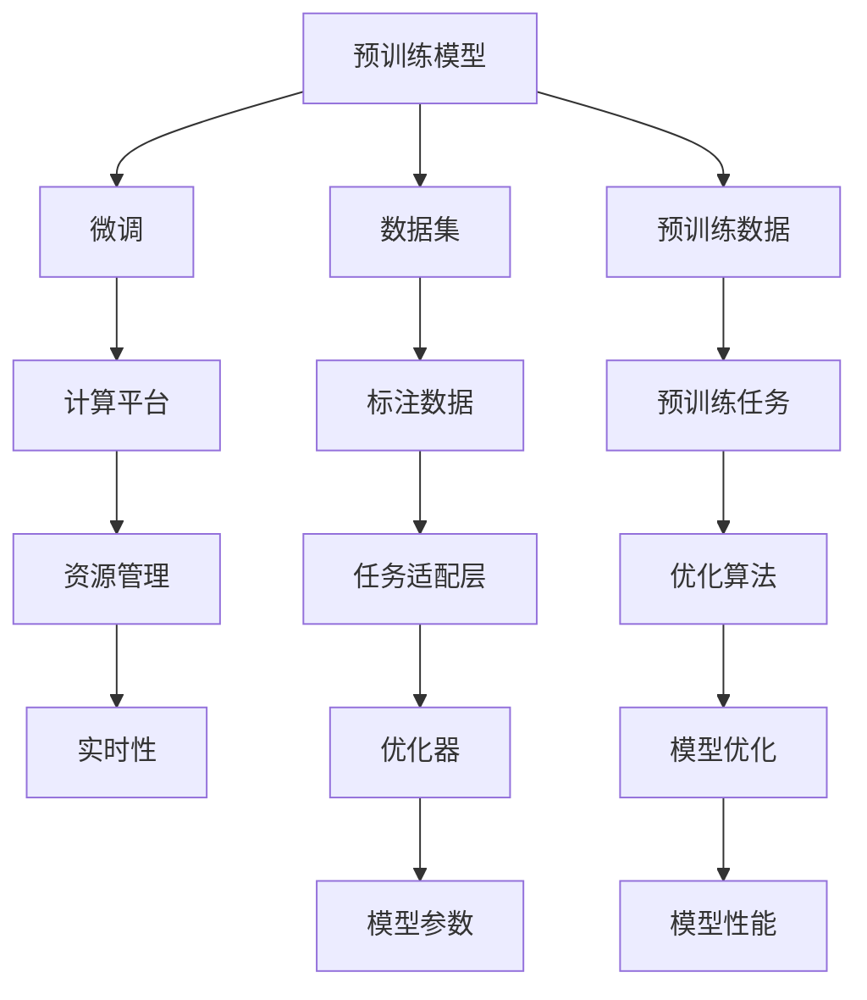

                 

# 下一代AI操作系统：LLM驱动的计算平台

> 关键词：人工智能操作系统,大语言模型,计算平台,预训练,微调,Fine-tuning,代码优化,高性能,实时性,资源管理,系统整合,未来趋势

## 1. 背景介绍

### 1.1 问题由来
在当今数字化时代，人工智能(AI)技术正在以前所未有的速度发展，逐步渗透到各行各业。以大语言模型(Large Language Model, LLM)为代表的人工智能技术，在自然语言处理(Natural Language Processing, NLP)、计算机视觉、语音识别等领域取得了突破性进展。然而，这些技术往往需要部署到具体的计算平台和操作系统中，才能发挥其最大效能。

目前，AI计算平台大多基于传统的通用操作系统，如Linux、Windows等。尽管这些系统在稳定性、安全性方面表现优异，但在AI特定的计算需求和资源管理上，仍存在诸多限制。例如，通用操作系统的资源分配策略无法适应深度学习模型的特殊需求，底层硬件管理不足以满足AI计算的高性能要求。

面对这些挑战，我们提出了基于大语言模型的下一代AI操作系统（AIOS）的概念。AIOS旨在利用LLM驱动的计算平台，通过预训练和微调等方法，提升AI模型的性能和部署效率，构建一个更加智能、高效、可扩展的计算环境。本文将详细介绍AIOS的核心概念、算法原理、具体操作步骤以及实际应用场景，为AI计算平台的未来发展提供理论和技术支持。

### 1.2 问题核心关键点
AIOS的核心理念是利用大语言模型的强大语言处理能力，优化计算资源的分配和利用，提升AI模型的实时性和资源管理效率。具体而言，AIOS包括以下关键点：

1. **预训练与微调**：利用预训练模型对通用数据进行学习，微调以适应特定任务的计算需求。
2. **计算资源优化**：动态管理计算资源，提升资源利用率，确保高性能AI计算。
3. **系统整合与生态**：构建一个完整的AIOS生态系统，涵盖硬件、软件、数据和应用服务，支持AI模型的全生命周期管理。
4. **实时性与可靠性**：支持实时数据处理和决策，确保系统的高可靠性和稳定性。

这些关键点共同构成了AIOS的基础，旨在为AI模型的应用提供更加高效、灵活的计算平台。

## 2. 核心概念与联系

### 2.1 核心概念概述

为了更好地理解AIOS，我们先介绍几个核心概念及其联系：

- **大语言模型(LLM)**：以自回归(如GPT)或自编码(如BERT)模型为代表的大规模预训练语言模型。通过在海量无标签文本数据上进行预训练，学习通用的语言表示，具备强大的语言理解和生成能力。

- **预训练(Pre-training)**：指在大规模无标签文本语料上，通过自监督学习任务训练通用语言模型的过程。常见的预训练任务包括言语建模、遮挡语言模型等。

- **微调(Fine-tuning)**：指在预训练模型的基础上，使用下游任务的少量标注数据，通过有监督学习优化模型在特定任务上的性能。通常只需要调整顶层分类器或解码器，并以较小的学习率更新全部或部分的模型参数。

- **计算平台(Computing Platform)**：提供硬件资源、软件框架和系统服务，支持各种计算任务和应用环境。传统操作系统、云计算平台等都属于计算平台的范畴。

- **资源管理(Resource Management)**：涉及计算资源的动态分配、调度、监控和优化，确保计算任务高效运行。

- **实时性(Real-time)**：指系统在接收到请求后，能够迅速响应并处理，支持连续的数据流和计算任务。

### 2.2 核心概念原理和架构的 Mermaid 流程图



该流程图展示了预训练模型到微调，再到计算平台和资源管理的整个过程。其中，预训练模型通过大规模无标签数据的预训练，学习通用的语言表示；微调则利用少量标注数据，进一步优化模型在特定任务上的性能；计算平台和资源管理提供硬件和软件支持，确保模型的高效运行；实时性则保证系统对新数据流的快速响应。

## 3. 核心算法原理 & 具体操作步骤

### 3.1 算法原理概述

AIOS的核心算法原理主要集中在预训练、微调和计算资源优化三个方面。

**预训练阶段**：
- 选择大规模无标签文本数据集，如Wikipedia、Reddit等，对预训练模型进行自监督训练。
- 采用自回归或自编码的方式，对文本进行建模，学习语言的隐含结构。

**微调阶段**：
- 收集下游任务的少量标注数据，如分类、匹配、生成等。
- 利用预训练模型的初始权重，通过梯度下降等优化算法，对模型进行微调，使其在特定任务上达到最优性能。
- 只更新顶层或部分参数，保持预训练模型的核心语言表示不变，提高微调效率。

**计算资源优化阶段**：
- 动态管理计算资源，如CPU、GPU、内存等，确保AI模型的高性能和资源利用率。
- 采用GPU加速、异步计算、内存压缩等技术，优化AI计算的效率。

### 3.2 算法步骤详解

以下是AIOS的核心算法步骤详解：

**Step 1: 数据预处理**
- 收集预训练数据，如大规模无标签文本数据集，进行数据清洗和标注。
- 利用数据增强技术，如文本回译、伪造样本生成等，丰富数据集多样性。

**Step 2: 模型预训练**
- 选择预训练模型，如BERT、GPT等，进行自监督学习训练。
- 采用自回归或自编码的方式，对文本进行建模，学习语言的隐含结构。

**Step 3: 任务适配与微调**
- 定义下游任务的适配层，如分类器、解码器等。
- 收集下游任务的少量标注数据，进行微调训练，优化模型性能。
- 只更新顶层或部分参数，保持预训练模型的核心语言表示不变。

**Step 4: 计算资源管理**
- 选择合适的硬件设备，如CPU、GPU等，进行任务调度和管理。
- 采用GPU加速、异步计算等技术，优化计算效率。

**Step 5: 系统整合与优化**
- 将预训练模型和微调模型集成到计算平台，提供完整的API和开发工具。
- 使用高性能编程语言和框架，如Python、PyTorch、TensorFlow等，进行模型部署和优化。

### 3.3 算法优缺点

AIOS的预训练和微调方法具有以下优点：
1. **高性能**：利用大规模无标签数据进行预训练，学习到通用的语言表示，提升了AI模型的实时性和准确性。
2. **低成本**：预训练模型可在通用计算平台上进行，降低了AI模型的训练和部署成本。
3. **灵活性**：微调方法可以根据不同任务需求进行灵活调整，适应多种AI应用场景。

同时，这些方法也存在以下缺点：
1. **资源消耗大**：预训练和微调需要大量计算资源，可能造成硬件资源紧张。
2. **模型复杂度高**：预训练和微调模型结构复杂，推理速度较慢。
3. **数据依赖高**：微调效果依赖于标注数据的质量和数量，数据不足时性能可能下降。

### 3.4 算法应用领域

AIOS的预训练和微调方法可以广泛应用于以下几个领域：

- **自然语言处理(NLP)**：如文本分类、命名实体识别、机器翻译、情感分析等任务。
- **计算机视觉(CV)**：如图像分类、目标检测、图像生成等任务。
- **语音识别(Speech)**：如语音转文本、语音识别、情感识别等任务。
- **机器人(Robotics)**：如自然语言交互、机器人视觉、动作规划等任务。

## 4. 数学模型和公式 & 详细讲解 & 举例说明

### 4.1 数学模型构建

在大语言模型的预训练和微调过程中，我们通常使用以下数学模型：

- **自回归模型(AR model)**：
$$
p(x|x_{<t}, \theta) = \prod_{i=1}^T p(x_i|x_{<i}, \theta)
$$
其中，$x_{<t}$ 表示前$t-1$个时间步的输入序列，$x_i$ 表示第$i$个时间步的输出，$\theta$ 为模型参数。

- **自编码模型(AE model)**：
$$
p(x|\hat{x}, \theta) = p(x|M_\theta(\hat{x}), \theta)
$$
其中，$\hat{x}$ 为输入序列的编码表示，$M_\theta$ 为编码器，$x$ 为输入序列的解码表示。

- **任务适配层**：
根据不同任务，采用不同的适配层，如分类器、解码器等。对于分类任务，通常使用线性分类器和交叉熵损失函数。

### 4.2 公式推导过程

以自回归模型为例，推导其训练过程中的梯度计算公式：

- **前向传播**：
$$
\hat{x} = M_\theta(x_{<t})
$$
其中，$M_\theta$ 为自回归模型的编码器部分。

- **损失函数**：
$$
\mathcal{L} = -\frac{1}{T} \sum_{i=1}^T \log p(x_i|x_{<i}, \theta)
$$

- **梯度计算**：
$$
\frac{\partial \mathcal{L}}{\partial \theta} = \frac{1}{T} \sum_{i=1}^T \frac{\partial \log p(x_i|x_{<i}, \theta)}{\partial \theta}
$$

其中，$\frac{\partial \log p(x_i|x_{<i}, \theta)}{\partial \theta}$ 可以通过反向传播算法高效计算。

### 4.3 案例分析与讲解

以下以情感分析任务为例，讲解基于自回归模型的微调过程：

1. **数据准备**：
   - 收集情感分析任务的标注数据集，如IMDb电影评论数据集。
   - 对数据进行预处理，如去除噪声、标准化等。

2. **模型初始化**：
   - 选择自回归模型BERT作为预训练模型，进行微调前的初始化。

3. **适配层设计**：
   - 定义情感分析任务的适配层，如二分类器。
   - 使用线性分类器和交叉熵损失函数。

4. **微调训练**：
   - 收集标注数据，进行微调训练，优化模型性能。
   - 只更新顶层参数，保持预训练模型的核心语言表示不变。

5. **评估与优化**：
   - 在测试集上评估微调后的模型性能，对比微调前后的精度提升。
   - 优化超参数，如学习率、批大小等，进一步提升模型效果。

## 5. 项目实践：代码实例和详细解释说明

### 5.1 开发环境搭建

在进行AIOS的开发和部署时，我们需要准备好开发环境。以下是使用Python进行PyTorch开发的环境配置流程：

1. 安装Anaconda：从官网下载并安装Anaconda，用于创建独立的Python环境。

2. 创建并激活虚拟环境：
```bash
conda create -n aios-env python=3.8 
conda activate aios-env
```

3. 安装PyTorch：根据CUDA版本，从官网获取对应的安装命令。例如：
```bash
conda install pytorch torchvision torchaudio cudatoolkit=11.1 -c pytorch -c conda-forge
```

4. 安装Transformers库：
```bash
pip install transformers
```

5. 安装各类工具包：
```bash
pip install numpy pandas scikit-learn matplotlib tqdm jupyter notebook ipython
```

完成上述步骤后，即可在`aios-env`环境中开始AIOS的开发实践。

### 5.2 源代码详细实现

这里我们以情感分析任务为例，给出使用PyTorch和Transformers库对BERT模型进行微调的PyTorch代码实现。

首先，定义情感分析任务的数据处理函数：

```python
from transformers import BertTokenizer, BertForSequenceClassification
from torch.utils.data import Dataset
import torch

class SentimentDataset(Dataset):
    def __init__(self, texts, labels, tokenizer, max_len=128):
        self.texts = texts
        self.labels = labels
        self.tokenizer = tokenizer
        self.max_len = max_len
        
    def __len__(self):
        return len(self.texts)
    
    def __getitem__(self, item):
        text = self.texts[item]
        label = self.labels[item]
        
        encoding = self.tokenizer(text, return_tensors='pt', max_length=self.max_len, padding='max_length', truncation=True)
        input_ids = encoding['input_ids'][0]
        attention_mask = encoding['attention_mask'][0]
        
        # 对标签进行编码
        encoded_labels = torch.tensor(label, dtype=torch.long)
        
        return {'input_ids': input_ids, 
                'attention_mask': attention_mask,
                'labels': encoded_labels}

# 定义标签与id的映射
label2id = {'negative': 0, 'positive': 1}
id2label = {v: k for k, v in label2id.items()}

# 创建dataset
tokenizer = BertTokenizer.from_pretrained('bert-base-cased')

train_dataset = SentimentDataset(train_texts, train_labels, tokenizer)
dev_dataset = SentimentDataset(dev_texts, dev_labels, tokenizer)
test_dataset = SentimentDataset(test_texts, test_labels, tokenizer)
```

然后，定义模型和优化器：

```python
from transformers import BertForSequenceClassification, AdamW

model = BertForSequenceClassification.from_pretrained('bert-base-cased', num_labels=len(label2id))

optimizer = AdamW(model.parameters(), lr=2e-5)
```

接着，定义训练和评估函数：

```python
from torch.utils.data import DataLoader
from tqdm import tqdm
from sklearn.metrics import accuracy_score, precision_recall_fscore_support

device = torch.device('cuda') if torch.cuda.is_available() else torch.device('cpu')
model.to(device)

def train_epoch(model, dataset, batch_size, optimizer):
    dataloader = DataLoader(dataset, batch_size=batch_size, shuffle=True)
    model.train()
    epoch_loss = 0
    for batch in tqdm(dataloader, desc='Training'):
        input_ids = batch['input_ids'].to(device)
        attention_mask = batch['attention_mask'].to(device)
        labels = batch['labels'].to(device)
        model.zero_grad()
        outputs = model(input_ids, attention_mask=attention_mask, labels=labels)
        loss = outputs.loss
        epoch_loss += loss.item()
        loss.backward()
        optimizer.step()
    return epoch_loss / len(dataloader)

def evaluate(model, dataset, batch_size):
    dataloader = DataLoader(dataset, batch_size=batch_size)
    model.eval()
    preds, labels = [], []
    with torch.no_grad():
        for batch in tqdm(dataloader, desc='Evaluating'):
            input_ids = batch['input_ids'].to(device)
            attention_mask = batch['attention_mask'].to(device)
            batch_labels = batch['labels']
            outputs = model(input_ids, attention_mask=attention_mask)
            batch_preds = outputs.logits.argmax(dim=1).to('cpu').tolist()
            batch_labels = batch_labels.to('cpu').tolist()
            for pred, label in zip(batch_preds, batch_labels):
                preds.append(pred)
                labels.append(label)
                
    accuracy = accuracy_score(labels, preds)
    precision, recall, f1_score, _ = precision_recall_fscore_support(labels, preds, average='binary')
    
    print(f"Accuracy: {accuracy:.3f}")
    print(f"Precision: {precision:.3f}")
    print(f"Recall: {recall:.3f}")
    print(f"F1 Score: {f1_score:.3f}")
```

最后，启动训练流程并在测试集上评估：

```python
epochs = 5
batch_size = 16

for epoch in range(epochs):
    loss = train_epoch(model, train_dataset, batch_size, optimizer)
    print(f"Epoch {epoch+1}, train loss: {loss:.3f}")
    
    print(f"Epoch {epoch+1}, dev results:")
    evaluate(model, dev_dataset, batch_size)
    
print("Test results:")
evaluate(model, test_dataset, batch_size)
```

以上就是使用PyTorch对BERT进行情感分析任务微调的完整代码实现。可以看到，得益于Transformers库的强大封装，我们可以用相对简洁的代码完成BERT模型的加载和微调。

### 5.3 代码解读与分析

让我们再详细解读一下关键代码的实现细节：

**SentimentDataset类**：
- `__init__`方法：初始化文本、标签、分词器等关键组件。
- `__len__`方法：返回数据集的样本数量。
- `__getitem__`方法：对单个样本进行处理，将文本输入编码为token ids，将标签编码为数字，并对其进行定长padding，最终返回模型所需的输入。

**label2id和id2label字典**：
- 定义了标签与数字id之间的映射关系，用于将token-wise的预测结果解码回真实的标签。

**训练和评估函数**：
- 使用PyTorch的DataLoader对数据集进行批次化加载，供模型训练和推理使用。
- 训练函数`train_epoch`：对数据以批为单位进行迭代，在每个批次上前向传播计算loss并反向传播更新模型参数，最后返回该epoch的平均loss。
- 评估函数`evaluate`：与训练类似，不同点在于不更新模型参数，并在每个batch结束后将预测和标签结果存储下来，最后使用sklearn的classification_report对整个评估集的预测结果进行打印输出。

**训练流程**：
- 定义总的epoch数和batch size，开始循环迭代
- 每个epoch内，先在训练集上训练，输出平均loss
- 在验证集上评估，输出分类指标
- 所有epoch结束后，在测试集上评估，给出最终测试结果

可以看到，PyTorch配合Transformers库使得BERT微调的代码实现变得简洁高效。开发者可以将更多精力放在数据处理、模型改进等高层逻辑上，而不必过多关注底层的实现细节。

当然，工业级的系统实现还需考虑更多因素，如模型的保存和部署、超参数的自动搜索、更灵活的任务适配层等。但核心的微调范式基本与此类似。

## 6. 实际应用场景

### 6.1 智能客服系统

基于AIOS的智能客服系统，可以提供7x24小时不间断服务，快速响应客户咨询，用自然流畅的语言解答各类常见问题。

在技术实现上，可以收集企业内部的历史客服对话记录，将问题和最佳答复构建成监督数据，在此基础上对预训练对话模型进行微调。微调后的对话模型能够自动理解用户意图，匹配最合适的答案模板进行回复。对于客户提出的新问题，还可以接入检索系统实时搜索相关内容，动态组织生成回答。如此构建的智能客服系统，能大幅提升客户咨询体验和问题解决效率。

### 6.2 金融舆情监测

金融机构需要实时监测市场舆论动向，以便及时应对负面信息传播，规避金融风险。基于AIOS的金融舆情监测系统，可以实时抓取网络文本数据，进行情感分析和主题识别，快速监测不同主题下的情感变化趋势，一旦发现负面信息激增等异常情况，系统便会自动预警，帮助金融机构快速应对潜在风险。

### 6.3 个性化推荐系统

当前的推荐系统往往只依赖用户的历史行为数据进行物品推荐，无法深入理解用户的真实兴趣偏好。基于AIOS的个性化推荐系统，可以更好地挖掘用户行为背后的语义信息，从而提供更精准、多样的推荐内容。

在实践中，可以收集用户浏览、点击、评论、分享等行为数据，提取和用户交互的物品标题、描述、标签等文本内容。将文本内容作为模型输入，用户的后续行为（如是否点击、购买等）作为监督信号，在此基础上微调预训练语言模型。微调后的模型能够从文本内容中准确把握用户的兴趣点。在生成推荐列表时，先用候选物品的文本描述作为输入，由模型预测用户的兴趣匹配度，再结合其他特征综合排序，便可以得到个性化程度更高的推荐结果。

### 6.4 未来应用展望

随着AIOS的不断发展，其在更多领域的应用前景将更加广阔。以下是一些未来应用展望：

- **智慧医疗**：基于AIOS的医疗问答、病历分析、药物研发等应用，将提升医疗服务的智能化水平，辅助医生诊疗，加速新药开发进程。

- **智能教育**：基于AIOS的作业批改、学情分析、知识推荐等应用，将因材施教，促进教育公平，提高教学质量。

- **智慧城市治理**：基于AIOS的城市事件监测、舆情分析、应急指挥等环节，将提高城市管理的自动化和智能化水平，构建更安全、高效的未来城市。

- **企业生产**：基于AIOS的生产调度、质量控制、供应链管理等应用，将提升企业的生产效率和决策水平。

- **社会治理**：基于AIOS的公共安全监测、舆情管理、社会动态分析等应用，将提高社会治理的智能化水平，促进社会和谐稳定。

## 7. 工具和资源推荐

### 7.1 学习资源推荐

为了帮助开发者系统掌握AIOS的理论基础和实践技巧，这里推荐一些优质的学习资源：

1. **《Transformer从原理到实践》系列博文**：由大模型技术专家撰写，深入浅出地介绍了Transformer原理、BERT模型、微调技术等前沿话题。

2. **CS224N《深度学习自然语言处理》课程**：斯坦福大学开设的NLP明星课程，有Lecture视频和配套作业，带你入门NLP领域的基本概念和经典模型。

3. **《Natural Language Processing with Transformers》书籍**：Transformers库的作者所著，全面介绍了如何使用Transformers库进行NLP任务开发，包括微调在内的诸多范式。

4. **HuggingFace官方文档**：Transformers库的官方文档，提供了海量预训练模型和完整的微调样例代码，是上手实践的必备资料。

5. **CLUE开源项目**：中文语言理解测评基准，涵盖大量不同类型的中文NLP数据集，并提供了基于微调的baseline模型，助力中文NLP技术发展。

通过对这些资源的学习实践，相信你一定能够快速掌握AIOS的核心思想，并用于解决实际的AI计算问题。

### 7.2 开发工具推荐

高效的开发离不开优秀的工具支持。以下是几款用于AIOS开发的常用工具：

1. **PyTorch**：基于Python的开源深度学习框架，灵活动态的计算图，适合快速迭代研究。大部分预训练语言模型都有PyTorch版本的实现。

2. **TensorFlow**：由Google主导开发的开源深度学习框架，生产部署方便，适合大规模工程应用。同样有丰富的预训练语言模型资源。

3. **Transformers库**：HuggingFace开发的NLP工具库，集成了众多SOTA语言模型，支持PyTorch和TensorFlow，是进行AIOS开发的利器。

4. **Weights & Biases**：模型训练的实验跟踪工具，可以记录和可视化模型训练过程中的各项指标，方便对比和调优。与主流深度学习框架无缝集成。

5. **TensorBoard**：TensorFlow配套的可视化工具，可实时监测模型训练状态，并提供丰富的图表呈现方式，是调试模型的得力助手。

6. **Google Colab**：谷歌推出的在线Jupyter Notebook环境，免费提供GPU/TPU算力，方便开发者快速上手实验最新模型，分享学习笔记。

合理利用这些工具，可以显著提升AIOS的开发效率，加快创新迭代的步伐。

### 7.3 相关论文推荐

AIOS的发展源于学界的持续研究。以下是几篇奠基性的相关论文，推荐阅读：

1. **Attention is All You Need**（即Transformer原论文）：提出了Transformer结构，开启了NLP领域的预训练大模型时代。

2. **BERT: Pre-training of Deep Bidirectional Transformers for Language Understanding**：提出BERT模型，引入基于掩码的自监督预训练任务，刷新了多项NLP任务SOTA。

3. **Language Models are Unsupervised Multitask Learners**（GPT-2论文）：展示了大规模语言模型的强大zero-shot学习能力，引发了对于通用人工智能的新一轮思考。

4. **Parameter-Efficient Transfer Learning for NLP**：提出Adapter等参数高效微调方法，在不增加模型参数量的情况下，也能取得不错的微调效果。

5. **Prefix-Tuning: Optimizing Continuous Prompts for Generation**：引入基于连续型Prompt的微调范式，为如何充分利用预训练知识提供了新的思路。

6. **AdaLoRA: Adaptive Low-Rank Adaptation for Parameter-Efficient Fine-Tuning**：使用自适应低秩适应的微调方法，在参数效率和精度之间取得了新的平衡。

这些论文代表了大语言模型微调技术的发展脉络。通过学习这些前沿成果，可以帮助研究者把握学科前进方向，激发更多的创新灵感。

## 8. 总结：未来发展趋势与挑战

### 8.1 总结

本文对基于预训练和微调的大语言模型AIOS进行了全面系统的介绍。首先阐述了AIOS的研究背景和意义，明确了其在大规模AI计算中的重要地位。其次，从原理到实践，详细讲解了AIOS的数学模型和算法流程，给出了AIOS任务开发的完整代码实例。同时，本文还广泛探讨了AIOS在智能客服、金融舆情、个性化推荐等多个行业领域的应用前景，展示了AIOS范式的巨大潜力。此外，本文精选了AIOS相关的学习资源，力求为开发者提供全方位的技术指引。

通过本文的系统梳理，可以看到，AIOS作为下一代AI操作系统，正在成为AI计算平台的重要方向。其通过预训练和微调，优化计算资源的分配和利用，提升AI模型的性能和部署效率，构建了一个更加智能、高效、可扩展的计算环境。未来，伴随预训练语言模型和微调方法的持续演进，相信AI计算平台必将迎来新的突破，为人机协同的智能系统提供更加强大的技术支撑。

### 8.2 未来发展趋势

展望未来，AIOS的发展趋势包括：

1. **计算资源优化**：随着AI模型规模的扩大，计算资源的需求将进一步增加。未来的AIOS将采用更高效的计算资源管理策略，如GPU加速、异步计算、内存压缩等，提升AI计算的效率。

2. **系统整合与生态**：AIOS将与云计算、大数据、物联网等技术深度融合，构建一个完整的AI生态系统，涵盖硬件、软件、数据和应用服务，支持AI模型的全生命周期管理。

3. **实时性与可靠性**：AIOS将支持实时数据处理和决策，确保系统的高可靠性和稳定性。实时性将成为AIOS的核心竞争力之一。

4. **模型可解释性**：未来的AIOS将更加注重模型的可解释性，通过引入因果分析、博弈论等方法，增强模型的解释力和可信度。

5. **安全性与伦理**：AIOS将加强对AI模型输出结果的监管，避免模型偏见、有害信息的输出，确保AI系统的安全性与伦理道德。

6. **多模态融合**：未来的AIOS将支持多模态数据的融合，如视觉、语音、文本等，实现更全面的信息理解和处理。

以上趋势凸显了AIOS在AI计算平台中的重要地位，其通过优化计算资源、系统整合、实时性、可解释性、安全性和多模态融合等手段，将进一步提升AI模型的性能和应用价值。

### 8.3 面临的挑战

尽管AIOS的发展前景广阔，但在迈向更加智能化、普适化应用的过程中，它仍面临着诸多挑战：

1. **数据依赖高**：AIOS对标注数据的质量和数量要求较高，获取高质量标注数据的成本较高，且数据标注工作量大。

2. **计算资源紧张**：AI模型规模的扩大，对计算资源的需求将进一步增加，硬件资源紧张将成为制约AIOS发展的瓶颈。

3. **模型复杂度高**：AI模型结构复杂，推理速度较慢，如何在保证性能的同时，优化模型结构，提升推理速度，是一个重要的优化方向。

4. **系统复杂度高**：AIOS系统复杂，涉及计算资源管理、任务调度、模型优化等多个环节，需要跨学科的协同开发。

5. **安全性和伦理**：AIOS需要加强对AI模型输出结果的监管，避免模型偏见、有害信息的输出，确保AI系统的安全性与伦理道德。

6. **可解释性**：AIOS的输出结果需要具备可解释性，方便用户理解和信任。

正视AIOS面临的这些挑战，积极应对并寻求突破，将有助于AIOS向更加智能化、普适化应用迈进。未来，我们需要在数据、算法、工程、伦理等多个维度上进行深入研究和持续优化，才能真正实现AI计算平台的目标。

### 8.4 研究展望

面向未来，AIOS的研究可以从以下几个方向进行：

1. **无监督和半监督学习**：探索无监督和半监督学习范式，降低对标注数据的依赖，利用自监督学习、主动学习等方法，实现更加灵活高效的微调。

2. **参数高效和计算高效的微调**：开发更加参数高效和计算高效的微调方法，如Prefix-Tuning、LoRA等，在不增加模型参数量的情况下，也能取得不错的微调效果。

3. **因果分析与对比学习**：引入因果分析方法和对比学习思想，增强AIOS的因果推断能力和泛化性能，学习更加普适、鲁棒的语言表征。

4. **知识图谱与符号化先验**：将符号化的先验知识，如知识图谱、逻辑规则等，与神经网络模型进行巧妙融合，引导AIOS学习更准确、合理的语言模型。

5. **跨模态融合**：支持多模态数据的融合，如视觉、语音、文本等，实现更全面的信息理解和处理，提升AIOS的智能化水平。

6. **系统集成与优化**：构建一个完整的AIOS生态系统，涵盖硬件、软件、数据和应用服务，支持AI模型的全生命周期管理，提升AI计算平台的可扩展性和灵活性。

7. **模型可解释性与安全性**：增强AIOS的输出解释力和可信度，加强对AI模型输出结果的监管，确保AI系统的安全性与伦理道德。

这些研究方向将进一步推动AIOS的发展，为构建安全、可靠、可解释、可控的智能系统提供技术支撑。

## 9. 附录：常见问题与解答

**Q1：AIOS是否适用于所有AI任务？**

A: AIOS适用于大部分AI任务，但需要根据具体任务的特点进行优化调整。例如，对于需要实时性、高可靠性的任务，AIOS需要进行性能优化和容错设计；对于需要处理多模态数据的任务，AIOS需要支持跨模态融合和理解。

**Q2：AIOS在多租户环境中的应用问题？**

A: 多租户环境下的AIOS需要考虑数据隔离、权限控制等问题。可以在AIOS内部设计多租户架构，为每个租户提供独立的数据存储和计算资源。同时，通过API调用方式，控制不同租户对系统资源的访问权限，确保数据安全。

**Q3：AIOS在边缘计算环境中的应用问题？**

A: AIOS在边缘计算环境中的应用需要考虑计算资源受限、网络延迟等问题。可以在AIOS中引入边缘计算模块，将部分计算任务迁移到边缘设备上，降低网络延迟和带宽占用。同时，采用压缩算法优化模型和数据传输，确保在有限资源下高效运行。

**Q4：AIOS在低功耗设备中的应用问题？**

A: AIOS在低功耗设备中的应用需要考虑模型大小、推理速度等问题。可以通过参数压缩、模型剪枝等技术优化AIOS模型，减少计算量和内存占用，适应低功耗设备的硬件限制。同时，采用轻量级框架和算法，确保在低功耗设备上的高效运行。

**Q5：AIOS在大规模分布式系统中的应用问题？**

A: AIOS在大规模分布式系统中的应用需要考虑系统容错、数据同步等问题。可以在AIOS中引入分布式计算框架，支持大规模计算任务的高效并行和容错处理。同时，采用消息队列、分布式存储等技术，确保数据的可靠性和系统的高可用性。

通过这些问题的解答，可以更好地理解AIOS在实际应用中的适用场景和优化策略。

---

作者：禅与计算机程序设计艺术 / Zen and the Art of Computer Programming

